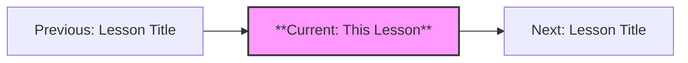
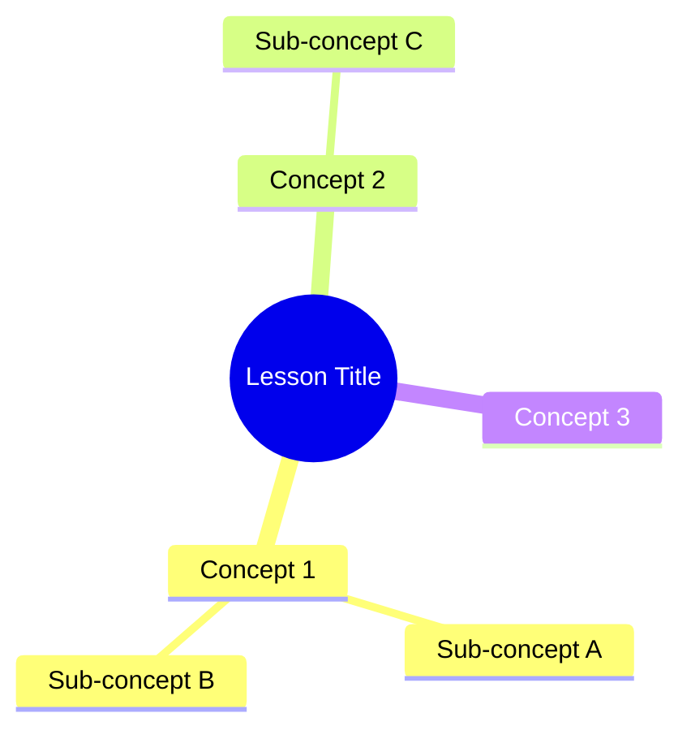

# Note Template — Learning on Web

> This template defines the structure for each learning note. The middle section varies by content type (from course-spec.json). Sections marked [REQUIRED] must appear in every note. Sections marked [FLEXIBLE] adapt to the content.

---

## [REQUIRED] Opening

### TL;DR

> 3-5 key takeaways from this lesson. Each should be a complete thought, not a fragment.
> Written from the perspective defined in course-spec.json.

### Table of Contents

> Auto-generated from section headings.

### Learning Path

> Where this lesson sits in the overall course. Use Mermaid flowchart.



### Content Mind Map

> Visual overview of this lesson's concepts. Use Mermaid mindmap.



---

## [FLEXIBLE] Middle — Choose Based on Content Type

### For `concept-heavy` content:

1. **Core Concept** — Definition in the author's own words (not textbook definition)
2. **Why This Matters** — Real-world significance from the specified perspective
3. **The Practitioner's View** — Insights from the course-spec perspective (e.g., "As an LLM engineer, I see this as...")
4. **Common Misconceptions** — What people get wrong and why
5. **Applications** — Concrete, current-year examples (or classic examples marked as such)
6. **Deep Dive** (collapsible) — Extended analysis for those who want more

### For `framework` content:

1. **Origin & Context** — Where this framework came from, what problem it solves
2. **When to Use** — Clear applicability criteria (when YES, when NO)
3. **Step-by-Step** — The framework applied, with worked example
4. **Case Studies** — 2-3 real applications (at least one from the audience's domain)
5. **Practitioner Insights** — What the framework doesn't tell you (edge cases, gotchas)
6. **Comparison** — How this framework relates to alternatives

### For `tool` content:

1. **Positioning** — What this tool is and isn't (one-sentence positioning)
2. **Evaluation Table** — Comparison with alternatives (structured table)
3. **Quick Start** — Minimum viable usage (get results in 5 minutes)
4. **Common Pitfalls** — What trips up beginners (and intermediates)
5. **Power Features** — Advanced usage that 80% of users miss
6. **Alternatives** — When to choose something else

### For `process` content:

1. **Process Flowchart** — Mermaid flowchart with decision points
2. **Overview** — What this process achieves, who runs it, when
3. **Decision Points** — Where the process branches, and how to decide
4. **Checklists** — Step-by-step actionable checklist for each phase
5. **Scenarios** — "What if..." situations and how to handle them
6. **Anti-Patterns** — Common ways this process goes wrong

### For `soft-skill` content:

1. **Scenarios** — 2-3 realistic situations where this skill matters
2. **Do vs Don't** — Side-by-side comparison of effective vs ineffective approaches
3. **Dialogue Templates** — Example phrases/scripts for common situations
4. **Exercises** — Practice activities (role-play prompts, self-reflection questions)
5. **Self-Assessment** — How to evaluate your own proficiency
6. **Growth Path** — From beginner to advanced, what does mastery look like?

---

## [REQUIRED] Ending

### Terminology Table

> ALL technical terms introduced in this lesson. Every. Single. One.

| Term (Original) | Term (Target Language) | Definition |
|-----------------|----------------------|------------|
| ... | ... | ... |

### Key Points

**Must Know (核心必学):**
- Point 1
- Point 2
- Point 3

**Good to Know (拓展了解):**
- Point 1
- Point 2

### Self-Test Questions

> Test UNDERSTANDING, not memorization. Questions should require applying concepts, not recalling definitions.

1. [Scenario-based question]
2. [Application question]
3. [Compare/contrast question]

<details>
<summary>Reference Answers</summary>

1. [Answer with explanation]
2. [Answer with explanation]
3. [Answer with explanation]

</details>

### Practice Tasks

> Actionable in the real world. Not homework — real tasks the learner can do at work or in a project.

- [ ] Task 1: [Specific, actionable, with clear completion criteria]
- [ ] Task 2: [Specific, actionable, with clear completion criteria]

### Next Section Preview

> Brief teaser of what comes next, creating a narrative bridge.

---

## Interactive Elements Library

Use these throughout the note as appropriate:

```markdown
<!-- Collapsible deep-dives -->
<details>
<summary>深入了解：[Topic]</summary>
Detailed content here...
</details>

<!-- Functional callout boxes (acceptable — serve as visual category markers) -->
> 💡 **洞察**：Key insight that changes how you think about this
> ⚠️ **注意**：Warning or common mistake to avoid
> 🎯 **实战提示**：Practical tip you can use immediately
> 📌 **必学**：Essential concept — don't skip this
> 💎 **经典案例**：Timeless example worth studying

<!-- Mermaid diagrams — use 2-5 per note -->
<!-- Types: mindmap, flowchart, sequenceDiagram, gantt, classDiagram -->
```

---

## Quality Reminders

Before saving this note, verify:

- [ ] TL;DR captures the essential 3-5 takeaways
- [ ] Mind map reflects ACTUAL content, not generic categories
- [ ] At least 2-3 Mermaid diagrams
- [ ] Examples are current-year OR marked as classics
- [ ] Terminology table includes ALL technical terms
- [ ] Self-test questions test understanding, not memorization
- [ ] Practice tasks are actionable
- [ ] Content adds value BEYOND the source material
- [ ] Written from the specified perspective
- [ ] **Passes the "human-written" test** — no AI artifacts
- [ ] **No decorative emojis** — only functional callout markers
