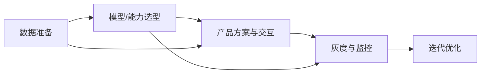

# 企业产品经理的角色 | The Enterprise Product Manager's Role

## 核心要点 (TL;DR)

- 产品经理是连接业务目标、用户需求和技术可行性的桥梁，需在三者间找到最优平衡点
- AI产品经理与传统PM的核心差异在于技术理解深度、迭代速度和不确定性管理
- 产品经理的旅程包含四个关键阶段：创意构思 → 战略规划 → 执行开发 → 发布运营
- 2026年中国AI产品经理需掌握大模型应用、Prompt工程基础和AI合规要求
- 真正的价值创造不在于堆砌功能，而在于解决实际问题并推动业务增长

## 目录

1. [产品经理的本质定位](#产品经理的本质定位)
2. [AI PM vs 传统PM：角色演进](#ai-pm-vs-传统pm角色演进)
3. [产品经理的四阶段旅程](#产品经理的四阶段旅程)
4. [核心能力矩阵](#核心能力矩阵)
5. [2026中国AI产品经理实践](#2026中国ai产品经理实践)
6. [术语表](#术语表)
7. [自测题](#自测题)
8. [实践任务](#实践任务)
9. [下一节预告](#下一节预告)

---

## 产品经理的本质定位

产品经理(Product Manager, PM)的核心职责可以用一个三角模型来理解：

```
        用户需求 (User Needs)
              /\
             /  \
            /    \
           /  PM  \
          /        \
         /          \
        /____________\
   业务目标          技术可行性
(Business Goals)  (Technical Feasibility)
```

### 三维平衡的艺术

产品经理并非简单的"需求搬运工"，而是在三个维度间寻找最优解的决策者：

| 维度 | 关注点 | 常见挑战 | AI产品特殊性 |
|------|--------|---------|-------------|
| **用户需求** | 痛点识别、体验优化 | 需求真伪判断、优先级排序 | AI幻觉管理、期望值设定 |
| **业务目标** | 收入增长、成本控制 | 短期KPI vs 长期价值 | 算力成本、ROI计算复杂 |
| **技术可行性** | 架构选型、工期评估 | 技术债务累积、资源约束 | 模型迭代周期、数据依赖 |

**示例对比：传统电商 vs AI电商助手**

传统电商PM关注商品推荐算法准确率（技术）、转化率提升（业务）、购物体验流畅度（用户）。

2026年AI电商助手PM需额外考虑：
- 大模型理解准确率（用户提问→商品推荐的语义理解）
- 每次对话的Token成本与转化价值比（业务）
- 推荐结果的可解释性与合规性（技术+监管）

> 💡 **实战洞察**：AI产品的推理成本往往以“输入/输出 Token”计费，PM需要在功能设计阶段就把“成本上限”纳入验收标准与灰度策略中（例如：限制上下文长度、启用缓存、给高成本能力加开关）。阿里云百炼公开说明其文本生成按输入/输出 Token 计费，可参考：https://help.aliyun.com/zh/model-studio/model-pricing

---

## AI PM vs 传统PM：角色演进

2026年，AI产品经理已成为独立职业方向。与传统PM相比，核心差异体现在五个维度：

### 差异对比矩阵

| 能力维度 | 传统PM | AI PM (2026) | 重要性变化 |
|---------|--------|-------------|-----------|
| **技术理解深度** | 了解API、数据库基础 | 理解Transformer、RAG、Agent架构 | ↑↑↑ 从"知道"到"理解" |
| **产品迭代周期** | 2-4周Sprint | 模型周迭代（1-2周）+ 功能迭代 | ↑↑ 双轨并行 |
| **数据驱动决策** | AB测试、漏斗分析 | + 模型性能监控、幻觉率追踪 | ↑ 新增AI指标体系 |
| **合规风险管理** | 隐私保护、内容审核 | + 算法备案、深度合成标识 | ↑↑↑ 中国AI监管严格 |
| **成本结构** | 研发人力、服务器 | + 算力成本(GPU)、模型训练/推理 | ↑↑ 算力成本显著上升 |

<details>
<summary>深入了解：中国AI产品经理的"三个必备认知"</summary>

**1. 模型能力边界认知**
不同模型的能力边界差异很大，而且更新很快。对PM来说更重要的是建立“可验证”的判断方式：
- 以**官方产品说明/开发文档/计费规则**为准（能力与限制写得最清楚）
- 对关键能力（长上下文、工具调用、文件解析、合规能力）做一次**可复现的小测试**再下结论

一些国内常见入口（官方站点）：
- 通义千问：https://tongyi.aliyun.com/qianwen/
- 文心一言：https://yiyan.baidu.com/
- Kimi：https://kimi.moonshot.cn/
- 豆包：https://www.doubao.com/

**2. 中国AI监管认知**
必须了解的三大法规：
- [《生成式人工智能服务管理暂行办法》](https://www.cac.gov.cn/2023-07/13/c_1690898327029107.htm)（2023年8月15日起施行）
- [《互联网信息服务深度合成管理规定》](https://www.cac.gov.cn/2022-12/11/c_1672221949354811.htm)（2023年1月10日起施行）
- [《互联网信息服务算法推荐管理规定》](https://www.cac.gov.cn/2022-01/04/c_1642894606364259.htm)（2022年3月1日起施行）

**3. 成本优化认知**
AI产品的成本优化不是研发的事，是PM的职责。常见手段：
- Prompt压缩（减少Token消耗）
- 模型降级策略（简单任务用小模型）
- 缓存机制（相似问题直接返回）
- 流式输出（提升体验感知，实际成本不变）

</details>

---

## 产品经理的四阶段旅程

无论是传统产品还是AI产品，PM的工作都遵循一个完整周期。但AI产品在每个阶段都有特殊考量。

### 阶段1：创意构思 (Ideation)

**核心任务**：从用户反馈、市场数据中识别并筛选创意

传统方法：
- 用户访谈、问卷调研
- 竞品分析、市场报告
- 内部头脑风暴

AI产品增强：
- 使用通义千问分析用户反馈文本（官方入口：https://tongyi.aliyun.com/qianwen/）
- 使用Kimi处理长文档与资料阅读（官方入口：https://kimi.moonshot.cn/）
- 用豆包快速生成对话原型/提示词草案（官方入口：https://www.doubao.com/）
- 用飞书妙记记录讨论并沉淀纪要与行动项（飞书官方介绍：https://www.feishu.cn/content/article/7578773484596153570）

**公开产品示例**：飞书妙记在官方介绍中提到会自动提取会议要点、待办事项等信息，可用于把“讨论内容”更快转成“可执行的行动清单”（来源：飞书官方介绍）：https://www.feishu.cn/content/article/7578773484596153570

> 💡 **实战洞察**：创意阶段最大的坑是"伪需求"。判断标准：用户说"我想要X"往往是伪需求，用户抱怨"我每天要手动做Y三次"才是真需求。AI产品尤其如此——不要问用户想要什么AI功能，而要问他们现在哪些工作最繁琐。

### 阶段2：战略规划 (Strategy & Planning)

**核心任务**：定义路线图、设定目标、协调跨部门资源

关键输出：
- 产品愿景文档 (Product Vision)
- 产品路线图 (Product Roadmap)
- PRD需求文档 (Product Requirements Document)

AI产品的特殊规划点：



**工具选型（中国市场常见入口）**：
- 飞书项目：https://project.feishu.cn/home
- Teambition：https://www.teambition.com/
- PingCode：https://pingcode.com/
- Worktile：https://worktile.com/
- 飞书文档：https://www.feishu.cn/product/docs
- 语雀：https://www.yuque.com/

### 阶段3：执行开发 (Execution)

**核心任务**：敏捷迭代、跨团队协同、风险管理

AI产品经理的日常（参考）：

| 时间 | 活动 | 传统PM | AI PM特有 |
|------|------|--------|----------|
| 09:00-09:30 | 晨会 | ✅ Sprint进度同步 | ✅ + 模型性能日报 |
| 10:00-11:00 | 需求评审 | ✅ 与研发讨论可行性 | ✅ + 与算法讨论模型能力边界 |
| 14:00-15:00 | 数据分析 | ✅ 用户行为漏斗 | ✅ + 幻觉率、拒答率、Token成本 |
| 15:30-16:30 | 用户访谈 | ✅ 体验反馈 | ✅ + AI输出质量评估 |
| 17:00-18:00 | 路线图调整 | ✅ 功能优先级 | ✅ + 模型升级计划 |

**AI产品的敏捷特殊性**：双轨迭代

传统Scrum是单轨的（功能迭代），AI产品是双轨：
- **功能轨**：2周一个Sprint（前端交互、业务逻辑）
- **模型轨**：1-4周一个模型版本（数据标注→训练→评估→上线）

两轨需要解耦但同步。模型升级不应阻塞功能迭代。

### 阶段4：发布运营 (Launch & Ops)

**核心任务**：GTM策略、指标监控、持续优化

AI产品的关键指标体系：

**基础指标（所有产品）**：
- DAU/MAU、留存率、转化率、NPS

**AI特有指标**：
- 模型准确率 (Accuracy)
- 幻觉率 (Hallucination Rate) - AI输出虚假信息的比例
- 拒答率 (Refusal Rate) - AI拒绝回答的比例
- 平均Token消耗 (Avg Tokens per Session)
- 单次对话成本 (Cost per Conversation)

在AI原生应用中，输出质量需要“可度量、可回放、可迭代”：把典型失败样本沉淀为样本集，建立灰度开关与回滚机制，并持续监控输出质量与成本指标。

> 💡 **实战洞察**：AI产品的运营比传统产品复杂得多。模型会"漂移"（Performance Drift）——上线时效果很好，3个月后效果下降。原因可能是用户行为变化、数据分布偏移。解决方案是建立持续监控+定期重训机制。业界最佳实践是建立定期的模型健康度检查机制，当核心指标下降到一定阈值时，自动触发重训流程。

---

## 核心能力矩阵

一个优秀的企业产品经理需要具备的能力可以分为四大类：

### 能力四象限

|  | **硬技能 (Hard Skills)** | **软技能 (Soft Skills)** |
|---|---|---|
| **战略层** | • 市场分析 (Market Analysis)<br>• 数据分析 (Data Analytics)<br>• 商业建模 (Business Modeling) | • 战略思维 (Strategic Thinking)<br>• 业务判断 (Business Judgment)<br>• 优先级决策 (Prioritization) |
| **执行层** | • PRD撰写 (PRD Writing)<br>• 原型设计 (Prototyping)<br>• 敏捷方法 (Agile Methodologies) | • 跨部门协作 (Cross-functional Collaboration)<br>• 沟通表达 (Communication)<br>• 冲突解决 (Conflict Resolution) |

**AI产品经理额外能力**：
- 技术理解：Transformer架构、RAG原理、Prompt工程
- 成本意识：算力成本优化、模型选型ROI分析
- 合规风险：中国AI监管要求、算法备案流程

---

## 2026中国AI产品经理实践

### 典型场景1：大模型应用选型

当你要把大模型能力引入产品时，最常见的三条路径是：
- **直接调用模型服务（API）**：上线快；成本与调用量强相关；需要设计限流与降级
- **在开源模型上做定制（如微调/指令对齐）**：可控性更强；需要数据、训练与部署能力
- **RAG（检索增强生成）**：对“知识可信/可溯源”场景更友好；需要建设知识库与检索质量体系

建议先从“能力边界 + 计费规则 + 风险边界”三件事入手做可行性评估。示例：阿里云百炼公开说明文本生成按输入/输出 Token 计费，并提供不同模型规格与版本信息：https://help.aliyun.com/zh/model-studio/model-pricing

### 典型场景2：AI功能的优先级决策
传统RICE评分（Reach × Impact × Confidence / Effort）在AI功能上经常不够用，因为“模型能力与成本边界”会直接决定上线体验。

你可以在RICE基础上新增一列 **Model Maturity（模型成熟度/可控性）**，用于衡量：
- 在你的目标场景里，能力是否稳定可复现
- 是否可被监控、可解释、可回滚
- 是否能被“限流/降级/提示/人工复核”兜底

可以把表格当成评审模板（不强行填虚构分数），最终输出“先做什么、为什么、怎么灰度”。

> 💡 **实战洞察**：很多产品会在“需求明确、可交付、可验收”的场景里先落地AI能力（例如会议纪要/要点/待办提取）。参考飞书妙记产品页与介绍（官方）：https://www.feishu.cn/product/minutes

### 典型场景3：AI合规风险管理

2026年中国AI产品上线前必须完成的合规清单：

- [ ] 算法备案（网信办）
- [ ] 生成合成内容标识（显式/隐式标识等要求，需结合适用范围落实）
- [ ] 用户协议中明确AI使用范围
- [ ] 建立人工审核机制（AI输出人工抽检）
- [ ] 用户数据安全评估（数据不出境）
- [ ] 内容安全过滤（敏感词、违规内容拦截）

权威文本参考：国家网信办等部门印发的《人工智能生成合成内容标识办法》（2025-09-01起施行）：https://www.cac.gov.cn/2025-03/14/c_1743654684782215.htm

---

## 术语表 (Terminology)

| 中文术语 | English Term | 定义 (Definition) | 示例 (Example) |
|---------|--------------|------------------|----------------|
| 产品经理 | Product Manager (PM) | 负责产品全生命周期管理的角色，连接用户、业务和技术 | — |
| 最小可行产品 | Minimum Viable Product (MVP) | 具备核心功能、能快速验证方向的产品版本 | — |
| 产品路线图 | Product Roadmap | 产品中长期功能规划和时间表 | — |
| 北极星指标 | North Star Metric | 最能反映产品核心价值的关键指标 | — |
| 检索增强生成 | Retrieval-Augmented Generation (RAG) | 结合知识库检索和大模型生成的技术方案 | — |
| 幻觉率 | Hallucination Rate | AI生成不准确或不存在信息的比例 | — |
| 算力成本 | Compute Cost | AI模型训练和推理所需的计算资源成本 | — |
| 模型漂移 | Model Drift | 模型性能随时间下降的现象 | — |

---

## 自测题 (Self-Test)

**1. 产品经理的"三角平衡"指的是哪三个维度？为什么AI产品在这三个维度上的平衡更难？**

<details>
<summary>查看答案</summary>

三个维度是：用户需求、业务目标、技术可行性。

AI产品平衡更难的原因：
- 用户需求：AI能力边界不清晰，用户期望难以管理（期望AI无所不能）
- 业务目标：成本结构复杂（算力成本占比高），ROI难以预测
- 技术可行性：模型能力快速迭代，技术方案选择多样且各有trade-off

</details>

**2. 对比传统电商PM和AI电商PM，至少列出3个核心差异点。**

<details>
<summary>查看答案</summary>

核心差异：
1. 技术理解深度：传统PM了解API即可，AI PM需理解模型架构、Prompt工程
2. 成本结构：传统PM关注人力和服务器成本，AI PM需额外关注算力成本（尤其是推理调用成本）
3. 合规要求：AI PM需处理算法备案、深度合成标识等特有合规要求
4. 迭代节奏：AI PM需管理双轨迭代（功能迭代+模型迭代）
5. 指标体系：AI PM需监控幻觉率、拒答率、Token消耗等AI特有指标

</details>

**3. 产品经理的四阶段旅程中，你认为哪个阶段最容易被忽视？为什么？**

<details>
<summary>查看答案</summary>

最容易被忽视的是**发布运营阶段**。

原因：
- 很多PM认为产品上线后工作就结束了，但实际上运营阶段决定了产品的长期成功
- AI产品尤其需要持续运营：模型会漂移、用户行为会变化、竞品会迭代
- 发布后的数据分析和持续优化往往比开发阶段更重要
- 运营阶段决定产品能否持续优化与可控迭代

</details>

**4. 场景题：你负责一个AI写作助手产品，用户反馈"AI生成的文章太机械，没有感情"。作为PM，你会如何分析和解决这个问题？**

<details>
<summary>查看答案</summary>

分析框架：
1. **量化问题**：多少比例用户有此反馈？NPS影响多大？
2. **定位原因**：
   - 是模型能力问题（通用模型情感表达弱）
   - 还是Prompt设计问题（指令过于正式）
   - 或是用户期望管理问题（期望AI写得像人类作家）

解决方案（优先级排序）：
1. **短期**：优化Prompt与输出模板，加入示例与风格约束
2. **中期**：对不同模型/不同配置做对照评测，选择“质量-成本-可控性”最适合的一档
3. **长期**：建设可回放的样本集与质量评审机制，必要时做定制训练或引入RAG/工具调用降低不确定性

关键：需要设定清晰的成功指标（例如主观评分量表、编辑返工率、用户复用率等），而非仅凭主观感受。

</details>

---

## 实践任务 (Practice Tasks)

- [ ] **任务1**：选择一个你熟悉的产品（如抖音、飞书、美团），分析其PM如何平衡"用户需求-业务目标-技术可行性"三角。写下至少2个具体例子。

- [ ] **任务2**：对比分析两个相似的AI产品（如通义千问 vs 文心一言，或豆包 vs Kimi），从PM视角列出它们在产品定位、功能优先级、用户体验上的差异，并推测背后的产品决策逻辑。

- [ ] **任务3**：选择一个你熟悉的传统SaaS产品（如CRM系统）。如果你要在其中加入AI功能，请用RICE-M模型评估至少3个AI功能候选项，并给出优先级建议。

- [ ] **任务4**：调研一个2026年上线的中国AI产品，查阅其算法备案信息（可在网信办官网查询），分析其合规策略。思考：如果你是PM，会如何在功能创新和合规要求间找到平衡？

---

## 下一节预告 (Next Up)

下一节我们将深入探讨**《产品经理的技能体系》**，包括：
- 硬技能 vs 软技能的平衡
- 数据分析能力的进阶路径
- 中国市场的工具生态（飞书、Notion、石墨等）
- AI产品经理的必备技术栈

我们还将揭秘：为什么优秀的AI产品经理往往具备"T型能力结构"？如何在3个月内从传统PM转型为AI PM？

**学习路径**：
```
企业PM角色认知 → 技能体系构建 → 方法论实践
      ↓              ↓              ↓
    (本节)        (下一节)      (第3节)
```

继续前进，成为2026年中国AI产品经理的佼佼者！
