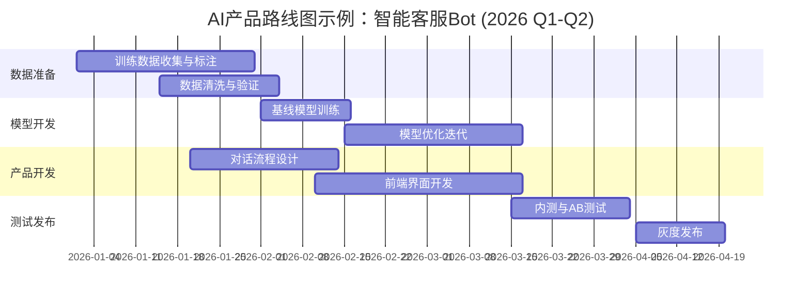

# 企业产品经理的角色 | The Enterprise Product Manager's Role

## 核心要点 (TL;DR)

- 产品经理是连接业务目标、用户需求和技术可行性的桥梁，需在三者间找到最优平衡点
- AI产品经理与传统PM的核心差异在于技术理解深度、迭代速度和不确定性管理
- 产品经理的旅程包含四个关键阶段：创意构思 → 战略规划 → 执行开发 → 发布运营
- 2026年中国AI产品经理需掌握大模型应用、Prompt工程基础和AI合规要求
- 真正的价值创造不在于堆砌功能，而在于解决实际问题并推动业务增长

## 目录

1. [产品经理的本质定位](#产品经理的本质定位)
2. [AI PM vs 传统PM：角色演进](#ai-pm-vs-传统pm角色演进)
3. [产品经理的四阶段旅程](#产品经理的四阶段旅程)
4. [核心能力矩阵](#核心能力矩阵)
5. [2026中国AI产品经理实践](#2026中国ai产品经理实践)
6. [术语表](#术语表)
7. [自测题](#自测题)
8. [实践任务](#实践任务)
9. [下一节预告](#下一节预告)

---

## 产品经理的本质定位

产品经理(Product Manager, PM)的核心职责可以用一个三角模型来理解：

```
        用户需求 (User Needs)
              /\
             /  \
            /    \
           /  PM  \
          /        \
         /          \
        /____________\
   业务目标          技术可行性
(Business Goals)  (Technical Feasibility)
```

### 三维平衡的艺术

产品经理并非简单的"需求搬运工"，而是在三个维度间寻找最优解的决策者：

| 维度 | 关注点 | 常见挑战 | AI产品特殊性 |
|------|--------|---------|-------------|
| **用户需求** | 痛点识别、体验优化 | 需求真伪判断、优先级排序 | AI幻觉管理、期望值设定 |
| **业务目标** | 收入增长、成本控制 | 短期KPI vs 长期价值 | 算力成本、ROI计算复杂 |
| **技术可行性** | 架构选型、工期评估 | 技术债务累积、资源约束 | 模型迭代周期、数据依赖 |

**示例对比：传统电商 vs AI电商助手**

传统电商PM关注商品推荐算法准确率（技术）、转化率提升（业务）、购物体验流畅度（用户）。

2026年AI电商助手PM需额外考虑：
- 大模型理解准确率（用户提问→商品推荐的语义理解）
- 每次对话的Token成本与转化价值比（业务）
- 推荐结果的可解释性与合规性（技术+监管）

> 💡 **实战洞察**：字节跳动抖音电商的AI客服产品经理曾分享，他们每周要做的一件事是"算力账本"——记录每个AI功能模块的算力消耗和业务回报。这是传统PM从未遇到的新挑战。

---

## AI PM vs 传统PM：角色演进

2026年，AI产品经理已成为独立职业方向。与传统PM相比，核心差异体现在五个维度：

### 差异对比矩阵

| 能力维度 | 传统PM | AI PM (2026) | 重要性变化 |
|---------|--------|-------------|-----------|
| **技术理解深度** | 了解API、数据库基础 | 理解Transformer、RAG、Agent架构 | ↑↑↑ 从"知道"到"理解" |
| **产品迭代周期** | 2-4周Sprint | 模型周迭代（1-2周）+ 功能迭代 | ↑↑ 双轨并行 |
| **数据驱动决策** | AB测试、漏斗分析 | + 模型性能监控、幻觉率追踪 | ↑ 新增AI指标体系 |
| **合规风险管理** | 隐私保护、内容审核 | + 算法备案、深度合成标识 | ↑↑↑ 中国AI监管严格 |
| **成本结构** | 研发人力、服务器 | + 算力成本(GPU)、模型训练/推理 | ↑↑ AI成本占比30-50% |

<details>
<summary>深入了解：中国AI产品经理的"三个必备认知"</summary>

**1. 模型能力边界认知**
不同大模型的能力边界差异显著。2026年：
- 通用对话：GPT-4、Claude 3.5、通义千问、文心一言已基本拉平
- 代码生成：Cursor、豆包MarsCode有特定优势
- 多模态理解：Kimi在长文档理解上有独特优势

**2. 中国AI监管认知**
必须了解的三大法规：
- 《生成式人工智能服务管理暂行办法》（2023.8）
- 《深度合成管理规定》（2023.1）
- 《互联网信息服务算法推荐管理规定》（2022.3）

**3. 成本优化认知**
AI产品的成本优化不是研发的事，是PM的职责。常见手段：
- Prompt压缩（减少Token消耗）
- 模型降级策略（简单任务用小模型）
- 缓存机制（相似问题直接返回）
- 流式输出（提升体验感知，实际成本不变）

</details>

---

## 产品经理的四阶段旅程

无论是传统产品还是AI产品，PM的工作都遵循一个完整周期。但AI产品在每个阶段都有特殊考量。

### 阶段1：创意构思 (Ideation)

**核心任务**：从用户反馈、市场数据中识别并筛选创意

传统方法：
- 用户访谈、问卷调研
- 竞品分析、市场报告
- 内部头脑风暴

AI产品增强：
- 使用通义千问/Kimi分析用户反馈文本（情感分析、主题聚类）
- 用豆包生成创意原型（Mock对话流程）
- 用飞书妙记记录并AI总结头脑风暴内容

**2026案例**：阿里通义听悟产品经理在开发"会议纪要AI"功能时，用通义千问分析了10万条用户反馈，发现真正痛点不是"转文字"，而是"提炼决策项并分配任务"。最终产品直接输出"待办事项+责任人"，DAU提升3倍。

> 💡 **实战洞察**：创意阶段最大的坑是"伪需求"。判断标准：用户说"我想要X"往往是伪需求，用户抱怨"我每天要手动做Y三次"才是真需求。AI产品尤其如此——不要问用户想要什么AI功能，而要问他们现在哪些工作最繁琐。

### 阶段2：战略规划 (Strategy & Planning)

**核心任务**：定义路线图、设定目标、协调跨部门资源

关键输出：
- 产品愿景文档 (Product Vision)
- 产品路线图 (Product Roadmap)
- PRD需求文档 (Product Requirements Document)

AI产品的特殊规划点：



**工具替换建议**（中国市场）：
- ❌ Microsoft Project → ✅ 飞书项目 / Teambition
- ❌ Jira → ✅ PingCode / Worktile
- ❌ Confluence → ✅ 飞书文档 / 语雀

### 阶段3：执行开发 (Execution)

**核心任务**：敏捷迭代、跨团队协同、风险管理

AI产品经理的日常（示例：某大厂AI写作助手PM）：

| 时间 | 活动 | 传统PM | AI PM特有 |
|------|------|--------|----------|
| 09:00-09:30 | 晨会 | ✅ Sprint进度同步 | ✅ + 模型性能日报 |
| 10:00-11:00 | 需求评审 | ✅ 与研发讨论可行性 | ✅ + 与算法讨论模型能力边界 |
| 14:00-15:00 | 数据分析 | ✅ 用户行为漏斗 | ✅ + 幻觉率、拒答率、Token成本 |
| 15:30-16:30 | 用户访谈 | ✅ 体验反馈 | ✅ + AI输出质量评估 |
| 17:00-18:00 | 路线图调整 | ✅ 功能优先级 | ✅ + 模型升级计划 |

**AI产品的敏捷特殊性**：双轨迭代

传统Scrum是单轨的（功能迭代），AI产品是双轨：
- **功能轨**：2周一个Sprint（前端交互、业务逻辑）
- **模型轨**：1-4周一个模型版本（数据标注→训练→评估→上线）

两轨需要解耦但同步。模型升级不应阻塞功能迭代。

### 阶段4：发布运营 (Launch & Ops)

**核心任务**：GTM策略、指标监控、持续优化

AI产品的关键指标体系：

**基础指标（所有产品）**：
- DAU/MAU、留存率、转化率、NPS

**AI特有指标**：
- 模型准确率 (Accuracy)
- 幻觉率 (Hallucination Rate) - AI输出虚假信息的比例
- 拒答率 (Refusal Rate) - AI拒绝回答的比例
- 平均Token消耗 (Avg Tokens per Session)
- 单次对话成本 (Cost per Conversation)

**2026案例**：百度文心一言产品团队将"幻觉率"作为北极星指标。他们发现，幻觉率每降低1%，用户次日留存提升2.3%。为此专门建立了"幻觉case库"，每周算法团队必须解决top 10幻觉case。

> 💡 **实战洞察**：AI产品的运营比传统产品复杂得多。模型会"漂移"（Performance Drift）——上线时效果很好，3个月后效果下降。原因可能是用户行为变化、数据分布偏移。解决方案是建立持续监控+定期重训机制。字节的做法是每月自动触发一次"模型健康度检查"，如果核心指标下降超过5%，立即启动重训流程。

---

## 核心能力矩阵

一个优秀的企业产品经理需要具备的能力可以分为四大类：

### 能力四象限

|  | **硬技能 (Hard Skills)** | **软技能 (Soft Skills)** |
|---|---|---|
| **战略层** | • 市场分析 (Market Analysis)<br>• 数据分析 (Data Analytics)<br>• 商业建模 (Business Modeling) | • 战略思维 (Strategic Thinking)<br>• 业务判断 (Business Judgment)<br>• 优先级决策 (Prioritization) |
| **执行层** | • PRD撰写 (PRD Writing)<br>• 原型设计 (Prototyping)<br>• 敏捷方法 (Agile Methodologies) | • 跨部门协作 (Cross-functional Collaboration)<br>• 沟通表达 (Communication)<br>• 冲突解决 (Conflict Resolution) |

**AI产品经理额外能力**：
- 技术理解：Transformer架构、RAG原理、Prompt工程
- 成本意识：算力成本优化、模型选型ROI分析
- 合规风险：中国AI监管要求、算法备案流程

---

## 2026中国AI产品经理实践

### 典型场景1：大模型应用选型

某创业公司要做"AI法律咨询助手"，产品经理需要决策：

**方案A**：直接调用通义千问API
- 优势：快速上线、成本可控（按Token付费）
- 劣势：通用模型，法律领域准确率不足

**方案B**：基于开源模型(Qwen-14B)微调
- 优势：法律领域准确率高、长期成本低
- 劣势：需要标注数据、训练周期长（2-3个月）

**方案C**：RAG方案（检索增强生成）
- 优势：准确率高、可控性强、合规风险低
- 劣势：需要构建法律知识库、技术复杂度高

**PM决策框架**：

```
是否有法律领域标注数据？
    ├─ 无 → 方案C (RAG)
    └─ 有 → 产品上线时间要求？
            ├─ <1个月 → 方案A (API) + 后续迭代到方案C
            └─ >2个月 → 方案B (微调)，追求极致准确率
```

实际案例：腾讯法律AI助手选择了方案C，接入了中国裁判文书网600万份判决书，准确率从方案A的67%提升到89%。

### 典型场景2：AI功能的优先级决策

某飞书竞品要增加AI功能，候选列表：
1. AI会议纪要（自动总结会议内容）
2. AI文档续写（智能补全文档）
3. AI日程助手（自动安排会议时间）
4. AI邮件回复（一键生成回复）

**传统RICE评分**（Reach × Impact × Confidence / Effort）不够用，AI产品需要加入"模型成熟度"维度。

**增强版RICE-M评分**：

| 功能 | Reach | Impact | Confidence | Effort | **Model Maturity** | 总分 |
|------|-------|--------|------------|--------|-------------------|------|
| AI会议纪要 | 80% | 9 | 80% | 8 | **95%** (语音识别+NLP成熟) | **68** |
| AI文档续写 | 60% | 7 | 60% | 6 | **70%** (续写质量不稳定) | 29 |
| AI日程助手 | 90% | 8 | 50% | 9 | **60%** (理解复杂规则难) | 24 |
| AI邮件回复 | 70% | 6 | 70% | 4 | **90%** (通用文本生成) | 66 |

结论：优先做**AI会议纪要**，其次是**AI邮件回复**。

> 💡 **实战洞察**：很多AI产品经理的失败案例都是"技术驱动"而非"问题驱动"。看到GPT-4能力很强，就想把所有功能都AI化。但用户真正愿意付费的，永远是那些解决了具体痛点的功能。飞书妙记的成功在于聚焦"会议纪要"这一个场景做到极致，而不是做一个"什么都能做"的AI助手。

### 典型场景3：AI合规风险管理

2026年中国AI产品上线前必须完成的合规清单：

- [ ] 算法备案（网信办）
- [ ] 深度合成技术标识（显著位置标注"AI生成"）
- [ ] 用户协议中明确AI使用范围
- [ ] 建立人工审核机制（AI输出人工抽检）
- [ ] 用户数据安全评估（数据不出境）
- [ ] 内容安全过滤（敏感词、违规内容拦截）

**实际案例**：某AIGC图片生成产品因未在显著位置标注"AI生成"，被网信办约谈并罚款50万元。修复方案是在每张生成图片右下角自动添加半透明水印"AI生成内容"。

---

## 术语表 (Terminology)

| 中文术语 | English Term | 定义 (Definition) | 示例 (Example) |
|---------|--------------|------------------|----------------|
| 产品经理 | Product Manager (PM) | 负责产品全生命周期管理的角色，连接用户、业务和技术 | 字节跳动抖音的PM负责从创意到上线的全流程 |
| 最小可行产品 | Minimum Viable Product (MVP) | 具备核心功能、能快速验证市场假设的产品版本 | 豆包最初只有对话功能，后续才加入绘图、代码 |
| 产品路线图 | Product Roadmap | 产品中长期功能规划和时间表 | 飞书2026 Q1-Q4的AI功能路线图 |
| 北极星指标 | North Star Metric | 最能反映产品核心价值的关键指标 | 文心一言的北极星指标是"用户有效对话次数" |
| 检索增强生成 | Retrieval-Augmented Generation (RAG) | 结合知识库检索和大模型生成的技术方案 | 法律AI助手通过RAG在判决书库中检索再生成回复 |
| 幻觉率 | Hallucination Rate | AI生成虚假或不存在信息的比例 | 某医疗AI的幻觉率要求<1% |
| 算力成本 | Compute Cost | AI模型训练和推理所需的GPU等计算资源成本 | GPT-4级模型单次对话成本约$0.03 |
| 模型漂移 | Model Drift | 模型性能随时间下降的现象 | 推荐模型3个月后准确率从85%降到78% |

---

## 自测题 (Self-Test)

**1. 产品经理的"三角平衡"指的是哪三个维度？为什么AI产品在这三个维度上的平衡更难？**

<details>
<summary>查看答案</summary>

三个维度是：用户需求、业务目标、技术可行性。

AI产品平衡更难的原因：
- 用户需求：AI能力边界不清晰，用户期望难以管理（期望AI无所不能）
- 业务目标：成本结构复杂（算力成本占比高），ROI难以预测
- 技术可行性：模型能力快速迭代，技术方案选择多样且各有trade-off

</details>

**2. 对比传统电商PM和AI电商PM，至少列出3个核心差异点。**

<details>
<summary>查看答案</summary>

核心差异：
1. 技术理解深度：传统PM了解API即可，AI PM需理解模型架构、Prompt工程
2. 成本结构：传统PM关注人力和服务器成本，AI PM需额外关注算力成本（占比30-50%）
3. 合规要求：AI PM需处理算法备案、深度合成标识等特有合规要求
4. 迭代节奏：AI PM需管理双轨迭代（功能迭代+模型迭代）
5. 指标体系：AI PM需监控幻觉率、拒答率、Token消耗等AI特有指标

</details>

**3. 产品经理的四阶段旅程中，你认为哪个阶段最容易被忽视？为什么？**

<details>
<summary>查看答案</summary>

最容易被忽视的是**发布运营阶段**。

原因：
- 很多PM认为产品上线后工作就结束了，但实际上运营阶段决定了产品的长期成功
- AI产品尤其需要持续运营：模型会漂移、用户行为会变化、竞品会迭代
- 发布后的数据分析和持续优化往往比开发阶段更重要
- 文心一言的成功很大程度上归功于其持续的模型优化和幻觉率降低

</details>

**4. 场景题：你负责一个AI写作助手产品，用户反馈"AI生成的文章太机械，没有感情"。作为PM，你会如何分析和解决这个问题？**

<details>
<summary>查看答案</summary>

分析框架：
1. **量化问题**：多少比例用户有此反馈？NPS影响多大？
2. **定位原因**：
   - 是模型能力问题（通用模型情感表达弱）
   - 还是Prompt设计问题（指令过于正式）
   - 或是用户期望管理问题（期望AI写得像人类作家）

解决方案（优先级排序）：
1. **短期（1周）**：优化Prompt，增加"使用更生动的语言、添加情感表达"等指令
2. **中期（1个月）**：测试不同大模型（如Claude在情感表达上优于GPT-4），评估切换可行性
3. **长期（3个月）**：考虑基于用户反馈的RLHF微调，或引入"写作风格"选择（正式/轻松/幽默）

关键：需要设定清晰的成功指标（如"情感得分"从3.2提升到4.0），而非仅凭主观感受。

</details>

---

## 实践任务 (Practice Tasks)

- [ ] **任务1**：选择一个你熟悉的产品（如抖音、飞书、美团），分析其PM如何平衡"用户需求-业务目标-技术可行性"三角。写下至少2个具体例子。

- [ ] **任务2**：对比分析两个相似的AI产品（如通义千问 vs 文心一言，或豆包 vs Kimi），从PM视角列出它们在产品定位、功能优先级、用户体验上的差异，并推测背后的产品决策逻辑。

- [ ] **任务3**：假设你是某传统SaaS产品（如CRM系统）的PM，公司要求你在产品中加入AI功能。请用RICE-M模型评估至少3个AI功能候选项，并给出优先级建议。

- [ ] **任务4**：调研一个2026年上线的中国AI产品，查阅其算法备案信息（可在网信办官网查询），分析其合规策略。思考：如果你是PM，会如何在功能创新和合规要求间找到平衡？

---

## 下一节预告 (Next Up)

下一节我们将深入探讨**《产品经理的技能体系》**，包括：
- 硬技能 vs 软技能的平衡
- 数据分析能力的进阶路径
- 中国市场的工具生态（飞书、Notion、石墨等）
- AI产品经理的必备技术栈

我们还将揭秘：为什么优秀的AI产品经理往往具备"T型能力结构"？如何在3个月内从传统PM转型为AI PM？

**学习路径**：
```
企业PM角色认知 → 技能体系构建 → 方法论实践
      ↓              ↓              ↓
    (本节)        (下一节)      (第3节)
```

继续前进，成为2026年中国AI产品经理的佼佼者！
