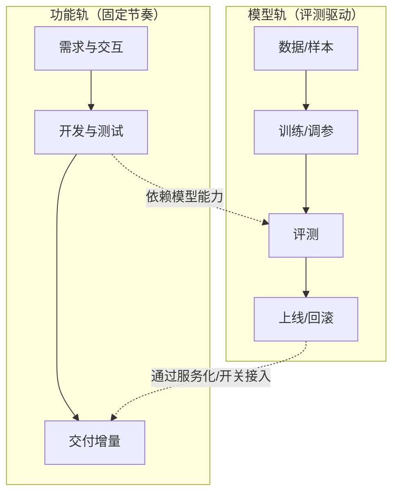

# 敏捷与方法论实践 | Methodologies in Action

## 核心要点 (TL;DR)

- Agile(敏捷)是哲学，Scrum和Kanban是具体实现方法论
- AI产品常需要"双轨节奏"：功能轨（固定迭代）+ 模型轨（评测驱动、节奏更不确定）
- Scrum适合固定团队+复杂项目，Kanban适合持续需求+灵活团队
- Waterfall已死？错！合规项目(政府/金融)仍需要瀑布式管理
- 混合方法论很常见：合规与交付走阶段化，研发与验证走迭代化

## 目录

1. [敏捷宣言与核心哲学](#敏捷宣言与核心哲学)
2. [Scrum详解：固定节奏的迭代魔法](#scrum详解)
3. [Kanban实战：可视化流动的力量](#kanban实战)
4. [Waterfall：被误解的传统方法论](#waterfall被误解的传统方法论)
5. [AI产品的双轨敏捷模式](#ai产品的双轨敏捷模式)
6. [中国常见工具与公开资源](#中国常见工具与公开资源)
7. [方法论选型决策树](#方法论选型决策树)
8. [术语表](#术语表)
9. [自测题](#自测题)
10. [实践任务](#实践任务)
11. [下一节预告](#下一节预告)

---

## 敏捷宣言与核心哲学

**敏捷不是一套工具，而是一种思维方式。**《Agile Manifesto》（2001）奠定了现代产品开发的哲学基础：https://agilemanifesto.org/

### 四大价值观

| 传统瀑布式思维 | 敏捷思维 | AI产品实践（通用） |
|--------------|---------|----------------|
| 流程和工具 | 个体和互动 | AI辅助但人仍是核心（工具提升信息处理效率，但决策仍需人负责） |
| 详尽文档 | 可用的软件 | 先交付可用版本，再用迭代补齐文档与细节 |
| 合同谈判 | 客户协作 | 用户共创（邀请种子用户测试AI Beta版）|
| 遵循计划 | 响应变化 | 以评测与数据驱动迭代，及时调整能力边界与需求 |

**核心原则（摘录关键5条）**：
1. 最高优先级是通过**尽早和持续交付**有价值的软件来满足客户
2. 欢迎需求变化，即使在开发后期（AI产品尤其重要：模型能力边界随技术突破快速扩展）
3. 经常交付可用的软件，交付间隔越短越好
4. 业务人员和开发人员必须在项目全程中天天一起工作（PM每天参加技术讨论，而非扔个PRD就走）
5. 最好的架构、需求和设计出自自组织团队

> 💡 **实战洞察**：敏捷是否有效，不取决于“开了多少仪式”，而取决于是否能持续交付可用增量、是否能暴露问题并改进。

---

## Scrum详解：固定节奏的迭代魔法

Scrum是最流行的敏捷框架，核心是**固定节奏(Cadence)**和**明确角色(Roles)**。

### Scrum的三个角色

```
Product Owner (PO)               Scrum Master (SM)           Development Team
产品负责人                        敏捷教练                     开发团队
      │                                │                          │
      ├─维护Product Backlog            ├─移除障碍                 ├─自组织
      ├─定义验收标准                   ├─推动敏捷实践             ├─跨功能(全栈)
      ├─优先级排序                     └─团队教练                 └─Sprint交付
      └─业务价值守门人

      [PO是"What"，Team是"How"，SM是"Process Guardian"]
```

**角色对应（中国互联网公司）**：
- Product Owner ≈ 产品经理(PM)
- Scrum Master ≈ 项目经理(PMO) 或 敏捷教练
- Development Team ≈ 前端+后端+测试的Feature Team

### Scrum的五个仪式(Ceremonies)

| 仪式 | 时长 | 频率 | 目的 | 中国工具推荐 |
|------|-----|------|------|------------|
| **Sprint Planning** | 2-4小时 | 每个Sprint开始 | 规划本Sprint要完成的Story | 飞书文档+飞书项目 |
| **Daily Scrum (站会)** | 15分钟 | 每天早上 | 同步进度、暴露阻碍 | 飞书视频会议 |
| **Sprint Review (评审)** | 1-2小时 | 每个Sprint结束 | 向干系人演示成果 | 飞书视频+屏幕共享 |
| **Sprint Retro (回顾)** | 1小时 | 每个Sprint结束 | 团队反思改进 | 飞书妙记(AI总结) |
| **Backlog Refinement** | 1-2小时 | 每周 | 细化未来Sprint的Story | 飞书文档协作 |

### Scrum的两大制品(Artifacts)

**Product Backlog（产品待办列表）**：
Product Backlog是“所有待做工作的优先级队列”。关键不是格式，而是：
- 每条工作项都能被验收（Definition of Done清晰）
- 优先级与依赖关系透明
- 能持续被拆分到可交付的粒度

**Sprint Backlog（冲刺待办列表）**：
从Product Backlog中选择本Sprint要完成的Story，并拆解为Task。

<details>
<summary>深入了解：Story Points估算的艺术</summary>

**什么是Story Points？**
不是工时，而是复杂度的相对度量。常用斐波那契数列：1, 2, 3, 5, 8, 13, 21...

**估算示例**：
- 以“相对复杂度”做比较：任务A是任务B的几倍复杂？
- 如果一个工作项大到无法估算（或争议太大），通常意味着需要继续拆分

**Planning Poker（估算扑克）**：
团队每个人手持扑克牌(1,2,3,5,8,13)，同时亮牌。如果差异大，讨论并重新估算。

**AI产品的特殊性**：模型相关任务的不确定性高
- “提升模型质量” → 可能通过Prompt/数据/评测口径调整快速改进，也可能需要较长周期的训练与评测
- 解决方案：拆成"快速尝试(3 points)"和"深度优化(13 points)"两个Story

</details>

> 💡 **实战洞察**：Scrum的最大价值不是流程，而是**透明度**。Product Backlog让所有人看到优先级，Sprint Backlog让所有人看到进度，Daily Scrum让阻碍无处藏身。我见过最失败的Scrum团队，都是因为PO不参加Daily Scrum，导致团队问题无法及时解决。记住：**Scrum不是让PM偷懒的工具，而是让PM更深度参与的框架**。

---

## Kanban实战：可视化流动的力量

Kanban源于丰田生产系统，核心是**可视化**和**限制在制品(WIP Limit)**。

### Kanban Board结构

```
 待办       进行中(WIP≤3)     代码评审      测试         完成
 ────────   ────────────    ──────────   ─────────    ────────
 │Task A │  │Task D     │    │Task G   │  │Task J  │   │Task M│
 │Task B │  │Task E     │    │Task H   │  │        │   │Task N│
 │Task C │  │Task F     │    │          │  │        │   │Task O│
 │  ...  │  └───────────┘    └──────────┘  └────────┘   └──────┘
 └───────┘   (最多3个任务)

 [拉动式：只有"进行中"有空位，才能从"待办"拉取新任务]
```

### Kanban vs Scrum

| 维度 | Scrum | Kanban |
|------|-------|--------|
| **迭代周期** | 固定Sprint(2周) | 无固定周期，持续流动 |
| **角色要求** | 必须有PO、SM、Team | 无强制角色 |
| **计划会议** | 每Sprint开始 | 随时补充Backlog |
| **WIP限制** | 无(Sprint内所有Story都在进行) | 严格限制每列最大任务数 |
| **适用场景** | 复杂项目、固定团队 | 运维、支持、持续需求 |
| **度量指标** | Velocity(每Sprint完成的Points) | Lead Time、Cycle Time |

**关键指标**：

```
Cycle Time (周期时间) = 任务从"进行中"到"完成"的时间
Lead Time (前置时间) = 任务从"待办"到"完成"的总时间

示例：
任务A：1/15进入"待办" → 1/17进入"进行中" → 1/20完成
- Lead Time = 5天
- Cycle Time = 3天

目标：持续降低Lead Time和Cycle Time
```

Kanban在“持续流入需求”的场景里很常见，例如用户反馈处理、线上问题跟进、内容运营排期等。

> 💡 **实战洞察**：Kanban的核心价值是让瓶颈可见：某一列持续堆积，就说明这里是系统瓶颈。优化要么补资源（人/工具/流程），要么降低返工（更清晰的验收与定义）。

---

## Waterfall：被误解的传统方法论

很多人以为Waterfall已死，但在**特定场景下仍是最优选择**。

### Waterfall五阶段

```
需求分析 ──> 系统设计 ──> 实现 ──> 测试 ──> 部署维护
   │           │         │       │        │
   └───────────┴─────────┴───────┴────────┘
       (单向流动，不可逆)
```

### Waterfall适用场景

| 场景 | 为什么适合Waterfall | 案例 |
|------|-------------------|------|
| **合规要求严格** | 需要详尽文档、每阶段审批 | 银行核心系统、政府ERP |
| **需求非常明确** | 变更成本极高 | 航空航天软件、医疗设备 |
| **外部依赖多** | 需要严格时间节点对齐 | 大型系统集成项目 |
| **团队分散** | 不同阶段不同团队负责 | 外包项目、跨国协作 |

**混合模式**：Wagile（Waterfall + Agile）
- 阶段1（需求）：Waterfall（完整PRD）
- 阶段2-4（设计到测试）：Agile Sprint
- 阶段5（部署）：Waterfall（严格验收）

---

## AI产品的双轨敏捷模式

AI产品的特殊性在于：**模型迭代独立于功能迭代**。

### 双轨并行架构



### 双轨同步机制

**问题**：功能已开发完成，但模型还没训练好，怎么办？

**解决方案1**：Mock模型
- 功能先用规则引擎或第三方API(通义千问)替代
- 模型ready后热更新

**解决方案2**：功能开关(Feature Flag)
- 功能代码先合并，但默认关闭
- 模型上线后，通过配置中心开启功能

> 💡 **实战洞察**：双轨协作最大的挑战是“节奏不同步”。有效的做法是把依赖关系显性化（哪些功能依赖哪些模型能力），并通过开关、降级、灰度把不确定性拆小。

---

## 中国常见工具与公开资源

不同公司落地方式各不相同，但你可以从这些公开入口快速搭建团队的协作与透明度基础：
- 飞书项目：https://project.feishu.cn/home
- 飞书文档：https://www.feishu.cn/product/docs
- PingCode：https://pingcode.com/
- Worktile：https://worktile.com/
- TAPD：https://www.tapd.cn/

---

## 方法论选型决策树

选择Scrum、Kanban还是Waterfall？用这个决策树：

```
需求是否明确且稳定？
├─ 是 → 是否有严格合规要求？
│       ├─ 是 → Waterfall (银行、政府、医疗)
│       └─ 否 → 团队是否固定？
│               ├─ 是 → Scrum (复杂产品开发)
│               └─ 否 → Kanban (外包、临时团队)
└─ 否 → 需求变化频率？
        ├─ 极高(每天都变) → Kanban (运维、客服、紧急需求)
        ├─ 高(每周都变) → Scrum + 1周Sprint
        └─ 中(每月微调) → Scrum + 2周Sprint
```

**AI产品特殊考虑**：
- 如果模型是核心 → **双轨Scrum**（功能轨+模型轨）
- 如果只是调用API → **普通Scrum**（模型当黑盒）
- 如果持续优化为主 → **Kanban**（持续的小改进）

**混合方案**（实际最常用）：
- 研发主干用Scrum（固定节奏）
- 支撑与运维用Kanban（持续流动）
- 合规部分用Waterfall（审批、文档、验收）

---

## 术语表 (Terminology)

| 中文术语 | English Term | 定义 (Definition) | 示例 (Example) |
|---------|--------------|------------------|----------------|
| 敏捷 | Agile | 强调迭代、协作、快速响应变化的软件开发哲学 | — |
| 迭代/冲刺 | Sprint | Scrum中固定时长的开发周期 | — |
| 产品待办列表 | Product Backlog | 所有待开发功能的优先级列表 | — |
| 用户故事 | User Story | 从用户视角描述功能需求 | "作为用户，我希望能导出聊天记录，以便后续查阅" |
| 故事点 | Story Points | 衡量任务复杂度的相对单位 | — |
| 在制品限制 | WIP Limit | Kanban中每列允许的最大任务数 | — |
| 周期时间 | Cycle Time | 任务从"开始"到"完成"的时间 | — |
| 前置时间 | Lead Time | 任务从"提出"到"完成"的总时间 | — |
| 每日站会 | Daily Scrum/Stand-up | 每天15分钟的同步会议 | 每人回答：昨天做了什么？今天做什么？有什么阻碍？ |
| 回顾会议 | Retrospective | Sprint结束后团队反思改进的会议 | 讨论：哪些做得好？哪些要改进？下个Sprint怎么调整？ |

---

## 自测题 (Self-Test)

**1. 解释Scrum和Kanban的核心区别，并举例说明各自适合什么场景。**

<details>
<summary>查看答案</summary>

核心区别：
- **Scrum**：固定迭代周期(Sprint)、明确角色(PO/SM/Team)、批量规划
- **Kanban**：持续流动、无固定周期、无强制角色、可视化+WIP限制

适用场景：
- **Scrum适合**：
  - 复杂产品开发（如开发一个新的SaaS产品）
  - 固定团队（team成员稳定）
  - 需求可预测（能规划2周Sprint的内容）

- **Kanban适合**：
  - 运维工作（服务器监控、bug修复）
  - 客服支持（用户反馈处理）
  - 持续需求（每天都有新需求进来）
  - 团队成员流动（人员不固定）

很多团队会采用“研发主干Scrum + 支撑事项Kanban”的组合，以兼顾节奏与响应速度。

</details>

**2. AI产品为什么需要"双轨敏捷"？如果只用一个Scrum轨道会遇到什么问题？**

<details>
<summary>查看答案</summary>

**为什么需要双轨：**
- 模型训练与评测通常有较强的资源与流程约束，节奏不如功能迭代稳定
- 功能开发可以并行（UI、后端逻辑不依赖模型完成）
- 模型迭代周期不固定（可能1周搞定，也可能1个月）

**只用单轨的问题：**
1. **阻塞问题**：功能开发等模型训练，团队闲置
2. **节奏混乱**：模型没ready，Sprint无法交付，打击士气
3. **资源浪费**：算法工程师和前端工程师节奏不同步

**双轨解决方案：**
- 功能轨：2周Sprint，持续交付UI和业务逻辑
- 模型轨：独立迭代，ready后通过Feature Flag接入
- 解耦机制：功能先用Mock模型或第三方API

实现方式：通过“模型服务化 + Feature Flag + 降级兜底”把模型能力接入变成可控的发布动作。

</details>

**3. 场景题：你负责一个政府AI项目，要求严格合规和文档齐全，但又希望快速迭代。你会选择什么方法论组合？**

<details>
<summary>查看答案</summary>

**推荐方案：Wagile（Waterfall + Agile混合）**

**阶段划分：**
- **Phase 1: 需求阶段（Waterfall）**
  - 完整PRD文档（政府审批需要）
  - 详细设计方案（合规审查需要）
  - 里程碑计划（合同约定）
  - 产出：正式签署的需求文档

- **Phase 2: 开发阶段（Agile Scrum）**
  - 2周一个Sprint
  - 每Sprint交付可演示功能
  - 内部快速迭代（不对外承诺）
  - 使用飞书项目管理进度

- **Phase 3: 测试阶段（Waterfall）**
  - 严格验收测试（Test Cases全覆盖）
  - 安全测试、性能测试
  - 生成详细测试报告

- **Phase 4: 部署阶段（Waterfall）**
  - 分阶段灰度发布（但每阶段有严格审批）
  - 详细的部署文档和应急预案
  - 培训和交接

**关键策略：**
- 对外（政府）：Waterfall的严谨文档和里程碑
- 对内（团队）：Agile的快速迭代和灵活调整
- 文档自动化：用AI生成部分文档（通义千问辅助）

</details>

**4. 如果你的团队成员抱怨"敏捷太累了，每天都要开会"，你会如何诊断和解决问题？**

<details>
<summary>查看答案</summary>

**诊断问题：**
问题可能不是"敏捷"本身，而是执行方式错误。

**常见错误实践：**
1. Daily Scrum开成"工作汇报会"（30分钟+，大家轮流向PM汇报）
2. 各种会议重复（Sprint Planning没计划清楚，开发中又要开N次需求澄清会）
3. 仪式主义（为了开会而开会，没有实际价值）

**正确实践：**
1. **Daily Scrum优化**：
   - 严格15分钟（用计时器）
   - 只说3个问题：昨天做了啥？今天做啥？有什么阻碍？
   - 详细讨论会后单独进行（不占用全员时间）
   - 可以异步（飞书群文字更新，有问题再拉会）

2. **减少会议频率**：
   - Sprint Planning做充分（2-4小时把Story拆清楚）
   - Backlog Refinement前置（PM提前准备好Story）
   - 用飞书文档协作替代部分会议

3. **会议质量优化**：
   - 每个会议必须有明确产出（决策、共识、行动项）
   - 会议前发Agenda，会后发Summary（AI生成）
   - 不相关的人不拉会（核心参会人+其他人可选）

**文化层面：**
- 强调"敏捷是为了减少浪费，而非增加负担"
- 定期Retro反思：哪些会议可以取消？哪些可以合并？
- 给团队自主权：让他们决定会议形式

**数据验证：**
- 统计会议时间占比与深度工作时间，观察是否出现“会议挤压交付”的趋势
- 如果会议明显占用交付时间或无法带来决策产出，应优化会议设计与参会范围

</details>

---

## 实践任务 (Practice Tasks)

- [ ] **任务1**：分析你当前项目的开发流程，判断是Scrum、Kanban、Waterfall还是混合模式？画出当前流程图，并标注：哪些环节是瓶颈？哪些环节可以优化？

- [ ] **任务2**：设计一个Kanban Board（用飞书项目或Excel），包含至少5列（待办、设计、开发、测试、完成），并为每列设定合理的WIP限制。模拟10个任务的流动过程，记录Lead Time和Cycle Time。

- [ ] **任务3**：如果你负责一个AI客服产品，设计一个"双轨敏捷"方案：
  - 功能轨：列出未来3个Sprint（每2周）的功能规划
  - 模型轨：列出未来3个月的模型迭代计划
  - 标注：哪些功能依赖模型升级？如何解耦？

- [ ] **任务4**：体验一次完整的Sprint Planning：
  - 选择一个你想做的个人项目（如"开发一个AI学习助手"）
  - 写下若干个User Story（用"作为...我希望...以便..."格式）
  - 用Planning Poker估算Story Points
  - 规划一个固定节奏的Sprint要完成哪些Story
  - Sprint结束后做Retro：实际完成了几个？为什么？

---

## 下一节预告 (Next Up)

下一节我们将进入**Module 2: 市场研究基础**，探讨：
- **《收集市场洞察》**：如何做AI产品的市场调研
- 用户访谈技巧（AI产品用户的特殊性）
- 中国AI市场格局分析（百模大战、AIGC赛道）
- 用AI辅助市场研究（通义千问分析竞品、豆包生成调研问卷）

**学习路径**：
```
Module 1: PM入门         Module 2: 市场研究        Module 3: 产品生命周期
    ↓                       ↓                        ↓
角色+技能+方法论  →    市场洞察+竞品分析   →   开发流程+风险管理
  (已完成)               (下一站)              (未来)
```

方法论是工具，市场洞察是方向。掌握Agile后，下一步是找到正确的产品方向！
