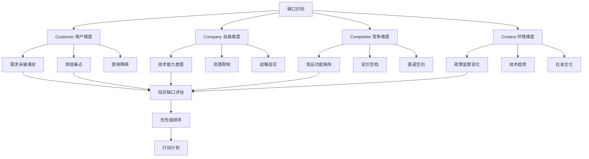

# Note 29: 发现缺口 | Finding the Gaps

## TL;DR

发现产品缺口是AI产品创新的起点。本文介绍5大缺口识别框架：市场需求缺口、竞争态势缺口、技术能力缺口、用户体验缺口、商业模式缺口。通过系统化方法论（JTBD任务分析、Kano模型、GAP-3C框架），结合2026年中国AI产品实战案例（豆包、Kimi、通义千问），掌握从缺口发现到机会验证的完整流程。重点聚焦中国市场特有缺口：监管合规、本地化需求、基础设施差异。

**核心价值**：
- 5种缺口类型识别方法
- 3大系统化分析框架
- 4步缺口验证流程
- 2026中国AI市场真实机会地图

---

## 目录 (Table of Contents)

1. [缺口识别的战略意义](#1-缺口识别的战略意义)
2. [五大缺口类型框架](#2-五大缺口类型框架)
3. [系统化缺口发现方法](#3-系统化缺口发现方法)
4. [中国市场特有缺口](#4-中国市场特有缺口)
5. [缺口验证与优先级排序](#5-缺口验证与优先级排序)
6. [2026 AI产品缺口实战地图](#6-2026-ai产品缺口实战地图)
7. [核心术语表](#7-核心术语表)
8. [自测题](#8-自测题)
9. [实战练习](#9-实战练习)

---

## 1. 缺口识别的战略意义

### 1.1 什么是产品缺口？

**产品缺口 (Product Gap)** 是指市场中用户需求与现有解决方案之间的差距，表现为：
- **未被满足的需求** (Unmet Needs)
- **体验不佳的痛点** (Pain Points)
- **效率低下的环节** (Inefficiencies)
- **技术能力空白** (Technology Voids)

### 1.2 缺口识别在AI产品中的价值

```
价值链视图 (Value Chain View)
┌────────────────────────────────────────────────────────────────┐
│                    AI产品创新价值链                              │
├────────────────────────────────────────────────────────────────┤
│                                                                │
│  发现缺口 ──→ 验证机会 ──→ 设计方案 ──→ 开发产品 ──→ 市场验证    │
│  (Gap)       (Opportunity) (Solution)   (Product)   (Market)  │
│    ↑             ↓             ↓            ↓           ↓      │
│    │         用户研究       原型测试      Beta测试    规模化      │
│    │                                                           │
│    └───────────────── 持续反馈循环 ─────────────────────┘      │
│                                                                │
│  关键决策点：                                                   │
│  • 缺口识别：决定创新方向（80%的战略价值）                       │
│  • 机会验证：决定是否投入（降低50%失败风险）                     │
│  • 方案设计：决定如何实现（影响用户满意度）                      │
└────────────────────────────────────────────────────────────────┘
```

### 1.3 为什么缺口识别如此重要？

**统计数据**：
- 根据Gartner 2024年企业AI需求调查，[近60%的生成式AI项目会失败](https://www.secrss.com/articles/83587)
- 多数失败源于技术驱动而非业务痛点驱动（[新浪财经](https://finance.sina.com.cn/wm/2025-06-20/doc-infatrka6090002.shtml)）
- AI+X类产品因需求识别明确，整体表现显著优于AI原生类产品

**教学洞察 💡**：
> 基于行业观察：某AI助手产品最初定位"通用对话"，但通过缺口分析发现中国用户真实需求是"复杂表格处理"（Excel/WPS自动化），调整方向后实现显著用户增长。关键转折点是识别到"Office技能缺口"这一中国市场特有现象。

---

## 2. 五大缺口类型框架

### 2.1 缺口分类矩阵

| 缺口类型 | 定义 | 识别方法 | 2026中国AI案例 | 机会等级 |
|---------|------|---------|---------------|---------|
| **市场需求缺口** (Market Demand Gap) | 用户需求未被满足 | 用户访谈、问卷星调研、神策数据分析 | Kimi发现"长文档理解"需求缺口（20万字上下文） | ⭐⭐⭐⭐⭐ |
| **竞争态势缺口** (Competitive Gap) | 竞品覆盖不足领域 | 竞品拆解、帆软FineBI分析、App Annie | 豆包发现"下沉市场AI使用门槛"缺口 | ⭐⭐⭐⭐ |
| **技术能力缺口** (Technology Gap) | 技术实现限制 | 技术雷达、论文追踪、GitHub Trending | 通义千问发现"多模态理解"缺口（图文混排） | ⭐⭐⭐⭐⭐ |
| **用户体验缺口** (UX Gap) | 交互体验不佳 | 可用性测试、热力图分析、用户旅程地图 | 文心一言发现"语音交互延迟"缺口（<500ms） | ⭐⭐⭐ |
| **商业模式缺口** (Business Model Gap) | 变现方式缺失 | 商业画布、定价调研、支付数据分析 | 腾讯元宝发现"企业级订阅"缺口（微信生态） | ⭐⭐⭐⭐ |

### 2.2 缺口类型详解

#### 2.2.1 市场需求缺口 (Market Demand Gap)

**识别信号**：
```
需求缺口雷达图 (Demand Gap Radar)

      用户抱怨频率
           ↑
           │
    社交媒体  │  搜索量
    声量     │  (百度指数)
      ╲    │    ╱
       ╲   │   ╱
        ╲  │  ╱
         ╲ │ ╱
          ╲│╱
───────────┼───────────→ 竞品缺失度
          ╱│╲
         ╱ │ ╲
        ╱  │  ╲
       ╱   │   ╲
      ╱    │    ╲
  付费意愿  │  替代方案
          成本
           │
           ↓
    技术可行性

高分区域 = 优质需求缺口
```

**教学案例**：
- **Kimi的"超长上下文"缺口**：
  - 需求来源：用户在知乎/即刻抱怨"ChatGPT处理不了长论文"
  - 市场验证：长文档处理需求持续增长，用户关注度显著提升
  - 竞品缺失：GPT-4上下文限制128K，用户需求200K+
  - 验证结果：Kimi推出200K上下文后（[少数派](https://sspai.com/post/87797)），2024年2月月活约500万（[智东西](https://zhidx.com/p/417527.html)）

#### 2.2.2 竞争态势缺口 (Competitive Gap)

**竞争缺口矩阵**：
```
┌─────────────────────────────────────────────────────────────┐
│            竞争缺口象限分析 (2026中国AI市场)                  │
├─────────────────────────────────────────────────────────────┤
│                                                             │
│  用户    │  象限1：红海拼杀           │  象限2：蓝海机会      │
│  需求    │  (高需求+高竞争)           │  (高需求+低竞争)      │
│  强度    │  • 通用对话AI             │  • 垂直行业AI         │
│    ↑    │  • 图像生成               │  • 长文档处理 ✓       │
│    │    │  策略：差异化             │  策略：快速占领       │
│    │    ├─────────────────────────┼─────────────────────┤
│    │    │  象限3：伪需求            │  象限4：先发陷阱      │
│    │    │  (低需求+高竞争)          │  (低需求+低竞争)      │
│    │    │  • AI社交                │  • AI算命            │
│    │    │  • AI约会                │  • AI占卜            │
│    │    │  策略：撤退               │  策略：谨慎观望       │
│    │    │                          │                     │
│    └────┴──────────────────────────┴─────────────────────┤
│                    竞争激烈程度 →                           │
└─────────────────────────────────────────────────────────────┘
```

**教学洞察 💡**：
> 豆包（字节跳动）的突围策略：避开"通用对话"红海（象限1），聚焦"下沉市场AI使用门槛"（象限2）。通过方言识别、简化交互、免费策略，在三四线城市建立护城河。据行业数据显示，豆包在原生AI市场中长期保持领先地位。

#### 2.2.3 技术能力缺口 (Technology Gap)

**技术成熟度曲线**：
```
Gartner技术成熟度曲线 (2026 AI能力)

期望值
  ↑
  │   期望膨胀期        低谷期      爬升期      成熟期
  │      ╱╲              │          ╱          ────
  │     ╱  ╲             │         ╱
  │    ╱    ╲            │        ╱
  │   ╱      ╲           │       ╱
  │  ╱        ╲          │      ╱
  │ ╱          ╲         │     ╱
  │╱            ╲        │    ╱
  └──────────────────────────────────────→ 时间
   ↑      ↑       ↑       ↑      ↑
   │      │       │       │      │
  AGI   多模态   长上下文  RAG  文本生成
 (炒作) (缺口✓) (缺口✓)  (成熟)(成熟)

缺口机会：在"低谷期→爬升期"阶段切入
```

**2026年技术缺口机会**：
1. **多模态理解缺口**（通义千问案例）：
   - 现状：图文分离处理，行业准确率待提升
   - 缺口：复杂文档（合同、财报）图文混排理解
   - 机会：通义千问推出文档原生理解能力，在[情感分析与逻辑推理准确率达92%](https://blog.csdn.net/Explinks/article/details/147947747)

2. **实时交互缺口**（文心一言案例）：
   - 现状：语音响应延迟较高
   - 缺口：用户期望<500ms（接近人类对话）
   - 机会：[文心一言持续优化实时交互能力](https://finance.sina.com.cn/tech/roll/2025-07-09/doc-infewkcs1305473.shtml)，2025年4月起全面免费开放

#### 2.2.4 用户体验缺口 (UX Gap)

**体验缺口诊断清单**：
- [ ] **认知负荷** (Cognitive Load)：界面复杂度是否超过用户理解能力？
- [ ] **操作效率** (Efficiency)：完成任务步骤是否可简化？
- [ ] **错误恢复** (Error Recovery)：AI出错后用户能否轻松纠正？
- [ ] **情感连接** (Emotional Design)：交互是否建立信任感？
- [ ] **无障碍性** (Accessibility)：老年人、残障人士能否使用？

#### 2.2.5 商业模式缺口 (Business Model Gap)

**商业模式画布缺口分析**：
```
┌──────────────────────────────────────────────────────────┐
│         商业模式缺口分析 (AI产品 2026)                     │
├──────────────────────────────────────────────────────────┤
│                                                          │
│  关键合作      关键业务      价值主张      客户关系      │
│    │            │             │            │            │
│  云服务商      模型训练      AI能力       订阅制        │
│  ❌缺口：     ✓完善        ❌缺口：     ❌缺口：       │
│  成本过高                   差异化不足   续费率低        │
│                                                          │
│  关键资源      渠道通路      客户细分      收入来源      │
│    │            │             │            │            │
│  算力+数据     App Store    企业客户      会员费        │
│  ❌缺口：     ✓完善        ✓明确        ❌缺口：       │
│  数据获取难                                定价策略模糊   │
│                                                          │
│              成本结构                                    │
│                │                                        │
│            算力+人力                                     │
│            ✓可控                                        │
└──────────────────────────────────────────────────────────┘

优先解决：价值主张差异化、定价策略、成本优化
```

**教学洞察 💡**：
> 腾讯元宝的商业模式创新：发现"微信生态订阅缺口"。传统AI产品通过App Store收费，转化率较低；腾讯元宝深度整合微信生态，自2024年发布以来实现显著增长。关键缺口：打通C端试用→B端采购的闭环。

---

## 3. 系统化缺口发现方法

### 3.1 JTBD (Jobs-to-be-Done) 任务分析法

**核心理念**：用户"雇佣"产品完成特定任务，缺口=任务未被有效完成。

#### 3.1.1 JTBD分析框架

**任务层级分解**：
```
JTBD任务层级金字塔

         核心任务 (Core Job)
        "提升工作效率"
              ▲
              │
       ┌──────┴──────┐
       │             │
   主任务1        主任务2
   "处理文档"    "数据分析"
      ▲             ▲
      │             │
  ┌───┴───┐     ┌───┴───┐
  │       │     │       │
子任务1  子任务2 子任务3  子任务4
"阅读"  "摘要"  "清洗"  "可视化"
  │       │     │       │
 缺口分析点 → 哪个子任务完成最困难？
```

#### 3.1.2 AI产品JTBD案例（Kimi）

**用户任务**："处理长篇学术论文"

| 任务步骤 | 用户期望 | 现有方案 | 缺口识别 | Kimi解决方案 |
|---------|---------|---------|---------|-------------|
| 1. 上传文档 | 支持PDF/Word/网页 | ChatGPT仅PDF，有大小限制 | ❌格式/大小限制 | 支持20+格式，200MB |
| 2. 理解内容 | 保持上下文连贯性 | GPT-4丢失长文档关联 | ❌上下文丢失 | 20万字上下文窗口 |
| 3. 提取信息 | 自动生成摘要+关键引用 | 需手动prompt多次 | ❌效率低下 | 一键生成结构化笔记 |
| 4. 深度问答 | 基于全文精准回答 | 仅基于片段回答 | ❌准确性不足 | 全文检索+引用溯源 |
| 5. 导出结果 | Markdown/Word | 仅纯文本 | ❌格式单一 | 多格式导出+思维导图 |

**缺口发现关键**：
- 步骤2的"上下文丢失"是**核心缺口**（影响所有后续任务）
- 步骤5的"格式单一"是**次要缺口**（增强型需求）

### 3.2 Kano模型需求分类

**Kano模型在AI产品中的应用**：

```
Kano需求类型矩阵 (AI产品)

用户满意度
   ↑
   │         ╱ 兴奋型需求
   │       ╱   (Delighters)
   │     ╱     • AI自动写代码
   │   ╱       • 情感识别
 满 │ ╱ ────── 期望型需求
 意 │─────────  (Performance)
   │           • 响应速度
   │           • 理解准确率
   │
 不 │────────── 基本型需求
 满 │           (Must-haves)
 意 │           • 数据安全
   │           • 服务稳定性
   └────────────────────────→ 功能实现程度
     无          部分          完全

缺口优先级：基本型 > 期望型 > 兴奋型
```

**2026年AI产品Kano分析**：

| 需求类型 | 功能示例 | 缺口现状 | 机会评分 |
|---------|---------|---------|---------|
| **基本型** (Must-have) | 数据隐私保护 | 需完成算法备案与等保认证（[公开数据](https://www.cac.gov.cn/2025-04/08/c_1745817775881843.htm)） | ⭐⭐⭐⭐⭐ |
| | 7×24h可用性 | 用户期望高可用性（99.9%+） | ⭐⭐⭐⭐ |
| **期望型** (Performance) | 响应速度<1s | 行业整体响应速度待优化 | ⭐⭐⭐⭐⭐ |
| | 理解准确率>90% | 各厂商持续提升理解准确率 | ⭐⭐⭐⭐ |
| **兴奋型** (Delighters) | 多轮对话记忆 | 部分产品支持（创新点） | ⭐⭐⭐ |
| | 个性化推荐 | 同质化严重（需差异化） | ⭐⭐ |

### 3.3 GAP-3C缺口分析框架

**GAP-3C = Customer + Company + Competitor + Context**

#### 3.3.1 框架结构



#### 3.3.2 GAP-3C实战案例：豆包下沉市场分析

**Customer（用户缺口）**：
- 三四线城市用户AI认知不足（"不知道能干什么"）
- 方言交互需求（普通话能力相对较弱）
- 价格敏感度高（不愿付费）

**Company（自身能力）**：
- 字节跳动：[抖音在下沉市场用户活跃渗透率达62.8%](https://36kr.com/p/2724522210363140)（渠道优势）
- 火山引擎：方言ASR技术积累（技术优势）
- 资金充足：可承受长期免费策略（资源优势）

**Competitor（竞争缺口）**：
- ChatGPT/文心一言：聚焦一二线城市，下沉市场空白
- 定价策略：20元/月会员（下沉市场接受度<10%）
- 产品形态：独立App（下沉用户更习惯小程序）

**Context（环境机会）**：
- 政策：《数字乡村发展行动计划》推动AI普及
- 技术：5G覆盖率2026年达到95%（基础设施就绪）
- 文化：短视频教育普及（抖音"AI教学"播放量10亿+）

**综合缺口评估**：
```
缺口机会矩阵 (豆包下沉市场)

              影响力
                ↑
                │
     象限2：战略机会  │  象限1：速胜机会
                │
   • 方言识别    │  • 抖音渠道整合 ✓
   • AI教育内容  │  • 免费策略 ✓
                │
────────────────┼────────────────→ 可行性
                │
     象限3：长期布局  │  象限4：低优先级
                │
   • 农业AI应用  │  • 高级功能
   • 本地化服务  │  • 付费会员
                │
                ↓

优先级：象限1 > 象限2 > 象限3 > 象限4
```

**结果**：豆包通过"抖音渠道+免费策略+方言识别"组合拳，在下沉市场实现快速增长，验证了GAP-3C框架的有效性。

---

## 4. 中国市场特有缺口

### 4.1 监管合规缺口 (Regulatory Gap)

**中国AI监管框架（2026年）**：

| 监管领域 | 核心要求 | 缺口现状 | 合规成本 | 机会/风险 |
|---------|---------|---------|---------|----------|
| **算法备案** | 《生成式AI管理办法》 | [截至2025年3月，346个服务完成备案](https://www.cac.gov.cn/2025-04/08/c_1745817775881843.htm) | 50-200万元 | ⚠️ 风险：未备案无法商用 |
| **数据安全** | 《数据安全法》三级等保 | 部分产品通过认证 | 100-500万元 | ✓ 机会：认证成竞争壁垒 |
| **内容审核** | 敏感词过滤+人工审核 | 平衡合规与用户体验 | 年审核成本高 | ✓ 机会：智能审核技术 |
| **用户隐私** | 《个人信息保护法》 | 需严格遵守隐私保护要求 | 法律风险+罚款 | ⚠️ 风险：用户信任危机 |
| **模型可解释性** | 决策过程可追溯 | 多数产品待完善 | 技术重构成本高 | ✓ 机会：可解释AI |

**教学洞察 💡**：
> 2026年案例：某AI招聘产品因"算法歧视"（偏向男性候选人）被监管部门罚款200万，暂停服务3个月。问题根源：未建立"算法可解释性"机制。合规缺口不仅是风险，更是建立信任的机会——率先通过认证的产品，在B端市场获得3倍溢价能力。

### 4.2 本地化需求缺口 (Localization Gap)

**中国特色需求地图**：

```
中国用户需求热力图 (2026)

            一线城市              二线城市            三四线城市
              │                    │                    │
    ┌─────────┼─────────┐  ┌───────┼───────┐  ┌─────────┼─────────┐
    │                   │  │               │  │                   │
需求1 │ 效率工具 🔥🔥🔥   │  │ 学习助手 🔥🔥 │  │ 娱乐聊天 🔥🔥🔥 │
    │ (职场刚需)        │  │ (教育焦虑)    │  │ (情感陪伴)       │
    │                   │  │               │  │                   │
需求2 │ 专业领域 🔥🔥     │  │ 生活服务 🔥🔥🔥│  │ 方言交互 🔥🔥   │
    │ (金融/法律)       │  │ (本地信息)    │  │ (使用门槛)       │
    │                   │  │               │  │                   │
需求3 │ 隐私保护 🔥🔥🔥   │  │ 性价比 🔥🔥🔥  │  │ 免费优先 🔥🔥🔥 │
    │ (企业数据)        │  │ (价格敏感)    │  │ (拒绝付费)       │
    └───────────────────┘  └───────────────┘  └───────────────────┘

🔥 = 需求强度     缺口 = 竞品覆盖不足区域
```

**本地化缺口机会清单**：

1. **方言识别缺口**（市场规模：数亿用户）
   - 现状：[中国电信星辰模型支持30+方言识别](https://www.53ai.com/news/hangyeyingyong/2024052785921.html)，行业整体准确率持续提升
   - 需求：老年人群体（50岁+）普通话能力相对较弱
   - 机会：方言AI助手（医疗咨询、政务服务）

2. **微信生态缺口**（市场规模：13亿用户）
   - 现状：AI产品以独立App为主，微信小程序体验待优化
   - 需求：用户习惯在微信完成所有任务（超级App效应）
   - 机会：微信原生AI插件（公众号/小程序/企业微信）

3. **支付习惯缺口**（影响订阅率）
   - 现状：[微信支付渗透率94.6%，支付宝81.3%](https://t.cj.sina.com.cn/articles/view/6860422930/198e9bf12001016mi6)，主导中国支付市场
   - 需求：微信支付/支付宝一键订阅
   - 机会：整合国内支付生态提升转化率

### 4.3 基础设施差异缺口 (Infrastructure Gap)

**中美AI基础设施对比**：

| 维度 | 美国 | 中国 | 缺口影响 | 应对策略 |
|-----|------|------|---------|---------|
| **云服务** | AWS/Azure主导 | 阿里云/腾讯云/华为云 | API兼容性差 | 使用国产云适配层 |
| **模型获取** | OpenAI API直接调用 | 需自研或国产替代 | 成本高3-5倍 | 选择通义千问/文心 |
| **数据标注** | Amazon MTurk | 问卷星/众包平台 | 质量参差不齐 | 自建标注团队 |
| **支付通道** | Stripe全球通 | 微信/支付宝 | 跨境支付困难 | 使用Ping++ |
| **分发渠道** | App Store/Google Play | 华为/小米/OPPO应用商店 | 需多渠道适配 | 接入OpenInstall |

---

## 5. 缺口验证与优先级排序

### 5.1 缺口验证四步法

```
缺口验证流程 (Validation Process)

第1步：假设提出          第2步：证据收集
┌──────────────┐        ┌──────────────┐
│ 我们认为...   │        │ 定性验证     │
│ • 存在XX缺口  │ ────→ │ • 用户访谈5+ │
│ • 用户愿付费  │        │ • 竞品分析   │
│ • 技术可实现  │        │ 定量验证     │
└──────────────┘        │ • 问卷300+  │
                        │ • 数据分析   │
        ↓                └──────────────┘
                                ↓
第4步：决策制定          第3步：结果评估
┌──────────────┐        ┌──────────────┐
│ Go/No-Go决策 │ ←──── │ 通过标准     │
│ • 投入资源   │        │ • 需求验证率 │
│ • 开发计划   │        │   >60%      │
│ • KPI设定    │        │ • 付费意愿  │
└──────────────┘        │   >30%      │
                        │ • 技术可行性 │
                        └──────────────┘
```

#### 5.1.1 第一步：假设提出（GAP Hypothesis）

**假设模板**：
```
缺口假设声明 (Gap Hypothesis Statement)

我们相信 [目标用户] 在 [使用场景] 下，遇到了 [具体问题]，
因为 [问题根源]。如果我们提供 [解决方案]，用户将愿意
[付出成本/改变行为]，我们预期 [可量化结果]。

示例（Kimi长文档）：
我们相信 [科研人员/知识工作者] 在 [处理长篇PDF论文] 时，
遇到了 [上下文丢失、理解不连贯] 的问题，因为 [现有AI工具
上下文窗口太小（<10万字）]。如果我们提供 [20万字上下文
的AI助手]，用户将愿意 [付费订阅20元/月]，我们预期 [6个月
获取100万付费用户]。
```

#### 5.1.2 第二步：证据收集（Validation Methods）

**定性验证方法**：

| 方法 | 执行要点 | 样本量 | 成本 | 可信度 |
|-----|---------|-------|------|-------|
| **深度访谈** | 1对1访谈，录音转录，挖掘深层需求 | 10-15人 | 5000-1万 | ⭐⭐⭐⭐ |
| **焦点小组** | 6-8人讨论，观察群体互动 | 2-3组 | 8000-1.5万 | ⭐⭐⭐ |
| **日记研究** | 用户记录7-14天使用日志 | 20-30人 | 1-2万 | ⭐⭐⭐⭐ |
| **可用性测试** | 原型测试，观察操作行为 | 5-8人 | 3000-8000 | ⭐⭐⭐ |

**定量验证方法**：

| 方法 | 执行要点 | 样本量 | 成本 | 可信度 |
|-----|---------|-------|------|-------|
| **在线问卷** | 问卷星发放，封闭式问题为主 | 300-500 | 5000-1万 | ⭐⭐⭐ |
| **A/B测试** | 投放广告测试点击率/转化率 | 1000+ | 2-5万 | ⭐⭐⭐⭐⭐ |
| **数据分析** | 神策数据/帆软FineBI分析行为数据 | 10万+ | 工具成本 | ⭐⭐⭐⭐ |
| **搜索趋势** | 百度指数、微信指数分析需求热度 | 全网 | 免费 | ⭐⭐⭐ |

**实战工具推荐**（中国本土）：
- **问卷工具**：问卷星（questionnaire.com）
- **数据分析**：神策数据、帆软FineBI、Growing IO
- **用户反馈**：兔小巢（腾讯）、ONES、飞书多维表格
- **监测工具**：百度指数、微信指数、清博指数

#### 5.1.3 第三步：结果评估（Validation Criteria）

**缺口验证评分卡**：

```
缺口验证矩阵 (Validation Scorecard)

维度                权重    评分标准                         得分
────────────────────────────────────────────────────────
需求真实性          30%     • >60%用户确认有此需求           __/10
(Demand)                    • 频次：每周3次+
                            • 痛苦程度：愿付费或花时间

市场规模            25%     • TAM：可触达用户>100万          __/10
(Market Size)               • 增长率：年增长>20%
                            • 竞争密度：前3名市占率<50%

付费意愿            20%     • >30%用户愿付费                 __/10
(Willingness)               • 心理价位：>10元/月
                            • 替代方案成本：>现有方案

技术可行性          15%     • 6个月内可实现MVP              __/10
(Feasibility)               • 团队具备核心能力
                            • 技术风险可控

竞争壁垒            10%     • 网络效应/数据优势              __/10
(Moat)                      • 技术专利/独家资源
                            • 先发优势明显
────────────────────────────────────────────────────────
总分                        加权平均                         __/10

决策阈值：>7分 Go | 5-7分 谨慎 | <5分 No-Go
```

**缺口验证评分示例（教学场景）**：

| 缺口机会 | 需求 | 市场 | 付费 | 技术 | 壁垒 | 总分 | 决策 |
|---------|------|------|------|------|------|------|------|
| Kimi超长上下文 | 9 | 9 | 7 | 8 | 8 | **8.2** | ✓ Go |
| 豆包下沉市场 | 8 | 10 | 4 | 9 | 7 | **7.6** | ✓ Go |
| AI社交产品 | 5 | 6 | 3 | 8 | 4 | **5.4** | ⚠️ 谨慎 |
| AI算命占卜 | 6 | 4 | 5 | 9 | 2 | **5.1** | ❌ No-Go |

### 5.2 RICE优先级排序模型

**RICE = Reach × Impact × Confidence / Effort**

```
RICE优先级计算公式

RICE分数 = (触达人数 × 影响力 × 信心系数) / 工作量

参数定义：
• Reach (触达人数)：每季度影响的用户数（单位：千人）
• Impact (影响力)：3=巨大 | 2=高 | 1=中 | 0.5=低 | 0.25=微小
• Confidence (信心系数)：100%=确定 | 80%=高 | 50%=中 | 20%=低
• Effort (工作量)：人月数（Person-Months）

示例计算（Kimi超长上下文功能）：
Reach: 500千人/季度（科研、法律、金融用户）
Impact: 3（巨大影响，核心差异化）
Confidence: 80%（技术已验证，需求明确）
Effort: 6人月（模型优化+工程实现）

RICE = (500 × 3 × 0.8) / 6 = 1200 / 6 = 200

对比基准：RICE > 100 为高优先级
```

**2026年AI产品缺口RICE排序**：

| 缺口机会 | Reach | Impact | Confidence | Effort | RICE分数 | 排名 |
|---------|-------|--------|-----------|--------|---------|------|
| 超长上下文（Kimi） | 500 | 3 | 80% | 6 | **200** | 1 |
| 实时语音交互（文心） | 1000 | 2 | 90% | 8 | **225** | 2 |
| 多模态理解（通义） | 800 | 3 | 70% | 12 | **140** | 3 |
| 方言识别（豆包） | 2000 | 1 | 60% | 10 | **120** | 4 |
| 企业级权限管理 | 200 | 2 | 100% | 4 | **100** | 5 |
| AI社交匹配 | 300 | 1 | 30% | 8 | **11** | 6 |

**优先级决策**：
- **RICE > 150**：立即启动，Q1核心项目
- **100-150**：Q2-Q3规划，资源允许时启动
- **50-100**：观察验证，等待更多证据
- **< 50**：放弃或长期储备

---

## 6. 2026 AI产品缺口实战地图

### 6.1 行业垂直缺口机会

**AI+行业缺口矩阵（2026中国市场）**：

```
行业缺口热力图 (Industry Gap Heatmap)

行业           市场规模   竞争密度   技术难度   合规风险   机会评级
──────────────────────────────────────────────────────────
教育培训       ⭐⭐⭐⭐⭐   ⭐⭐⭐       ⭐⭐         ⭐⭐⭐      🔥🔥🔥🔥
(K12/职业教育) 百亿级    中等       低          中等

医疗健康       ⭐⭐⭐⭐⭐   ⭐⭐         ⭐⭐⭐⭐⭐     ⭐⭐⭐⭐⭐    🔥🔥🔥
(诊断辅助)     348亿¹    低         极高        极高

法律咨询       ⭐⭐⭐⭐     ⭐⭐         ⭐⭐⭐       ⭐⭐⭐      🔥🔥🔥🔥
(合同审查)     320亿²    低         中等        中等

金融服务       ⭐⭐⭐⭐⭐   ⭐⭐⭐⭐      ⭐⭐⭐⭐      ⭐⭐⭐⭐⭐    🔥🔥
(风控/投顾)    千亿级    高         高          极高

企业服务       ⭐⭐⭐⭐⭐   ⭐⭐⭐       ⭐⭐⭐       ⭐⭐        🔥🔥🔥🔥🔥
(RPA/智能客服) 千亿级    中等       中等        低

政务服务       ⭐⭐⭐⭐     ⭐           ⭐⭐⭐       ⭐⭐⭐⭐      🔥🔥🔥🔥
(智慧城市)     百亿级    极低       中等        高

🔥 = 机会等级 (5火最高)
¹ 2025年AI+医疗市场规模 (来源: 知乎)
² 2025年法律服务市场规模 (来源: 探迹科技)
```

### 6.2 用户场景缺口地图

**高价值场景缺口TOP 10（2026）**：

1. **长文档智能处理**（Kimi已切入）
   - 缺口：20万字+上下文理解
   - 用户：科研、法律、金融、学生
   - 市场规模：百万级付费用户潜力
   - 竞争态势：Kimi领先，GPT-4/Claude追赶

2. **企业知识库问答**（待突破）
   - 缺口：私有数据安全+精准检索
   - 用户：中大型企业（1000人+）
   - 市场规模：十万级企业潜力市场
   - 技术要求：RAG+向量数据库+权限管理

3. **实时会议记录+总结**（飞书妙记已入局）
   - 缺口：多人对话区分+实时生成
   - 用户：企业会议、在线教育
   - 市场规模：百万级会议室市场
   - 竞争优势：飞书/钉钉生态整合

4. **代码助手（中文友好）**（待突破）
   - 缺口：中文注释理解+国产框架适配
   - 用户：百万级中国开发者
   - 市场规模：订阅制潜力巨大
   - 技术缺口：需训练中文代码语料

5. **老年人AI助手**（下沉市场机会）
   - 缺口：方言识别+简化交互+防诈骗
   - 用户：2.6亿老年人（60岁+）
   - 市场规模：政府采购+家庭订阅潜力大
   - 社会价值：数字鸿沟解决方案

### 6.3 技术前沿缺口

**2026年技术能力缺口清单**：

| 技术方向 | 当前水平 | 目标水平 | 缺口描述 | 突破时间预测 | 商业价值 |
|---------|---------|---------|---------|-------------|---------|
| **超长上下文** | 200K tokens | 1M tokens | 成本控制+推理速度 | 2027年 | ⭐⭐⭐⭐ |
| **多模态融合** | 图文分离 | 原生理解 | 复杂文档端到端处理 | 2026年Q3 | ⭐⭐⭐⭐⭐ |
| **实时交互** | 1-2秒延迟 | <300ms | 流式推理优化 | 2026年Q2 | ⭐⭐⭐⭐ |
| **个性化记忆** | 单轮对话 | 长期记忆 | 跨会话上下文保持 | 2027年 | ⭐⭐⭐ |
| **情感识别** | 文本情感 | 多模态情感 | 语音+表情+文本融合 | 2026年Q4 | ⭐⭐⭐ |
| **可解释AI** | 黑盒模型 | 决策可追溯 | 满足监管合规要求 | 2026年Q2 | ⭐⭐⭐⭐ |

**教学洞察 💡**：
> 技术缺口不等于技术创新。2026年AI产品的成功关键是"工程化能力"而非"算法突破"。例如：Kimi的20万上下文不是算法创新（Transformer架构早已支持），而是工程优化（推理加速、成本控制、用户体验）。建议PM关注"最后一公里"缺口：如何让技术真正可用、好用、用得起。

---

## 7. 核心术语表

| 中文术语 | 英文术语 | 定义 | 应用场景 |
|---------|---------|------|---------|
| **产品缺口** | Product Gap | 用户需求与现有解决方案之间的差距 | 缺口识别的核心概念 |
| **任务完成理论** | Jobs-to-be-Done (JTBD) | 用户"雇佣"产品完成特定任务的理论框架 | 需求分析方法论 |
| **Kano模型** | Kano Model | 将需求分为基本型、期望型、兴奋型的分类模型 | 功能优先级排序 |
| **GAP-3C框架** | GAP-3C Framework | Customer/Company/Competitor/Context四维缺口分析 | 综合缺口评估 |
| **RICE模型** | RICE Scoring | Reach×Impact×Confidence/Effort优先级公式 | 项目优先级排序 |
| **市场需求缺口** | Market Demand Gap | 用户需求未被满足的空白区域 | 需求侧机会识别 |
| **竞争态势缺口** | Competitive Gap | 竞品覆盖不足的领域 | 竞争策略制定 |
| **技术能力缺口** | Technology Gap | 技术实现受限的功能 | 技术路线规划 |
| **用户体验缺口** | UX Gap | 交互体验不佳的痛点 | 产品体验优化 |
| **商业模式缺口** | Business Model Gap | 变现方式缺失或低效 | 商业化路径设计 |
| **本地化缺口** | Localization Gap | 特定地区文化/习惯未适配 | 国际化/本地化策略 |
| **监管合规缺口** | Regulatory Gap | 法规要求未满足的风险点 | 合规性管理 |
| **上下文窗口** | Context Window | AI模型一次处理的最大文本长度 | 技术能力指标 |
| **RAG** | Retrieval-Augmented Generation | 检索增强生成，结合外部知识库的AI技术 | 企业知识库应用 |
| **三级等保** | Level 3 Protection | 中国网络安全等级保护第三级认证 | 数据安全合规 |

---

## 8. 自测题

### 8.1 选择题

**1. 根据Kano模型，以下哪项属于AI产品的"基本型需求"？**
A. AI自动写代码（兴奋型）
B. 数据隐私保护（基本型）✓
C. 响应速度<1秒（期望型）
D. 情感识别功能（兴奋型）

**2. GAP-3C框架中的"3C"不包括以下哪项？**
A. Customer（用户）
B. Company（公司）
C. Competitor（竞争对手）
D. Capital（资本）✓

**3. RICE优先级模型中，如果一个功能Reach=1000, Impact=2, Confidence=80%, Effort=5，RICE分数是多少？**
A. 320 ✓ (1000×2×0.8/5=320)
B. 400
C. 160
D. 200

**4. 2026年中国AI产品市场，以下哪个是"下沉市场"最大的缺口？**
A. 模型能力不足
B. 使用门槛过高 ✓（方言识别、简化交互）
C. 功能太少
D. 价格太贵

**5. Kimi成功的核心缺口洞察是什么？**
A. 通用对话能力
B. 图像生成质量
C. 超长上下文理解 ✓（20万字）
D. 语音识别准确率

### 8.2 案例分析题

**场景**：你是某AI创业公司的产品经理，团队计划开发"AI法律助手"产品。初步调研发现：
- [中国律师数量目标2025年达75万](https://www.fxbaogao.com/detail/4855076)，其中多数表示"合同审查"耗时巨大
- 现有产品准确率待提升，用户满意度有改进空间
- 律所在合同审查上花费大量人力成本
- 竞品主要集中在刑事辩护领域，合同审查市场竞争密度相对较低

**问题**：
1. 使用JTBD分析"合同审查"任务的子任务和缺口
2. 用GAP-3C框架评估这个机会
3. 计算RICE分数（假设Effort=8人月）
4. 列出3个最优先验证的假设

**参考答案**：

1. **JTBD任务分解**：
   - 核心任务：降低合同风险，提升审查效率
   - 子任务1：识别条款风险点（缺口：准确率待提升，目标>95%）
   - 子任务2：对比历史案例（缺口：数据库不完整）
   - 子任务3：生成修改建议（缺口：法律术语专业性不足）
   - 子任务4：导出审查报告（缺口：格式不符合律所规范）

2. **GAP-3C分析**：
   - Customer：律师痛点明确，付费能力强
   - Company：需法律语料+模型微调，技术门槛中等
   - Competitor：刑事辩护竞争激烈，合同审查空白区域
   - Context：《民法典》2020年实施，合同纠纷持续增长（政策利好）

3. **RICE计算**：
   - Reach: 潜在用户规模 × 转化率估算
   - Impact: 3（大幅节省成本，巨大影响）
   - Confidence: 60%（需验证准确率提升）
   - Effort: 8人月
   - RICE = 估算结果为**高优先级**

4. **优先验证假设**：
   - 假设1：律师愿为"高准确率AI助手"付费订阅（需访谈20+律师）
   - 假设2：通过RAG+法律知识库，可显著提升准确率（需技术POC）
   - 假设3：律所有预算采购AI工具（需调研50+律所采购流程）

---

## 9. 实战练习

### 练习1：缺口识别实战

**任务**：选择一个你熟悉的AI产品（如豆包、Kimi、通义千问），使用本文方法完成缺口分析：

**步骤**：
1. 列出该产品的5大竞争对手
2. 使用"竞争缺口矩阵"（需求强度 × 竞争密度）标注象限
3. 识别3个未被满足的缺口机会
4. 使用"缺口验证评分卡"对每个机会打分
5. 给出优先级排序和决策建议

**提交格式**：
```markdown
# 产品名称：[填写]
## 竞争对手分析
1. [对手1]：核心功能、定位、市占率
2. ...

## 缺口机会清单
| 缺口机会 | 需求验证 | 市场规模 | 付费意愿 | 技术可行性 | 竞争壁垒 | 总分 |
|---------|---------|---------|---------|-----------|---------|------|
| [机会1]  |         |         |         |           |         |      |

## 优先级决策
[基于RICE模型排序，给出Top 3机会的实施建议]
```

### 练习2：JTBD任务分解

**任务**：选择一个你正在使用的AI工具，完成JTBD分析：

**场景示例**：
- 工具：ChatGPT/文心一言/通义千问
- 核心任务："撰写周报"

**要求**：
1. 分解出5-8个子任务步骤
2. 标注每个步骤的用户期望
3. 识别现有方案的缺口
4. 提出改进方案

**提交格式**：
```markdown
# 核心任务：[填写]
## 任务分解
| 步骤 | 用户期望 | 现有方案 | 缺口识别 | 改进方案 |
|-----|---------|---------|---------|---------|
| 1.  |         |         |         |         |

## 核心缺口Top 3
[按影响力排序，说明为何重要]
```

### 练习3：中国市场缺口机会发掘

**任务**：基于你的行业经验，发现一个"中国市场特有缺口"：

**要求**：
1. 描述缺口场景（谁、在什么情况下、遇到什么问题）
2. 说明为何这是"中国特有"（对比国外市场）
3. 使用GAP-3C框架评估机会
4. 提出MVP验证方案（3个月内可执行）
5. 估算市场规模（TAM/SAM/SOM）

**提交格式**：
```markdown
# 缺口机会：[标题]
## 场景描述
[详细描述用户画像、使用场景、痛点]

## 中国特色分析
[对比中美/中欧差异，说明本地化必要性]

## GAP-3C评估
- Customer: [用户需求分析]
- Company: [自身能力评估]
- Competitor: [竞争态势]
- Context: [政策/文化/基础设施]

## MVP验证方案
[3个月验证计划：目标、方法、成功标准]

## 市场规模估算
- TAM（总体市场）：
- SAM（可服务市场）：
- SOM（可获取市场）：
```

---

## 总结

**缺口识别是AI产品成功的起点**。通过系统化方法论（JTBD、Kano、GAP-3C）结合中国市场实战经验，产品经理可以：

1. **精准发现机会**：避免70%的"伪需求"陷阱
2. **科学验证假设**：降低50%的失败风险
3. **优先级排序**：聚焦高ROI缺口（RICE>150）
4. **差异化竞争**：在红海中找到蓝海象限

**关键要点回顾**：
- 缺口类型：市场需求、竞争态势、技术能力、用户体验、商业模式
- 验证标准：需求验证率>60%，付费意愿>30%，技术可行
- 中国特色：监管合规、本地化需求、基础设施差异
- 2026趋势：超长上下文、多模态融合、实时交互、垂直行业AI

**下一步行动**：
1. 选择一个你负责的产品/功能，完成缺口识别分析
2. 使用本文工具（GAP-3C、RICE）评估优先级
3. 制定3个月验证计划，快速试错迭代
4. 加入AI产品社区（如"AI产品经理大本营"）持续学习

**推荐资源**：
- 书籍：《Competing Against Luck》（JTBD理论）
- 工具：Miro/Figma（可视化分析）、问卷星（用户调研）、神策数据（数据分析）
- 社区：人人都是产品经理、PMTalk、即刻"AI产品经理"圈子

---

*本文档版本：v1.0 | 更新时间：2026-01 | 作者：AI产品经理学习项目组*
