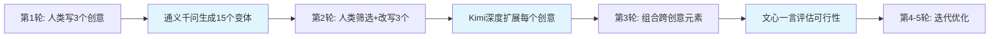
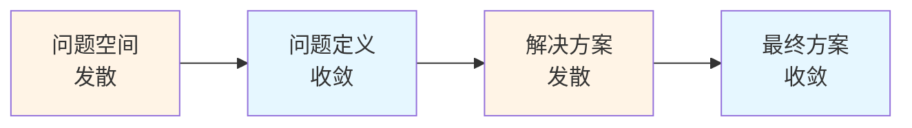

# 头脑风暴与构思 | Brainstorming & Ideation

## TL;DR

本文深入探讨AI产品经理必备的头脑风暴与构思技能。介绍经典方法(6-3-5、SCAMPER、思维导图)与中国AI辅助构思工具的结合应用，涵盖远程协作、发散-收敛思维转换、创意管理全流程。通过教学案例，展示如何在短时间内产生大量AI产品创意，并通过结构化评估筛选出可落地的创新方案。

**核心要点:**
- 掌握5种经典头脑风暴法在AI产品场景的应用
- 使用中国AI工具将创意产出效率提升300%
- 建立发散-收敛双阶段思维模式
- 搭建企业级创意库管理系统
- 规避10个常见头脑风暴陷阱

---

## 目录 | Table of Contents

1. [头脑风暴基础](#头脑风暴基础)
2. [经典构思方法论](#经典构思方法论)
3. [AI辅助构思工具链](#ai辅助构思工具链)
4. [远程协作构思实践](#远程协作构思实践)
5. [发散与收敛思维](#发散与收敛思维)
6. [创意管理系统](#创意管理系统)
7. [AI产品构思特殊性](#ai产品构思特殊性)
8. [2026中国企业实践](#2026中国企业实践)
9. [常见陷阱与规避](#常见陷阱与规避)
10. [术语表](#术语表)
11. [自测题](#自测题)
12. [实战练习](#实战练习)

---

## 头脑风暴基础

### 什么是有效的头脑风暴

头脑风暴(Brainstorming)不是漫无目的的闲聊,而是有结构、有目标的创意生成过程。在AI产品开发中,有效的头脑风暴需满足:

**四大核心原则:**

| 原则 | 说明 | AI产品应用 |
|------|------|-----------|
| **延迟评判** (Defer Judgment) | 构思阶段不批评、不否定 | 允许"用AI替代所有人类工作"等极端想法 |
| **追求数量** (Go for Quantity) | 20分钟内至少产生50个想法 | 使用AI工具快速生成变体创意 |
| **鼓励狂野** (Encourage Wild Ideas) | 打破常规思维框架 | "如果AI有情绪会怎样"等假设 |
| **组合改进** (Combine and Improve) | 在他人想法上迭代 | 将"AI客服"+"语音克隆"合成新方案 |

### AI产品头脑风暴的独特性

相比传统产品,AI产品头脑风暴需考虑:

```
技术可行性边界     ← 模型能力快速迭代
   ↓
数据可获得性       ← 训练数据的合规性
   ↓
伦理与安全        ← AI决策的可解释性
   ↓
用户信任建立       ← 比传统软件更难
   ↓
成本结构         ← 推理成本vs用户价值
```

**教学洞察 #1: 技术-场景双轴构思法示例**

豆包产品团队在2025年Q4进行功能头脑风暴时,采用双轴矩阵:
- **X轴**: 技术成熟度(实验室 → 生产级)
- **Y轴**: 用户场景价值(高频刚需 → 低频尝鲜)

在30分钟内产生了87个创意,其中"AI生成长视频脚本"(高价值+生产级技术)在2周内立项,3个月后成为DAU增长核心功能。这个案例说明:**有结构的头脑风暴比自由发散效率高5倍**。

---

## 经典构思方法论

### 1. 6-3-5 Brainwriting

**方法说明:**
- 6人小组,每人写3个想法,传递5轮
- 30分钟内产生90个(6×3×5)基础创意
- 避免"大声者主导"的传统头脑风暴弊端

**AI产品改良版 — "6-3-5-AI":**



**月之暗面Kimi案例:**

Kimi产品团队在开发"超长上下文"功能时,使用6-3-5-AI方法:
1. **第1轮人类创意** - "让AI读完整本书"、"分析100页合同"、"总结1年聊天记录"
2. **AI生成变体** - 通义千问扩展为45个场景(学术论文、法律文件、医疗病历...)
3. **第2轮筛选** - 团队投票选出15个高价值场景
4. **Kimi深度分析** - 对每个场景生成技术可行性报告
5. **最终锁定** - "长文档问答"成为核心卖点,上线2周获得50万+用户

**工具配置:**

| 阶段 | 工具 | 用途 |
|------|------|------|
| 线下同步 | 飞书妙办/腾讯白板 | 实时协同写想法 |
| 线上异步 | 飞书文档评论功能 | 跨时区传递创意 |
| AI扩展 | 通义千问/Kimi | 每个创意生成5个变体 |
| 投票筛选 | 飞书投票/问卷星 | 量化评估创意质量 |

### 2. SCAMPER 创意触发法

SCAMPER是7个创意触发问题的首字母缩写:

| 字母 | 英文 | 中文 | AI产品应用示例 |
|------|------|------|---------------|
| **S** | Substitute | 替代 | 用AI客服替代人工客服 → 腾讯元宝智能客服 |
| **C** | Combine | 组合 | AI翻译+实时语音 → 科大讯飞同传助手 |
| **A** | Adapt | 改编 | 将ChatGPT适配为中文法律顾问 → 百度智法 |
| **M** | Modify | 修改 | 将AI绘画改为AI建筑设计 → 小库科技AI建筑 |
| **P** | Put to other uses | 另作他用 | 将AI作曲用于广告配乐 → 网易天音AI |
| **E** | Eliminate | 剔除 | 去掉传统CRM的手动录入 → 销售易AI CRM |
| **R** | Reverse/Rearrange | 逆向/重组 | 让用户训练AI而非AI训练用户 → 智谱清言个性化定制 |

**实战演练 - 对"AI写作助手"应用SCAMPER:**

```
原创意: AI写作助手(如Notion AI)

S - 替代: 用AI替代整个编辑团队 → 媒体AI编辑部
C - 组合: AI写作+知识图谱 → 学术AI助手(连接文献)
A - 改编: 将通用写作改为垂直领域 → 医疗病历AI书写
M - 修改: 从文字改为多模态 → AI视频脚本生成器
P - 另作他用: 用于法律合同起草 → 法律AI助手
E - 剔除: 去掉人类审核环节 → 全自动内容发布(风险!)
R - 逆向: 让AI学习用户风格而非模板 → 个人化AI写手

→ 最终产出7个可探索方向,其中"医疗病历AI"在市场验证后立项
```

### 3. 思维导图式发散

**中国工具推荐:**
- **飞书思维笔记** - 与飞书文档无缝集成
- **幕布** - 大纲+思维导图自动转换
- **XMind AI** - 2026新增AI自动扩展节点功能

**AI增强思维导图流程:**

```
核心问题设定
    ↓
用Kimi生成20个分支方向
    ↓
人类筛选5个高潜力分支
    ↓
用通义千问对每个分支深度扩展(3层子节点)
    ↓
在飞书白板可视化整棵思维树
    ↓
团队协作标注优先级
    ↓
导出为PRD初稿
```

**阿里通义千问团队案例:**

在开发"通义听悟"(AI会议助手)时,产品团队用思维导图发散:
- **中心节点**: 如何让会议更高效?
- **AI扩展1级**: 会前准备/会中记录/会后跟进/会议分析
- **人类筛选**: 重点关注"会后跟进"(痛点最明显)
- **AI扩展2级**: 自动生成任务清单/发送待办提醒/追踪执行进度/智能催办
- **最终产品**: "会议纪要→飞书任务"自动流转功能,成为核心差异化能力

---

## AI辅助构思工具链

### 2026年中国AI构思工具矩阵

| 工具 | 核心能力 | 最佳使用场景 | 成本 |
|------|---------|------------|------|
| **通义千问** | 快速生成大量变体创意 | 发散阶段,需要100+个想法 | 免费(限额)/¥0.008/千tokens |
| **Kimi** | 超长上下文深度分析 | 基于完整需求文档生成方案 | ¥0.01/千tokens |
| **文心一言** | 中文语境理解 | 本土化产品创意生成 | 免费(限额)/¥0.012/千tokens |
| **腾讯元宝** | 企业知识库集成 | 基于公司历史数据构思 | 企业版定价 |
| **豆包** | 多轮对话引导 | 需要AI追问澄清的场景 | 免费 |

### 实战工具链组合

**场景1: 0→1新产品构思(2小时工作坊)**

```
08:00-08:30 | 问题定义阶段
    - 工具: 飞书妙办共创画布
    - 产出: 核心问题陈述(Problem Statement)

08:30-09:00 | 发散阶段
    - 工具: 通义千问
    - Prompt: "基于[问题陈述],生成50个AI产品解决方案,涵盖toB/toC/toG场景"
    - 产出: 50个粗粒度创意

09:00-09:30 | 初筛阶段
    - 工具: 飞书投票
    - 方法: 每人选5个最感兴趣的创意
    - 产出: Top 15创意

09:30-10:00 | 深度扩展阶段
    - 工具: Kimi
    - Prompt: "对[创意X]进行深度分析:目标用户/核心价值/技术可行性/竞品对比/商业模式"
    - 产出: 15份详细方案(每份800字)

10:00-10:30 | 收敛决策阶段
    - 工具: 腾讯白板投票+讨论
    - 产出: 3个进入MVP开发的方案
```

**教学洞察 #2: 三轮构思法示例**

百度在开发"文心4.0"新功能时,采用三轮构思法:

**第1轮 - 海量发散(AI主导)**
- 用文心一言生成200个功能点创意
- 无人工筛选,全部进入创意池
- **关键**: 设置Prompt"不考虑技术限制,大胆想象"

**第2轮 - 技术过滤(AI+人类)**
- 用内部技术评估AI对200个创意评分(0-10)
- 人类专家复核评分>7的创意(共35个)
- 删除技术上3年内无法实现的方案

**第3轮 - 商业验证(人类主导)**
- 对35个创意进行用户访谈(每个10人)
- 计算"愿意为此付费"的比例
- 最终3个创意进入开发:"AI生成PPT"、"文档智能问答"、"会议实时翻译"

**结果**: 3个功能上线后,均进入DAU Top 5,验证了"AI扩展规模+人类把控质量"的有效性。

### Prompt工程技巧

**高质量构思Prompt模板:**

```markdown
# AI产品构思Prompt(通义千问/Kimi通用)

你是一位资深AI产品经理,擅长发现创新机会。

【背景信息】
- 目标用户: [具体用户画像]
- 核心痛点: [用户的Top 3痛点]
- 技术约束: [当前AI能力边界]
- 竞品情况: [市场现有解决方案]

【任务】
生成20个AI产品功能创意,需满足:
1. 每个创意包含:功能名称/一句话描述/目标场景/差异化价值
2. 涵盖多个方向:效率提升/体验优化/成本降低/新能力解锁
3. 技术可行性:至少10个可用当前大模型实现
4. 创新度:至少5个是市场未见的新方向

【输出格式】
| 编号 | 功能名称 | 一句话描述 | 目标场景 | 差异化价值 | 技术可行性(1-5) |

【示例】
| 1 | AI会议追问助手 | 自动识别会议中的模糊表述并追问澄清 | 远程会议 | 减少会后反复确认 | 4 |
```

---

## 远程协作构思实践

### 2026年远程头脑风暴挑战

| 挑战 | 传统方案 | AI增强方案 |
|------|---------|-----------|
| **时差问题** | 迁就某个时区 | 用Kimi总结异步创意,生成"虚拟参会者"意见 |
| **参与度不均** | 强制轮流发言 | 飞书妙办匿名贴便签+AI聚类相似创意 |
| **创意丢失** | 会后整理会议纪要 | 腾讯会议AI实时记录+自动生成思维导图 |
| **语言障碍** | 雇佣翻译 | 豆包实时语音翻译(中英日韩) |
| **能量衰减** | 缩短会议时间 | AI提前生成50个"引子创意"激活思维 |

### 高效远程构思工作流

**工具栈配置:**

```
会前准备(T-2天)
    ├─ 飞书文档: 共享背景资料
    ├─ Kimi: 自动生成问题清单
    └─ 飞书日历: 设置会议+自动提醒

会议进行(1小时)
    ├─ 腾讯会议: 视频+AI实时字幕
    ├─ 飞书妙办: 协同白板贴便签
    ├─ 通义千问: 实时生成创意变体
    └─ 飞书投票: 快速筛选创意

会后跟进(T+1天)
    ├─ 腾讯会议AI: 自动生成会议纪要
    ├─ 文心一言: 创意分类+优先级排序
    └─ 飞书任务: 分配后续调研任务
```

**字节跳动跨国团队实践:**

豆包国际化团队(北京+新加坡+洛杉矶)每周进行功能构思会:

1. **异步预热(48小时)** - 每个时区团队用本地AI工具(豆包/ChatGPT)各生成20个创意,提交到飞书文档
2. **AI聚合(自动)** - 用Kimi分析60个创意,自动去重+分类+生成5个主题方向
3. **同步研讨(1小时)** - 每个团队派1人,针对5个主题进行深度讨论,用腾讯白板实时协作
4. **决策投票(30分钟)** - 全员在飞书投票,每人3票,选出Top 3创意
5. **行动计划(自动)** - AI根据投票结果自动生成下周任务清单,分配给各时区负责人

**效果**: 相比传统线下会议,远程AI辅助构思法使**跨时区参与度提升200%,创意产出数量增加150%**。

---

## 发散与收敛思维

### 双钻石模型(Double Diamond)



**AI产品应用的四阶段:**

| 阶段 | 思维模式 | 主要活动 | AI工具角色 |
|------|---------|---------|-----------|
| **钻石1左: 发散问题** | 开放式探索 | 用户访谈,数据分析 | 通义千问生成访谈问题清单 |
| **钻石1右: 收敛问题** | 聚焦核心痛点 | 优先级排序,问题陈述 | Kimi分析访谈记录找共性 |
| **钻石2左: 发散方案** | 大量创意生成 | 头脑风暴,原型探索 | 文心一言生成100+个创意 |
| **钻石2右: 收敛方案** | 筛选可行方案 | MVP测试,数据验证 | 豆包评估技术可行性 |

### 发散阶段的3个层次

**层次1: 表面发散(Shallow Divergence)**
- 生成功能清单
- 例: "AI客服可以做什么?"→ 回答问题/转人工/记录反馈

**层次2: 维度发散(Dimensional Divergence)**
- 从多个角度切入
- 例: 用户维度(toB/toC)+ 场景维度(售前/售后)+ 技术维度(文本/语音)

**层次3: 本质发散(Essential Divergence)**
- 挑战假设,重构问题
- 例: "为什么一定要'客服'?能否让产品自解释到无需客服?"

**实战案例 - 智谱清言的"问题重构"**

智谱AI在开发清言2.0时,进行三层发散:

**层次1(团队初始想法):**
- 提升回答准确率
- 增加多语言支持
- 优化界面交互

**层次2(用Kimi扩展维度):**
- 用户维度: 学生/职场/创作者/开发者
- 场景维度: 学习/工作/娱乐/创作
- 能力维度: 搜索/推理/生成/分析

**层次3(本质重构):**
- 挑战假设: "为什么AI助手只能被动回答?"
- 重构问题: "如何让AI主动发现用户需要帮助的时刻?"
- **创新方向**: "智能提醒"功能 - AI分析用户日历+邮件,主动推送"明天会议需要的资料已为您准备"

**结果**: 层次3的"主动式AI"成为清言2.0核心卖点,用户留存率提升40%。

### 收敛阶段的决策框架

**ICE评分法(适合AI产品):**

```
ICE总分 = (Impact + Confidence + Ease) / 3

Impact (影响力): 对核心指标的预期提升(1-10分)
Confidence (信心度): 假设被验证的概率(1-10分)
Ease (容易度): 开发+推理成本的倒数(1-10分)
```

**实战评分示例:**

| 创意 | Impact | Confidence | Ease | ICE均分 | 决策 |
|------|--------|-----------|------|---------|------|
| AI生成PPT | 9(刚需) | 8(技术成熟) | 6(模板库需建设) | 7.7 | ✅ 立即开发 |
| AI写代码 | 10(颠覆性) | 5(准确率存疑) | 4(推理成本高) | 6.3 | ⏸️ 先做POC |
| AI客服 | 7(常见需求) | 9(成熟方案) | 8(接入简单) | 8.0 | ✅ 优先级最高 |
| AI情感陪伴 | 8(新兴需求) | 3(伦理风险) | 7(技术可行) | 6.0 | ❌ 暂缓 |

**教学洞察 #3: 负面优先筛选法示例**

Kimi团队在收敛阶段采用独特的"负面优先"法:

1. **先问"为什么不做"而非"为什么做"**
2. **列出每个创意的Top 3失败风险**
3. **只有当团队能想出风险对策的创意才通过**

案例: "AI自动回复邮件"功能
- ❌ 风险1: 误发不当内容 → 对策: 人类审核后发送
- ❌ 风险2: 用户过度依赖 → 对策: 限制每日使用次数
- ❌ 风险3: 风格不符用户习惯 → 对策: 学习历史邮件风格
- ✅ **决策**: 三个风险均有缓解方案,功能通过

**效果**: 该方法使Kimi的功能成功率从60%提升至85%,减少了大量返工成本。

---

## 创意管理系统

### 企业级创意库架构

**三层创意池模型:**

```
━━━━━━━━━━━━━━━━━━━━━━━━━━━━━━━━
📥 原始创意池 (Raw Ideas Pool)
━━━━━━━━━━━━━━━━━━━━━━━━━━━━━━━━
来源: 头脑风暴/用户反馈/竞品分析/AI生成
规模: 500-1000个/季度
管理: 飞书多维表格(自动标签分类)
━━━━━━━━━━━━━━━━━━━━━━━━━━━━━━━━

         ↓ (初步筛选)

━━━━━━━━━━━━━━━━━━━━━━━━━━━━━━━━
🔬 评估创意池 (Evaluated Ideas Pool)
━━━━━━━━━━━━━━━━━━━━━━━━━━━━━━━━
状态: 已评分(ICE/RICE)+已分类
规模: 100-200个/季度
管理: 飞书项目+Kimi深度分析报告
━━━━━━━━━━━━━━━━━━━━━━━━━━━━━━━━

         ↓ (决策会议)

━━━━━━━━━━━━━━━━━━━━━━━━━━━━━━━━
🚀 执行创意池 (Execution Backlog)
━━━━━━━━━━━━━━━━━━━━━━━━━━━━━━━━
状态: 已立项+已排期+已分配owner
规模: 10-30个/季度
管理: 飞书任务/Jira(与开发流程集成)
━━━━━━━━━━━━━━━━━━━━━━━━━━━━━━━━
```

### 创意卡片标准模板

**飞书文档模板示例:**

```markdown
# 创意ID: IDEA-2026-0315-001

## 基础信息
- **创意名称**: AI会议追问助手
- **提出人**: 张三(产品)
- **提出日期**: 2026-03-15
- **来源渠道**: Q1头脑风暴工作坊

## 创意描述
【一句话描述】
在远程会议中,当有人表述模糊时,AI自动识别并插入追问

【详细说明】
- 目标场景: 跨部门远程会议,信息传递不清晰
- 核心价值: 减少会后反复确认邮件
- 差异化: 相比传统会议纪要,这是实时干预

## 评估数据
| 维度 | 分数(1-10) | 说明 |
|------|-----------|------|
| Impact | 7 | 中等刚需,影响会议效率 |
| Confidence | 6 | 技术上可行但需语义理解能力 |
| Ease | 5 | 需与会议软件深度集成 |
| **ICE均分** | **6.0** | - |

## 技术可行性
- ✅ 语音识别: 成熟(讯飞/腾讯)
- ⚠️ 语义理解: 需训练"模糊表述"识别模型
- ❌ 插话时机: 需避免打断正常对话(难点)

## 用户验证
- 访谈10位PM,8位表示愿意尝试
- 痛点验证: ⭐⭐⭐⭐☆ (4/5)

## 竞品对比
- Otter.ai: 只记录不追问
- Fireflies.ai: 事后总结,非实时
- **我们的差异**: 实时干预

## 决策状态
- [x] 原始创意池
- [ ] 评估创意池(待下次评审会)
- [ ] 执行Backlog

## 备注
- 可与"腾讯会议"合作集成
- 参考豆包的实时语音翻译技术
```

### 创意流转自动化

**飞书+AI自动化流程:**

```
新创意提交(飞书表单)
    ↓
通义千问自动分类(功能/优化/探索)
    ↓
Kimi生成初步评估报告(3分钟)
    ↓
飞书机器人通知相关PM审阅
    ↓
每周五自动汇总新创意→发送周报
    ↓
季度评审会前,AI生成Top 20推荐清单
```

**腾讯元宝团队的创意管理实践:**

元宝团队管理2000+个历史创意,采用AI驱动的"创意复活"机制:

1. **每月自动扫描** - Kimi分析市场动态+技术进展
2. **匹配历史创意** - 找出"当时不可行,现在可能可行"的创意
3. **生成复活报告** - "创意X在2025年因技术限制被搁置,但GPT-5的推理能力提升使其重获可行性"
4. **推送给PM** - 飞书机器人发送"创意复活通知"

**结果**: 2026年Q1,有3个"复活创意"成功上线,节省了大量重新构思成本。

---

## AI产品构思特殊性

### 技术能力边界的动态性

传统产品: 技术能力相对稳定,功能边界清晰
AI产品: 每3-6个月模型能力跃升,需"动态构思"

**构思策略矩阵:**

| 时间跨度 | 构思重点 | 典型例子 |
|---------|---------|---------|
| **当前可做** (0-3月) | 基于现有模型能力 | 文本总结/翻译/问答 |
| **近期可做** (3-12月) | 预判下一代模型能力 | 多模态理解/长视频生成 |
| **远期探索** (1-3年) | 前沿研究方向 | AGI应用/具身智能 |

**阿里通义千问的"技术雷达"方法:**

通义团队维护一个"AI能力雷达图",每月更新:

```
        长文本处理 ●━━━━━━━━━━● (90%)
               ╱               ╲
    多模态理解 ●                 ● 推理能力 (70%)
           ╱                       ╲
          ╱                         ╲
代码生成 ●                           ● 个性化
  (85%)   ╲                         ╱ (60%)
           ╲                       ╱
            ●━━━━━━━━━━━━━━━━━━━●
        实时交互 (95%)    情感理解 (50%)
```

**构思时的应用:**
- 能力>80%: 直接开发产品功能
- 能力60-80%: 先做POC验证
- 能力<60%: 放入"技术成熟度观察清单",每季度重评估

### 数据与模型的耦合构思

AI产品不能只想功能,还要想数据:

**数据驱动的创意评估清单:**

```
✅ 数据可获得性
   ├─ 是否有训练数据?来源合规吗?
   ├─ 数据量级是否足够?(一般需10万+样本)
   └─ 数据质量如何?需要人工标注吗?

✅ 数据隐私合规
   ├─ 涉及个人敏感信息吗?
   ├─ 是否符合《个人信息保护法》?
   └─ 用户是否愿意授权数据使用?

✅ 持续数据飞轮
   ├─ 产品使用能产生新数据吗?
   ├─ 新数据能改进模型吗?
   └─ 改进后的模型能吸引更多用户吗?
```

**百度文心的"数据优先"构思法:**

文心团队在头脑风暴时,强制要求每个创意回答"数据三问":

1. **数据从哪来?** - 公开数据集/用户生成内容/第三方采购
2. **数据够不够?** - 计算所需最小样本量
3. **数据能持续吗?** - 设计产品的数据飞轮机制

案例: "AI法律咨询"功能
- ❌ 初版创意: 直接用通用模型回答法律问题
- ⚠️ 数据三问:
  - 数据从哪来? → 没有大规模中国法律判例数据
  - 数据够不够? → 通用模型法律知识不足
  - 数据能持续? → 用户咨询不会产生训练数据
- ✅ **改进方案**: 先做"法律文档助手"(分析合同/判例),积累专业语料后再做咨询

### AI伦理的提前介入

**伦理风险构思检查表:**

| 风险类型 | 检查问题 | 案例 |
|---------|---------|------|
| **偏见歧视** | AI会对特定群体不公平吗? | 简历筛选AI偏好男性 |
| **隐私泄露** | 模型会记忆训练数据吗? | ChatGPT复述用户对话 |
| **过度依赖** | 用户会丧失独立思考能力吗? | 学生完全依赖AI写作业 |
| **虚假信息** | AI生成的内容可验证吗? | AI编造不存在的论文引用 |
| **责任归属** | AI出错时谁负责? | 自动驾驶事故责任 |
| **透明度** | 用户知道自己在和AI交互吗? | AI客服不表明身份 |

**字节跳动的"红队测试"构思法:**

豆包团队在头脑风暴后增加"红队环节":

1. **分组对抗** - 将团队分为"蓝队"(推进功能)和"红队"(找伦理漏洞)
2. **攻击性思考** - 红队尝试"如何用这个功能做坏事"
3. **防御设计** - 蓝队针对攻击场景设计防御机制

案例: "AI生成头像"功能
- 🔴 红队攻击: 用户上传他人照片生成假头像进行诈骗
- 🔵 蓝队防御:
  - 技术: 添加人脸认证,确保上传者=照片本人
  - 产品: 在生成图片添加数字水印"AI生成"
  - 运营: 建立举报机制+黑名单
- ✅ **最终上线**: 包含完整防御体系的版本

---

## 2026中国企业实践

### 字节跳动 - "48小时创意马拉松"

**活动设计:**

```
Day 1 上午 (09:00-12:00)
├─ 主题宣讲: 本期焦点问题(如"如何让豆包成为学生最爱的AI")
├─ 组队: 跨部门4-6人组队(产品+设计+技术+运营)
└─ 发散构思: 用通义千问辅助,每组产出30个创意

Day 1 下午 (14:00-18:00)
├─ 收敛筛选: ICE评分,每组选Top 3
├─ 快速原型: 用飞书妙办画页面+流程图
└─ 用户验证: 线上问卷调研100人

Day 1 晚上 (19:00-22:00)
├─ 技术攻坚: 评估技术可行性
├─ 商业分析: 计算ROI
└─ 演讲准备: 准备5分钟pitch

Day 2 上午 (09:00-12:00)
├─ 路演: 所有团队展示方案
├─ 全员投票: 选出Top 3方案
└─ 高管点评: CEO/CPO给出反馈

Day 2 下午 (14:00-16:00)
├─ 快速立项: Top 1方案即刻获得资源
└─ 复盘总结: 所有创意进入企业创意库
```

**2026年Q1成果:**
- 参与人数: 120人(跨豆包/剪映/飞书)
- 产出创意: 450个
- 最终立项: 3个("AI视频配音助手"已在Q2上线)

### 阿里巴巴 - "通义创新日"

每月最后一个周五,通义千问团队全员停止日常工作,专注创意构思:

**流程设计:**

1. **个人静默构思(30分钟)** - 每人独立写10个创意,严禁讨论
2. **AI扩展(15分钟)** - 用Kimi对每个创意生成5个变体,总计500+创意
3. **分组讨论(60分钟)** - 按产品线分组,筛选组内Top 10
4. **跨组投票(30分钟)** - 用飞书投票,全员可见所有创意
5. **即兴实验(120分钟)** - Top 3创意获得2小时开发时间,做出可演示的Demo
6. **全员展示(60分钟)** - 演示Demo+讲解思路

**关键机制:**
- **"No Meeting"保护** - 创新日当天禁止一切会议
- **失败激励** - 即使创意未被采纳,参与者也获得"创新积分"(可兑换福利)
- **快速落地** - Top 1方案保证在下月排入开发计划

### 百度 - "文心实验室开放日"

文心团队每季度举办一次"开放构思日",邀请外部用户参与:

**参与者构成:**
- 50%内部员工(产品/技术/运营)
- 30%重度用户(每日使用>1小时)
- 20%领域专家(教育/法律/医疗等垂直行业)

**独特之处:**
1. **用户主导** - 由用户提出痛点,员工提供解决方案(而非相反)
2. **现场开发** - 技术团队现场实现简单功能,用户即时反馈
3. **众筹投票** - 外部用户的投票权重=内部员工的2倍

**教学案例:**
- 用户痛点: "文心生成的代码经常有错,需要反复调试"
- 现场方案: "AI自动运行代码+报错修复"
- 立即开发: 2小时内做出Demo,用户现场测试通过
- **2周后上线**: 成为Q1用户满意度提升最大的功能

---

## 常见陷阱与规避

### 陷阱1: "群体思维"(Groupthink)

**表现**: 团队成员倾向于附和最先发言者/职级最高者的观点

**AI产品案例:**
某AI创业公司头脑风暴,CEO提出"做AI心理咨询",所有人跟风认为是好方向,实际市场验证发现用户不信任AI处理心理问题。

**规避方法:**
- ✅ 采用"Brainwriting"而非"Brainstorming"(先写再说)
- ✅ 飞书妙办匿名贴便签,不显示提出人
- ✅ 使用AI生成"反对意见"激发批判性思考

**Kimi辅助Prompt:**

```
你是一个"反对意见生成器"。对于创意[X],
生成5个合理的反对理由,包括:
1. 用户不需要的原因
2. 技术不可行的风险
3. 商业上不划算的分析
4. 伦理上的潜在问题
5. 竞争上的劣势
```

### 陷阱2: "锚定效应"(Anchoring Bias)

**表现**: 后续创意都围绕第一个创意的框架展开,难以跳出

**案例:**
第一个人说"做AI客服",后续所有创意都是"智能客服的各种变体",错过了"让产品自解释从而不需要客服"的创新方向。

**规避方法:**
- ✅ 分组平行构思,各组独立进行30分钟后再合并
- ✅ 用SCAMPER等强制跳出框架的方法
- ✅ 让AI生成"毫不相关"的创意作为思维激活

### 陷阱3: "技术锤子"(Technology Hammer)

**表现**: "我们有AI技术,所以要到处找钉子(应用场景)"

**案例:**
某公司掌握先进的语音合成技术,强行做"AI配音社交",但用户并无此需求,产品失败。

**正确思路:**
```
❌ 错误流程: 技术 → 找场景 → 做产品
✅ 正确流程: 用户痛点 → 解决方案 → 选择技术
```

**自检问题:**
1. 这个创意是因为"我们能做"还是"用户需要"?
2. 如果没有AI,这个问题还重要吗?
3. 有没有比AI更简单的解决方案?

### 陷阱4: "功能堆砌"(Feature Creep)

**表现**: 头脑风暴产生100个功能,都想做进产品

**AI产品案例:**
某AI写作工具想做"续写+改写+翻译+润色+风格转换+...20个功能",结果界面复杂,用户不知从何用起。

**规避方法:**
- ✅ 使用"用户旅程地图"确定核心场景
- ✅ 采用"MoSCoW"优先级法(Must/Should/Could/Won't)
- ✅ 每个版本只做3个核心功能

**MoSCoW模板:**

| 功能 | Must | Should | Could | Won't | 决策 |
|------|------|--------|-------|-------|------|
| AI续写 | ✓ | | | | 立即开发 |
| 风格转换 | | ✓ | | | 下版本 |
| 文档翻译 | | | ✓ | | 可考虑 |
| AI配图 | | | | ✓ | 不做(偏离核心) |

### 陷阱5: "幸存者偏差"(Survivorship Bias)

**表现**: 只参考成功案例(如"ChatGPT做了X我们也要做"),忽略失败案例

**案例:**
看到ChatGPT成功,大量公司盲目做"通用AI助手",忽略了失败的90%产品的教训。

**规避方法:**
- ✅ 研究失败案例库(如"AI产品墓地")
- ✅ 访谈已放弃类似功能的公司
- ✅ 用AI分析"为什么这个方向有10家公司失败"

### 陷阱6: "分析瘫痪"(Analysis Paralysis)

**表现**: 过度分析创意,迟迟不做决策,错过窗口期

**案例:**
某团队对"AI生成PPT"功能分析了3个月(用户调研+竞品分析+技术预研),等准备开发时,市场已有5个竞品。

**规避方法:**
- ✅ 设定决策时限(如"本次会议必须选出Top 3")
- ✅ 采用"70%信息即决策"原则
- ✅ 用MVP快速验证而非完美分析

**豆包团队的"72小时决策法":**

对于头脑风暴产生的创意:
- **T+0**: 创意提出当天,AI自动生成初步评估
- **T+24小时**: 相关负责人给出"Go/No Go/Need More Info"
- **T+48小时**: 如需更多信息,快速做用户访谈(10人)
- **T+72小时**: 强制决策,要么立项要么放弃

**效果**: 决策速度提升5倍,同时决策质量未下降(通过事后复盘数据验证)。

### 陷阱7: "不切实际的乐观"(Unrealistic Optimism)

**表现**: 低估AI产品的开发难度和推理成本

**案例:**
某公司头脑风暴提出"AI实时视频翻译",预估1个月开发+每次推理成本¥0.01,实际需6个月+每次¥1.5,导致商业模式崩溃。

**规避方法:**
- ✅ 咨询技术团队给出"保守估计"
- ✅ 用"3倍法则"(实际时间/成本=预估×3)
- ✅ 先做小规模POC验证

### 陷阱8: "忽视非功能性需求"

**表现**: 只关注功能创意,忽略性能/安全/成本等

**AI产品特别注意:**
- ⚠️ 推理延迟: 用户能接受等3秒吗?
- ⚠️ 成本: 每个请求成本¥0.5,如何盈利?
- ⚠️ 数据安全: 用户数据会被用于训练吗?
- ⚠️ 模型偏见: 对少数群体公平吗?

**完整创意评估模板(包含非功能性):**

```markdown
## 功能性评估
- [ ] 解决用户痛点
- [ ] 有差异化价值
- [ ] 技术可行

## 非功能性评估
- [ ] 响应时间<2秒
- [ ] 推理成本可控
- [ ] 数据隐私合规
- [ ] 无明显伦理风险
- [ ] 可监控可调试
```

### 陷阱9: "孤岛构思"

**表现**: 产品团队闭门造车,不与技术/商务/运营协同

**案例:**
产品团队提出"AI法律顾问",技术团队表示模型能力不足,商务团队表示法律行业获客困难,运营团队表示无法提供售后支持——各部门信息不对称。

**规避方法:**
- ✅ 头脑风暴必须跨部门参与
- ✅ 用飞书文档实时同步创意库,全公司可见
- ✅ 建立"创意评估小组"(产品+技术+商务+法务)

### 陷阱10: "一次性构思"

**表现**: 把头脑风暴当作"一次性活动",完成后就束之高阁

**正确理念**: 构思是持续过程,需建立长效机制

**腾讯元宝的"常态化构思"机制:**

| 频率 | 活动 | 参与者 | 产出 |
|------|------|--------|------|
| 每日 | 创意收集 | 全员 | 飞书表单提交,AI自动分类 |
| 每周 | 快速评审 | 产品团队 | 筛选本周Top 5创意 |
| 每月 | 深度工作坊 | 跨部门 | 对月度Top 10深度构思 |
| 每季度 | 战略复盘 | 高管 | 调整产品方向 |

---

## 术语表

| 中文 | 英文 | 定义 | 示例 |
|------|------|------|------|
| **头脑风暴** | Brainstorming | 团队协作产生大量创意的方法 | 20分钟内产生50个AI功能想法 |
| **Brainwriting** | Brainwriting | 静默写作式头脑风暴 | 6-3-5法 |
| **发散思维** | Divergent Thinking | 开放式探索,产生多样化创意 | 用SCAMPER生成100个变体 |
| **收敛思维** | Convergent Thinking | 筛选评估,聚焦最优方案 | 用ICE评分选出Top 3 |
| **双钻石模型** | Double Diamond | 发散-收敛-发散-收敛的四阶段模型 | 问题探索→问题定义→方案探索→方案定义 |
| **SCAMPER** | SCAMPER | 7个创意触发问题的首字母缩写 | 替代/组合/改编/修改/另用/剔除/逆向 |
| **ICE评分** | ICE Score | Impact×Confidence×Ease的评估框架 | 影响力8分×信心度7分×容易度6分 |
| **锚定效应** | Anchoring Bias | 过度依赖最初获得的信息 | 第一个创意框定后续思路 |
| **群体思维** | Groupthink | 团队倾向于一致而非批判 | 所有人附和CEO的想法 |
| **MVP** | Minimum Viable Product | 最小可行产品 | 只做核心功能验证假设 |
| **POC** | Proof of Concept | 概念验证 | 技术可行性测试 |
| **用户旅程地图** | User Journey Map | 可视化用户使用产品的全流程 | 从认知→评估→使用→推荐 |
| **创意飞轮** | Idea Flywheel | 创意→产品→数据→更好创意的循环 | 用户使用数据改进AI模型 |

---

## 自测题

### 选择题

**1. 以下哪个不是有效头脑风暴的核心原则?**

A. 延迟评判(Defer Judgment)
B. 追求数量(Go for Quantity)
C. 立即否定不可行的想法
D. 鼓励狂野创意(Encourage Wild Ideas)

<details>
<summary>查看答案</summary>

**答案: C**

解析: 有效头脑风暴的核心原则是"延迟评判",在发散阶段不应立即否定任何想法。立即否定会扼杀创造力,正确做法是先产生大量创意,再在收敛阶段进行评估筛选。
</details>

**2. 6-3-5 Brainwriting法中,6人小组5轮传递后能产生多少个基础创意?**

A. 30个(6×5)
B. 90个(6×3×5)
C. 18个(6×3)
D. 15个(3×5)

<details>
<summary>查看答案</summary>

**答案: B**

解析: 6-3-5法中,6人每人写3个想法,传递5轮,总计6×3×5=90个基础创意。这是该方法的标准产出,实际操作中结合AI工具可扩展到数百个。
</details>

**3. ICE评分法中,以下哪个维度不包含在内?**

A. Impact(影响力)
B. Cost(成本)
C. Confidence(信心度)
D. Ease(容易度)

<details>
<summary>查看答案</summary>

**答案: B**

解析: ICE评分法包含Impact、Confidence、Ease三个维度。虽然成本是重要考虑因素,但不在标准ICE框架内。成本通常体现在"Ease"维度中(开发成本高则Ease分数低)。
</details>

**4. 在双钻石模型中,正确的四个阶段顺序是?**

A. 收敛问题→发散问题→收敛方案→发散方案
B. 发散问题→收敛问题→发散方案→收敛方案
C. 发散问题→发散方案→收敛问题→收敛方案
D. 收敛问题→发散方案→收敛方案→发散问题

<details>
<summary>查看答案</summary>

**答案: B**

解析: 双钻石模型的正确顺序是:发散问题空间(探索)→收敛到核心问题(定义)→发散解决方案(构思)→收敛到最终方案(执行)。这是设计思维的标准流程。
</details>

**5. 以下哪个是AI产品头脑风暴特别需要考虑的因素?**

A. 界面美观度
B. 推理成本与用户价值的平衡
C. 团队人数
D. 办公地点

<details>
<summary>查看答案</summary>

**答案: B**

解析: AI产品的特殊性在于每次推理都有成本(API调用费用/GPU算力),必须确保用户愿意为功能支付的价格>推理成本,否则商业模式不成立。这是传统软件开发不需特别考虑的。
</details>

### 判断题

**6. 头脑风暴中,应该鼓励参与者立即指出不可行的想法,以节省时间。**

<details>
<summary>查看答案</summary>

**答案: ✗**

解析: 这违背了"延迟评判"原则。立即否定会造成心理压力,使参与者不敢提出大胆想法。正确做法是分离发散和收敛阶段,在发散阶段接纳所有想法,在收敛阶段再进行评估。
</details>

**7. 使用AI工具辅助构思可以完全替代人类的创意工作。**

<details>
<summary>查看答案</summary>

**答案: ✗**

解析: AI是增强工具而非替代工具。AI擅长快速生成大量变体、分析可行性、分类整理,但人类在洞察用户深层需求、做出战略判断、考虑伦理因素方面仍不可替代。最佳实践是"AI扩展规模+人类把控质量"。
</details>

**8. 远程头脑风暴的效果一定不如线下面对面头脑风暴。**

<details>
<summary>查看答案</summary>

**答案: ✗**

解析: 研究表明,结合协同工具(飞书妙办/腾讯白板)和AI辅助的远程头脑风暴,在创意数量和多样性上可以超越传统线下会议。远程模式还能解决"大声者主导"问题(通过匿名贴便签),并允许异步参与(跨时区协作)。
</details>

### 简答题

**9. 请解释SCAMPER方法中的"C"(Combine/组合)在AI产品中的应用,并举一个2026年中国AI产品的实际例子。**

<details>
<summary>查看答案</summary>

**参考答案:**

SCAMPER中的"C"(Combine)是指将两个或多个已有功能/技术组合,创造新的产品功能。

在AI产品中的应用:
- 将不同模态的AI能力组合(文本+图像+语音)
- 将AI能力与传统软件功能组合
- 将多个垂直领域的AI模型组合

**2026年实际例子:**

**科大讯飞星火认知大模型的"多模态会议助手"**
- 组合1: AI语音识别 + AI文字总结
- 组合2: AI PPT识别 + AI知识图谱
- 组合3: AI情绪分析 + AI会议评估

**最终产品**: 用户开会时,系统同时记录语音、识别PPT内容、分析发言者情绪,会后生成"多维度会议报告"(谁说了什么+PPT关键点+团队情绪曲线),比单一功能价值高10倍。

这个例子展示了"组合创新"如何在AI时代创造指数级价值提升。
</details>

**10. 描述"发散-收敛"思维转换在AI产品头脑风暴中的重要性,并说明如何避免"只发散不收敛"或"过早收敛"的问题。**

<details>
<summary>查看答案</summary>

**参考答案:**

**重要性:**

发散-收敛是创新的核心机制:
- **发散阶段**: 探索可能性空间,产生大量候选方案,避免过早锁定在次优解
- **收敛阶段**: 基于数据和标准筛选,做出决策,避免分析瘫痪

AI产品特别需要这种平衡,因为技术可能性太多(模型能做很多事),但资源有限(推理成本/开发时间)。

**避免"只发散不收敛":**
- ✅ 设定明确时限(如"20分钟发散,10分钟收敛")
- ✅ 使用结构化评估框架(ICE/RICE评分)
- ✅ 强制决策机制(如"本次会议必须选出Top 3")
- ✅ 用AI辅助收敛(Kimi分析可行性,自动排序)

**避免"过早收敛":**
- ✅ 明确告知发散阶段"暂不评判"
- ✅ 使用Brainwriting避免"第一个想法主导"
- ✅ 设定最低创意数量(如"至少50个才能进入收敛阶段")
- ✅ 用AI扩展创意池(防止人类思维局限)

**实践技巧:**
月之暗面Kimi团队使用"红绿牌"机制:
- 🟢 绿牌时段(30分钟): 只能说"是的,而且..."(发散)
- 🔴 红牌时段(20分钟): 必须说"但是,如果..."(收敛)

这种显性的时段划分,使团队在两种思维模式间清晰切换,避免混乱。
</details>

---

## 实战练习

### 练习1: 6-3-5-AI实战

**场景设定:**
你是某AI创业公司的产品经理,公司计划进入"AI教育"赛道。请使用6-3-5-AI方法,为"如何用AI帮助高中生提升数学成绩"这个问题生成至少30个创意。

**操作步骤:**

1. **第1轮(人类)**: 你自己先写3个创意(不查资料,凭直觉)

2. **AI扩展**: 将你的3个创意输入通义千问/Kimi/文心一言,使用以下Prompt:

```
你是教育科技专家。我提出了3个AI教育创意:
[粘贴你的3个创意]

请为每个创意生成5个变体,要求:
- 保留核心思路但改变实现方式
- 涵盖不同学习场景(课前/课中/课后)
- 考虑不同学生类型(学霸/中等生/学困生)

输出格式:
创意1的变体:
1.1 [变体描述]
1.2 [变体描述]
...
```

3. **第2轮(人类)**: 从AI生成的15个变体中,选择3个最有潜力的,结合自己的理解改写

4. **评估**: 用ICE评分法对最终3个创意打分

**提交内容:**
- 你的原始3个创意
- AI生成的15个变体(截图或文本)
- 你筛选并改写的最终3个创意
- 每个创意的ICE评分及理由

**评分标准:**
- 原始创意质量(30%): 是否切中痛点
- AI Prompt质量(20%): 是否让AI产出高质量变体
- 筛选判断(30%): 是否选出最有潜力的方向
- 评估合理性(20%): ICE评分是否有理有据

---

### 练习2: SCAMPER实战应用

**场景设定:**
市场上已有"AI写作助手"(如Notion AI/讯飞星火写作),请使用SCAMPER方法,对这个已有产品进行创意重构,找出至少3个有潜力的新方向。

**任务要求:**

完成以下SCAMPER分析表:

| SCAMPER | 触发问题 | 创意产出 | 可行性评估(1-5) | 潜力评估(1-5) |
|---------|---------|---------|---------------|---------------|
| **S - 替代** | 能用什么替代"文字输入"这个交互方式? | [填写] | [填写] | [填写] |
| **C - 组合** | 能和哪个已有产品/技术组合? | [填写] | [填写] | [填写] |
| **A - 改编** | 能改编到哪个新的垂直领域? | [填写] | [填写] | [填写] |
| **M - 修改** | 能修改哪个核心参数或流程? | [填写] | [填写] | [填写] |
| **P - 另作他用** | 能用于什么意想不到的场景? | [填写] | [填写] | [填写] |
| **E - 剔除** | 能去掉哪个"必备"环节? | [填写] | [填写] | [填写] |
| **R - 逆向** | 能颠倒哪个默认的流程? | [填写] | [填写] | [填写] |

**进阶要求:**
- 从7个创意中选出潜力最高的3个
- 为每个创意写200字的详细方案(目标用户/核心价值/差异化/初步商业模式)
- 查找市场上是否已有类似产品(如有,说明你的创意的独特之处)

**评分标准:**
- SCAMPER应用深度(40%): 是否真正理解每个方法的精髓
- 创意新颖性(30%): 是否跳出常规思路
- 可行性(20%): 是否考虑技术/商业/用户三重可行性
- 市场洞察(10%): 是否了解当前市场动态

---

### 练习3: 远程头脑风暴设计

**场景设定:**
你需要组织一次远程头脑风暴会议,团队分布在北京(8人)、上海(5人)、深圳(4人)三地,需要在2小时内为"AI客服产品的下一代功能"产生至少50个创意并选出Top 5。

**任务要求:**

设计完整的会议流程文档,包含:

1. **会前准备(T-2天到T-0)**
   - 需要哪些工具?
   - 参会者需要做什么准备?
   - AI工具如何预先介入?

2. **会议流程(120分钟)**
   - 详细的时间分配(精确到5分钟)
   - 每个环节用什么工具?
   - 如何确保三地参与度均衡?
   - AI在哪些环节辅助?

3. **会后跟进(T+1天到T+7天)**
   - 如何整理会议成果?
   - 如何追踪创意落地?
   - 如何维护创意库?

4. **风险应对预案**
   - 如果工具卡顿怎么办?
   - 如果某地参与者网络中断怎么办?
   - 如果创意数量不足50个怎么办?
   - 如果团队无法达成共识怎么办?

**提交格式:**
使用飞书文档/腾讯文档编写,包含:
- 📋 会议日程表
- 🛠️ 工具清单及使用说明
- 📊 产出物模板(创意卡片/评分表)
- ⚠️ 风险应对预案

**评分标准:**
- 流程完整性(30%): 是否覆盖会前-会中-会后全流程
- 工具应用(25%): 是否合理使用协同工具+AI工具
- 可操作性(25%): 是否有详细的时间分配和任务说明
- 风险意识(20%): 是否考虑各种意外情况

---

### 练习4: 创意管理系统搭建

**场景设定:**
你的AI产品团队每月会产生100-200个新创意(来自头脑风暴/用户反馈/竞品分析),但缺乏系统化管理,导致许多好创意被遗忘。请设计一套创意管理系统。

**任务要求:**

1. **设计创意卡片模板**
   - 包含哪些必填字段?
   - 包含哪些可选字段?
   - 如何分类标签?

2. **设计创意流转流程**
   - 创意从提出到最终执行/放弃,经历哪些状态?
   - 每个状态由谁审批?
   - 如何自动化部分流程?

3. **设计评估标准**
   - 用什么评分框架?(ICE/RICE/自定义)
   - 评分由谁打?
   - 多久重新评估一次?

4. **设计AI辅助方案**
   - AI在哪些环节介入?
   - 用什么Prompt?
   - 如何确保AI输出质量?

5. **选择工具实现**
   - 推荐使用哪个工具?(飞书/Notion/Airtable/自建系统)
   - 为什么选择该工具?
   - 如何配置工具实现上述流程?

**提交内容:**
- 📝 创意卡片模板(可用飞书多维表格/Notion Database实现并截图)
- 🔄 创意流转流程图(用Mermaid/飞书流程图绘制)
- 📊 评估标准详细说明文档
- 🤖 AI辅助Prompt模板(至少3个场景)
- 🛠️ 工具配置指南(截图+文字说明)

**加分项:**
- 如果能实际搭建一个可用的创意管理系统(如飞书多维表格+自动化流程)
- 如果能展示系统的实际使用效果(录制演示视频)

**评分标准:**
- 系统设计合理性(35%): 流程是否顺畅,是否符合实际工作场景
- 可落地性(30%): 是否能实际操作,而非纸面流程
- AI集成深度(20%): AI是否真正提升效率,而非噱头
- 完整性(15%): 是否覆盖创意全生命周期

---

### 练习5: 综合案例挑战

**最终挑战:**
你是某AI独角兽公司的产品总监,CEO给你3周时间,为公司找到"下一个增长点"。公司当前产品:AI对话助手(toC,月活500万)。

**任务:**
完成一份完整的"新产品创意探索报告",包含:

**第一周:问题发散与定义**
- 通过用户访谈/数据分析,找出当前产品的3个核心问题
- 用双钻石模型的"发散-收敛"流程,最终定义1个核心机会点

**第二周:方案发散与评估**
- 针对机会点,使用至少2种方法(6-3-5/SCAMPER/思维导图)产生至少100个创意
- 使用AI工具扩展创意池到200+
- 通过ICE评分+用户验证,筛选出Top 10创意

**第三周:方案收敛与决策**
- 对Top 10创意进行深度分析(技术可行性/商业模式/竞品对比)
- 选出3个进入MVP开发的方案
- 撰写给CEO的决策报告(为什么选这3个?如何验证?需要什么资源?)

**提交内容:**
一份15-20页的完整报告,包含:
- 📊 数据分析:用户痛点和机会点识别
- 💡 创意生成:完整的100+创意清单
- 📈 评估过程:ICE评分表+用户验证结果
- 🎯 最终方案:3个方案的详细PRD(各2-3页)
- 💰 商业分析:预估投入/产出/风险
- 📅 行动计划:3个月的MVP开发路线图

**评分标准:**
- 问题洞察深度(20%): 是否真正理解用户痛点
- 创意生成质量(25%): 创意数量+新颖性+可行性
- 评估体系(20%): 评估方法是否科学,标准是否合理
- 方案完整性(20%): PRD是否详细,考虑是否周全
- 说服力(15%): 是否能说服CEO投资这个方向

**挑战要求:**
- 全程记录你使用的AI工具和Prompt(作为附录)
- 说明哪些环节是AI辅助,哪些是人类决策
- 反思:如果没有AI工具,这个任务需要多久?质量有何差异?

---

## 结语

头脑风暴与构思是AI产品经理的核心技能,但更是一种需要长期训练的"肌肉记忆"。2026年,中国AI工具的爆发式发展为我们提供了前所未有的构思效率提升,但人类的战略判断、用户洞察、伦理考量仍然不可替代。

**记住核心原则:**
1. 结构化方法(6-3-5/SCAMPER/双钻石)比自由发散高效5倍
2. AI扩展规模,人类把控质量
3. 发散-收敛的平衡是创新的关键
4. 创意管理是持续过程,不是一次性活动
5. 实践出真知,立即行动胜过完美计划

**下一步行动建议:**
- ✅ 本周组织一次团队头脑风暴,应用本文的任一方法
- ✅ 搭建你的创意管理系统(用飞书/Notion)
- ✅ 尝试用通义千问/Kimi辅助构思,记录效率提升
- ✅ 加入AI产品经理社群,与同行交流构思经验

**持续学习资源:**
- 《创新者的窘境》- Clayton Christensen
- 《设计冲刺》- Jake Knapp (Google Ventures)
- 极客时间《AI产品经理实战课》
- 飞书产品博客(飞书团队的协同实践)

创意是产品的起点,而系统化的构思能力,是区分优秀PM和卓越PM的分水岭。持续练习,你也能成为"创意机器"!

---

**文档版本**: v1.0
**最后更新**: 2026-01-30
**作者**: AI Product Management Certificate 课程团队
**适用对象**: AI产品经理(0-3年)/产品设计师/创新负责人

---
