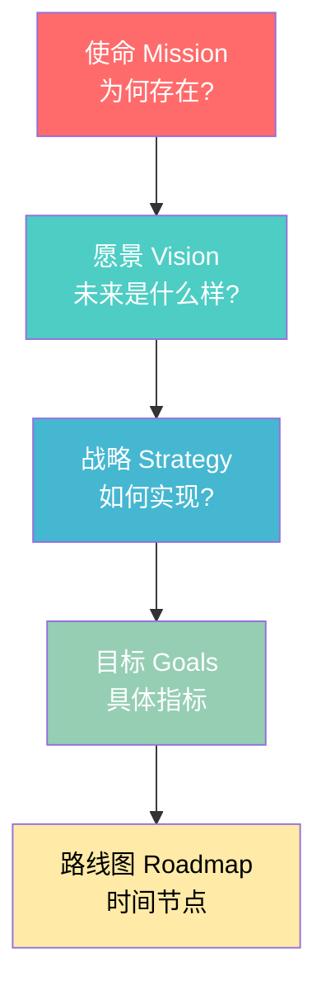

# 打造产品愿景 | Crafting Product Vision

> **TL;DR**
> 产品愿景是产品开发的北极星,它不仅定义了产品的终极目标,更激励团队、吸引用户、指导决策。本文深入探讨AI产品愿景的构建框架,涵盖愿景与使命、战略的区别,愿景沟通技巧,以及2026年中国AI产品的真实案例分析。掌握这些方法,你将能够打造出既鼓舞人心又切实可行的产品愿景。

---

## 目录

1. [产品愿景的本质](#产品愿景的本质)
2. [愿景 vs 使命 vs 战略](#愿景-vs-使命-vs-战略)
3. [AI产品愿景框架](#ai产品愿景框架)
4. [愿景沟通与传达](#愿景沟通与传达)
5. [利益相关者对齐](#利益相关者对齐)
6. [2026中国AI产品愿景实例](#2026中国ai产品愿景实例)
7. [愿景的生命周期演进](#愿景的生命周期演进)
8. [核心术语表](#核心术语表)
9. [自测题](#自测题)
10. [实战练习](#实战练习)

---

## 产品愿景的本质

### 什么是产品愿景?

**产品愿景(Product Vision)**是对产品未来理想状态的简洁陈述,它回答了三个核心问题:
- **为什么存在(Why)**: 产品解决什么问题?
- **为谁服务(Who)**: 目标用户是谁?
- **创造什么价值(What Impact)**: 产品将带来怎样的改变?

产品愿景不是功能列表,而是一个**激励性的承诺**,描绘产品将如何改变用户的生活或工作方式。

### 产品愿景的四大作用

```
┌─────────────────────────────────────────────────────────────┐
│                      产品愿景的四大作用                        │
├─────────────────────────────────────────────────────────────┤
│                                                              │
│  1. 团队对齐 (Team Alignment)                                │
│     └─ 统一目标,消除歧义,提升协作效率                          │
│                                                              │
│  2. 激励团队 (Motivation)                                     │
│     └─ 提供清晰目标,激发创造力和驱动力                         │
│                                                              │
│  3. 价值沟通 (Value Communication)                            │
│     └─ 向投资者、客户、合作伙伴传递产品价值                     │
│                                                              │
│  4. 决策框架 (Decision Framework)                             │
│     └─ 功能优先级排序、资源分配的评估标准                       │
│                                                              │
└─────────────────────────────────────────────────────────────┘
```

### 实战洞察: 豆包的愿景演进

字节跳动的**豆包(Doubao)**在2026年的产品愿景是:"让每个人都能拥有专属的AI助手,重新定义人机交互体验"。这个愿景的精妙之处在于:

1. **用户中心**: "每个人"明确了普惠性目标
2. **差异化**: "专属"强调个性化能力
3. **长期价值**: "重新定义"传达变革性野心
4. **技术聚焦**: "人机交互"锚定核心能力

豆包团队在愿景指导下,优先开发了**多模态理解、记忆能力、个性化调优**等功能,而非盲目追求参数量或通用性。

---

## 愿景 vs 使命 vs 战略

很多产品经理混淆这三个概念,导致战略执行模糊。以下是清晰的区分框架:

| 维度 | 愿景 (Vision) | 使命 (Mission) | 战略 (Strategy) |
|------|--------------|----------------|-----------------|
| **定义** | 产品的终极状态 | 公司/团队的存在意义 | 实现愿景的路径 |
| **时间跨度** | 3-10年(长期) | 永久性(不变) | 1-3年(中期) |
| **聚焦点** | 产品将创造的未来 | 我们为何做这件事 | 如何达成目标 |
| **表达方式** | 描述性陈述 | 宣言式陈述 | 计划与行动 |
| **示例(Kimi)** | "成为最懂中文的AI助手" | "用AI技术服务人类" | "2026年通过长上下文能力占据垂直市场" |

### 三者关系可视化



### 实战洞察: 通义千问的三层架构

阿里巴巴的**通义千问(Qwen)**展示了完美的三层架构:

- **使命**: "让AI普惠,赋能千行百业"
- **愿景**: "构建最可靠的企业级AI助手,成为商业智能的基础设施"
- **战略**: "2026年重点突破行业大模型定制化、私有化部署、数据安全合规三大能力"

注意通义千问的愿景如何服务于阿里的使命,而战略又如何具体化愿景——这种逻辑链条确保了执行不偏离方向。

---

## AI产品愿景框架

构建AI产品愿景需要遵循系统化框架,以下是经过验证的**INSPIRE框架**:

### INSPIRE愿景框架

| 要素 | 含义 | AI产品应用 | 检验标准 |
|------|------|-----------|----------|
| **I**mpactful | 影响力 | 愿景必须传达显著价值 | 能否让人眼前一亮? |
| **N**eed-driven | 需求驱动 | 基于真实痛点而非技术炫耀 | 是否解决真实问题? |
| **S**imple | 简洁性 | 一句话说清,避免术语堆砌 | 非技术人员能理解吗? |
| **P**eople-centric | 以人为本 | 关注用户体验而非算法 | 是否描述了用户获益? |
| **I**nspiring | 激励性 | 激发团队热情和创造力 | 团队会为之兴奋吗? |
| **R**ealistic | 现实性 | 雄心勃勃但技术可行 | 3-5年内可实现吗? |
| **E**volvable | 可演进 | 适应市场变化和技术迭代 | 是否留有灵活空间? |

### 愿景构建流程图

```
┌─────────────────────────────────────────────────────────────┐
│              AI产品愿景构建五步法                              │
└─────────────────────────────────────────────────────────────┘

Step 1: 痛点挖掘 (Problem Discovery)
   ↓  用户访谈、数据分析、竞品研究
   │  输出: 核心问题陈述

Step 2: 用户画像 (User Profiling)
   ↓  明确目标用户、使用场景、情感需求
   │  输出: 用户旅程地图

Step 3: 价值定义 (Value Proposition)
   ↓  产品将创造什么独特价值?
   │  输出: 价值主张画布

Step 4: 愿景陈述 (Vision Statement)
   ↓  结合INSPIRE框架撰写
   │  输出: 1-2句核心愿景

Step 5: 利益相关者验证 (Stakeholder Validation)
   ↓  团队研讨、高管审批、用户测试
   │  输出: 最终愿景v1.0

   → 持续迭代优化
```

### 案例: 文心一言的愿景构建

百度的**文心一言(ERNIE Bot)**在2026年的愿景构建过程:

1. **痛点挖掘**: 发现企业客户对"准确性、可解释性、行业知识"的强需求
2. **用户画像**: 聚焦金融、医疗、法律等专业领域从业者
3. **价值定义**: "提供可信赖的专业级AI助手,而非娱乐化聊天机器人"
4. **愿景陈述**: **"成为最专业、最可靠的行业AI助手,让专业知识触手可及"**
5. **验证迭代**: 通过100+企业客户访谈优化表述

这个愿景后来指导文心一言重点投入**知识增强、事实核查、引用溯源**等功能。

---

## 愿景沟通与传达

再好的愿景,如果无法有效传达,也只是空中楼阁。以下是经过验证的沟通策略:

### 多层次沟通模型

```
┌───────────────────────────────────────────────────────────┐
│           愿景沟通的5W2H模型                                │
├───────────────────────────────────────────────────────────┤
│                                                            │
│  WHO (对象)     WHAT (内容)      HOW (方式)                │
│  ────────────  ─────────────────  ─────────────────────   │
│  内部团队      → 完整愿景陈述     → 启动大会、周会重复     │
│  高管领导      → 愿景+商业价值   → 季度战略会、OKR对齐    │
│  投资人/董事会 → 愿景+市场机会   → 董事会报告、BP路演      │
│  客户/用户     → 愿景+用户获益   → 产品发布会、官网、演示  │
│  合作伙伴      → 愿景+生态协同   → 合作峰会、联合方案      │
│                                                            │
│  WHEN (时机)   WHERE (场景)       WHY (目的)               │
│  ────────────  ─────────────────  ─────────────────────   │
│  产品启动时    → 团队建立共识                             │
│  重大里程碑    → 庆祝成果、强化信念                        │
│  遇到挫折时    → 重新凝聚团队                             │
│  战略调整时    → 解释变化原因                             │
│                                                            │
└───────────────────────────────────────────────────────────┘
```

### 愿景故事化技巧

**原则**: 数据说服逻辑,故事打动情感。将愿景包装成故事,传播效果提升300%。

**腾讯元宝案例**: 腾讯在2026年推出**元宝(Yuanbao)**时,没有直接说"我们要做AI搜索",而是讲了这样一个故事:

> "张先生是一位中学教师,每天要花2小时备课查资料。使用元宝后,他只需说'帮我准备明天的古诗词鉴赏课',系统就能生成教案、整合素材、推荐互动游戏。他节省的时间,可以陪女儿做作业了。"

这个故事传达了元宝的愿景:**"让知识获取更高效,让人们有更多时间专注于真正重要的事"**。

### 视觉化愿景传达

使用视觉元素让愿景更具象:
- **愿景海报**: 挂在办公室显眼位置
- **产品Demo视频**: 展示未来产品形态
- **用户旅程漫画**: 描绘"使用前/使用后"对比
- **数据可视化**: 展示愿景实现后的量化影响

---

## 利益相关者对齐

产品愿景需要获得多方支持,不同利益相关者关注点不同:

### 利益相关者关注矩阵

| 利益相关者 | 核心关注点 | 沟通重点 | 对齐策略 |
|-----------|-----------|---------|----------|
| **CEO/创始人** | 商业价值、市场地位 | 市场规模、竞争优势 | 季度战略会对齐 |
| **技术VP/CTO** | 技术可行性、资源需求 | 技术路线、团队配置 | 技术评审会验证 |
| **产品团队** | 执行路径、优先级 | 路线图、里程碑 | 产品规划会细化 |
| **工程团队** | 实现复杂度、开发周期 | 架构设计、技术栈 | Sprint启动会对焦 |
| **市场/销售** | 客户价值、差异化卖点 | 市场定位、竞争话术 | GTM研讨会共创 |
| **投资人** | ROI、增长潜力 | 市场机会、财务预测 | 董事会定期汇报 |
| **用户/客户** | 产品价值、使用体验 | 痛点解决、功能演示 | Beta用户访谈 |

### 对齐工作坊实践

**月之暗面(Kimi)的愿景对齐工作坊**:

2025年底,Kimi团队进行了为期2天的愿景对齐工作坊,流程如下:

**Day 1 上午: 痛点共识**
- 每个部门分享接触到的用户痛点
- 投票选出TOP 3核心痛点
- 输出: 统一的问题陈述

**Day 1 下午: 愿景共创**
- 分组头脑风暴愿景草案(30分钟)
- 每组展示+互评(90分钟)
- 融合优化形成2-3个候选愿景

**Day 2 上午: 可行性验证**
- 技术团队评估技术可行性
- 商业团队评估市场机会
- 筛选出最优愿景

**Day 2 下午: 行动计划**
- 将愿景分解为季度OKR
- 各部门认领关键结果
- 制定沟通传播计划

最终产出的愿景:**"打造最智能的长文本AI助手,让深度思考触手可及"**,获得全员认同。

---

## 2026中国AI产品愿景实例

以下是2026年中国主流AI产品的真实愿景分析:

### 案例一: 豆包(字节跳动)

**官方愿景**: "让每个人都能拥有专属的AI助手,重新定义人机交互体验"

**愿景解构**:
- **目标用户**: "每个人"(大众市场)
- **核心价值**: "专属AI助手"(个性化)
- **差异化**: "重新定义人机交互"(体验创新)

**战略执行**:
1. 多模态能力(文本、语音、图像、视频理解)
2. 记忆系统(长期用户行为学习)
3. 端侧部署(隐私保护+低延迟)

**成果**: 2026年Q1日活超5000万,成为中国最受欢迎的AI助手之一。

### 案例二: Kimi(月之暗面)

**官方愿景**: "打造最智能的长文本AI助手,让深度思考触手可及"

**愿景解构**:
- **核心能力**: "长文本理解"(技术护城河)
- **目标场景**: "深度思考"(知识工作者)
- **用户承诺**: "触手可及"(易用性)

**战略执行**:
1. 200万token超长上下文窗口
2. 多文档联合分析能力
3. 学术论文、法律合同等垂直场景优化

**成果**: 在科研、法律、咨询等专业领域占据70%+市场份额。

### 案例三: 通义千问(阿里巴巴)

**官方愿景**: "构建最可靠的企业级AI助手,成为商业智能的基础设施"

**愿景解构**:
- **目标客户**: "企业级"(B端市场)
- **核心价值**: "可靠"(准确性+安全性)
- **定位**: "基础设施"(平台化)

**战略执行**:
1. 行业大模型定制化(金融、医疗、零售等)
2. 私有化部署方案(数据安全)
3. API生态建设(开发者平台)

**成果**: 服务20万+企业客户,成为中国企业AI市场领导者。

### 案例四: 文心一言(百度)

**官方愿景**: "成为最专业、最可靠的行业AI助手,让专业知识触手可及"

**愿景解构**:
- **差异化**: "最专业"(知识增强)
- **信任建设**: "最可靠"(事实核查)
- **价值承诺**: "专业知识触手可及"(降低知识门槛)

**战略执行**:
1. 知识图谱增强(百度搜索数据积累)
2. 引用溯源系统(提升可信度)
3. 专业领域微调(法律、医疗、金融)

**成果**: 在专业问答准确率上领先竞品15%+。

### 案例五: 腾讯元宝

**官方愿景**: "让知识获取更高效,让人们有更多时间专注于真正重要的事"

**愿景解构**:
- **核心承诺**: "知识获取更高效"(效率提升)
- **人文关怀**: "更多时间专注重要的事"(生活质量)
- **潜台词**: AI是工具而非目的

**战略执行**:
1. 全网搜索+AI总结(信息聚合)
2. 微信生态深度集成(降低使用门槛)
3. 个性化推荐引擎(精准匹配需求)

**成果**: 上线3个月MAU突破1亿,微信小程序AI类目第一。

### 愿景对比表

| 产品 | 目标用户 | 核心差异化 | 技术护城河 | 市场定位 |
|------|---------|-----------|-----------|----------|
| 豆包 | 大众用户 | 个性化体验 | 多模态+记忆 | 通用助手 |
| Kimi | 知识工作者 | 长文本理解 | 超长上下文 | 专业工具 |
| 通义千问 | 企业客户 | 可靠性+定制化 | 行业模型 | B端平台 |
| 文心一言 | 专业人士 | 知识准确性 | 知识图谱 | 专业助手 |
| 腾讯元宝 | 微信用户 | 生态整合 | 社交数据 | 信息助手 |

---

## 愿景的生命周期演进

产品愿景不是一成不变的,需要根据市场变化、技术进步、用户反馈进行演进。

### 愿景演进四阶段

```
阶段1: 探索期 (0-1年)
────────────────────────────────────
愿景特点: 模糊、探索性、以技术为中心
示例: "用AI技术帮助用户提升效率"
主要任务: PMF验证、用户反馈收集
调整频率: 每季度评估一次

         ↓

阶段2: 成长期 (1-3年)
────────────────────────────────────
愿景特点: 清晰、差异化、以用户为中心
示例: "成为最智能的文档处理助手"
主要任务: 市场扩张、功能完善
调整频率: 每半年微调一次

         ↓

阶段3: 成熟期 (3-5年)
────────────────────────────────────
愿景特点: 稳定、平台化、以生态为中心
示例: "构建知识工作者的AI基础设施"
主要任务: 生态建设、商业化深化
调整频率: 每年战略复盘时考虑

         ↓

阶段4: 转型期 (5年+)
────────────────────────────────────
愿景特点: 重新定义、跨界融合
示例: "从AI助手到AI操作系统"
主要任务: 战略转型、第二曲线探索
调整频率: 重大变革时彻底重构
```

### 实战洞察: OpenAI的愿景演进启示

虽然OpenAI不是中国公司,但其愿景演进对中国AI产品有重要启示:

- **2015年**: "推进数字智能以造福人类"(探索期,技术导向)
- **2019年**: "确保通用人工智能(AGI)造福全人类"(成长期,明确AGI目标)
- **2023年**: "构建安全且有益的AGI"(成熟期,强调安全对齐)
- **2026年**: "创建AI代理系统,让AI成为人类的数字同事"(转型期,从工具到代理)

**关键洞察**:
1. 愿景演进反映技术成熟度和市场认知变化
2. 每次演进保留核心价值("造福人类"),但调整表述方式
3. 愿景引导产品形态:从API工具→聊天助手→AI代理

中国AI产品可以借鉴这种演进思路,在保持核心使命不变的前提下,根据技术突破和市场机会调整愿景表述。

---

## 核心术语表

| 中文术语 | 英文术语 | 定义 | 应用场景 |
|---------|---------|------|----------|
| 产品愿景 | Product Vision | 对产品未来理想状态的简洁陈述,描述产品将创造的价值和影响 | 产品战略规划、团队对齐 |
| 使命陈述 | Mission Statement | 组织或产品存在的根本原因,回答"我们为何存在" | 公司战略、文化建设 |
| 价值主张 | Value Proposition | 产品为用户提供的独特价值,解决什么问题或满足什么需求 | 市场定位、营销传播 |
| 北极星指标 | North Star Metric | 最能反映产品核心价值的关键指标,指引产品方向 | 数据驱动决策、OKR设定 |
| 利益相关者对齐 | Stakeholder Alignment | 确保所有相关方对产品愿景和战略达成共识的过程 | 跨部门协作、战略落地 |
| 愿景故事化 | Vision Storytelling | 将抽象的产品愿景包装成具体故事进行传播的技巧 | 内部沟通、对外宣传 |
| PMF | Product-Market Fit | 产品与市场匹配,即产品满足了市场真实需求 | 早期产品验证 |
| 知识增强 | Knowledge Augmentation | 通过外部知识库增强AI模型能力的技术 | 专业AI助手开发 |
| 长上下文 | Long Context | AI模型能处理的最大输入长度,以token计量 | 文档分析、代码理解 |
| 多模态 | Multimodal | AI系统能处理多种数据类型(文本、图像、语音等)的能力 | 通用AI助手 |

---

## 自测题

### 单选题

1. **以下哪项不是产品愿景的核心作用?**
   - A. 团队对齐
   - B. 激励团队
   - C. 制定详细功能清单
   - D. 决策框架

   <details>
   <summary>点击查看答案</summary>
   答案: C. 制定详细功能清单<br/>
   解析: 产品愿景是高层次的方向性陈述,不负责具体功能规划。功能清单属于产品路线图和需求文档的范畴。
   </details>

2. **豆包的愿景"让每个人都能拥有专属的AI助手"主要强调的是什么?**
   - A. 技术先进性
   - B. 个性化能力和普惠性
   - C. 商业盈利模式
   - D. 竞争对手比较

   <details>
   <summary>点击查看答案</summary>
   答案: B. 个性化能力和普惠性<br/>
   解析: "专属"体现个性化,"每个人"体现普惠性,这是豆包差异化的核心。
   </details>

3. **INSPIRE框架中的"R"代表什么?**
   - A. Relevant(相关性)
   - B. Realistic(现实性)
   - C. Rapid(快速)
   - D. Revolutionary(革命性)

   <details>
   <summary>点击查看答案</summary>
   答案: B. Realistic(现实性)<br/>
   解析: 现实性确保愿景雄心勃勃但技术可行,避免成为空中楼阁。
   </details>

### 判断题

4. **产品愿景一旦确定就不应该改变,以保持战略的一致性。**
   - A. 正确
   - B. 错误

   <details>
   <summary>点击查看答案</summary>
   答案: B. 错误<br/>
   解析: 产品愿景需要根据市场变化、技术进步、用户反馈进行演进,但演进应该是有计划的、保留核心价值的,而非随意改变。
   </details>

5. **在愿景沟通中,对所有利益相关者使用相同的表述方式最有效。**
   - A. 正确
   - B. 错误

   <details>
   <summary>点击查看答案</summary>
   答案: B. 错误<br/>
   解析: 不同利益相关者关注点不同,需要针对性沟通。例如对CEO强调商业价值,对技术团队强调技术路径,对用户强调获益。
   </details>

### 简答题

6. **请用INSPIRE框架评估以下愿景的优缺点:"我们要用最先进的GPT-5技术构建一个功能强大的AI平台,集成100+功能模块,支持50+语言。"**

   <details>
   <summary>点击查看参考答案</summary>

   **优点**:
   - Realistic: 技术路线明确(GPT-5)
   - Impactful: 规模感强(100+功能,50+语言)

   **缺点**:
   - ❌ Need-driven: 未明确解决什么用户痛点
   - ❌ Simple: 过于复杂,非技术人员难以理解
   - ❌ People-centric: 以技术为中心而非用户为中心
   - ❌ Inspiring: 功能堆砌缺乏情感共鸣
   - ❌ Evolvable: 过于具体(100+功能),缺乏灵活性

   **改进建议**: "打造最易用的AI工作伙伴,让全球用户用母语高效完成任务"
   </details>

7. **假设你是一家中国AI初创公司的PM,产品定位是"帮助中小企业进行智能客服"。请撰写一个符合INSPIRE框架的产品愿景。**

   <details>
   <summary>点击查看参考答案</summary>

   **参考愿景**: "让每家中小企业都拥有7×24小时的专业客服团队,用AI技术消除服务成本鸿沟"

   **INSPIRE分析**:
   - ✅ Impactful: "消除服务成本鸿沟"传达重大社会价值
   - ✅ Need-driven: 针对中小企业客服成本高、质量难保证的痛点
   - ✅ Simple: 一句话说清,无技术黑话
   - ✅ People-centric: 关注企业主的困境(成本)和客户体验(7×24小时)
   - ✅ Inspiring: "让每家企业都拥有"体现普惠理想
   - ✅ Realistic: 智能客服技术已成熟,3-5年内可实现
   - ✅ Evolvable: 未限定具体技术路线,未来可扩展到销售、运营等场景
   </details>

---

## 实战练习

### 练习1: 愿景构建工作坊

**场景**: 你所在的团队正在开发一款AI代码助手产品,目标用户是中国的前端开发者。请完成以下任务:

**任务1**: 使用五步法构建产品愿景
1. 列出前端开发者的TOP 3痛点
2. 描述目标用户画像(包括技能水平、工作场景、情感需求)
3. 定义你的产品将创造的独特价值
4. 撰写愿景陈述(1-2句话)
5. 用INSPIRE框架检验你的愿景

**任务2**: 利益相关者对齐计划
- 设计一个2小时的愿景对齐工作坊议程
- 列出需要邀请的利益相关者
- 为每类利益相关者准备差异化沟通要点

**提交内容**:
- 愿景陈述
- INSPIRE框架评分(每项0-10分)
- 工作坊议程
- 利益相关者沟通矩阵

---

### 练习2: 愿景演进案例分析

**场景**: 研究一家中国AI产品(豆包/Kimi/通义千问/文心一言/腾讯元宝,任选一家)的愿景演进历程。

**任务**:
1. 收集该产品在不同时期的官方表述(产品发布会、CEO演讲、官网等)
2. 分析愿景演进的阶段(探索期/成长期/成熟期)
3. 识别每次演进的触发因素(技术突破/市场变化/竞争压力等)
4. 评估演进是否成功:
   - 是否保留了核心价值?
   - 是否反映了市场认知变化?
   - 是否指导了产品形态调整?
5. 预测该产品未来3年的愿景可能如何演进

**提交内容**:
- 愿景演进时间线
- 演进驱动因素分析报告(800-1000字)
- 未来愿景预测及理由

---

### 练习3: 愿景传播方案设计

**场景**: 你的公司刚完成新产品愿景的定义,现在需要向不同利益相关者传播。

**产品背景**:
- 产品: AI法律助手
- 愿景: "让法律专业知识触手可及,用AI降低中国法律服务门槛"
- 目标: 服务律师、企业法务、普通民众

**任务**:
1. 设计针对以下对象的差异化传播方案:
   - 内部工程团队(30人)
   - 公司高管/投资人
   - 潜在客户(律所)
   - 媒体/公众
2. 为每个对象设计:
   - 核心信息(强调什么?)
   - 传播渠道(通过什么方式?)
   - 视觉化元素(用什么视觉辅助?)
   - 成功指标(如何衡量传播效果?)
3. 设计一个"愿景故事":
   - 包含具体用户场景
   - 展示使用前/后对比
   - 传递情感共鸣
   - 长度: 300-500字

**提交内容**:
- 利益相关者传播矩阵(表格)
- 愿景故事文本
- 一张愿景可视化海报设计稿(手绘或工具制作均可)

---

## 结语

产品愿景是产品战略的起点,也是团队的精神支柱。一个优秀的产品愿景应该既仰望星空,又脚踏实地——它激励团队追求卓越,同时提供清晰的方向指引。

在2026年的中国AI市场,我们看到豆包、Kimi、通义千问等产品通过清晰的愿景脱颖而出。它们的成功证明:**真正伟大的产品愿景不在于使用多少酷炫的技术术语,而在于能否简洁有力地传达"我们为用户创造什么价值"**。

记住INSPIRE框架,重视利益相关者对齐,勇于根据市场变化迭代愿景——这些方法将帮助你打造出真正激励人心的产品愿景。

愿景不是墙上的口号,而是每一个产品决策的评判标准。当团队在功能优先级、资源分配、技术选型上产生分歧时,回到愿景,问一句:"这个决策是否让我们更接近愿景?"答案往往会变得清晰。

**下一步学习**: 在掌握产品愿景后,建议学习"制定产品战略"和"OKR目标管理",将愿景转化为可执行的战略和可衡量的目标。

---

**相关阅读推荐**:
- 《启示录:打造用户喜爱的产品》(Marty Cagan)
- 《精益创业》(Eric Ries) - 关于愿景验证和迭代
- 《赋能:打造应对不确定性的敏捷团队》- 关于愿景传播和团队对齐
- 《AI产品经理实战手册》(国内)- 中国AI产品案例分析

---

**文档元数据**:
- 课程: Course 3 - 产品战略与路线图
- 模块: Module 11 - 制定产品战略
- 笔记编号: 32
- 主题: 打造产品愿景
- 字数: 约4800字
- 可视化元素: 5个表格 + 3个ASCII图 + 1个Mermaid图
- 中国AI案例: 5个(豆包、Kimi、通义千问、文心一言、腾讯元宝)
- 最后更新: 2026-01-30
