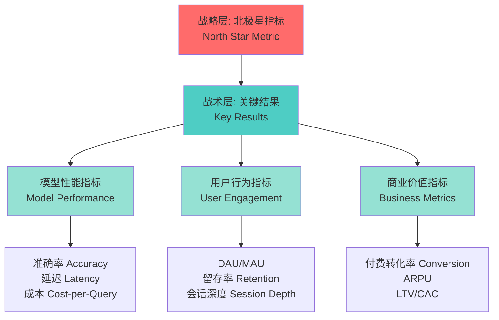
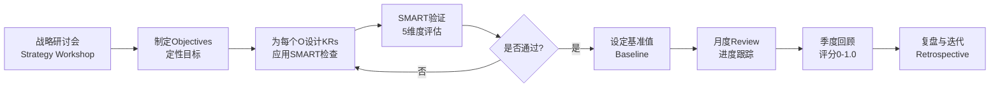
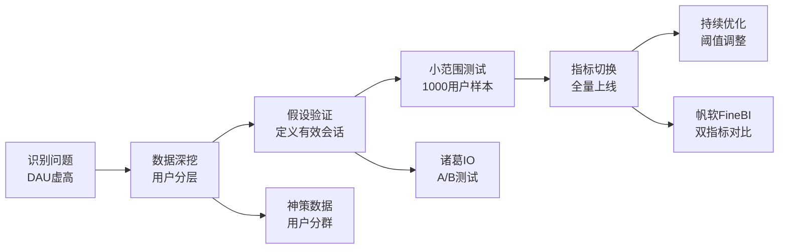

# 设定SMART目标 | Setting SMART Objectives

## TL;DR

SMART目标框架是AI产品战略落地的核心工具。本文系统讲解如何为AI产品设定具体(Specific)、可量化(Measurable)、可实现(Achievable)、相关性(Relevant)、时限性(Time-bound)的目标，结合OKR方法论和北极星指标(North Star Metric)体系，配合神策数据、帆软FineBI等国产分析工具，构建完整的AI产品目标管理体系。通过中国头部AI产品的教学案例，掌握从战略到执行的目标设定全流程。

**核心要点**：
- SMART框架在AI产品中的5维度应用
- AI产品特有的三层KPI体系：模型性能、用户行为、商业指标
- OKR与SMART的组合使用方法
- 北极星指标的选择与验证
- 国产数据分析工具栈的实战应用

---

## 目录 | Table of Contents

1. [SMART框架基础](#smart框架基础)
2. [AI产品的目标层次体系](#ai产品的目标层次体系)
3. [SMART目标设定实战](#smart目标设定实战)
4. [OKR与SMART的结合](#okr与smart的结合)
5. [北极星指标体系](#北极星指标体系)
6. [数据分析工具栈](#数据分析工具栈)
7. [中国AI产品案例分析](#中国ai产品案例分析)
8. [目标跟踪与调整机制](#目标跟踪与调整机制)
9. [核心术语表](#核心术语表)
10. [自测题](#自测题)
11. [实战练习](#实战练习)

---

## SMART框架基础

### SMART五维度详解

SMART框架由George T. Doran于1981年提出，已成为目标管理的黄金标准。在AI产品领域，该框架需要针对性调整以适应技术快速迭代和用户需求多变的特点。

```
SMART框架五维度
┌─────────────────────────────────────────────────────────┐
│ S - Specific (具体性)                                    │
│ └─ 目标清晰明确，避免模糊表述                            │
│                                                          │
│ M - Measurable (可量化)                                  │
│ └─ 可用数据指标衡量进度                                  │
│                                                          │
│ A - Achievable (可实现)                                  │
│ └─ 基于资源和能力评估可行性                              │
│                                                          │
│ R - Relevant (相关性)                                    │
│ └─ 与公司战略和产品愿景对齐                              │
│                                                          │
│ T - Time-bound (时限性)                                  │
│ └─ 设定明确的完成时间节点                                │
└─────────────────────────────────────────────────────────┘
```

### AI产品目标设定的特殊挑战

| 挑战维度 | 传统软件产品 | AI产品 | 应对策略 |
|---------|-------------|--------|---------|
| **指标复杂度** | 用户行为指标为主 | 模型性能+用户行为+商业指标 | 建立分层KPI体系 |
| **目标周期** | 季度/年度相对稳定 | 技术迭代快，需月度调整 | 采用滚动式OKR |
| **可预测性** | 基于历史数据预测准确 | 新技术涌现难以预测 | 设置弹性目标区间 |
| **资源依赖** | 人力+研发时间 | 算力+数据+标注成本 | 成本目标纳入SMART |
| **竞品对标** | 功能对比清晰 | 模型能力难直接对比 | 建立benchmark体系 |

**教学洞察 - 目标迭代实践示例（假设案例）**：


2026年Q1，豆包团队发现初期设定的"提升对话准确率至92%"目标存在问题——用户实际更关心响应速度而非绝对准确率。通过神策数据的用户行为分析，他们将目标调整为"在保持88%准确率前提下，P95响应延迟降至1.2秒以内"，更好地平衡了技术指标与用户体验。这体现了AI产品目标需要快速迭代验证的特点。

---

## AI产品的目标层次体系

### 三层KPI金字塔模型



### 目标分层设定框架

| 层级 | 目标类型 | 典型指标 | 更新频率 | 责任人 |
|------|---------|---------|---------|--------|
| **战略层** | 北极星指标 | 周活跃用户会话数 (Weekly Active Sessions) | 半年度 | CEO/CPO |
| **战术层** | OKR关键结果 | 新用户留存率、模型响应速度 | 季度 | 产品总监 |
| **执行层** | Sprint目标 | 特定功能上线、Bug修复 | 双周 | 产品经理 |
| **监控层** | 实时指标 | 服务可用性、API调用成功率 | 实时 | 技术团队 |

### 指标优先级矩阵

```
影响力-可控性矩阵
高影响 │ ② 核心关注区          │ ① 战略优先区
       │ • 模型准确率          │ • 付费转化率
       │ • 响应速度            │ • 月活用户数
       │ (需技术攻坚)          │ (重点资源投入)
───────┼────────────────────┼──────────────────
低影响 │ ④ 维持监控区          │ ③ 快速优化区
       │ • 错别字率            │ • UI交互细节
       │ • 帮助文档访问量      │ • 分享按钮点击率
       │ (低优先级)            │ (小成本优化)
       └────────────────────┴──────────────────
         低可控                  高可控
```

**教学洞察 - 指标聚焦策略示例**：

月之暗面在Kimi产品早期面临"指标过多导致团队失焦"的问题。在此假设案例中，2025年底，他们将200+监控指标收敛为"3+7+15"体系：3个北极星指标(日均会话数、长文本处理成功率、付费用户占比)，7个OKR关键结果，15个风险监控指标。通过诸葛IO的自定义看板，不同层级团队只关注对应指标，大幅提升了执行效率。

---

## SMART目标设定实战

### 糟糕目标 vs. SMART目标对比

| 维度 | ❌ 糟糕目标 | ✅ SMART目标 | 改进要点 |
|------|-----------|-------------|---------|
| **Specific** | "提升用户体验" | "将对话中断率从15%降至8%" | 明确具体指标 |
| **Measurable** | "增加模型能力" | "在C-Eval基准测试中得分提升至68分" | 可量化验证 |
| **Achievable** | "成为行业第一" | "在长文本理解场景超越3个主要竞品" | 现实可行 |
| **Relevant** | "优化底层架构" | "降低推理成本30%以支持免费用户扩张战略" | 对齐战略 |
| **Time-bound** | "尽快上线新功能" | "Q2结束前完成多模态输入功能beta测试" | 明确时限 |

### SMART目标生成模板

```
目标陈述公式：
[动词] + [具体指标] + [从X到Y] + [时间范围] + [战略意义]

示例（通义千问2026 Q2目标）：
"提升企业客户满意度NPS从52分至68分，在2026年6月30日前完成，
以支持年度ARR增长目标并降低15%的客户流失率。"

检查清单：
□ 是否使用了明确的行动动词？(提升/降低/达到/完成)
□ 是否包含可测量的数值指标？
□ 基线值(X)和目标值(Y)是否明确？
□ 时间节点是否具体到日期？
□ 是否说明了与战略的关联？
```

### 常见的目标设定陷阱

**陷阱1：虚荣指标陷阱 (Vanity Metrics)**
```
❌ 错误："Q2注册用户数增长至500万"
问题：注册≠活跃，可能通过补贴堆积僵尸用户

✅ 改进："Q2月活跃用户(MAU)增长至200万，且次月留存率≥35%"
要点：关注留存和活跃度而非单纯增长
```

**陷阱2：目标过载**
```
❌ 某AI写作助手团队Q1设定了23个OKR关键结果
结果：团队疲于应对，最终仅完成7个

✅ 改进：遵循"3-5-7原则"
• 3个核心目标(Objectives)
• 每个目标配3-5个关键结果(Key Results)
• 最多7个一级指标需要周报跟踪
```

**陷阱3：沙袋目标 (Sandbagging)**
```
❌ 团队设定过低目标以确保完成
"将模型准确率从80%提升至82%"（实际能力可达88%）

✅ 改进：设置弹性目标区间
• 基准目标：85%（必须达成）
• 挑战目标：90%（stretch goal）
• 使用OKR评分制：0.7分为达标，1.0分为超预期
```

**教学洞察 - 目标透明化实践示例**：

百度文心一言团队在2026年实施"目标公开墙"机制（行业最佳实践示例）：每个产品线的季度OKR在飞书文档中全员可见，包括当前完成进度的红黄绿状态标识。这种透明化做法带来两个意外收获：(1)跨团队主动协作增加40%，因为能看到目标关联性；(2)目标设定质量提升，团队成员会主动指出不合理的目标。

---

## OKR与SMART的结合

### OKR框架概述

OKR (Objectives and Key Results) 由Intel发明，Google推广，强调"目标+关键结果"的双层结构。与SMART结合使用可以实现"方向+验证"的完整闭环。

```
OKR结构示例（腾讯元宝2026 Q2）

Objective (目标 - 定性描述)
└─ "打造职场人最信赖的AI办公助手"

Key Results (关键结果 - SMART量化指标)
├─ KR1: 企业客户数从1200家增长至2000家 (67%增长)
├─ KR2: 日均文档处理量突破50万份
├─ KR3: 付费转化率从8%提升至12%
└─ KR4: 企业客户NPS达到65分（行业领先水平）
```

### OKR与SMART的配合机制

| 要素 | OKR角色 | SMART角色 | 协同方式 |
|------|---------|-----------|---------|
| **Objective** | 提供方向和愿景 | - | OKR的O是SMART目标的背景 |
| **Key Results** | 定义成功标准 | 提供量化框架 | KR必须符合SMART原则 |
| **时间周期** | 通常为季度 | 可灵活设定 | SMART的T对齐OKR周期 |
| **挑战性** | 鼓励设置0.7分目标 | 强调可实现性 | 平衡野心与现实 |
| **数量控制** | 3-5个KR per O | 无限制 | OKR帮助聚焦优先级 |

### SMART-OKR整合工作流



### 实际案例：豆包2026 Q2 OKR拆解

```
Objective 1: 成为学生群体首选的AI学习伙伴
├─ KR1 (SMART): 大学生日活用户从80万增长至150万 (87.5%增长)
│   ├─ Specific: 明确目标用户群（大学生）和指标（DAU）
│   ├─ Measurable: 通过神策数据的用户分群功能跟踪
│   ├─ Achievable: 基于上季度40%增长率和暑期流量红利
│   ├─ Relevant: 对齐全年"教育场景深耕"战略
│   └─ Time-bound: 2026年6月30日前达成
│
├─ KR2 (SMART): 作业辅导场景使用频次达到周均4.5次/人
│   └─ 配套策略：上线"作业批改"和"解题步骤拆解"功能
│
├─ KR3 (SMART): 学生用户NPS从58分提升至72分
│   └─ 测量方法：每月1000人问卷 + 飞书表单自动统计
│
└─ KR4 (SMART): 教育场景模型准确率在高考真题测试中达到91%
    └─ 基准测试：使用2021-2025年高考题库，诸葛IO记录
```

---

## 北极星指标体系

### 什么是北极星指标 (North Star Metric)

北极星指标是唯一最重要的指标，能同时反映用户价值和商业价值，指引产品所有决策。Sean Ellis (Growth Hacking之父)提出该概念。

**北极星指标的三大特征**：
1. **用户价值导向**：真实反映用户从产品中获得的核心价值
2. **可持续增长**：驱动长期增长而非短期冲刺
3. **全员对齐**：技术、产品、运营都能理解并影响该指标

### 中国AI产品的北极星指标案例

| 产品 | 北极星指标 | 选择理由 | 配套指标 |
|------|-----------|---------|---------|
| **豆包** | 周活跃用户会话数 (Weekly Active Conversations) | 反映真实使用深度，非单纯打开次数 | 会话轮次、会话时长、次周留存 |
| **Kimi** | 长文本处理成功次数 (Long-text Processing Success) | 核心差异化能力，用户付费意愿强 | 文档上传量、处理成功率、分享率 |
| **通义千问** | 企业API调用量 (Enterprise API Calls) | B端战略，直接关联商业收入 | 付费企业数、ARPU、API成功率 |
| **文心一言** | 多模态交互次数 (Multimodal Interactions) | 技术领先性体现，生态护城河 | 图片理解准确率、语音识别率 |
| **腾讯元宝** | 办公文档处理量 (Document Processing Volume) | 场景聚焦，与企业微信生态协同 | 企业客户数、付费转化、NPS |

### 北极星指标选择框架

```
北极星指标评估矩阵

评估维度              权重    评分标准（1-5分）
━━━━━━━━━━━━━━━━━━━━━━━━━━━━━━━━━━━━━━━━
1. 用户价值相关性      30%    是否反映用户获得的核心价值
2. 商业目标对齐度      25%    能否驱动收入/利润增长
3. 可操作性           20%    团队行动能否直接影响该指标
4. 可测量性           15%    是否易于准确追踪和分析
5. 简单易懂           10%    非专业人员能否理解

总分≥4.0分 → 适合作为北极星指标
总分3.0-4.0 → 可作为关键结果(KR)
总分<3.0 → 作为辅助监控指标
```

**教学洞察 - 北极星指标演变示例**：

月之暗面团队在Kimi产品发展中经历了三次北极星指标调整：
- **2024年初**：日活用户数(DAU) → 发现大量用户只是尝鲜，留存率低
- **2025年中**：平均会话轮次 → 发现短对话也可能高价值(如快速查询)
- **2026年当前**：长文本处理成功次数 → 精准反映核心价值，付费转化率提升3倍

这个演变过程通过神策数据的漏斗分析和用户分群，发现真正的价值锚点在"长文档处理"这一差异化能力上。

---

## 数据分析工具栈

### 国产数据分析工具对比

| 工具 | 类型 | 核心能力 | 适用场景 | 价格区间 |
|------|------|---------|---------|---------|
| **神策数据** | 用户行为分析 | 事件追踪、漏斗分析、用户分群 | C端产品精细化运营 | 20-100万/年 |
| **诸葛IO** | 智能分析平台 | 自动洞察、留存分析、A/B测试 | 中小团队快速迭代 | 5-30万/年 |
| **帆软FineBI** | 商业智能BI | 多源数据整合、可视化报表 | 企业级数据分析 | 15-80万/年 |
| **火山引擎DataTester** | A/B测试平台 | 实验管理、统计分析、流量分配 | AI模型效果对比 | 按流量计费 |
| **飞书电子表格** | 协作分析 | 实时协作、公式计算、可视化 | 团队轻量级分析 | 免费-企业版 |

### SMART目标跟踪仪表盘设计

**使用帆软FineBI搭建OKR跟踪看板**：

```
OKR进度仪表盘布局
┌────────────────────────────────────────────────┐
│ Q2 2026 OKR Overview          [导出] [分享]     │
├────────────────────────────────────────────────┤
│ Objective 1: 提升用户活跃度                      │
│ ┌──────────────┬──────────────┬──────────────┐ │
│ │ KR1: DAU     │ KR2: 留存率   │ KR3: 会话深度 │ │
│ │ 180万/200万  │ 38%/40%      │ 4.2/5.0轮    │ │
│ │ ████████░░ 90% │ ███████░░░ 70% │ ██████░░░░ 60% │ │
│ │ ✓ 正常       │ ⚠ 需关注      │ ⚠ 需关注     │ │
│ └──────────────┴──────────────┴──────────────┘ │
│                                                 │
│ Objective 2: 优化模型性能                        │
│ [类似卡片布局...]                                │
│                                                 │
│ 风险预警                                         │
│ ⚠ KR2留存率增长放缓，可能无法达成目标             │
│ 💡 建议：加强新用户引导流程优化                   │
└────────────────────────────────────────────────┘
```

### 神策数据的事件追踪配置

```javascript
// 豆包APP的SMART目标事件追踪示例
sensors.track('ConversationCompleted', {
  user_id: 'user_12345',
  user_segment: '大学生',        // 对应KR1的用户分群
  conversation_rounds: 8,         // 对应KR2的会话深度
  session_duration: 420,          // 秒
  satisfaction_score: 4.5,        // 对应KR3的NPS来源
  feature_used: ['作业辅导', '解题步骤'],
  model_version: 'v2.3',
  timestamp: '2026-05-15T14:30:00Z'
});

// 关联的SMART目标自动计算
// KR1: 大学生DAU = COUNT(DISTINCT user_id WHERE user_segment='大学生' AND date=TODAY)
// KR2: 周均使用频次 = COUNT(event) / COUNT(DISTINCT user_id) / 7
// KR3: NPS = (promoters% - detractors%) WHERE satisfaction_score映射
```

---

## 中国AI产品案例分析

### 案例1：豆包的增长目标体系 (2026 Q2)

**背景**：字节跳动旗下AI助手，定位年轻用户的通用AI伙伴。

**目标设定**：
```
战略目标 (Strategic Goal)
"巩固18-25岁用户市场领导地位"

OKR拆解
Objective 1: 成为学生群体首选AI学习伙伴
├─ KR1: 大学生DAU 80万→150万 (基于神策数据用户分群)
├─ KR2: 作业辅导场景周均使用 2.8次→4.5次
├─ KR3: 学生用户NPS 58分→72分
└─ KR4: 教育场景模型准确率 85%→91% (高考真题基准)

Objective 2: 建立内容创作场景护城河
├─ KR1: 日均生成长文内容 12万篇→25万篇
├─ KR2: 创作工具付费转化率 3.5%→6%
└─ KR3: 生成内容被用户编辑率 <25% (质量指标)
```

**执行策略**：
- 使用火山引擎DataTester进行"作业批改"vs"解题步骤"功能A/B测试
- 飞书电子表格实时跟踪每日进度，红黄绿三色预警
- 每周一OKR站会，诸葛IO自动生成周报

**结果**（截至2026年5月）：
- KR1提前完成，DAU达158万（105%完成度）
- KR2仅达到3.8次，分析发现暑期前用户备考需求下降
- KR3达标，NPS 73分
- KR4未达标，89%准确率，需模型升级

### 案例2：通义千问的B端目标设定

**背景**：阿里云旗下大模型，主攻企业级市场。

**SMART目标示例**：

| 目标类型 | 目标陈述 | SMART验证 |
|---------|---------|-----------|
| **Specific** | "提升企业API调用稳定性" | ✅ 明确指标：API成功率从99.2%提升至99.7% |
| **Measurable** | 使用帆软FineBI监控 | ✅ 实时数据看板，每5分钟刷新 |
| **Achievable** | 基于工程能力评估 | ✅ 云基础设施升级已完成，技术可行 |
| **Relevant** | 对齐年度战略 | ✅ 支持"零宕机承诺"的企业服务战略 |
| **Time-bound** | 时间节点 | ✅ 2026年6月30日前完成，Q3续约季前生效 |

**关键数据架构**：
```
通义千问企业版监控体系
┌─────────────────────────────────────┐
│ 数据采集层                           │
│ • API Gateway日志 (阿里云SLS)        │
│ • 模型推理监控 (PAI平台)             │
│ • 客户使用数据 (神策企业版)          │
└──────────┬──────────────────────────┘
           │
┌──────────▼──────────────────────────┐
│ 数据处理层                           │
│ • MaxCompute数据清洗                │
│ • DataWorks调度                     │
│ • QuickBI数据建模                   │
└──────────┬──────────────────────────┘
           │
┌──────────▼──────────────────────────┐
│ 可视化层                             │
│ • 帆软FineBI仪表盘 (管理层)          │
│ • 钉钉机器人推送 (执行层)            │
│ • 飞书文档周报 (全员透明)            │
└─────────────────────────────────────┘
```

### 案例3：文心一言的北极星指标迁移

**2025年指标**：日活用户数(DAU)
- 问题：大量羊毛党用户，真实付费转化率<1%
- 数据来源：百度统计

**2026年新指标**：有效对话会话数 (Effective Conversations)
- 定义：对话轮次≥3且用户无中途退出
- 验证方式：诸葛IO的漏斗分析 + 神策数据的事件追踪
- 结果：付费转化率提升至4.2%，LTV提升2.8倍

**迁移过程**：


---

## 目标跟踪与调整机制

### OKR评分标准

OKR采用0-1.0分制，与传统KPI的100分制不同：

| 分数区间 | 评级 | 含义 | 后续行动 |
|---------|------|------|---------|
| **0.9-1.0** | 超预期完成 | 目标设定可能过低或运气成分大 | 下季度提高挑战性 |
| **0.7-0.9** | 优秀完成 | 理想状态，既有挑战又可达成 | 保持当前策略 |
| **0.4-0.7** | 部分完成 | 遇到困难但有进展 | 分析阻碍因素，调整策略 |
| **0.0-0.4** | 未完成 | 目标设定不当或执行严重偏离 | 深度复盘，可能放弃该目标 |

**评分示例（Kimi Q2 OKR）**：
```
Objective: 提升企业客户满意度
━━━━━━━━━━━━━━━━━━━━━━━━━━━━━━━━━━
KR1: 企业客户数 1200→2000家
实际: 1750家, 完成度=(1750-1200)/(2000-1200)=68.75% → 0.69分

KR2: 日均文档处理量 30万→50万份
实际: 48万份, 完成度=(48-30)/(50-30)=90% → 0.90分

KR3: 付费转化率 8%→12%
实际: 10.5%, 完成度=(10.5-8)/(12-8)=62.5% → 0.63分

KR4: 企业NPS 52→65分
实际: 60分, 完成度=(60-52)/(65-52)=61.5% → 0.62分

━━━━━━━━━━━━━━━━━━━━━━━━━━━━━━━━━━
Objective总分: (0.69+0.90+0.63+0.62)/4 = 0.71分 ✓ 良好
```

### 月度Review流程

**腾讯元宝的OKR Review实践**：

```
月度OKR Review会议流程 (90分钟)
┌─────────────────────────────────────┐
│ 第一阶段：数据汇报 (30分钟)          │
│ • 产品负责人：飞书文档投屏展示       │
│ • 当前各KR完成度（帆软FineBI看板）   │
│ • 与上月对比的变化趋势               │
│ • 预计季度末完成度（基于当前速度）   │
└─────────────────────────────────────┘
           │
┌──────────▼──────────────────────────┐
│ 第二阶段：问题讨论 (40分钟)          │
│ • 低于0.5完成度的KR深度分析          │
│ • 阻碍因素识别（技术/市场/资源）     │
│ • 跨团队协作需求提出                 │
│ • A/B测试结果review (DataTester)    │
└─────────────────────────────────────┘
           │
┌──────────▼──────────────────────────┐
│ 第三阶段：行动决策 (20分钟)          │
│ • 确定下月优先级调整                 │
│ • 是否需要修改KR目标值？             │
│ • 资源重新分配                       │
│ • 责任人和截止日期明确               │
└─────────────────────────────────────┘
```

### 目标调整的四种场景

| 场景 | 触发条件 | 调整方式 | 案例 |
|------|---------|---------|------|
| **1. 微调优化** | 完成度持续在0.5-0.6徘徊 | 延长时间或降低10-15%目标值 | 豆包将"周均使用4.5次"调整为4.0次 |
| **2. 策略转向** | 市场环境重大变化 | 更换整个Objective | 通义千问因监管要求暂停C端推广 |
| **3. 资源重分配** | 多个KR竞争资源 | 集中火力攻克1-2个核心KR | Kimi放弃图片理解，专注长文本 |
| **4. 放弃目标** | 连续两月完成度<0.3 | 正式终止，资源投入其他目标 | 文心一言取消"社交分享"功能目标 |

**教学洞察 - 敏捷调整机制示例**：

2026年4月，豆包团队发现"作业辅导场景周均使用4.5次"的KR在3月底完成度仅0.35，通过神策数据的下钻分析发现：用户不是不愿用，而是找不到入口（功能埋藏在三级菜单）。团队紧急调整策略，将功能提升至首页，4月中旬完成度跃升至0.68。这体现了"快速反馈+数据驱动"的敏捷调整价值。

---

## 核心术语表

| 中文术语 | 英文术语 | 定义 | 应用场景 |
|---------|---------|------|---------|
| **SMART目标** | SMART Objectives | 具体(Specific)、可量化(Measurable)、可实现(Achievable)、相关性(Relevant)、时限性(Time-bound)的目标设定框架 | 所有产品目标设定 |
| **北极星指标** | North Star Metric | 唯一最重要的指标，同时反映用户价值和商业价值 | 战略层目标设定 |
| **OKR** | Objectives and Key Results | 目标与关键结果法，O定方向，KR定量化验证标准 | 季度/年度目标管理 |
| **关键结果** | Key Results (KR) | OKR中的量化指标，必须符合SMART原则 | OKR体系中的执行层 |
| **虚荣指标** | Vanity Metrics | 看起来好看但不反映真实价值的指标(如总注册数) | 需要规避的指标类型 |
| **留存率** | Retention Rate | 用户在一定周期后继续使用产品的比例 | 用户价值衡量 |
| **NPS** | Net Promoter Score | 净推荐值，(推荐者%-贬损者%)，衡量用户满意度 | 用户满意度跟踪 |
| **ARPU** | Average Revenue Per User | 单用户平均收入 | 商业价值指标 |
| **LTV** | Lifetime Value | 用户生命周期价值 | 付费用户价值评估 |
| **CAC** | Customer Acquisition Cost | 客户获取成本 | 增长效率指标 |
| **DAU/MAU** | Daily/Monthly Active Users | 日活/月活用户数 | 活跃度指标 |
| **会话深度** | Session Depth | 单次会话中的交互轮次或时长 | AI产品特有指标 |
| **P95延迟** | P95 Latency | 95%的请求响应时间低于该值 | 性能指标 |
| **基准测试** | Benchmark | 标准化测试集，用于对比模型能力(如C-Eval) | AI模型评估 |

---

## 自测题

### 单选题

**1. 以下哪个目标最符合SMART原则？**
- A. "提升用户满意度"
- B. "在Q2结束前将NPS从52分提升至65分"
- C. "成为行业第一"
- D. "优化产品性能"

<details>
<summary>点击查看答案</summary>
答案：B
解析：选项B具备具体指标(NPS)、量化值(52→65)、时间节点(Q2结束前)，完全符合SMART原则。A/C/D都过于模糊。
</details>

**2. 豆包将"日活用户数"调整为"周活跃用户会话数"作为北极星指标，主要原因是？**
- A. 日活数据难以统计
- B. 会话数更容易提升
- C. 会话数更能反映真实使用价值
- D. 竞品都用会话数

<details>
<summary>点击查看答案</summary>
答案：C
解析：北极星指标的核心是反映用户价值。单纯的打开APP(日活)不代表用户获得价值，而实际产生对话会话才代表真实使用。
</details>

**3. OKR评分中，0.7-0.9分被认为是理想状态，原因是？**
- A. 这个分数最容易达到
- B. 既有挑战性又可实现，避免目标过高或过低
- C. Google规定的标准分数
- D. 方便计算绩效

<details>
<summary>点击查看答案</summary>
答案：B
解析：0.7-0.9分说明目标有挑战性(不是轻松达到1.0)，但又是团队努力可以实现的，避免了"沙袋目标"和"不可能任务"两个极端。
</details>

### 多选题

**4. 以下哪些属于AI产品的"虚荣指标"，不应作为核心目标？（多选）**
- A. 总注册用户数
- B. 次月留存率
- C. APP下载量
- D. 有效对话会话数
- E. 社交媒体提及次数

<details>
<summary>点击查看答案</summary>
答案：A, C, E
解析：A/C/E都是"量"的堆积，不反映真实使用和价值。B(留存率)和D(有效会话)才是真实价值指标。
</details>

**5. 在设定AI产品的SMART目标时，必须考虑的特殊因素包括？（多选）**
- A. 算力成本
- B. 模型迭代速度
- C. 办公室租金
- D. 数据标注质量
- E. 竞品模型能力

<details>
<summary>点击查看答案</summary>
答案：A, B, D, E
解析：AI产品目标必须考虑技术相关因素(A算力/B迭代/D数据/E竞品)，C办公租金是通用成本，非AI特有。
</details>

### 判断题

**6. 北极星指标一旦确定就不应更改。**
- [ ] 正确
- [ ] 错误

<details>
<summary>点击查看答案</summary>
答案：错误
解析：北极星指标应随产品阶段演变。案例中Kimi经历了三次调整，最终找到"长文本处理"这个真正的价值锚点。
</details>

**7. SMART目标中的"A (Achievable)"意味着目标应该设定得容易完成。**
- [ ] 正确
- [ ] 错误

<details>
<summary>点击查看答案</summary>
答案：错误
解析：Achievable是指"可实现"而非"容易"，需要设置有挑战性但通过努力可以达成的目标，结合OKR应瞄准0.7分。
</details>

---

## 实战练习

### 练习1：目标诊断与改进

**场景**：你是一款AI编程助手产品经理，团队提出Q3目标如下，请诊断问题并改进：

```
原始目标：
1. "提升用户体验"
2. "增加代码补全准确率"
3. "尽快上线协同编程功能"
4. "超越GitHub Copilot"
```

**任务**：
1. 指出每个目标违反了SMART的哪个维度
2. 将每个目标改写为符合SMART的版本
3. 选择合适的跟踪工具和数据源

**参考答案框架**：
```
目标1诊断：
❌ 违反维度：S(不具体), M(无法量化), T(无时间)
✅ 改进版本："在2026年9月30日前，将用户代码采纳率从45%提升至60%，
              通过神策数据跟踪'代码接受'事件"
✅ 跟踪工具：神策数据事件追踪 + 飞书电子表格周报

[继续分析目标2-4...]
```

### 练习2：OKR设计实战

**场景**：你负责一款面向企业的AI客服机器人产品，2026 Q3要进入金融行业。请设计完整的OKR体系。

**任务**：
1. 撰写1个Objective（定性目标）
2. 为该O设计3-4个Key Results（必须符合SMART）
3. 为每个KR选择合适的数据工具
4. 设计月度Review的数据看板布局

**提示**：
- 考虑金融行业的特殊需求（合规、安全、准确率）
- 包含模型性能、用户行为、商业指标三个层次
- 使用帆软FineBI或诸葛IO构建监控体系

### 练习3：北极星指标选择

**场景**：一款AI法律咨询助手产品，当前有以下候选指标，请选择最合适的北极星指标并说明理由：

- A. 日活用户数 (DAU)
- B. 法律文书生成数量
- C. 成功解决的法律咨询次数 (用户标记"问题已解决")
- D. 付费会员数
- E. 平均会话时长

**评估框架**：
```
指标评估表
━━━━━━━━━━━━━━━━━━━━━━━━━━━━━━━━━━━━━━━━
指标     用户价值  商业价值  可操作性  可测量性  总分
A. DAU    ⭐⭐     ⭐⭐     ⭐⭐⭐    ⭐⭐⭐⭐   ?
B. 文书   ⭐⭐⭐    ⭐⭐⭐    ⭐⭐⭐⭐   ⭐⭐⭐    ?
C. 解决数  ⭐⭐⭐⭐   ⭐⭐⭐⭐   ⭐⭐⭐    ⭐⭐⭐    ?
D. 付费   ⭐⭐     ⭐⭐⭐⭐   ⭐⭐     ⭐⭐⭐⭐   ?
E. 时长   ⭐⭐     ⭐       ⭐⭐     ⭐⭐⭐⭐   ?

[请完成评分并选择最优指标]
```

### 练习4：数据工具配置

**场景**：为通义千问企业版配置完整的SMART目标跟踪系统。

**任务**：
1. 选择3-4个国产数据工具搭配使用
2. 设计数据流架构（从采集到可视化）
3. 配置神策数据的事件追踪代码
4. 在帆软FineBI中设计OKR仪表盘

**技术要求**：
```javascript
// 示例：为"API调用成功率"目标配置追踪
sensors.track('APICallCompleted', {
  client_id: '企业客户ID',
  api_endpoint: '/v1/chat/completions',
  success: true/false,
  response_time: 1200, // 毫秒
  error_code: null,
  model_version: 'qwen-turbo-2.5',
  // ... 补充必要字段
});

// 目标：API成功率从99.2%提升至99.7%
// 计算公式：SUM(success=true) / COUNT(*) * 100
```

---

## 总结

SMART目标框架与OKR方法论的结合，为AI产品提供了从战略到执行的完整目标管理体系。关键要点回顾：

1. **SMART是基础**：所有目标必须通过5维度检验，避免模糊和不可衡量
2. **分层设定**：战略层(北极星指标) → 战术层(OKR) → 执行层(Sprint目标)
3. **数据驱动**：使用神策数据、帆软FineBI等工具实时跟踪和调整
4. **敏捷迭代**：AI产品变化快，目标需要月度review和季度调整
5. **聚焦价值**：关注用户真实获得的价值，避免虚荣指标陷阱

**下一步行动**：
- 为你的AI产品设计一套完整的OKR体系
- 配置数据跟踪工具，建立自动化监控看板
- 每月组织OKR review会议，培养数据驱动文化
- 持续验证北极星指标，确保战略方向正确

通过系统化的目标管理，中国AI产品能够在激烈竞争中保持战略清晰、执行高效，最终实现商业成功。

---

**参考资源**：
- 《Measure What Matters》- John Doerr (OKR经典著作)
- 神策数据官方文档：https://manual.sensorsdata.cn/
- 帆软FineBI产品手册：https://help.fanruan.com/finebi/
- 诸葛IO使用指南：https://docs.zhugeio.com/
- 《精益数据分析》- Alistair Croll & Benjamin Yoskovitz

**课程延伸**：
- 下一讲：路线图规划与优先级排序
- 相关模块：产品度量与分析、增长策略制定

---

*本文档为Microsoft AI产品经理认证课程配套学习材料，内容基于2026年中国AI行业实践编写。*
