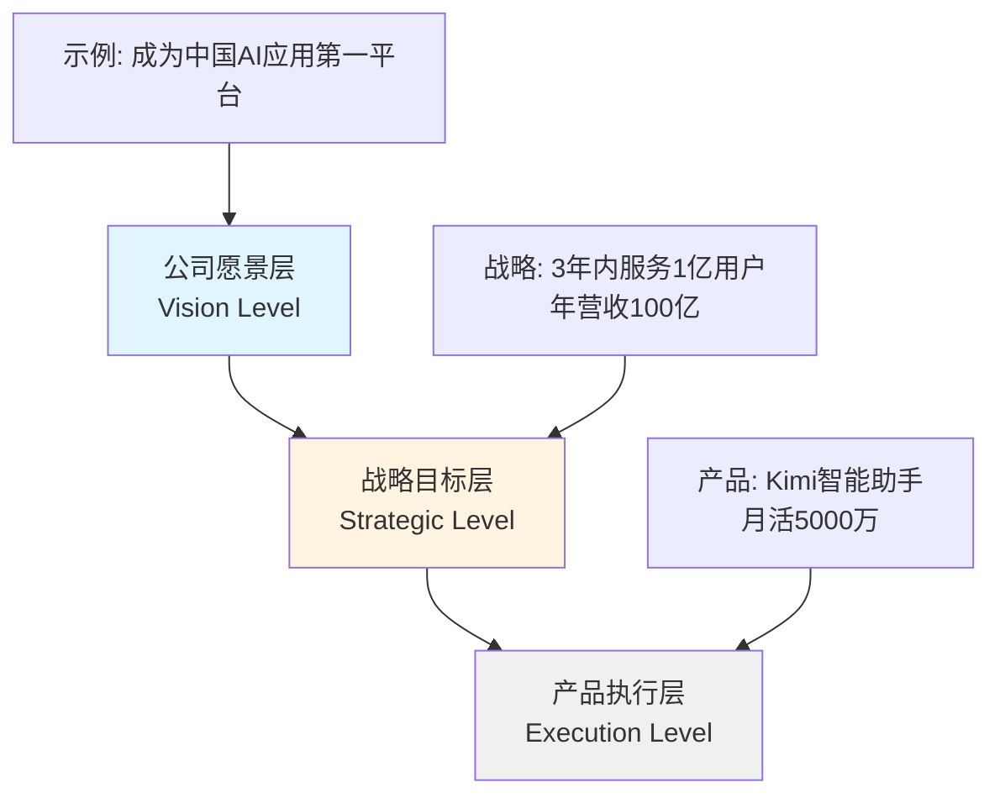

# 与业务目标对齐 | Aligning with Business Goals

## TL;DR

产品战略与业务目标的对齐是产品成功的核心前提。本文深入探讨AI产品如何在快速迭代中保持与公司战略的一致性，涵盖对齐框架、跨职能沟通机制、P&L管理以及中国大厂的实战案例。关键要点：

- **战略对齐三层模型**：愿景层→战略层→执行层的级联对齐机制
- **OKR vs KPI**：中国AI公司如何选择目标管理体系（字节跳动双轨制、阿里星级制）
- **跨职能协作**：产品-技术-商业化的铁三角协同模式
- **P&L思维**：AI产品经理的财务责任与成本-收益平衡
- **真实案例**：豆包商业化对齐、Kimi增长策略、通义千问企业版定位

**适用场景**：制定产品战略、跨部门协作、向高层汇报、处理优先级冲突

---

## 目录

1. [为什么对齐如此重要](#为什么对齐如此重要)
2. [战略对齐框架](#战略对齐框架)
3. [目标管理体系：OKR vs KPI](#目标管理体系)
4. [跨职能协作机制](#跨职能协作机制)
5. [AI产品的P&L管理](#ai产品的pl管理)
6. [处理对齐冲突](#处理对齐冲突)
7. [中国大厂实战案例](#中国大厂实战案例)
8. [核心术语表](#核心术语表)
9. [自测题](#自测题)
10. [实战练习](#实战练习)

---

## 为什么对齐如此重要

### 对齐失败的典型代价

在2024-2025年中国AI大模型竞争中，我们看到了大量因对齐问题导致的产品失败案例：

```
对齐失败案例分析（2024-2025）

┌─────────────────────────────────────────────────────────────┐
│ 案例 A：某AI搜索产品                                          │
│ ━━━━━━━━━━━━━━━━━━━━━━━━━━━━━━━━━━━━━━━━━━━━━━━━━━━━━━━━━│
│ 产品目标: 打造最智能的AI搜索引擎（技术驱动）                   │
│ 业务目标: Q2实现1000万DAU，广告变现（商业驱动）                │
│                                                               │
│ 失配表现:                                                     │
│ • 产品投入80%资源优化推理质量（P95延迟从2s降到0.8s）          │
│ • 业务需要的搜索广告系统优先级被降级                          │
│ • 用户体验极佳但变现路径不清晰                                │
│                                                               │
│ 结果: Q2 DAU达标但营收仅目标的30%，项目被重组                 │
└─────────────────────────────────────────────────────────────┘

┌─────────────────────────────────────────────────────────────┐
│ 案例 B：某企业级AI助手                                        │
│ ━━━━━━━━━━━━━━━━━━━━━━━━━━━━━━━━━━━━━━━━━━━━━━━━━━━━━━━━━│
│ 产品目标: 服务中小企业，做"普惠AI"                           │
│ 业务目标: 聚焦头部客户，年度ARR 5000万                        │
│                                                               │
│ 失配表现:                                                     │
│ • 产品设计为标准化SaaS，缺乏定制能力                          │
│ • 销售团队无法满足大客户的私有化部署需求                       │
│ • 定价策略（99元/月）无法支撑企业级服务成本                   │
│                                                               │
│ 结果: 6个月后战略调整，产品全面重构                           │
└─────────────────────────────────────────────────────────────┘
```

### 对齐的三重价值

| 价值维度 | 具体表现 | 量化指标 |
|---------|---------|---------|
| **资源效率** | 避免无效功能开发 | 功能采用率提升40%+（对齐后） |
| **决策速度** | 减少跨部门争议 | 产品迭代周期缩短30% |
| **组织信任** | 增强跨职能协作意愿 | 产品-技术满意度提升（NPS +25） |

**实战洞察 #1：对齐不是一次性行为**

> **案例：豆包商业化对齐机制**
>
> 字节跳动豆包团队在2024年Q4面临"用户增长 vs 商业化"的经典冲突。产品团队提出的解决方案是：
>
> - **每月对齐会**：产品VP、商业化负责人、技术负责人三方闭门会议
> - **双周检查点**：通过飞书文档同步关键指标变化（DAU、ARPU、留存率）
> - **季度战略复盘**：根据市场变化调整OKR权重
>
> 这种"高频轻量对齐"机制使得豆包在Q1成功推出会员制（月活用户转化率12%），同时保持免费版用户增长（+35%）。

---

## 战略对齐框架

### 三层级联对齐模型



### 对齐框架工作表

| 对齐层级 | 关键问题 | 产品经理职责 | 评估工具 |
|---------|---------|-------------|---------|
| **愿景对齐** | 产品方向是否支撑公司长期愿景？ | 理解公司战略意图 | Strategy Map |
| **目标对齐** | 产品OKR是否直接贡献业务指标？ | 设计可量化目标 | OKR模板 |
| **资源对齐** | 资源分配是否匹配优先级？ | 制定Roadmap | RICE评分 |
| **指标对齐** | 产品指标是否可追溯到业务结果？ | 建立指标体系 | North Star Metric |

### Strategy Map示例：通义千问企业版

```
通义千问战略地图（2025-2026）

财务视角 Financial Perspective
┌────────────────────────────────────────────────────┐
│ 2026年目标：企业版ARR 30亿                          │
│ • 头部客户(>100万/年): 200家                        │
│ • 中型客户(10-100万/年): 2000家                     │
└────────────────────────────────────────────────────┘
                        ↑
客户视角 Customer Perspective
┌────────────────────────────────────────────────────┐
│ 价值主张：降本增效的可信AI                          │
│ • 推理成本降低60%（vs GPT-4）                       │
│ • 企业数据安全合规（通过等保三级）                   │
│ • 7x24h中文技术支持                                 │
└────────────────────────────────────────────────────┘
                        ↑
内部流程 Internal Process
┌────────────────────────────────────────────────────┐
│ 关键能力：                                          │
│ • 私有化部署能力（30天交付）                        │
│ • API稳定性（SLA 99.9%）                            │
│ • 定制化微调服务（支持100+行业场景）                 │
└────────────────────────────────────────────────────┘
                        ↑
学习成长 Learning & Growth
┌────────────────────────────────────────────────────┐
│ 组织基础：                                          │
│ • 企业服务团队（200人销售+50人解决方案）            │
│ • 技术中台能力（ModelOps平台）                       │
│ • 行业知识库（金融/政务/制造）                       │
└────────────────────────────────────────────────────┘
```

**实战洞察 #2：用Strategy Map打通上下文**

> **Kimi增长团队的实践**
>
> 月之暗面Kimi团队在2025年Q1使用Strategy Map解决了"长文本能力 vs 用户增长"的优先级争议：
>
> 1. **财务目标**：Q2达到5000万月活（广告商务合作前置条件）
> 2. **客户价值**：长文本能力是差异化卖点（vs 豆包/文心）
> 3. **内部流程**：但长文本优化需3个月（推理引擎重构）
> 4. **决策结论**：长文本优化降级为Q2项目，Q1聚焦用户获取
>
> 这个决策在Q1帮助Kimi月活突破6000万（超目标20%），Q2再推出长文本能力时，已经有足够用户基数验证需求。

---

## 目标管理体系

### OKR vs KPI：中国AI公司的实践

| 维度 | OKR (Objectives & Key Results) | KPI (Key Performance Indicators) |
|-----|-------------------------------|----------------------------------|
| **适用阶段** | 探索期、增长期 | 成熟期、效率期 |
| **目标性质** | 挑战性目标（60-70%达成即优秀） | 承诺性目标（必须100%达成） |
| **评估周期** | 季度（灵活调整） | 年度/季度（固定） |
| **中国案例** | 字节跳动（双月OKR） | 阿里巴巴（星级考核） |
| **AI产品适用性** | ⭐⭐⭐⭐⭐ 新产品/新功能 | ⭐⭐⭐ 成熟产品运营 |

### 字节跳动双轨制案例

```
豆包产品团队目标体系（2025 Q2）

━━━━━━━━━━━━━━━━━━━━━━━━━━━━━━━━━━━━━━━━━━━━━━━━━━━
OKR轨道（创新探索）                      权重: 40%
━━━━━━━━━━━━━━━━━━━━━━━━━━━━━━━━━━━━━━━━━━━━━━━━━━━

O1: 建立AI产品的付费意愿认知
├─ KR1: 推出3个差异化会员功能（GPTs、高级模型、优先队列）
├─ KR2: 会员转化率达到8%（当前3%）
└─ KR3: 会员NPS达到50+（付费满意度）

O2: 探索企业市场可行性
├─ KR1: 完成50家企业POC测试
├─ KR2: 企业版MVP上线（Slack集成、API限额管理）
└─ KR3: 获得5个付费企业客户（客单价>10万/年）

━━━━━━━━━━━━━━━━━━━━━━━━━━━━━━━━━━━━━━━━━━━━━━━━━━━
KPI轨道（基本面保障）                    权重: 60%
━━━━━━━━━━━━━━━━━━━━━━━━━━━━━━━━━━━━━━━━━━━━━━━━━━━

K1: 月活用户 ≥ 4500万（保持行业前三）
K2: 7日留存率 ≥ 35%（不低于Q1水平）
K3: 推理成本 ≤ 0.015元/千tokens（毛利率保护）
K4: P95响应时间 ≤ 2秒（用户体验红线）
K5: 可用性 ≥ 99.5%（SLA承诺）

━━━━━━━━━━━━━━━━━━━━━━━━━━━━━━━━━━━━━━━━━━━━━━━━━━━
```

### OKR编写最佳实践

**好的OKR示例（Kimi搜索团队）**

```
❌ 错误写法：
O: 提升搜索功能
KR1: 完成搜索UI改版
KR2: 增加3个搜索来源
KR3: 用户满意度提升

✅ 正确写法：
O: 让Kimi成为用户首选的深度研究工具
KR1: 搜索功能使用率从12%提升到30%（衡量价值认知）
KR2: 搜索结果采用率达到75%（用户点击→实际使用）
KR3: 搜索驱动的留存提升15%（贡献核心指标）

差异分析：
• 目标明确可衡量（"首选工具" → 使用率30%）
• KR关注结果而非输出（"UI改版" → "使用率提升"）
• 可追溯到业务影响（搜索→留存提升）
```

---

## 跨职能协作机制

### 铁三角协同模型

在中国AI公司中，产品成功依赖"产品-技术-商业化"铁三角的高效协同：

```
铁三角协作模型

                   产品 Product
                       ●
                      /│\
                     / │ \
      用户价值设计 /  │  \ 技术可行性评估
                 /   │   \
                /    │    \
               /     │     \
              /      │      \
             ●───────┼───────●
         技术          │          商业化
       Technology      │        Business
                       │
              商业化路径验证

━━━━━━━━━━━━━━━━━━━━━━━━━━━━━━━━━━━━━━━━━━━━━━━
职责边界（以文心一言企业版为例）
━━━━━━━━━━━━━━━━━━━━━━━━━━━━━━━━━━━━━━━━━━━━━━━

产品角色：
• 定义目标客户画像（金融/政务/企业）
• 设计产品功能优先级（API稳定性 > 新功能）
• 制定定价策略（基础版/专业版/旗舰版）

技术角色：
• 评估技术实现成本（私有化部署=20人月）
• 保障系统稳定性（SLA 99.9%）
• 提供技术差异化（飞桨框架优势）

商业化角色：
• 验证市场需求（完成100+客户访谈）
• 建立销售渠道（直销+代理商）
• 管理客户生命周期（续约率90%+）

协同机制：
• 每周三方例会（飞书会议）
• 季度战略共识会（Offsite）
• 即时沟通群（飞书群组）
```

### 飞书/钉钉协作工具实践

| 协作场景 | 飞书功能 | 具体用法（腾讯元宝团队案例） |
|---------|---------|---------------------------|
| **目标对齐** | 飞书OKR | 产品OKR关联到商业化OKR（自动进度同步） |
| **需求管理** | 飞书多维表格 | PRD需求池（状态/优先级/负责人/排期） |
| **技术评审** | 飞书文档+评论 | 技术方案在线评审（@相关人+截止时间） |
| **数据看板** | 飞书BI | 实时指标监控（DAU/留存/推理成本） |
| **决策记录** | 飞书Wiki | 产品决策日志（为什么做/不做某功能） |

### 跨职能会议节奏

```
腾讯元宝产品团队会议节奏（2025）

每日 Daily
├─ 09:30 - 产品站会（15min，飞书视频）
│   • 昨日进展、今日计划、阻塞点
│
每周 Weekly
├─ 周一 10:00 - 产品-技术同步会（60min）
│   • Review上周版本质量、讨论本周技术风险
├─ 周三 14:00 - 产品-商业化对齐会（60min）
│   • 商业化需求优先级、销售反馈、竞品动态
└─ 周五 16:00 - 产品周报（异步，飞书文档）
    • 关键指标、里程碑进展、下周重点
│
每月 Monthly
├─ 月初 - 业务复盘会（120min，Offsite）
│   • 上月OKR完成情况、问题复盘、下月重点
└─ 月末 - 产品Roadmap评审（90min）
    • Q+1季度规划、资源需求、依赖识别
│
每季 Quarterly
└─ 季末 - 战略共识会（半天，线下）
    • 市场环境分析、战略调整、组织对齐
```

---

## AI产品的P&L管理

### 产品经理的财务责任

在2025-2026年，中国AI公司越来越要求产品经理具备P&L（Profit & Loss，损益表）思维：

```
AI产品P&L结构（以Kimi为例，简化模型）

━━━━━━━━━━━━━━━━━━━━━━━━━━━━━━━━━━━━━━━━━━━━━━━━━━━
收入 Revenue                              100.0%
━━━━━━━━━━━━━━━━━━━━━━━━━━━━━━━━━━━━━━━━━━━━━━━━━━━
├─ 会员订阅收入                              65%
├─ 企业API收入                               25%
└─ 广告/商务合作                             10%

━━━━━━━━━━━━━━━━━━━━━━━━━━━━━━━━━━━━━━━━━━━━━━━━━━━
直接成本 Direct Costs                      -45.0%
━━━━━━━━━━━━━━━━━━━━━━━━━━━━━━━━━━━━━━━━━━━━━━━━━━━
├─ 推理成本（GPU/算力）                      -35%
│   • 用户对话推理
│   • 搜索增强推理
├─ 带宽/存储成本                             -5%
└─ 内容安全审核                              -5%

━━━━━━━━━━━━━━━━━━━━━━━━━━━━━━━━━━━━━━━━━━━━━━━━━━━
毛利润 Gross Profit                         55.0%
━━━━━━━━━━━━━━━━━━━━━━━━━━━━━━━━━━━━━━━━━━━━━━━━━━━

━━━━━━━━━━━━━━━━━━━━━━━━━━━━━━━━━━━━━━━━━━━━━━━━━━━
运营费用 Operating Expenses                -40.0%
━━━━━━━━━━━━━━━━━━━━━━━━━━━━━━━━━━━━━━━━━━━━━━━━━━━
├─ 研发成本（产品+技术团队）                 -25%
├─ 市场推广（用户获取成本）                  -10%
└─ 运营支持（客服/运维）                     -5%

━━━━━━━━━━━━━━━━━━━━━━━━━━━━━━━━━━━━━━━━━━━━━━━━━━━
营业利润 Operating Profit                  15.0%
━━━━━━━━━━━━━━━━━━━━━━━━━━━━━━━━━━━━━━━━━━━━━━━━━━━
```

### 产品决策的成本-收益分析

**案例：豆包图片生成功能的商业化决策**

```
功能: 图片生成能力（类似Midjourney）

━━━━━━━━━━━━━━━━━━━━━━━━━━━━━━━━━━━━━━━━━━━━━━━━━━━
成本分析 Cost Analysis
━━━━━━━━━━━━━━━━━━━━━━━━━━━━━━━━━━━━━━━━━━━━━━━━━━━
一次性投入：
├─ 模型训练/微调                    200万（GPU成本）
├─ 产品开发（前后端）                80万（2个月，8人）
└─ 内容安全系统                      50万（审核模型）
合计                                 330万

持续成本（每月）：
├─ 推理成本                          预估80万/月
│   • 假设: 100万用户，人均3张/月
│   • 单张成本: 0.25元（GPU推理）
├─ 存储/CDN                          10万/月
└─ 审核人力                          5万/月
合计                                 95万/月

━━━━━━━━━━━━━━━━━━━━━━━━━━━━━━━━━━━━━━━━━━━━━━━━━━━
收益分析 Revenue Analysis
━━━━━━━━━━━━━━━━━━━━━━━━━━━━━━━━━━━━━━━━━━━━━━━━━━━
会员转化提升：
├─ 当前会员转化率: 3%
├─ 图片功能预期提升: +2% → 5%
├─ 月活用户: 4000万
└─ 新增会员: 80万 × 25元/月 = 200万/月

付费生成（非会员）：
├─ 定价: 2元/张（会员免费10张/月）
├─ 预估付费用户: 50万/月
└─ 收入: 50万 × 6元/月 = 300万/月

合计收益                             500万/月

━━━━━━━━━━━━━━━━━━━━━━━━━━━━━━━━━━━━━━━━━━━━━━━━━━━
投资回报 ROI
━━━━━━━━━━━━━━━━━━━━━━━━━━━━━━━━━━━━━━━━━━━━━━━━━━━
月净收益: 500万 - 95万 = 405万
回本周期: 330万 / 405万 ≈ 0.8个月
12个月ROI: (405万×12 - 330万) / 330万 = 1,376%

决策结论: ✅ 强烈推荐上线
```

**实战洞察 #3：用财务语言说服高层**

> **通义千问产品团队的汇报策略**
>
> 阿里云通义千问团队在2025年Q1向高层申请企业版私有化部署功能时，采用的汇报结构：
>
> 1. **战略意义**（30秒）：抢占政企市场窗口期，对标文心企业版
> 2. **市场机会**（1分钟）：已完成50家POC，转化率40%，潜在ARR 2亿
> 3. **成本收益**（2分钟）：
>    - 投入：1500万（含私有化部署工具链）
>    - 回报：首年ARR 8000万，毛利率60%
>    - ROI：12个月内4倍回报
> 4. **风险控制**（1分钟）：采用MVP策略，分3期交付，每期验证商业化假设
>
> 这种"战略-机会-财务-风险"的四段式汇报在15分钟内获得批准，关键是用CFO能听懂的财务语言。

---

## 处理对齐冲突

### 常见冲突类型

| 冲突类型 | 典型表现 | 产品经理策略 |
|---------|---------|-------------|
| **短期 vs 长期** | 商业化要快速变现，产品要打磨体验 | 分阶段策略：Q1快赢项目 + Q2体验优化 |
| **用户 vs 客户** | 终端用户要功能，付费客户要稳定 | 双轨产品：免费版快速迭代，付费版保守升级 |
| **创新 vs 效率** | 技术要探索新技术，业务要降本增效 | 721资源分配：70%保障，20%优化，10%创新 |
| **全局 vs 局部** | 公司要平台化，业务线要垂直深耕 | 平台能力模块化，业务场景可插拔 |

### 冲突解决决策树

```
产品-业务对齐冲突决策流程

开始: 出现优先级冲突
│
├─ 步骤1: 明确冲突本质
│   ├─ 是否有明确数据支持各方观点？
│   │   ├─ 无数据 → 设计AB测试/MVP验证
│   │   └─ 有数据 → 进入步骤2
│   │
├─ 步骤2: 评估业务影响
│   ├─ 影响当季核心指标（如GMV/ARR）？
│   │   ├─ 是 → 业务目标优先（设定体验底线）
│   │   └─ 否 → 进入步骤3
│   │
├─ 步骤3: 评估战略价值
│   ├─ 影响长期竞争力（如技术壁垒/品牌）？
│   │   ├─ 是 → 产品目标优先（设定商业化缓冲期）
│   │   └─ 否 → 进入步骤4
│   │
├─ 步骤4: 寻找创新方案
│   ├─ 能否通过产品设计同时满足？
│   │   • 示例：分层功能（免费/付费）
│   │   • 示例：灰度发布（降低风险）
│   │   ├─ 能 → 执行创新方案
│   │   └─ 不能 → 进入步骤5
│   │
└─ 步骤5: 升级决策
    └─ 提交上级决策（准备决策文档）
        • 冲突描述（客观事实）
        • 各方方案（成本/收益/风险）
        • 推荐方案（含论证逻辑）
```

### 决策文档模板（飞书文档格式）

```markdown
# 产品决策：XXX功能优先级争议

## 背景 (Background)
- 当前情况：豆包图片编辑功能需求（用户呼声高）
- 冲突点：产品团队推动 vs 商业化团队认为优先级低
- 决策时间窗口：本周五前必须决定Q2 Roadmap

## 双方观点 (Perspectives)

### 产品团队观点
- **论据1**：用户调研显示35%用户有图片编辑需求
- **论据2**：竞品Kimi已推出，存在用户流失风险
- **论据3**：技术成本可控（复用现有图片生成模型）

### 商业化团队观点
- **论据1**：当前会员转化瓶颈是价格敏感度，非功能缺失
- **论据2**：图片编辑MAU预估仅200万（5%渗透率），ROI低
- **论据3**：Q2资源应聚焦企业版（ARR贡献更大）

## 数据分析 (Data Analysis)

| 方案 | 投入成本 | 预期收益 | ROI | 战略价值 |
|-----|---------|---------|-----|---------|
| 图片编辑 | 150万 | 月增收50万 | 3个月回本 | ⭐⭐⭐ (C端体验) |
| 企业版功能 | 300万 | 月增ARR 200万 | 1.5个月回本 | ⭐⭐⭐⭐⭐ (B端市场) |

## 推荐方案 (Recommendation)

**决策：企业版优先，图片编辑Q3启动**

**理由：**
1. ROI相近情况下，企业版战略价值更高（进入B端市场窗口期）
2. 图片编辑延后2个月对C端竞争影响可控（Kimi渗透率仍低）
3. Q2资源聚焦，避免两线作战导致交付质量下降

**妥协方案：**
- Q2推出图片编辑MVP（仅基础裁剪/滤镜，成本30万）
- Q3根据企业版进展，决定是否全力投入图片编辑

## 风险与缓解 (Risks & Mitigation)

| 风险 | 概率 | 影响 | 缓解措施 |
|-----|------|------|---------|
| 用户流失到Kimi | 中 | 中 | 加强核心功能优化（长文本、搜索） |
| 企业版销售不及预期 | 低 | 高 | 分阶段投入，Q2中期复盘 |
```

---

## 中国大厂实战案例

### 案例1：字节跳动豆包的商业化对齐

**背景**（2024年Q4）
- 豆包月活突破4000万，但商业化路径不清晰
- 公司层面要求2025年实现收支平衡
- 产品团队担心过度商业化影响用户体验

**对齐过程**

```
阶段1: 战略共识（2024年11月）
━━━━━━━━━━━━━━━━━━━━━━━━━━━━━━━━━━━━━━━━━━━━━━━━━━━
参与者: 产品VP、商业化VP、技术VP、CFO
输出: 2025年目标共识
• 月活目标: 6000万（保持增长）
• 商业化目标: 年度营收3亿（会员+企业版）
• 体验底线: NPS不低于40，7日留存≥35%

阶段2: 策略制定（2024年12月）
━━━━━━━━━━━━━━━━━━━━━━━━━━━━━━━━━━━━━━━━━━━━━━━━━━━
策略: 双引擎驱动
• 引擎1: C端会员制（25元/月，主打高级模型+无限量）
• 引擎2: B端企业版（API服务，按Token计费）
分工明确:
• 产品团队: 负责会员功能设计+用户增长
• 商业化团队: 负责企业版销售+定价策略
• 技术团队: 保障两条线的基础设施

阶段3: 执行监控（2025年Q1-Q2）
━━━━━━━━━━━━━━━━━━━━━━━━━━━━━━━━━━━━━━━━━━━━━━━━━━━
监控机制:
• 每周: 飞书仪表盘监控关键指标
  - 会员转化率、ARPU、留存率、NPS
• 每月: 业务复盘会（线下）
  - 目标达成情况、问题诊断、策略调整
• 每季: 战略复盘
  - 市场环境变化、年度目标校准
```

**结果**（2025年Q2）
- 月活达到6500万（超目标8%）
- 会员转化率12%（780万会员），月收入1.95亿
- 企业版签约客户120家，ARR 8000万
- NPS 45，7日留存38%（体验指标健康）

**关键成功因素**
1. **高层共识**：CEO亲自参与战略共识会，明确"增长+商业化"双目标
2. **分工明确**：避免产品团队既要增长又要商业化的角色冲突
3. **数据驱动**：每周数据复盘，快速发现问题（如会员功能不足）
4. **体验红线**：设定NPS底线，商业化动作必须经过AB测试

---

### 案例2：Kimi的增长策略对齐

**挑战**（2025年Q1）
- Kimi月活3000万，增长放缓（环比+5%）
- 技术团队希望投入长文本能力优化（差异化卖点）
- 增长团队希望投入用户获取（裂变/推荐）
- 资源有限，无法同时做两件事

**决策过程**

使用Strategy Map进行对齐：

```
步骤1: 明确公司级目标
━━━━━━━━━━━━━━━━━━━━━━━━━━━━━━━━━━━━━━━━━━━━━━━━━━━
2025年目标: 5000万月活（Q2达成，为广告商务合作铺路）
推导: 需要Q1增长率达到25%（3000万 → 3750万）

步骤2: 分析增长驱动因素
━━━━━━━━━━━━━━━━━━━━━━━━━━━━━━━━━━━━━━━━━━━━━━━━━━━
数据洞察:
• 长文本用户占比仅8%（高价值但小众）
• 90%用户使用场景: 日常问答、写作辅助
• 用户增长主要来自: 自然搜索、社交媒体分享

结论: Q1的增长瓶颈不是功能差异化，而是用户获取效率

步骤3: 优先级决策
━━━━━━━━━━━━━━━━━━━━━━━━━━━━━━━━━━━━━━━━━━━━━━━━━━━
决策: Q1聚焦用户获取，长文本优化推迟到Q2

论证逻辑:
• 长文本能力优化需3个月（推理引擎重构）
• 用户获取优化可在1个月内见效（社交裂变、SEO）
• Q2再推长文本时，已有更大用户基数验证需求
• 竞争对手（豆包、文心）在Q1也未明显投入长文本

步骤4: 妥协方案（安抚技术团队）
━━━━━━━━━━━━━━━━━━━━━━━━━━━━━━━━━━━━━━━━━━━━━━━━━━━
• Q1启动长文本技术预研（10%资源，2人）
• Q2全力投入长文本（作为Q2的核心卖点）
• 产品Roadmap公开透明（技术团队参与制定）
```

**结果**
- Q1月活增长到4200万（+40%，超目标）
- Q2推出长文本能力时，用户基数已足够大
- 长文本功能推出后，高价值用户留存提升20%

**学到的教训**
1. **时机比功能重要**：好的功能在错误的时间推出，价值打折
2. **用数据说话**：用Strategy Map可视化决策逻辑，减少情绪化争议
3. **安抚关键利益方**：给技术团队"预研"作为补偿，保持团队士气

---

### 案例3：通义千问企业版的定位冲突

**背景**（2024年Q4）
- 阿里云希望通义千问做"普惠AI"（低价、标准化）
- 产品团队发现企业客户需求是"定制化、高可靠"
- 定位冲突导致产品设计摇摆不定

**对齐方法：客户分层策略**

```
客户分层与产品策略

┌────────────────────────────────────────────────────────┐
│ 层级1: 中小企业/开发者 (Long Tail)                      │
├────────────────────────────────────────────────────────┤
│ 需求: 低价、易用、标准化API                             │
│ 产品: 通义千问 基础版                                   │
│ 定价: 0.008元/千tokens（行业最低）                      │
│ 策略: 普惠AI，走量，平台化                              │
│ 业务目标: 100万注册开发者，月调用量100亿tokens           │
└────────────────────────────────────────────────────────┘

┌────────────────────────────────────────────────────────┐
│ 层级2: 成长型企业 (Mid-Market)                          │
├────────────────────────────────────────────────────────┤
│ 需求: 性价比、行业模板、技术支持                         │
│ 产品: 通义千问 专业版                                   │
│ 定价: 10-50万/年（含定制微调、SLA保障）                 │
│ 策略: 行业解决方案（电商/金融/教育）                     │
│ 业务目标: 2000家客户，ARR 1亿                           │
└────────────────────────────────────────────────────────┘

┌────────────────────────────────────────────────────────┐
│ 层级3: 头部企业/政务 (Enterprise)                       │
├────────────────────────────────────────────────────────┤
│ 需求: 私有化部署、定制化、数据安全、7x24h支持            │
│ 产品: 通义千问 旗舰版                                   │
│ 定价: 100万-1000万/年（含私有化部署、专属技术团队）      │
│ 策略: 深度定制，长期服务，生态共建                       │
│ 业务目标: 200家头部客户，ARR 5亿                        │
└────────────────────────────────────────────────────────┘

组织架构匹配:
• 基础版: 产品团队主导（自助服务，降低边际成本）
• 专业版: 产品+销售协同（行业方案，规模化复制）
• 旗舰版: 解决方案团队主导（定制化服务，高毛利）
```

**对齐结果**
- 解决"普惠 vs 定制"的二元对立，采用分层策略
- 各层级独立核算P&L，避免资源争夺
- 2025年H1实现三层级协同增长：
  - 基础版：150万开发者
  - 专业版：1800家客户，ARR 9000万
  - 旗舰版：180家客户，ARR 4.5亿

---

## 核心术语表

| 中文术语 | 英文术语 | 定义 | 应用场景 |
|---------|---------|------|---------|
| **战略对齐** | Strategic Alignment | 产品目标与公司战略方向的一致性 | 制定产品Roadmap |
| **级联目标** | Cascading Goals | 公司目标逐层分解到团队和个人 | OKR体系设计 |
| **OKR** | Objectives & Key Results | 目标与关键结果法，强调挑战性目标 | 创新产品管理 |
| **KPI** | Key Performance Indicators | 关键绩效指标，强调承诺性目标 | 成熟产品运营 |
| **North Star Metric** | 北极星指标 | 最能体现产品长期价值的单一指标 | 产品策略聚焦 |
| **P&L** | Profit & Loss | 损益表，衡量业务盈利能力 | 产品商业化决策 |
| **ARR** | Annual Recurring Revenue | 年度经常性收入（订阅类产品） | SaaS产品评估 |
| **ARPU** | Average Revenue Per User | 平均每用户收入 | 变现能力分析 |
| **ROI** | Return on Investment | 投资回报率 | 功能优先级评估 |
| **MVP** | Minimum Viable Product | 最小可行产品 | 快速验证假设 |
| **铁三角** | Triad Model | 产品-技术-商业化三方协同 | 跨职能协作 |
| **Strategy Map** | 战略地图 | 可视化战略因果关系的工具 | 战略沟通 |
| **飞书OKR** | Lark OKR | 飞书平台的目标管理工具 | 目标对齐与追踪 |
| **飞书文档** | Lark Docs | 飞书协作文档（类似Google Docs） | 异步协作 |
| **飞书多维表格** | Lark Base | 飞书的类Airtable工具 | 需求/项目管理 |

---

## 自测题

### 选择题

**1. 字节跳动豆包团队采用的"双轨制"目标管理中，OKR和KPI的权重分别是多少？**

A. OKR 50% + KPI 50%
B. OKR 60% + KPI 40%
C. OKR 40% + KPI 60%
D. OKR 30% + KPI 70%

<details>
<summary>查看答案</summary>
答案：C

解析：豆包团队采用OKR 40%（创新探索）+ KPI 60%（基本面保障）的双轨制。这种配比适合处于增长期的AI产品：既要保障基本面（用户增长、留存、成本），又要探索新的商业化方向。KPI占比更高是因为AI产品的基础设施成本高，必须确保核心指标健康。
</details>

---

**2. 在Kimi增长策略案例中，为什么Q1优先用户获取而非长文本优化？**

A. 长文本技术难度太高
B. 增长目标是Q2商务合作的前置条件
C. 竞争对手已经有长文本功能
D. 用户不需要长文本功能

<details>
<summary>查看答案</summary>
答案：B

解析：案例中的决策逻辑是：公司级目标是Q2达到5000万月活（为广告商务合作铺路），而Q1增长瓶颈不是功能差异化，而是用户获取效率。长文本优化需3个月，用户获取优化1个月见效。在时间窗口紧张时，应优先短期高ROI的策略。这体现了"时机比功能重要"的原则。
</details>

---

**3. 通义千问企业版采用的客户分层策略中，哪个层级的毛利率最高？**

A. 基础版（中小企业/开发者）
B. 专业版（成长型企业）
C. 旗舰版（头部企业/政务）
D. 三个层级毛利率相同

<details>
<summary>查看答案</summary>
答案：C

解析：旗舰版虽然定制化成本高，但客单价也最高（100万-1000万/年），且包含私有化部署、专属技术团队等高附加值服务。在B端市场，深度定制服务的毛利率通常可达60-70%，远高于标准化产品（30-40%）。基础版虽然边际成本低，但价格竞争激烈，毛利率被压缩。
</details>

---

### 简答题

**4. 如果你是豆包产品经理，商业化团队要求在首页增加广告位（预期月收入+200万），但用户研究显示这会导致NPS下降10分。你会如何处理这个对齐冲突？**

<details>
<summary>参考答案</summary>

**分析框架（Strategy Map倒推）：**

1. **财务影响**：+200万/月（+2400万/年），占年度营收目标3亿的8%
2. **用户影响**：NPS从45降到35，可能导致留存率下降（历史数据：NPS每降10分，次月留存-3%）
3. **长期价值**：如果留存率下降3%，流失用户的LTV损失 = 600万用户 × 3% × 25元ARPU × 6个月 = 2700万（远超广告收入）

**推荐方案：**
- **拒绝首页广告**，但提出替代方案：
  1. 在低价值场景插入广告（如空闲状态页、设置页）
  2. 推出"轻度会员"档位（9.9元/月，去广告+基础功能）
  3. 探索品牌合作（原生内容，非硬广）

**沟通策略：**
- 向商业化团队展示LTV计算，说明短期收益会被长期损失抵消
- 提出3个月AB测试：小流量测试广告影响，用数据说话
- 共同设计"既要又要"的方案（如上述替代方案）

**关键原则：**用数据量化冲突的真实代价，避免情绪化争论；寻找创新方案而非简单取舍。
</details>

---

**5. 描述一个你所知的AI产品（豆包/Kimi/文心一言等）的Strategy Map（包含财务、客户、内部流程、学习成长四个层级）。**

<details>
<summary>参考答案示例（以文心一言为例）</summary>

```
文心一言 Strategy Map (2025-2026)

【财务层】Financial Perspective
目标：2026年实现盈亏平衡
├─ 收入目标：年度营收20亿
│   ├─ C端会员：8亿（800万会员 × 100元/年）
│   └─ B端企业版：12亿（ARR）
└─ 成本控制：推理成本降低50%（通过飞桨框架优化）

【客户层】Customer Perspective
价值主张：最懂中文的可信AI
├─ C端：对标ChatGPT的中文体验（语义理解、文化语境）
├─ B端：安全合规的企业AI（等保三级、数据不出域）
└─ 差异化：百度搜索整合（实时信息）+ 文心大模型矩阵

【内部流程层】Internal Process
关键能力：
├─ 技术能力：文心4.0大模型（对标GPT-4）+ 飞桨框架
├─ 产品能力：搜索增强生成（RAG）、多模态理解
├─ 运营能力：内容安全审核（响应时间<100ms）
└─ 商业化能力：企业级私有化部署（30天交付）

【学习成长层】Learning & Growth
组织基础：
├─ 人才：NLP顶尖团队（百度研究院支持）
├─ 数据：百度搜索数据（中文语料优势）
├─ 生态：百度智能云客户基础（政企资源）
└─ 文化：技术驱动 + 用户至上

因果关系：
• 飞桨框架优势 → 推理成本降低 → 毛利率提升 → 可持续增长
• 百度搜索整合 → 实时信息能力 → C端用户粘性 → 会员转化
• 等保三级认证 → 企业客户信任 → B端市场份额 → ARR增长
```
</details>

---

## 实战练习

### 练习1：OKR编写（30分钟）

**场景：**
你是某AI写作助手产品经理（类似Notion AI、Jasper），公司2026年Q2的战略目标是"进入B端市场"。技术团队刚完成API平台的开发，商业化团队已签约10家POC客户。

**任务：**
为你的产品团队编写Q2 OKR（1个Objective + 3个Key Results）。

**要求：**
- Objective体现战略方向
- KR可量化、可验证
- KR需体现对业务目标的贡献

**提示：**
- 思考B端客户的核心需求（vs C端）
- 考虑如何验证B端市场可行性
- 设定合理的挑战性目标

---

### 练习2：P&L分析（45分钟）

**场景：**
你负责一个AI视频生成产品（类似Runway、Pika），用户上传文字/图片，生成5-10秒短视频。当前处于MVP阶段，月活50万，其中5%用户付费（99元/月，可生成100个视频）。

**成本结构：**
- GPU推理成本：每个视频0.8元（使用云厂商GPU）
- 存储/CDN：每用户每月0.2元
- 研发成本：产品+技术团队20人，月成本150万
- 市场推广：月预算50万

**任务：**
1. 计算当前月度P&L（收入、成本、利润）
2. 分析盈亏平衡点（需要多少付费用户？）
3. 提出3个优化方向（提升毛利率或降低成本）

**提示：**
- 付费用户 = 50万 × 5% = 2.5万
- 免费用户也有GPU成本（限定每月5个视频）
- 考虑规模化后的成本结构变化

---

### 练习3：冲突决策（60分钟）

**场景：**
你是某AI翻译产品PM（类似DeepL、彩云小译），团队面临优先级冲突：

**技术团队方案：**
- 投入3个月优化翻译质量（BLEU分数从35提升到40）
- 技术论据：质量是核心竞争力，对标DeepL
- 成本：200万（GPU训练+数据标注）

**增长团队方案：**
- 投入1个月推出"网页翻译插件"（Chrome/Edge）
- 增长论据：竞品（彩云/搜狗）已有插件，流失风险高
- 成本：50万（插件开发+应用商店推广）

**商业化团队方案：**
- 投入2个月推出"企业版API"
- 商业论据：已有20家企业询价，潜在ARR 500万
- 成本：100万（API平台+销售支持）

**任务：**
1. 使用"冲突决策树"分析三个方案
2. 编写决策文档（含推荐方案+论证逻辑）
3. 设计一个"既要又要"的创新方案（如果可能）

**提示：**
- 考虑当前产品所处阶段（增长期？成熟期？）
- 分析三个方案对核心指标（MAU/付费转化/留存）的影响
- 是否能分阶段实施（短期+长期组合）

---

## 延伸阅读

**书籍推荐：**
1. 《产品思维》（Product Thinking）- Melissa Perri：产品战略与业务对齐的经典著作
2. 《赋能》（Team of Teams）- Stanley McChrystal：跨职能协作的组织变革
3. 《这就是OKR》（Measure What Matters）- John Doerr：Google的OKR实践

**中文资源：**
- 极客时间《从0到1打造爆款产品》：中国产品经理的实战案例
- 得到APP《商业洞察力30讲》：商业分析框架
- 飞书官方文档《OKR最佳实践》：字节跳动的目标管理经验

**AI产品专题：**
- OpenAI Product Strategy（公开博客）：ChatGPT的产品演进逻辑
- a16z AI Canon：硅谷顶级VC的AI产品观察
- 中国AI产品经理社区（飞书群/知识星球）：行业案例分享

---

**下一篇预告：** Note 35 - 产品愿景与使命 | Product Vision & Mission

在掌握了战略对齐的方法后，我们将探讨如何制定激励人心的产品愿景，并将其转化为可执行的战略目标。你将学习到：愿景陈述的SMART原则、使命宣言的创作技巧、如何用愿景凝聚团队共识，以及中国AI独角兽的愿景演进案例。
