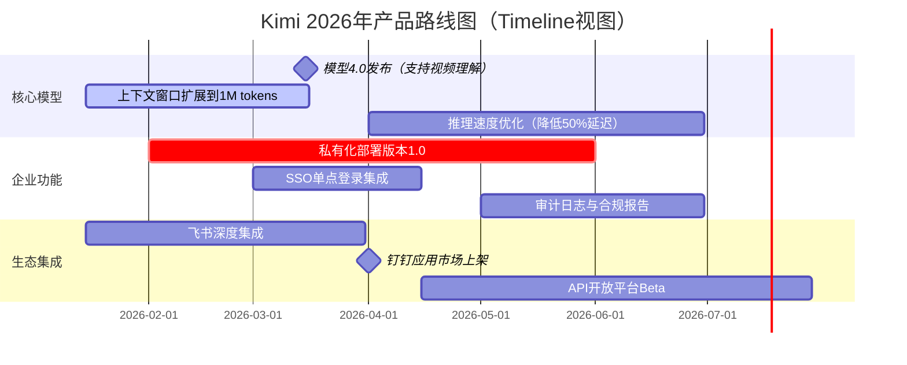
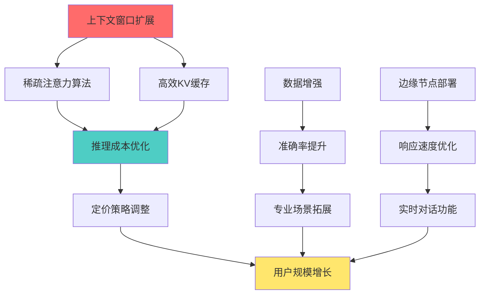

# Note 35: 构建可视化路线图 | Constructing Visual Roadmap

## TL;DR

可视化路线图是产品战略的视觉表达工具，用于向内部团队和外部利益相关者传达产品发展方向。本文聚焦AI产品路线图的构建方法，对比国产协作工具（飞书项目、Teambition、PingCode），解析2026年中国AI产品的路线图实践，涵盖路线图类型选择、可视化原则、利益相关者沟通技巧，以及AI产品特有的技术依赖管理（模型迭代、数据管线、算力资源）。

**核心要点 (Key Takeaways):**
- 路线图类型：Now/Next/Later（敏捷）、Timeline（时间线）、Feature-based（功能驱动）、Theme-based（主题驱动）
- 工具选择：飞书项目适合快速协作，Teambition适合跨团队管理，PingCode适合技术团队深度定制
- AI产品路线图特殊性：模型版本升级、数据质量改进、算力成本优化需要显式标注
- 沟通策略：针对不同受众（高管、技术团队、客户）定制路线图粒度和视角

---

## 目录 (Table of Contents)

1. [路线图本质与作用](#1-路线图本质与作用)
2. [四种主流路线图类型](#2-四种主流路线图类型)
3. [国产路线图工具对比](#3-国产路线图工具对比)
4. [可视化设计原则](#4-可视化设计原则)
5. [AI产品路线图特殊考量](#5-ai产品路线图特殊考量)
6. [2026中国AI产品路线图案例](#6-2026中国ai产品路线图案例)
7. [利益相关者沟通策略](#7-利益相关者沟通策略)
8. [远程协作与版本管理](#8-远程协作与版本管理)

---

## 1. 路线图本质与作用

### 1.1 定义与价值

**产品路线图 (Product Roadmap)** 是一种战略性可视化工具，描述产品如何随时间发展以实现业务目标和用户价值。它不是详细的项目计划，而是战略意图的传达媒介。

**核心价值：**

```
┌─────────────────────────────────────────────────────────┐
│              路线图的三层价值金字塔                     │
├─────────────────────────────────────────────────────────┤
│                                                         │
│           战略对齐 (Strategic Alignment)                │
│         • 连接公司愿景与产品执行                        │
│         • 确保资源投入方向一致                          │
│                                                         │
│     ┌───────────────────────────────────────────┐      │
│     │   利益相关者沟通 (Stakeholder Comm.)      │      │
│     │ • 向高管展示投资回报路径                  │      │
│     │ • 向团队传达优先级逻辑                    │      │
│     │ • 向客户管理功能预期                      │      │
│     └───────────────────────────────────────────┘      │
│                                                         │
│ ┌───────────────────────────────────────────────────┐  │
│ │       执行协调 (Execution Coordination)          │  │
│ │  • 跨团队依赖关系可视化                          │  │
│ │  • 资源瓶颈提前识别                              │  │
│ │  • 风险时间窗口标注                              │  │
│ └───────────────────────────────────────────────────┘  │
└─────────────────────────────────────────────────────────┘
```

### 1.2 路线图 vs 积压列表 vs 项目计划

| 维度 | 路线图 (Roadmap) | 积压列表 (Backlog) | 项目计划 (Project Plan) |
|------|------------------|--------------------|-----------------------|
| **时间跨度** | 6-18个月 | 当前迭代+未来2-3个Sprint | 单个项目生命周期 |
| **详细程度** | 战略主题/史诗 (Epic) | 用户故事 (User Story) | 任务+子任务 (Task) |
| **变更频率** | 季度调整 | 每Sprint调整 | 每日/每周更新 |
| **受众** | 高管、跨部门、客户 | 产品团队、开发团队 | 项目团队 |
| **核心问题** | "为什么做？何时做？" | "做什么？怎么验收？" | "谁做？何时完成？" |
| **AI产品特例** | 模型能力演进路径 | 算法优化任务 | GPU资源分配计划 |

---

## 2. 四种主流路线图类型

### 2.1 Now/Next/Later 敏捷路线图

**适用场景：** 快速迭代的AI产品（如对话机器人、AI助手），需求变化频繁，需要保持灵活性。

**结构特点：**
- **Now (当前迭代):** 正在开发的功能，承诺交付
- **Next (下一阶段):** 已验证需求，即将启动
- **Later (未来探索):** 战略方向，不承诺时间

**案例：豆包AI助手2026 Q1-Q2路线图**

```
┌────────────────────────────────────────────────────────────┐
│                   豆包 Now/Next/Later 路线图               │
├────────────────────────────────────────────────────────────┤
│                                                            │
│  NOW (2026年1-2月)                                         │
│  ┌──────────────────────────────────────────────────┐    │
│  │ ✓ 多模态输入（语音+图片同时识别）                │    │
│  │ ✓ 企业知识库集成（飞书文档自动索引）            │    │
│  │ ✓ 上下文窗口扩展到200K tokens                    │    │
│  └──────────────────────────────────────────────────┘    │
│                                                            │
│  NEXT (2026年3-4月)                                        │
│  ┌──────────────────────────────────────────────────┐    │
│  │ → 实时协作功能（多人共享对话上下文）            │    │
│  │ → 行业模板库（法律、医疗、金融专用Prompt）      │    │
│  │ → API调用成本优化（降低30%推理延迟）            │    │
│  └──────────────────────────────────────────────────┘    │
│                                                            │
│  LATER (2026年Q3+)                                         │
│  ┌──────────────────────────────────────────────────┐    │
│  │ ◇ Agent能力（自主调用第三方工具）               │    │
│  │ ◇ 个性化微调服务（企业客户自训练）              │    │
│  │ ◇ 多语言同声传译                                │    │
│  └──────────────────────────────────────────────────┘    │
└────────────────────────────────────────────────────────────┘
```

**实战洞察 (Practical Insight):**

> **字节跳动豆包团队的Now/Next/Later实践：** 2025年底豆包团队在内部路线图中明确承诺"Now"阶段只放已完成80%开发的功能，"Next"阶段需要技术可行性验证报告，"Later"阶段允许蓝天想法但必须标注依赖条件（如"需MoE架构升级"）。这种纪律避免了向客户过度承诺，同时保持战略灵活性。

### 2.2 Timeline 时间线路线图

**适用场景：** 需要向董事会、投资人展示明确交付节点的成熟AI产品（如企业级SaaS）。

**结构特点：**
- 横轴：明确的时间刻度（月/季度）
- 纵轴：产品线/功能模块
- 标注：里程碑、依赖关系、风险窗口

**案例：Kimi智能助手2026年路线图（时间线视图）**



**关键时间节点标注：**
- **M1 (2026-03-15):** 模型4.0发布，需提前2周冻结功能
- **M2 (2026-04-01):** 钉钉上架，需通过阿里云安全审计
- **Critical Path:** 私有化部署依赖模型4.0的轻量化版本

### 2.3 Feature-based 功能驱动路线图

**适用场景：** 产品功能复杂度高，需要向技术团队展示功能间依赖关系。

**结构特点：**
- 按功能模块分组
- 标注技术依赖（如"功能B需等待功能A的API稳定"）
- 适合工程团队理解系统架构演进

**案例：通义千问企业版2026功能路线图**

| 功能分类 | Q1 2026 | Q2 2026 | Q3 2026 | 技术依赖 |
|----------|---------|---------|---------|----------|
| **模型能力** | 通义千问2.5发布<br>(长文本理解) | 多模态融合<br>(图文视频) | Agent框架<br>(工具调用) | Q2依赖Q1模型稳定 |
| **企业集成** | 钉钉智能助手<br>企业知识库接入 | 数据安全审计<br>私有化部署 | 行业模型定制<br>(金融/医疗) | Q3依赖Q2安全认证 |
| **开发者工具** | API文档完善<br>SDK发布(Python/Java) | 模型微调平台<br>低代码训练 | 向量数据库集成<br>(Hologres) | Q2依赖Q1 API稳定 |
| **成本优化** | 推理成本降低20%<br>(模型蒸馏) | 缓存策略优化<br>(重复查询加速) | 弹性算力调度<br>(闲时降配) | Q3依赖Q1-Q2数据积累 |

**实战洞察 (Practical Insight):**

> **阿里云通义千问的功能依赖管理：** 2025年阿里云在通义千问企业版路线图中使用"技术依赖"列明确标注跨团队阻塞点。例如"多模态融合"功能依赖"模型2.5稳定"，当模型团队延期2周时，产品团队立即调整Q2路线图，将多模态功能推迟并用"数据安全审计"填补空档，避免客户感知到延期。

### 2.4 Theme-based 主题驱动路线图

**适用场景：** 向非技术高管或客户传达产品战略主题，弱化时间承诺。

**结构特点：**
- 按业务主题分组（如"用户体验提升"、"成本优化"、"生态建设"）
- 不强调具体时间，强调战略意图
- 适合早期规划或战略讨论

**案例：腾讯元宝2026战略主题路线图**

```
┌────────────────────────────────────────────────────────────┐
│            腾讯元宝2026年三大战略主题路线图                │
├────────────────────────────────────────────────────────────┤
│                                                            │
│  主题1: 深度融入微信生态 (WeChat Ecosystem Integration)   │
│  ┌──────────────────────────────────────────────────┐    │
│  │ • 微信小程序内嵌对话窗口                         │    │
│  │ • 公众号内容自动摘要与问答                       │    │
│  │ • 企业微信智能客服Agent                          │    │
│  │ • 视频号脚本生成与优化建议                       │    │
│  │ 目标：DAU从200万提升至1000万                     │    │
│  └──────────────────────────────────────────────────┘    │
│                                                            │
│  主题2: 企业级AI中台 (Enterprise AI Platform)             │
│  ┌──────────────────────────────────────────────────┐    │
│  │ • 混元大模型私有化部署（金融/政务版）            │    │
│  │ • 行业知识库预训练（腾讯云TKE集成）              │    │
│  │ • 数据安全合规认证（等保三级、ISO27001）         │    │
│  │ • ROI计算器与成本透明化仪表盘                    │    │
│  │ 目标：企业客户数从50家增长至500家                │    │
│  └──────────────────────────────────────────────────┘    │
│                                                            │
│  主题3: 算力成本优化 (Cost Efficiency)                    │
│  ┌──────────────────────────────────────────────────┐    │
│  │ • 模型量化部署（INT8推理）                       │    │
│  │ • 动态批处理与请求合并                           │    │
│  │ • 边缘计算节点部署（降低带宽成本）               │    │
│  │ • 用户侧缓存策略（减少重复计算）                 │    │
│  │ 目标：单次对话成本从0.05元降至0.02元             │    │
│  └──────────────────────────────────────────────────┘    │
└────────────────────────────────────────────────────────────┘
```

---

## 3. 国产路线图工具对比

### 3.1 工具功能矩阵

| 工具 | 路线图类型支持 | 协作能力 | 集成生态 | 定价 | 推荐场景 |
|------|---------------|----------|----------|------|----------|
| **飞书项目** | Timeline, Kanban | 实时协作<br>@提醒 | 飞书文档/OKR/日历 | 免费（飞书用户）<br>高级版¥19/人/月 | 快速启动<br>中小团队 |
| **Teambition** | Timeline, Gantt<br>Now/Next/Later | 任务流转<br>权限管理 | 钉钉/企业微信 | 免费（基础版）<br>专业版¥99/人/年 | 跨部门协作<br>大型企业 |
| **PingCode** | Timeline, Feature-based<br>自定义字段 | API集成<br>Webhook | Jira迁移<br>代码仓库 | ¥499/人/年起 | 技术团队<br>研发管理 |
| **Worktile** | Timeline, 里程碑 | 审批流<br>自动化规则 | 企业微信/飞书 | ¥399/人/年起 | 项目制团队<br>流程管理 |
| **飞书多维表格<br>+仪表盘** | 自定义<br>任意类型 | 实时多人编辑<br>评论 | 飞书全家桶 | 免费（飞书用户） | 高度定制<br>灵活性优先 |

### 3.2 工具选择决策树

```
开始选择路线图工具
  │
  ├─ 团队规模 < 20人？
  │   ├─ Yes → 使用飞书项目或飞书多维表格（免费+快速上手）
  │   └─ No → 继续判断
  │
  ├─ 需要跨多个外部系统集成（如Jira/GitLab）？
  │   ├─ Yes → PingCode（技术团队首选，API丰富）
  │   └─ No → 继续判断
  │
  ├─ 主要沟通对象是非技术高管/客户？
  │   ├─ Yes → Teambition（视觉友好）或飞书多维表格（灵活定制）
  │   └─ No → 继续判断
  │
  └─ 需要复杂的依赖关系管理和资源分配？
      ├─ Yes → Worktile（项目制）或PingCode（研发制）
      └─ No → 飞书项目（轻量级敏捷）
```

### 3.3 飞书项目路线图实战配置

**步骤1：创建项目并选择"路线图"视图**

```
飞书项目 → 新建项目 → 选择"产品路线图"模板
  │
  ├─ 自定义字段：
  │   • 优先级（P0/P1/P2）
  │   • 负责团队（算法/工程/产品/设计）
  │   • 依赖项（关联其他任务ID）
  │   • 模型版本（如"依赖模型3.5"）
  │   • 算力需求（A100卡时/周）
  │
  └─ 视图配置：
      • Timeline视图：按月展示
      • 分组依据：负责团队
      • 颜色编码：按优先级
      • 里程碑标注：重大发布节点
```

**实战洞察 (Practical Insight):**

> **月之暗面Kimi团队的飞书项目实践：** 2025年Kimi团队在飞书项目中为每个路线图条目添加自定义字段"算力峰值"，标注该功能上线时的GPU需求（如"推理优化功能需额外100张A100卡2周"）。这让基础设施团队提前3个月采购硬件，避免了2025年Q3因算力不足导致的功能延期。运维成本提前可预测性从40%提升至85%。

---

## 4. 可视化设计原则

### 4.1 七大可视化原则

| 原则 | 说明 | 反例 | 正例 |
|------|------|------|------|
| **1. 信息层次化** | 不同受众看到不同粒度 | 向CEO展示具体API参数 | 向CEO展示业务主题，向CTO展示技术依赖 |
| **2. 颜色语义化** | 颜色传达状态/优先级 | 随意使用彩虹色 | 红色=高优先级，绿色=已完成，灰色=暂缓 |
| **3. 时间刻度一致** | 避免误导性的时间跳跃 | Q1占50%宽度，Q2占10% | 每月/每季度等宽，或明确标注非线性 |
| **4. 依赖关系可见** | 关键路径和阻塞点突出 | 功能孤立展示 | 用箭头标注"功能B需等待功能A" |
| **5. 不确定性透明** | 区分承诺与探索 | 所有功能都像确定的 | Now/Next/Later或虚线表示"探索中" |
| **6. 进度可追踪** | 显示当前完成百分比 | 静态路线图无更新 | 每周同步进度，完成项打勾 |
| **7. 留白与聚焦** | 不要塞满所有细节 | 100个功能点密密麻麻 | 聚焦10-15个关键功能/主题 |

### 4.2 AI产品路线图特殊视觉元素

**模型版本演进轴：**

```
模型能力演进（纵轴）vs 功能发布（横轴）

高级能力
  ↑
  │    ┌─────────┐                    ┌─────────┐
  │    │Agent能力│ ← 依赖模型5.0      │多模态2.0│
  │    └─────────┘                    └─────────┘
  │          ↑                              ↑
  │    ┌─────────┐    ┌─────────┐    ┌─────────┐
  │    │上下文1M │    │推理加速 │    │多模态1.0│
  │    └─────────┘    └─────────┘    └─────────┘
  │          ↑              ↑              ↑
  │    ┌─────────────────────────────────────┐
  │    │      模型4.0基线                     │
  │    └─────────────────────────────────────┘
  │
基础能力 ─────────────────────────────────────→
      2026 Q1    Q2        Q3        Q4      时间
```

**算力资源分配可视化：**

```
GPU资源分配计划（2026年）

100% ┤
     │ ▓▓▓▓▓▓▓▓▓▓▓▓▓▓▓▓▓▓▓▓▓▓▓▓▓▓▓▓▓▓▓▓▓▓▓▓
 80% ┤ ▓▓▓训练▓▓│░推理░│▓▓训练▓│░░推理░░░
     │ ▓▓▓新模型▓│░服务░│▓优化▓│░扩容░░░░
 60% ┤ ▓▓▓▓▓▓▓▓▓│░░░░░│▓▓▓▓▓│░░░░░░░░░
     │ ▓▓▓▓▓▓▓▓▓│░░░░░│▓▓▓▓▓│░░░░░░░░░
 40% ┤ ▒▒▒▒▒▒▒▒▒│▒▒▒▒▒│▒▒▒▒▒│▒▒▒▒▒▒▒▒▒
     │ ▒研发环境▒│▒测试▒│▒研发▒│▒▒▒测试▒▒
 20% ┤ ▒▒▒▒▒▒▒▒▒│▒▒▒▒▒│▒▒▒▒▒│▒▒▒▒▒▒▒▒▒
     │ ░░░░░░░░░│░░░░░│░░░░░│░░░░░░░░░
  0% ┤ ░预留缓冲░│░缓冲░│░缓冲░│░░缓冲░░░
     └─────────┴──────┴──────┴──────────
       Q1      Q2     Q3      Q4

▓ = 模型训练  ░ = 生产推理  ▒ = 研发测试
```

---

## 5. AI产品路线图特殊考量

### 5.1 模型版本依赖标注

AI产品的功能往往依赖底层模型能力，路线图必须显式标注这种依赖关系：

**案例：文心一言企业版功能与模型版本映射**

```
功能层                     模型层
  │                          │
  ├─ 法律文书生成 ────────→ 文心4.5（法律领域微调）
  │                          ├─ 需要：100万法律文书训练集
  │                          └─ 预计：2026年3月Ready
  │
  ├─ 实时语音对话 ────────→ 文心4.0（低延迟版）
  │                          ├─ 需要：推理延迟<500ms
  │                          └─ 预计：2026年2月Ready
  │
  └─ 图文混合理解 ────────→ 文心5.0（多模态）
                             ├─ 需要：视觉编码器升级
                             └─ 风险：可能延期至Q3
```

**路线图中的标注方法：**
- 功能卡片右上角标注"依赖模型X.X"
- 模型未Ready时用🚧图标警示
- 模型延期时自动联动调整功能时间

### 5.2 数据质量改进路径

AI产品性能提升不仅靠模型迭代，还依赖数据质量：

| 数据改进方向 | 影响功能 | 时间投入 | 效果预期 | 路线图标注 |
|-------------|---------|---------|---------|-----------|
| 清洗脏数据（去噪） | 所有生成任务 | 持续2个月 | 幻觉率降低20% | 作为独立史诗在Q1 |
| 增加长尾场景数据 | 垂直行业功能 | 每月迭代 | 专业准确率+15% | 每季度里程碑 |
| 用户反馈闭环 | 推荐系统优化 | 实时收集 | CTR提升10% | 作为持续运营任务 |
| 合成数据生成 | 多模态训练 | 1次性3周 | 训练成本降低30% | Q2技术债务清理 |

**数据改进在路线图中的呈现：**

```
┌────────────────────────────────────────────────────────┐
│  2026 Q1-Q2 数据质量提升计划（底层支撑层）            │
├────────────────────────────────────────────────────────┤
│                                                        │
│  Q1: 数据清洗专项                                      │
│  ┌──────────────────────────────────────────────┐    │
│  │ Week 1-4:  历史对话数据去噪（50M条）         │    │
│  │ Week 5-8:  标注质量审计（抽样10%人工复核）   │    │
│  │ 效果验证:  模型幻觉率从15%降至12%            │    │
│  └──────────────────────────────────────────────┘    │
│                                                        │
│  Q2: 垂直领域数据增强                                  │
│  ┌──────────────────────────────────────────────┐    │
│  │ 金融领域:  新增50K财报问答对（合成数据）     │    │
│  │ 医疗领域:  采购第三方医学知识图谱            │    │
│  │ 法律领域:  与律所合作标注1M判决书            │    │
│  └──────────────────────────────────────────────┘    │
└────────────────────────────────────────────────────────┘
```

### 5.3 算力成本与功能权衡

AI产品的边际成本显著，路线图需平衡功能野心与成本现实：

**成本敏感度分级：**

```
功能类型          单次调用成本    并发用户上限    路线图优先级
━━━━━━━━━━━━━━━━━━━━━━━━━━━━━━━━━━━━━━━━━━━━━━━━━━━
轻量级查询        ¥0.001          100万/day       P0（先上线）
  (如FAQ问答)

中度推理          ¥0.02           10万/day        P1（观察需求）
  (如文档摘要)

重度生成          ¥0.15           1万/day         P2（付费功能）
  (如长文创作)

多模态处理        ¥0.50           1000/day        P3（企业定制）
  (如视频理解)
```

**成本优化在路线图中的体现：**

| 优化措施 | 实施时间 | 成本降幅 | 功能影响 | 路线图依赖 |
|----------|---------|---------|---------|-----------|
| 模型蒸馏（小模型） | Q1 | -40%单次成本 | 简单任务用小模型 | 需先验证小模型效果 |
| 用户侧缓存 | Q2 | -30%重复请求 | 重复问题秒回 | 需前端SDK升级 |
| 批处理合并 | Q2 | -20%并发成本 | 非实时任务延迟5s | 需异步任务队列 |
| 边缘节点部署 | Q3 | -50%带宽成本 | 低延迟区域加速 | 需CDN合作 |

---

## 6. 2026中国AI产品路线图案例

### 6.1 案例1：豆包企业版（B端SaaS路线图）

**背景：** 豆包2026年战略重点从C端流量转向B端付费转化，路线图聚焦企业集成和ROI证明。

```
┌────────────────────────────────────────────────────────┐
│        豆包企业版2026路线图（Theme-based视图）         │
├────────────────────────────────────────────────────────┤
│                                                        │
│  主题1: 企业集成零摩擦 (Seamless Integration)         │
│  ┌──────────────────────────────────────────────┐    │
│  │ Q1: 飞书/钉钉/企业微信三大平台深度集成       │    │
│  │     • 单点登录（SSO）+ 组织架构同步          │    │
│  │     • 会议纪要自动生成（飞书妙记集成）       │    │
│  │                                              │    │
│  │ Q2: 企业知识库智能索引                       │    │
│  │     • 飞书文档/云盘自动向量化               │    │
│  │     • 权限继承（员工只看有权限的文档）       │    │
│  │                                              │    │
│  │ Q3: 业务系统API连接                          │    │
│  │     • CRM（Salesforce/纷享销客）集成        │    │
│  │     • ERP（金蝶/用友）数据查询              │    │
│  └──────────────────────────────────────────────┘    │
│                                                        │
│  主题2: ROI可证明 (Measurable ROI)                     │
│  ┌──────────────────────────────────────────────┐    │
│  │ Q1: 使用情况仪表盘                           │    │
│  │     • 部门使用率排行                         │    │
│  │     • 节省人时统计（vs人工处理）            │    │
│  │                                              │    │
│  │ Q2: A/B测试平台                              │    │
│  │     • 对比使用豆包前后的工作效率             │    │
│  │     • 典型场景ROI计算器（客服/文档/会议）   │    │
│  │                                              │    │
│  │ Q3: 成本透明化                               │    │
│  │     • Token消耗明细（按部门/用户）          │    │
│  │     • 智能预算预警（超额提醒）              │    │
│  └──────────────────────────────────────────────┘    │
│                                                        │
│  主题3: 数据安全合规 (Security & Compliance)           │
│  ┌──────────────────────────────────────────────┐    │
│  │ Q1: 私有化部署版本（金融/政务专用）          │    │
│  │ Q2: 等保三级认证 + ISO27001                  │    │
│  │ Q3: 数据加密传输 + 审计日志180天留存         │    │
│  └──────────────────────────────────────────────┘    │
└────────────────────────────────────────────────────────┘

关键指标 (North Star Metrics):
• 企业客户数: 50家 → 500家
• 付费转化率: 5% → 15%
• 客户年度留存: 60% → 85%
```

### 6.2 案例2：Kimi长文本处理（技术驱动路线图）

**背景：** Kimi的核心竞争力是长文本理解，路线图围绕上下文窗口扩展和成本优化。

**Feature-based路线图：**

| 技术能力 | 2026 Q1 | Q2 | Q3 | Q4 | 业务价值 |
|---------|---------|----|----|----|----|
| **上下文窗口** | 200K tokens<br>(当前) | 500K tokens<br>(研究论文分析) | 1M tokens<br>(整本书理解) | 2M tokens<br>(代码仓库分析) | 单次处理更多信息<br>减少多轮对话 |
| **推理成本** | 基线¥0.05/次 | 降低30%<br>(模型蒸馏) | 降低50%<br>(稀疏注意力) | 降低70%<br>(混合精度) | 定价空间增大<br>免费额度提升 |
| **响应速度** | 首Token延迟2s | 降至1.5s<br>(预加载优化) | 降至1s<br>(推测解码) | 降至0.5s<br>(边缘缓存) | 用户体验提升<br>实时对话可行 |
| **准确率** | 长文本F1: 0.82 | 0.85<br>(数据增强) | 0.88<br>(对比学习) | 0.90<br>(人类反馈) | 专业场景可用<br>减少二次确认 |

**技术依赖关系图：**



### 6.3 案例3：文心一言行业定制（客户导向路线图）

**背景：** 百度2026年战略聚焦垂直行业定制模型，路线图按客户类型分层。

**客户分层路线图：**

```
┌────────────────────────────────────────────────────────┐
│     文心一言2026行业定制路线图（客户视角）             │
├────────────────────────────────────────────────────────┤
│                                                        │
│  Tier 1: 战略大客户（金融/政务/运营商）                │
│  ┌──────────────────────────────────────────────┐    │
│  │ Q1: • 工商银行专属模型（风控场景）           │    │
│  │     • 浙江政务云私有化部署                   │    │
│  │     • 中国移动客服Agent（处理1000万用户）    │    │
│  │                                              │    │
│  │ Q2: • 招商银行信贷审批自动化                 │    │
│  │     • 深圳政府行政审批智能助手               │    │
│  │                                              │    │
│  │ 交付标准: 定制训练 + 30天PoC + 驻场支持      │    │
│  └──────────────────────────────────────────────┘    │
│                                                        │
│  Tier 2: 成长型企业（1000-5000人规模）                │
│  ┌──────────────────────────────────────────────┐    │
│  │ Q1: 行业模板库（20+行业开箱即用）            │    │
│  │     • 电商：商品描述生成                     │    │
│  │     • 法律：合同审查助手                     │    │
│  │     • 医疗：病历摘要提取                     │    │
│  │                                              │    │
│  │ Q2: 低代码微调平台（拖拽式训练）             │    │
│  │     • 上传100条样本即可微调                  │    │
│  │     • 自动评估模型效果                       │    │
│  │                                              │    │
│  │ 交付标准: SaaS订阅 + 在线文档 + 社区支持     │    │
│  └──────────────────────────────────────────────┘    │
│                                                        │
│  Tier 3: 开发者/小微企业                               │
│  ┌──────────────────────────────────────────────┐    │
│  │ Q1: API降价50%（基础版）                     │    │
│  │ Q2: 免费额度提升至10万tokens/月              │    │
│  │ Q3: 开源小模型（10B参数可本地部署）          │    │
│  │                                              │    │
│  │ 交付标准: API调用 + SDK + 示例代码库         │    │
│  └──────────────────────────────────────────────┘    │
└────────────────────────────────────────────────────────┘
```

---

## 7. 利益相关者沟通策略

### 7.1 受众分层定制

不同利益相关者关注点不同，需要定制路线图视图：

| 受众 | 关注点 | 路线图类型 | 细节层级 | 更新频率 |
|------|--------|-----------|---------|---------|
| **CEO/董事会** | 战略对齐、市场时机、财务回报 | Theme-based | 史诗级（3-5个主题） | 季度 |
| **CTO/技术VP** | 技术可行性、架构演进、技术债务 | Feature-based | 功能级+依赖关系 | 月度 |
| **产品团队** | 用户价值、优先级逻辑、交付节奏 | Now/Next/Later | 用户故事级 | 双周 |
| **销售团队** | 客户承诺、竞品对比、交付确定性 | Timeline | 里程碑+交付物 | 月度 |
| **客户/合作伙伴** | 功能可用性、集成计划、迁移路径 | Timeline（公开版） | 功能级（隐藏内部代号） | 季度 |
| **投资人** | 增长指标、市场份额、护城河 | Theme-based | 业务主题+数据指标 | 季度/年度 |

### 7.2 路线图沟通会议结构

**季度路线图评审会（2小时标准议程）：**

```
┌────────────────────────────────────────────────────────┐
│          季度路线图评审会议议程                        │
├────────────────────────────────────────────────────────┤
│                                                        │
│  [0-15分钟] 上季度回顾                                 │
│  ┌──────────────────────────────────────────────┐    │
│  │ • 承诺完成率: 85%（17/20个功能）             │    │
│  │ • 未完成原因分析: 算力瓶颈、依赖方延期        │    │
│  │ • 学到的教训: 高估了模型训练速度             │    │
│  └──────────────────────────────────────────────┘    │
│                                                        │
│  [15-45分钟] 下季度路线图提案                          │
│  ┌──────────────────────────────────────────────┐    │
│  │ • 为什么是这些功能？（与OKR对齐）            │    │
│  │ • 用户研究支撑（5个客户访谈片段）            │    │
│  │ • 竞品动态（Kimi/豆包/通义最新功能）         │    │
│  │ • 技术可行性（CTO确认依赖项已Ready）         │    │
│  └──────────────────────────────────────────────┘    │
│                                                        │
│  [45-75分钟] 跨部门依赖协调                            │
│  ┌──────────────────────────────────────────────┐    │
│  │ • 算法团队: 模型4.0何时稳定？                │    │
│  │ • 基础设施: Q2能否提供额外100张A100？        │    │
│  │ • 法务/合规: 数据审计需要多久？              │    │
│  │ • 销售: 哪些功能客户最期待？                 │    │
│  └──────────────────────────────────────────────┘    │
│                                                        │
│  [75-105分钟] 风险讨论与应急预案                       │
│  ┌──────────────────────────────────────────────┐    │
│  │ • 识别Top 3风险（技术/市场/资源）            │    │
│  │ • 每个风险的Plan B（如模型延期的备选方案）  │    │
│  │ • 缓冲时间分配（预留15%时间应对意外）        │    │
│  └──────────────────────────────────────────────┘    │
│                                                        │
│  [105-120分钟] 决策与行动项                            │
│  ┌──────────────────────────────────────────────┐    │
│  │ • 最终路线图版本确认（投票表决争议项）       │    │
│  │ • 分配DRI（Directly Responsible Individual）  │    │
│  │ • 下次同步时间: 4周后进度检查会              │    │
│  └──────────────────────────────────────────────┘    │
└────────────────────────────────────────────────────────┘
```

### 7.3 向客户传达路线图的技巧

**原则：** 承诺保守，交付超预期。

**禁忌清单：**
- ❌ 在路线图中承诺具体日期（如"3月15日上线"）
- ❌ 展示内部技术代号（如"Project Phoenix"）
- ❌ 承诺依赖第三方的功能（如"等微信开放API后实现"）
- ❌ 在路线图中加入"可能""或许"等不确定词汇

**推荐做法：**
- ✅ 使用季度粒度（"2026年Q2"）而非具体日期
- ✅ 用业务术语而非技术术语（"智能推荐"而非"协同过滤算法"）
- ✅ 标注"已在开发""计划中""探索阶段"三档确定性
- ✅ 提供订阅机制（"路线图有更新时邮件通知您"）

**客户路线图示例：**

```
┌────────────────────────────────────────────────────────┐
│        文心一言企业版客户路线图（2026 H1）             │
├────────────────────────────────────────────────────────┤
│                                                        │
│  正在开发 (In Development)                             │
│  ┌──────────────────────────────────────────────┐    │
│  │ ✓ 飞书深度集成 — 2026年Q1                    │    │
│  │ ✓ 单点登录（SSO） — 2026年Q1                 │    │
│  │ ✓ 上下文窗口扩展至500K — 2026年Q2            │    │
│  └──────────────────────────────────────────────┘    │
│                                                        │
│  已规划 (Planned)                                      │
│  ┌──────────────────────────────────────────────┐    │
│  │ ○ 行业知识库预训练（金融/法律） — 2026年Q2  │    │
│  │ ○ 低代码微调平台 — 2026年Q2                  │    │
│  │ ○ 数据安全审计日志 — 2026年Q3                │    │
│  └──────────────────────────────────────────────┘    │
│                                                        │
│  探索中 (Under Exploration)                            │
│  ┌──────────────────────────────────────────────┐    │
│  │ △ 多模态理解（图片+文本） — 2026年下半年     │    │
│  │ △ Agent自主决策能力 — 2026年下半年           │    │
│  └──────────────────────────────────────────────┘    │
│                                                        │
│  ℹ️ 说明：路线图可能根据客户反馈和技术进展调整。       │
│  📧 订阅更新：roadmap-updates@wenxin.baidu.com        │
└────────────────────────────────────────────────────────┘
```

---

## 8. 远程协作与版本管理

### 8.1 分布式团队的路线图协作

**挑战：** AI产品团队通常跨地域（算法团队在北京，产品团队在深圳，销售团队分布全国）。

**解决方案：单一事实来源（Single Source of Truth）**

```
协作流程（飞书项目示例）

1. 路线图Owner（产品总监）
   ├─ 创建路线图主文档（飞书项目）
   ├─ 设置编辑权限（各团队负责人可编辑各自部分）
   └─ 配置自动通知（任何修改触发@相关人）

2. 各团队维护各自部分
   ├─ 算法团队：维护"模型能力"泳道
   ├─ 工程团队：维护"技术基础设施"泳道
   ├─ 产品团队：维护"功能发布"泳道
   └─ 每周五下午16:00同步更新进度

3. 版本控制
   ├─ 每季度路线图冻结前标记"Baseline版本"
   ├─ 重大调整需路线图Owner审批
   ├─ 飞书项目自动记录历史版本（可回溯）
   └─ 每月导出PDF发送高管（存档用）

4. 异步沟通机制
   ├─ 争议项在飞书任务评论区讨论（不开会）
   ├─ 48小时响应SLA（超时自动升级）
   └─ 每月1次全员路线图同步会（录屏可回看）
```

### 8.2 路线图版本演进策略

**版本命名：** `YYYY-QX-vY` 格式（如2026-Q1-v3表示2026年第一季度路线图第3版）

**变更管理流程：**

| 变更类型 | 审批级别 | 通知范围 | 记录方式 |
|---------|---------|---------|---------|
| **微调** (单功能延期1周内) | 团队负责人 | 项目组 | 飞书任务备注 |
| **中等调整** (功能取消/替换) | 产品总监 | 全产品部+销售 | 路线图文档备注+邮件 |
| **重大变更** (季度优先级重排) | CEO/CTO | 全公司 | 全员会+飞书文档 |

**变更日志示例：**

```
━━━━━━━━━━━━━━━━━━━━━━━━━━━━━━━━━━━━━━━━━━━━━━━━
文心一言2026-Q1路线图变更日志
━━━━━━━━━━━━━━━━━━━━━━━━━━━━━━━━━━━━━━━━━━━━━━━━

版本: 2026-Q1-v3
发布日期: 2026-01-28
变更类型: 中等调整

变更内容:
• [延期] 多模态理解功能从Q1推迟至Q2
  - 原因: 视觉编码器准确率未达标（当前82%，目标90%）
  - 影响: 客户A（腾讯）、客户B（字节）已同步
  - 替代方案: Q1优先完成长文本优化（客户更高优先级）

• [新增] 成本优化专项提前至Q1
  - 原因: Q4运营成本超预算15%，董事会要求优先处理
  - 预期效果: 单次推理成本降低30%
  - 资源分配: 从多模态团队调配2名算法工程师

• [取消] 语音克隆功能
  - 原因: 法律合规风险（深伪技术监管收紧）
  - 影响: 无客户明确需求，内部探索项目

审批人: CTO 王海峰
通知范围: 全产品部、算法部、销售部
下次评审: 2026-02-15（路线图中期检查）
━━━━━━━━━━━━━━━━━━━━━━━━━━━━━━━━━━━━━━━━━━━━━━━━
```

### 8.3 路线图与OKR联动

路线图是执行层，OKR是目标层，两者需要对齐：

**联动机制：**

```
公司OKR（2026年）
  │
  ├─ O1: 成为中国企业AI市场份额Top 3
  │   ├─ KR1: 企业客户数从50家增至500家
  │   │   └─→ 路线图主题: "企业集成零摩擦"
  │   │
  │   ├─ KR2: 付费转化率从5%提升至15%
  │   │   └─→ 路线图主题: "ROI可证明"
  │   │
  │   └─ KR3: 客户NPS从60提升至80
  │       └─→ 路线图主题: "用户体验优化"
  │
  ├─ O2: 实现单位经济效益（Unit Economics）盈亏平衡
  │   ├─ KR1: 单次对话成本降低50%
  │   │   └─→ 路线图主题: "算力成本优化"
  │   │
  │   └─ KR2: 付费用户ARPU提升至¥500/月
  │       └─→ 路线图功能: "高级功能分层定价"
  │
  └─ O3: 建立技术护城河
      ├─ KR1: 长文本理解准确率行业第一
      │   └─→ 路线图功能: "上下文窗口扩展"
      │
      └─ KR2: 模型推理速度Top 3
          └─→ 路线图功能: "推理加速专项"
```

**每季度OKR与路线图对齐检查：**

| 检查项 | 标准 | 不对齐的后果 |
|--------|------|-------------|
| 每个KR是否有路线图支撑？ | 100%覆盖 | KR无法达成 |
| 路线图功能是否都对应某个KR？ | 80%以上对应 | 资源浪费 |
| 功能优先级是否与KR权重一致？ | P0功能对应核心KR | 战略偏离 |

---

## 核心术语表 (Glossary)

| 中文术语 | 英文术语 | 定义 | AI产品特例 |
|---------|---------|------|-----------|
| 路线图 | Roadmap | 产品战略的可视化表达，描述产品如何随时间发展 | 需包含模型版本演进 |
| 史诗 | Epic | 大型功能集合，通常需要数周至数月完成 | 如"多模态能力"史诗 |
| 主题 | Theme | 战略性方向，比史诗更抽象 | 如"成本优化"主题 |
| 里程碑 | Milestone | 重要的时间节点或交付物 | 如"模型4.0发布" |
| 依赖项 | Dependency | 某功能需等待另一功能完成 | 如"Agent能力依赖模型5.0" |
| 技术债务 | Technical Debt | 为快速交付而妥协的技术质量 | 如"临时用小模型，Q2换大模型" |
| 单一事实来源 | Single Source of Truth | 唯一权威的路线图文档 | 避免Excel/PPT/Wiki多版本混乱 |
| Now/Next/Later | N/A | 敏捷路线图的三阶段划分 | Now=当前Sprint, Next=下2-3个Sprint |
| 泳道 | Swimlane | 路线图中按团队/模块分组的视觉区域 | 如"算法泳道""产品泳道" |
| 算力预算 | Compute Budget | AI产品特有的GPU资源分配计划 | 需在路线图中显式标注 |

---

## 自测题 (Self-Assessment)

### 选择题

**1. 以下哪种路线图类型最适合向投资人展示产品战略？**
- A. Now/Next/Later（强调时间承诺）
- B. Feature-based（强调技术细节）
- C. Theme-based（强调业务主题）
- D. Timeline（强调具体日期）

<details>
<summary>点击查看答案</summary>
**答案：C**

**解析：** 投资人关注战略方向和业务价值，不关注技术实现细节。Theme-based路线图用"用户增长""成本优化""生态建设"等业务主题沟通，避免技术术语，且不强制承诺具体时间（给产品团队灵活性）。Timeline虽然直观，但过度承诺时间可能带来投资人压力。
</details>

**2. AI产品路线图中，"模型4.0发布"应该标注为？**
- A. 功能（Feature）
- B. 里程碑（Milestone）
- C. 主题（Theme）
- D. 用户故事（User Story）

<details>
<summary>点击查看答案</summary>
**答案：B**

**解析：** 模型发布是重要时间节点，影响多个下游功能，应标注为里程碑。里程碑通常用◆或旗帜图标在时间轴上特别标注，提醒团队这是关键依赖点。如果模型发布延期，所有依赖该模型的功能都需联动调整。
</details>

**3. 飞书项目相比Teambition的主要优势是？**
- A. 支持更复杂的甘特图
- B. 与飞书全家桶深度集成
- C. 更便宜的定价
- D. 更强大的API能力

<details>
<summary>点击查看答案</summary>
**答案：B**

**解析：** 飞书项目的核心优势是与飞书文档、OKR、日历、会议的无缝集成。例如在路线图中@某人时，自动同步到飞书日历；点击功能卡片可直接跳转关联的飞书文档PRD。Teambition虽然功能更丰富，但对于已使用飞书办公的团队，飞书项目的集成体验更流畅。
</details>

### 实战题

**4. 场景：你是Kimi的产品经理，CTO告知"上下文窗口扩展到1M tokens"功能将从Q2延期至Q3（因算法突破未达预期）。已有3家企业客户（腾讯、字节、阿里）明确表示Q2需要这个功能。你该如何调整路线图并沟通？**

<details>
<summary>点击查看答案</summary>
**参考方案：**

**1. 内部路线图调整（48小时内完成）：**
- 将"1M tokens"功能从Q2移至Q3，标注原因"算法验证中"
- Q2用"500K tokens"中间版本填补（技术团队确认可行）
- 添加风险标注：Q3能否交付依赖算法突破（概率70%）

**2. 客户沟通（72小时内完成）：**
- 逐一电话客户（不群发邮件），个性化沟通：
  - 腾讯：他们主要处理100K tokens文档，500K够用，延期影响小
  - 字节：他们需要分析代码仓库（500K不够），提供临时方案：文档分片处理+自动合并结果（工程团队2周可交付）
  - 阿里：他们在PoC阶段，可接受Q3交付，但需书面承诺

**3. 公开路线图更新（1周内完成）：**
- 官网路线图用模糊表述："长文本能力持续增强（Q2: 500K, Q3: 1M）"
- 避免承认"延期"，而是呈现为"渐进式交付"

**4. 内部复盘（2周内完成）：**
- 分析为何高估算法进度？（算法团队过度乐观）
- 建立"算法可行性验证"前置检查点（功能进路线图前需技术验证）
- 更新路线图风险评估模板（算法类功能默认加20%缓冲时间）

**关键原则：**
- 对客户：提供替代方案，不让客户业务受阻
- 对内部：吸取教训，完善流程，避免重复犯错
- 对公开：保持品牌形象，避免"跳票"负面舆论
</details>

---

## 练习任务 (Practice Exercises)

### 任务1：构建豆包B端产品的2026年路线图

**背景：** 你是豆包企业版产品负责人，2026年战略目标是"企业客户数从50家增至500家，付费转化率从5%提升至15%"。

**要求：**
1. 选择合适的路线图类型（Theme-based或Timeline）
2. 定义3-5个战略主题或功能模块
3. 标注至少2个跨团队依赖关系
4. 用飞书项目或飞书多维表格实际创建这个路线图
5. 撰写一份200字的"给销售团队的路线图解读邮件"

**交付物：**
- 路线图截图或导出PDF
- 邮件草稿

**评分标准：**
- 战略主题与业务目标对齐（30分）
- 功能优先级合理（30分）
- 依赖关系标注清晰（20分）
- 销售邮件通俗易懂（20分）

---

### 任务2：模拟路线图变更沟通

**场景：** 你负责文心一言企业版，原计划Q1上线"多模态理解（图文混合）"功能，已向5家客户承诺。现在Q1结束前1周，技术团队告知"图像识别准确率只有82%，目标是90%，需再优化1个月"。

**要求：**
1. 撰写一份"路线图变更通知"（内部版，面向CEO/CTO）
2. 撰写一份"客户沟通邮件"（外部版，面向5家客户）
3. 提出2个"替代方案"弥补客户期望落差
4. 更新路线图文档，标注变更原因和新时间

**交付物：**
- 内部通知（300字）
- 客户邮件（200字）
- 替代方案描述（各100字）
- 更新后的路线图片段

**评分标准：**
- 内部通知坦诚透明，包含复盘（25分）
- 客户邮件保持信任，不推卸责任（25分）
- 替代方案可行且有诚意（30分）
- 路线图更新规范（20分）

---

### 任务3：对比评估路线图工具

**要求：**
1. 实际注册并试用飞书项目、Teambition、PingCode三个工具（各试用30分钟）
2. 用同一个虚拟产品（如"AI客服机器人"）在三个工具中创建简单路线图
3. 从以下5个维度打分（各10分）：
   - 上手难度（越低越好）
   - 协作体验（实时性、通知）
   - 视觉美观度
   - 自定义能力
   - 性价比
4. 撰写一份500字的"工具选型建议"，给不同规模/类型团队推荐

**交付物：**
- 三个工具的路线图截图
- 评分表格
- 选型建议文档

**评分标准：**
- 试用深度（是否真正创建了路线图）（40分）
- 评分客观且有依据（30分）
- 选型建议有针对性（30分）

---

## 延伸阅读 (Further Reading)

1. **书籍：**
   - 《产品路线图实战》（C. Todd Lombardo等著）— 系统方法论
   - 《精益产品路线图》（Bruce McCarthy等著）— 敏捷视角

2. **工具官方文档：**
   - 飞书项目帮助中心：https://www.feishu.cn/hc/zh-CN/categories/7018450035345
   - Teambition使用指南：https://thoughts.teambition.com/
   - PingCode产品文档：https://docs.pingcode.com/

3. **行业案例：**
   - Atlassian路线图博客：https://www.atlassian.com/agile/product-management/roadmaps
   - ProductPlan路线图最佳实践：https://www.productplan.com/learn/

4. **中国AI产品路线图参考：**
   - 字节跳动豆包产品更新日志
   - 月之暗面Kimi功能预告
   - 百度文心一言企业版Roadmap（需申请企业试用账号）

---

## 总结 (Summary)

构建可视化路线图是产品战略落地的关键环节，对于AI产品尤其重要，因为技术复杂度高、依赖关系多、不确定性大。2026年中国AI产品市场竞争激烈，优秀的路线图不仅是内部协调工具，更是向客户、投资人、合作伙伴传递信心的媒介。

**关键要点回顾：**

1. **路线图类型选择：** 根据受众和目的选择Now/Next/Later（敏捷团队）、Timeline（高管/客户）、Feature-based（技术团队）、Theme-based（战略讨论）。

2. **国产工具实践：** 飞书项目适合快速启动和中小团队，Teambition适合跨部门大型企业，PingCode适合技术密集型团队，飞书多维表格适合高度定制。

3. **AI产品特殊性：** 必须显式标注模型版本依赖、数据质量改进计划、算力资源分配，这些是AI产品路线图区别于传统软件的核心。

4. **沟通分层定制：** 向CEO展示主题和指标，向CTO展示技术依赖，向客户展示功能和时间（保守承诺），向团队展示详细任务和优先级逻辑。

5. **变更管理纪律：** 建立版本控制、变更审批、影响评估、利益相关者通知的完整流程，避免路线图成为"一次性文档"。

**行动建议：**

- **本周行动：** 为你负责的产品创建第一版路线图（即使只有3个功能），选一个工具（推荐飞书项目快速开始）。
- **本月行动：** 组织一次路线图评审会，邀请跨部门同事（技术、销售、运营）提供反馈，迭代路线图。
- **本季度行动：** 建立路线图与OKR联动机制，每月检查路线图进度是否支撑KR达成。

**最后提醒：** 路线图是活文档，不是一次性PPT。优秀的产品经理每周都会更新路线图进度，每月都会根据市场反馈调整优先级，每季度都会重新评估战略方向。路线图的价值不在于"预测未来"，而在于"协调当下，灵活应变"。

---

**本文档版本：** v1.0 | 2026-01-30
**作者：** AI产品管理课程组
**更新计划：** 每季度根据中国AI产品市场动态更新案例和工具对比
