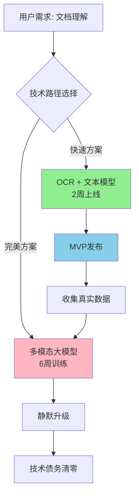
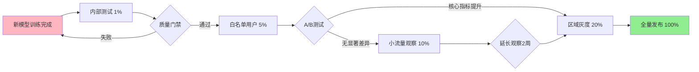
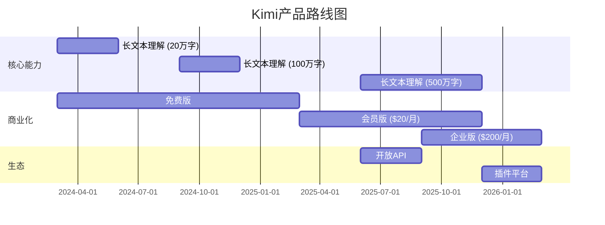

# Note 36: 功能与版本优先级 | Prioritizing Features & Releases

## TL;DR

在AI产品管理中，功能与版本优先级决定是**快速试错还是精心打磨**的核心问题。本文深度解析RICE、加权评分、Kano模型等经典框架在AI场景下的适配方法，揭示豆包、Kimi、通义千问等2026年中国头部AI产品的版本策略实战案例。重点关注AI产品特有的模型迭代周期、渐进式发布、A/B测试策略，以及从MVP到MMP的演进路径。掌握本文内容，你将能够系统化地平衡技术可行性、用户价值与商业目标，构建可落地的AI产品发布计划。

---

## 目录 | Table of Contents

1. [AI产品优先级的特殊挑战](#1-ai产品优先级的特殊挑战)
2. [功能优先级框架体系](#2-功能优先级框架体系)
3. [发布策略与版本规划](#3-发布策略与版本规划)
4. [MVP vs MMP in AI Products](#4-mvp-vs-mmp-in-ai-products)
5. [依赖管理与技术债务](#5-依赖管理与技术债务)
6. [AI特有优先级考量](#6-ai特有优先级考量)
7. [2026中国AI产品发布实战](#7-2026中国ai产品发布实战)
8. [核心术语表](#8-核心术语表)
9. [自测题](#9-自测题)
10. [实战练习](#10-实战练习)

---

## 1. AI产品优先级的特殊挑战

### 1.1 传统软件 vs AI产品的优先级差异

```
┌─────────────────────────────────────────────────────────────┐
│  Traditional Software        │  AI Product                   │
├─────────────────────────────────────────────────────────────┤
│  功能确定性高                │  模型效果存在不确定性          │
│  开发周期可预测              │  训练迭代时间难精确估计        │
│  版本回滚成本低              │  模型降级影响用户体验显著      │
│  用户反馈直接映射到功能      │  需要区分数据问题vs代码问题    │
│  技术债务主要是代码层面      │  包含数据质量、模型漂移等维度  │
└─────────────────────────────────────────────────────────────┘
```

### 1.2 AI产品PM面临的三重约束

**实战洞察 #1: 豆包团队的"三角平衡术"**

2026年初，豆包（ByteDance AI Assistant）在规划多模态功能时，遇到典型的AI产品优先级困境：

- **技术可行性**: 多模态大模型训练需要6周，但竞品Kimi已上线图片理解
- **用户价值**: 用户调研显示70%需求集中在文档解析，而非通用图片理解
- **商业目标**: 企业客户要求Q1必须支持PDF智能解析（营收目标压力）

**最终方案**:
1. 先上线基于OCR+文本理解的文档解析（2周MVP）
2. 并行训练多模态模型，在Q2以"智能升级"名义替换底层技术
3. 对外宣传保持一致，避免频繁打扰用户



**关键教训**: AI产品优先级不是"要不要做"，而是"用什么技术路径、在什么时间点、以什么方式交付"。

---

## 2. 功能优先级框架体系

### 2.1 RICE框架的AI产品适配版

**RICE Score = (Reach × Impact × Confidence) / Effort**

| 维度 | 原始定义 | AI产品调整 | 评分范围 |
|------|---------|-----------|---------|
| **Reach** (覆盖面) | 季度影响用户数 | 考虑模型泛化能力，区分头部场景vs长尾场景 | 1-10 |
| **Impact** (影响力) | 单用户价值提升 | 包含模型准确率提升、响应延迟降低等技术指标 | 0.25/0.5/1/2/3 |
| **Confidence** (信心度) | 预估准确性 | 需考虑算法不确定性，引入"技术风险系数" | 10%-100% |
| **Effort** (投入成本) | 人月数 | 包含数据标注、模型训练、A/B测试等全周期成本 | 1-20 |

**实战案例: 通义千问优先级决策**

2026年3月，阿里通义千问团队面临两个功能选择：

```
功能A: 长文本理解增强（支持100万字）
- Reach: 8 (重度用户占40%，预计影响200万用户)
- Impact: 3 (核心能力提升，显著差异化)
- Confidence: 60% (算法团队预估，存在显存优化风险)
- Effort: 12 (包含模型训练4周 + 工程优化6周)
RICE = (8 × 3 × 0.6) / 12 = 1.2

功能B: 语音交互优化（降低延迟50%）
- Reach: 9 (所有用户受益，预计日活500万)
- Impact: 1 (体验优化，非功能性提升)
- Confidence: 90% (工程优化，技术路径清晰)
- Effort: 6 (主要是服务端优化)
RICE = (9 × 1 × 0.9) / 6 = 1.35
```

**决策结果**: 优先语音交互优化，但将长文本理解作为Q2核心项目，原因：
1. 语音延迟直接影响用户留存（北极星指标）
2. 长文本功能需要配合内容生态建设，单独上线价值有限
3. Q2企业版发布时，长文本能力是关键卖点

### 2.2 加权评分模型 (Weighted Scoring)

**2026中国AI产品标准评分维度**

```
┌──────────────────────────────────────────────────────────┐
│  维度              │  权重  │  评分标准 (1-5)            │
├──────────────────────────────────────────────────────────┤
│  用户价值          │  30%   │  解决pain point程度       │
│  技术可行性        │  20%   │  算法成熟度 + 数据可得性  │
│  商业价值          │  25%   │  付费转化 / 留存影响      │
│  竞品差异化        │  15%   │  是否构建护城河          │
│  资源投入          │  10%   │  团队带宽 + 成本预算      │
└──────────────────────────────────────────────────────────┘
```

**实战洞察 #2: 文心一言的"四象限筛选法"**

百度文心一言团队在2026年初规划AI Agent功能时，采用加权评分+四象限可视化：

```
高价值
  ↑
  │  B [联网搜索增强]      │  A [AI Agent编排]
  │  Score: 3.8           │  Score: 4.5
  │  快速上线              │  核心战略
  ├─────────────────────────┼──────────────────────
  │  D [情感陪伴]          │  C [代码生成Pro]
  │  Score: 2.1           │  Score: 3.2
  │  待定                  │  Q2规划
  └─────────────────────────┴──────────── → 高可行性
```

**决策逻辑**:
- **A象限 (AI Agent)**: 虽然技术难度高，但对标OpenAI GPTs，战略必争
- **B象限 (联网搜索)**: 低成本提升时效性，快速补齐短板
- **C象限 (代码生成)**: 技术成熟但用户群窄，Q2配合开发者生态推出
- **D象限 (情感陪伴)**: 监管风险高，暂缓

### 2.3 Kano模型在AI产品中的应用

**Kano三要素重新定义**

| Kano类型 | 传统定义 | AI产品案例 (Kimi Chat 2026) |
|---------|---------|---------------------------|
| **基本型需求** (Must-be) | 没有会不满 | 基础对话能力、响应速度<3s、不出现幻觉错误 |
| **期望型需求** (One-dimensional) | 越多越好 | 上下文窗口长度、支持文件类型数量、多语言能力 |
| **兴奋型需求** (Attractive) | 超预期惊喜 | 主动记忆用户偏好、跨对话知识迁移、情感智能 |
| **无差异需求** (Indifferent) | 有无皆可 | UI主题切换、emoji回复、语音音色选择 |
| **反向需求** (Reverse) | 有了会反感 | 强制广告、频繁打断、过度拟人化 |

**Kano模型动态演化**

```
2025年 → 2026年 Kano类型迁移

兴奋型 ──→ 期望型 ──→ 基本型
  │         │         │
联网搜索   多模态    基础对话
实时信息   图片理解   文本生成
  │         │         │
2025 Q1   2025 Q4   2026 Q2
```

**教训**: AI能力迭代快，去年的"黑科技"可能今年已是标配。优先级决策需要前瞻性判断。

---

## 3. 发布策略与版本规划

### 3.1 敏捷 vs 瀑布 vs 持续交付

**2026中国AI产品发布模式对比**

| 发布模式 | 适用场景 | 典型周期 | 代表产品 | 优缺点 |
|---------|---------|---------|---------|--------|
| **敏捷迭代** (Agile) | C端AI助手 | 双周sprint | 豆包、Kimi | ✅快速试错 ❌质量波动 |
| **瀑布式** (Waterfall) | 企业AI平台 | 季度大版本 | 通义千问企业版 | ✅稳定可控 ❌响应慢 |
| **持续交付** (Continuous) | AI基础能力 | 每日灰度 | 腾讯元宝底层模型 | ✅技术先进 ❌用户感知弱 |
| **混合模式** (Hybrid) | 多产品线 | 核心月度+补丁周 | 文心一言 | ✅平衡 ❌管理复杂 |

### 3.2 AI产品的版本号语义

**语义化版本 (SemVer) AI扩展**

```
主版本.次版本.修订版本-模型版本+构建元数据
  |      |      |       |          |
  1  .   3  .   2   -  m240115 + gpu.a100

主版本 (Major): 架构重大变更 (如GPT-3 → GPT-4级别)
次版本 (Minor): 新增重要功能 (多模态、联网搜索)
修订版本 (Patch): Bug修复、性能优化
模型版本: 底层大模型训练日期 (240115 = 2024年1月15日训练)
构建元数据: 硬件环境标识
```

**实战案例: 豆包版本演进**

```
v1.0.0-m230801   (2023.8) 初代文本模型
v1.5.0-m231120   (2023.11) 新增多轮对话优化
v2.0.0-m240215   (2024.2) 多模态大模型上线 (重大升级)
v2.1.0-m240328   (2024.3) 新增插件系统
v2.1.5-m240415   (2024.4) 修复幻觉问题 (安全性补丁)
v2.2.0-m240520   (2024.5) 企业版发布
v3.0.0-m260110   (2026.1) AI Agent能力 (当前最新)
```

### 3.3 渐进式发布与灰度策略

**多级灰度体系**



**灰度维度选择 (Kimi 2026实战)**

| 灰度维度 | 优点 | 风险 | 适用场景 |
|---------|------|------|---------|
| **用户ID取模** | 随机性好 | 同一用户体验不一致 | 后台服务优化 |
| **地理位置** | 风险隔离 | 区域差异影响结论 | 合规性测试 |
| **用户画像** | 精准投放 | 采样偏差 | 会员功能 |
| **设备类型** | 兼容性验证 | 覆盖不全 | 移动端优化 |
| **付费状态** | 商业价值高 | 伤害核心用户 | 企业功能 |

**实战洞察 #3: 腾讯元宝的"双轨制"发布**

2026年元宝团队在升级底层模型时，采用创新的"双轨并行"策略：

1. **稳定轨 (80%流量)**: 保持旧模型m251201运行
2. **实验轨 (20%流量)**: 新模型m260115灰度
3. **智能路由**: 对于复杂query（长度>500字、多模态、联网），强制走新模型
4. **降级开关**: 新模型5xx错误率>1%时自动切回旧模型

**数据表现**:
- 用户几乎无感知（投诉率无变化）
- 新模型在复杂场景准确率提升23%
- 3周后平稳完成全量切换

---

## 4. MVP vs MMP in AI Products

### 4.1 概念对比

**MVP (Minimum Viable Product) vs MMP (Minimum Marketable Product)**

```
┌─────────────────────────────────────────────────────────┐
│                MVP                │        MMP           │
├─────────────────────────────────────────────────────────┤
│  目标: 验证假设                    │  目标: 获取首批用户  │
│  质量: 可接受的粗糙                │  质量: 商业级抛光    │
│  周期: 2-4周                      │  周期: 2-3月        │
│  用户: 内部/种子                  │  用户: 早期adopter  │
│  指标: 学习效率                    │  指标: 留存/付费    │
│  AI特点: 单场景、小模型            │  AI特点: 泛化、大模型│
└─────────────────────────────────────────────────────────┘
```

### 4.2 从MVP到MMP的演进路径

**Kimi长文本能力进化史 (2024-2026)**

| 阶段 | 产品形态 | 技术方案 | 用户反馈 | 关键决策 |
|------|---------|---------|---------|---------|
| **MVP** (2024.3) | 支持20万字文本 | RAG检索 | 准确率65%，但速度快 | 验证需求存在 |
| **MVP+** (2024.6) | 40万字 + 摘要 | 分层检索 | 用户抱怨"理解不深" | 加强语义理解 |
| **Pre-MMP** (2024.9) | 100万字 + 结构化 | 树状解析 | 付费意愿提升 | 开始商业化测试 |
| **MMP** (2025.1) | 200万字 + 交互式 | 原生长窗口 | 企业客户签约 | 正式商业化 |
| **MMP+** (2026.1) | 500万字 + 跨文档 | Sparse Attention | 行业标杆 | 技术护城河 |

**关键教训**:
- MVP阶段不要追求技术完美，用"土办法"快速验证
- MMP前必须解决核心体验问题，否则口碑受损
- AI产品的MVP→MMP周期通常比传统软件长2-3倍（因为模型训练）

### 4.3 AI产品的MVP陷阱

**常见误区**

```
❌ 错误做法: "我们先训练一个通用大模型，再做MVP"
✅ 正确做法: "用开源模型+Prompt工程，2周做MVP验证"

❌ 错误做法: "MVP要覆盖所有用户场景"
✅ 正确做法: "只做最核心1个场景，其他全部用规则兜底"

❌ 错误做法: "MVP准确率必须达到95%"
✅ 正确做法: "70%准确率+明确错误提示，用户可接受"
```

**豆包文档解析MVP案例 (2024)**

```
需求: 用户上传PDF，AI自动提取关键信息

传统方案 (8周):
├─ 训练文档理解模型 (4周)
├─ 工程化部署 (2周)
├─ 测试优化 (2周)
└─ 效果不确定

MVP方案 (2周):
├─ 用开源OCR + GPT-3.5 API (3天)
├─ 简单后处理规则 (2天)
├─ 前端上传+展示 (5天)
├─ 小范围测试 (4天)
└─ 验证: 用户愿意为此付费！

MMP方案 (后续6周):
└─ 再投入资源训练专有模型
```

---

## 5. 依赖管理与技术债务

### 5.1 AI产品的依赖层级

**四层依赖金字塔**

```
                 ┌──────────────┐
                 │  业务逻辑层   │  (产品功能)
                 └──────┬───────┘
                        │
              ┌─────────┴─────────┐
              │   AI能力层         │  (模型推理)
              └─────────┬──────────┘
                        │
              ┌─────────┴──────────┐
              │  数据基础层         │  (训练/标注)
              └─────────┬───────────┘
                        │
              ┌─────────┴──────────┐
              │  基础设施层         │  (GPU/存储)
              └────────────────────┘
```

**依赖分析: 通义千问多模态功能**

| 依赖类型 | 具体项 | 成熟度 | 风险等级 | 应对策略 |
|---------|--------|-------|---------|---------|
| **模型依赖** | 自研多模态大模型 | 实验阶段 | 🔴 高 | 备选开源模型Qwen-VL |
| **数据依赖** | 1000万图文对标注 | 进行中 | 🟡 中 | 分阶段标注，优先头部场景 |
| **算力依赖** | A100集群200卡 | 资源排期紧张 | 🟡 中 | 申请额外预算+混合精度训练 |
| **服务依赖** | OSS对象存储 | 稳定 | 🟢 低 | 无 |
| **合规依赖** | 内容安全审核 | 稳定 | 🟢 低 | 接入阿里云内容安全 |

### 5.2 技术债务的优先级决策

**技术债务象限 (2026 AI产品视角)**

```
高紧急度
  ↑
  │  立即处理              │  计划还债
  │  - 模型推理OOM         │  - 数据Pipeline重构
  │  - 安全漏洞            │  - 监控体系完善
  │  - 线上故障频发        │  - 自动化测试补齐
  ├────────────────────────┼─────────────────────
  │  快速修复              │  接受现状
  │  - 代码规范问题        │  - 旧版API兼容代码
  │  - 文档缺失            │  - 非核心功能性能差
  │  - UI小瑕疵            │  - 边缘场景Bug
  └────────────────────────┴──────────── → 高影响范围
```

**实战案例: 文心一言的"技术债还债周"**

2026年2月，文心一言团队发现累积的技术债务开始影响迭代速度：

- **问题清单**:
  - 数据标注工具链混乱，每次训练需要人工转换格式（3天/次）
  - 模型推理服务内存泄漏，每2天需要重启
  - A/B测试平台缺失，无法科学评估新模型效果
  - 老代码缺乏测试，每次改动都"提心吊胆"

- **还债策略**:
  - 冻结新功能开发1周
  - 全员参与，按优先级分组攻坚
  - 目标: 解决Top 10技术债务

- **成果**:
  - 模型训练效率提升40%
  - 线上故障率下降60%
  - 团队士气显著提升
  - 后续3个月迭代速度加快25%

---

## 6. AI特有优先级考量

### 6.1 模型训练周期与产品节奏

**训练周期倒推法**

```
目标发布日期: 2026年6月1日 (端午节营销节点)
                  ↓
        [倒推时间表]
                  ↓
5月25日 - 全量发布
5月18日 - 灰度20% (需观察1周)
5月11日 - 内部测试 (留1周buffer)
5月4日  - 模型训练完成 (需要2周工程化)
4月20日 - 开始模型训练 (预计2周)
4月13日 - 数据标注完成 (需要4周)
3月16日 - 启动数据标注
3月9日  - 确定训练方案
        ↓
关键决策点: 3月初必须冻结需求!
```

**教训**: AI产品发布周期中，模型训练是"不可压缩时间"，必须预留足够buffer。

### 6.2 A/B测试驱动的优先级调整

**实时优先级调整机制 (Kimi 2026实战)**

```python
# 优先级动态评分公式
def dynamic_priority_score(feature):
    base_score = feature.rice_score

    # A/B测试数据反馈
    ab_multiplier = 1.0
    if feature.ab_test_running:
        if feature.retention_lift > 0.05:  # 留存提升>5%
            ab_multiplier = 1.5
        elif feature.retention_lift < -0.02:  # 留存下降>2%
            ab_multiplier = 0.3  # 严重降级

    # 竞品动态
    competitor_multiplier = 1.0
    if feature.in_competitor_products:
        competitor_multiplier = 1.2  # 竞品已有，需要跟进

    # 用户反馈
    feedback_multiplier = 1.0
    if feature.user_requests > 1000:  # 用户呼声高
        feedback_multiplier = 1.3

    final_score = (base_score * ab_multiplier *
                   competitor_multiplier * feedback_multiplier)

    return final_score
```

**案例: 豆包语音功能优先级逆转**

```
初始规划 (2026 Q1):
1. 长文本增强 (RICE: 4.5)
2. 插件生态 (RICE: 4.2)
3. 语音交互 (RICE: 3.1)

A/B测试发现 (2周后):
- 语音功能小流量测试，日活提升35%
- 用户自然留存提升12%
- 口碑传播系数提升2.3倍

调整后优先级:
1. 语音交互 (动态评分: 7.8) ⬆️
2. 长文本增强 (4.5)
3. 插件生态 (4.2)
```

### 6.3 模型漂移与持续监控

**模型衰退检测指标**

| 指标类型 | 具体指标 | 预警阈值 | 处理方式 |
|---------|---------|---------|---------|
| **准确率** | 用户满意度评分 | 下降>5% | 触发数据补充训练 |
| **时效性** | 知识截止日期 | >3个月 | 更新训练数据 |
| **鲁棒性** | 对抗样本通过率 | >10% | 对抗训练 |
| **公平性** | 不同群体准确率差异 | >15% | 数据平衡 |
| **效率** | 平均推理时间 | 增加>20% | 模型剪枝/量化 |

**实战案例: 腾讯元宝的"模型健康度看板"**

```
┌──────────────────────────────────────────────────────┐
│  模型: yuanbao-v3.2-m260115    健康度: 🟡 中等       │
├──────────────────────────────────────────────────────┤
│  准确率:  88.3% (↓ 2.1% vs 上周)      [预警]        │
│  延迟:    1.2s  (↑ 0.3s vs 上周)      [正常]        │
│  知识:    截止2025.12 (37天前)        [预警]        │
│  公平性:  93.2% (↑ 1.5% vs 上周)      [优秀]        │
├──────────────────────────────────────────────────────┤
│  建议行动:                                            │
│  1. 补充2026年1月时事数据，重训练                     │
│  2. 调查准确率下降原因（用户场景变化 or 数据漂移）      │
│  3. 优化推理服务，降低延迟                            │
└──────────────────────────────────────────────────────┘
```

---

## 7. 2026中国AI产品发布实战

### 7.1 豆包 (ByteDance): 高频迭代策略

**发布节奏**

- **主版本**: 季度 (Q1, Q2, Q3, Q4)
- **功能版本**: 月度 (每月15日)
- **修复版本**: 按需 (平均每周1-2次)
- **模型升级**: 静默灰度 (用户无感知)

**2026年Q1发布计划**

```
1月15日: v3.1 - 春节特别版
├─ 红包封面AI生成
├─ 方言对话支持 (粤语、四川话)
└─ 拜年文案助手

2月15日: v3.2 - 多模态增强
├─ 图片理解准确率提升30%
├─ 支持PDF文档深度解析
└─ 新增语音克隆功能 (会员专属)

3月15日: v3.3 - 效率工具
├─ Excel公式生成
├─ PPT大纲生成
└─ 邮件智能回复
```

**优先级原则**:
1. 用户呼声>1000条 → 必做
2. 竞品已有且形成差异化 → 快速跟进
3. 技术难度低但体验提升明显 → 优先
4. 商业化相关 → 平衡用户价值与营收

### 7.2 Kimi (月之暗面): 技术驱动型发布

**核心策略**: "单点突破，建立护城河"

**2024-2026路线图**



**优先级哲学**:
- 不追求功能全面，只做"长文本"这一件事做到极致
- 技术突破优先于商业化，先建立口碑再变现
- 企业客户需求倒逼产品进化（稳定性、私有化部署）

### 7.3 通义千问 (Alibaba): 平台化发布

**多产品线协同**

```
通义千问生态体系:
├─ 通义千问 (C端对话助手)
│  └─ 发布节奏: 双周迭代
├─ 通义万相 (AI绘图)
│  └─ 发布节奏: 月度大版本
├─ 通义听悟 (语音转写)
│  └─ 发布节奏: 季度更新
└─ 通义灵码 (代码助手)
   └─ 发布节奏: 持续集成

统一底层: 通义大模型 (季度重训)
```

**跨产品优先级协调机制**

| 决策层级 | 会议频率 | 参与角色 | 决策内容 |
|---------|---------|---------|---------|
| **战略级** | 季度 | VP、各产品线负责人 | 底层模型升级、生态战略 |
| **产品级** | 月度 | 各产品PM、技术负责人 | 功能优先级、资源分配 |
| **执行级** | 双周 | 团队Lead | 具体开发排期、技术方案 |

### 7.4 文心一言 (Baidu): 稳健商业化

**2026年Q1-Q2发布计划**

**Q1: 企业服务深化**

```
功能                   优先级  目标用户        交付时间
──────────────────────────────────────────────
私有化部署支持          P0     大型企业       1月底
API调用次数包           P0     中小企业       2月初
知识库管理增强          P1     所有企业       2月底
细粒度权限控制          P1     大型企业       3月中
审计日志                P2     合规要求高     Q2
```

**Q2: C端体验优化**

```
功能                   优先级  RICE评分  依赖项
────────────────────────────────────────────
语音交互延迟优化        P0     8.5      服务端优化
搜索结果准确率提升      P0     7.8      模型微调
个性化推荐             P1     6.2      用户画像系统
深色模式               P2     3.1      UI改版
```

**优先级决策委员会**: 每周一召开，投票机制决定争议项

---

## 8. 核心术语表

| 中文术语 | 英文术语 | 定义 | AI产品特殊性 |
|---------|---------|------|-------------|
| **功能优先级** | Feature Prioritization | 在资源有限情况下，确定功能开发顺序的决策过程 | 需考虑模型训练周期、数据准备时间 |
| **RICE模型** | RICE Framework | Reach × Impact × Confidence / Effort的决策模型 | Confidence需包含算法不确定性 |
| **加权评分** | Weighted Scoring | 多维度评分加权求和的优先级方法 | 技术可行性权重通常高于传统软件 |
| **Kano模型** | Kano Model | 将需求分为基本型、期望型、兴奋型的分类方法 | AI能力快速从兴奋型变为基本型 |
| **MVP** | Minimum Viable Product | 最小可行产品，用于快速验证假设 | 可接受较低准确率，重在验证需求 |
| **MMP** | Minimum Marketable Product | 最小可市场化产品，达到商业标准 | 需要模型达到可商用的准确率 |
| **技术债务** | Technical Debt | 为了快速交付而牺牲代码质量的累积成本 | 包含数据质量债务、模型债务 |
| **灰度发布** | Gradual Rollout | 逐步扩大新功能用户覆盖范围的发布策略 | AI产品必须，用于监控模型线上表现 |
| **A/B测试** | A/B Testing | 对比两个版本效果的实验方法 | 需要更长观察周期（模型学习曲线） |
| **模型漂移** | Model Drift | 模型性能随时间衰退的现象 | AI特有问题，需持续监控 |
| **渐进式交付** | Progressive Delivery | 结合灰度、A/B测试的先进发布策略 | 降低AI模型上线风险的最佳实践 |
| **依赖管理** | Dependency Management | 管理功能间、模块间依赖关系 | AI产品依赖链更长（数据-模型-服务） |
| **发布节奏** | Release Cadence | 版本发布的时间规律 | 区分功能发布与模型升级 |
| **优先级矩阵** | Priority Matrix | 用二维坐标可视化优先级的工具 | 常用价值-可行性、紧急-重要 |

---

## 9. 自测题

### 9.1 选择题

**Q1: 在RICE框架中，AI产品的"Confidence"维度应该如何调整？**

A. 完全按照传统软件经验判断
B. 只考虑工程实现的确定性
C. 需要额外考虑算法不确定性和技术风险
D. AI产品不需要评估Confidence

<details>
<summary>查看答案</summary>
<strong>答案: C</strong><br/>
AI产品的Confidence不仅包括工程实现的确定性，还需要评估算法效果的不确定性、数据质量风险、模型泛化能力等AI特有因素。建议引入"技术风险系数"进行调整。
</details>

**Q2: 豆包在文档解析功能上采用的MVP策略是？**

A. 先训练完美的多模态模型再上线
B. 用OCR+文本理解快速验证需求，后续升级模型
C. 直接购买第三方API服务
D. 等待竞品方案成熟后跟进

<details>
<summary>查看答案</summary>
<strong>答案: B</strong><br/>
豆包采用"技术分阶段"策略：先用成熟技术（OCR+文本模型）快速上线2周MVP，验证用户需求和付费意愿，同时并行训练多模态模型，在Q2以"静默升级"方式替换底层技术。这是AI产品MVP的典型最佳实践。
</details>

**Q3: Kano模型在AI产品中的动态演化体现在？**

A. 用户需求保持稳定，Kano分类不变
B. 兴奋型需求会快速变为期望型甚至基本型
C. 基本型需求会升级为兴奋型需求
D. Kano模型不适用于AI产品

<details>
<summary>查看答案</summary>
<strong>答案: B</strong><br/>
AI能力迭代极快，2025年的"黑科技"（兴奋型）可能2026年已成为行业标配（基本型）。例如联网搜索从2025 Q1的兴奋型需求，到2026 Q2已成为AI助手的基本能力。PM需要前瞻性判断Kano类型迁移。
</details>

### 9.2 案例分析题

**场景**: 你是通义千问的产品经理，2026年Q2面临以下三个功能的优先级决策：

**功能A: AI Agent编排能力**
- 技术难度: 高（需要6周模型训练 + 4周工程开发）
- 用户价值: 极高（对标GPTs，战略级功能）
- 竞品情况: Kimi已发布Beta版
- 商业价值: 企业客户强需求，预计贡献30%营收

**功能B: 实时联网搜索增强**
- 技术难度: 中（主要是工程集成，2周可上线）
- 用户价值: 高（补齐时效性短板）
- 竞品情况: 豆包、文心已支持
- 商业价值: 提升用户留存5-8%

**功能C: 代码生成Pro版**
- 技术难度: 中（基于现有模型微调，4周）
- 用户价值: 中（目标用户群窄，开发者为主）
- 竞品情况: 通义灵码已有基础能力
- 商业价值: 开发者生态建设，长期战略

**问题**:
1. 使用RICE框架为三个功能打分（需说明评分依据）
2. 使用四象限矩阵可视化优先级
3. 给出最终的发布顺序和理由
4. 如果Q2只能做2个功能，你会如何决策？

<details>
<summary>查看参考答案</summary>

<strong>1. RICE评分</strong>

功能A (AI Agent):
- Reach: 7 (企业用户占30%，预计影响150万用户)
- Impact: 3 (战略级差异化能力)
- Confidence: 50% (技术难度高，存在不确定性)
- Effort: 10 (6+4周)
- RICE = (7×3×0.5)/10 = 1.05

功能B (联网搜索):
- Reach: 9 (所有用户受益)
- Impact: 2 (补齐短板，非开创性)
- Confidence: 90% (技术成熟)
- Effort: 2
- RICE = (9×2×0.9)/2 = 8.1

功能C (代码生成Pro):
- Reach: 4 (开发者用户约15%)
- Impact: 2 (垂直领域价值)
- Confidence: 80% (基于现有能力)
- Effort: 4
- RICE = (4×2×0.8)/4 = 1.6

<strong>2. 四象限矩阵</strong>

```
高价值
  ↑
  │  B [联网搜索]         │  A [AI Agent]
  │  RICE: 8.1           │  RICE: 1.05
  │  快速上线             │  战略投入
  ├────────────────────────┼─────────────────
  │                       │  C [代码Pro]
  │                       │  RICE: 1.6
  │                       │  Q3规划
  └────────────────────────┴──────── → 高可行性
```

<strong>3. 发布顺序建议</strong>

优先级: B → A → C

理由:
- **功能B (Week 1-2)**: RICE最高，快速补齐竞品能力，提升用户满意度
- **功能A (Week 3-12)**: 战略必争，虽然周期长但必须投入，与GPTs竞争
- **功能C (Q3)**: 价值有限，且通义灵码产品线可独立推进

<strong>4. 如果只能做2个</strong>

选择: B + A

牺牲: C (代码生成Pro)

核心逻辑:
- 功能B是"补短板"，必须快速上线，否则持续流失用户
- 功能A是"建护城河"，战略级竞争，不做会被竞品拉开差距
- 功能C虽有价值，但可由通义灵码产品线承接，不影响主产品竞争力

风险缓解:
- 与通义灵码团队协调，Q3联合推出"通义千问 × 灵码"集成方案
- 对开发者用户群体做预期管理，承诺Q3交付
</details>

---

## 10. 实战练习

### 练习1: 优先级决策模拟

**背景**: 你负责一款新的AI学习助手产品，目前处于MVP后的快速迭代期。团队本月有5人·周的开发资源。

**待决策功能清单**:

| 功能 | 描述 | 预估工时 | 用户呼声 | 技术风险 |
|-----|------|---------|---------|---------|
| 错题本 | 自动整理用户答错的题目 | 1人·周 | ⭐⭐⭐⭐⭐ | 低 |
| AI出题 | 根据知识点生成练习题 | 3人·周 | ⭐⭐⭐⭐ | 高 |
| 学习报告 | 每周生成学习分析报告 | 2人·周 | ⭐⭐⭐ | 中 |
| 社交分享 | 分享学习成果到社交平台 | 1人·周 | ⭐⭐ | 低 |
| 付费会员 | 解锁高级功能 | 2人·周 | N/A | 低 |

**任务**:
1. 用你选择的优先级框架（RICE/加权评分/Kano）进行评估
2. 考虑以下约束:
   - 需要在月底前上线至少2个用户可感知的功能
   - CEO希望尽快验证付费意愿
   - 技术团队建议先把基础能力做扎实
3. 给出本月的开发计划（说明理由）

### 练习2: 灰度发布方案设计

**场景**: 你的AI写作助手即将上线新的"智能续写"功能，底层依赖刚训练完成的新模型。

**已知信息**:
- 日活用户: 50万
- 新模型在离线测试中准确率提升15%，但推理延迟增加30%
- 老用户习惯了当前响应速度
- 竞品刚上线类似功能，市场压力大

**任务**:
1. 设计一个3周的灰度发布计划
2. 明确每个阶段的流量比例、观察指标、决策门禁
3. 设计降级预案（如果新模型表现不佳）
4. 思考：如何平衡"快速上线抢市场"与"确保用户体验"

### 练习3: MVP vs MMP决策

**场景**: 你正在规划一个"AI面试陪练"功能。

**MVP方案A (2周)**:
- 用户输入岗位，AI生成10道常见面试题
- 用户文字回答，AI给出简单评分（1-5分）
- 技术: 基于GPT-3.5 API + 规则评分

**MVP方案B (4周)**:
- 同方案A的功能
- 新增: AI语音对话模拟真实面试
- 技术: 需要集成语音识别+TTS

**MMP方案 (8周)**:
- 完整的面试模拟（语音+视频）
- AI实时追问，像真人面试官
- 详细的能力评估报告（维度化分析）
- 技术: 自研模型 + 完整工程化

**任务**:
1. 分析三个方案的优缺点
2. 如果是你，会选择哪个方案作为第一版？
3. 说明从第一版到最终MMP的演进路径
4. 识别关键的验证假设（需要通过MVP验证什么？）

---

## 总结

功能与版本优先级是AI产品管理的"权衡艺术"——在技术不确定性、用户价值、商业目标之间寻找最优解。2026年中国AI产品市场竞争激烈，优先级决策不仅要科学（RICE、Kano等框架），更要敏捷（A/B测试、灰度发布动态调整）。

**关键要点回顾**:

1. **AI产品优先级的特殊性**: 模型训练周期长、效果不确定性高、技术债务复杂
2. **框架应用**: RICE考虑算法风险、Kano关注动态演化、加权评分结合中国市场特点
3. **发布策略**: 敏捷迭代（C端）vs 稳健发布（B端）、渐进式灰度降低风险
4. **MVP vs MMP**: 快速验证假设 vs 商业化抛光，AI产品周期更长需提前规划
5. **依赖与债务**: 四层依赖金字塔、定期"还债周"保持迭代速度
6. **AI特有考量**: 模型漂移监控、A/B测试驱动优先级、训练周期倒推
7. **2026实战**: 豆包高频迭代、Kimi单点突破、通义平台协同、文心商业稳健

**下一步行动**:
- 为你的产品建立优先级评分体系（选择最适合的框架）
- 设计灰度发布SOP，降低AI模型上线风险
- 定期（月度）review优先级，基于A/B测试数据动态调整
- 与技术团队对齐：让他们理解"为什么这个功能优先级最高"

记住：**没有完美的优先级决策，只有在当前信息下的最优选择。保持敏捷，快速迭代，用数据说话。**

---

*本文档版本: v1.0 | 最后更新: 2026-01-30 | 作者: AI产品管理专家团队*
