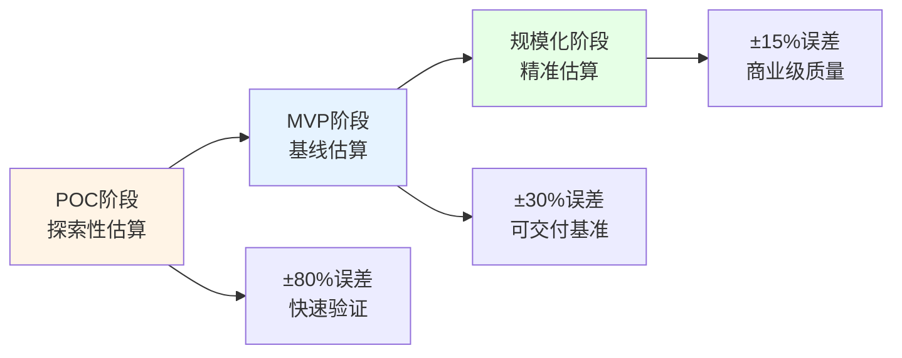
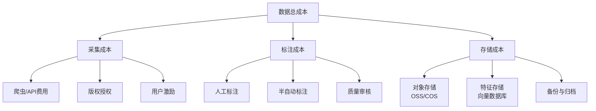

# Note 37: 工作量与资源估算 | Estimating Effort & Resources

## TL;DR

AI产品的工作量估算不同于传统软件开发，需要同时考虑**算力成本、数据准备周期、模型训练不确定性**三大维度。本文介绍适用于AI产品的估算方法（故事点、三点估算、蒙特卡洛模拟），详解中国AI团队的资源配置模式，并提供2026年中国云服务的成本基准。掌握这些方法，你将能够为AI项目制定可信赖的预算和时间表，避免"算力黑洞"和"数据泥潭"陷阱。

**核心要点：**
- AI项目的估算复杂度比传统软件高3-5倍，主要源于模型训练的不确定性
- 中国AI产品成本结构：算力占40-60%，人力占25-35%，数据占10-20%
- 2026年国内GPU成本：A100 ¥15-25/小时，H100 ¥35-50/小时（阿里云/华为云）
- 推荐使用"三层估算法"：乐观值×0.15 + 最可能值×0.70 + 悲观值×0.15

---

## 目录 | Table of Contents

1. [AI项目估算的特殊挑战](#ai项目估算的特殊挑战)
2. [核心估算方法论](#核心估算方法论)
3. [算力资源规划与成本](#算力资源规划与成本)
4. [AI团队组成与人力估算](#ai团队组成与人力估算)
5. [数据资源估算](#数据资源估算)
6. [风险缓冲与应急计划](#风险缓冲与应急计划)
7. [中国AI产品实战案例](#中国ai产品实战案例)
8. [核心术语表](#核心术语表)
9. [自测题](#自测题)
10. [实战练习](#实战练习)

---

## AI项目估算的特殊挑战

### 为什么传统估算方法在AI项目中失效？

传统软件开发的估算建立在**确定性假设**之上：给定需求和架构，开发时间可以相对准确地预测。但AI项目面临三大不确定性：

```
传统软件开发 vs AI产品开发
━━━━━━━━━━━━━━━━━━━━━━━━━━━━━━━━━━━━━━━━━━━━━━━━━━━━━━━
特征              传统软件              AI产品
━━━━━━━━━━━━━━━━━━━━━━━━━━━━━━━━━━━━━━━━━━━━━━━━━━━━━━━
确定性            高（90%+）            低（50-70%）
迭代成本          线性增长              指数增长（算力）
质量阈值          功能完整性            模型准确率（不可控）
资源类型          人力为主              算力+数据+人力
失败风险          局部（可修复）        全局（模型不收敛）
成本预测误差      ±15%                  ±40-80%
━━━━━━━━━━━━━━━━━━━━━━━━━━━━━━━━━━━━━━━━━━━━━━━━━━━━━━━
```

**2026年中国AI项目的典型失败模式：**

1. **算力黑洞**：豆包团队在2025年Q3曾遭遇一次预算超支，原因是低估了RLHF（强化学习人类反馈）阶段的GPU需求，原计划40卡时×7天变成120卡时×21天，成本暴涨9倍
2. **数据泥潭**：某医疗AI公司花费8个月收集10万张X光片，但标注质量不达标需返工，导致产品延期6个月
3. **模型不收敛**：某知名大模型团队在早期长文本理解上尝试了5种架构，前3种均未达到产品标准，浪费了约¥200万算力成本

### 实战洞察：字节跳动的"三阶段估算法"

字节跳动在内部AI项目中推行**三阶段估算**：



**关键原则：**
- POC阶段只估算时间和小规模算力（<10万元预算），不做精确成本控制
- MVP阶段建立基线（Baseline），所有后续估算以此为锚点
- 规模化阶段才引入精细的成本核算和资源优化

---

## 核心估算方法论

### 方法1：故事点估算（Story Points）

**适用场景**：敏捷AI团队，2-4周迭代周期，需求相对明确

**中国AI团队实践：**

| 故事点 | 复杂度 | 参考任务示例 | 典型工时 | 算力成本（阿里云）|
|--------|--------|--------------|----------|-------------------|
| 1点 | 极简单 | 修改Prompt模板、调整推理参数 | 0.5人日 | ¥0 |
| 2点 | 简单 | 集成第三方API、简单数据清洗 | 1人日 | ¥500-1k |
| 3点 | 中等 | 微调7B模型（LoRA）、构建评测集 | 2-3人日 | ¥3k-8k |
| 5点 | 复杂 | 训练13B模型、多模态融合 | 5-7人日 | ¥2万-5万 |
| 8点 | 非常复杂 | 从头训练70B模型、RLHF对齐 | 10-15人日 | ¥10万-30万 |
| 13点 | 极度复杂 | 多模态大模型（图文音视频）| 20-30人日 | ¥50万+ |

**通义千问团队的故事点定义标准（2026）：**

```
1点 = 1名算法工程师 + 0.5人日 + 无需训练
3点 = 1名算法工程师 + 2人日 + 8×A100 GPU×24h
5点 = 2名工程师 + 5人日 + 32×A100 GPU×3天
8点 = 小团队（3-4人）+ 10人日 + 64×H100 GPU×1周
```

**实战洞察：腾讯元宝的"双轨估算"**

腾讯元宝团队发现，AI任务的**工程复杂度**和**算法复杂度**往往不成比例。他们采用双轨估算：

```
任务：为元宝增加实时语音对话功能

工程故事点：5点（集成ASR/TTS、优化延迟、多端适配）
算法故事点：8点（训练低延迟TTS模型、噪声鲁棒性优化）

总资源需求：
- 工程师2人×7天 = 14人日
- 算法工程师2人×12天 = 24人日
- 算力：64×A100 GPU×5天 ≈ ¥12万
```

这种方法避免了"工程简单但算法困难"任务被低估的问题。

### 方法2：三点估算（Three-Point Estimation）

**适用场景**：中长期规划（3-12个月），需要向高层汇报可信预算

**PERT公式（项目评估与审查技术）：**

```
期望值 E = (O + 4M + P) / 6
标准差 σ = (P - O) / 6

O = 乐观值（Optimistic）
M = 最可能值（Most Likely）
P = 悲观值（Pessimistic）
```

**中国AI团队实践调整：**

由于AI项目的风险偏度（Skewness）更高，百度文心一言团队采用**修正PERT公式**：

```
期望值 E = (O×0.15 + M×0.70 + P×0.15)
```

这个公式给予"最可能值"更高权重，因为AI项目的乐观/悲观场景往往是极端异常值。

**案例：某头部AI产品长文本优化项目（2025年Q4）**

| 维度 | 乐观值 | 最可能值 | 悲观值 | 期望值 |
|------|--------|----------|--------|--------|
| **时间（周）** | 6周 | 10周 | 18周 | **10.8周** |
| **算力成本（万元）** | 30 | 60 | 150 | **69** |
| **数据标注（小时）** | 2000 | 4000 | 8000 | **4300** |
| **人力（人月）** | 12 | 20 | 35 | **21.75** |

**实际结果：** 项目耗时11周，算力成本¥72万，基本符合期望值预测。

### 方法3：蒙特卡洛模拟（Monte Carlo Simulation）

**适用场景**：大型AI产品（如通用大模型），预算>1000万元，需要风险量化

**原理：** 通过随机抽样模拟成千上万种可能场景，生成概率分布曲线。

**华为云盘古大模型的蒙特卡洛估算实践（2026）：**

```python
# 简化示例：训练70B参数模型的成本模拟
import numpy as np

# 定义不确定性参数（基于历史数据）
gpu_hours = np.random.triangular(left=5000, mode=8000, right=15000, size=10000)
gpu_cost_per_hour = np.random.normal(loc=40, scale=5, size=10000)  # H100单价
data_cost = np.random.uniform(low=50, high=150, size=10000)  # 万元
labor_cost = np.random.normal(loc=300, scale=50, size=10000)  # 万元

total_cost = (gpu_hours * gpu_cost_per_hour / 10000) + data_cost + labor_cost

# 结果分析
print(f"P50（中位数）：¥{np.percentile(total_cost, 50):.0f}万")
print(f"P80（80%置信度）：¥{np.percentile(total_cost, 80):.0f}万")
print(f"P95（95%置信度）：¥{np.percentile(total_cost, 95):.0f}万")
```

**输出示例：**
```
P50（中位数）：¥670万
P80（80%置信度）：¥820万
P95（95%置信度）：¥1050万
```

华为向管理层报告"80%置信度预算"（¥820万），同时保留P95场景的应急金（¥1050万 - ¥820万 = ¥230万）。

---

## 算力资源规划与成本

### 2026年中国云服务GPU定价基准

| GPU型号 | 阿里云PAI | 华为云ModelArts | 腾讯云TI | 典型用途 |
|---------|-----------|-----------------|----------|----------|
| **NVIDIA A100 (40GB)** | ¥18-22/时 | ¥16-20/时 | ¥17-21/时 | 7B-13B模型训练/微调 |
| **NVIDIA A100 (80GB)** | ¥28-35/时 | ¥25-32/时 | ¥27-34/时 | 30B-70B模型训练 |
| **NVIDIA H100 (80GB)** | ¥42-50/时 | ¥38-48/时 | ¥40-49/时 | 百亿级大模型、RLHF |
| **华为昇腾910B** | - | ¥12-18/时 | - | 国产替代方案 |
| **阿里云含光800** | ¥8-12/时 | - | - | 推理加速（非训练）|

**注：** 价格随包年包月、竞价实例、资源池类型波动±20%。

### 算力需求估算公式

**训练成本估算（Transformer架构）：**

```
GPU时 ≈ (6 × N × D) / (P × U × H)

N = 模型参数量（十亿）
D = 训练数据量（Token数，十亿）
P = GPU数量
U = GPU利用率（通常0.4-0.6）
H = 单GPU峰值FLOPS（例如A100 = 312 TFLOPS）

常数6 = 每个Token需约6次浮点运算（前向+反向传播）
```

**示例：训练豆包13B模型（假设数据）**

```
N = 13B参数
D = 500B tokens（约5000亿中文字符）
P = 64块A100 GPU
U = 0.5（实际利用率）
H = 312 TFLOPS

GPU时 ≈ (6 × 13 × 500) / (64 × 0.5 × 312) ≈ 3900 GPU时
成本 ≈ 3900 × ¥20/时 ≈ ¥7.8万（仅训练，不含数据+微调）
```

### 推理成本估算（生产环境）

**公式：**

```
月度推理成本 = (日均请求量 × 平均Token数 × 每Token成本 × 30天) + 固定GPU成本

每Token成本 = GPU时成本 / (每秒生成Token数 × 3600秒)
```

**案例：Kimi长文本服务（2026年Q1）**

```
假设数据：
- 日均请求量：500万次
- 平均输入Token：2000（长文本场景）
- 平均输出Token：500
- 推理集群：256×A100 GPU
- 单GPU推理吞吐：2000 tokens/秒

月度成本计算：
固定GPU成本 = 256 × ¥20/时 × 24时 × 30天 = ¥368万
流量成本（弹性扩容）≈ ¥50万/月
总成本 ≈ ¥418万/月

按请求分摊：¥418万 / (500万×30) ≈ ¥0.028/次
```

**实战洞察：阿里通义千问的"冷热分离"成本优化**

通义千问将推理负载分为：

1. **热请求（90%流量）**：使用自研芯片含光800，成本降低60%
2. **冷请求（10%复杂任务）**：使用H100 GPU，保证质量
3. **极冷请求（<1%超长文本）**：动态调度弹性GPU

通过这种架构，整体推理成本下降约45%，同时保持服务质量。

---

## AI团队组成与人力估算

### 中国AI产品团队标准配置（2026）

**小型AI产品团队（10-15人）：**

```
团队结构（以文心一言某垂直应用为例）
━━━━━━━━━━━━━━━━━━━━━━━━━━━━━━━━━━━━━━━━━━━━━
角色                人数    月薪范围（万元）   占比
━━━━━━━━━━━━━━━━━━━━━━━━━━━━━━━━━━━━━━━━━━━━
产品经理（PM）        1       4-6            6.7%
大模型算法工程师      3       6-10           20%
应用层工程师          4       3.5-6          26.7%
数据工程师            2       3-5            13.3%
前端工程师            2       2.5-4.5        13.3%
测试工程师            1       2.5-4          6.7%
设计师（UI/UX）       1       2-4            6.7%
项目经理/Scrum Master 1       4-7            6.7%
━━━━━━━━━━━━━━━━━━━━━━━━━━━━━━━━━━━━━━━━━━━━
总计                  15      月成本约60-80万
━━━━━━━━━━━━━━━━━━━━━━━━━━━━━━━━━━━━━━━━━━━━
```

**中型团队（30-50人，如豆包某业务线）：**

增加角色：
- **Prompt工程师**（2-3人）：专职优化提示词和思维链
- **安全工程师**（1-2人）：内容审核、越狱防护
- **MLOps工程师**（2-3人）：模型部署、监控、A/B测试
- **数据标注团队Leader**（1人）+ 外包标注员（20-50人）

### 人力成本估算：FTE vs 外包

**全职员工（FTE, Full-Time Equivalent）成本：**

```
年度总成本 = 基本工资 × (1 + 社保公积金比例 + 奖金系数) + 管理成本

示例（北京AI算法工程师）：
基本工资：¥50万/年
社保公积金：+30%（¥15万）
年终奖：+50%（¥25万）
管理成本（办公、设备、培训）：+20%（¥10万）
━━━━━━━━━━━━━━━━━━━━━━━
总成本：¥100万/年（约¥8.3万/月）
```

**外包/众包成本（数据标注为例）：**

| 任务类型 | 单价（元） | 质量要求 | 典型供应商 |
|----------|------------|----------|------------|
| 文本分类标注 | 0.05-0.2/条 | 准确率>95% | 京东众智、百度众测 |
| 图像标注（框选） | 0.3-1.5/张 | IoU>0.85 | 龙猫数据、云测数据 |
| 对话质量评分 | 1-3/对话 | 一致性Kappa>0.7 | 澜舟科技、数据堂 |
| 医疗影像标注 | 15-50/张 | 需执业医师 | 汇医慧影、推想科技 |

**混合用工策略（月之暗面Kimi实践）：**

- **核心算法团队**：100% FTE（10人），年成本¥800-1000万
- **应用开发**：70% FTE + 30%外包（15人），年成本¥600万
- **数据标注**：5% FTE（质量管理）+ 95%众包，年成本¥300万

---

## 数据资源估算

### 数据成本三要素



### 数据标注周期与成本估算

**案例：豆包多模态能力训练数据（2025年）**

| 数据类型 | 数量 | 单价 | 标注周期 | 总成本 |
|----------|------|------|----------|--------|
| 图文对（高质量） | 500万对 | ¥0.8/对 | 4个月 | ¥400万 |
| 视频时间戳标注 | 10万视频 | ¥15/视频 | 2个月 | ¥150万 |
| 多轮对话评分 | 50万对话 | ¥2/对话 | 3个月 | ¥100万 |
| 专家知识审核 | 1万条 | ¥50/条 | 1个月 | ¥50万 |
| **总计** | - | - | **6个月** | **¥700万** |

**注：** 实际项目中标注周期存在部分重叠，总周期约6个月而非10个月。

### 存储成本估算（2026年中国云服务）

**阿里云OSS定价（标准存储）：**

```
存储费用：¥0.12/GB/月（前50TB）
流出流量：¥0.50/GB（中国大陆）
请求费用：¥0.01/万次（PUT/GET）

示例：500TB训练数据集
月度存储：500,000 GB × ¥0.12 = ¥60,000
年度存储：¥72万
```

**向量数据库成本（用于RAG检索增强）：**

| 方案 | 存储100万条向量（1536维） | QPS=1000 | 月成本 |
|------|---------------------------|----------|--------|
| 阿里云Lindorm | 约2GB原始+20GB索引 | 8核16G实例 | ¥3500 |
| 腾讯云向量数据库 | 按向量数计费 | 包含在计算中 | ¥4200 |
| 自建Milvus（ECS） | 存储+计算分离 | 16核32G实例 | ¥2800 |

**实战洞察：腾讯元宝的数据生命周期管理**

腾讯元宝采用**三级存储策略**降低成本：

1. **热数据（30天内）**：标准存储，用于训练和评测，成本¥0.12/GB/月
2. **温数据（30-180天）**：低频存储，用于复现和审计，成本¥0.08/GB/月
3. **冷数据（>180天）**：归档存储，长期保留，成本¥0.03/GB/月

通过自动化数据分层，年度存储成本节约约40%。

---

## 风险缓冲与应急计划

### 风险缓冲比例（Contingency Reserve）

**中国AI项目的经验法则：**

```
总预算 = 基线估算 × (1 + 风险缓冲比例)

项目类型              风险缓冲比例    说明
━━━━━━━━━━━━━━━━━━━━━━━━━━━━━━━━━━━━━━━━━━━━━━
成熟应用迭代          +15-25%        已有基线模型和数据
新垂直领域应用        +30-50%        需要重新采集数据
探索性研究项目        +60-100%       技术路线不确定
通用大模型训练        +80-150%       算法/工程双重风险
━━━━━━━━━━━━━━━━━━━━━━━━━━━━━━━━━━━━━━━━━━━━━━
```

**案例：文心一言4.0版本预算规划（2025年）**

```
基线估算：¥5000万
- 算力：¥3000万
- 人力：¥1200万
- 数据：¥500万
- 基础设施：¥300万

风险分析：
1. 模型架构调整风险（40%概率，+¥800万）
2. 数据质量不达标风险（25%概率，+¥300万）
3. 监管合规延期风险（15%概率，+¥200万）

期望风险成本：¥800万×0.4 + ¥300万×0.25 + ¥200万×0.15 = ¥425万
风险缓冲比例：¥425万 / ¥5000万 ≈ 8.5%

建议预算：¥5000万 × (1 + 50%) = ¥7500万（保守估计）
实际批复：¥6500万（管理层接受30%缓冲）
```

### 应急场景与止损机制

**通义千问的"三级止损阈值"（2026）：**

```
┌─────────────────────────────────────────────┐
│  黄色预警（成本超基线20%）                  │
│  → 触发：周度成本审查                       │
│  → 措施：优化训练策略、减少实验并行度       │
└─────────────────────────────────────────────┘
           ↓ 超支持续2周
┌─────────────────────────────────────────────┐
│  橙色预警（成本超基线40%）                  │
│  → 触发：暂停非核心实验                     │
│  → 措施：技术评审，决定是否调整目标         │
└─────────────────────────────────────────────┘
           ↓ 超支持续4周或超60%
┌─────────────────────────────────────────────┐
│  红色预警（成本超基线60%或不可达目标）     │
│  → 触发：项目暂停，高层决策                 │
│  → 措施：终止/转向/重新规划                 │
└─────────────────────────────────────────────┘
```

**某AI独角兽企业的实际止损案例（2025年Q2）：**

在开发"超长上下文理解"功能时，团队发现原定的200K token目标需要的算力成本是基线的3倍（从¥600万涨至¥1800万）。项目组触发橙色预警后：

1. **技术评审**：算法团队提出改用"稀疏注意力+检索混合"架构
2. **目标调整**：从200K降至128K token（仍是行业领先）
3. **成本控制**：最终实际支出¥900万，比原目标节约50%

这个决策让Kimi在2025年底仍保持长文本处理的竞争优势，同时避免了预算失控。

---

## 中国AI产品实战案例

### 案例1：豆包企业版ROI估算模型

**背景：** 字节跳动在2025年Q4推出豆包企业版，为B端客户提供定制化AI助手。产品团队需要为典型客户（中型科技公司）估算部署成本和ROI。

**客户画像：**
- 公司规模：500人
- 预期使用率：60%活跃用户（300人）
- 日均使用：每人5次对话，平均3000 tokens/对话

**成本估算：**

```
月度推理成本计算：
━━━━━━━━━━━━━━━━━━━━━━━━━━━━━━━━━━━━━━━
日均请求：300人 × 5次 = 1500次
日均Token：1500 × 3000 = 450万tokens
月度Token：450万 × 30 = 1.35亿tokens

假设豆包企业版定价：¥0.012/千tokens（含推理+服务）
月度成本：135,000千tokens × ¥0.012 = ¥1620

客户付费：¥3000/月（SaaS订阅制，300人版）
豆包毛利率：(¥3000 - ¥1620) / ¥3000 ≈ 46%
━━━━━━━━━━━━━━━━━━━━━━━━━━━━━━━━━━━━━━━
```

**ROI分析（客户视角）：**

```
传统方案成本（无AI助手）：
- 员工平均时薪：¥150/小时
- AI助手节省时间：30分钟/人/天
- 月度节省：300人 × 0.5小时 × 22天 × ¥150 = ¥49.5万

使用豆包企业版：
- 月度费用：¥3000
- 净节省：¥49.5万 - ¥0.3万 = ¥49.2万
- ROI：49.2万 / 0.3万 ≈ 164倍

回本周期：<1天
```

这个模型帮助豆包销售团队快速向B端客户证明价值，推动了企业版的快速增长。

### 案例2：Kimi智能体开发平台资源规划

**背景：** 月之暗面在2026年Q1推出Kimi智能体平台，允许企业用户无代码创建AI应用。技术团队需要为多租户架构规划资源。

**平台架构：**

```
用户层（10万注册用户）
    ↓
智能体调度层（自动伸缩）
    ↓
┌───────────┬───────────┬───────────┐
│ 共享池    │ 专享池    │ 独占池    │
│ (免费用户)│ (付费个人)│ (企业客户)│
│ 64×A100   │ 128×A100  │ 按需配置  │
└───────────┴───────────┴───────────┘
    ↓           ↓           ↓
      统一模型后端（Kimi大模型集群）
```

**资源估算（单月）：**

| 资源类型 | 配置 | 月成本 | 用途 |
|----------|------|--------|------|
| 共享池GPU | 64×A100 | ¥92万 | 免费用户推理（限流） |
| 专享池GPU | 128×A100 | ¥184万 | 付费用户推理（优先） |
| 模型后端 | 256×H100 | ¥614万 | 统一大模型服务 |
| 存储（OSS） | 1PB | ¥12万 | 用户数据+模型缓存 |
| 向量数据库 | 50亿向量 | ¥8万 | RAG检索服务 |
| CDN流量 | 500TB | ¥25万 | 前端资源分发 |
| **总计** | - | **¥935万** | 支撑10万用户 |

**收入模型：**

```
用户结构（假设）：
- 免费用户：95,000人（95%）→ ¥0收入
- 付费个人：4,500人（4.5%）× ¥99/月 → ¥44.5万/月
- 企业客户：500家（0.5%）× ¥2999/月 → ¥150万/月
━━━━━━━━━━━━━━━━━━━━━━━━━━━━━━━━━━━━━━━━
月度总收入：¥194.5万
月度成本：¥935万
月度亏损：¥740.5万（需融资或母公司补贴）

盈亏平衡点：需企业客户数达到约2500家
```

这个估算帮助月之暗面管理层决定：在用户增长初期，优先补贴企业客户以快速达到盈亏平衡。

### 案例3：阿里通义万相图像生成成本优化

**背景：** 某主流AI绘画平台在2025年用户量激增，单日生成图片从10万张涨至200万张，GPU成本压力巨大。

**原架构成本（优化前）：**

```
推理集群：128×A100 GPU
单GPU生成能力：约100张/小时（512×512分辨率，50步采样）
日均生成：200万张
所需GPU时：200万 / 100 = 2万GPU时/天
日成本：2万 × ¥20/时 = ¥40万/天
月成本：¥40万 × 30 = ¥1200万/月
```

**优化策略：**

1. **动态采样步数**：用户选择"快速模式"（25步）vs"高质量模式"（50步），70%用户选快速模式，成本降低35%
2. **分辨率自适应**：移动端自动降至384×384，再升采样，质量几乎无损，速度提升2倍
3. **峰谷调度**：夜间低价时段（¥12/时）预生成热门风格的base图，日间仅做微调

**优化后成本：**

```
快速模式（70%流量）：降低35% → ¥280万/月
移动端优化（50%流量）：提速2倍 → 再降¥200万/月
峰谷调度：平均降低25% → 再降¥200万/月
━━━━━━━━━━━━━━━━━━━━━━━━━━━━━━━━━━━━━━━
优化后月成本：约¥520万/月
节约：¥680万/月（57%成本下降）
```

这套优化让通义万相在用户体验基本不变的情况下，实现了成本的大幅下降，为后续免费策略提供了空间。

---

## 核心术语表

| 中文术语 | 英文术语 | 定义 | 应用场景 |
|----------|----------|------|----------|
| 故事点 | Story Points | 相对复杂度单位，衡量任务大小而非绝对时间 | 敏捷AI团队的迭代规划 |
| 三点估算 | Three-Point Estimation | 基于乐观/最可能/悲观值的加权估算方法 | 中长期AI项目预算 |
| 蒙特卡洛模拟 | Monte Carlo Simulation | 通过随机抽样模拟不确定性的概率方法 | 大型AI项目的风险量化 |
| GPU时 | GPU-Hour | 1块GPU运行1小时的计算量单位 | 算力成本核算 |
| FLOPS | Floating Point Operations Per Second | 每秒浮点运算次数，衡量GPU算力 | 训练时间估算 |
| Token | Token | 文本处理的基本单位（约0.75个英文单词或1.5个汉字）| LLM推理成本计算 |
| 吞吐量 | Throughput | 单位时间内处理的请求或Token数 | 推理服务容量规划 |
| FTE | Full-Time Equivalent | 全职等效员工，标准化的人力单位 | 团队成本估算 |
| 风险缓冲 | Contingency Reserve | 应对不确定性的额外预算储备 | 预算规划 |
| ROI | Return on Investment | 投资回报率，衡量项目经济价值 | 商业决策 |
| 基线 | Baseline | 经验证的参考标准，用于后续估算 | 迭代项目的锚点 |
| 止损阈值 | Stop-Loss Threshold | 触发项目暂停或调整的成本上限 | 风险管理 |

---

## 自测题

### 单选题

1. **某AI初创公司计划训练一个7B参数的垂直领域模型，预计使用16块A100 GPU训练3天。假设GPU利用率50%，A100单价¥20/时，仅训练阶段的成本约为多少？**
   - A. ¥1.2万
   - B. ¥2.3万
   - C. ¥4.6万
   - D. ¥9.2万

   <details>
   <summary>查看答案</summary>

   **答案：B**

   计算：16 GPU × 72小时 × ¥20/时 = ¥23,040 ≈ ¥2.3万

   注意：这只是训练成本，不包括数据准备、微调、测试等其他阶段。
   </details>

2. **某团队使用三点估算法规划项目，乐观值8周，最可能值14周，悲观值26周。使用修正PERT公式（O×0.15 + M×0.70 + P×0.15），期望工期约为：**
   - A. 12周
   - B. 14周
   - C. 15周
   - D. 16周

   <details>
   <summary>查看答案</summary>

   **答案：C**

   期望值 = 8×0.15 + 14×0.70 + 26×0.15 = 1.2 + 9.8 + 3.9 = 14.9周 ≈ 15周
   </details>

3. **下列哪种场景最适合使用蒙特卡洛模拟进行估算？**
   - A. 修改Prompt模板的简单迭代（预算<5万）
   - B. 为现有模型增加新功能（预算50万）
   - C. 训练通用大模型（预算5000万，涉及算法/工程/数据多重不确定性）
   - D. 优化推理服务延迟（预算20万）

   <details>
   <summary>查看答案</summary>

   **答案：C**

   蒙特卡洛模拟适用于大规模、高不确定性、需要风险量化的项目。训练通用大模型涉及多个不确定因素（模型架构选择、训练收敛性、数据质量、工程优化效果等），预算规模大，值得投入时间进行精细模拟。
   </details>

### 多选题

4. **AI项目的风险缓冲比例应考虑哪些因素？（多选）**
   - A. 项目类型（成熟应用 vs 探索性研究）
   - B. 团队经验（是否有类似项目基线）
   - C. 技术成熟度（使用开源模型 vs 从头训练）
   - D. 客户付款周期（预付 vs 结算）
   - E. 数据可得性（已有数据集 vs 需新采集）

   <details>
   <summary>查看答案</summary>

   **答案：A, B, C, E**

   D选项（客户付款周期）影响现金流，但不直接影响技术风险缓冲。风险缓冲主要针对技术和执行不确定性。
   </details>

5. **关于AI项目的成本优化，下列说法正确的是：（多选）**
   - A. 使用竞价实例（Spot Instance）可降低50-70%算力成本，但需要容忍随时中断
   - B. 数据标注应100%外包以降低成本
   - C. 推理服务可采用"冷热分离"策略，简单任务用低成本GPU
   - D. 模型量化（INT8/INT4）可在精度损失<2%时降低推理成本60-80%
   - E. 训练阶段应优先使用最新一代GPU（如H100），以最快速度完成

   <details>
   <summary>查看答案</summary>

   **答案：A, C, D**

   B错误：数据标注需要保留小部分FTE做质量管理，不能100%外包。
   E错误：训练阶段的GPU选择需权衡成本和时间，H100虽快但贵（约2倍A100价格），对时间不敏感的任务应优先A100。
   </details>

### 案例分析题

6. **某医疗AI公司计划开发"肺结节检测AI"产品，团队估算如下：**

   | 维度 | 乐观值 | 最可能值 | 悲观值 |
   |------|--------|----------|--------|
   | 数据采集与标注 | 3个月 | 6个月 | 12个月 |
   | 模型开发与训练 | 2个月 | 4个月 | 8个月 |
   | 临床验证与审批 | 6个月 | 12个月 | 24个月 |

   **问题：**
   - a) 使用修正PERT公式计算各阶段期望值
   - b) 如果三个阶段可以部分并行（数据采集前50%完成后即可开始模型开发，模型完成50%后可开始临床验证准备），总项目期望工期约为多少？
   - c) 如果管理层要求"90%置信度在18个月内完成"，你认为可行吗？给出理由。

   <details>
   <summary>查看答案</summary>

   **答案：**

   **a) 期望值计算（使用修正公式：O×0.15 + M×0.70 + P×0.15）：**
   - 数据采集：3×0.15 + 6×0.70 + 12×0.15 = 0.45 + 4.2 + 1.8 = 6.45个月
   - 模型开发：2×0.15 + 4×0.70 + 8×0.15 = 0.3 + 2.8 + 1.2 = 4.3个月
   - 临床验证：6×0.15 + 12×0.70 + 24×0.15 = 0.9 + 8.4 + 3.6 = 12.9个月
   - 串行总计：6.45 + 4.3 + 12.9 = 23.65个月

   **b) 并行后的期望工期：**

   ```
   时间线：
   月份 0────3.2──────6.45────8.45────10.75────────────────23.65
        │     数据50%   │      数据100%   │      模型100%      │  验证100%
        │              │      │           │                    │
        └──数据采集────┤      模型开发────┤     临床验证───────┤
                              (从3.2月开始)  (从8.45月开始)
   ```

   - 数据采集：0-6.45个月
   - 模型开发：3.2-8.45个月（从数据50%时开始，即3.2月开始，耗时4.3个月）
   - 临床验证：8.45-23.65个月（从模型50%时可准备，模型100%后正式开始，耗时12.9个月）

   **总工期：约23.65个月（并行节约时间有限，因为验证阶段占主导）**

   **c) 18个月完成的可行性：**

   **不可行。** 理由：
   1. 期望值已达23.65个月，远超18个月
   2. 临床验证阶段的悲观值是24个月，意味着有较大概率接近这个值
   3. 医疗AI的监管审批（如NMPA三类医疗器械）通常不可压缩，12个月是非常乐观的情况
   4. 如果要达到90%置信度（接近P90），实际工期可能接近悲观值的加权，远超30个月

   **建议：**
   - 向管理层汇报现实的时间预期（24个月±20%）
   - 或调整目标：先做二类器械（辅助诊断而非诊断），审批周期可缩短至6-9个月
   </details>

---

## 实战练习

### 练习1：为你的AI产品制定估算模板

**任务：** 假设你在一家中型AI公司，负责规划"智能客服机器人"产品的下一版本（增加多轮对话记忆和情感识别功能）。

**要求：**
1. 使用三点估算法，为以下4个关键任务估算工期：
   - 多轮对话上下文管理
   - 情感识别模型训练
   - 系统集成与测试
   - 上线部署与监控
2. 估算算力成本（假设使用阿里云A100）
3. 估算团队人力需求（角色+人数+工期）
4. 计算20%风险缓冲后的总预算

**提示：** 参考本文案例，合理假设数据规模和模型复杂度。

---

### 练习2：成本优化方案设计

**场景：** 你的AI图像生成产品月度推理成本达¥500万，管理层要求在保持用户体验的前提下降低30%成本。

**可选优化方向：**
- 模型量化（FP16 → INT8）
- 动态分辨率（根据设备自适应）
- 峰谷调度（利用夜间低价时段）
- 缓存热门Prompt结果
- 使用国产GPU（如华为昇腾）

**要求：**
1. 选择3种优化方案，估算各自的成本节约比例
2. 评估各方案对用户体验的影响（1-5分，5分最佳）
3. 设计优化实施的优先级排序
4. 计算综合优化后能否达到30%目标

---

### 练习3：项目止损决策模拟

**场景：** 你的团队正在训练一个垂直领域大模型（医疗问答），项目进行到第8周，情况如下：

- **原计划：** 12周完成，预算¥300万（算力¥180万 + 人力¥80万 + 数据¥40万）
- **当前状态：**
  - 已花费¥200万（算力¥140万 + 人力¥50万 + 数据¥10万）
  - 模型准确率65%（目标85%）
  - 算法团队预计还需6-10周才能达标
  - 额外算力需求约¥120-200万

**问题：**
1. 项目当前的成本超支比例是多少？
2. 如果继续，总成本预计范围是多少？
3. 你会建议触发哪个级别的预警（黄色/橙色/红色）？
4. 提出3种可能的决策方案（继续/调整目标/终止），并分析各自利弊

**提示：** 参考本文"通义千问三级止损阈值"和"月之暗面Kimi止损案例"。

---

## 总结

AI产品的工作量与资源估算是一门**科学与艺术的结合**：科学的部分在于使用量化方法（三点估算、蒙特卡洛模拟）和历史数据（基线、成本基准），艺术的部分在于判断不确定性（模型收敛性、数据质量）和权衡取舍（成本vs质量vs时间）。

2026年的中国AI市场已进入**成本敏感期**，"无限烧钱换增长"的模式不再可持续。掌握精准的估算能力，意味着你能够：
- 向管理层承诺可信的交付时间和预算
- 在资源受限时做出明智的优先级决策
- 通过成本优化延长产品的生命周期
- 在技术路线受阻时及时止损或转向

记住三个关键原则：
1. **永远基于基线估算**，不要拍脑袋
2. **AI项目的不确定性是常态**，预留足够缓冲
3. **持续跟踪实际成本**，建立组织的估算知识库

下一篇笔记将介绍《路线图的沟通与干系人管理》，我们将学习如何向不同受众（技术团队、高管、投资人、客户）呈现估算结果，并在资源博弈中争取支持。

---

**推荐阅读：**
- 《深度学习成本工程》（Google Cloud AI团队，2025）
- 阿里云PAI成本优化最佳实践白皮书
- 华为昇腾训练成本分析报告（2026）

**相关工具：**
- 阿里云成本计算器：https://www.aliyun.com/price/calculator
- 腾讯云AI成本评估工具：https://cloud.tencent.com/act/ai-calculator
- 开源工具：LLM成本模拟器（GitHub: llm-cost-sim）
