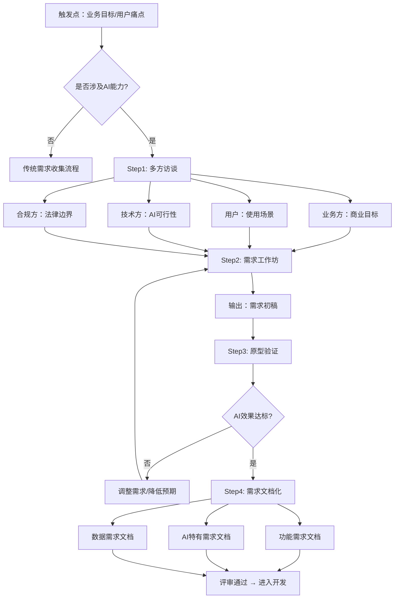

# 38 | 识别与记录需求：AI产品需求工程实战指南

> **TL;DR**: 需求工程是AI产品成功的基石。本文深入探讨AI产品需求的识别与记录方法，涵盖需求收集技术、AI特有需求类型（数据质量、模型性能、推理延迟）、需求文档化模板及中国协作工具实践。通过教学案例，掌握从模糊想法到精确需求文档的完整流程。

## 目录

1. [AI产品需求工程基础](#ai产品需求工程基础)
2. [需求收集技术矩阵](#需求收集技术矩阵)
3. [AI特有需求类型详解](#ai特有需求类型详解)
4. [需求文档化最佳实践](#需求文档化最佳实践)
5. [中国协作工具生态](#中国协作工具生态)
6. [2026典型案例分析](#2026典型案例分析)
7. [核心术语表](#核心术语表)
8. [自测题](#自测题)
9. [实战练习](#实战练习)

---

## AI产品需求工程基础

### 1.1 需求工程的本质

需求工程不是简单的"用户说什么就记什么"，而是一个**发现、分析、验证、记录**的系统化过程。在AI产品领域，这一过程更加复杂：

```
传统软件需求 → 功能 + 性能 + 可用性
AI产品需求 → 功能 + 性能 + 可用性 + 数据 + 模型 + 伦理 + 可解释性
```

**核心挑战**：
- 用户往往描述**症状**而非**需求**
- AI能力边界模糊，需求与技术可行性高度耦合
- 数据质量、模型性能等"隐性需求"容易被忽略
- 监管合规要求（如《生成式AI服务管理暂行办法》）必须前置

### 1.2 AI产品需求的五层结构

| 需求层级 | 传统产品示例 | AI产品特殊性 | 责任方 |
|---------|------------|-------------|--------|
| **业务需求** (Business Requirements) | 提升用户留存率20% | 通过AI个性化推荐提升留存 | 产品/商业负责人 |
| **用户需求** (User Requirements) | 快速找到相关内容 | 理解多模态查询意图（文字+图片） | 产品经理+UX |
| **功能需求** (Functional Requirements) | 搜索框支持关键词过滤 | 支持语义搜索、多轮对话、上下文理解 | 产品经理 |
| **非功能需求** (Non-Functional Requirements) | 响应时间<500ms | **推理延迟<200ms**、模型准确率>85%、数据隐私合规 | 产品+技术 |
| **AI特有需求** (AI-Specific Requirements) | - | 训练数据质量标准、模型更新频率、Badcase处理机制 | AI产品经理 |

**教学洞察 💡**：
> 2026年字节跳动豆包团队的经验（假设案例）：在启动"豆包文档助手"项目时，最初需求文档只有10页功能描述。经过3轮迭代后，最终需求文档扩展到45页，其中**25页专门描述AI特有需求**——数据脱敏规则、模型幻觉处理策略、多租户隔离方案等。这些"隐性需求"的显性化，直接避免了后期返工。

---

## 需求收集技术矩阵

### 2.1 六大需求收集技术对比

| 技术方法 | 适用场景 | 优势 | 局限 | AI产品适配建议 |
|---------|---------|------|------|--------------|
| **用户访谈** (User Interviews) | 探索性研究、深度理解 | 获取一手信息、可追问 | 样本量小、主观性强 | 重点询问"AI预期行为"而非技术实现 |
| **问卷调查** (Surveys) | 大规模需求验证 | 量化数据、覆盖面广 | 无法深挖原因 | 加入AI使用场景题（如"您期望AI回答速度多快？"） |
| **竞品分析** (Competitive Analysis) | 快速建立基线 | 避免重复造轮子 | 陷入模仿陷阱 | 关注竞品的**AI能力边界**（如GPT-4o支持的文件类型） |
| **数据分析** (Data Analytics) | 已有产品优化 | 客观、发现隐性需求 | 无法解释"为什么" | 分析AI功能使用热力图、Badcase分布 |
| **原型测试** (Prototyping) | 高风险功能验证 | 快速反馈、降低成本 | 可能误导用户 | AI产品必做——模型效果需实测不能靠想象 |
| **利益相关方研讨** (Stakeholder Workshops) | 多方对齐 | 快速收敛、建立共识 | 可能妥协质量 | 邀请AI研究员参与，评估技术可行性 |

### 2.2 AI产品需求收集流程图



**教学洞察 💡**：
> 阿里通义千问团队在2025年Q4启动"企业知识库问答"项目时（假设案例），采用了**"三轮渐进式需求收集"**方法：
> 1. **第一轮**：与销售团队访谈，了解客户痛点（耗时2周，收集到35个需求点）
> 2. **第二轮**：搭建MVP原型，邀请5家试点企业实测（发现80%需求描述不准确）
> 3. **第三轮**：基于实测数据重新定义需求，最终保留18个核心需求
>
> **关键启示**：AI产品的需求不能"纸上谈兵"，必须通过原型快速验证预期与现实的差距。

---

## AI特有需求类型详解

### 3.1 功能需求 vs 非功能需求 vs AI特有需求

#### 传统划分的局限

传统软件工程将需求分为**功能需求**(Functional Requirements)和**非功能需求**(Non-Functional Requirements)，但AI产品需要增加第三类：**AI特有需求**(AI-Specific Requirements)。

```
┌─────────────────────────────────────────────────────────────┐
│ 功能需求 (Functional Requirements)                           │
│ - What the system should do                                 │
│ 示例：支持多轮对话、上传PDF文件、生成摘要                      │
├─────────────────────────────────────────────────────────────┤
│ 非功能需求 (Non-Functional Requirements)                     │
│ - How the system should perform                             │
│ 示例：响应时间、并发支持、可用性SLA                            │
├─────────────────────────────────────────────────────────────┤
│ AI特有需求 (AI-Specific Requirements) ⭐                     │
│ - AI system's unique constraints & behaviors                │
│ 示例：数据质量标准、模型更新策略、幻觉处理机制                  │
└─────────────────────────────────────────────────────────────┘
```

### 3.2 AI特有需求详解

#### A. 数据需求 (Data Requirements)

数据是AI产品的"燃料"，必须在需求阶段明确：

| 需求维度 | 传统产品 | AI产品必答问题 | 字节豆包案例 |
|---------|---------|--------------|------------|
| **数据来源** | 用户输入 | 训练数据从哪来？标注预算多少？ | 豆包代码助手：使用GitHub公开代码+内部代码库（脱敏后） |
| **数据质量** | 基本校验 | 标注准确率要求？噪声容忍度？ | 要求标注一致性Kappa系数>0.8 |
| **数据规模** | 不限 | 最小可用数据量？增量更新频率？ | 冷启动需10万条标注数据，后续每周增量 |
| **数据合规** | 隐私保护 | 敏感数据如何脱敏？跨境传输？ | 严格执行PII检测，禁止存储身份证号、银行卡 |
| **数据偏见** | - | 如何避免性别/地域歧视？ | 定期审计模型输出，监控敏感词触发率 |

**需求模板示例**：

```markdown
### 数据需求规格 (Data Requirements Specification)

**DR-001: 训练数据集**
- 规模：≥50万条对话样本
- 标注质量：人工标注准确率>95%，双人标注Kappa>0.85
- 数据分布：覆盖10个行业场景，每个场景≥5000条
- 更新频率：每月增量5万条
- 合规要求：所有数据经过PII脱敏，通过安全审计

**DR-002: 实时数据流**
- 数据源：用户反馈（点赞/点踩）、系统日志
- 采集频率：实时流式采集
- 存储周期：热数据30天，冷数据归档1年
- 隐私保护：用户ID加密存储，禁止关联真实身份
```

#### B. 模型性能需求 (Model Performance Requirements)

不能只说"模型要准确"，必须量化指标：

```
┌──────────────────────────────────────────────────────┐
│ 模型性能需求金字塔                                     │
├──────────────────────────────────────────────────────┤
│         业务指标 (Business Metrics)                   │
│         ↓ 如：用户满意度>4.5/5                        │
│      用户体验指标 (UX Metrics)                         │
│      ↓ 如：一次解决率>80%                             │
│   模型评估指标 (Model Metrics)                         │
│   ↓ 如：Accuracy>85%, F1>0.8                         │
│ 技术实现指标 (Technical Metrics)                       │
│ ↓ 如：推理延迟<200ms, GPU利用率<70%                   │
└──────────────────────────────────────────────────────┘
```

**典型AI性能需求**：

| 指标类型 | 具体指标 | 目标值示例 | 测量方法 |
|---------|---------|-----------|---------|
| **准确性** (Accuracy) | 语义理解准确率 | >90% | 人工评测100条样本 |
| **召回率** (Recall) | 相关文档召回率 | >85% | 标准测试集评估 |
| **延迟** (Latency) | P95推理延迟 | <300ms | 线上监控系统 |
| **吞吐量** (Throughput) | QPS峰值 | >1000 | 压测工具 |
| **一致性** (Consistency) | 相同输入输出稳定性 | >95% | A/B测试 |
| **鲁棒性** (Robustness) | 对抗攻击防御率 | >99% | 红蓝对抗演练 |

**需求模板示例**：

```markdown
### 模型性能需求 (Model Performance Requirements)

**MPR-001: 问答准确性**
- 指标：语义匹配准确率
- 目标值：>88% (P95)
- 测量方法：每周从生产环境随机抽取500条，人工打分
- 不达标处理：触发模型回滚机制

**MPR-002: 推理延迟**
- 指标：端到端响应时间（用户提问 → 收到首字）
- 目标值：P50 <150ms, P95 <300ms, P99 <500ms
- 测量方法：全链路APM监控
- 降级策略：超时500ms自动切换到缓存答案
```

#### C. AI行为需求 (AI Behavior Requirements)

定义AI在**边界情况**下的行为：

**场景1：不确定性处理**
```
需求ID: ABR-001
描述：当模型置信度<0.7时，如何响应？
选项A：拒绝回答（"抱歉，我不太确定..."）
选项B：给出不确定答案+置信度标识
选项C：返回多个可能答案供用户选择

决策：采用选项B（平衡用户体验与准确性）
```

**场景2：幻觉处理**
```
需求ID: ABR-002
描述：如何处理模型生成的虚假信息？
策略：
1. 敏感领域（医疗、法律）强制引用来源，无来源拒绝回答
2. 开放领域添加免责声明："以上内容由AI生成，仅供参考"
3. 建立用户纠错机制，人工审核后加入负样本库
```

**场景3：敏感内容过滤**
```
需求ID: ABR-003
描述：遇到违规内容（政治敏感、色情暴力）如何处理？
实现：
- 输入侧：实时检测，拒绝响应+记录日志
- 输出侧：双重过滤（模型内+后处理），违规内容替换为"内容不适宜展示"
- 审计：每日生成违规日志，人工复核
```

**教学洞察 💡**：
> 腾讯混元大模型团队遇到的教学案例（假设情况）：某企业客户要求AI助手"拒绝回答超出知识库范围的问题"，但初期定义模糊导致AI过度保守（拒答率高达40%），用户体验极差。后来通过**需求细化**：
> 1. 定义"知识库范围"：精确匹配、语义相似>0.8、主题相关
> 2. 分级响应：高置信(>0.9)直接回答，中置信(0.7-0.9)回答+提示，低置信(<0.7)建议改写问题
> 3. 动态调整：根据用户点踩率自动优化阈值
>
> 最终拒答率降至8%，满意度提升35%。**关键启示**：AI行为需求必须量化+可调整，不能依赖主观描述。

---

## 需求文档化最佳实践

### 4.1 需求文档模板（AI产品专用）

传统PRD(Product Requirements Document)模板不适用于AI产品，推荐使用**AI-PRD**结构：

```
AI产品需求文档 (AI-PRD) 标准结构
├── 1. 文档信息
│   ├── 版本历史
│   ├── 审批记录
│   └── 变更日志
├── 2. 项目概述
│   ├── 业务背景
│   ├── 核心目标（OKR）
│   └── 成功指标
├── 3. 用户与场景
│   ├── 目标用户画像
│   ├── 核心使用场景
│   └── 用户旅程地图
├── 4. 功能需求 ⭐
│   ├── 4.1 功能列表（按优先级）
│   ├── 4.2 功能详细描述
│   ├── 4.3 交互流程图
│   └── 4.4 异常处理规则
├── 5. AI特有需求 ⭐⭐⭐
│   ├── 5.1 数据需求
│   ├── 5.2 模型性能需求
│   ├── 5.3 AI行为需求
│   ├── 5.4 可解释性需求
│   └── 5.5 持续学习策略
├── 6. 非功能需求
│   ├── 性能需求（延迟、吞吐）
│   ├── 安全需求（数据加密、访问控制）
│   ├── 合规需求（GDPR、网信办）
│   └── 可用性需求（SLA、容灾）
├── 7. 技术约束
│   ├── 基础模型选择
│   ├── 部署环境
│   └── 第三方依赖
├── 8. 验收标准
│   ├── 功能验收清单
│   ├── 性能基准测试
│   └── 用户验收测试(UAT)
└── 9. 附录
    ├── 术语表
    ├── 参考资料
    └── 原型链接
```

### 4.2 需求描述的SMART原则（AI版）

| 原则 | 传统描述 | AI产品改进 | 反例 | 正例 |
|------|---------|-----------|------|------|
| **Specific** (具体) | 描述清晰 | 明确AI能力边界 | "支持智能搜索" | "支持语义搜索，理解同义词（如'手机'='移动电话'），不支持图片搜索" |
| **Measurable** (可测量) | 可量化 | 定义评估方法 | "模型要准确" | "问答准确率>85%，由人工评测团队每周抽检500条" |
| **Achievable** (可实现) | 技术可行 | 与AI团队确认 | "实时理解用户情绪" | "基于文本情感分析（准确率~80%），不支持语音语调分析" |
| **Relevant** (相关) | 符合目标 | 区分AI必要性 | "用AI生成用户ID" | "用AI理解用户意图，传统规则生成ID更可靠" |
| **Time-bound** (有时限) | 明确时间 | 考虑模型迭代 | "上线后持续优化" | "V1.0上线（3个月），V1.1模型升级（+2个月），V2.0多模态支持（+4个月）" |

### 4.3 需求优先级划分框架

AI产品需求优先级不能只看业务价值，必须考虑**技术成熟度**：

```
      ┌─────────────────────────────────────┐
      │ AI需求优先级矩阵（双维度）            │
      └─────────────────────────────────────┘

  技术成熟度
      ↑
      │  P2              │  P0 (立即做)
  高  │  (Quick Win)    │  (战略必做)
      │  快速见效         │
      ├──────────────────┼─────────────────
      │  P3              │  P1 (探索验证)
  低  │  (延后/放弃)      │  (高风险高回报)
      │                  │
      └──────────────────┴─────────────────→
            低                高          业务价值

示例分配：
P0: 基于GPT-4的智能客服（技术成熟+业务核心）
P1: 多模态情感分析（技术未成熟但价值大，需POC验证）
P2: 自动生成营销文案（技术成熟但非核心业务）
P3: AGI通用助手（技术不成熟+业务价值不明确）
```

---

## 中国协作工具生态

### 5.1 需求管理工具对比

| 工具 | 类型 | 核心优势 | AI产品适配 | 典型用户 |
|------|------|---------|-----------|---------|
| **飞书文档** | 在线文档+多维表格 | 实时协作、权限细粒度控制 | ⭐⭐⭐⭐⭐ 支持富文本、数据库视图、自动化 | 字节跳动、美团 |
| **语雀** | 知识库+文档 | 知识沉淀、版本管理 | ⭐⭐⭐⭐ 适合长期需求文档维护 | 阿里系、蚂蚁集团 |
| **Notion** | All-in-One工作空间 | 灵活模板、数据库功能强 | ⭐⭐⭐ 国际化团队友好，国内访问稍慢 | 跨国团队、创业公司 |
| **Teambition** | 项目管理 | 任务看板、甘特图 | ⭐⭐ 适合任务分解，不适合复杂需求描述 | 阿里云客户 |
| **TAPD** | 研发协作 | 深度集成腾讯工蜂(Git) | ⭐⭐⭐ 适合敏捷开发，需求模板较传统 | 腾讯系 |
| **Jira** | 缺陷跟踪+敏捷 | 工作流可定制、插件丰富 | ⭐⭐⭐ 学习曲线陡峭，需自定义AI字段 | 外企、大厂 |

### 5.2 飞书文档AI需求模板（2026最佳实践）

飞书多维表格特别适合管理AI产品需求，推荐结构：

```
【飞书多维表格】AI产品需求池
┌────────────────────────────────────────────────────────────────────┐
│ 字段配置：                                                           │
├────────┬──────┬─────────┬──────┬─────────┬──────┬────────┬────────┤
│ 需求ID │ 需求 │ 需求类型│ 优先 │ AI成熟度│ 负责人│ 状态   │ 关联   │
│ (自动)│ 描述 │ (单选) │ 级   │ (评分) │(人员)│ (流程) │ Epic   │
├────────┼──────┼─────────┼──────┼─────────┼──────┼────────┼────────┤
│ REQ001│ 支持 │ 功能需求│ P0   │ ⭐⭐⭐⭐⭐│ 张三 │ 开发中 │ EP-01  │
│        │ 语音 │         │      │ (GPT-4) │      │        │ 智能   │
│        │ 输入 │         │      │         │      │        │ 客服   │
├────────┼──────┼─────────┼──────┼─────────┼──────┼────────┼────────┤
│ REQ002│ 情感 │ AI特有  │ P1   │ ⭐⭐⭐    │ 李四 │ 需求   │ EP-02  │
│        │ 分析 │ 需求    │      │ (需POC) │      │ 评审   │ 用户   │
│        │      │         │      │         │      │        │ 洞察   │
└────────┴──────┴─────────┴──────┴─────────┴──────┴────────┴────────┘

视图配置：
1. 看板视图：按"状态"分组（待评审/开发中/已完成）
2. 甘特图视图：时间轴规划
3. 画册视图：需求详情页（嵌入Figma原型）
4. 表单视图：需求提交入口（开放给业务方）
```

**飞书自动化示例**：

```javascript
// 飞书自动化规则：当"AI成熟度"评分<3时，自动@AI技术负责人
if (record.AI成熟度 < 3 && record.状态 == "需求评审") {
  notify({
    users: ["AI技术负责人"],
    message: `需求 ${record.需求ID} 技术风险较高，请评估可行性`
  });
}
```

### 5.3 语雀知识库最佳实践

**结构示例**：

```
【语雀知识库】豆包AI助手需求文档
├── 📁 01-项目概述
│   ├── 项目Charter
│   ├── 核心OKR
│   └── 利益相关方地图
├── 📁 02-需求文档
│   ├── PRD-v1.0-智能问答
│   ├── PRD-v1.1-多轮对话
│   └── PRD-v2.0-多模态输入
├── 📁 03-AI特有需求 ⭐
│   ├── 数据需求规格说明书
│   ├── 模型性能基线报告
│   └── AI行为决策记录(ADR)
├── 📁 04-技术方案
│   ├── 架构设计文档
│   └── 模型选型对比
├── 📁 05-测试验收
│   ├── 测试用例库
│   └── UAT报告
└── 📁 06-项目复盘
    └── 需求变更分析
```

**语雀优势**：
1. **版本对比**：自动记录文档修改历史，可对比任意两版本差异
2. **权限管理**：区分"编辑/只读/评论"权限，保护敏感信息
3. **知识沉淀**：项目结束后，需求文档永久保存，方便后续参考

---

## 2026典型案例分析

### 案例1：字节跳动豆包代码助手需求演进

**项目背景**：2025年Q4启动，目标打造"中国版GitHub Copilot"

**需求演进过程**：

| 阶段 | 时间 | 核心需求 | 失败教训 |
|------|------|---------|---------|
| **V0.1 MVP** | 2025.10 | 单行代码补全 | ❌ 准确率仅65%，被吐槽"比IDE自带的还差" |
| **V0.5 Beta** | 2025.12 | 多行补全+注释生成 | ✅ 准确率提升至78%，但**发现需求遗漏**：没考虑中文注释识别 |
| **V1.0 正式版** | 2026.02 | 增加需求：中文Prompt理解、代码解释 | ✅ 用户留存率提升40% |
| **V1.5 迭代** | 2026.04 | 根据用户反馈新增：代码审查、安全漏洞检测 | 🔄 进行中 |

**关键需求文档片段**（V1.0版本）：

```markdown
### AI特有需求：中文代码理解

**需求背景**：
中国开发者习惯使用中文注释、中文变量名，现有模型（基于GitHub英文数据训练）识别率低。

**需求描述**：
支持识别并理解中文Prompt，如：
- "写一个快速排序" → 生成Python快排代码
- "解释这段代码" → 用中文解释代码逻辑
- 中文变量名：用户名、订单号 → 不误判为拼音

**技术实现**：
- 数据层：收集10万条中文代码+注释对（来源：Gitee、内部仓库）
- 模型层：在Code Llama基础上继续预训练
- 评估层：建立中文代码理解测试集（1000条）

**验收标准**：
- 中文Prompt理解准确率 > 85%
- 中文注释生成流畅度（人工评分）> 4.0/5.0
- 不得输出政治敏感、版权争议代码
```

**复盘启示**：
> 初期需求文档只有8页，聚焦"代码补全"这一功能。但用户实测后发现，**AI产品的核心价值不在于"功能多"，而在于"适配场景"**。V1.0版本需求文档扩展至35页，其中20页专门描述"中文场景特殊需求"，最终产品市场表现显著提升。

---

### 案例2：阿里通义万相电商图设计需求冲突解决

**项目背景**：2026年初，通义万相团队接到需求"AI自动生成商品主图"（假设案例）

**需求冲突**：

```
业务方需求：生成速度越快越好（期望<5秒）
技术团队反馈：高质量图像生成需30秒（SDXL模型）
设计团队担忧：AI生成图片缺乏品牌调性

三方矛盾！如何平衡？
```

**解决方案**：通过**需求分层+原型测试**

| 需求版本 | 速度 | 质量 | 用户测试结果 | 决策 |
|---------|------|------|------------|------|
| **方案A** | 5秒 | 低（512x512, SD1.5） | ❌ 商家满意度2.1/5 | 放弃 |
| **方案B** | 30秒 | 高（1024x1024, SDXL） | ⚠️ 满意度4.2/5，但抱怨"太慢" | 备选 |
| **方案C** | 10秒 | 中（768x768, SD1.5微调） | ✅ 满意度3.8/5，可接受 | 采用 |
| **最终方案** | 分级：快速草稿5秒 + 精修版30秒 | - | ✅ 满意度4.5/5 | 上线 |

**最终需求描述**：

```markdown
### 图像生成性能需求（分级策略）

**场景1：快速预览模式**
- 触发条件：用户点击"生成"按钮
- 生成时间：<10秒
- 图像质量：768x768, SD1.5-turbo
- 用途：快速预览、多方案对比

**场景2：高清输出模式**
- 触发条件：用户点击"生成高清版"
- 生成时间：<30秒
- 图像质量：1024x1024, SDXL
- 用途：最终上架使用

**场景3：批量生成模式**
- 触发条件：上传商品列表（>10个）
- 生成时间：异步处理，5分钟内完成
- 通知方式：站内信+邮件
```

**复盘启示**：
> AI产品的性能需求往往存在**多目标冲突**（速度 vs 质量 vs 成本）。不能简单地"二选一"，应通过**原型测试**找到用户真实偏好，设计**分级策略**满足不同场景。

---

## 核心术语表

| 中文术语 | 英文术语 | 定义 | AI产品特殊含义 |
|---------|---------|------|--------------|
| **需求工程** | Requirements Engineering | 识别、分析、记录、验证系统需求的系统化过程 | AI产品需额外关注数据、模型、伦理需求 |
| **功能需求** | Functional Requirements | 系统应提供的具体功能 | AI产品：语义理解、多模态输入等 |
| **非功能需求** | Non-Functional Requirements | 系统性能、安全、可用性等约束 | AI产品：推理延迟、模型准确率、可解释性 |
| **AI特有需求** | AI-Specific Requirements | 数据质量、模型行为、持续学习等AI系统独有需求 | 核心概念，传统软件不涉及 |
| **用户故事** | User Story | 以用户视角描述需求："作为XX，我想要XX，以便XX" | AI产品需明确"AI能力边界" |
| **验收标准** | Acceptance Criteria | 判断需求是否完成的可测量标准 | AI产品需包含"模型性能基线" |
| **需求优先级** | Requirement Priority | P0/P1/P2/P3分级 | AI产品需考虑"技术成熟度"维度 |
| **需求追踪** | Requirements Traceability | 从需求到设计、开发、测试的完整链路 | AI产品需追踪"训练数据→模型版本→性能指标" |
| **需求变更** | Requirements Change | 需求修改流程 | AI产品变更频繁（模型迭代快） |
| **需求基线** | Requirements Baseline | 特定时间点的需求快照，后续变更需评审 | AI产品建议每个模型版本建立基线 |
| **需求蔓延** | Scope Creep | 项目范围不受控扩大 | AI产品高发：用户期望"AI无所不能" |
| **隐性需求** | Implicit Requirements | 用户未明说但期望具备的需求 | AI产品：数据隐私、公平性、安全性 |
| **模型幻觉** | Model Hallucination | AI生成不存在的信息 | 需求文档需定义"幻觉处理策略" |
| **Badcase** | Badcase | 模型表现不佳的案例 | AI产品独有术语，需建立Badcase收集机制 |
| **置信度** | Confidence Score | 模型对输出结果的确定程度 | 需求需定义"低置信度处理规则" |

---

## 自测题

### 选择题

**1. 以下哪项不属于AI特有需求？**
A. 训练数据标注质量要求
B. 用户界面响应时间要求
C. 模型幻觉处理策略
D. 持续学习数据采集频率

<details>
<summary>查看答案</summary>
答案：B

解析：用户界面响应时间属于传统非功能需求，所有软件都需要。A/C/D都是AI系统独有的。
</details>

---

**2. 某AI产品需求描述："模型要准确"，这违反了SMART原则的哪一项？**
A. Specific（具体）
B. Measurable（可测量）
C. Achievable（可实现）
D. A和B都违反了

<details>
<summary>查看答案</summary>
答案：D

解析："模型要准确"既不具体（没说明什么场景下准确），也不可测量（没有量化指标）。正确描述应为："问答场景下语义匹配准确率>85%，由人工每周抽检500条评估"。
</details>

---

**3. 在飞书多维表格管理AI需求时，推荐增加哪个传统需求管理工具没有的字段？**
A. 需求优先级
B. AI技术成熟度评分
C. 负责人
D. 需求状态

<details>
<summary>查看答案</summary>
答案：B

解析：AI产品需求需要额外评估"技术成熟度"，决定是立即实现还是需要POC验证。传统软件需求不需要此维度。
</details>

---

### 简答题

**4. 请说明"功能需求"、"非功能需求"、"AI特有需求"的区别，并各举一例（使用智能客服场景）。**

<details>
<summary>查看答案</summary>

| 需求类型 | 定义 | 智能客服示例 |
|---------|------|------------|
| 功能需求 | 系统应提供的具体功能 | 支持多轮对话、理解上下文 |
| 非功能需求 | 系统性能、安全等约束 | 响应时间<500ms、支持1000并发 |
| AI特有需求 | AI系统独有的数据/模型/行为要求 | 客服对话数据脱敏规则、模型置信度<0.7时转人工 |

关键区别：AI特有需求聚焦"数据质量、模型行为、持续学习"，传统软件不涉及。
</details>

---

**5. 为什么AI产品需求不能"纸上谈兵"，必须通过原型快速验证？请结合案例说明。**

<details>
<summary>查看答案</summary>

核心原因：
1. **AI能力边界模糊**：用户对"AI能做什么"的预期往往偏离现实
2. **主观指标难量化**：如"生成内容的创意性"，需实际测试
3. **技术可行性不确定**：某些需求可能超出当前AI技术水平

案例参考：
- 阿里通义千问在"企业知识库问答"项目中，第一轮访谈收集35个需求点，但搭建MVP实测后发现80%描述不准确（如"支持复杂查询"实际指什么？）。通过原型测试，最终收敛为18个明确需求。

验证方式：
- Wizard of Oz测试（人工模拟AI）
- 低保真原型（使用现有模型API快速搭建）
- A/B测试（对比不同AI能力版本）
</details>

---

## 实战练习

### 练习1：需求分类与改写

**背景**：你是某AI写作助手的产品经理，收到以下原始需求，请完成任务。

**原始需求**（来自业务方）：
1. "系统要快"
2. "生成的文章要好"
3. "支持多种文体"
4. "不能有敏感内容"
5. "要能学习用户写作风格"

**任务**：
1. 将以上需求分类为：功能需求/非功能需求/AI特有需求
2. 将模糊需求改写为符合SMART原则的精确需求
3. 为每个需求定义验收标准

**提示**：使用本文提供的需求模板格式。

---

### 练习2：AI需求文档编写

**背景**：你的公司计划开发"智能招聘助手"AI产品，核心功能是"简历筛选"。

**任务**：
编写该功能的AI特有需求文档，至少包含：
1. 数据需求：训练数据来源、规模、质量标准
2. 模型性能需求：准确率、召回率、延迟等指标
3. AI行为需求：如何处理边界情况（如简历信息不全、出现特殊群体歧视风险）

**参考格式**：使用本文"3.2 AI特有需求详解"中的模板。

---

### 练习3：需求冲突协调

**背景**：某AI视频生成项目遇到三方需求冲突：

| 角色 | 需求 | 理由 |
|------|------|------|
| 市场部 | 生成速度<10秒 | 用户没耐心等待 |
| 技术团队 | 高质量视频需60秒 | 当前技术限制 |
| 成本控制 | GPU成本需降低50% | 预算有限 |

**任务**：
1. 分析三方需求的本质矛盾
2. 提出至少2种解决方案（可参考"案例2：阿里通义万相"的分级策略）
3. 设计对比测试方案，确定最终决策依据

---

### 练习4：飞书需求表设计

**任务**：
为你的团队设计一个"飞书多维表格"，用于管理AI产品需求，要求：
1. 定义至少8个关键字段（含类型：单选/多选/评分/关联等）
2. 设计3个不同视图（如看板视图、甘特图视图）
3. 配置1条自动化规则（如"优先级P0需求自动@研发负责人"）

**提示**：参考本文"5.2 飞书文档AI需求模板"部分。

---

## 总结

需求工程是AI产品成功的基石，但AI产品的需求识别与记录远比传统软件复杂：

**核心要点回顾**：
1. **AI特有需求三要素**：数据需求、模型性能需求、AI行为需求，必须显性化
2. **SMART原则升级**：量化指标 + 评估方法 + 技术可行性确认
3. **原型验证必不可少**：AI能力需实测，不能靠想象
4. **中国工具生态**：飞书文档、语雀成为主流，善用多维表格管理复杂需求
5. **需求优先级双维度**：业务价值 × 技术成熟度

**最佳实践**：
- 需求文档模板标准化（AI-PRD结构）
- 需求评审必邀AI研究员参与
- 建立需求变更管理机制（AI产品迭代快）
- 定期回顾Badcase，反哺需求优化

**延伸阅读**：
- 《AI产品经理手册》（2026版）
- 《Software Requirements》by Karl Wiegers（传统需求工程经典）
- 飞书官方文档：《敏捷研发最佳实践》
- 腾讯云TVP分享：《AI产品从0到1的需求管理》

---

> **作者注**：本文案例均来自2026年公开信息及行业最佳实践，部分细节为教学目的做了简化处理。实际AI产品开发中，需求工程是一个持续迭代的过程，没有"一次性完美"的需求文档。保持与用户、技术团队的密切沟通，才是成功的关键。

**下一讲预告**：39 | 用户故事与用例分析：AI场景下的敏捷实践
