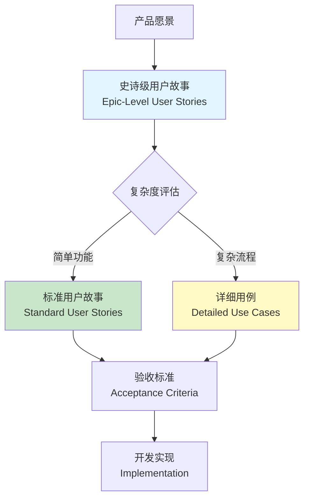
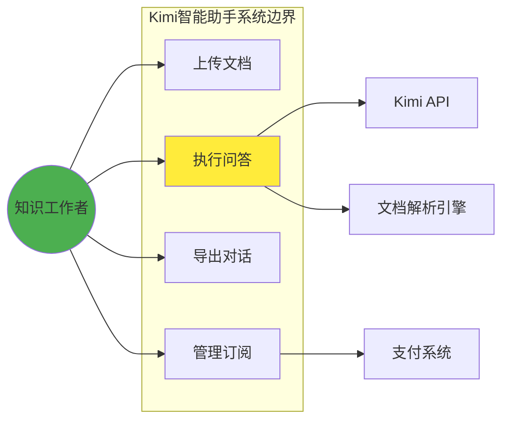

# 用户故事与用例 | User Stories & Use Cases

> **TL;DR**
> 用户故事和用例是AI产品需求沟通的两大核心工具。用户故事以"作为[角色],我想要[功能],以便[价值]"的敏捷格式聚焦用户价值,适合快速迭代;用例则通过详细的交互步骤和边界条件描述系统行为,适合复杂场景。本文基于Microsoft产品管理实践,结合豆包、Kimi等中国AI产品案例,提供从模板编写、INVEST原则验证到故事地图实战的完整方法论,助你在2026年AI竞争中精准捕获用户需求。

---

## 目录

1. [核心概念对比](#核心概念对比)
2. [用户故事编写框架](#用户故事编写框架)
3. [用例设计方法论](#用例设计方法论)
4. [INVEST质量验证](#invest质量验证)
5. [故事地图技术](#故事地图技术)
6. [中国AI产品实战](#中国ai产品实战)
7. [工具与最佳实践](#工具与最佳实践)
8. [关键术语表](#关键术语表)
9. [自测题](#自测题)
10. [实战练习](#实战练习)

---

## 核心概念对比

### 用户故事 vs 用例 | User Stories vs Use Cases

用户故事和用例代表两种不同的需求捕获哲学:

```
┌─────────────────────────────────────────────────────────────┐
│                    需求描述方法对比矩阵                         │
├──────────┬──────────────────┬──────────────────────────────┤
│ 维度      │ 用户故事           │ 用例                          │
│ Dimension│ User Stories      │ Use Cases                    │
├──────────┼──────────────────┼──────────────────────────────┤
│ 格式复杂度│ 简洁(1-3句话)      │ 详细(多步骤序列)              │
│ Complexity│ Concise          │ Detailed                     │
├──────────┼──────────────────┼──────────────────────────────┤
│ 视角聚焦  │ 用户价值与目标     │ 系统交互与行为                │
│ Focus     │ User Value       │ System Interaction           │
├──────────┼──────────────────┼──────────────────────────────┤
│ 适用场景  │ 敏捷迭代/功能范围  │ 复杂系统/关键流程             │
│ Use Case │ Agile/Scoping    │ Complex/Critical             │
├──────────┼──────────────────┼──────────────────────────────┤
│ 灵活性    │ 高(易于调整)       │ 低(变更成本高)                │
│ Flexibility│ High            │ Low                          │
├──────────┼──────────────────┼──────────────────────────────┤
│ 细节程度  │ 模糊(需验收标准)   │ 明确(含前置/后置条件)         │
│ Detail    │ Vague           │ Explicit                     │
├──────────┼──────────────────┼──────────────────────────────┤
│ 开发速度  │ 快速启动          │ 前期耗时/后期减少返工          │
│ Speed     │ Fast Start      │ Slower Start/Less Rework     │
└──────────┴──────────────────┴──────────────────────────────┘
```

### 混合策略的最佳实践

在AI产品开发中,纯粹依赖单一方法往往不足。推荐采用"分层需求策略" (Tiered Requirements Strategy):



**教学洞察 #1: 混合需求管理示例**

> 豆包团队在开发多模态对话功能时采用混合策略:
> - **用户故事层**: "作为内容创作者,我想要通过语音和图片组合输入,以便快速生成社交媒体文案" (定义价值方向)
> - **用例层**: 详细描述13步交互流程,包括语音识别失败重试、图片格式不支持的异常处理、多模态内容融合算法的参数配置等边界条件
> - **结果**: 这种混合方法使功能在3个迭代周期内交付,比纯用户故事方法减少40%的需求返工,比纯用例方法缩短25%的开发周期

---

## 用户故事编写框架

### 标准模板结构

经典的用户故事遵循三段式模板:

```
作为 [用户角色]
我想要 [执行的操作/获得的功能]
以便 [实现的业务价值/解决的问题]

As a [User Role]
I want [Goal/Action]
So that [Benefit/Value]
```

#### AI产品专用扩展模板

针对AI产品的特殊性,建议扩展为五要素模板:

```
作为 [用户角色]
在 [使用场景/上下文]
我想要 [AI能力描述]
通过 [交互方式]
以便 [衡量的业务成果]

As a [User Role]
In [Context/Scenario]
I want [AI Capability]
Through [Interaction Method]
So that [Measurable Outcome]
```

### 中国AI产品实例对照

| 产品 | 传统模板 | AI扩展模板 |
|------|---------|-----------|
| **Kimi智能助手** | 作为学生,我想要搜索学术资料,以便完成论文写作 | 作为硕士研究生,在撰写文献综述阶段,我想要AI分析200页PDF并提取核心论点,通过自然语言对话追问,以便在3天内完成15篇文献的深度理解 |
| **豆包企业版** | 作为HR,我想要筛选简历,以便提高招聘效率 | 作为科技公司招聘经理,在收到500+份AI工程师简历时,我想要多维度智能评分(技术栈匹配度、项目经验相关性、薪资期望合理性),通过批量处理+异常候选人高亮,以便将初筛时间从2周降至1天 |
| **文心一言** | 作为营销人员,我想要生成广告文案,以便吸引客户 | 作为电商运营,在促销活动前夕,我想要基于产品特征和目标人群生成10个A/B测试版本的短视频脚本,通过拖拽式编辑界面微调,以便转化率提升至少15% |

### 编写质量自查清单

每个用户故事完成后应通过以下检查:

- [ ] **角色具体化**: 是否明确了具体的用户细分(避免"用户"这种泛化角色)?
- [ ] **场景化**: 是否包含了触发该需求的具体使用场景?
- [ ] **价值量化**: "以便"部分是否描述了可衡量或可观察的结果?
- [ ] **独立性**: 该故事是否可以独立交付价值(不强依赖其他故事)?
- [ ] **对话启发**: 团队成员阅读后是否会提出有价值的澄清问题?

---

## 用例设计方法论

### 用例的四要素结构

完整的用例包含以下核心组件:

```
┌─────────────────────────────────────────────────────────────┐
│                        用例文档模板                            │
├─────────────────────────────────────────────────────────────┤
│ 【用例名称】: 清晰描述用例目标的动词短语                         │
│              (Use Case Name: Verb Phrase)                    │
├─────────────────────────────────────────────────────────────┤
│ 【参与者】: Actors                                            │
│  ├─ 主要参与者 (Primary): 触发用例的用户/系统                  │
│  └─ 次要参与者 (Secondary): 被调用的外部系统/服务              │
├─────────────────────────────────────────────────────────────┤
│ 【前置条件】: Preconditions                                   │
│  - 执行用例前系统必须满足的状态                                 │
│  - 例如: 用户已登录、数据已加载                                │
├─────────────────────────────────────────────────────────────┤
│ 【主要流程】: Main Flow                                       │
│  1. 用户触发操作                                              │
│  2. 系统执行验证                                              │
│  3. 系统返回结果                                              │
│  4. ...                                                      │
├─────────────────────────────────────────────────────────────┤
│ 【扩展流程】: Alternative Flows                               │
│  - 3a. 验证失败 → 显示错误信息 → 返回步骤2                     │
│  - 3b. 超时异常 → 自动重试3次 → 失败则通知用户                 │
├─────────────────────────────────────────────────────────────┤
│ 【后置条件】: Postconditions                                  │
│  - 成功: 系统状态变更为X,数据持久化                            │
│  - 失败: 回滚至初始状态,记录审计日志                           │
└─────────────────────────────────────────────────────────────┘
```

### AI产品用例实例:Kimi智能搜索

**用例名称**: 执行多轮深度文档问答

**参与者**:
- 主要: 知识工作者(知识密集型行业从业者)
- 次要: Kimi API服务、文档解析引擎、向量数据库

**前置条件**:
- 用户已上传至少1个文档(支持PDF/Word/网页链接)
- 文档大小 ≤ 200MB
- 账户剩余Token数 > 10,000

**主要流程**:
1. 用户在对话框输入问题: "总结这篇论文的核心创新点"
2. 系统调用文档解析引擎提取文本并分块 (Chunking)
3. 系统将问题编码为向量,在文档向量库中检索相关片段 (Retrieval)
4. 系统将检索结果和问题提交给大语言模型生成答案 (Generation)
5. 系统显示答案并标注引用来源 (页码、段落)
6. 用户追问: "能详细说明第3个创新点吗?"
7. 系统利用对话历史上下文,重复步骤3-5
8. 用户满意后结束对话或导出聊天记录

**扩展流程**:
- **4a. 文档包含图表**: 系统调用多模态模型解析图表内容并整合到答案中
- **4b. 答案不确定性高**: 系统添加 "该解读基于有限上下文,建议查阅原文第X页核实" 的免责提示
- **7a. 追问超出文档范围**: 系统回复 "该问题在上传文档中未找到相关信息,是否需要联网搜索补充?"
- **任意步骤超时(>30秒)**: 显示进度条并提示 "文档较长,预计还需20秒",超过2分钟则失败并建议分段上传

**后置条件**:
- 成功: 对话历史保存到用户账户,消耗的Token数更新
- 失败: 不扣除Token,错误日志发送到监控系统

### 用例图 (Use Case Diagram) 绘制

用例图用于可视化系统边界和参与者交互:



**教学洞察 #2: 用例驱动测试示例**

> 豆包团队在开发"AI写作助手"功能时,为核心用例"生成长文"创建了42个扩展流程分支,覆盖以下异常场景:
> - 网络波动导致流式输出中断(自动断点续传)
> - 用户中途修改大纲要求(增量重新生成)
> - 内容触发敏感词审核(实时替换建议)
> - 并发用户峰值下的降级策略(排队机制)
>
> 这些用例直接转化为1200+个自动化测试用例,使功能上线后30天内的客户投诉率控制在0.3%以下(行业平均2-5%)

---

## INVEST质量验证

### INVEST原则详解

INVEST是评判用户故事质量的黄金标准,由Bill Wake于2003年提出:

| 原则 | 英文全称 | 中文释义 | 验证问题 |
|------|---------|---------|---------|
| **I** | Independent | 独立性 | 该故事能否独立于其他故事交付? |
| **N** | Negotiable | 可协商 | 故事是否留有实现细节的讨论空间? |
| **V** | Valuable | 有价值 | 用户能否从中获得可感知的收益? |
| **E** | Estimable | 可估算 | 开发团队能否评估工作量(时间/复杂度)? |
| **S** | Small | 小型化 | 故事能否在1-2个Sprint内完成? |
| **T** | Testable | 可测试 | 能否定义明确的验收标准来验证完成度? |

### 违反INVEST的典型反例

**❌ 违反"独立性"**:
```
故事A: 作为用户,我想要创建账户,以便使用系统
故事B: 作为用户,我想要登录账户,以便访问个人数据
```
*问题*: 故事B强依赖故事A,无法独立交付

**✅ 改进方案**:
```
故事A: 作为新用户,我想要通过手机号+验证码快速注册,以便5分钟内开始使用
故事B: 作为已注册用户,我想要通过多种方式登录(手机号/微信/生物识别),以便随时访问账户
```

**❌ 违反"可协商"**:
```
作为开发者,我想要使用React框架构建前端界面,以便提高开发效率
```
*问题*: 过度指定技术实现,限制了团队技术选型讨论

**✅ 改进方案**:
```
作为终端用户,我想要在3秒内加载完成首页内容,以便快速开始任务
```

**❌ 违反"小型化"**:
```
作为AI产品经理,我想要构建完整的用户行为分析系统,以便优化产品决策
```
*问题*: 范围过大(可能需要3-6个月),应拆分为多个小故事

**✅ 改进方案**:
```
史诗 (Epic): 用户行为分析系统
  ├─ 故事1: 埋点SDK集成 (1 Sprint)
  ├─ 故事2: 基础事件收集 (1 Sprint)
  ├─ 故事3: 实时数据仪表盘 (2 Sprints)
  └─ 故事4: 用户路径漏斗分析 (2 Sprints)
```

### INVEST自动化检查工具

虽然没有完美的自动化工具,但可以通过以下指标辅助判断:

```python
# 故事质量评分伪代码
def calculate_invest_score(user_story):
    score = 0

    # I: 独立性 - 检查依赖关键词
    if not contains_dependency_keywords(user_story):
        score += 1

    # N: 可协商 - 检查技术实现细节
    if not contains_technical_details(user_story):
        score += 1

    # V: 有价值 - 检查"以便"部分的业务成果描述
    if has_clear_business_value(user_story):
        score += 1

    # E: 可估算 - 检查长度(20-200字为宜)
    if 20 <= len(user_story) <= 200:
        score += 1

    # S: 小型化 - 团队历史速度评估(需人工确认)
    score += 0.5  # 半自动

    # T: 可测试 - 检查是否附带验收标准
    if has_acceptance_criteria(user_story):
        score += 1

    return score / 6.0  # 转换为百分比
```

---

## 故事地图技术

### 故事地图的结构原理

故事地图 (Story Mapping) 是Jeff Patton于2005年提出的可视化技术,用于组织用户故事的层级关系:

```
时间轴/用户旅程 (User Journey Timeline)
─────────────────────────────────────────────────────────────
                     横向展开

用户活动        │ 发现需求  │ 评估方案  │ 使用产品  │ 获得结果
(Activity)     │          │          │          │
──────────────┼──────────┼──────────┼──────────┼──────────
               │          │          │          │
用户任务        │ 搜索功能  │ 对比定价  │ 注册账户  │ 分享成果
(Task)         │ 查看案例  │ 试用体验  │ 首次操作  │ 订阅升级
               │          │          │          │
──────────────┴──────────┴──────────┴──────────┴──────────
               ↓          ↓          ↓          ↓
             纵向细化优先级

Release 1      故事1      故事3      故事5      故事7
(MVP)

Release 2      故事2      故事4      故事6      故事8

Release 3      故事9      故事10     故事11     故事12

               ↑          ↑          ↑          ↑
            必需功能    重要功能    增强功能    未来特性
            (Must)    (Should)    (Could)    (Won't)
```

### 构建故事地图的6步流程

**步骤1**: 识别用户角色 (User Personas)
- 主要角色: 直接使用产品的终端用户
- 次要角色: 购买决策者、系统管理员等

**步骤2**: 定义用户旅程 (User Journey)
- 按时间顺序排列用户与产品交互的主要阶段
- 例: 认知 → 考虑 → 购买 → 使用 → 忠诚

**步骤3**: 列举用户活动 (Activities)
- 每个旅程阶段下用户希望完成的高层次目标
- 用动词短语描述 (如"寻找解决方案"、"完成工作任务")

**步骤4**: 分解用户任务 (Tasks)
- 将活动细化为具体可操作的任务
- 每个任务对应一个或多个用户故事

**步骤5**: 优先级分层 (Prioritization)
- 纵向组织故事,顶部为MVP (最小可行产品)必需功能
- 使用MoSCoW法则标记优先级

**步骤6**: 发布规划 (Release Planning)
- 将每一横向切片定义为一个发布版本
- 确保每个版本都能交付完整的用户价值

### AI对话产品故事地图实例:Kimi

```
用户旅程:    │ 发现问题  │ 开始对话  │ 深度交互  │ 成果产出
────────────┼──────────┼──────────┼──────────┼──────────

活动:        │ 确定需求  │ 提出问题  │ 多轮追问  │ 导出结果
            │           │          │          │

任务:        │ 浏览案例  │ 输入查询  │ 上传文档  │ 复制答案
            │ 观看教程  │ 选择模型  │ 调整参数  │ 生成报告
            │           │          │          │

────────────┴──────────┴──────────┴──────────┴──────────

MVP (v1.0)   │ [US-01]   │ [US-05]  │ [US-09]  │ [US-13]
基础对话     │ 展示热门  │ 文本输入  │ 单轮问答  │ 文本复制
            │ 提示词    │ 智能联想  │          │

v2.0         │ [US-02]   │ [US-06]  │ [US-10]  │ [US-14]
文档问答     │ 个性化   │ 语音输入  │ 多轮上下文│ Markdown
            │ 推荐     │          │ 文档上传  │ 导出

v3.0         │ [US-03]   │ [US-07]  │ [US-11]  │ [US-15]
多模态交互   │ 社区分享  │ 图片输入  │ 图表生成  │ API调用
            │          │          │ 实时联网  │

Future       │ [US-04]   │ [US-08]  │ [US-12]  │ [US-16]
            │ AI推荐   │ 视频输入  │ 协同编辑  │ 工作流
            │ 使用场景  │          │          │ 集成
```

**教学洞察 #3: 故事地图驱动MVP示例**

> Kimi在2023年10月立项时,团队用2天时间完成了覆盖"知识工作者日常信息处理"全旅程的故事地图,包含87个初始用户故事。通过MoSCoW优先级标记:
> - **Must (18个)**: 基础对话、文档上传、问答引用 → 2023年12月MVP上线
> - **Should (31个)**: 多轮对话、实时联网、语音输入 → 2024年3月v2.0
> - **Could (26个)**: 多模态理解、协同批注 → 2024年路线图
> - **Won't (12个)**: 视频生成、3D建模 → 推迟至2025年
>
> 这种优先级清晰的地图使Kimi在3个月内快速迭代到产品市场契合 (Product-Market Fit),用户留存率达业界领先的68% (30日留存)

---

## 中国AI产品实战

### 豆包企业版:复杂B2B场景的用户故事

**背景**: 某制造业企业使用豆包企业版构建智能客服系统

**用户角色细分**:
- 终端用户: 海外买家(英语为主)
- 业务用户: 客服团队长(需监控质量)
- 技术用户: IT管理员(负责系统集成)

**多角色故事组合**:

```
┌─────────────────────────────────────────────────────────────┐
│                    多干系人故事矩阵                            │
├──────────────┬──────────────────────────────────────────────┤
│ [US-B2B-01]  │ 海外买家 - 基础咨询                            │
├──────────────┼──────────────────────────────────────────────┤
│ 作为         │ 英语非母语的海外采购商                          │
│ 在           │ 浏览产品目录发现感兴趣的工业设备时               │
│ 我想要       │ 通过文字或语音(支持24种语言)咨询产品规格、      │
│             │ 交货期、MOQ(最小起订量)等问题                   │
│ 通过         │ 网页聊天窗口或WhatsApp集成                     │
│ 以便         │ 在30分钟内获得准确回答,决定是否深入洽谈         │
├──────────────┼──────────────────────────────────────────────┤
│ 验收标准     │ ✓ 支持英语、西班牙语、阿拉伯语等24种语言        │
│ (AC)        │ ✓ 回答准确率 ≥ 92% (基于历史成交客户问题库)     │
│             │ ✓ 响应时间 < 3秒                               │
│             │ ✓ 无法回答的问题自动转接人工(30秒内)            │
└──────────────┴──────────────────────────────────────────────┘

┌─────────────────────────────────────────────────────────────┐
│ [US-B2B-02]  │ 客服主管 - 质量监控                            │
├──────────────┼──────────────────────────────────────────────┤
│ 作为         │ 客服团队负责人                                 │
│ 在           │ 每周例会前需要评估AI客服的服务质量时            │
│ 我想要       │ 查看实时仪表盘,显示AI回答准确率、用户满意度      │
│             │ (5星评分)、转人工率、高频问题分类等指标          │
│ 通过         │ 飞书集成的数据面板                             │
│ 以便         │ 识别需要优化的知识库缺口,指导团队改进           │
├──────────────┼──────────────────────────────────────────────┤
│ 验收标准     │ ✓ 数据刷新频率:每15分钟更新一次                │
│             │ ✓ 支持按产品线、时间段、语言等维度筛选           │
│             │ ✓ 可导出Excel/PDF报告                         │
│             │ ✓ 异常告警:准确率低于90%时自动发送飞书通知       │
└──────────────┴──────────────────────────────────────────────┘

┌─────────────────────────────────────────────────────────────┐
│ [US-B2B-03]  │ IT管理员 - 系统集成                            │
├──────────────┼──────────────────────────────────────────────┤
│ 作为         │ 企业IT系统管理员                               │
│ 在           │ 需要将豆包AI集成到现有CRM(Salesforce)时         │
│ 我想要       │ 通过API/Webhook配置,实现客户对话记录             │
│             │ 自动同步到CRM联系人时间线                        │
│ 通过         │ 在豆包管理后台配置OAuth认证和数据映射            │
│ 以便         │ 销售团队能在Salesforce中直接查看AI客服交互历史   │
├──────────────┼──────────────────────────────────────────────┤
│ 验收标准     │ ✓ 支持Salesforce、微软Dynamics 365等CRM        │
│             │ ✓ 数据同步延迟 < 5分钟                         │
│             │ ✓ 提供详细的API文档和Postman调试集合             │
│             │ ✓ 集成失败时显示明确的错误代码和解决方案          │
└──────────────┴──────────────────────────────────────────────┘
```

### 文心一言:创意生成场景的验收标准设计

**用户故事**:
```
作为电商服饰品牌运营
在双11大促前2周的营销准备期
我想要AI根据产品图片和卖点生成10种不同风格的短视频脚本
通过上传产品图+简单描述+选择目标人群标签
以便快速测试并选出转化率最高的3种投放
```

**Given-When-Then验收标准**:

```
场景1: 成功生成多样化脚本
Given: 我已上传1张女装连衣裙产品图 + 输入卖点"优雅职场风"
  And: 目标人群标签选择"25-35岁女性白领"
When: 点击"生成短视频脚本"按钮
Then: 系统在20秒内返回10个脚本,包含以下风格分布:
  - 情感共鸣型 × 3 (如"告别加班憔悴,穿出自信风采")
  - 场景代入型 × 3 (如"周一晨会,让你成为焦点")
  - 促销驱动型 × 2 (如"限时5折,职场精英必备")
  - 明星同款型 × 2 (如"某某同款,气质飙升")
  And: 每个脚本包含15-30秒时长建议、文案、配乐建议
  And: 提供"重新生成"和"微调优化"按钮

场景2: 处理图片质量不足
Given: 我上传的产品图分辨率仅为300×300像素(低于建议的1080×1080)
When: 系统检测到图片质量
Then: 显示警告提示:"检测到图片分辨率较低,建议上传高清图以获得更精准的脚本"
  And: 仍然生成脚本,但标注"基于有限图片信息生成,建议人工审核"

场景3: 目标人群模糊导致通用化
Given: 我未选择目标人群标签(保持默认"全人群")
When: 生成脚本
Then: 系统提示"未指定目标人群,脚本将更通用化,可能影响转化率"
  And: 在生成的脚本旁边显示"建议优化"徽章,点击后引导补充人群信息
```

---

## 工具与最佳实践

### 中国团队推荐的协作工具

| 工具类别 | 国际工具 (原材料提及) | 中国本土替代 | 适用场景 |
|---------|---------------------|-------------|---------|
| **需求管理** | Azure DevOps | 飞书多维表格、Teambition、PingCode | 用户故事录入、优先级标记、Sprint规划 |
| **文档协作** | SharePoint | 飞书文档、语雀、石墨文档 | 用例文档编写、验收标准共享 |
| **可视化** | Visio | ProcessOn、draw.io、墨刀 | 用例图、故事地图、流程图绘制 |
| **沟通协作** | Microsoft Teams | 飞书、钉钉、企业微信 | 每日站会、需求评审会议 |
| **原型设计** | Figma | 蓝湖、即时设计、MasterGo | 交互原型设计辅助需求澄清 |

### 需求评审会议最佳实践

**三轮评审法 (Three Amigos Approach)**:

```
第一轮: 故事提炼会 (Story Refinement)
参与者: 产品经理 + 用户代表
目标: 确认故事的用户价值和业务优先级
产出: 初步用户故事列表

        ↓

第二轮: 技术可行性评审 (Technical Feasibility)
参与者: 产品经理 + 开发工程师 + 架构师
目标: 评估实现复杂度,拆分过大故事,识别技术风险
产出: 细化的用户故事 + 工作量估算(Story Points)

        ↓

第三轮: 验收标准定义会 (Acceptance Criteria Definition)
参与者: 产品经理 + 开发工程师 + 测试工程师
目标: 为每个故事编写Given-When-Then验收标准
产出: 可开发的用户故事 + 测试用例框架
```

**会议效率技巧**:
- **时间盒限制**: 每个用户故事讨论不超过10分钟,超时则标记为"需进一步澄清"
- **ELMO原则**: "Enough, Let's Move On" - 当讨论陷入细节时,有人可以举手喊"ELMO"提醒切换话题
- **泊车场机制**: 准备白板记录偏离主题的讨论点,会后专门处理

### 验收标准的可测试性检查

优秀的验收标准应遵循以下可测试性原则:

```
✓ 具体量化: "加载时间 < 2秒" 而非 "快速加载"
✓ 可观察: "显示成功提示" 而非 "后台保存数据"
✓ 二元判断: "支持微信登录" 而非 "尽可能多的登录方式"
✓ 边界清晰: "支持1-100MB的PDF文件" 而非 "支持大文件"
✓ 角色明确: "管理员可以删除任何评论" 而非 "评论可以被删除"
```

**自动化测试映射**: 将验收标准直接转化为测试用例

```python
# 示例:将Given-When-Then转化为BDD测试框架(Python Behave)

# 验收标准:
# Given: 用户已登录且剩余Token > 10000
# When: 上传20MB的PDF文档
# Then: 系统在15秒内完成解析并显示第一页预览

# 对应的测试代码:
from behave import given, when, then

@given('用户已登录且剩余Token > 10000')
def step_impl(context):
    context.user = login_test_user()
    assert context.user.remaining_tokens > 10000

@when('上传20MB的PDF文档')
def step_impl(context):
    context.upload_response = context.user.upload_document(
        file_path='test_data/20mb_sample.pdf'
    )

@then('系统在15秒内完成解析并显示第一页预览')
def step_impl(context):
    assert context.upload_response.time < 15.0
    assert context.upload_response.preview_url is not None
    assert context.upload_response.page_count >= 1
```

---

## 关键术语表

| 中文术语 | 英文术语 | 定义 | AI产品应用示例 |
|---------|---------|------|---------------|
| 用户故事 | User Story | 从用户视角描述功能需求的简短陈述,遵循"As-Want-So"格式 | "作为内容创作者,我想要AI辅助改写,以便提高写作效率" |
| 用例 | Use Case | 描述用户与系统交互的完整流程,包括前置条件、步骤、后置条件 | Kimi文档问答的完整交互流程(上传-解析-问答-导出) |
| 史诗 | Epic | 无法在单个Sprint完成的大型用户故事,需拆分为多个子故事 | "构建多模态理解能力"(包含图像、音频、视频多个子功能) |
| 验收标准 | Acceptance Criteria | 定义用户故事"完成"的具体可验证条件 | "图片识别准确率 ≥ 95% (基于COCO数据集)" |
| INVEST原则 | INVEST Principles | 评估用户故事质量的六个维度:独立/可协商/有价值/可估算/小型/可测试 | 检查豆包新功能故事是否满足所有六项标准 |
| 故事地图 | Story Mapping | 按用户旅程横向、按优先级纵向组织用户故事的可视化技术 | Kimi产品从"发现需求"到"成果产出"的全流程地图 |
| 故事点 | Story Points | 相对估算单位,衡量用户故事的复杂度和工作量(非时间) | 基础文本对话=2点,多模态理解=8点 |
| MoSCoW方法 | MoSCoW Method | 优先级分类法:Must(必须)/Should(应该)/Could(可以)/Won't(不会) | MVP版本标记"Must"功能,v2.0标记"Should"功能 |
| Given-When-Then | GWT Format | 结构化验收标准格式:Given(前置条件)-When(触发动作)-Then(预期结果) | 见上文"文心一言验收标准"示例 |
| 参与者 | Actor | 用例中与系统交互的外部实体(人或系统) | 主要参与者:终端用户;次要参与者:支付API |
| 扩展流程 | Alternative Flow | 用例主流程之外的异常路径或替代路径 | 文件上传失败 → 自动重试3次 → 提示用户检查网络 |
| 泳道图 | Swimlane Diagram | 按角色/系统划分的流程图,清晰展示跨部门协作 | 客户-AI客服-人工客服三方协作的订单处理流程 |
| 需求追溯 | Requirements Traceability | 从需求到设计、开发、测试的全链路映射关系 | 用户故事ID → 设计稿 → 代码提交 → 测试用例 |

---

## 自测题

### 选择题

**1. 以下哪个用户故事最符合INVEST原则中的"V(有价值)"?**

A. 作为开发者,我想要使用最新的React 18框架,以便学习新技术
B. 作为产品经理,我想要升级数据库版本,以便系统更稳定
C. 作为企业客户,我想要批量导出对话记录,以便进行合规审计
D. 作为系统,我想要每日自动备份数据,以便防止数据丢失

**答案**: C
**解析**: A/B/D都是从内部视角描述的,未体现用户可感知的业务价值;C明确描述了企业客户的实际需求场景(合规审计)和价值。

---

**2. 用例的"前置条件"和"后置条件"主要用于描述什么?**

A. 用户的心理状态变化
B. 系统状态的变化边界
C. 开发团队的工作流程
D. 测试人员的检查项

**答案**: B
**解析**: 前置条件定义执行用例前系统必须满足的状态,后置条件定义用例完成后系统的状态变化,共同界定了系统行为的边界。

---

**3. 在故事地图中,纵向的分层主要代表什么?**

A. 不同用户角色的需求
B. 功能的优先级和发布版本
C. 开发的时间顺序
D. 技术架构的层级

**答案**: B
**解析**: 故事地图横向表示用户旅程的时间顺序,纵向表示功能的优先级,顶层为MVP必需功能,下层为后续版本的增强功能。

---

**4. Given-When-Then格式最适合用于描述什么?**

A. 用户的情感需求
B. 系统的架构设计
C. 可测试的验收标准
D. 产品的营销策略

**答案**: C
**解析**: Given-When-Then提供了"前置条件-触发动作-预期结果"的结构化格式,非常适合编写明确可测试的验收标准。

---

**5. 关于用户故事和用例的混合使用,以下哪种策略最合理?**

A. 所有需求都用用户故事描述,永远不用用例
B. 简单功能用用户故事,复杂关键流程用详细用例
C. 前端需求用用户故事,后端需求用用例
D. MVP阶段用用例,成熟产品用用户故事

**答案**: B
**解析**: 根据需求复杂度选择工具是最佳实践。用户故事适合快速表达简单需求,详细用例适合描述复杂交互和异常处理(如支付流程、安全认证等)。

---

### 判断题

**6. 用户故事应该详细描述技术实现方案,以帮助开发人员快速开发。**

**答案**: ❌ 错误
**解析**: 用户故事应保持"可协商"(INVEST中的N),避免过度指定技术细节,而应聚焦用户需求和价值,给团队留出技术选型的讨论空间。

---

**7. 用例中的"扩展流程"仅用于描述错误处理,正常的替代路径不应包含在内。**

**答案**: ❌ 错误
**解析**: 扩展流程包括所有偏离主流程的路径,既包括异常/错误处理,也包括正常的替代选择(如用户选择不同的支付方式)。

---

**8. 一个Sprint中应该完成的用户故事数量越多越好,以提高开发效率。**

**答案**: ❌ 错误
**解析**: INVEST原则中的"S(小型化)"强调用户故事应可在1-2个Sprint内完成,但关键是交付质量而非数量。过多的故事可能导致质量下降或不完整交付。

---

### 案例分析题

**9. 阅读以下用户故事,识别其中违反了哪些INVEST原则,并提供改进建议:**

```
原始故事:
作为用户,我想要一个好用的搜索功能,以便找到我需要的信息,
并且要支持语音输入、图片搜索、历史记录、智能推荐、多语言等功能。
```

**参考答案**:

违反的原则:
1. **I (独立性)**: 包含了多个子功能(语音、图片、历史等),相互可能存在依赖
2. **N (可协商)**: "好用"过于主观,缺乏明确定义
3. **V (有价值)**: "用户"角色过于泛化,未明确具体价值场景
4. **E (可估算)**: 范围过大,难以估算工作量
5. **S (小型化)**: 明显无法在1-2个Sprint完成
6. **T (可测试)**: 缺乏明确的验收标准

改进建议(拆分为多个小故事):

```
史诗: 智能搜索系统

故事1: 基础文本搜索
作为知识工作者,在需要快速查找历史对话内容时,我想要通过关键词搜索
找到相关的对话记录,以便在30秒内定位到上周讨论的项目细节。
验收标准:
- 支持模糊匹配,容忍1-2个字符差异
- 搜索结果按相关性+时间排序
- 高亮显示匹配的关键词
- 响应时间 < 1秒

故事2: 语音输入搜索
作为驾车通勤的用户,在开车时需要查找信息的场景下,我想要通过语音输入
搜索关键词,以便保持行车安全的同时获取所需内容。
验收标准:
- 支持普通话和5种方言(粤语、上海话等)
- 识别准确率 ≥ 92%
- 嘈杂环境下仍可用(信噪比 < 15dB)

故事3: 图片搜索(后续版本)
...
```

---

**10. 为"豆包AI助手的文档摘要功能"编写一个完整用例,要求包含参与者、前置条件、主要流程(至少5步)、2个扩展流程、后置条件:**

**参考答案**:

```
用例名称: 生成长文档智能摘要

参与者:
- 主要: 内容审核员(需快速了解长篇合同/报告)
- 次要: 豆包API服务、文档解析引擎、Token计费系统

前置条件:
- 用户已登录豆包企业版账户
- 账户剩余Token ≥ 5000
- 待摘要文档格式为PDF/Word,大小 ≤ 50MB

主要流程:
1. 用户点击"上传文档"按钮,选择本地PDF文件(35MB的投资协议)
2. 系统显示上传进度条,完成后自动跳转到"摘要设置"页面
3. 用户选择摘要类型(选项:执行摘要/详细大纲/关键信息提取),
   选择"关键信息提取",并勾选"重点标注风险条款"
4. 系统调用文档解析引擎提取文本,预估消耗Token数(显示"预计消耗4500 Tokens")
5. 用户确认后,系统开始生成摘要,实时显示进度("已分析12/50页")
6. 30秒后,系统展示摘要结果,包含:
   - 300字执行摘要
   - 结构化大纲(章节标题+关键句)
   - 高亮标注的3处风险条款(字体加粗+红色背景)
7. 用户点击"导出Word",系统生成可编辑的Word文档并下载
8. 系统扣除4500 Tokens,更新账户余额

扩展流程:
- 4a. 文档包含扫描图片(非文本PDF):
  → 系统提示"检测到图片格式,将使用OCR识别,可能影响准确率"
  → 显示OCR预估时间(+15秒)
  → 用户确认后继续

- 6a. 生成过程中断(如网络波动):
  → 系统自动保存断点,显示"网络异常,正在重连..."
  → 15秒内重连成功则从断点继续
  → 超过15秒失败则回滚,不扣除Token,提示用户重试

后置条件:
- 成功: 摘要结果保存到用户"历史记录",Token已扣除,审计日志记录
- 失败: Token未扣除,错误信息记录到系统日志,用户收到失败原因提示
```

---

## 实战练习

### 练习1:用户故事改写挑战(初级)

**任务**: 将以下需求描述改写为符合INVEST原则的用户故事,并编写3条验收标准:

```
需求: 系统需要添加一个功能,让管理员能够管理用户账户,包括创建、
编辑、删除、权限设置等操作,并且要有日志记录和批量操作功能。
```

**提示**:
- 识别并拆分多个独立功能
- 明确用户角色和价值场景
- 避免技术实现细节

---

### 练习2:用例编写实战(中级)

**任务**: 为"Kimi智能助手的实时联网搜索功能"编写完整用例,要求:
- 至少包含7步主要流程
- 至少3个扩展流程(含异常处理)
- 明确定义成功和失败的后置条件
- 考虑AI产品的特殊性(如不确定性、延迟等)

**评分要点**:
- 流程完整性(30%)
- 异常处理覆盖度(30%)
- 真实性(基于实际产品体验)(20%)
- 可测试性(20%)

---

### 练习3:故事地图构建(高级)

**任务**: 为一个"面向高校学生的AI学习助手"产品构建故事地图,要求:

1. 定义2-3个主要用户角色(如大一新生、考研学生、在职考证者)
2. 绘制完整用户旅程(从认知到忠诚)
3. 在旅程的"使用产品"阶段展开至少10个用户任务
4. 将任务转化为20+个用户故事
5. 使用MoSCoW方法标记优先级,规划3个发布版本(MVP、v2.0、v3.0)
6. 为MVP版本的3个核心用户故事编写详细验收标准

**交付物**:
- 故事地图可视化图表(可用Excel、ProcessOn等工具)
- 优先级标记说明文档
- 3个核心用户故事的详细卡片(含验收标准)

---

### 练习4:真实产品需求重构(挑战级)

**任务**: 选择一个你熟悉的中国AI产品(如豆包、Kimi、文心一言、通义千问等),假设你是该产品的PM,需要为即将推出的一个新功能进行需求设计:

**场景选择**(任选其一):
- 豆包:企业知识库问答功能
- Kimi:协同式文档批注功能
- 文心一言:品牌营销文案生成器
- 通义千问:代码审查助手

**要求**:
1. 编写3-5个用户故事(覆盖不同用户角色)
2. 为其中最复杂的1个故事编写详细用例
3. 为所有用户故事编写Given-When-Then验收标准
4. 使用INVEST原则自查并记录评估结果
5. 识别至少2个需要与产品、开发、测试三方协同解决的模糊点,并提出澄清方案

**评分维度**:
- 需求理解深度(是否真正理解AI产品特性)
- 实战可行性(是否可以直接进入开发流程)
- 质量标准(INVEST、验收标准的严谨性)
- 协作意识(对跨职能协作点的识别)

---

## 小结

用户故事和用例是AI产品经理需求管理工具箱中的两把利剑:用户故事以敏捷、灵活的特性帮助团队快速对齐价值方向,用例以严谨、完整的结构确保复杂系统的交付质量。在2026年的中国AI产品竞争中,掌握这两种方法的混合运用,结合INVEST质量原则和故事地图规划技术,并适配飞书、Teambition等本土协作工具,将使你的需求管理能力达到世界级水准。记住:**需求管理的本质不是文档的完美,而是跨职能团队对用户价值的共同理解与承诺** (Shared Understanding & Commitment)。从今天开始,用这些方法重新审视你的产品Backlog,让每一个功能都经得起"为什么用户需要它"的拷问。

---

**推荐延伸阅读**:
- Jeff Patton《用户故事地图》(User Story Mapping, O'Reilly 2014)
- Mike Cohn《用户故事与敏捷方法》(User Stories Applied, Addison-Wesley 2004)
- Alistair Cockburn《编写有效用例》(Writing Effective Use Cases, Addison-Wesley 2000)
- 中国特色资源: 飞书产品博客"需求管理最佳实践"系列文章
