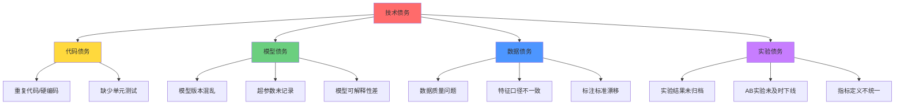

# 与开发团队协作 | Collaborating with Dev Team

> **TL;DR**: AI产品经理与技术团队的高效协作是产品成功的关键。本文深入探讨PM与算法工程师、ML工程师、数据工程师的协作框架，涵盖沟通仪式、技术债务管理、中国科技公司最佳实践，以及如何在飞书项目/PingCode等国产协作工具中建立高效工作流。掌握跨职能协作技巧，将需求转化为可落地的技术方案。

---

## 目录

1. [AI产品团队协作生态](#ai产品团队协作生态)
2. [PM-工程师协作框架](#pm-工程师协作框架)
3. [敏捷仪式的本地化实践](#敏捷仪式的本地化实践)
4. [技术沟通与需求传递](#技术沟通与需求传递)
5. [技术债务管理](#技术债务管理)
6. [中国科技公司协作案例](#中国科技公司协作案例)
7. [协作工具链配置](#协作工具链配置)
8. [常见协作陷阱与解决方案](#常见协作陷阱与解决方案)
9. [术语表](#术语表)
10. [自测题](#自测题)
11. [实战练习](#实战练习)

---

## AI产品团队协作生态

### 团队角色矩阵

在AI产品开发中，PM需要与多类型工程师协作，每种角色有不同的关注点和沟通语言：

```
┌─────────────────────────────────────────────────────────────────┐
│                    AI产品跨职能团队结构                          │
├─────────────────────────────────────────────────────────────────┤
│                                                                 │
│                        产品经理 (PM)                             │
│                    ├─ 用户需求转译者                             │
│                    ├─ 优先级仲裁者                               │
│                    └─ 跨团队协调枢纽                             │
│                            │                                    │
│          ┌─────────────────┼─────────────────┐                  │
│          │                 │                 │                  │
│    算法工程师          ML工程师          数据工程师               │
│    (Algorithm)         (ML Eng)         (Data Eng)              │
│                                                                 │
│  • 模型架构设计      • 模型训练部署      • 数据管道构建          │
│  • 算法优化迭代      • 性能调优监控      • 特征工程实现          │
│  • 论文研究落地      • A/B实验框架      • 数据质量保障          │
│  • 指标定义验证      • 模型版本管理      • 实时数据流处理        │
│                                                                 │
│  关注点:             关注点:             关注点:                │
│  算法精度/创新性     工程稳定性/可维护性  数据可用性/时效性      │
│                                                                 │
│          └─────────────────┬─────────────────┘                  │
│                            │                                    │
│                    前端/后端工程师                               │
│                    • API集成对接                                │
│                    • 用户界面实现                                │
│                    • 系统架构支撑                                │
└─────────────────────────────────────────────────────────────────┘
```

### 协作挑战矩阵

| 协作维度 | AI产品特殊性 | 传统产品对比 | 应对策略 |
|---------|------------|------------|---------|
| **需求确定性** | 模型效果不可预测，需迭代验证 | 功能需求相对明确 | 建立假设验证框架，设置实验阶段 |
| **技术复杂度** | 涉及算法、数据、工程三层架构 | 主要集中在工程实现 | PM需具备基础ML知识，懂模型评估 |
| **迭代周期** | 模型训练需数周，数据准备需数月 | 功能开发以周/月计 | 前置数据准备，并行开发实验 |
| **质量评估** | 离线指标与线上效果存在Gap | 功能测试较为直观 | 建立多阶段评估体系，重视A/B实验 |
| **资源协调** | GPU/数据存储/标注成本高昂 | 主要是人力成本 | 早期资源规划，建立资源池共享机制 |

---

## PM-工程师协作框架

### 三层沟通协议

**教学洞察**：字节跳动某AI产品团队的"三层对齐法"将需求传递效率提升40%，通过分层沟通避免信息失真。

#### 第一层：用户价值层（Why）


**PM职责**：
- 清晰阐述用户场景和痛点
- 定义可量化的业务目标
- 说明为什么这个功能重要（优先级依据）

**示例沟通话术**：
```
【差】"我们需要一个推荐算法"
【优】"用户在首页停留时长仅30秒，跳出率达65%。我们假设通过个性化推荐
      提升内容相关性，目标将停留时长提升至2分钟，跳出率降至40%以下。
      这将直接影响Q2的DAU增长目标（+20%）。"
```

#### 第二层：产品功能层（What）

| 元素 | PM定义 | 工程师参与 | 输出物 |
|------|-------|----------|-------|
| **功能边界** | 核心场景流程 | 技术可行性评估 | PRD功能清单 |
| **交互设计** | 用户操作路径 | 前端实现成本评估 | 原型图+交互说明 |
| **数据需求** | 业务数据定义 | 数据可得性确认 | 数据字典 |
| **性能目标** | 用户体验预期 | 技术指标转化 | SLA清单 |

#### 第三层：技术实现层（How）

**PM放手，工程师主导**：
- 算法选型（Transformer vs CNN vs 混合架构）
- 技术栈选择（TensorFlow vs PyTorch）
- 系统架构设计（在线学习 vs 离线训练）
- 代码实现细节

**PM关键介入点**：
- Review技术方案对产品目标的支撑度
- 确认关键技术决策的用户影响（如模型延迟vs精度权衡）
- 协调跨团队资源（如需要数据团队支持）

---

### 需求评审会议框架（PRD Review）

**教学洞察**：阿里巴巴某AI团队采用"5W2H需求评审法"，将需求返工率从30%降至8%。

```
┌──────────────────────────────────────────────────────────────┐
│                    PRD评审会议议程模板                         │
├──────────────────────────────────────────────────────────────┤
│ 1. Why: 背景与目标 (10分钟)                                   │
│    ├─ 用户痛点数据                                            │
│    ├─ 业务目标与成功指标                                       │
│    └─ 优先级依据                                              │
│                                                              │
│ 2. What: 功能需求 (20分钟)                                    │
│    ├─ 用户故事地图                                            │
│    ├─ 核心功能清单                                            │
│    ├─ 原型演示                                                │
│    └─ 数据需求说明                                            │
│                                                              │
│ 3. How (High-level): 实现探讨 (15分钟)                        │
│    ├─ 技术可行性确认                                          │
│    ├─ 算法方案备选项                                          │
│    ├─ 数据可得性评估                                          │
│    └─ 第三方依赖识别                                          │
│                                                              │
│ 4. When: 里程碑规划 (10分钟)                                  │
│    ├─ MVP范围界定                                             │
│    ├─ 实验阶段划分                                            │
│    └─ 上线时间预期                                            │
│                                                              │
│ 5. Who: 角色分工 (5分钟)                                      │
│    ├─ 算法/ML/数据Owner                                       │
│    ├─ 跨团队依赖联系人                                         │
│    └─ PM对接人                                                │
│                                                              │
│ 6. How much: 资源评估 (5分钟)                                 │
│    ├─ 人力投入预估                                            │
│    ├─ GPU/存储资源需求                                        │
│    └─ 标注/采购成本                                           │
│                                                              │
│ 7. How to verify: 验证方案 (5分钟)                            │
│    ├─ 离线评估指标                                            │
│    ├─ A/B实验设计                                             │
│    └─ 验收标准                                                │
└──────────────────────────────────────────────────────────────┘
```

---

## 敏捷仪式的本地化实践

### 中国科技公司典型Sprint节奏

与硅谷两周Sprint不同，中国AI公司常采用**三周Sprint + 一周Buffer**模式，适应模型训练周期。

```
Week 1              Week 2              Week 3              Week 4
├─────────────────┼─────────────────┼─────────────────┼──────────────┤
│                 │                 │                 │              │
Sprint Planning   数据准备          模型训练          验证+Buffer
│                 Daily Standup     +迭代            │              │
需求拆解          特征工程          │                 Sprint Review
技术方案设计       │                 Code Review      Retro
│                 │                 │                 │              │
└─────────────────┴─────────────────┴─────────────────┴──────────────┘
      ↓                   ↓                 ↓                ↓
   飞书项目            飞书文档           PingCode         飞书会议
   创建迭代            特征文档           提交MR           复盘记录
```

### 敏捷仪式本地化对照表

| 仪式 | 硅谷标准实践 | 中国AI公司实践 | 工具支持 |
|------|------------|--------------|---------|
| **Sprint Planning** | 2-4小时，团队全员 | 半天Workshop，分算法/工程两组分别规划 | 飞书项目看板+飞书妙记录音转文字 |
| **Daily Standup** | 每日15分钟站会 | 异步更新（飞书日报）+ 每周2次同步站会 | 飞书机器人自动收集日报并@风险项 |
| **Code Review** | GitHub PR评审 | 飞书代码评审 + 算法方案评审（单独会议） | 飞书代码仓库 / GitLab + 飞书文档 |
| **Sprint Review** | Demo给Stakeholder | 分两场：技术评审（算法指标）+ 产品评审（用户体验） | 飞书会议 + 飞书文档展示实验结果 |
| **Retrospective** | 团队复盘会 | 融入OKR Review，每月一次深度复盘 | 飞书文档模板 + 匿名反馈问卷 |

### Daily Standup最佳实践

**传统三问题**（传统软件开发）：
1. 昨天做了什么？
2. 今天计划做什么？
3. 遇到什么阻碍？

**AI产品改良版**（适配模型开发节奏）：

```
┌──────────────────────────────────────────────────────┐
│           AI团队Daily Standup五问题框架               │
├──────────────────────────────────────────────────────┤
│ 1. 【进展】当前在哪个阶段？                            │
│    □ 数据准备  □ 特征工程  □ 模型训练  □ 评估优化     │
│                                                      │
│ 2. 【指标】关键指标进展如何？                          │
│    ├─ 算法：AUC/准确率/召回率当前值                   │
│    ├─ 工程：API延迟/QPS/错误率                        │
│    └─ 数据：样本量/覆盖率/标注完成度                   │
│                                                      │
│ 3. 【风险】是否存在技术风险？                          │
│    ├─ 数据质量问题（标注错误率、样本偏差）             │
│    ├─ 模型欠拟合/过拟合                               │
│    ├─ 工程性能瓶颈（内存溢出、训练太慢）               │
│    └─ 依赖阻塞（等待其他团队数据/接口）               │
│                                                      │
│ 4. 【决策】需要PM介入的判断？                          │
│    ├─ 精度vs延迟权衡（如模型压缩）                     │
│    ├─ 范围调整（某子功能技术不可行）                   │
│    └─ 资源申请（需要更多GPU/标注预算）                │
│                                                      │
│ 5. 【协作】需要其他角色支持？                          │
│    ├─ 需要数据工程师修复数据管道                       │
│    ├─ 需要算法专家Code Review                         │
│    └─ 需要前端联调接口                                │
└──────────────────────────────────────────────────────┘
```

**飞书机器人自动化示例**：
```python
# 飞书日报机器人配置（伪代码示意）
daily_standup_template = {
    "title": "AI团队日报 - {date}",
    "sections": [
        {"field": "当前阶段", "type": "single_choice",
         "options": ["数据准备", "特征工程", "模型训练", "评估优化"]},
        {"field": "关键指标", "type": "text",
         "placeholder": "AUC: 0.85 → 0.87 (+2.3%)"},
        {"field": "技术风险", "type": "text",
         "placeholder": "无 / 描述具体风险"},
        {"field": "需PM决策", "type": "text"},
        {"field": "需协作支持", "type": "text"}
    ],
    "auto_reminder": "每日10:00",
    "risk_alert": "如'技术风险'非空，自动@PM和TechLead"
}
```

---

## 技术沟通与需求传递

### 需求翻译的四层模型

**教学洞察**：腾讯某AI产品团队的"四层翻译法"使需求理解偏差率从45%降至12%，关键在于建立"业务语言-产品语言-技术语言"的转换规则。

```
用户语言层 ─────────┐
 "我想要个          │
  智能推荐功能"      │  PM第一次翻译
                    │  ↓
业务需求层 ─────────┤  "提升首页内容点击率至15%以上，
 业务目标           │   通过个性化推荐增强内容相关性"
 成功指标           │
                    │  PM第二次翻译
产品功能层 ─────────┤  ↓
 用户故事           │  "用户打开首页时，系统在500ms内
 交互流程           │   返回10条个性化推荐，点击后跳转
 数据需求           │   详情页，需记录点击行为用于模型优化"
                    │
                    │  工程师翻译
技术实现层 ─────────┘  ↓
 算法方案：基于协同过滤的召回 + GBDT精排
 数据流：用户行为日志 → 特征工程 → 模型预测 → Redis缓存
 接口设计：GET /api/recommend?user_id=xxx&size=10
 性能目标：P99延迟<500ms, QPS>10000
```

### 与算法工程师的沟通清单

| 沟通主题 | PM必须明确的 | 算法工程师期望获得的 | 常见误区 |
|---------|------------|-------------------|---------|
| **问题定义** | 业务目标、成功指标、失败case示例 | 可量化的优化目标（如召回率提升5%） | ❌ "让推荐更精准"（目标不可量化） |
| **数据需求** | 业务字段含义、数据覆盖场景 | 样本量、标注标准、正负样本比例 | ❌ 仅提供字段列表，不说明业务含义 |
| **效果评估** | 线上业务指标（CTR/CVR/留存） | 离线评估指标（AUC/NDCG/F1） | ❌ 只关注离线指标，忽视线上AB实验 |
| **边界条件** | 极端情况的产品逻辑（新用户/冷启动） | 算法兜底策略、默认返回规则 | ❌ 只描述理想情况，不考虑边界 |
| **优先级权衡** | 用户体验优先级（精度vs速度vs多样性） | 模型优化方向的优先级 | ❌ 要求"又快又准又多样"，不做取舍 |

### 技术可行性讨论框架

当PM提出新需求，工程师需要评估可行性时，使用**RICE-T框架**（传统RICE加入Technical维度）：

```
┌─────────────────────────────────────────────────────────┐
│              技术可行性评估 RICE-T 框架                   │
├─────────────────────────────────────────────────────────┤
│ R - Reach (影响范围)                                     │
│   └─ 覆盖多少用户/场景？高频or低频？                      │
│                                                         │
│ I - Impact (影响程度)                                    │
│   └─ 对核心指标的预期提升？高/中/低？                      │
│                                                         │
│ C - Confidence (信心度)                                  │
│   └─ 效果预期的确定性？有无先例/实验数据支撑？             │
│                                                         │
│ E - Effort (工程投入)                                    │
│   └─ 人/周工作量？涉及几个团队？                          │
│                                                         │
│ T - Technical Risk (技术风险)         ← 新增维度          │
│   ├─ 数据可得性：现有数据是否充足？                        │
│   ├─ 算法成熟度：业界有无成熟方案？                        │
│   ├─ 工程复杂度：系统改动规模？                           │
│   └─ 性能约束：延迟/成本是否可接受？                       │
│                                                         │
│ 决策公式:                                                │
│   Priority Score = (R × I × C) / (E × T)                │
│   其中 T (Technical Risk) = 1-5分, 分数越高风险越大       │
└─────────────────────────────────────────────────────────┘
```

**案例：电商平台"以图搜图"功能评估**

| 维度 | 评分 | 说明 |
|------|------|------|
| Reach | 8/10 | 月活用户中20%有该需求 |
| Impact | 7/10 | 预期提升搜索转化率3-5个百分点 |
| Confidence | 6/10 | 竞品有成功案例，但需验证数据 |
| Effort | 6人周 | 算法3周 + 数据2周 + 前端1周 |
| Technical Risk | 3/5 | 图像特征提取成熟，但检索速度是挑战 |
| **Priority Score** | **(8×7×6)/(6×3) = 18.7** | 中高优先级 |

---

## 技术债务管理

### 技术债务分类与PM角色

在AI产品中，技术债务不仅包括代码质量，还涉及模型、数据、实验管理等方面。



### 技术债务决策矩阵

PM需要与工程师共同决策：何时偿还技术债？何时接受债务？

| 债务类型 | 影响 | 偿还时机 | PM决策要点 | 案例 |
|---------|------|---------|-----------|------|
| **致命债务** | 阻碍新功能开发/影响线上稳定 | 立即偿还 | 无需犹豫，优先级最高 | 模型预测服务内存泄漏，每天需重启 |
| **战略债务** | 长期制约产品演进 | 下个季度规划专项 | 评估ROI，设置专门迭代 | 推荐系统架构老旧，无法支持实时个性化 |
| **便利债务** | 提高开发效率 | 工程师自主安排 | 信任工程师判断，不过度干预 | 重构特征工程代码，提升复用性 |
| **可接受债务** | 影响较小，短期内不改 | 排入Backlog，待资源空闲 | 明确不做的原因，避免反复讨论 | 某低频功能的模型精度略低但够用 |

**偿还技术债的Sprint规划建议**：
- **健康比例**：每个Sprint中，70%新功能开发 + 30%技术优化/债务偿还
- **专项迭代**：每季度安排1个Sprint专门做技术升级（如模型架构重构）
- **日常维护**：每个功能迭代预留20%时间写单元测试、补充文档

---

## 中国科技公司协作案例

### 案例1：字节跳动 - 飞书项目驱动的AI产品协作

**背景**：某推荐算法团队（15人）负责今日头条信息流推荐，面临算法迭代与产品需求并行的挑战。

**协作模式**：

```
┌────────────────────────────────────────────────────────────┐
│         飞书项目 - AI团队协作工作流配置                      │
├────────────────────────────────────────────────────────────┤
│                                                            │
│  1. 需求看板（产品视角）                                    │
│     ├─ 待评审 → PM提PRD，@算法Leader评审                   │
│     ├─ 设计中 → 算法方案设计，PM参与技术方案评审             │
│     ├─ 开发中 → 细分为"数据准备/模型训练/工程开发"子任务      │
│     ├─ 实验中 → AB实验配置，每日同步数据                    │
│     └─ 已上线 → 归档，关联效果数据看板                      │
│                                                            │
│  2. 模型看板（算法视角）                                    │
│     ├─ Baseline模型 → 当前线上版本                         │
│     ├─ 实验模型 → 正在训练/验证的候选模型                    │
│     ├─ 待上线模型 → 已通过离线/线上实验，等待全量             │
│     └─ 历史模型 → 归档版本，可随时回滚                      │
│                                                            │
│  3. 数据需求看板（数据工程视角）                             │
│     ├─ 需求收集 → PM/算法提数据需求                         │
│     ├─ 评估中 → 数据可行性、成本评估                        │
│     ├─ 开发中 → ETL任务开发                                │
│     └─ 已上线 → 数据表/特征可用                             │
│                                                            │
│  4. 自动化联动                                             │
│     ├─ 模型训练完成 → 飞书机器人通知PM + 贴实验报告          │
│     ├─ AB实验显著性达标 → 自动@PM决策是否全量               │
│     ├─ 线上指标异常 → 报警推送，关联相关需求卡片             │
│     └─ Sprint结束 → 自动生成数据报表（完成率/Bug率）         │
└────────────────────────────────────────────────────────────┘
```

**成果**：
- 需求响应时间从平均3天缩短至1天
- 模型迭代周期从4周压缩至2.5周
- 跨团队沟通效率提升60%（通过异步协作减少会议）

---

### 案例2：阿里巴巴 - 数据中台驱动的协作体系

**背景**：淘宝搜索团队需要与算法、数据、产品多方协作，数据需求复杂。

**协作创新**：

| 协作挑战 | 传统方式 | 阿里改进方案 | 工具支持 |
|---------|---------|------------|---------|
| **数据需求传递** | PM写文档 → 数据团队排期 → 2周后交付 | 数据中台自助查询 + 标准特征库 | MaxCompute + DataWorks |
| **算法效果对齐** | 算法周报 + PM追问 | 实时实验看板，PM自助查看AB实验数据 | Alink实验平台 + 钉钉推送 |
| **需求优先级争议** | 会议讨论，主观判断 | 用数据说话：影响用户量 × 预期提升 × 实现成本 | 内部优先级计算器工具 |
| **跨BU协作** | 邮件+会议协调 | 标准SLA协议 + 接口人制度 | 钉钉协作群 + PingCode看板 |

**关键机制**：
- **特征库复用**：常用特征（用户画像、商品属性）由数据中台统一维护，算法直接调用，避免重复开发
- **实验平台赋能PM**：PM可自主配置简单的AB实验（如文案/排序权重），无需每次找算法
- **数据SLA**：明确数据团队响应时间（标准需求5天，加急需求2天），超时自动上报

---

### 案例3：小红书 - 算法产品化的敏捷实践

**背景**：内容推荐算法需快速响应运营活动和用户反馈。

**协作亮点**：

```
传统模式（慢）:
需求提出 → PRD评审(3天) → 算法排期(1周) → 开发(2周) → 实验(1周) = 4周+

小红书快速模式:
需求提出 → 快速评估会(30分钟) → 当日启动 → 1周MVP → 边实验边迭代 = 1-2周

实现方式:
┌────────────────────────────────────────────────────┐
│  1. 算法产品化                                      │
│     └─ 将算法能力封装为可配置的产品功能             │
│        例：推荐策略配置后台，PM可调整召回/排序权重   │
│                                                    │
│  2. 小步快跑实验                                    │
│     └─ MVP仅覆盖5%流量，快速验证假设               │
│        1周内看到数据 → 决定是否继续                │
│                                                    │
│  3. PM-算法双周会                                  │
│     └─ 每两周PM批量提需求 + 算法批量反馈效果        │
│        集中决策，减少零散沟通                       │
│                                                    │
│  4. 算法开放日                                     │
│     └─ 每月1次，算法团队展示新技术/新方向           │
│        PM提前储备算法知识，激发产品创新             │
└────────────────────────────────────────────────────┘
```

**成果**：
- 需求响应速度提升50%
- PM对算法能力的理解深度显著提升，提出的需求可行性更高
- 算法团队有更多时间做技术预研，而非疲于应付临时需求

---

## 协作工具链配置

### 飞书项目 + PingCode 双工具策略

| 工具 | 适用场景 | 配置要点 | 集成方式 |
|------|---------|---------|---------|
| **飞书项目** | 敏捷迭代管理、跨团队协作、日常任务 | • 自定义字段：算法指标、实验ID、GPU占用<br>• 自动化规则：状态流转触发通知<br>• 权限管理：数据需求仅数据团队可见 | 与飞书文档、飞书会议深度集成 |
| **PingCode** | 研发全生命周期管理、代码关联、质量追踪 | • 需求-代码-测试追溯<br>• 自动化测试集成<br>• 发布管理与回滚 | 与GitLab、Jenkins CI/CD集成 |

**双工具分工原则**：
- **飞书项目**：偏向产品和业务视角，PM主导
- **PingCode**：偏向研发和工程视角，Tech Lead主导
- **数据同步**：关键里程碑（如"已上线"）自动同步到双平台

### 协作工具集成架构

```
                    ┌──────────────┐
                    │   飞书空间    │
                    │  (协作中枢)   │
                    └───────┬──────┘
                            │
          ┌─────────────────┼─────────────────┐
          │                 │                 │
    ┌─────▼──────┐   ┌──────▼──────┐   ┌─────▼──────┐
    │  飞书项目   │   │  飞书文档    │   │  飞书会议   │
    │  (看板)    │   │  (知识库)   │   │  (同步会)  │
    └─────┬──────┘   └──────┬──────┘   └─────┬──────┘
          │                 │                 │
          │   ┌─────────────▼─────────────┐   │
          │   │      飞书机器人生态         │   │
          │   ├─────────────────────────┤   │
          │   │ • 日报机器人（收集进展）    │   │
          │   │ • 实验机器人（AB结果推送）  │   │
          │   │ • 报警机器人（指标异常）    │   │
          │   │ • 代码审查机器人          │   │
          │   └─────────────┬───────────┘   │
          │                 │                 │
    ┌─────▼──────┐   ┌──────▼──────┐   ┌─────▼──────┐
    │  PingCode  │   │  GitLab     │   │ 实验平台    │
    │  (研发管理) │   │  (代码仓库)  │   │ (AB Test)  │
    └────────────┘   └─────────────┘   └────────────┘
```

### 关键集成配置示例

**1. 飞书项目 → GitLab MR联动**

```yaml
# .gitlab-ci.yml 配置片段
notify_feishu:
  stage: notify
  script:
    - |
      curl -X POST https://open.feishu.cn/open-apis/bot/v2/hook/xxxx \
      -H 'Content-Type: application/json' \
      -d '{
        "msg_type": "interactive",
        "card": {
          "header": {"title": {"text": "代码已合并到主干"}},
          "elements": [{
            "tag": "div",
            "text": {"tag": "lark_md",
                     "content": "**需求**: '$CI_COMMIT_TITLE'\n**开发者**: '$GITLAB_USER_NAME'\n[查看代码]('$CI_PROJECT_URL'/-/merge_requests/'$CI_MERGE_REQUEST_IID')"}
          }]
        }
      }'
  only:
    - merge_requests
```

**2. 实验平台 → 飞书日报自动填充**

```python
# 实验监控脚本（伪代码）
import feishu_api

def check_experiment_significance():
    experiments = get_running_experiments()
    for exp in experiments:
        if exp.is_significant(confidence=0.95):
            feishu_api.send_message(
                chat_id=exp.owner_chat_id,
                content=f"""
                🎉 实验显著性达标！

                **实验名称**: {exp.name}
                **核心指标**: {exp.metric} 提升 {exp.lift}%
                **P-value**: {exp.p_value}
                **建议**: 满足全量上线条件，请PM决策

                [查看详细报告]({exp.dashboard_url})
                """
            )
```

---

## 常见协作陷阱与解决方案

### 陷阱1：需求频繁变更，工程师疲于应对

**症状**：
- 工程师抱怨"需求总是在改"
- 代码反复推倒重来
- 团队士气低落

**根因分析**：
```
表层原因：PM需求不明确
深层原因：
  ├─ 前期用户调研不充分
  ├─ 技术方案评审不深入（未预见技术限制）
  └─ 缺少MVP验证机制（一次性投入太大）
```

**解决方案**：

| 阶段 | 防变更措施 | 负责人 | 检查点 |
|------|----------|-------|-------|
| **需求阶段** | 用户调研 + 竞品分析 + 数据分析三角验证 | PM | PRD评审会必须有用户证据 |
| **设计阶段** | 技术可行性评估 + 原型可用性测试 | PM+工程师 | 设计评审会必须有技术确认 |
| **开发阶段** | MVP先行 + 分阶段上线 | 全员 | 每个阶段有明确验收标准 |
| **上线后** | 数据监控 + 快速迭代（小改进） | PM | 每周Review数据，微调而非大改 |

**变更管理流程**：
```
需求变更申请
    ↓
评估变更影响（工时/风险/优先级）
    ↓
[影响<1人日] → Tech Lead直接批准
[影响1-3人日] → PM + Tech Lead讨论
[影响>3人日] → 需管理层批准，可能延期或砍功能
    ↓
更新PRD + 同步全员 + 调整排期
```

---

### 陷阱2：PM与工程师的"语言鸿沟"

**症状**：
- PM："能不能做个推荐算法？" 工程师："什么类型？协同过滤还是深度学习？"
- 工程师："模型AUC提升到0.85了" PM："这对用户意味着什么？"
- 会议中PM和工程师各说各的，无法对齐

**破解方法：建立"翻译词典"**

| PM语言 | 技术语言 | 业务影响 | 示例对话 |
|-------|---------|---------|---------|
| "推荐更精准" | 召回率 + 精排模型优化 | CTR提升X%，收入增加Y | "我们要将推荐CTR从2%提升至2.5%，这需要优化召回和精排两个环节" |
| "加载速度太慢" | P99延迟 + QPS瓶颈 | 用户流失率降低 | "目前P99延迟800ms，目标降至300ms以下，需优化缓存和模型推理速度" |
| "个性化不够" | 特征覆盖度 + 模型泛化能力 | 长尾用户留存提升 | "新用户冷启动召回不足，需补充内容热度特征和探索策略" |
| "结果不相关" | 召回策略 + 相关性模型 | 用户满意度NPS | "搜索"手机壳"出现了充电器，需调整查询理解和相关性模型" |

**PM必学的5个技术概念**：
1. **召回 vs 排序**：召回是海选（从百万中选千个），排序是精选（从千个排Top10）
2. **离线指标 vs 在线指标**：离线AUC高不代表线上效果好，要看AB实验
3. **P99延迟**：99%的请求响应时间，比平均延迟更能反映用户体验
4. **样本偏差**：训练数据不能代表真实用户分布，导致模型效果差
5. **过拟合 vs 欠拟合**：过拟合是模型太聪明（记住训练数据），欠拟合是太笨（学不到规律）

---

### 陷阱3：技术方案黑盒化，PM无法参与决策

**症状**：
- 工程师："这个方案很复杂，你不懂就别管了"
- PM完全不知道技术进展，只能被动等待
- 技术方案与产品目标脱节

**PM的参与边界**：

```
┌────────────────────────────────────────────────────┐
│           PM在技术决策中的参与层次                   │
├────────────────────────────────────────────────────┤
│                                                    │
│  必须参与 (PM决策)                                  │
│  ├─ 精度vs速度权衡（影响用户体验）                   │
│  ├─ 范围裁剪（某功能技术不可行时的备选方案）          │
│  ├─ 上线时间决策（技术风险vs业务时间窗口）            │
│  └─ 资源投入（是否值得投入2个算法工程师2个月）       │
│                                                    │
│  ────────────────────────────────────────────      │
│                                                    │
│  需要理解 (共同讨论)                                │
│  ├─ 技术方案大方向（如用协同过滤还是深度学习）        │
│  ├─ 数据依赖（需要哪些数据，获取难度）               │
│  ├─ 关键技术风险（可能失败的环节）                   │
│  └─ 里程碑定义（哪些节点可以验证效果）               │
│                                                    │
│  ────────────────────────────────────────────      │
│                                                    │
│  充分信任 (工程师决策)                              │
│  ├─ 算法模型选型细节（BERT vs GPT架构）             │
│  ├─ 代码实现方式（Python还是C++）                   │
│  ├─ 数据库选型（MySQL vs PostgreSQL）              │
│  └─ 工程架构设计（微服务拆分方式）                   │
│                                                    │
└────────────────────────────────────────────────────┘
```

**建立技术方案评审的PM视角**：

PM在技术方案评审会中应该问的5个问题：
1. **这个方案如何支撑产品目标？**（将技术与业务关联）
2. **关键假设是什么？如果假设不成立怎么办？**（识别风险）
3. **有没有更简单的方案先验证？**（倡导MVP思维）
4. **哪些环节可以并行？哪些是阻塞的？**（优化排期）
5. **需要我协调什么资源？**（明确PM的支持责任）

---

## 术语表

| 中文术语 | 英文术语 | 定义 | 使用场景 |
|---------|---------|------|---------|
| **算法工程师** | Algorithm Engineer | 负责模型算法设计和优化的工程师 | "请算法工程师评估推荐模型的召回率提升空间" |
| **ML工程师** | ML Engineer | 负责模型训练、部署和线上服务的工程师 | "ML工程师需确保模型服务的P99延迟在300ms以内" |
| **数据工程师** | Data Engineer | 负责数据管道、特征工程、数据质量保障 | "数据工程师需在本周完成用户行为日志的ETL任务" |
| **召回** | Recall | 从候选集中初步筛选出相关物料的阶段 | "推荐系统的召回层需从百万商品中筛选出1000个候选" |
| **精排** | Ranking | 对召回结果进行精细排序的阶段 | "精排模型使用GBDT对召回的1000个商品排序取Top10" |
| **离线指标** | Offline Metrics | 在历史数据上评估模型的指标（如AUC、NDCG） | "模型离线AUC达到0.85，满足上线标准" |
| **在线指标** | Online Metrics | 真实用户环境下的业务指标（如CTR、留存） | "AB实验显示在线CTR提升2.5%，达到显著性水平" |
| **P99延迟** | P99 Latency | 99%的请求响应时间，衡量系统性能的关键指标 | "推荐接口P99延迟需控制在500ms以内" |
| **特征工程** | Feature Engineering | 将原始数据转化为模型可用的特征的过程 | "特征工程阶段需提取用户近30天的行为序列特征" |
| **模型泛化** | Generalization | 模型在新数据上的表现能力 | "模型在训练集表现好但泛化能力差，存在过拟合" |
| **冷启动** | Cold Start | 新用户/新物料缺少历史数据时的推荐问题 | "新用户冷启动策略采用热度召回+探索机制" |
| **技术债务** | Technical Debt | 为快速交付而采取的次优方案，未来需要偿还 | "这次硬编码了推荐规则，后续需重构为配置化" |
| **MVP** | Minimum Viable Product | 最小可行产品，用最小成本验证核心假设 | "推荐功能MVP仅支持5%流量，验证效果后再全量" |
| **AB实验** | A/B Test | 将用户随机分组，对比不同方案的效果 | "新推荐算法的AB实验显示CTR提升显著（p<0.01）" |
| **SLA** | Service Level Agreement | 服务水平协议，明确响应时间和质量标准 | "数据需求SLA为5个工作日，加急需求2个工作日" |

---

## 自测题

### 选择题

**1. AI产品PM在需求评审会中，以下哪个行为是错误的？**
A. 详细阐述用户痛点和业务目标
B. 要求算法工程师当场确定使用哪个深度学习框架
C. 与工程师讨论技术方案的大方向和关键风险
D. 明确需求的优先级和验收标准

<details>
<summary>查看答案</summary>

**答案：B**

解析：深度学习框架选型（TensorFlow vs PyTorch）属于工程师自主决策范围，PM不应干预具体技术选型。PM应关注技术方案对产品目标的支撑度，而非技术实现细节。正确做法是询问"这个技术选择对我们的产品目标有什么影响？"而非直接参与工具选型决策。

</details>

---

**2. 在Daily Standup中，算法工程师报告"模型AUC从0.80提升到0.85"，作为PM你应该追问什么？**
A. 是用了什么新算法提升的？
B. 这个提升对线上业务指标（如CTR）预期有多大影响？
C. 为什么不能提升到0.90？
D. 训练用了多少GPU？

<details>
<summary>查看答案</summary>

**答案：B**

解析：PM应关注技术指标与业务指标的关联。离线AUC提升不一定带来线上效果提升，需要通过AB实验验证。A选项过于技术细节，C选项不切实际，D选项是资源管理问题但不是站会重点。正确做法是将技术进展转化为业务价值预期。

</details>

---

**3. 以下哪种技术债务应该立即偿还？**
A. 推荐系统代码有大量重复，但功能正常
B. 模型预测服务存在内存泄漏，每天需要手动重启
C. 某低频功能的算法精度略低，但用户几乎没有投诉
D. 特征工程代码缺少注释，但核心开发者还在团队

<details>
<summary>查看答案</summary>

**答案：B**

解析：内存泄漏导致每天需手动重启属于"致命债务"，直接影响线上稳定性和团队效率，必须立即修复。A属于"便利债务"，C属于"可接受债务"，D属于"战略债务"，都可以根据资源情况安排，但B不能拖延。

</details>

---

### 简答题

**4. 某PM向算法团队提需求："做一个智能推荐功能，让用户觉得推荐的内容更精准"。算法工程师回复："需求太模糊，无法评估"。请用"四层翻译模型"改写这个需求。**

<details>
<summary>查看答案要点</summary>

**改写示例**：

**用户语言层**：
用户反馈首页内容"不感兴趣"的比例高达40%，平均停留时长仅35秒。

**业务需求层**：
通过个性化推荐降低"不感兴趣"点击率至20%以下，提升首页停留时长至90秒以上，最终目标是提升次日留存率3个百分点（从52%到55%）。

**产品功能层**：
- 用户打开首页时，系统根据用户历史行为（浏览/点赞/收藏）推荐10条内容
- 推荐结果需在500ms内返回，支持下拉刷新
- 用户对推荐内容的"不感兴趣"操作需实时反馈到模型
- 需支持冷启动：新用户基于注册信息（年龄/性别/兴趣标签）推荐

**技术实现层**（由工程师补充）：
- 召回策略：协同过滤 + 内容标签匹配 + 热度召回
- 排序模型：GBDT或深度学习模型
- 特征：用户画像（30+维）+ 内容特征（50+维）+ 交互特征（点击序列）
- 性能目标：P99延迟<500ms, QPS>5000

</details>

---

**5. 团队在Sprint Review中发现，某推荐功能的离线AUC很高（0.88），但线上AB实验CTR提升不显著（仅+0.3%，p=0.12）。作为PM，你会如何分析这个问题并推动下一步行动？**

<details>
<summary>查看答案要点</summary>

**问题分析**：

1. **样本偏差**：
   - 离线训练数据可能不能代表真实用户分布
   - 检查：训练数据时间范围、用户群体是否与线上一致

2. **评估指标不对齐**：
   - AUC衡量的是排序能力，CTR是业务指标，两者不一定正相关
   - 可能模型排序准了，但召回质量差

3. **线上环境差异**：
   - 特征穿越（训练时用了未来数据）
   - 线上特征缺失或延迟

4. **实验设计问题**：
   - 流量太小（统计功效不足）
   - 实验时间太短（用户行为未充分沉淀）

**下一步行动**：
1. 与算法团队分析离线/线上特征一致性
2. 扩大AB实验流量至20%，延长实验至2周
3. 增加多维度指标监控（不只看CTR，还看留存、互动率）
4. 如仍不显著，考虑调整召回策略或探索其他优化方向

</details>

---

## 实战练习

### 练习1：设计Daily Standup飞书机器人

**场景**：你负责一个15人的AI推荐团队，包括5名算法工程师、3名ML工程师、4名后端工程师、3名前端工程师。传统的站会效率低下，经常超时到30分钟以上。

**任务**：
1. 设计一个飞书日报机器人的表单模板（包含哪些字段？）
2. 定义触发PM介入的自动化规则（什么情况下机器人会@PM？）
3. 如何通过机器人实现异步站会（减少同步会议时间）？

**提示**：
- 参考文中"AI团队Daily Standup五问题框架"
- 考虑不同角色关注的核心信息（算法关注指标，工程关注进度）
- 设计风险预警机制

---

### 练习2：技术债务优先级排序

**场景**：你的团队积累了以下技术债务，下个Sprint只有30%的时间（约3人周）可以用于偿还债务。请排序并说明理由。

| 编号 | 债务描述 | 预估工作量 | 影响 |
|------|---------|----------|------|
| A | 推荐模型版本管理混乱，没有统一的模型注册中心 | 5人天 | 难以追溯历史模型，回滚困难 |
| B | 数据特征管道存在性能瓶颈，每日处理耗时6小时 | 3人天 | 影响特征更新时效，但不阻塞新功能 |
| C | 线上推荐服务偶现5xx错误，发生率0.1% | 2人天 | 影响用户体验，但概率低 |
| D | 推荐算法代码缺少单元测试，覆盖率仅20% | 8人天 | 代码改动风险高，但现在没出问题 |
| E | 前端推荐组件代码重复，维护成本高 | 4人天 | 影响开发效率，但不影响用户 |

**任务**：
1. 按优先级排序这5个债务（从高到低）
2. 说明排序理由（使用文中的技术债务决策矩阵）
3. 在3人周预算内，选择偿还哪些债务？

---

### 练习3：PRD评审会模拟

**场景**：你负责电商APP的"以图搜图"功能，准备在PRD评审会上与算法团队对齐。

**背景数据**：
- 当前搜索转化率：2.5%
- 竞品（淘宝/京东）已有该功能，用户反馈良好
- 用户调研显示：35%的用户有"看到实物想搜同款"的需求

**任务**：
请准备PRD评审会的讲稿大纲，包括：
1. Why部分：如何阐述用户痛点和业务目标？
2. What部分：核心功能清单（至少5条用户故事）
3. How部分：提前准备哪些技术问题与算法团队讨论？
4. 验收标准：定义哪些关键指标来判断功能成功？

**额外挑战**：
算法工程师在会上提出："图像检索的精度和速度难以兼顾，需要PM在两者之间做权衡。"你会如何回答？

---

### 练习4：跨团队协作流程设计

**场景**：你的推荐算法团队（Team A）需要数据团队（Team B）提供用户实时行为特征，但两个团队汇报线不同，协作经常延迟。

**问题现状**：
- 数据需求响应慢：平均2周才交付
- 需求理解偏差：交付的数据字段不符合预期
- 缺少SLA：无法预测数据何时可用

**任务**：
设计一套跨团队协作流程，包括：
1. **需求提交模板**：PM向数据团队提需求时，必须包含哪些信息？
2. **评估标准**：数据团队如何快速评估需求的优先级和工作量？
3. **SLA定义**：不同类型需求的响应时间标准是什么？
4. **工具支持**：在飞书/PingCode中如何配置看板和自动化规则？

**参考**：文中"阿里巴巴数据中台协作案例"

---

**练习提示**：这些练习没有标准答案，重点是训练PM的协作思维和方案设计能力。建议：
1. 先独立思考20分钟，写下你的方案
2. 与团队成员讨论，收集反馈
3. 对照文中的框架和案例，反思自己方案的不足
4. 在实际工作中尝试应用，持续迭代优化

---

## 总结

AI产品经理与开发团队的高效协作，本质上是**建立共同语言、对齐目标预期、设计高效机制**的过程。关键要点：

1. **分层沟通**：PM掌握用户价值层和产品功能层，工程师主导技术实现层，在功能层充分对齐
2. **敏捷本地化**：适配中国AI公司节奏，异步为主（飞书日报）+ 同步为辅（关键会议）
3. **技术债管理**：接受必要的债务，但要主动规划偿还，健康比例是70%新功能+30%优化
4. **工具赋能**：善用飞书/PingCode等国产工具，通过自动化减少低效沟通
5. **持续学习**：PM需懂基础ML知识，工程师需理解业务目标，双向奔赴

记住：**最好的协作不是PM变成工程师，也不是工程师变成PM，而是建立高效的翻译机制和信任关系。**

---

*本文档版本：v1.0 | 最后更新：2026年1月 | 作者：Microsoft AI PM Certificate 课程组*