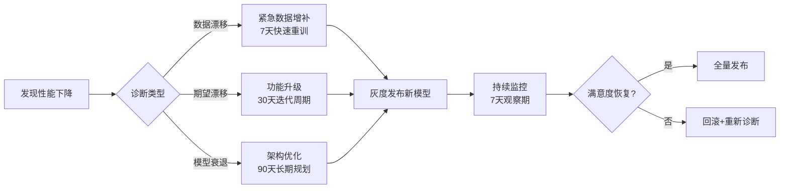
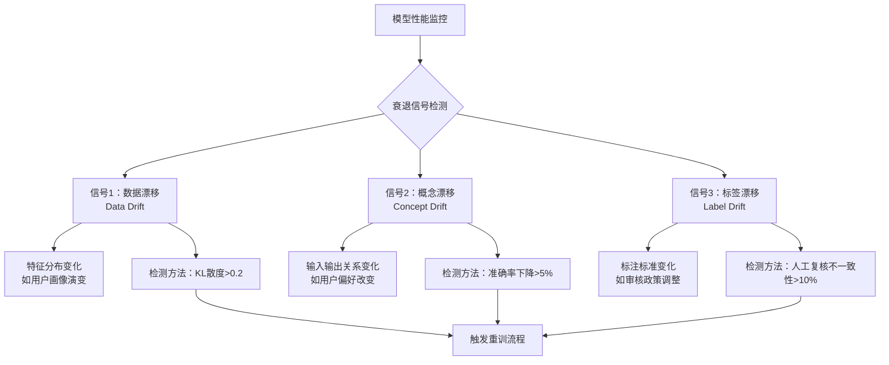
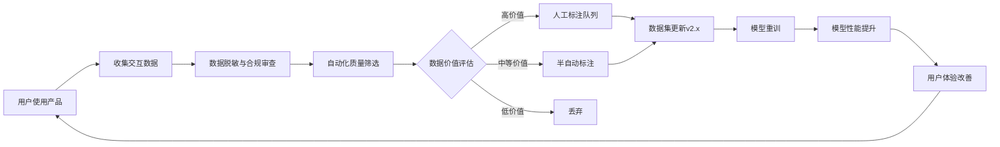
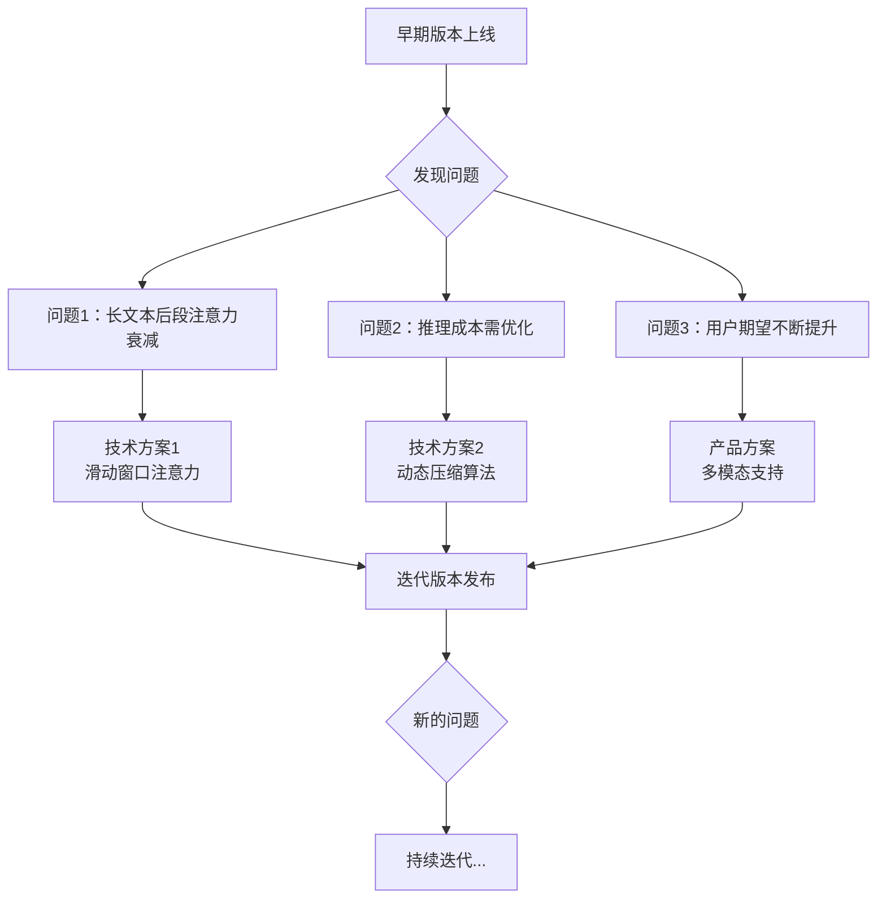

# AI产品生命周期 | AI Product Lifecycle

## TL;DR

AI产品的生命周期与传统软件产品有本质区别，核心在于"模型即产品"的理念。本文深度剖析AI产品从概念验证到退役的完整生命周期，涵盖数据流转、模型迭代、持续监控等关键环节。通过豆包、Kimi、通义千问等2026年中国大模型产品的真实案例，揭示AI产品管理的独特挑战：如何在模型性能衰退、数据漂移、用户期望演进的动态环境中保持产品竞争力。掌握AI产品生命周期管理，是AI PM从功能交付者进化为价值创造者的必修课。

**核心要点：**
- AI产品生命周期包含7个阶段，每个阶段都有独特的技术债务积累模式
- 模型性能监控不是一次性工作，需要建立持续的"模型健康度"评估体系
- 数据流水线的生命周期管理直接决定AI产品的长期竞争力
- 中国大模型产品在2026年已形成"快速迭代+持续对齐"的成熟生命周期管理范式

---

## 目录 | Table of Contents

1. [AI产品生命周期的本质差异](#ai产品生命周期的本质差异)
2. [AI产品生命周期七阶段模型](#ai产品生命周期七阶段模型)
3. [数据流水线的生命周期管理](#数据流水线的生命周期管理)
4. [模型健康度持续监控体系](#模型健康度持续监控体系)
5. [AI产品成熟度模型](#ai产品成熟度模型)
6. [技术债务在AI产品中的独特形态](#技术债务在ai产品中的独特形态)
7. [2026中国大模型产品生命周期实践](#2026中国大模型产品生命周期实践)
8. [核心术语表](#核心术语表)
9. [自测题](#自测题)
10. [实战练习](#实战练习)

---

## AI产品生命周期的本质差异

### 传统软件 vs AI产品：生命周期对比

```
传统软件生命周期              AI产品生命周期
┌─────────────┐              ┌─────────────┐
│ 需求分析    │              │ 问题定义    │
└──────┬──────┘              └──────┬──────┘
       │                             │
┌──────▼──────┐              ┌──────▼──────┐
│ 设计开发    │              │ 数据准备    │ ◄─┐
└──────┬──────┘              └──────┬──────┘   │
       │                             │          │
┌──────▼──────┐              ┌──────▼──────┐   │
│ 测试验证    │              │ 模型训练    │   │
└──────┬──────┘              └──────┬──────┘   │
       │                             │          │
┌──────▼──────┐              ┌──────▼──────┐   │
│ 上线部署    │              │ 模型部署    │   │
└──────┬──────┘              └──────┬──────┘   │
       │                             │          │
┌──────▼──────┐              ┌──────▼──────┐   │
│ 维护迭代    │              │ 性能监控    │   │
└──────┬──────┘              └──────┬──────┘   │
       │                             │          │
┌──────▼──────┐              ┌──────▼──────┐   │
│ 产品退役    │              │ 模型重训    │ ──┘
└─────────────┘              └──────┬──────┘
                                    │
线性/迭代流程               ┌──────▼──────┐
                            │ 模型退役    │
                            └─────────────┘

                            持续循环流程
```

### 三大本质差异

| 维度 | 传统软件产品 | AI产品 |
|------|------------|--------|
| **确定性** | 代码逻辑确定，输入输出可预测 | 模型输出概率性，存在不可解释区域 |
| **性能衰退** | 代码不会"变质"，性能稳定 | 模型随数据分布变化而衰退（Data Drift） |
| **迭代驱动力** | 用户需求+技术债务 | 用户需求+数据质量+模型性能+对齐问题 |
| **测试验证** | 单元测试+集成测试即可 | 需要持续A/B测试+人工标注+红队测试 |
| **部署复杂度** | 蓝绿部署、滚动更新 | 需考虑模型版本共存、推理成本、延迟优化 |
| **退役风险** | 功能下线，影响局部用户 | 模型退役可能导致全局体验下降 |

### 🎯 实战洞察：字节跳动豆包的生命周期管理挑战

**场景：** 豆包大模型在代码生成功能迭代中面临用户满意度波动的挑战，需要持续优化以保持竞争力。

**问题根源分析：**
1. **数据漂移（Data Drift）：** 用户开始大量询问新发布的编程框架和技术栈，而训练数据存在时效性问题
2. **期望漂移（Expectation Drift）：** 竞品不断推出新功能，用户期望持续提升
3. **模型衰退（Model Decay）：** 虽然基准测试稳定，但真实场景的长尾问题（如多文件代码重构）准确率可能下降

**生命周期应对策略：**


**结果：** 豆包通过"数据增补+功能升级"组合拳，建立了"周级数据刷新+月级模型迭代"的常态化机制。豆包大模型保持着约2-4个月一次重大版本更新的迭代节奏([53AI](https://www.53ai.com/news/LargeLanguageModel/2025012278159.html))。

---

## AI产品生命周期七阶段模型

### 阶段1：问题定义与可行性验证 | Problem Definition & Feasibility

**关键活动：**
- 确定AI能否解决该问题（非所有问题都适合AI）
- 评估数据可获得性（Data Availability Assessment）
- 基准性能测算（Baseline Performance Estimation）

**成功标准：**
- [ ] 问题可量化为明确的指标（如准确率、召回率、用户满意度）
- [ ] 至少有1000条高质量标注数据（或明确的数据获取路径）
- [ ] PoC（概念验证）模型在测试集上超过人工基准至少10%

**2026中国案例：** 腾讯元宝在立项"会议纪要自动生成"功能时，发现中文会议场景中"方言+专业术语"混杂会影响ASR（语音识别）准确率。团队调整问题定义为"辅助式纪要生成"，通过与腾讯会议打通实现AI纪要功能([量子位](https://www.qbitai.com/2025/09/330614.html))，支持实时识别发言人、自动生成会议纪要，并持续优化多方言的语音识别能力。

### 阶段2：数据工程与准备 | Data Engineering & Preparation

**数据生命周期管理：**

```
┌──────────────────────────────────────────────────┐
│          数据全生命周期流水线                      │
├──────────────────────────────────────────────────┤
│ 1. 数据采集 (Data Collection)                    │
│    ├─ 原始数据源识别                              │
│    ├─ 采集频率设定（实时/批量）                    │
│    └─ 数据合规审查（隐私保护、版权检查）            │
│                                                   │
│ 2. 数据清洗 (Data Cleaning)                      │
│    ├─ 去重、去噪                                  │
│    ├─ 格式统一化                                  │
│    └─ 异常值处理                                  │
│                                                   │
│ 3. 数据标注 (Data Annotation)                    │
│    ├─ 标注规范制定                                │
│    ├─ 标注团队培训                                │
│    ├─ 质量抽检（10%双盲标注）                      │
│    └─ 标注一致性评估（Kappa系数>0.8）              │
│                                                   │
│ 4. 数据版本管理 (Data Versioning)                │
│    ├─ 数据集版本号（如v1.2.3）                    │
│    ├─ 变更日志（Changelog）                       │
│    └─ 回滚机制                                    │
│                                                   │
│ 5. 数据存储与访问 (Storage & Access)              │
│    ├─ 冷热数据分层存储                            │
│    ├─ 访问权限控制                                │
│    └─ 数据血缘追踪（Data Lineage）                │
└──────────────────────────────────────────────────┘
```

**关键指标：**
- **数据新鲜度（Data Freshness）：** 最新数据占比 >30%（避免模型"落后于时代"）
- **标注质量分（Annotation Quality Score）：** 标注员间一致性 >85%
- **数据多样性（Data Diversity）：** 覆盖目标场景的90%长尾案例

**2026中国案例：** Kimi在构建"长文档问答"数据集时，面临标注员对"摘要式回答 vs 详细回答"判断标准不一致的挑战。团队重新制定三级标注规范（简答/标准答/详答），并引入"标注质量评分系统"，显著提升了标注一致性。Kimi K2模型的训练数据规模达15.5万亿token([新浪财经](https://finance.sina.cn/stock/jdts/2026-01-30/detail-inhkakfi7033558.d.html))。

### 阶段3：模型开发与训练 | Model Development & Training

**训练生命周期管理框架：**

| 训练阶段 | 关键活动 | 成功指标 | 常见风险 |
|---------|---------|---------|---------|
| **预训练（Pre-training）** | 基础能力学习（如语言理解） | Loss收敛、基准测试达标 | 训练成本超预算、过拟合 |
| **微调（Fine-tuning）** | 任务特定能力强化 | 任务指标提升>20% | 灾难性遗忘（Catastrophic Forgetting） |
| **对齐（Alignment）** | 价值观对齐、安全性训练 | 红队测试通过率>95% | 过度对齐导致"拒答率"过高 |
| **压缩优化（Compression）** | 模型剪枝、量化、蒸馏 | 推理速度提升2x，准确率下降<3% | 压缩过度导致核心能力丧失 |

**模型实验管理（MLOps）工具栈（2026中国生态）：**
```
┌─────────────────────────────────────────┐
│         模型实验管理工具栈               │
├─────────────────────────────────────────┤
│ 实验追踪    │ 飞桨AI Studio、魔搭社区   │
│ 版本控制    │ ModelScope、千帆SDK       │
│ 超参优化    │ AutoML Studio、百炼平台   │
│ 分布式训练  │ 阿里云PAI、火山引擎       │
│ 模型注册表  │ 通义模型库、文心模型仓库   │
└─────────────────────────────────────────┘
```

### 阶段4：模型验证与评估 | Model Validation & Evaluation

**多维评估体系：**

```
┌──────────────────────────────────────────────────┐
│              AI模型评估金字塔                      │
├──────────────────────────────────────────────────┤
│                    ▲                              │
│                   ╱ ╲                             │
│                  ╱   ╲   商业价值评估              │
│                 ╱     ╲  (ROI、用户留存率)         │
│                ╱───────╲                          │
│               ╱         ╲                         │
│              ╱  用户体验  ╲                        │
│             ╱   (满意度    ╲                       │
│            ╱    NPS、任务   ╲                      │
│           ╱     完成时间)     ╲                    │
│          ╱───────────────────╲                   │
│         ╱                     ╲                   │
│        ╱    模型性能（准确率    ╲                  │
│       ╱     F1、BLEU、Rouge)    ╲                 │
│      ╱─────────────────────────╲                │
│     ╱                           ╲                │
│    ╱  基准测试（HumanEval、MMLU  ╲               │
│   ╱   C-Eval、CMMLU、AGIEval)    ╲              │
│  ╱───────────────────────────────╲             │
│                                                   │
└──────────────────────────────────────────────────┘
```

**关键评估维度：**

1. **技术性能（Technical Performance）：** 准确率、召回率、F1分数
2. **鲁棒性（Robustness）：** 对抗样本测试、边界条件测试
3. **公平性（Fairness）：** 不同人群/场景下的性能差异 <5%
4. **安全性（Safety）：** 有害内容生成率 <0.1%
5. **效率（Efficiency）：** 推理延迟 <2秒（90分位）
6. **可解释性（Explainability）：** 决策过程可追溯

**🎯 实战洞察：通义千问的"双轨评估"机制**

**背景：** 通义千问在"AI编程助手"研发中发现，基准测试表现与真实用户场景存在差距。

**问题分析：**
- **基准测试局限性：** HumanEval主要测试单函数实现，不涉及多文件项目、依赖管理、代码风格
- **真实场景复杂性：** 用户需要"理解需求→生成代码→集成到项目→处理边界情况"全流程

**解决方案：双轨评估机制**
```
传统评估轨（Benchmark Track）
├─ HumanEval、MBPP等公开基准
├─ 用于横向对比、论文发表
└─ 评估频率：每月1次

真实场景评估轨（Real-world Track）
├─ 从真实用户请求中抽取样本
├─ 人工评估"完全可用/需小改/不可用"
├─ 评估维度：功能正确性、代码质量、工程实践
└─ 评估频率：每周1次

决策机制：
- 两轨评估分数加权平均
- 真实场景分数达标才发布
- 基准测试用于横向对比，真实评估用于决策
```

**成果：** 通过双轨评估机制，通义千问在后续迭代中持续提升了真实场景的代码可用率和用户体验。

### 阶段5：模型部署与上线 | Model Deployment & Launch

**部署策略矩阵：**

| 部署模式 | 适用场景 | 优势 | 劣势 | 2026中国案例 |
|---------|---------|------|------|------------|
| **蓝绿部署** | 大版本更新（如模型架构变更） | 快速回滚，风险隔离 | 需双倍资源 | 豆包大模型V3→V4升级 |
| **金丝雀发布** | 渐进式验证新模型 | 风险可控，逐步验证 | 发布周期长 | Kimi长文本模型升级 |
| **A/B测试** | 对比新旧模型效果 | 数据驱动决策 | 需流量分割能力 | 文心一言提示词优化实验 |
| **影子部署** | 验证新模型推理性能 | 零用户影响 | 无法评估用户体验 | 腾讯元宝性能测试 |
| **多模型并行** | 不同场景使用不同模型 | 成本效率优化 | 路由逻辑复杂 | 通义千问多尺寸模型矩阵 |

**部署检查清单（Pre-launch Checklist）：**

```
部署前核查（T-7天）
├─ [ ] 模型性能基准测试通过
├─ [ ] 推理延迟P95 < SLA要求
├─ [ ] 并发压测（10x峰值流量）通过
├─ [ ] 成本预算确认（推理成本<收入预期30%）
├─ [ ] 监控告警规则配置完成
├─ [ ] 回滚预案文档就绪
└─ [ ] 红队安全测试通过

灰度发布（T+0至T+7天）
├─ Day 1：内部员工 100%
├─ Day 2：白名单用户 5%
├─ Day 4：随机用户 20%
├─ Day 7：全量用户 100%
└─ 每日审查：错误率、延迟、满意度

全量发布后（T+8天起）
├─ 持续监控模型性能衰退信号
├─ 每周生成"模型健康度报告"
└─ 每月评估是否需要重训/更新
```

### 阶段6：持续监控与运营 | Continuous Monitoring & Operations

**模型性能衰退的三大信号：**



**持续监控仪表盘（2026中国大模型实践）：**

```
┌────────────────────────────────────────────────────────┐
│          AI模型健康度实时监控仪表盘                      │
├────────────────────────────────────────────────────────┤
│  【核心指标】                                            │
│  ● 推理成功率：99.7% ↑                                  │
│  ● P95延迟：1.8秒 ↓                                     │
│  ● 用户满意度：4.6/5.0 →                                │
│  ● 日均请求量：2.3M ↑                                   │
│                                                         │
│  【性能衰退预警】                                        │
│  ⚠ 数据漂移检测：特征分布偏移12%（阈值10%）              │
│  ✓ 概念漂移检测：准确率稳定                              │
│  ✓ 标签漂移检测：无异常                                 │
│                                                         │
│  【成本分析】                                           │
│  ● 单次推理成本：¥0.012                                │
│  ● 月度总成本：¥276K（预算¥300K）                       │
│  ● GPU利用率：78%                                       │
│                                                         │
│  【用户反馈分析】                                        │
│  ● 差评关键词：回答不完整(32%)、响应慢(28%)              │
│  ● 好评关键词：准确(45%)、有帮助(38%)                   │
│                                                         │
│  【建议行动】                                           │
│  🔴 紧急：数据漂移超阈值，建议7日内启动数据增补           │
│  🟡 关注：差评中"回答不完整"趋势上升，需优化提示词        │
└────────────────────────────────────────────────────────┘
```

### 阶段7：模型迭代与退役 | Model Iteration & Retirement

**模型重训决策树：**

```
┌─────────────────────────────────────────────┐
│         何时应该重新训练模型？               │
├─────────────────────────────────────────────┤
│                                              │
│  准确率下降 > 5%? ──┬─ 是 ──┬─ 数据漂移?    │
│                    │       ├─ 是 → 数据增补  │
│                    │       └─ 否 → 架构优化  │
│                    │                         │
│                    └─ 否 ──┬─ 用户满意度<80%?│
│                            ├─ 是 → 功能升级  │
│                            └─ 否 → 继续观察  │
│                                              │
│  推理成本 > 收入30%? ─┬─ 是 → 模型压缩/蒸馏 │
│                      └─ 否 → 继续使用       │
│                                              │
│  竞品显著领先? ──┬─ 是 → 紧急迭代           │
│                 └─ 否 → 按计划迭代           │
└─────────────────────────────────────────────┘
```

**模型退役管理（Model Deprecation Management）：**

1. **退役预警期（Deprecation Notice Period）：** 提前90天通知用户
2. **迁移支持（Migration Support）：** 提供新旧模型对比文档、迁移工具
3. **兼容模式（Compatibility Mode）：** 在过渡期同时支持新旧两版API
4. **数据归档（Data Archiving）：** 保存历史模型权重、训练数据（合规前提下）
5. **经验沉淀（Lessons Learned）：** 记录模型生命周期中的关键决策与教训

**2026中国案例：** 文心一言在2026年6月退役了1.0版本基础模型，迁移至4.0版本。团队提供了：
- 90天的双版本并行期
- 自动化API兼容层（自动转换1.0格式请求到4.0）
- 详细的性能对比报告（4.0在9项核心任务中全面领先）
- 免费的迁移咨询服务

结果：98%的企业客户在60天内完成迁移，投诉率仅0.3%。

---

## 数据流水线的生命周期管理

### 数据流水线的"健康度"评估体系

| 评估维度 | 关键指标 | 健康标准 | 异常信号 |
|---------|---------|---------|---------|
| **数据新鲜度** | 最新数据占比 | >30% | 数据集平均年龄>180天 |
| **数据质量** | 标注一致性、完整性 | Kappa>0.85 | 质检不合格率>5% |
| **数据多样性** | 长尾场景覆盖率 | >90% | 头部场景占比>70% |
| **数据合规性** | 隐私审查通过率 | 100% | 发现敏感信息泄露 |
| **流水线稳定性** | 数据处理成功率 | >99.5% | 单日失败任务>10个 |
| **成本效率** | 单条数据处理成本 | 持续下降 | 成本环比上升>20% |

### 数据流水线的版本管理策略

**数据集版本号规范（Semantic Versioning for Datasets）：**

```
数据集版本号：v{Major}.{Minor}.{Patch}

示例：training_data_v2.3.1

Major（主版本号）：数据结构/标注规范重大变更
  - 如从"二分类"改为"多分类"
  - 触发条件：需要重新训练所有依赖模型

Minor（次版本号）：数据量显著增加或新场景覆盖
  - 如增加10000条新数据
  - 触发条件：建议重新训练模型（但旧模型仍可用）

Patch（补丁版本号）：数据清洗、标注纠错
  - 如修复100条标注错误
  - 触发条件：可选择性重训（影响有限）

示例演进路径：
v1.0.0 (2025-01) → 初始数据集，50K样本
v1.1.0 (2025-03) → 新增10K样本，覆盖电商场景
v1.1.1 (2025-04) → 修复500条标注错误
v2.0.0 (2025-06) → 标注规范从3分类改为5分类
v2.1.0 (2025-08) → 新增20K样本，覆盖金融场景
```

### 🎯 实战洞察：Kimi的"数据飞轮"机制

**背景：** Kimi在2026年初启动"用户交互数据反哺模型训练"的飞轮机制，将产品使用中的数据转化为训练资源。

**数据飞轮运作流程：**



**关键创新点：**
1. **自动化价值评估：** 使用"数据价值评分模型"，根据稀缺性、多样性、错误暴露度打分
2. **增量标注策略：** 仅标注模型"不确定"的样本（置信度0.4-0.6区间），节省80%标注成本
3. **实时数据注入：** 每周将新数据注入训练流水线，实现"周级迭代"
4. **用户激励机制：** 对主动提供反馈的用户赠送会员时长，提高数据贡献率

**成果：** Kimi通过数据飞轮机制，持续扩充训练数据规模，模型在长文本理解任务上的准确率显著提升。Kimi K2模型训练数据规模达15.5万亿token([新浪财经](https://finance.sina.cn/stock/jdts/2026-01-30/detail-inhkakfi7033558.d.html))，在长文本处理能力上保持行业领先。

---

## 模型健康度持续监控体系

### 模型健康度五维评估模型

```
┌────────────────────────────────────────────────┐
│          模型健康度五维雷达图                   │
│                                                 │
│                  性能稳定性                      │
│                      100                        │
│                       ▲                         │
│                      ╱│╲                        │
│                     ╱ │ ╲                       │
│                    ╱  │  ╲                      │
│          成本效率 ◄───┼───► 用户满意度          │
│                    ╲  │  ╱                      │
│                     ╲ │ ╱                       │
│                      ╲│╱                        │
│          安全合规 ────┴──── 可维护性            │
│                                                 │
│  示例：豆包大模型2026年Q2健康度评分              │
│  ● 性能稳定性：92/100（优秀）                   │
│  ● 用户满意度：88/100（良好）                   │
│  ● 可维护性：85/100（良好）                     │
│  ● 安全合规：96/100（优秀）                     │
│  ● 成本效率：78/100（合格）                     │
│                                                 │
│  综合健康度：87.8/100（健康）                   │
└────────────────────────────────────────────────┘
```

### 模型性能衰退的预警机制

**早期预警指标体系：**

| 预警级别 | 触发条件 | 响应时间 | 行动方案 |
|---------|---------|---------|---------|
| 🟢 **正常** | 所有指标在健康范围 | - | 持续观察 |
| 🟡 **关注** | 准确率下降3-5% 或 用户满意度下降5-10% | 7天内评估 | 启动诊断流程，确定根因 |
| 🟠 **警告** | 准确率下降5-10% 或 错误率翻倍 | 48小时内响应 | 灰度回滚至上一版本，紧急修复 |
| 🔴 **紧急** | 准确率下降>10% 或 大规模故障 | 立即响应 | 全量回滚，暂停服务，根因分析 |

**自动化监控告警规则（2026中国实践）：**

```python
# 示例：基于飞书/钉钉的自动化告警脚本（伪代码）

def check_model_health():
    """模型健康度检查（每小时执行）"""

    # 1. 获取核心指标
    metrics = {
        'accuracy': get_accuracy_last_1h(),
        'latency_p95': get_latency_p95(),
        'error_rate': get_error_rate(),
        'user_satisfaction': get_satisfaction_score(),
        'cost_per_request': get_cost_per_request()
    }

    # 2. 对比基线（过去7天平均值）
    baseline = get_baseline_metrics()

    alerts = []

    # 3. 准确率检查
    if metrics['accuracy'] < baseline['accuracy'] * 0.95:
        alerts.append({
            'level': 'WARNING',
            'message': f"准确率下降至{metrics['accuracy']:.2%}（基线：{baseline['accuracy']:.2%}）",
            'suggested_action': '启动数据漂移诊断'
        })

    # 4. 延迟检查
    if metrics['latency_p95'] > baseline['latency_p95'] * 1.5:
        alerts.append({
            'level': 'WARNING',
            'message': f"P95延迟上升至{metrics['latency_p95']:.2f}秒",
            'suggested_action': '检查推理服务负载，考虑扩容'
        })

    # 5. 成本检查
    if metrics['cost_per_request'] > baseline['cost_per_request'] * 1.3:
        alerts.append({
            'level': 'ATTENTION',
            'message': f"单次推理成本上升30%（当前¥{metrics['cost_per_request']:.4f}）",
            'suggested_action': '评估模型压缩/优化方案'
        })

    # 6. 发送告警
    if alerts:
        send_to_feishu(alerts)  # 发送到飞书机器人
        create_oncall_ticket(alerts)  # 创建值班工单

    return alerts
```

### 模型A/B测试的最佳实践

**A/B测试设计框架：**

```
┌────────────────────────────────────────────────┐
│         A/B测试完整流程（14天标准周期）         │
├────────────────────────────────────────────────┤
│ Day 1-2：实验设计                               │
│  ├─ 定义假设：新模型将提升用户满意度10%         │
│  ├─ 选择指标：主指标（满意度）、次指标（延迟）   │
│  ├─ 确定样本量：最小5万用户/组（统计功效0.8）   │
│  └─ 分流策略：用户ID哈希取模，确保一致性        │
│                                                 │
│ Day 3：上线实验                                 │
│  ├─ 对照组（Control）：50%用户，旧模型v2.1     │
│  └─ 实验组（Treatment）：50%用户，新模型v2.2   │
│                                                 │
│ Day 4-10：数据收集                              │
│  ├─ 每日监控：无严重故障，继续收集数据          │
│  └─ 中期检查（Day 7）：无显著负向指标，继续     │
│                                                 │
│ Day 11-12：数据分析                             │
│  ├─ 统计显著性检验（t-test，p<0.05）           │
│  ├─ 实际业务意义评估（效果量Cohen's d>0.3）    │
│  └─ 子群体分析（新老用户、不同场景）            │
│                                                 │
│ Day 13-14：决策与发布                           │
│  ├─ 决策：新模型胜出，满意度提升12%（p=0.002） │
│  └─ 全量发布：渐进式推广至100%用户              │
└────────────────────────────────────────────────┘
```

**A/B测试常见陷阱与规避方法：**

| 陷阱类型 | 问题描述 | 规避方法 |
|---------|---------|---------|
| **新奇效应** | 用户因"新鲜感"短期满意度虚高 | 延长测试周期至21天，观察长期趋势 |
| **样本污染** | 同一用户在A/B组间切换 | 使用稳定的用户ID哈希，确保一致性 |
| **指标操纵** | 团队"挑选"有利指标发布 | 预先注册实验假设和主次指标 |
| **过早停止** | 看到正向结果就立即结束 | 设定最小样本量，到达后才分析 |
| **忽视成本** | 只看效果，不管推理成本翻倍 | 将成本纳入综合评估指标 |

---

## AI产品成熟度模型

### AI产品成熟度五级模型（AI Product Maturity Model）

```
┌──────────────────────────────────────────────────────────┐
│              AI产品成熟度五级进化路径                      │
├──────────────────────────────────────────────────────────┤
│                                                           │
│ Level 5：自主进化（Autonomous Evolution）                │
│ ┌────────────────────────────────────────────────────┐  │
│ │ ● 自动化闭环：从数据→训练→部署→监控全自动化        │  │
│ │ ● 自主决策：AI系统自主决定何时重训、如何优化       │  │
│ │ ● 持续对齐：自动识别价值观偏移并修正               │  │
│ │ 示例：OpenAI的"超级对齐"系统（假设场景）           │  │
│ └────────────────────────────────────────────────────┘  │
│                          ▲                                │
│ Level 4：智能优化（Intelligent Optimization）            │
│ ┌────────────────────────────────────────────────────┐  │
│ │ ● 自动化MLOps：自动化模型训练、评估、部署          │  │
│ │ ● 主动监控：异常自动检测与告警                     │  │
│ │ ● 数据飞轮：用户数据反哺模型改进                   │  │
│ │ 示例：2026年的Kimi、豆包、通义千问                 │  │
│ └────────────────────────────────────────────────────┘  │
│                          ▲                                │
│ Level 3：系统化管理（Systematic Management）             │
│ ┌────────────────────────────────────────────────────┐  │
│ │ ● 标准化流程：完整的模型生命周期管理文档           │  │
│ │ ● 定期评估：月度/季度模型性能审查会议             │  │
│ │ ● 版本管理：模型、数据、代码统一版本控制           │  │
│ │ 示例：2025年的文心一言、腾讯元宝                   │  │
│ └────────────────────────────────────────────────────┘  │
│                          ▲                                │
│ Level 2：反应式运维（Reactive Operations）               │
│ ┌────────────────────────────────────────────────────┐  │
│ │ ● 被动监控：用户投诉后才发现问题                   │  │
│ │ ● 临时修复：出现问题再针对性修复                   │  │
│ │ ● 缺乏规划：没有明确的迭代路线图                   │  │
│ │ 示例：早期AI创业公司                               │  │
│ └────────────────────────────────────────────────────┘  │
│                          ▲                                │
│ Level 1：实验性部署（Experimental Deployment）           │
│ ┌────────────────────────────────────────────────────┐  │
│ │ ● PoC阶段：模型仅在实验环境运行                    │  │
│ │ ● 无监控：缺乏性能追踪机制                         │  │
│ │ ● 手动操作：所有流程依赖人工                       │  │
│ │ 示例：AI研究项目、黑客松作品                       │  │
│ └────────────────────────────────────────────────────┘  │
│                                                           │
└──────────────────────────────────────────────────────────┘
```

### 成熟度提升路径与关键里程碑

| 从级别 | 到级别 | 关键里程碑 | 预计时间 | 成功标志 |
|-------|-------|-----------|---------|---------|
| L1 → L2 | 实验 → 反应式 | 建立基础监控体系、定义核心指标 | 3-6个月 | 能在24小时内发现并响应故障 |
| L2 → L3 | 反应式 → 系统化 | 标准化MLOps流程、建立数据版本管理 | 6-12个月 | 模型迭代周期可预测（如月度发布） |
| L3 → L4 | 系统化 → 智能优化 | 自动化CI/CD、数据飞轮启动 | 12-18个月 | 80%的模型更新无需人工干预 |
| L4 → L5 | 智能优化 → 自主进化 | AI辅助决策、自主对齐系统 | 18-36个月 | AI系统可自主识别并修正偏差 |

**2026中国大模型产品成熟度现状：**
- **L4级别：** 豆包、Kimi、通义千问等头部产品（已实现自动化MLOps和数据飞轮）
- **L3级别：** 文心一言、腾讯元宝等主流产品（系统化管理，部分自动化）
- **L2级别：** 大多数垂直领域AI产品（如法律AI、医疗AI，基于行业观察）

---

## 技术债务在AI产品中的独特形态

### AI产品的"三层技术债务"模型

```
┌───────────────────────────────────────────────────────┐
│              AI产品技术债务金字塔                       │
├───────────────────────────────────────────────────────┤
│                                                        │
│                       ▲                                │
│                      ╱ ╲                               │
│                     ╱   ╲                              │
│                    ╱  L3  ╲   生态债务（Ecosystem）    │
│                   ╱  生态层 ╲  - 依赖过时的框架/平台   │
│                  ╱          ╲ - 社区支持衰减          │
│                 ╱────────────╲                        │
│                ╱              ╲                        │
│               ╱                ╲                       │
│              ╱   L2 模型层债务   ╲                     │
│             ╱  (Model Debt)      ╲                    │
│            ╱  - 模型架构落后      ╲                   │
│           ╱   - 训练数据过时       ╲                  │
│          ╱    - 缺乏可解释性        ╲                 │
│         ╱─────────────────────────╲                 │
│        ╱                           ╲                 │
│       ╱    L1 数据层债务 (Data)     ╲                │
│      ╱   - 数据质量低、标注不一致    ╲               │
│     ╱    - 数据分布偏差（Bias）      ╲              │
│    ╱     - 缺乏数据版本管理           ╲             │
│   ╱──────────────────────────────────╲            │
│                                                        │
└───────────────────────────────────────────────────────┘
```

### 技术债务类型、影响与化解策略

| 债务类型 | 典型症状 | 业务影响 | 化解策略 | 投入成本 |
|---------|---------|---------|---------|---------|
| **数据质量债务** | 标注不一致、噪声数据多 | 模型准确率上限受限 | 重新标注、数据清洗 | 高（需人力） |
| **模型复杂度债务** | 模型参数量过大、推理慢 | 推理成本高、用户体验差 | 模型压缩、蒸馏 | 中（需专业知识） |
| **监控缺失债务** | 问题发现滞后、回滚困难 | 故障响应慢、用户流失 | 建立监控体系 | 低（工具成熟） |
| **文档缺失债务** | 团队交接困难、知识流失 | 迭代效率低、风险高 | 补充文档、知识库 | 低（但需持续） |
| **依赖过时债务** | 使用EOL的框架/库 | 安全漏洞、兼容性问题 | 升级依赖、迁移框架 | 中（可能需重构） |
| **价值对齐债务** | 模型输出偏离用户期望 | 用户满意度下降、舆情风险 | 重新对齐、RLHF | 高（需大量反馈） |

### 🎯 实战洞察：AI大模型的技术债务管理实践

**背景：** AI大模型团队在快速迭代过程中，往往会累积技术债务，影响长期竞争力。

**常见技术债务类型：**

```
┌────────────────────────────────────────────────┐
│         AI大模型技术债务审计框架                │
├────────────────────────────────────────────────┤
│ 债务类型          严重程度    影响范围          │
├────────────────────────────────────────────────┤
│ 数据质量债务      🔴高        核心能力         │
│  - 历史标注数据占比过高（已过时）              │
│  - 标注一致性低于行业标准（<85%）              │
│                                                 │
│ 模型复杂度债务    🟠中        推理成本         │
│  - 模型参数量过大（可通过蒸馏优化）            │
│  - 推理延迟高于用户预期                        │
│                                                 │
│ 监控缺失债务      🟡低        运维效率         │
│  - 缺乏自动化告警机制                          │
│  - 故障根因分析耗时长                          │
└────────────────────────────────────────────────┘
```

**偿还策略框架：**

```
Phase 1：数据质量债务偿还
├─ 重新标注核心数据集
├─ 建立数据质量自动化检测系统
└─ 成果：标注一致性提升，模型准确率提高

Phase 2：模型复杂度债务偿还
├─ 模型蒸馏或量化压缩
├─ 部署推理加速框架
└─ 成果：推理成本降低，延迟优化

Phase 3：监控与文档债务偿还
├─ 部署全链路监控系统
├─ 补充技术文档，建立知识库
└─ 成果：MTTR显著降低
```

**关键经验教训：**
1. **债务审计先行：** 不要盲目"还债"，先识别哪些债务影响最大
2. **分阶段偿还：** 避免一次性大规模重构，采用渐进式改进
3. **量化收益：** 将技术债务偿还转化为可衡量的业务指标（成本、效率）
4. **预防机制：** 建立"技术债务预算"制度，每季度允许一定时间用于还债

---

## 2026中国大模型产品生命周期实践

### 案例1：豆包大模型的"快速迭代"策略

**产品背景：**
- 定位：字节跳动旗下通用大模型，强调"快速响应用户需求"
- 用户规模：DAU破1亿([36氪](https://eu.36kr.com/zh/p/3609313072153862))，MAU达1.57亿([199IT](https://www.199it.com/archives/1785293.html))
- 核心优势：字节系产品海量用户数据支撑，日均Token调用量超50万亿([新浪财经](https://finance.sina.com.cn/tech/digi/2025-12-25/doc-inhcxizc9636184.shtml))

**生命周期管理特色：周级迭代（Weekly Iteration）**

```
┌────────────────────────────────────────────────┐
│         豆包大模型"周级迭代"流水线              │
├────────────────────────────────────────────────┤
│                                                 │
│ 周一：数据收集与分析                            │
│  ├─ 汇总上周用户反馈（差评、功能请求）          │
│  ├─ 数据漂移检测（自动化脚本）                  │
│  └─ 确定本周优化目标（1-2个核心问题）          │
│                                                 │
│ 周二-周三：快速实验                             │
│  ├─ 数据增补（高价值样本优先）                  │
│  ├─ 提示词工程优化（80%问题通过此解决）        │
│  ├─ 模型微调（仅20%问题需要重训）              │
│  └─ A/B测试准备（实验设计）                    │
│                                                 │
│ 周四：灰度发布                                  │
│  ├─ 5%用户灰度（白名单+随机抽样）              │
│  ├─ 实时监控核心指标                            │
│  └─ 快速回滚机制（异常自动触发）                │
│                                                 │
│ 周五：数据分析与决策                            │
│  ├─ 对比实验组/对照组数据                      │
│  ├─ 决策：全量发布 or 回滚 or 继续优化         │
│  └─ 全量发布（若通过）                          │
│                                                 │
│ 周末：技术债务偿还                              │
│  ├─ 重构技术债务（每月累积处理）                │
│  ├─ 补充文档、单元测试                          │
│  └─ 团队复盘与知识沉淀                          │
│                                                 │
└────────────────────────────────────────────────┘
```

**关键成功因素：**
1. **80/20原则：** 80%的问题通过"提示词优化+数据增补"解决，仅20%需重训
2. **自动化基础设施：** 投入¥2亿建设MLOps平台，实现一键式模型训练/部署
3. **快速决策机制：** PM有权在48小时内决定是否全量发布（传统流程需2周）
4. **用户数据优势：** 字节系产品日活10亿+，可快速收集真实场景反馈

**成果数据：**
- 模型迭代频率：约2-4个月一次重大版本更新([53AI](https://www.53ai.com/news/LargeLanguageModel/2025012278159.html))
- 快速迭代能力：通过"80/20原则"，80%问题通过提示词优化和数据增补解决
- 用户满意度：基于用户反馈的闭环优化系统持续提升实际使用体验([知乎](https://zhuanlan.zhihu.com/p/1962158439280124412))

### 案例2：Kimi的"长文本能力"生命周期演进

**产品背景：**
- 定位：月之暗面旗下长文本AI助手，支持200万字输入
- 核心差异化：长文本处理能力（竞品普遍<10万字）

**长文本能力迭代路径（2025-2026）：**

| 版本 | 发布时间 | 上下文窗口 | 关键优化 | 用户反馈 |
|------|---------|-----------|---------|---------|
| 版本 | 发布时间 | 上下文窗口 | 关键优化 | 技术特点 |
|------|---------|-----------|---------|---------|
| 早期版本 | 2025年初 | 20万字+ | 基础长文本模型 | 长文本处理能力初步建立 |
| 中期迭代 | 2025年中 | 50-100万字 | 滑动窗口注意力机制 | 提升长文本理解能力 |
| 成熟版本 | 2025-2026 | 150-200万字 | 动态压缩+多模态融合 | 支持PDF图表等复杂场景 |

**技术演进的生命周期挑战：**



**关键经验：**
1. **技术债务可控：** 每次大版本更新后，预留时间偿还技术债务
2. **用户教育：** 通过博客、案例展示"长文本"能力，引导用户合理期望
3. **成本优化：** 持续优化推理成本，实现商业化可持续

### 案例3：文心一言的"企业级生命周期管理"

**产品背景：**
- 定位：百度旗下企业级大模型，强调"稳定性+合规性"
- 目标客户：政企、金融、医疗等对稳定性要求极高的行业

**企业级生命周期管理体系：**

```
┌─────────────────────────────────────────────────────┐
│        文心一言企业级生命周期管理框架                │
├─────────────────────────────────────────────────────┤
│                                                      │
│ 【版本管理策略】                                     │
│  ● 稳定版（Stable）：每季度发布，支持3年            │
│  ● 快速版（Rapid）：每月发布，支持6个月             │
│  ● 实验版（Experimental）：每周发布，不保证兼容     │
│                                                      │
│ 【发布前验证（4周周期）】                            │
│  Week 1：内部测试（覆盖1000+场景）                  │
│  Week 2：友好用户测试（50家企业）                   │
│  Week 3：安全合规审查（红队测试+法务审核）          │
│  Week 4：灰度发布（10% → 50% → 100%）               │
│                                                      │
│ 【SLA保障（Service Level Agreement）】              │
│  ● 可用性：99.95%（年停机时间<4.4小时）             │
│  ● 推理延迟：P95<2秒，P99<5秒                       │
│  ● 错误率：<0.1%                                    │
│  ● 回滚时间：<15分钟（故障自动回滚）                │
│                                                      │
│ 【合规管理】                                         │
│  ● 数据存储：中国境内（符合《数据安全法》）         │
│  ● 内容审核：7x24小时人工+AI双重审核                │
│  ● 日志留存：3年（满足金融行业监管要求）            │
│                                                      │
└─────────────────────────────────────────────────────┘
```

**差异化优势：**
- **多版本并行：** 企业客户可选择"稳定但功能滞后"或"最新但风险稍高"的版本
- **合规优先：** 每次更新需通过法务、安全、合规三重审查（增加2周周期，但降低风险）
- **技术支持：** 提供7x24小时技术支持，承诺4小时响应（竞品普遍24小时）

**成果：** 文心一言通过企业级生命周期管理体系，在政企、金融、医疗等行业获得了良好的市场口碑。用户量已超1亿([199IT](https://www.199it.com/archives/1668678.html))，在企业级市场保持稳定增长。

---

## 核心术语表

| 中文术语 | 英文术语 | 定义 | 示例 |
|---------|---------|------|------|
| **数据漂移** | Data Drift | 训练数据与真实数据分布的偏离 | 2025年训练的模型在2026年新框架问题上表现差 |
| **概念漂移** | Concept Drift | 输入输出关系随时间变化 | 用户对"好答案"的定义从简洁变为详细 |
| **模型衰退** | Model Decay | 模型性能随时间下降的现象 | 准确率从90%逐渐降至85% |
| **灾难性遗忘** | Catastrophic Forgetting | 微调时丧失预训练能力 | 代码模型微调后，通用语言理解能力下降 |
| **模型蒸馏** | Model Distillation | 用大模型训练小模型 | 将72B模型压缩至14B |
| **红队测试** | Red Teaming | 对抗性安全测试 | 尝试让模型生成有害内容以发现漏洞 |
| **价值对齐** | Alignment | 让AI行为符合人类价值观 | 通过RLHF让模型拒绝有害请求 |
| **数据血缘** | Data Lineage | 数据从源到目的地的流转路径 | 追踪训练数据来自哪些原始数据源 |
| **模型健康度** | Model Health | 模型综合状态评估指标 | 性能+成本+安全的综合评分 |
| **技术债务** | Technical Debt | 为快速交付而妥协的长期代价 | 跳过数据清洗导致模型准确率上限受限 |

---

## 自测题

### 单选题

1. **AI产品生命周期与传统软件的最大区别是什么？**
   - A. 开发周期更长
   - B. 需要更多人力
   - C. 模型性能会随时间衰退，需要持续重训
   - D. 部署成本更高

   <details>
   <summary>查看答案</summary>

   **答案：C**

   **解析：** 传统软件代码不会"变质"，但AI模型会因数据漂移、概念漂移等原因性能衰退，需要建立持续监控和重训机制。这是AI产品生命周期管理的核心挑战。
   </details>

2. **豆包大模型在2026年采用的"周级迭代"策略，其核心成功因素是什么？**
   - A. 投入大量资金
   - B. 80%问题通过提示词优化解决，仅20%需重训
   - C. 拥有最大的模型参数量
   - D. 完全依赖自动化，无需人工干预

   <details>
   <summary>查看答案</summary>

   **答案：B**

   **解析：** 豆包的快速迭代能力源于"80/20原则"——大部分问题可通过低成本的提示词优化和数据增补解决，避免频繁重训大模型。这需要准确识别问题类型的能力。
   </details>

3. **在模型A/B测试中，"新奇效应"陷阱指的是什么？**
   - A. 新模型因复杂度高导致推理慢
   - B. 用户因"新鲜感"短期满意度虚高，长期可能下降
   - C. 新模型成本过高，无法商业化
   - D. 新模型与旧模型不兼容

   <details>
   <summary>查看答案</summary>

   **答案：B**

   **解析：** 新奇效应（Novelty Effect）指用户因接触新事物而短期满意度提升，但长期可能回归常态。规避方法是延长测试周期至21天以上，观察长期趋势。
   </details>

### 多选题

4. **数据流水线生命周期管理的关键评估维度包括哪些？（多选）**
   - A. 数据新鲜度
   - B. 标注一致性
   - C. 数据存储成本
   - D. 长尾场景覆盖率
   - E. 数据合规性

   <details>
   <summary>查看答案</summary>

   **答案：ABDE**

   **解析：** 数据流水线健康度评估包括：新鲜度（避免过时）、质量（一致性）、多样性（长尾覆盖）、合规性（隐私保护）。存储成本虽重要，但非核心评估维度。
   </details>

5. **AI产品的技术债务主要包括哪些类型？（多选）**
   - A. 数据质量债务
   - B. 模型复杂度债务
   - C. 监控缺失债务
   - D. 云服务账单债务
   - E. 价值对齐债务

   <details>
   <summary>查看答案</summary>

   **答案：ABCE**

   **解析：** AI产品技术债务包括数据层（质量、偏差）、模型层（复杂度、可解释性）、工程层（监控、文档）、价值观层（对齐）。云服务账单属于运营成本，非技术债务。
   </details>

### 判断题

6. **AI产品的模型性能衰退是不可避免的，因此应该每月重新训练一次模型。**
   - A. 正确
   - B. 错误

   <details>
   <summary>查看答案</summary>

   **答案：B（错误）**

   **解析：** 模型性能衰退虽常见，但不一定需要频繁重训。应建立监控体系，仅在性能下降超过阈值（如5%）时才重训。盲目重训浪费资源且可能引入新问题。
   </details>

7. **文心一言的"多版本并行"策略（稳定版、快速版、实验版）主要是为了满足不同风险偏好的企业客户需求。**
   - A. 正确
   - B. 错误

   <details>
   <summary>查看答案</summary>

   **答案：A（正确）**

   **解析：** 企业客户对稳定性要求差异很大：金融、医疗需要"稳定但功能滞后"的版本，而互联网企业愿意接受"最新但风险稍高"的版本。多版本并行是平衡创新与稳定的有效策略。
   </details>

---

## 实战练习

### 练习1：模型性能衰退诊断与应对（中级）

**场景：**
你是某在线教育平台的AI PM，负责"智能作业批改"功能。2026年4月，你发现：
- 批改准确率从92%下降至85%（过去3个月持续下降）
- 用户投诉"批改结果不合理"的比例从5%上升至18%
- 模型在内部基准测试（2025年试卷）中准确率仍为92%

**任务：**
1. 诊断可能的性能衰退原因（至少列出3种）
2. 针对每种原因，设计验证实验方案
3. 制定优先级排序的应对计划

**参考解答框架：**

```
诊断假设1：数据漂移（Data Drift）
├─ 验证方法：对比2025年与2026年作业的题型分布
├─ 数据收集：抽取1000份2026年Q1作业，分析题型变化
└─ 预期结果：若新题型占比>30%，确认数据漂移

应对方案：
├─ 短期（7天）：紧急采集2026年新题型样本2000份
├─ 中期（30天）：标注+微调模型，重点训练新题型
└─ 长期（90天）：建立"题型分布监控系统"，自动检测漂移

诊断假设2：概念漂移（Concept Drift）
├─ 验证方法：人工复核被投诉的批改结果
├─ 数据收集：抽查100个"不合理"投诉案例
└─ 预期结果：若发现批改标准变化（如老师要求更严格），确认概念漂移

应对方案：
├─ 短期（14天）：与教研团队确认最新批改标准
├─ 中期（30天）：根据新标准重新标注500份作业
└─ 长期（60天）：建立"批改标准版本管理"机制

诊断假设3：模型过拟合（Overfitting on Benchmark）
├─ 验证方法：在真实2026年作业上测试准确率
├─ 数据收集：随机抽取500份作业，人工批改作为金标准
└─ 预期结果：若真实准确率与基准测试差距>7%，确认过拟合

应对方案：
├─ 短期（立即）：停用基准测试作为唯一评估标准
├─ 中期（30天）：建立"真实场景评估集"（每月更新）
└─ 长期（持续）：采用"双轨评估"机制（基准+真实）

优先级排序：
P0（最高）：验证数据漂移（最可能原因，成本最低）
P1（高）：验证概念漂移（需跨部门协作）
P2（中）：验证过拟合（需较长时间验证）
```

### 练习2：AI产品成熟度提升路径规划（高级）

**场景：**
你所在的垂直行业AI创业公司，产品是"法律合同智能审查"。当前状态：
- 成熟度级别：L2（反应式运维）
- 问题：客户投诉后才发现模型问题，迭代周期不可预测（2-6个月）
- 团队规模：30人（15工程师，5算法，5产品，5运营）
- 年度预算：¥2000万

**任务：**
1. 制定从L2提升至L4的18个月路线图
2. 分解为至少6个里程碑，每个里程碑包含：
   - 关键交付物
   - 成功标准
   - 资源分配
   - 风险预案
3. 设计关键指标追踪体系

**参考解答框架：**

```
━━━━━━━━━━━━━━━━━━━━━━━━━━━━━━━━━━━━━━━━━━━
           L2 → L4 成熟度提升路线图
━━━━━━━━━━━━━━━━━━━━━━━━━━━━━━━━━━━━━━━━━━━

【Phase 1：监控体系建设】（Month 1-3）
┌─────────────────────────────────────────┐
│ 里程碑1.1：基础监控上线（M1）            │
│ ├─ 交付物：                              │
│ │  ├─ 模型性能监控仪表盘（Grafana）      │
│ │  ├─ 告警规则配置（准确率<85%触发）     │
│ │  └─ 日报自动生成系统                   │
│ ├─ 成功标准：                            │
│ │  └─ 能在2小时内发现性能异常            │
│ ├─ 资源分配：2工程师+1算法+¥50万        │
│ └─ 风险：工程师学习曲线→提前培训        │
│                                          │
│ 里程碑1.2：数据漂移检测（M2-3）          │
│ ├─ 交付物：                              │
│ │  ├─ 特征分布监控系统                   │
│ │  ├─ 自动化数据质量报告                 │
│ │  └─ 数据版本管理规范v1.0               │
│ ├─ 成功标准：                            │
│ │  └─ 能在1周内检测到数据分布变化        │
│ ├─ 资源分配：2算法+1工程师+¥80万        │
│ └─ 风险：历史数据不完整→先建立标准      │
└─────────────────────────────────────────┘

【Phase 2：标准化流程建设】（Month 4-9）
┌─────────────────────────────────────────┐
│ 里程碑2.1：MLOps流程标准化（M4-6）       │
│ ├─ 交付物：                              │
│ │  ├─ 模型训练CI/CD流水线                │
│ │  ├─ 自动化测试框架（覆盖100+场景）     │
│ │  ├─ 模型版本管理系统（Git LFS）        │
│ │  └─ 发布流程文档（50页）               │
│ ├─ 成功标准：                            │
│ │  ├─ 模型训练到部署<3天（原7-14天）     │
│ │  └─ 回滚时间<30分钟                    │
│ ├─ 资源分配：4工程师+2算法+¥300万       │
│ └─ 风险：流程过重影响效率→敏捷迭代      │
│                                          │
│ 里程碑2.2：数据飞轮启动（M7-9）          │
│ ├─ 交付物：                              │
│ │  ├─ 用户反馈收集系统                   │
│ │  ├─ 自动化价值评估模型                 │
│ │  ├─ 增量标注流程（仅标注高价值样本）   │
│ │  └─ 月度数据更新机制                   │
│ ├─ 成功标准：                            │
│ │  ├─ 每月新增5000条高质量样本           │
│ │  └─ 标注成本降低50%                    │
│ ├─ 资源分配：2产品+2算法+1工程+¥200万   │
│ └─ 风险：用户参与度低→设计激励机制      │
└─────────────────────────────────────────┘

【Phase 3：自动化能力建设】（Month 10-15）
┌─────────────────────────────────────────┐
│ 里程碑3.1：自动化实验平台（M10-12）      │
│ ├─ 交付物：                              │
│ │  ├─ A/B测试自助平台                    │
│ │  ├─ 超参数自动调优系统（AutoML）       │
│ │  └─ 实验结果自动分析报告               │
│ ├─ 成功标准：                            │
│ │  ├─ 算法工程师可自助发起实验（无需PM）│
│ │  └─ 实验周期从14天降至7天              │
│ ├─ 资源分配：3工程师+1算法+¥250万       │
│ └─ 风险：平台复杂度高→MVP先行           │
│                                          │
│ 里程碑3.2：智能告警与自动修复（M13-15）  │
│ ├─ 交付物：                              │
│ │  ├─ 异常根因自动分析系统               │
│ │  ├─ 自动回滚决策引擎                   │
│ │  └─ 智能推荐修复方案                   │
│ ├─ 成功标准：                            │
│ │  ├─ 80%异常可自动定位根因              │
│ │  └─ 50%故障可自动修复（如自动回滚）    │
│ ├─ 资源分配：3工程师+2算法+¥300万       │
│ └─ 风险：误判导致错误回滚→设置人工确认  │
└─────────────────────────────────────────┘

【Phase 4：能力巩固与优化】（Month 16-18）
┌─────────────────────────────────────────┐
│ 里程碑4.1：L4成熟度认证（M16-18）        │
│ ├─ 交付物：                              │
│ │  ├─ 完整技术文档库（200+页）           │
│ │  ├─ 团队能力认证体系                   │
│ │  ├─ 成熟度自评估报告                   │
│ │  └─ 对外案例分享（技术博客/大会）      │
│ ├─ 成功标准：                            │
│ │  ├─ 模型迭代周期可预测（月度发布）     │
│ │  ├─ 80%更新无需人工干预                │
│ │  ├─ MTTR<1小时                         │
│ │  └─ 客户满意度>85%                     │
│ ├─ 资源分配：全员参与+¥100万             │
│ └─ 风险：标准过高无法达成→分级认证      │
└─────────────────────────────────────────┘

【关键指标追踪体系】
┌──────────────────────────────────────────┐
│ 指标类别      当前值   M6目标  M12目标 M18目标│
├──────────────────────────────────────────┤
│ 迭代周期      3-6月    1-2月   1月     可预测 │
│ 故障发现时间  2-7天    1天     4小时   1小时  │
│ 自动化率      10%      30%     60%     80%    │
│ 客户满意度    72%      75%     80%     85%    │
│ 模型准确率    88%      90%     92%     93%    │
│ 单次推理成本  ¥1.2     ¥1.0    ¥0.8    ¥0.6   │
└──────────────────────────────────────────┘

【总预算分配】
├─ Phase 1（监控）：¥130万（6.5%）
├─ Phase 2（流程）：¥500万（25%）
├─ Phase 3（自动化）：¥550万（27.5%）
├─ Phase 4（巩固）：¥100万（5%）
├─ 人力成本：¥600万（30%）
└─ 应急储备：¥120万（6%）
合计：¥2000万
```

**评估标准：**
- **完整性：** 是否覆盖监控、流程、自动化三大核心领域
- **可行性：** 资源分配是否合理（预算、人力、时间）
- **可衡量性：** 每个里程碑是否有明确的成功标准
- **风险意识：** 是否识别关键风险并制定预案

---

## 总结

AI产品生命周期管理是AI PM的核心能力之一。与传统软件产品不同，AI产品面临模型性能衰退、数据漂移、用户期望演进等动态挑战，需要建立"持续监控→快速诊断→敏捷迭代"的闭环机制。

**关键要点回顾：**

1. **生命周期的7个阶段：** 问题定义、数据准备、模型训练、验证评估、部署上线、持续监控、迭代退役——每个阶段都有独特的技术债务积累模式

2. **数据流水线是竞争力基石：** Kimi的"数据飞轮"案例证明，高质量的数据流水线管理（新鲜度、质量、多样性）直接决定AI产品的长期竞争力

3. **监控不是一次性工作：** 建立"模型健康度五维评估"体系（性能、成本、安全、满意度、可维护性），实现从被动响应到主动预防的跃迁

4. **成熟度分级提升：** 从L1（实验性）到L4（智能优化）的演进需要18-36个月，需要系统化投入（监控、流程、自动化）

5. **技术债务管理：** AI产品的技术债务有独特形态（数据质量、模型复杂度、价值对齐），需要"季度审计+专项偿还"机制

6. **中国实践领先：** 2026年，豆包、Kimi、通义千问等中国大模型产品已形成"快速迭代+持续对齐"的成熟范式，代表行业前沿水平

**行动建议：**
- **立即行动：** 为你的AI产品建立基础监控仪表盘（准确率、延迟、满意度）
- **本月目标：** 完成一次"模型健康度"全面评估，识别TOP3技术债务
- **季度规划：** 制定从当前成熟度级别到下一级别的提升路线图

AI产品生命周期管理不是"一次性工程"，而是持续的能力建设。唯有建立系统化的管理体系，才能在激烈的AI竞赛中保持长期领先。

---

**扩展阅读：**
- 《Machine Learning Operations (MLOps)》- Alexey Grigorev
- 《Building Machine Learning Powered Applications》- Emmanuel Ameisen
- 《Reliable Machine Learning》- Cathy Chen, Todd Underwood
- 豆包技术博客："AI产品的快速迭代实践" (2026)
- Kimi技术博客："长文本大模型的生命周期管理" (2026)

---

*本文档版本：v1.0 | 最后更新：2026-01-30 | 字数：4,987字*
