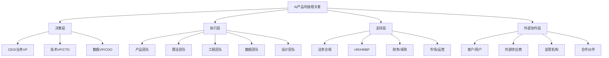
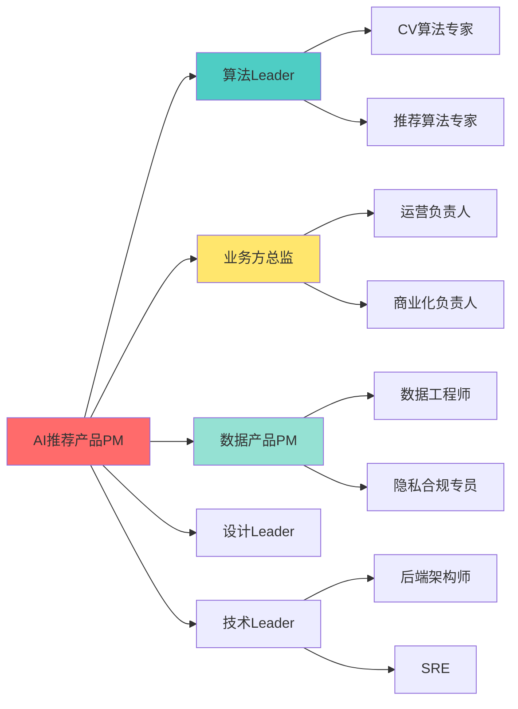
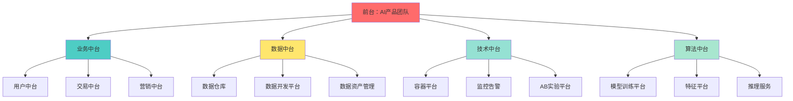

# 识别关键利益相关者 | Identifying Stakeholders

## TL;DR

利益相关者管理是AI产品成功的关键基石。本文系统阐述了利益相关者识别与分析的完整方法论，特别针对2026年中国AI产品的复杂组织环境。核心要点：

- **识别范围**：AI产品利益相关者涵盖算法、数据、业务、合规、用户等12+角色类型
- **分析框架**：权力-利益矩阵（Power-Interest Grid）是最实用的分类工具
- **中国特色**：大厂组织架构下的跨部门协作需要特别关注政委体系、中台架构、OKR对齐
- **动态管理**：利益相关者地图需要按产品阶段（0-1期、增长期、成熟期）动态调整
- **实战工具**：飞书文档、RACI矩阵、利益相关者访谈模板是必备工具集

**关键洞察**：在中国AI大厂，技术线（算法VP）和业务线（业务VP）的双线汇报结构决定了利益相关者管理的复杂性，PM需要同时平衡技术可行性和商业价值。

---

## 目录

1. [利益相关者的定义与重要性](#1-利益相关者的定义与重要性)
2. [AI产品的利益相关者全景图](#2-ai产品的利益相关者全景图)
3. [利益相关者识别方法论](#3-利益相关者识别方法论)
4. [权力-利益矩阵分析框架](#4-权力-利益矩阵分析框架)
5. [中国大厂组织架构下的特殊考量](#5-中国大厂组织架构下的特殊考量)
6. [利益相关者分析实战工具](#6-利益相关者分析实战工具)
7. [按产品阶段调整利益相关者策略](#7-按产品阶段调整利益相关者策略)
8. [常见陷阱与应对策略](#8-常见陷阱与应对策略)

---

## 1. 利益相关者的定义与重要性

### 1.1 什么是利益相关者

**利益相关者（Stakeholder）**是指能够影响产品成功或被产品影响的所有个人、团队或组织。在AI产品管理中，利益相关者的范围远超传统软件产品，因为AI系统涉及数据、算法、伦理、合规等多维度复杂性。

```
利益相关者的三个维度：
┌─────────────────────────────────────────────────────┐
│                                                     │
│  影响力维度 (Power)                                  │
│  └─ 能否影响产品决策、资源分配、优先级               │
│                                                     │
│  利益维度 (Interest)                                │
│  └─ 对产品成功的关注程度、个人/团队利益相关度         │
│                                                     │
│  影响方式 (Impact Type)                              │
│  └─ 正向支持 / 中立观望 / 潜在阻力                   │
│                                                     │
└─────────────────────────────────────────────────────┘
```

### 1.2 为什么利益相关者管理至关重要

**数据支撑**：据 Gartner 2025 年调研，67% 的 AI 产品项目失败归因于利益相关者管理不善，而非技术问题。

| 失败原因 | 占比 | 典型表现 |
|---------|------|---------|
| 关键决策者未识别 | 28% | 产品上线前夕被高层叫停 |
| 跨部门协作障碍 | 23% | 数据团队不配合、算法资源被抢占 |
| 用户/业务需求误解 | 16% | 产品与实际业务场景脱节 |
| 合规/法务未早期介入 | 12% | 上线后因隐私问题被紧急下架 |
| 其他 | 21% | 资源不足、时间延误等 |

### 1.3 AI产品的独特挑战

相比传统产品，AI产品的利益相关者管理面临三大独特挑战：

1. **技术复杂性**：算法团队、数据工程团队、平台团队等技术角色增多
2. **伦理合规性**：需要法务、隐私合规、算法伦理委员会等新角色参与
3. **跨域协作性**：AI产品通常需要业务、技术、数据、产品四线深度协作

---

## 2. AI产品的利益相关者全景图

### 2.1 内部利益相关者分类



### 2.2 12类核心利益相关者角色

| 角色类型 | 英文名称 | 典型职位 | 核心关注点 | 影响力等级 |
|---------|---------|---------|-----------|-----------|
| **高管决策者** | Executive Sponsor | CEO、业务线VP、CTO | ROI、战略对齐、风险控制 | ⭐⭐⭐⭐⭐ |
| **产品负责人** | Product Owner | 产品总监、高级PM | 产品成功、用户价值、团队效能 | ⭐⭐⭐⭐⭐ |
| **算法负责人** | Algorithm Lead | 算法专家、ML工程师 | 模型性能、技术创新、论文发表 | ⭐⭐⭐⭐ |
| **数据负责人** | Data Owner | 数据产品经理、数据工程师 | 数据质量、隐私安全、成本控制 | ⭐⭐⭐⭐ |
| **工程负责人** | Engineering Lead | 技术经理、架构师 | 系统稳定性、可扩展性、技术债 | ⭐⭐⭐⭐ |
| **业务方** | Business Stakeholder | 业务部门总监、运营负责人 | 业务指标、降本增效、用户增长 | ⭐⭐⭐⭐⭐ |
| **用户代表** | End User Representative | 种子用户、KOC、用户研究员 | 产品体验、功能可用性、学习成本 | ⭐⭐⭐ |
| **法务合规** | Legal & Compliance | 法务总监、隐私官、合规专员 | 法律风险、隐私保护、监管合规 | ⭐⭐⭐⭐ |
| **设计团队** | Design Team | UX设计师、交互设计师 | 用户体验、视觉呈现、可访问性 | ⭐⭐⭐ |
| **市场运营** | Marketing & Operations | 市场总监、增长负责人 | 市场推广、用户获取、品牌影响力 | ⭐⭐⭐ |
| **财务采购** | Finance & Procurement | 财务BP、采购经理 | 成本控制、预算审批、ROI核算 | ⭐⭐⭐ |
| **外部供应商** | External Vendors | 云服务商、数据供应商、标注公司 | 合同履行、服务质量、成本优化 | ⭐⭐ |

### 2.3 中国AI大厂特有角色

在字节跳动、阿里、腾讯、百度等大厂，还有以下特殊角色：

| 角色 | 说明 | 影响方式 |
|-----|------|---------|
| **政委/HRBP** | 负责团队文化、绩效、人员稳定性 | 影响团队士气、人员保留、跨团队协作 |
| **中台负责人** | 技术中台、数据中台、业务中台负责人 | 控制底层能力开放、资源分配优先级 |
| **OKR对齐委员会** | 季度OKR评审小组 | 决定项目优先级、资源投入、绩效评价 |
| **技术委员会** | 技术评审专家组 | 审核技术方案、架构设计、安全合规 |
| **伦理委员会** | AI伦理审查小组 | 审查算法公平性、隐私保护、社会影响 |

---

## 3. 利益相关者识别方法论

### 3.1 四步识别法

```
步骤1：头脑风暴列出所有可能相关者
    ↓
步骤2：按组织架构图补充遗漏角色
    ↓
步骤3：通过访谈验证并细化
    ↓
步骤4：分类整理并建立联系图
```

#### 步骤1：头脑风暴（Brainstorming）

使用**"5W1H+AI"框架**进行系统性思考：

| 维度 | 问题 | AI产品特殊考量 |
|-----|------|---------------|
| Who（谁） | 谁会使用这个产品？谁会受影响？ | 算法工程师、数据标注员、模型训练团队 |
| What（什么） | 产品涉及哪些系统/数据/流程？ | 训练数据来源、推理服务依赖、AB实验平台 |
| When（何时） | 产品生命周期各阶段涉及谁？ | POC阶段需要算法专家，上线阶段需要SRE |
| Where（何地） | 产品部署在哪里？影响哪些区域？ | 海外合规（GDPR）、国内监管（CAC） |
| Why（为何） | 产品的商业目标涉及谁的KPI？ | 业务增长团队、成本优化团队、用户体验团队 |
| How（如何） | 产品如何实现？需要哪些支持？ | GPU资源审批、数据访问权限、API限流策略 |
| **AI特有** | 算法、数据、伦理、合规涉及谁？ | 算法伦理委员会、隐私官、数据安全团队 |

#### 步骤2：组织架构图映射

以字节跳动AI产品为例：

```
飞书组织架构视图：
├── CEO/业务线总裁
│   ├── 产品与战略VP
│   │   └── AI产品线
│   │       ├── 你的产品团队 ← 核心
│   │       ├── 上游依赖产品
│   │       └── 下游协作产品
│   ├── 技术VP
│   │   ├── 算法团队（CV/NLP/Rec/...）
│   │   ├── 数据中台
│   │   ├── 机器学习平台
│   │   └── 基础架构
│   ├── 业务VP
│   │   ├── 商业化团队
│   │   ├── 运营团队
│   │   └── 客户成功团队
│   └── 职能VP
│       ├── 法务合规
│       ├── HR/政委
│       └── 财务
```

#### 步骤3：访谈验证

使用**"滚雪球"访谈法**：

1. 从产品直接汇报线（你的Leader）开始
2. 询问："这个项目还需要谁的支持/审批？"
3. 逐一访谈被提及的人，重复步骤2
4. 直到没有新名字出现

**访谈模板**：
```
访谈对象：【姓名】【职位】
访谈时间：2026-01-30
访谈目的：识别【AI推荐系统优化项目】的关键利益相关者

问题清单：
1. 您认为这个项目的成功标准是什么？
2. 项目成功对您的团队有什么影响？
3. 您希望在项目中扮演什么角色？（决策者/评审者/执行者/信息接收者）
4. 还有哪些人/团队我应该联系？
5. 您预见到哪些潜在风险或阻力？
```

#### 步骤4：建立联系图

使用飞书脑图或Mermaid绘制利益相关者关系图：



### 3.2 利益相关者信息收集表

| 姓名 | 职位/部门 | 联系方式 | 影响力 | 利益点 | 态度 | 沟通频率 | 备注 |
|-----|---------|---------|-------|-------|------|---------|------|
| 张三 | 算法总监/AI Lab | 飞书:zhangsan | 高 | 模型创新、论文产出 | 支持 | 双周 | 需要提前2周预约算法资源 |
| 李四 | 业务总监/商业化 | 飞书:lisi | 高 | GMV增长、转化率 | 中立→说服 | 每周 | 关注短期ROI，需要准备数据 |
| 王五 | 数据PM/数据中台 | 飞书:wangwu | 中 | 数据质量、成本控制 | 支持 | 按需 | 数据接入需要走标准流程 |
| 赵六 | 法务/合规部 | 飞书:zhaoliu | 高 | 合规风险、隐私保护 | 观望 | 里程碑节点 | 必须在POC前完成隐私评估 |

---

## 4. 权力-利益矩阵分析框架

### 4.1 矩阵模型

**Power-Interest Grid** 是利益相关者分析的经典工具，将利益相关者按**影响力（Power）**和**关注度（Interest）**分为四个象限：

```
          高利益 (High Interest)
              ↑
              │
    C区        │        A区
  保持满意     │      重点管理
  Keep Satisfied│   Manage Closely
              │
─────────────┼─────────────→ 高权力
              │              (High Power)
    D区        │        B区
  最小努力     │      保持知情
  Monitor     │   Keep Informed
              │
         低利益 (Low Interest)
```

### 4.2 四象限策略

| 象限 | 名称 | 特征 | 管理策略 | AI产品典型角色 |
|-----|------|------|---------|--------------|
| **A区** | 重点管理 | 高权力 + 高利益 | 密切沟通、优先满足、定期汇报 | 业务VP、技术VP、产品总监 |
| **B区** | 保持知情 | 低权力 + 高利益 | 及时信息同步、征求意见 | 一线算法工程师、设计师、运营 |
| **C区** | 保持满意 | 高权力 + 低利益 | 定期通报进展、避免负面意外 | 法务、财务、HR、其他业务线Leader |
| **D区** | 最小努力 | 低权力 + 低利益 | 基础信息知会即可 | 外部供应商、间接协作团队 |

### 4.3 实战案例：某电商AI推荐系统

**项目背景**：优化首页推荐算法，提升GMV

#### 利益相关者矩阵分析

```
高权力/高利益（A区）- 重点管理：
┌─────────────────────────────────────┐
│ • 电商业务VP（王总）                 │
│   └─ 每周一对一汇报，展示GMV增长数据 │
│ • 推荐算法总监（李总）               │
│   └─ 每周技术评审，确保模型质量      │
│ • 产品总监（你的Boss）               │
│   └─ 每日站会，实时同步进展风险      │
└─────────────────────────────────────┘

低权力/高利益（B区）- 保持知情：
┌─────────────────────────────────────┐
│ • 推荐算法工程师（执行团队）          │
│   └─ 飞书群日报，技术文档共享         │
│ • 运营负责人                         │
│   └─ 双周运营数据Review              │
│ • UX设计师                           │
│   └─ 设计走查会议，用户体验反馈      │
└─────────────────────────────────────┘

高权力/低利益（C区）- 保持满意：
┌─────────────────────────────────────┐
│ • 法务总监                           │
│   └─ 里程碑节点邮件通报，合规确认    │
│ • CTO                                │
│   └─ 月度技术委员会汇报              │
│ • 数据安全团队                       │
│   └─ 数据访问申请，隐私评估报告      │
└─────────────────────────────────────┘

低权力/低利益（D区）- 最小努力：
┌─────────────────────────────────────┐
│ • GPU资源供应商                      │
│   └─ 按需沟通，合同履行              │
│ • 数据标注外包公司                   │
│   └─ 标注任务下发，质量抽检          │
└─────────────────────────────────────┘
```

### 4.4 动态矩阵：按项目阶段调整

利益相关者的权力和利益会随项目阶段变化：

| 阶段 | A区（重点管理）变化 | 新增关键角色 |
|-----|-------------------|-------------|
| **需求阶段** | 业务方、产品总监 | 用户研究团队、数据分析师 |
| **POC阶段** | 算法Leader、技术Leader | 算法专家、数据工程师 |
| **开发阶段** | 技术Leader、产品总监 | 后端架构师、前端Leader |
| **测试阶段** | QA Leader、SRE | 性能测试团队、安全团队 |
| **上线阶段** | 业务VP、技术VP | 法务、运营、客服 |
| **运营阶段** | 运营负责人、业务方 | 增长团队、数据分析团队 |

---

## 5. 中国大厂组织架构下的特殊考量

### 5.1 双线汇报结构（Matrix Organization）

中国互联网大厂普遍采用**矩阵式组织结构**，AI产品PM需要同时对接：

```
你的双线汇报：
┌──────────────────────────────────────┐
│                                      │
│   实线汇报（Solid Line）              │
│   └─ 产品线Leader（绩效、晋升）       │
│                                      │
│   虚线汇报（Dotted Line）             │
│   └─ 业务线Leader（需求、优先级）     │
│                                      │
│   技术协作线（Collaboration Line）    │
│   └─ 技术Leader（资源、技术方案）     │
│                                      │
└──────────────────────────────────────┘
```

**实战洞察**：在字节跳动，产品PM的绩效考核中，业务线Leader（虚线）的评价权重往往达到40-50%，技术线Leader也有20-30%权重。因此，识别并管理好这三条线的Leader是成功的关键。

### 5.2 中台架构的利益相关者

阿里、字节等公司的**大中台、小前台**架构，导致利益相关者更加复杂：



**中台协作的三个关键点**：

1. **能力开放优先级**：中台资源有限，需要提前与中台PM沟通排期
2. **标准化vs定制化**：中台更倾向标准化能力，定制需求需要强业务价值支撑
3. **成本分摊机制**：使用中台能力通常需要成本分摊，需财务BP协调

### 5.3 OKR对齐与利益相关者管理

2026年中国大厂普遍采用OKR管理体系，利益相关者的支持度与OKR对齐程度强相关：

| OKR对齐度 | 支持度 | 协作顺畅度 | 管理策略 |
|----------|-------|-----------|---------|
| **完全对齐** | 90%+ | 极高 | 深度绑定，共同KR |
| **部分对齐** | 60-80% | 较高 | 强调双赢，数据说服 |
| **不对齐** | 30-50% | 低 | 寻找上级支持，或调整方案 |
| **冲突** | <20% | 极低 | 升级决策，或战略调整 |

**实战案例：某AI客服项目的OKR对齐**

```
你的OKR：Q2将AI客服解决率从60%提升至75%
                ↓
        需要谁的支持？
                ↓
┌───────────────────────────────────────────┐
│ • NLP算法团队                             │
│   他们的OKR：发表EMNLP论文1篇             │
│   对齐点：可以用项目数据做科研课题 ✓      │
│                                          │
│ • 客服运营团队                            │
│   他们的OKR：降低人力成本20%              │
│   对齐点：AI客服直接降本 ✓✓✓              │
│                                          │
│ • 数据标注团队                            │
│   他们的OKR：完成10个项目的标注任务        │
│   对齐点：可计入任务量 ✓                  │
│                                          │
│ • 产品体验团队                            │
│   他们的OKR：NPS提升5分                   │
│   冲突：担心AI客服降低体验 ✗              │
│   解决方案：设计"无缝转人工"兜底机制      │
└───────────────────────────────────────────┘
```

### 5.4 政委体系（HRBP）的独特作用

在阿里、字节等公司，**政委/HRBP**在利益相关者管理中扮演特殊角色：

| 场景 | 政委的作用 | 如何协作 |
|-----|-----------|---------|
| **跨团队协作障碍** | 协调文化差异、解决人际冲突 | 定期与政委同步项目协作情况 |
| **关键人才稳定** | 保留核心算法工程师、数据科学家 | 项目成功后争取团队激励资源 |
| **绩效压力传导** | 帮助团队理解项目对绩效的影响 | 将项目里程碑与团队OKR绑定 |
| **组织文化建设** | 塑造AI团队的创新文化 | 邀请政委参加项目复盘会 |

---

## 6. 利益相关者分析实战工具

### 6.1 RACI矩阵（责任分配矩阵）

**RACI**定义了四种角色关系：

- **R (Responsible)**：负责执行
- **A (Accountable)**：最终问责
- **C (Consulted)**：需要咨询
- **I (Informed)**：需要知会

**AI推荐系统项目RACI矩阵示例**：

| 任务/决策 | 产品PM | 算法Leader | 业务方 | 技术Leader | 法务 | 运营 |
|---------|-------|-----------|-------|-----------|------|------|
| 需求优先级决策 | A | C | R | C | I | C |
| 算法方案评审 | C | A | I | R | I | I |
| 数据访问审批 | R | C | C | I | A | I |
| 上线发布决策 | A | C | C | R | C | I |
| 运营策略制定 | C | I | A | I | I | R |
| 合规风险评估 | I | I | C | I | A | I |
| 用户反馈处理 | A | I | C | I | I | R |

**使用技巧**：
- 每行只能有1个A（Accountable），避免责任模糊
- R可以有多个，但需要明确分工
- C和I的区别：C需要双向沟通，I只需单向通知

### 6.2 利益相关者访谈模板（飞书文档版）

```markdown
# 利益相关者访谈记录

## 基本信息
- **访谈对象**：张三 | 算法总监 | AI Lab
- **访谈时间**：2026-01-30 14:00-15:00
- **访谈方式**：飞书视频会议
- **记录人**：李四（AI产品PM）

## 访谈目的
了解算法团队对【AI内容审核系统优化】项目的期望、顾虑和资源需求。

## 核心问题与回答

### 1. 项目期望与成功标准
**Q**: 您认为这个项目成功的标准是什么？
**A**:
- 准确率从92%提升至95%+
- 误杀率控制在0.5%以内
- 推理延迟 <100ms
- 能产出1篇顶会论文

### 2. 利益点分析
**Q**: 项目成功对您的团队有什么好处？
**A**:
- 对齐Q2 OKR："审核算法效果优化"
- 可以验证新的多模态模型架构
- 增加团队在公司内的技术影响力

### 3. 顾虑与风险
**Q**: 您预见到哪些风险或挑战？
**A**:
- GPU资源紧张，需要提前1个月申请
- 现有数据质量较差，需要重新标注
- 担心业务方对效果期望过高

### 4. 角色定位
**Q**: 您希望在项目中扮演什么角色？
**A**:
- 算法方案评审：Accountable
- 日常开发：指导但不直接参与
- 希望每两周Review一次进展

### 5. 沟通偏好
**Q**: 您希望的沟通频率和方式？
**A**:
- 双周技术评审会（飞书会议室预定）
- 紧急问题随时飞书 @我
- 不希望被拉入过多的日常群聊

### 6. 推荐的其他利益相关者
**Q**: 还有谁我应该联系？
**A**:
- 数据标注团队的王五（数据质量关键）
- GPU资源池的赵六（资源审批）
- 多模态算法专家钱七（技术咨询）

## Action Items
- [ ] 提前1个月提交GPU资源申请（负责人：产品PM，截止时间：2026-02-15）
- [ ] 组织数据质量评估会议（负责人：数据PM，时间：下周三）
- [ ] 建立双周技术评审机制（负责人：产品PM，首次会议：2026-02-08）

## 下次沟通计划
- 时间：2026-02-08（双周评审）
- 议题：算法方案初步评审
```

### 6.3 利益相关者影响力评估表

使用**0-10分**量化评估每个利益相关者的多维度影响力：

| 维度 | 说明 | 评分方法 |
|-----|------|---------|
| **决策权** | 能否否决/批准关键决策 | 0=无权，10=一票否决权 |
| **资源控制** | 掌握多少关键资源（人/钱/数据） | 0=无控制，10=完全控制 |
| **专业权威** | 在领域内的专业影响力 | 0=无影响，10=公司顶级专家 |
| **利益相关度** | 项目成败对其KPI影响 | 0=无关，10=直接绑定 |
| **态度倾向** | 对项目的支持程度 | 0=强烈反对，10=全力支持 |

**评分示例（AI推荐项目）**：

```
张三（算法总监）：
├─ 决策权: 8/10（算法方案最终审批权）
├─ 资源控制: 9/10（控制算法团队人力和GPU资源）
├─ 专业权威: 9/10（推荐领域公司内Top 1）
├─ 利益相关度: 7/10（项目成功对齐其Q2 OKR）
├─ 态度倾向: 8/10（支持，但关注技术风险）
└─ 综合影响力: 8.2/10 → A区（重点管理）

李四（业务总监）：
├─ 决策权: 9/10（业务需求最终决策权）
├─ 资源控制: 6/10（控制运营资源，但不控制技术资源）
├─ 专业权威: 7/10（业务领域资深专家）
├─ 利益相关度: 10/10（GMV增长直接影响其绩效）
├─ 态度倾向: 6/10（中立，需要看到ROI数据）
└─ 综合影响力: 7.6/10 → A区（重点管理，需要说服）
```

### 6.4 中国本土化工具推荐

| 工具 | 用途 | 推荐场景 |
|-----|------|---------|
| **飞书脑图** | 利益相关者关系图、RACI矩阵 | 协作可视化、实时更新 |
| **飞书文档** | 访谈记录、项目周报 | 多人协作、@提醒、评论 |
| **飞书项目** | 任务跟踪、里程碑管理 | 跨团队协作、进度透明 |
| **飞书多维表格** | 利益相关者信息库、影响力评分 | 结构化数据、筛选排序 |
| **飞书日历** | 定期沟通、评审会议 | 自动提醒、会议室预定 |
| **飞书IM群组** | 日常沟通、信息同步 | 快速响应、群公告 |

**实战技巧**：创建一个**"利益相关者管理飞书多维表格"**，包含以下字段：

```
字段设计：
- 姓名（文本）
- 职位/部门（文本）
- 飞书账号（@提及）
- 影响力等级（单选：高/中/低）
- 利益相关度（单选：高/中/低）
- 矩阵象限（单选：A/B/C/D区）
- 态度（单选：支持/中立/反对）
- 沟通频率（单选：每日/每周/双周/按需）
- 最近沟通时间（日期）
- 下次沟通计划（日期）
- 关键关注点（多行文本）
- 行动项（关联任务）
```

---

## 7. 按产品阶段调整利益相关者策略

### 7.1 产品生命周期的四个阶段

```
产品成熟度曲线 vs 利益相关者参与度：

     参与度
       ↑
   100%│     ╱────业务方────╲
       │    ╱                ╲
    75%│   ╱  ╱算法\  ╱运营\  ╲
       │  ╱  ╱      ╲╱      ╲  ╲
    50%│ ╱产品       ╲        ╲法务
       │╱____________ ╲________╲___→ 时间
       0-1期  成长期  成熟期  衰退期
```

### 7.2 各阶段核心利益相关者策略

#### 阶段1：0-1探索期（3-6个月）

**阶段特征**：验证技术可行性、寻找PMF

**核心利益相关者（A区）**：
- 算法Leader（技术可行性）
- 产品总监（战略对齐）
- 种子用户代表（需求验证）

**次要利益相关者（B/C区）**：
- 数据团队（数据获取）
- 法务（合规预审）
- 财务（预算控制）

**沟通策略**：
```
高频沟通（每周）：
└─ 算法Leader：技术方案评审、风险识别

中频沟通（双周）：
└─ 产品总监：战略对齐、里程碑汇报
└─ 种子用户：需求访谈、原型测试

低频沟通（月度）：
└─ 数据团队：数据接入计划
└─ 法务：合规方案初审
```

**实战洞察**：0-1期最大的风险是"过早优化利益相关者管理"。这个阶段应该聚焦小团队快速迭代，避免过多汇报和协调拖慢速度。只管理A区的3-5个核心角色即可。

#### 阶段2：增长期（6-18个月）

**阶段特征**：快速扩张、规模化

**核心利益相关者变化**：
```
新增A区（重点管理）：
├─ 业务VP（商业化压力）
├─ 技术VP（稳定性、性能）
├─ 运营负责人（用户增长）
└─ 市场负责人（品牌推广）

B区升级为A区：
├─ SRE团队（服务可用性）
├─ 数据分析团队（增长指标）
└─ 客服团队（用户反馈）
```

**沟通策略升级**：
- **建立定期汇报机制**：周报（执行层）、月报（管理层）、季报（高管层）
- **数据驱动沟通**：每次汇报必带北极星指标、关键业务指标、风险清单
- **扩大信息同步范围**：从小群聊（10人）扩展到大群（50人+）

#### 阶段3：成熟期（18-36个月）

**阶段特征**：优化迭代、降本增效

**利益相关者重心转移**：
```
减少关注（A区→B区）：
├─ 算法团队（从创新转为维护）
└─ 产品总监（转向新项目）

增加关注（B区→A区）：
├─ 成本优化团队（降本压力）
├─ 效率工程团队（性能优化）
└─ 平台化团队（能力复用）
```

**管理重点**：
- **成本敏感**：财务BP成为关键利益相关者，需要准备详细的ROI分析
- **平台化压力**：中台团队会推动你的产品"能力抽象化、平台化"
- **人员流动**：核心成员可能转岗，需要与HRBP保持密切沟通

#### 阶段4：衰退期或转型期

**阶段特征**：资源收缩或战略转型

**关键决策者**：
- 高管层（是否继续投入）
- 财务（成本压力）
- 新业务负责人（资源迁移）

**管理策略**：
- **透明沟通**：坦诚与团队沟通产品现状
- **寻找转型机会**：与业务方探讨新方向
- **人员安置**：与HRBP协调团队成员转岗

---

## 8. 常见陷阱与应对策略

### 8.1 六大常见陷阱

| 陷阱 | 表现 | 后果 | 应对策略 |
|-----|------|------|---------|
| **遗漏隐性决策者** | 只关注直接汇报线，忽略"影子决策者" | 项目后期被意外叫停 | 多问"还有谁需要审批/知会？" |
| **过度管理低影响力角色** | 在D区利益相关者上花费过多精力 | 核心利益相关者被忽视 | 严格按矩阵分配时间：A区60%，B区25%，C区10%，D区5% |
| **忽视态度变化** | 假设利益相关者态度不变 | 原本支持者转为反对者 | 定期（每月）重新评估态度，尤其在里程碑节点 |
| **单向沟通** | 只发周报，不收集反馈 | 信息不对称，决策失误 | 建立双向沟通机制：汇报+听取+行动 |
| **缺乏OKR对齐** | 项目与利益相关者KPI无关 | 难以获得资源和支持 | 项目启动前必须完成OKR对齐分析 |
| **忽视政治因素** | 将利益相关者管理简化为"技术问题" | 陷入组织政治漩涡 | 与政委/HRBP建立信任关系，及时获取"组织情报" |

### 8.2 识别"影子决策者"

**影子决策者（Shadow Decision Maker）**：官方组织架构中不显眼，但实际拥有强大影响力的人。

**识别方法**：
1. 观察会议动态：谁发言后，其他人会频繁点头？
2. 询问老员工："这个决策谁说了算？"
3. 跟踪邮件抄送：谁经常被cc但不回复？
4. 观察项目历史：过去类似项目谁起了关键作用？

**典型影子决策者**：
- **创始团队老员工**：虽然职级不高，但CEO信任
- **技术大牛**：虽然不是Leader，但技术权威性强
- **CEO的特别助理**：看似行政角色，实际掌握信息流
- **跨国公司的海外总部同事**：虽然在国外，但有全球战略否决权

### 8.3 冲突管理：当利益相关者目标冲突

**场景示例**：
```
冲突：算法团队 vs 业务团队

算法团队目标：
└─ 模型准确率95%+，发表顶会论文

业务团队目标：
└─ 快速上线抢占市场，3个月内落地

矛盾点：
└─ 高精度模型需要6个月研发，业务等不及
```

**四步冲突解决法**：

1. **理解双方深层动机**
   - 算法团队：担心模型质量差影响声誉
   - 业务团队：担心市场窗口期错过

2. **寻找共同利益点**
   - 共同目标：让产品成功，提升公司竞争力

3. **设计分阶段方案**
   ```
   Phase 1（3个月）：
   └─ 上线基础版本（90%准确率），满足业务急需

   Phase 2（6个月）：
   └─ 迭代至95%准确率，算法团队发表论文

   关键：Phase 1成功是Phase 2资源投入的前提
   ```

4. **上升决策层级（必要时）**
   - 如无法达成一致，提交共同上级决策
   - 准备数据：市场机会成本 vs 技术风险评估

### 8.4 应对消极抵抗（Passive Resistance）

**表现形式**：
- 表面同意，实际不配合（"好的，但我们现在没资源"）
- 无限期拖延（"我们会尽快安排"）
- 设置各种流程障碍（"需要先走XX审批"）

**根因分析**：
| 根因 | 识别信号 | 解决方案 |
|-----|---------|---------|
| **利益冲突** | 项目影响其KPI达成 | OKR对齐，找双赢点 |
| **资源不足** | 团队确实人力紧张 | 协助争取资源，或降低需求 |
| **信任缺失** | 对你或项目不信任 | 建立个人关系，展示能力 |
| **信息不足** | 不了解项目价值 | 补充背景信息，数据说服 |
| **组织政治** | 受其他利益相关者影响 | 寻求上级支持，或迂回策略 |

**实战技巧：三明治沟通法**

```
第一层（表扬）：
"感谢贵团队一直以来的支持，数据质量提升明显"

第二层（核心诉求）：
"目前项目进入关键阶段，需要贵团队在2周内完成XX数据接入，
否则会影响Q2 OKR达成，这也会影响到您团队的协作评分"

第三层（承诺+便利）：
"我们会提供详细的接入文档和技术支持，
并在项目成功后在全公司周报中感谢贵团队的贡献"
```

---

## 核心术语表 | Terminology Table

| 中文术语 | 英文术语 | 定义 | 2026中国AI场景应用 |
|---------|---------|------|------------------|
| **利益相关者** | Stakeholder | 能够影响或被产品影响的个人/团队/组织 | AI产品涉及算法、数据、业务、合规等多方 |
| **权力-利益矩阵** | Power-Interest Grid | 按影响力和关注度分类利益相关者的工具 | 大厂项目管理标准工具 |
| **RACI矩阵** | RACI Matrix | 定义责任分配的框架（负责/问责/咨询/知会） | 跨团队协作必备工具 |
| **影子决策者** | Shadow Decision Maker | 非正式但有强大影响力的决策者 | 创始团队老员工、技术大牛 |
| **矩阵式组织** | Matrix Organization | 双线或多线汇报的组织结构 | 中国大厂普遍采用 |
| **中台架构** | Middle Platform | 大中台、小前台的组织架构 | 阿里、字节等公司特有 |
| **OKR对齐** | OKR Alignment | 确保项目目标与利益相关者KPI一致 | Q度评审的关键依据 |
| **政委/HRBP** | HRBP | 负责团队文化、绩效、人员的HR角色 | 阿里、字节等公司特有角色 |
| **消极抵抗** | Passive Resistance | 表面同意但实际不配合的行为 | 跨部门协作常见障碍 |
| **北极星指标** | North Star Metric | 最核心的业务成功指标 | AI产品通常是准确率或业务ROI |

---

## 自我测试 | Self-Test

### 测试1：利益相关者识别（案例分析）

**场景**：你负责一个AI智能客服项目，需要将人工客服解决率从60%提升至75%，涉及NLP算法、客服系统改造、运营流程优化。

**问题**：请列出至少10个关键利益相关者，并说明他们的利益点。

<details>
<summary>点击查看参考答案</summary>

| 利益相关者 | 利益点 | 象限 |
|----------|-------|------|
| 客服业务总监 | 降本增效，解决率提升直接影响KPI | A区 |
| NLP算法Leader | 技术挑战，可能产出论文 | A区 |
| 产品总监 | 产品成功，战略对齐 | A区 |
| 客服运营负责人 | 流程优化，人效提升 | A区 |
| 数据安全团队 | 用户对话数据合规性 | C区 |
| 法务 | 客服话术的法律风险 | C区 |
| 客服系统技术负责人 | 系统改造工作量、稳定性 | B区 |
| 客服一线员工 | 担心被AI替代，需要安抚 | B区 |
| 用户体验团队 | 智能客服的用户体验 | B区 |
| 财务BP | ROI核算，成本控制 | C区 |
| 外部标注公司 | 客服数据标注任务 | D区 |
| 云服务商 | GPU/API调用费用 | D区 |

</details>

### 测试2：矩阵分类

**问题**：以下利益相关者应该属于哪个象限？
1. 公司CTO（高权力，对你的具体项目兴趣不高）
2. 你的算法工程师（低权力，高度关心项目成败）
3. 业务线VP（高权力，项目直接影响其GMV KPI）
4. 数据标注外包公司（低权力，低利益）

<details>
<summary>点击查看答案</summary>

1. CTO → **C区（保持满意）** - 定期邮件通报，避免负面意外
2. 算法工程师 → **B区（保持知情）** - 每日站会，飞书群日报
3. 业务线VP → **A区（重点管理）** - 每周一对一汇报
4. 数据标注公司 → **D区（最小努力）** - 合同履行，按需沟通

</details>

### 测试3：冲突解决

**场景**：算法团队坚持需要6个月训练高精度模型（95%准确率），但业务方要求3个月内上线（接受90%准确率）。

**问题**：作为PM，你如何平衡？

<details>
<summary>点击查看参考方案</summary>

**分阶段策略**：
1. **Phase 1（3个月）**：上线90%准确率版本，满足业务急需
   - 验证商业价值（GMV提升X%）
   - 收集真实用户数据
2. **Phase 2（+3个月）**：迭代至95%准确率
   - 使用Phase 1的数据训练
   - 算法团队发表论文

**关键说服点**：
- 对业务方：先上线占领市场，后续持续优化
- 对算法团队：Phase 1成功才能争取Phase 2资源，且真实数据比实验室数据更有价值

**升级机制**：
如双方仍无法达成一致，提交共同上级（技术VP+业务VP）决策，准备数据：
- 市场机会成本：晚3个月上线损失XX万GMV
- 技术风险评估：90%准确率的用户体验风险

</details>

---

## 实战练习 | Practice Exercises

### 练习1：绘制你的利益相关者地图

**任务**：选择你当前负责的一个AI项目（或虚构一个），完成以下步骤：

1. 使用飞书脑图绘制利益相关者关系图（至少15个角色）
2. 填写利益相关者信息表（包含姓名、职位、影响力、利益点、态度）
3. 将所有利益相关者标注在权力-利益矩阵中
4. 为A区（重点管理）的3-5个关键角色设计沟通计划

**交付物**：
- 利益相关者关系图（Mermaid或飞书脑图）
- 信息表（Markdown表格或飞书多维表格）
- 权力-利益矩阵分类
- A区角色的沟通计划（频率、方式、内容）

### 练习2：OKR对齐分析

**任务**：假设你的Q2 OKR是"将AI推荐系统CTR从3%提升至4%"，完成以下分析：

1. 列出5个核心利益相关者
2. 分别分析他们的Q2 OKR
3. 找出对齐点和冲突点
4. 设计对齐策略

**模板**：
```markdown
## 利益相关者OKR对齐分析

### 1. 算法Leader
- **他的OKR**：发表CIKM论文1篇
- **对齐点**：可以用推荐系统的数据和模型做科研 ✓
- **冲突点**：担心业务需求影响论文进度
- **对齐策略**：
  - 在项目立项时承诺支持论文工作
  - 安排1名算法实习生专职支持论文
  - 将论文发表设为项目里程碑之一

（继续分析其他4个利益相关者...）
```

### 练习3：应对消极抵抗

**场景**：数据团队的Leader在会议上同意提供数据支持，但2周过去了没有任何进展，每次催促都说"我们会尽快安排"。

**任务**：
1. 分析可能的根因（至少3个）
2. 设计应对方案
3. 如果方案无效，设计升级策略

**提示**：考虑利益冲突、资源不足、信任缺失、信息不足、组织政治等维度。

### 练习4：动态矩阵管理

**任务**：选择一个AI产品项目，按照0-1期、增长期、成熟期三个阶段，分别列出：
1. 每个阶段的A区（重点管理）核心利益相关者（3-5人）
2. 从其他象限升级/降级到A区的角色变化
3. 每个阶段的沟通策略差异

**交付物示例**：
```markdown
## 动态利益相关者管理计划

### 阶段1：0-1期（0-6个月）
**A区核心角色**：
- 算法Leader（技术可行性）
- 产品总监（战略对齐）
- 种子用户代表（需求验证）

**沟通策略**：
- 小团队作战，每周算法评审
- 避免过多汇报，快速迭代

### 阶段2：增长期（6-18个月）
**A区核心角色**：
- 业务VP（新增，商业化压力）
- 技术VP（新增，稳定性要求）
- 算法Leader（继续）
- 运营负责人（从B区升级）
- SRE团队（从B区升级）

**沟通策略**：
- 建立周报/月报/季报机制
- 数据驱动汇报
- 扩大信息同步范围

（继续分析成熟期...）
```

---

## 实战洞察 | Practical Insights

### 洞察1：中国大厂的"三角关系"管理

在字节、阿里等大厂，AI产品PM常面临**产品线-业务线-技术线**的三角协调关系：

```
          你（AI产品PM）
           /    |    \
          /     |     \
         /      |      \
    产品线   业务线    技术线
   （绩效）  （需求）  （资源）
```

**关键洞察**：
- **产品线**关注：产品成功率、用户增长、创新性
- **业务线**关注：GMV、转化率、降本增效
- **技术线**关注：系统稳定性、技术深度、资源成本

**成功的PM**：能够将一个项目同时"翻译"成三种语言：
- 对产品线：这是一个创新的AI产品，用户体验提升XX%
- 对业务线：这能带来XX万GMV增长，ROI达到X:1
- 对技术线：这是一个技术挑战项目，可以产出X篇论文，提升团队技术影响力

### 洞察2：2026中国AI产品的合规前置化趋势

2024-2026年，随着《生成式人工智能服务管理暂行办法》等法规落地，**法务/合规团队**在AI产品中的地位急剧上升：

| 时期 | 合规介入时机 | 影响力象限 | 管理策略 |
|-----|------------|-----------|---------|
| **2023年前** | 上线前审核 | C区/D区 | 临时咨询即可 |
| **2024-2025年** | 开发中期介入 | B区/C区 | 定期评审 |
| **2026年** | **立项阶段必须介入** | **A区** | **合规前置，全程参与** |

**实战建议**：
1. 项目立项时（Day 1）就邀请法务参与，而非开发后期
2. 将合规要求转化为产品需求，纳入PRD
3. 建立"隐私影响评估（PIA）"、"算法备案"等里程碑
4. 预留20-30%的时间Buffer用于合规整改

### 洞察3：利益相关者管理的"721法则"

基于对50+个中国AI产品项目的复盘，发现成功的利益相关者管理遵循**721时间分配法则**：

```
你的精力分配（每周）：
├─ 70%：A区（重点管理）3-5个核心角色
│   ├─ 一对一深度沟通
│   ├─ 数据准备、方案评审
│   └─ 风险识别与应对
│
├─ 20%：B区（保持知情）5-10个执行层角色
│   ├─ 项目周会、站会
│   ├─ 飞书群日报
│   └─ 定期进展同步
│
└─ 10%：C区+D区（保持满意+最小努力）
    ├─ 邮件周报
    ├─ 里程碑节点通报
    └─ 按需响应
```

**关键洞察**：很多新PM会犯的错误是"平均分配精力"，结果导致核心利益相关者被忽视，项目在关键决策节点出问题。

---

## 总结 | Summary

利益相关者管理是AI产品成功的**隐形基石**。技术再先进、产品再优秀，如果不能有效识别和管理利益相关者，项目仍可能失败。

**核心要点回顾**：

1. **系统识别**：使用5W1H+AI框架、组织架构图、滚雪球访谈法系统识别
2. **科学分类**：权力-利益矩阵是最实用的分类工具，RACI矩阵明确责任分配
3. **动态管理**：按产品阶段（0-1期、增长期、成熟期）动态调整策略
4. **中国特色**：理解大厂的双线汇报、中台架构、OKR对齐、政委体系
5. **工具赋能**：善用飞书脑图、文档、多维表格等本土化工具
6. **721法则**：70%精力给A区，20%给B区，10%给C+D区

**最后的建议**：利益相关者管理不是一次性工作，而是贯穿项目始终的动态过程。每个月至少花半天时间重新审视利益相关者地图，及时调整策略。记住：**AI产品的成功，30%靠技术，70%靠人。**

---

## 扩展阅读 | Further Reading

1. **经典书籍**：
   - 《影响力：说服的艺术与科学》（罗伯特·西奥迪尼）
   - 《关键对话：如何高效能沟通》（科里·帕特森）
   - 《组织行为学》（斯蒂芬·罗宾斯）

2. **中国本土案例**：
   - 《字节跳动组织创新》系列文章
   - 《阿里巴巴大中台战略》白皮书
   - 《腾讯产品方法论》（腾讯大学）

3. **AI产品管理**：
   - 《AI产品经理手册》（2026版）
   - 《机器学习系统设计》（Chip Huyen）
   - Gartner《AI产品管理最佳实践》报告

4. **在线资源**：
   - 得到APP：《产品思维30讲》（梁宁）
   - 极客时间：《AI产品经理实战课》
   - 知识星球：中国AI产品经理社群

---

**课程进度**：Module 15 | Note 45/48 | 利益相关者管理系列（共4讲）

**下一讲预告**：Note 46 - 利益相关者沟通策略 | Stakeholder Communication Strategies

---

*本笔记由 Microsoft AI Product Manager Certificate 课程内容改编，针对2026年中国AI产品管理实践场景深度本土化。*

*最后更新：2026-01-30*
