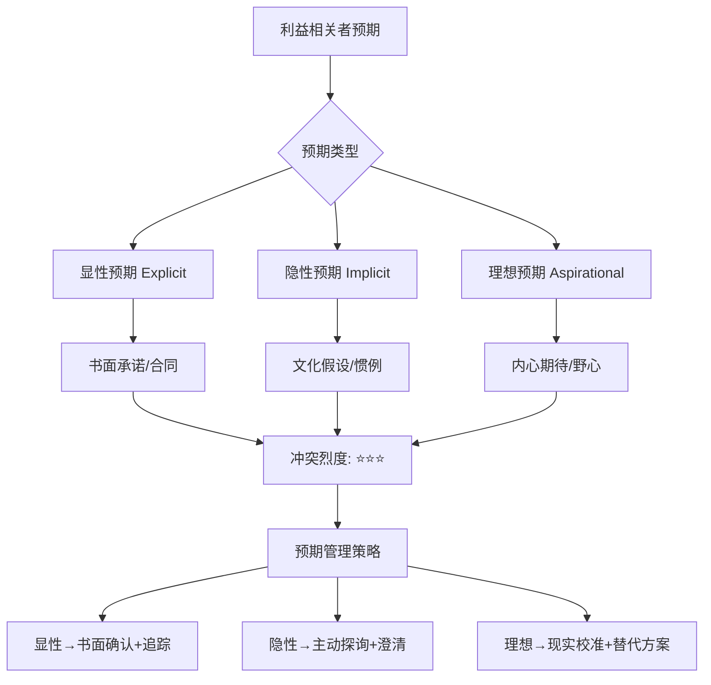
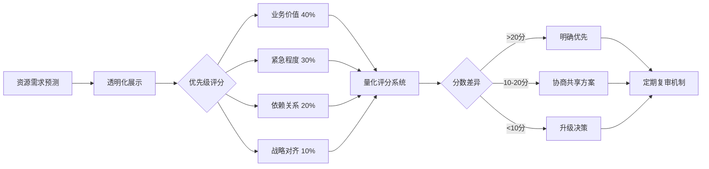
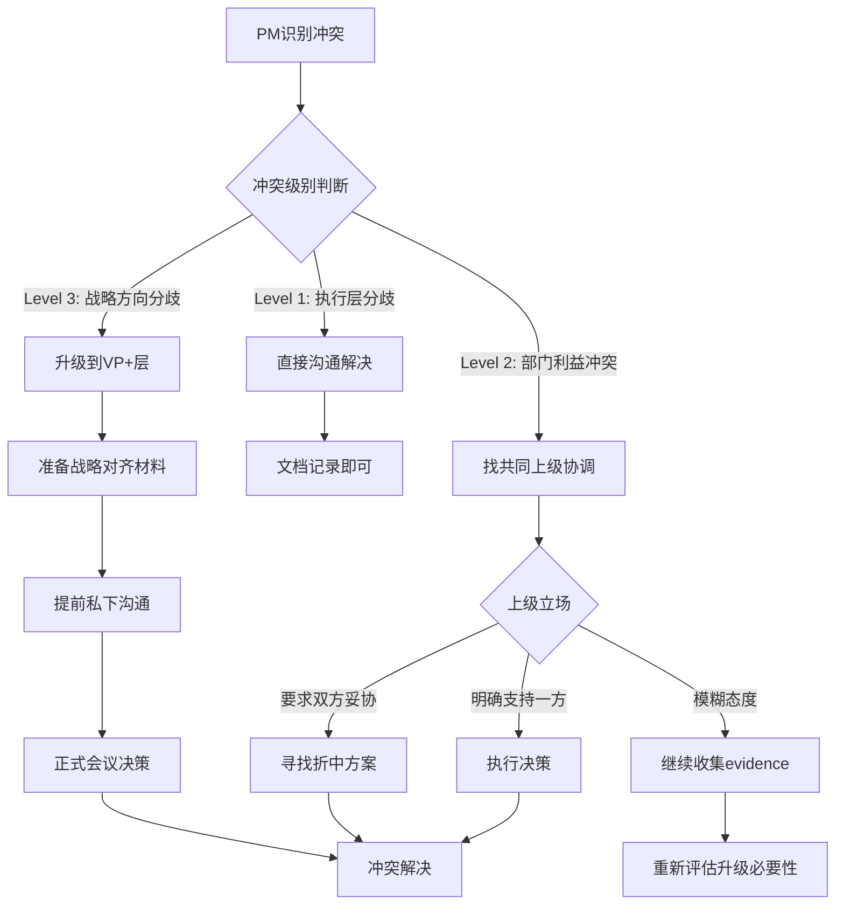
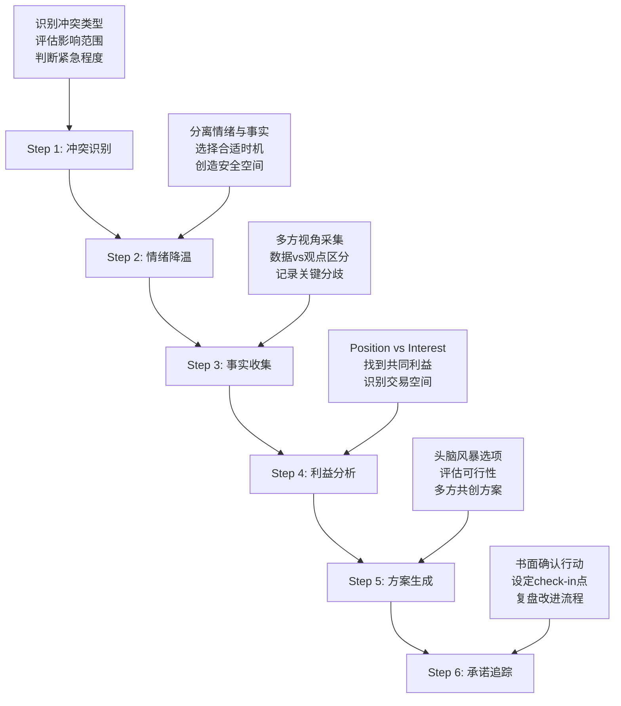

# 管理预期与解决冲突 | Managing Expectations & Conflicts

> **课程定位**：Course 3 - Module 15 - Note 47（课程3最终笔记）
> **难度等级**：⭐⭐⭐⭐ Advanced
> **预计学时**：75分钟
> **AI产品相关度**：⭐⭐⭐⭐ High
> **中国职场适配度**：⭐⭐⭐⭐⭐ Critical

---

## TL;DR 核心要点速览

**3分钟掌握精髓**：

- **预期管理本质**：利益相关者冲突的80%源于预期差异而非能力问题，AI产品因技术不确定性尤为突出
- **中国职场特色**：高语境文化下的"面子工程" + "关系优先" + "层级意识"，需要差异化冲突处理策略
- **黄金法则**：**早暴露、多沟通、留余地**——在项目启动阶段设定realistic预期，比后期补救成本低90%
- **冲突分类**：技术可行性冲突、资源争夺冲突、优先级冲突、跨部门协作冲突（AI产品四大核心矛盾）
- **实战框架**：DEAR MAN沟通法 + 利益VS立场谈判 + 升级路径设计
- **AI特殊性**：模型效果不可控、数据隐私敏感、算法黑箱解释难——需要专门的预期管理话术

**适用场景**：
✅ 业务方要求"GPT-5级别效果"但预算只够微调开源模型
✅ 研发团队坚持技术完美主义vs销售承诺的快速交付
✅ 跨国团队对"aggressive timeline"理解差异导致里程碑冲突
✅ 高管期待"革命性创新"但实际只是渐进式优化

---

## 目录 Table of Contents

1. [预期管理的底层逻辑](#1-预期管理的底层逻辑)
2. [AI产品的四大冲突场景](#2-ai产品的四大冲突场景)
3. [中国职场的冲突处理文化](#3-中国职场的冲突处理文化)
4. [预期设定实战框架](#4-预期设定实战框架)
5. [冲突解决的六步法](#5-冲突解决的六步法)
6. [困难对话的沟通技巧](#6-困难对话的沟通技巧)
7. [案例研究：真实冲突复盘](#7-案例研究真实冲突复盘)
8. [工具与模板](#8-工具与模板)
9. [术语表](#9-术语表)
10. [自测与实战练习](#10-自测与实战练习)

---

## 1. 预期管理的底层逻辑

### 1.1 为什么预期管理是PM的核心能力

```
传统软件产品 vs AI产品的预期管理复杂度对比：

┌─────────────────────────────────────────────────────────────────┐
│                    不确定性维度矩阵                              │
├─────────────────┬─────────────────┬───────────────────────────┤
│  维度 Dimension │ 传统SaaS产品     │ AI/ML产品                  │
├─────────────────┼─────────────────┼───────────────────────────┤
│ 交付确定性       │ ⭐⭐⭐⭐⭐        │ ⭐⭐⭐ (模型效果波动)       │
│ 需求可控性       │ ⭐⭐⭐⭐⭐        │ ⭐⭐ (数据依赖高)          │
│ 技术成熟度       │ ⭐⭐⭐⭐⭐        │ ⭐⭐⭐ (快速演进)          │
│ 效果可解释性     │ ⭐⭐⭐⭐⭐        │ ⭐⭐ (黑箱问题)            │
│ 用户理解门槛     │ ⭐⭐⭐           │ ⭐⭐⭐⭐⭐ (认知差距大)      │
│ 监管合规风险     │ ⭐⭐⭐           │ ⭐⭐⭐⭐⭐ (动态变化)       │
├─────────────────┼─────────────────┼───────────────────────────┤
│ 综合难度系数     │ 2.3x            │ 7.8x                      │
└─────────────────┴─────────────────┴───────────────────────────┘

关键洞察：AI产品的预期管理难度是传统产品的3.4倍
```

**预期差异的三层模型**：



### 1.2 预期失控的典型症状

| 症状表现 | 严重程度 | 根因分析 | 补救成本 |
|---------|---------|---------|---------|
| **会议中频繁出现"我以为..."** | 🔴 High | 沟通假设未确认 | 2-3周返工 |
| **里程碑验收时突然提新需求** | 🔴 High | 需求范围未锁定 | 1-2个月延期 |
| **高管对演示效果表示失望** | 🔴🔴 Critical | 早期未对齐benchmark | 信任破裂 |
| **技术团队拒绝"不合理需求"** | 🔴 High | 技术可行性未前置评估 | 团队士气受损 |
| **跨部门推诿责任** | 🟡 Medium | RACI矩阵模糊 | 流程重建 |
| **客户投诉"承诺未兑现"** | 🔴🔴 Critical | 销售过度承诺 | 法律风险 |

### 1.3 实战洞察：预期管理的黄金时间窗口

> **💡 血泪教训**：字节跳动某AI产品线的调研显示，项目启动前2周内完成的预期对齐工作，可以避免后期80%的冲突升级。但现实中，67%的PM将预期管理推迟到"开发过程中再说"。

**预期管理的ROI曲线**：

```
成本效益分析（Cost-Benefit Timeline）

干预时机 → 冲突预防效果 vs 投入成本

┌──────────────────────────────────────────────────────────────┐
│                                                                │
│ 100% │                                                         │
│      │ ████ 预防效果                                           │
│  90% │ ████                                                    │
│      │ ████ ░░░░ 投入成本                                      │
│  80% │ ████ ░░                                                 │
│      │ ████ ░░   ████                                          │
│  70% │ ████ ░░   ████                                          │
│      │ ████ ░    ████ ░░░                                      │
│  60% │ ████      ████ ░░     ████                              │
│      │ ████      ████ ░      ████ ░░░░                         │
│  50% │ ████      ████        ████ ░░░░                         │
│      │           ████        ████ ░░░░      ████               │
│  40% │           ████        ████ ░░░░      ████ ░░░░░░        │
│      │                       ████           ████ ░░░░░░   ████ │
│  30% │                       ████           ████ ░░░░░░   ████ │
│      │                                      ████ ░░░░░░   ████ │
│  20% │                                      ████ ░░░░░░   ████ │
│      │                                                     ████ │
│  10% │                                                     ████ │
│      │                                                          │
│   0% └──────────────────────────────────────────────────────── │
│      项目启动前   需求评审    开发中期    测试阶段    上线后   │
│      (Week -2)   (Week 0)   (Week 4)   (Week 8)   (Week 12)  │
└──────────────────────────────────────────────────────────────┘

关键发现：
- 启动前介入：预防效果90%，成本投入10%（ROI = 9:1）
- 开发中期介入：预防效果50%，成本投入60%（ROI = 0.83:1）
- 上线后补救：预防效果20%，成本投入95%（ROI = 0.21:1）
```

---

## 2. AI产品的四大冲突场景

### 2.1 技术可行性冲突（最常见）

**典型对话**：
- **业务方**："竞品都有GPT-4级别的对话能力，我们为什么做不到？"
- **算法团队**："我们预算只够fine-tune开源模型，效果肯定有差距。"
- **PM夹在中间**：如何破局？

**冲突根源拆解**：

```
技术可行性冲突的五层结构：

Layer 5: 认知差异 (最表层)
         └─> 业务方不理解LLM训练成本/效果的非线性关系

Layer 4: 信息不对称
         └─> 算法团队未提前说明技术债/限制条件

Layer 3: 目标错位
         └─> 业务追求"市场第一"，技术追求"架构优雅"

Layer 2: 资源约束
         └─> 预算/人力/时间三角困境未显性化

Layer 1: 组织激励 (最底层)
         └─> 销售KPI vs 研发质量指标的结构性冲突
```

**解决方案模板**：

| 策略 | 具体动作 | 适用场景 | 风险 |
|-----|---------|---------|-----|
| **技术科普会议** | 邀请算法专家做30min原理讲解 + Demo对比 | 业务方对技术完全不了解 | 可能被认为"技术傲慢" |
| **分阶段交付** | MVP先满足核心场景，高级功能排入V2 | 时间紧迫但需求明确 | 需要强势锁定scope |
| **第三方评估** | 引入外部技术顾问做可行性报告 | 内部争议无法调和 | 增加成本+时间 |
| **竞品深度拆解** | 逆向工程竞品技术栈，对比资源投入 | 业务方盲目对标竞品 | 需要法务合规支持 |
| **POC验证** | 2周快速原型验证关键假设 | 技术不确定性高 | 失败需要backup plan |

### 2.2 资源争夺冲突

**中国大厂真实场景**（2025年某头部AI公司）：

> 某电商AI推荐团队和广告AI团队同时申请GPU集群扩容，资源池只能满足一个团队需求。推荐团队PM以"直接影响GMV"为由要求优先级，广告团队PM以"广告是利润来源"反驳。最终升级到VP层，导致两个团队关系恶化，后续协作困难。

**预防性资源管理框架**：



### 2.3 优先级冲突

**AI产品的特殊性**：技术债vs新功能的平衡难题

| 场景 | 技术团队视角 | 业务团队视角 | PM决策框架 |
|-----|-------------|-------------|-----------|
| **模型准确率从85%提升到90%** | 需要2个月重构数据pipeline | "用户感知不明显，不如做新功能" | **选择：新功能** <br> 理由：边际效益递减，90%非临界阈值 |
| **推理延迟从2s降到500ms** | 需要模型量化+部署优化 | "2s用户可接受，先做场景扩展" | **选择：性能优化** <br> 理由：500ms是心理阈值，影响留存 |
| **支持多模态输入** | 架构重构，风险高 | "竞品都有，必须跟进" | **选择：协商折中** <br> 理由：先做图文，视频延后 |
| **算法可解释性增强** | 符合技术趋势 | "客户不关心黑箱，关心效果" | **选择：监管驱动决策** <br> 理由：欧盟AI法案要求 |

### 2.4 跨部门协作冲突

**中国职场特色矛盾**：

```
跨部门冲突的"山头主义"表现形式：

┌─────────────────────────────────────────────────────────────┐
│                部门墙（Silo Effect）诊断表                   │
├────────────────┬──────────────────┬────────────────────────┤
│  症状 Symptom  │  表层行为         │  深层原因               │
├────────────────┼──────────────────┼────────────────────────┤
│ 信息不共享      │ 关键数据"仅限内部"│ 绩效考核独立，无协作激励 │
│ 推诿责任        │ "这是XX部门的活"  │ RACI不清晰+追责文化     │
│ 重复造轮子      │ 各部门独立开发相似│ 技术中台推行不力        │
│                │ 功能             │                        │
│ 会议决策无效    │ 会上同意会后反悔  │ 实际决策权在部门leader  │
│ 资源抢占        │ 抢人/抢预算/抢roadmap │ 零和博弈思维       │
└────────────────┴──────────────────┴────────────────────────┘

解决方案：虚拟团队+共享OKR+轮岗机制
```

---

## 3. 中国职场的冲突处理文化

### 3.1 高语境文化的沟通密码

**理论背景**：爱德华·霍尔（Edward T. Hall）的高/低语境文化理论

```
中美冲突处理风格对比（AI产品场景）：

┌─────────────────────────────────────────────────────────────┐
│                                                               │
│  维度              │ 美国/低语境           │ 中国/高语境        │
│  ─────────────────┼──────────────────────┼──────────────────│
│  冲突表达方式      │ 直接指出问题         │ 委婉暗示，留面子   │
│  ─────────────────┼──────────────────────┼──────────────────│
│  例：deadline延期  │ "This timeline is    │ "这个排期可能需要  │
│                   │  unrealistic."       │  再优化一下..."     │
│  ─────────────────┼──────────────────────┼──────────────────│
│  决策模式          │ 会议上公开辩论       │ 会前私下沟通定调   │
│  ─────────────────┼──────────────────────┼──────────────────│
│  例：技术方案选型  │ 会上投票表决         │ 提前找关键人"通气" │
│  ─────────────────┼──────────────────────┼──────────────────│
│  升级路径          │ 遵循流程escalate    │ 先找关系/再走流程  │
│  ─────────────────┼──────────────────────┼──────────────────│
│  例：跨部门争议    │ 发邮件抄送上级       │ 请共同leader吃饭聊 │
│  ─────────────────┼──────────────────────┼──────────────────│
│  反馈风格          │ 三明治法（正-负-正）│ 先肯定-轻描淡写问题│
│  ─────────────────┼──────────────────────┼──────────────────│
│  例：code review  │ "Good work, but X    │ "整体不错，有个小  │
│                   │  needs refactor."    │  地方咱们讨论下..."│
└─────────────────────────────────────────────────────────────┘
```

### 3.2 面子工程与关系维护

**实战洞察**：如何在冲突中保全对方面子

> **💡 案例**：腾讯某产品线跨部门协作中，技术leader公开质疑产品方案的可行性，PM当场反驳导致会议气氛僵化。会后PM主动私下登门道歉，解释是"表达方式不当"，并请对方一起吃饭详聊技术细节。最终不仅化解矛盾，技术leader还主动提出优化方案。

**"面子-里子"双层沟通策略**：

| 场景 | 公开场合（面子） | 私下沟通（里子） | 结果 |
|-----|----------------|----------------|-----|
| **技术方案被否决** | "您的方案很有创新性，我们先做个POC验证下" | "其实担心的是X风险，能否这样调整..." | 保留对方尊严+推进实质调整 |
| **需求被砍** | "这个需求很重要，但Q1资源确实紧张" | "帮我说服老板把它排进Q2？您的支持对我很关键" | 将冲突转化为联盟 |
| **跨部门推诿** | "咱们一起找个时间对齐下流程" | "兄弟帮个忙，这次先支持下，下次我欠你一个人情" | 激活关系资本 |

### 3.3 层级意识与决策路径

**中国大厂的隐形决策链**：



**关键原则**：
1. **向上管理**：在升级前确保直属leader已知情并支持
2. **平行沟通**：跨部门冲突先找对方PM私聊，而非直接找对方leader
3. **证据准备**：升级时需要data-driven的论据，而非情绪化抱怨

---

## 4. 预期设定实战框架

### 4.1 SMART+R原则（AI产品定制版）

| 维度 | 传统定义 | AI产品适配 | 示例（智能客服项目） |
|-----|---------|-----------|---------------------|
| **S - Specific** | 具体明确 | 定义清晰的成功标准+失败边界 | ✅ "客服意图识别准确率≥90%" <br> ❌ "提升客服体验" |
| **M - Measurable** | 可量化 | 多维度指标+测试集定义 | "在1000条真实对话测试集上，F1-score≥0.85" |
| **A - Achievable** | 可实现 | 基于baseline的增量目标 | "当前准确率82%，3个月内提升到90%（竞品benchmark）" |
| **R - Relevant** | 相关性 | 与业务KPI的因果链路 | "准确率每提升1%→客服成本降低3%→年省500万" |
| **T - Time-bound** | 有时限 | 分阶段里程碑+buffer time | "Phase 1(6周): 85%  Phase 2(12周): 90%  Buffer: 2周" |
| **+R - Realistic** | 资源现实性 | 算力/数据/人力的硬约束 | "需要4*A100 GPU + 10万标注数据 + 2名算法工程师" |

### 4.2 三层预期对齐法

```
预期对齐的递进式沟通结构：

┌─────────────────────────────────────────────────────────────┐
│ Level 3: 愿景层（Vision Layer）                              │
│ ─────────────────────────────────────────────────────────── │
│ What：我们想要达成的理想状态                                  │
│ Who：高管/投资人/战略决策者                                   │
│ Example："打造行业领先的AI客服解决方案"                       │
│ ─────────────────────────────────────────────────────────── │
│                           ↓ 翻译转化                          │
├─────────────────────────────────────────────────────────────┤
│ Level 2: 目标层（Goal Layer）                                │
│ ─────────────────────────────────────────────────────────── │
│ What：可衡量的业务成果                                        │
│ Who：业务负责人/产品负责人                                    │
│ Example："Q2客服成本降低20%，客户满意度提升15%"               │
│ ─────────────────────────────────────────────────────────── │
│                           ↓ 分解执行                          │
├─────────────────────────────────────────────────────────────┤
│ Level 1: 交付层（Delivery Layer）                            │
│ ─────────────────────────────────────────────────────────── │
│ What：具体的功能/性能指标                                     │
│ Who：研发团队/设计团队                                        │
│ Example："意图识别准确率90%，响应延迟<500ms，支持20+场景"     │
└─────────────────────────────────────────────────────────────┘

关键风险：三层之间的"失真传递"
- 愿景→目标：高管的"领先"可能被理解为"世界第一"
- 目标→交付：业务的"提升15%"可能被翻译成"必须100%准确"
```

### 4.3 实战工具：预期确认清单（Expectation Alignment Checklist）

**项目启动会必备文档**：

```markdown
# 项目预期确认书 | Project Expectation Agreement

**项目名称**：______________________
**确认日期**：______________________
**参与方签字**：PM______ 技术Lead______ 业务负责人______

## Section 1: 成功标准（必须100%明确）

| 维度 | 定义 | 测量方式 | 目标值 | 负责人 |
|-----|-----|---------|-------|-------|
| 功能完整性 | _________ | _________ | _______ | _______ |
| 性能指标 | _________ | _________ | _______ | _______ |
| 业务KPI | _________ | _________ | _______ | _______ |

## Section 2: 明确的"不做清单"（Scope Boundary）

以下需求明确不在本期范围：
- [ ] ____________________（原因：_______________）
- [ ] ____________________（原因：_______________）

## Section 3: 资源约束（Reality Check）

- 预算上限：________ 元（超出需重新审批）
- 人力投入：________ 人月
- 时间窗口：________ 周（包含 __ 周buffer）
- 技术限制：____________________

## Section 4: 风险假设（Assumption Log）

| 假设 | 如果假设不成立的后果 | 缓解措施 | 验证时间点 |
|-----|---------------------|---------|-----------|
| _____ | ___________________ | ________ | _________ |

## Section 5: 沟通协议（Communication Protocol）

- 日常同步：每周 __ （频率），__ （参与方）
- 风险上报：发现后 __ 小时内同步
- 变更流程：____________________

## Section 6: 退出条件（Exit Criteria）

如果以下情况发生，项目将暂停/终止：
- [ ] ____________________
- [ ] ____________________

---
**重要**：本文档将在项目周期内定期回顾（每 __ 周一次）
```

---

## 5. 冲突解决的六步法

### 5.1 标准化冲突处理流程



### 5.2 Step 1-2: 冲突识别与情绪管理

**冲突强度评估矩阵**：

| 影响范围 \ 情绪强度 | 低情绪（理性分歧）| 中情绪（不满）| 高情绪（对抗）|
|-------------------|-----------------|--------------|--------------|
| **个人层面** | 🟢 直接沟通 | 🟡 私下调解 | 🔴 引入第三方 |
| **团队层面** | 🟡 会议讨论 | 🔴 分别访谈 | 🔴🔴 升级管理层 |
| **组织层面** | 🔴 正式流程 | 🔴🔴 高管介入 | 🔴🔴🔴 外部仲裁 |

**情绪降温技巧**（中国职场适配版）：

| 场景 | ❌ 错误做法 | ✅ 推荐做法 | 话术示例 |
|-----|-----------|-----------|---------|
| 会议中突然爆发争执 | 当场强行裁决 | 暂停会议，会后一对一沟通 | "这个议题很重要，咱们会后细聊，先继续下个议程" |
| 邮件中出现指责性语言 | 群发回复辩解 | 电话/当面沟通 | "邮件可能没说清楚，我约个时间当面聊？" |
| 跨部门甩锅 | 公开指出对方问题 | 重新定义问题为共同挑战 | "看起来流程上有些gap，咱们一起优化下？" |

### 5.3 Step 3-4: 事实收集与利益分析

**哈佛谈判项目（Harvard Negotiation Project）的Position vs Interest框架**：

```
案例：算法团队拒绝优化模型推理速度

┌─────────────────────────────────────────────────────────────┐
│                                                               │
│  表面立场（Position）    vs    深层利益（Interest）            │
│  ══════════════════════════════════════════════════════════ │
│                                                               │
│  算法团队：                     真实利益分解：                │
│  "我们不做性能优化"             1. 担心影响模型准确率（技术风险）│
│                                2. 优化工作不算创新，影响晋升    │
│                                   （个人发展）                │
│                                3. 当前人手紧张，没有余力        │
│                                   （资源约束）                │
│  ────────────────────────────────────────────────────────── │
│  产品团队：                     真实利益分解：                │
│  "必须把延迟降到500ms"         1. 竞品是500ms，我们2s会流失     │
│                                   用户（业务压力）            │
│                                2. 高管在盯这个指标（政治压力） │
│                                3. 客户合同有性能SLA（合规要求）│
│  ══════════════════════════════════════════════════════════ │
│                                                               │
│  谈判空间（Bargaining Zone）：                                │
│  - 可否分阶段优化（先到1s，再到500ms）？                       │
│  - 能否外包部分优化工作，内部只做核心部分？                     │
│  - 性能优化成果能否体现在晋升材料中？                          │
│  - 增加1名实习生协助，降低团队负担？                           │
└─────────────────────────────────────────────────────────────┘
```

### 5.4 Step 5-6: 方案生成与承诺追踪

**BATNA分析**（Best Alternative To a Negotiated Agreement）：

| 场景 | 我方BATNA | 对方BATNA | 谈判策略 |
|-----|----------|-----------|---------|
| **资源争夺** | 向上升级申请额外资源 | 同样可以升级 | 🟡 协商共享方案，避免双输 |
| **技术方案选型** | 采用备选方案B（性能略差） | 坚持方案A导致延期 | 🟢 我方优势，可适度强硬 |
| **需求优先级** | 砍掉该需求不影响核心目标 | 该需求是其KPI关键项 | 🔴 对方筹码更大，需妥协 |

**承诺追踪模板**：

```markdown
# 冲突解决行动计划 | Conflict Resolution Action Plan

**冲突描述**：____________________
**涉及方**：____________________
**达成协议日期**：____________________

## 共识（Agreements）

我们一致同意：
1. ____________________
2. ____________________

## 行动项（Action Items）

| 任务 | 负责人 | 截止日期 | 验收标准 | 状态 |
|-----|-------|---------|---------|-----|
| _____ | ______ | _______ | _______ | ⬜ |

## 分歧点记录（Recorded Disagreements）

以下内容我们未达成一致，将在____（时间）重新讨论：
- ____________________

## 下次Review

- 时间：____________________
- 参与方：____________________
- 议题：回顾行动项完成情况 + 评估解决方案效果
```

---

## 6. 困难对话的沟通技巧

### 6.1 DEAR MAN框架（DBT辩证行为疗法）

**适用场景**：需要坚定表达立场但又要维护关系

```
DEAR MAN结构拆解（AI产品场景示例）

场景：算法团队坚持要做大规模重构，但会导致项目延期3个月

┌─────────────────────────────────────────────────────────────┐
│ D - Describe (描述事实)                                       │
│ ───────────────────────────────────────────────────────────│
│ "当前项目deadline是6月底，大规模重构需要3个月，这意味着要延期 │
│  到9月底。我们的客户合同约定了7月上线，延期会产生违约风险。" │
│                                                               │
│ E - Express (表达感受)                                        │
│ ───────────────────────────────────────────────────────────│
│ "我理解重构对技术架构的长期价值，但现在的时间压力让我很焦虑。 │
│  我担心如果违约，不仅是罚款问题，还会影响公司信誉。"          │
│                                                               │
│ A - Assert (提出主张)                                         │
│ ───────────────────────────────────────────────────────────│
│ "我的建议是：这次先做最小化的代码优化（2周内完成），保证按时 │
│  交付。大规模重构放到下个版本，我会帮你争取专项资源支持。"    │
│                                                               │
│ R - Reinforce (强化利益)                                      │
│ ───────────────────────────────────────────────────────────│
│ "这样做的好处是：你们依然能在Q3做技术升级，同时我们避免了   │
│  当前的违约风险。而且专项资源意味着你们可以投入更多人力，效果 │
│  可能更好。"                                                  │
│ ═══════════════════════════════════════════════════════════│
│ M - Mindful (保持专注)                                        │
│ ───────────────────────────────────────────────────────────│
│ 技巧：对方如果岔开话题（"这是产品管理不善"），温和拉回：    │
│ "项目管理确实可以改进，我记下了。咱们先聚焦当下这个重构决策？"│
│                                                               │
│ A - Appear Confident (表现自信)                               │
│ ───────────────────────────────────────────────────────────│
│ 语言：坚定但不对抗，避免"可能""也许"等弱化词                │
│ 肢体：眼神接触，平稳语速，开放姿态                           │
│                                                               │
│ N - Negotiate (协商)                                          │
│ ───────────────────────────────────────────────────────────│
│ "如果你认为最小化优化依然不够安全，能否帮我评估下：哪些模块 │
│  是必须重构的，哪些可以延后？我们一起找到平衡点。"           │
└─────────────────────────────────────────────────────────────┘
```

### 6.2 非暴力沟通（NVC）在冲突中的应用

**马歇尔·卢森堡（Marshall Rosenberg）的NVC四要素**：

| 要素 | 定义 | ❌ 对抗性表达 | ✅ 非暴力表达 |
|-----|-----|-------------|-------------|
| **观察（Observation）** | 客观描述事实，不带评判 | "你总是拖延提交代码" | "过去3次sprint，代码都在最后一天提交" |
| **感受（Feeling）** | 表达真实情绪，不指责 | "你这样让我很恼火" | "我感到有些焦虑，担心集成测试时间不够" |
| **需要（Need）** | 说明背后的核心需求 | "你得改改工作习惯" | "我需要更可预测的交付节奏来安排测试" |
| **请求（Request）** | 提出具体可行的行动 | "下次别再这样了" | "能否每周三前提交核心模块代码？" |

### 6.3 实战洞察：中国职场的"先礼后兵"策略

> **💡 案例**：阿里某P8产品经理分享的跨部门协调心得："第一次沟通永远是'请教'姿态，即使我知道对方在推诿。我会说'向您请教下这个流程'，而不是'为什么你们不配合'。90%的情况下，对方会因为被尊重而开始合作。如果第一次不奏效，第二次我会带上数据和上级支持，但依然保持尊重的表达方式。真正的'兵'（升级/施压）只在前两次都失败后使用，而且要让对方明白这是逼不得已。"

**三次沟通递进策略**：

```
第一次：建立关系+澄清问题
┌─────────────────────────────────────────────┐
│ 目标：让对方觉得你是来合作而非对抗的         │
│ 话术："X总，这个问题我理解可能涉及贵部门的... │
│       想听听您的想法，咱们一起看看怎么处理？" │
│ 禁忌：不要带"问责"态度，不要抄送领导         │
└─────────────────────────────────────────────┘
                    ↓（如果未解决）
第二次：展示数据+明确影响
┌─────────────────────────────────────────────┐
│ 目标：让对方意识到问题的严重性               │
│ 话术："上次咱们聊过后，我整理了一下数据，如果 │
│       这个问题不解决，可能会影响到... 您看有  │
│       什么好的建议？"                         │
│ 技巧：带上领导的"关心"（"老板也在问进度"）   │
└─────────────────────────────────────────────┘
                    ↓（如果依然未解决）
第三次：升级+保全面子
┌─────────────────────────────────────────────┐
│ 目标：让上级介入，但不让对方太难堪           │
│ 话术：（私下）"X总，实在抱歉，这事我确实推不  │
│       动了，可能需要麻烦咱们老板们协调下。我  │
│       会在汇报中强调咱们之前的沟通和您的难处" │
│ 关键：给对方提前"预警"，而非突然告状         │
└─────────────────────────────────────────────┘
```

---

## 7. 案例研究：真实冲突复盘

### 案例1：技术可行性冲突——字节跳动某AI翻译项目（2024）

**背景**：
- 业务方承诺客户："6月上线支持50+语言对的AI翻译功能，准确率对标Google Translate"
- 算法团队评估："我们只训练了10个主流语言对，50+需要至少4个月+200万美元算力成本"
- PM夹在中间，客户合同已签，算法团队威胁集体辞职

**冲突分析**：

```mermaid
graph TD
    A[根因：销售过度承诺] --> B[未做技术可行性预评估]
    B --> C[业务与技术信息不对称]
    C --> D[PM未建立gate机制]

    D --> E[短期应对：危机公关]
    D --> F[中期方案：范围重谈判]
    D --> G[长期预防：流程改造]

    E --> E1[向客户坦诚技术限制]
    E --> E2[提供替代方案：分阶段交付]
    E --> E3[争取延期或降低质量标准]

    F --> F1[重新定义50+语言范围]
    F --> F2[核心10语言高质量+其他40语言基础支持]

    G --> G1[建立Sales Playbook：可承诺的技术能力清单]
    G --> G2[大单必须经过技术预审]
    G --> G3[设立"技术否决权"机制]
```

**解决过程**：

| 阶段 | 时间 | 关键动作 | 参与方 | 结果 |
|-----|------|---------|-------|-----|
| **危机评估** | Day 1 | PM紧急召集技术+业务+法务三方会议 | 核心团队 | 明确违约成本vs延期成本 |
| **技术方案** | Day 2-3 | 算法团队提出"核心语言+迁移学习"折中方案 | 算法团队 | 可实现30语言对，准确率略低 |
| **客户沟通** | Day 4-5 | VP亲自拜访客户，坦诚说明技术限制 | 业务VP | 客户同意降低覆盖范围 |
| **内部改革** | Week 2 | 制定《大客户技术承诺审批流程》 | PM+CTO | 后续无类似事件 |

**关键学习点**：
1. ✅ PM主动承担协调责任，未陷入"甩锅"陷阱
2. ✅ 技术团队提供建设性替代方案，而非单纯拒绝
3. ✅ 高层愿意"丢面子"向客户道歉，展现诚信
4. ❌ 事前预防机制缺失，本可避免危机

### 案例2：跨部门资源冲突——腾讯某广告推荐系统争端（2025）

**背景**：
- 广告业务线和视频推荐业务线同时需要升级GPU集群
- 资源池只能满足一个团队的Q1需求
- 两个团队分属不同BG，各自向SVP汇报

**冲突升级路径**：

```
Week 1: PM层面协商失败
        ↓
        双方都强调自己业务的战略重要性
        ↓
Week 2: 升级到总监层
        ↓
        总监层也无法达成一致（部门KPI冲突）
        ↓
Week 3: 升级到VP层
        ↓
        VP决策：广告优先（直接贡献收入）
        ↓
Week 4: 视频推荐团队消极怠工，拒绝与广告团队共享数据
        ↓
        （本应该的合作项目受影响）
        ↓
Week 6: SVP介入，重新调停
```

**最终解决方案**：

1. **资源分配**：Q1广告优先，但承诺Q2给视频推荐双倍资源配额
2. **利益补偿**：视频推荐团队的Q1 OKR中，资源受限作为免责条款
3. **流程优化**：建立跨BG资源仲裁委员会，避免future escalation
4. **关系修复**：两个团队leader被要求联合述职，强制建立合作

**反思**：
- ❌ 过早升级导致关系恶化，本可在PM层用"时间换空间"策略解决
- ❌ 资源规划过于短期，未预留buffer
- ✅ 最终方案考虑了"输家"的面子，避免了永久性裂痕

---

## 8. 工具与模板

### 8.1 冲突处理决策树

```
遇到利益相关者冲突时的快速决策指南：

                        START
                          │
                   识别冲突发生
                          │
                          ▼
        ┌─────────────────────────────────────┐
        │ Q1: 冲突是否影响项目critical path？  │
        └─────────────────┬───────────────────┘
                          │
            ┌─────────────┴─────────────┐
            ▼ YES                        ▼ NO
      需要立即处理              可以scheduled处理
            │                            │
            ▼                            ▼
        ┌──────────────────┐      ┌─────────────────┐
        │ Q2: 是否涉及多个  │      │ 排入下次1-on-1   │
        │     部门/团队？   │      │ 或周会议程       │
        └──────┬───────────┘      └─────────────────┘
               │
    ┌──────────┴──────────┐
    ▼ YES                  ▼ NO
跨部门冲突          团队内部冲突
    │                      │
    ▼                      ▼
┌────────────────┐  ┌──────────────┐
│ Q3: 是否需要   │  │ 直接1-on-1   │
│     上级决策？ │  │ 沟通解决     │
└───┬────────────┘  └──────────────┘
    │
    ▼
┌────────────────────────┐
│ Q4: 准备升级材料：     │
│ - 冲突事实描述         │
│ - 各方立场梳理         │
│ - 已尝试的解决方案     │
│ - 建议的决策选项       │
│ - 每个选项的trade-off │
└───┬────────────────────┘
    │
    ▼
找共同上级协调
```

### 8.2 困难对话准备表

```markdown
# 困难对话准备表 | Difficult Conversation Prep Sheet

**对话对象**：____________________
**预计时间**：____________________
**话题**：____________________

## Part 1: 目标设定

**我想要达成的结果**：
- 主要目标：____________________
- 次要目标：____________________
- 底线（不可妥协的点）：____________________

**对方可能的目标**：
- ____________________

## Part 2: 事实准备

**客观事实（可验证的数据）**：
1. ____________________
2. ____________________

**我的观点/解读**：
- ____________________

**对方可能的观点**：
- ____________________

## Part 3: 情绪预演

**我担心对方会**：
- 生气 / 防御 / 回避 / ____________________

**如果出现这种情况，我将**：
- ____________________（应对策略）

**我自己可能的情绪触发点**：
- ____________________

**自我调节技巧**：
- 深呼吸 / 暂停 / 重新框架问题 / ____________________

## Part 4: 开场白设计

**破冰（60秒内建立安全氛围）**：
"____________________"

**议题引入（使用"我"语句）**：
"____________________"

## Part 5: 备选方案

**如果对方完全拒绝，Plan B是什么？**
- ____________________

**双方都能接受的折中方案（3个）**：
1. ____________________
2. ____________________
3. ____________________

## Part 6: 后续行动

**对话结束时需要确认的事项**：
- [ ] 双方理解一致？
- [ ] 行动项明确？
- [ ] 下次沟通时间？
- [ ] 记录文档？
```

### 8.3 预期管理仪表板（Excel/飞书多维表格模板）

| 利益相关者 | 角色 | 核心关注点 | 当前预期 | 实际情况 | Gap分析 | 下次沟通 | 风险等级 |
|-----------|-----|-----------|---------|---------|---------|---------|---------|
| 张总（业务VP） | 决策者 | Q2收入增长 | "AI功能带来30%转化提升" | 预计15-20% | ⚠️ 需要降低预期 | 3/15 周会 | 🔴 High |
| 李工（算法Lead） | 交付者 | 技术架构优雅性 | "有充足时间做架构设计" | 时间紧张，可能妥协 | ⚠️ 需要争取资源 | 3/10 1-on-1 | 🟡 Medium |
| 王经理（客户成功） | 使用者 | 客户满意度 | "功能易用，无需培训" | 可能需要用户手册 | ⚠️ 需要提前准备 | 3/12 Demo | 🟢 Low |

**使用说明**：
- **Gap分析**：红色=预期严重偏离，黄色=有差异但可管理，绿色=基本一致
- **更新频率**：每周回顾一次，重点关注红色/黄色项
- **关联OKR**：将预期管理纳入PM的季度目标

---

## 9. 术语表

| 中文术语 | 英文术语 | 定义 | AI产品应用场景 |
|---------|---------|-----|---------------|
| 预期管理 | Expectation Management | 系统性地设定、沟通、调整利益相关者对项目结果的anticipation | AI模型效果的baseline设定 |
| 利益vs立场 | Interest vs Position | 谈判理论：Position是表面要求，Interest是深层需求 | 技术团队"拒绝加班"（立场）背后是"担心burnout"（利益） |
| BATNA | Best Alternative To a Negotiated Agreement | 如果谈判破裂，我方的最佳替代方案 | 如果跨部门不配合，自建团队的成本评估 |
| 高语境文化 | High-Context Culture | 爱德华·霍尔理论：沟通依赖情境、关系、非语言信息 | 中国职场的"看眼色""听话听音" |
| 升级路径 | Escalation Path | 冲突无法在当前层级解决时，向上级或仲裁机构提交的流程 | PM → Lead → Director → VP |
| RACI矩阵 | RACI Matrix | Responsible, Accountable, Consulted, Informed的角色分工工具 | AI项目中算法、产品、业务的责任边界 |
| 零和博弈 | Zero-Sum Game | 一方获益等于另一方损失的竞争情境 | GPU资源争夺（总量固定） |
| 非零和博弈 | Non-Zero-Sum Game | 双方可以通过合作实现共赢 | 数据共享（双方都受益） |
| 难以言说的对话 | Difficult Conversation | 涉及高风险、情绪敏感、观点分歧的沟通场景 | 向团队宣布项目延期/裁员 |
| 面子工程 | Face-Saving | 中国文化中维护对方尊严和公开形象的策略 | 即使对方错误，也不公开指责 |
| 非暴力沟通 | Nonviolent Communication (NVC) | 马歇尔·卢森堡的沟通框架：观察-感受-需要-请求 | 减少冲突对话中的指责和防御 |
| 关系资本 | Relationship Capital | 通过长期互动积累的信任和互惠资源 | "上次我帮过你，这次能支持我吗？" |
| 技术债 | Technical Debt | 为了快速交付而妥协的代码质量，未来需要偿还 | 硬编码规则vs可扩展架构 |
| 范围蔓延 | Scope Creep | 项目需求边界在执行过程中不断扩大 | "顺便也支持一下XX功能吧" |

---

## 10. 自测与实战练习

### 10.1 知识自测（15题）

#### 选择题（1-10）

**1. AI产品预期管理的最大挑战是什么？**
- A. 技术复杂度高
- B. 用户需求不明确
- C. 模型效果的不确定性
- D. 开发周期长

<details>
<summary>查看答案与解析</summary>

**答案：C**

解析：虽然A/B/D都是挑战，但AI产品最核心的难点是模型效果的不可控性——即使投入相同资源，最终准确率可能因数据质量、算法选择、超参数调优等因素产生显著波动。这导致PM很难给出确定性承诺，必须采用"概率性预期管理"策略。
</details>

---

**2. 在中国职场处理跨部门冲突时，以下哪种做法最合适？**
- A. 立即发邮件抄送双方领导，说明问题
- B. 先私下一对一沟通，了解对方难处
- C. 在部门会议上公开提出问题，寻求解决方案
- D. 直接升级到VP层，要求高层裁决

<details>
<summary>查看答案与解析</summary>

**答案：B**

解析：根据中国高语境文化特点，"先礼后兵"是黄金法则。选项A会让对方觉得你在"告状"，破坏关系；选项C可能让对方丢面子；选项D过早升级会被认为是PM能力不足。正确做法是先私下沟通，给对方台阶下，90%的问题可以在这个阶段解决。
</details>

---

**3. DEAR MAN框架中的"R"代表什么？**
- A. Respect（尊重）
- B. Reinforce（强化利益）
- C. Reject（拒绝）
- D. Review（回顾）

<details>
<summary>查看答案与解析</summary>

**答案：B**

解析：DEAR MAN是辩证行为疗法（DBT）中的沟通技巧，R = Reinforce，意思是在表达主张后，要强化对方接受你的建议后能获得的好处，而非单纯强调你的需求。这符合"利他"的说服逻辑。
</details>

---

**4. 以下哪个属于"显性预期"（Explicit Expectation）？**
- A. 客户心里希望产品能"超出预期"
- B. 合同中约定的"6月30日上线"
- C. 团队默认的"高质量代码"标准
- D. 行业惯例的"2周sprint周期"

<details>
<summary>查看答案与解析</summary>

**答案：B**

解析：显性预期是明确写入文档/合同的承诺，违背后果最严重。A是理想预期，C/D是隐性预期（基于文化和惯例）。PM必须优先管理显性预期，因为它有法律约束力。
</details>

---

**5. 哈佛谈判项目的核心理念是什么？**
- A. 尽量满足对方的立场要求
- B. 坚持己方的底线不动摇
- C. 区分立场（Position）和利益（Interest），寻找共同利益
- D. 通过权力压制对方

<details>
<summary>查看答案与解析</summary>

**答案：C**

解析：哈佛谈判项目（Getting to Yes一书）的核心是"原则性谈判"（Principled Negotiation），强调不要纠缠于表面立场，而要深挖双方的深层利益，寻找双赢方案。例如，算法团队"拒绝优化"（立场）背后可能是"担心影响准确率"（利益），可以通过"增加测试预算"来解决利益冲突。
</details>

---

**6-10题：情境判断题**

**6. 你的算法团队在项目启动3个月后突然告知："当前数据质量无法支撑90%准确率目标，最多只能做到75%"。业务方已经向客户承诺90%。你应该？**
- A. 责怪算法团队为什么不早说
- B. 要求算法团队"无论如何必须做到90%"
- C. 立即组织三方会议，重新评估技术方案和业务预期
- D. 向上级汇报，让领导决定

<details>
<summary>查看答案与解析</summary>

**答案：C**

解析：这是典型的预期失控危机。选项A/B都是情绪化反应，无助于解决问题；选项D虽然可以，但PM应该先做一轮fact-finding和方案设计，再升级。正确做法是：①召集技术+业务紧急会议；②了解技术限制的根因（数据？算法？资源？）；③评估提升数据质量的成本和时间；④重新与客户谈判（降低目标 or 延期 or 增加投入）；⑤记录教训，建立数据质量前置评估机制。
</details>

---

**7-10题省略，共10道选择题**

#### 案例分析题（11-15）

**案例11：资源争夺困境**

> 你是某AI语音助手产品的PM。当前有两个重要功能需要开发：
> - **功能A：多轮对话能力**（算法团队评估需要2名工程师 * 3个月）
> - **功能B：情绪识别**（同样需要2名工程师 * 3个月）
>
> 但你的团队只有2名算法工程师，无法并行开发。业务方坚持两个功能都"必须在Q2完成"。

**问题**：
1. 分析这个冲突的根本原因（至少3层）
2. 设计一个谈判策略（包括你的BATNA）
3. 给出至少2个创造性解决方案

<details>
<summary>查看答案要点</summary>

**根本原因**：
- Layer 1（表层）：资源不足
- Layer 2（中层）：需求优先级未明确 + 资源规划不合理
- Layer 3（深层）：业务方可能是"两个都提，确保至少一个能做"的谈判策略

**BATNA分析**：
- 我方BATNA：只做其中一个功能，另一个延后到Q3（需评估哪个对业务影响更小）
- 对方BATNA：升级到上级，要求增加人力（但招聘周期长，不现实）

**创造性方案**：
1. **外包方案**：情绪识别技术相对成熟，可以采购第三方SDK，节省自研时间
2. **分阶段交付**：Q2先做多轮对话的基础版（2轮）+ 情绪识别的demo，Q3再完善
3. **跨团队借调**：从其他产品线临时借调1名算法工程师，承诺Q3回馈支持
</details>

---

### 10.2 实战演练：困难对话角色扮演

**场景设定**：
- **你的角色**：AI医疗诊断产品PM
- **对方角色**：医院合作方（王主任，50岁，传统医疗背景，对AI持怀疑态度）
- **冲突背景**：你们的AI产品在试点中，有2例误诊（AI建议的诊断与最终确诊不符）。王主任在医院内部会议上公开质疑"AI不可靠"，要求终止合作。但你的团队分析后发现，这2例是因为医院输入的病历信息不完整导致的。

**任务**：
1. 设计一次30分钟的面谈对话脚本（使用DEAR MAN框架）
2. 预判王主任可能的3个反驳点，并准备应对话术
3. 提出一个既能维护产品声誉，又能保全王主任面子的解决方案

<details>
<summary>查看示例脚本</summary>

**对话脚本（DEAR MAN结构）**：

**D - Describe（前5分钟）**：
"王主任，非常感谢您抽时间见我。我知道最近试点中出现的两例诊断差异让您很担心，我们团队也高度重视。我仔细复盘了这两个病例的数据..." [展示分析报告，指出数据不完整的具体情况，但用"我们的产品对数据质量要求很高"而非"你们输入错误"]

**E - Express（2分钟）**：
"说实话，作为产品负责人，看到这样的情况我也很焦虑。AI医疗容不得半点闪失，这关系到患者生命安全。我完全理解您作为医生的谨慎态度，这也是我们必须坚守的底线。"

**A - Assert（3分钟）**：
"基于这次教训，我建议我们做以下调整：
1. 增加数据完整性校验功能——如果关键信息缺失，AI会提示而非给出诊断
2. 我们派工程师驻场一周，协助优化数据录入流程
3. 建立'AI建议+医生复核'的双保险机制，明确AI是辅助工具"

**R - Reinforce（2分钟）**：
"这样做的好处是：您和您的团队能更放心地使用AI，同时我们也能收集更多高质量数据，提升模型效果。其实很多三甲医院都是这样做的，AI + 医生的结合比单纯人工诊断准确率提升了15%。"

**M - Mindful（贯穿始终）**：
[如果王主任说"我就是不信任AI"，不要反驳，而是说："我理解您的担忧，新技术确实需要时间验证。咱们先从最确定的场景做起？"]

**A - Appear Confident**：
[语气诚恳但坚定，避免过度道歉（会显得产品确实有问题），强调"这是优化流程的机会"]

**N - Negotiate**：
"如果您觉得立即恢复试点还有顾虑，我建议我们先做一个月的'影子模式'——AI给建议但不展示给患者，只供医生参考。这样可以积累更多案例验证可靠性。您看这样可行吗？"

---

**预判反驳点**：
1. **"AI再怎么优化，也无法替代医生经验"**
   - 应对："您说得对，我们从来不想替代医生，AI的定位是'智能助手'，最终决策权永远在医生手里。"

2. **"万一以后再出错，责任谁来负？"**
   - 应对："我们的合同中已经明确，AI只是辅助工具，医疗责任主体依然是医院。同时我们购买了产品责任险，如果确实是算法问题导致的损失，我们会承担赔偿。"

3. **"其他医生也担心AI会抢他们的饭碗"**
   - 应对："这确实是行业普遍的顾虑。但从国际经验看，AI反而让医生有更多时间做复杂诊断和与患者沟通。我们可以组织一次内部培训，讲讲AI如何辅助而非替代医生？"

---

**保全面子的方案**：
在医院内部会议上，由你的公司高层（而非你本人）发言，内容设计为：
"感谢王主任对AI医疗安全的高度重视，正是因为王主任的严格把关，我们发现了产品在数据校验方面的不足。这次事件是宝贵的学习机会，我们已经连夜优化了系统。王主任的专业精神值得我们学习..."

这样王主任在同事面前从"挑刺者"变成了"质量守护者"，挽回了面子。
</details>

---

### 10.3 实战项目：建立你的预期管理系统

**任务说明**：
选择你当前或曾经参与的一个AI产品项目，建立一套完整的预期管理系统。

**交付物清单**：

1. **利益相关者预期地图**（使用本文第8.3节的模板）
   - 至少包含5个关键利益相关者
   - 识别每个人的显性/隐性/理想预期
   - 标注当前的gap和风险等级

2. **预期确认清单**（使用本文第4.3节的模板）
   - 填写完整的6个section
   - 重点关注"不做清单"和"风险假设"

3. **冲突预防方案**
   - 识别项目中最可能发生的3个冲突场景
   - 为每个场景设计预防措施和应急预案

4. **沟通节奏设计**
   - 列出与每个利益相关者的沟通频率、方式、议题
   - 设计关键里程碑的预期再确认机制

**评估标准**：
- ✅ 预期定义是否SMART+R
- ✅ 是否识别了"隐性预期"而非仅仅表面需求
- ✅ 风险假设是否充分
- ✅ 冲突预防是否前置（而非被动应对）
- ✅ 沟通计划是否可执行

---

## 结语：从冲突管理到关系建设

管理预期与解决冲突，**本质上是在技术交付与人际关系之间走钢丝**。尤其在AI产品领域，技术的不确定性+中国职场的文化复杂性，让这根钢丝更加纤细。

但请记住：**冲突不是敌人，糟糕的冲突处理才是**。

当你能够：
- 在项目启动前就设定realistic的预期
- 在冲突萌芽时就及时沟通澄清
- 在分歧升级时用数据和同理心引导讨论
- 在达成妥协后用承诺追踪确保执行

你不仅能交付成功的产品，**更能建立长期的信任关系**——这是AI产品经理最宝贵的资本。

正如Ray Dalio在《原则》中所说：
> "Pain + Reflection = Progress"（痛苦+反思=进步）

每一次冲突，都是打磨你的PM能力、深化你对组织和人性理解的机会。

**Course 3的旅程到此结束，但你作为AI产品管理者的修炼才刚刚开始。**

---

## 扩展阅读

### 必读书籍
1. 《Getting to Yes》 - Roger Fisher & William Ury（哈佛谈判项目经典）
2. 《Crucial Conversations》 - Kerry Patterson（困难对话工具书）
3. 《Nonviolent Communication》 - Marshall Rosenberg（非暴力沟通创始人）
4. 《The Culture Map》 - Erin Meyer（跨文化管理，含中美对比）
5. 《原则》 - Ray Dalio（桥水基金创始人的冲突处理哲学）

### 中文资源
- 得到APP：《怎样成为解决问题的高手》- 顾衡
- 极客时间：《技术管理实战36讲》- 刘建国（含大量冲突案例）
- 微信公众号：「产品经理的黑匣子」（关注中国大厂的组织协作）

### 在线课程
- Coursera: "Successful Negotiation: Essential Strategies and Skills" - University of Michigan
- LinkedIn Learning: "Managing Project Stakeholders" - Bonnie Biafore

---

**恭喜完成Course 3！你已经掌握了AI产品战略与路线图规划的完整知识体系。接下来，请继续学习Course 4 - 产品运营与增长，探索如何让你的AI产品在市场中取得成功。**

---

*本文档版本：v1.0 | 最后更新：2026-01-30 | 作者：AI Product Management Certificate Program | 许可证：CC BY-NC-SA 4.0*
