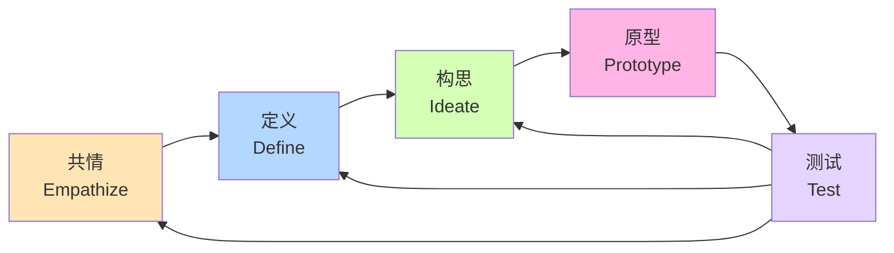
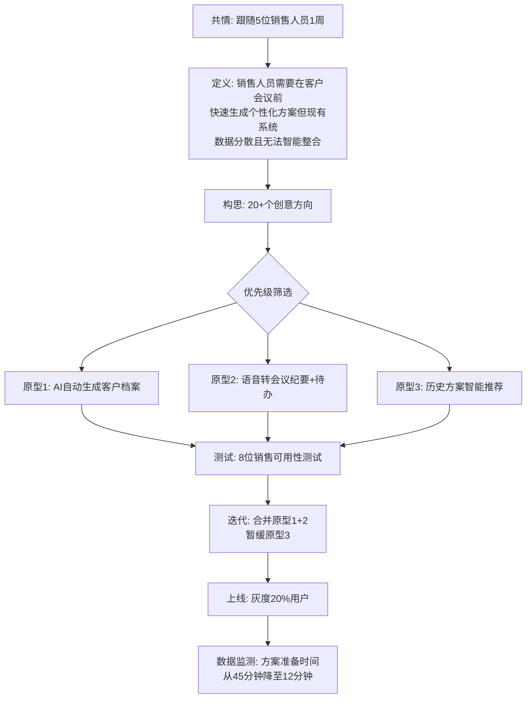

# 设计思维实践 | Design Thinking in Practice

> **TL;DR**: 设计思维是一套以用户为中心的创新方法论,通过共情、定义、构思、原型、测试五个阶段迭代优化产品。对于AI产品经理而言,设计思维不仅是工具,更是连接技术能力与用户价值的关键桥梁。本文深入探讨设计思维在AI产品中的实践应用,结合中国本土工具生态,为AI PM提供可落地的方法论指南。

## 目录

- [1. 引言 | Introduction](#1-引言--introduction)
- [2. 设计思维五步法 | Five Stages of Design Thinking](#2-设计思维五步法--five-stages-of-design-thinking)
  - [2.1 共情 (Empathize) - 深入用户世界](#21-共情-empathize---深入用户世界)
  - [2.2 定义 (Define) - 聚焦核心问题](#22-定义-define---聚焦核心问题)
  - [2.3 构思 (Ideate) - 释放创意思维](#23-构思-ideate---释放创意思维)
  - [2.4 原型 (Prototype) - 快速可视化](#24-原型-prototype---快速可视化)
  - [2.5 测试 (Test) - 验证与迭代](#25-测试-test---验证与迭代)
- [3. AI产品设计思维特殊性](#3-ai产品设计思维特殊性)
- [4. 中国设计工具实践生态](#4-中国设计工具实践生态)
- [5. 企业级B2B场景应用](#5-企业级b2b场景应用)
- [核心术语表 | Key Terminology](#核心术语表--key-terminology)
- [自测题 | Self-Check Questions](#自测题--self-check-questions)
- [实践练习 | Practice Exercises](#实践练习--practice-exercises)
- [扩展阅读 | Further Reading](#扩展阅读--further-reading)

---

## 1. 引言 | Introduction

在2026年的AI产品竞争中,技术能力已不再是唯一护城河。据QuestMobile《2025年三季度AI应用价值榜》数据,豆包凭借1.59亿月活用户和3447万月均下载量成为国内AI产品双料冠军,其成功的核心不在于模型参数,而在于对用户需求的精准理解和体验设计的持续迭代——这正是设计思维 (Design Thinking) 的价值所在。

设计思维起源于20世纪60年代的设计认知研究,由斯坦福大学教授David Kelley于1991年创立的设计咨询公司IDEO将其系统化并推广至商业领域。对于AI产品经理而言,设计思维提供了一套结构化的创新框架,帮助团队在技术不确定性与用户需求之间找到平衡点。

**为什么AI产品更需要设计思维?**

1. **技术复杂性与用户认知鸿沟**: AI产品的底层逻辑往往晦涩难懂(如大模型推理、向量检索),设计思维帮助PM将技术能力转化为用户可感知的价值
2. **需求模糊性**: 用户往往无法清晰表达对AI产品的期望(例如"帮我提升工作效率"),需要通过共情阶段深挖真实痛点
3. **快速迭代要求**: AI产品迭代速度远超传统软件,设计思维的原型-测试循环天然契合敏捷开发模式

本文将结合Microsoft企业工具案例与中国AI产品实践,系统阐述设计思维的五个阶段,并重点介绍即时设计、MasterGo、飞书白板等国产工具的应用场景。

---

## 2. 设计思维五步法 | Five Stages of Design Thinking

设计思维是一个非线性、迭代的过程,由五个相互关联的阶段构成。下图展示了这一流程的循环特性:



**关键特征**:
- **迭代性**: 测试阶段的洞察可能驱动团队回到任何前置阶段
- **人本性**: 所有决策以用户真实需求为出发点
- **行动导向**: 强调快速原型而非完美方案

### 2.1 共情 (Empathize) - 深入用户世界

共情阶段要求产品团队放下预设立场,通过多种研究方法深入理解用户的工作场景、情绪状态和未被满足的需求。

**核心方法**:

| 方法 | 适用场景 | 工具推荐 | 示例 |
|------|---------|---------|------|
| **深度访谈<br/>(In-depth Interview)** | 探索个体动机与决策逻辑 | 飞书妙记(实时转录) | 访谈销售人员了解CRM痛点 |
| **用户追踪<br/>(User Shadowing)** | 观察真实工作流程 | 录屏工具+即时设计标注 | 跟随客服观察AI对话助手使用 |
| **共情地图<br/>(Empathy Map)** | 结构化整理用户洞察 | 飞书白板模板 | 分析用户在使用AI工具时的想法/感受/行为 |
| **JTBD框架<br/>(Jobs to Be Done)** | 识别用户雇佣产品的核心任务 | 腾讯文档协作 | 用户雇佣豆包不是为了"聊天",而是为了"快速获取准确答案" |

**AI产品共情案例**:

文心一言团队在设计政务场景功能时,通过深度访谈发现政府工作人员的核心痛点不是"内容生成速度",而是"合规性审核效率"——这一洞察直接驱动了"敏感词实时检测"和"引用溯源"功能的开发。

### 教学洞察 💡

**AI产品共情的三个陷阱**:
1. **技术偏见**: 过度关注AI能做什么,而忽视用户需要什么(例如盲目追求多模态能力,但用户只需要文本对话)
2. **表层需求**: 满足于用户的口头表达,未深挖背后的情境因素(例如用户说"需要更快的响应",实际痛点可能是"不信任AI的准确性,需要多次确认")
3. **样本偏差**: 仅访谈技术早期采用者(Early Adopter),忽视主流用户的认知水平

**破解方法**: 采用**极端用户研究** (Extreme User Research),同时访谈"技术小白"和"专家用户",从两端洞察需求光谱。

---

### 2.2 定义 (Define) - 聚焦核心问题

定义阶段的目标是将共情阶段的海量信息提炼为清晰、可执行的问题陈述 (Problem Statement)。

**好问题陈述的四要素** (POV Framework):

```
[用户角色] 需要 [做什么],
因为 [洞察/痛点],
但是 [现有障碍]。
```

**案例对比**:

| 问题陈述质量 | 描述 | 评价 |
|------------|------|------|
| ❌ 糟糕 | "用户需要更智能的AI助手" | 过于宽泛,无法指导设计 |
| ⚠️ 一般 | "销售团队需要CRM系统集成AI功能" | 缺乏具体洞察 |
| ✅ 优秀 | "B2B销售人员需要在客户会议前快速生成个性化方案,因为他们平均管理50+客户线索且每天仅有2小时准备时间,但现有CRM无法自动整合历史沟通记录与产品知识库" | 清晰的角色+任务+痛点+约束 |

**定义阶段常用工具**:

- **亲和图法 (Affinity Diagram)**: 在飞书白板上将共情阶段的便签分类聚类
- **How Might We (HMW) 提问法**: 将问题重构为机会语句,例如"如何帮助销售人员在5分钟内生成客户方案?"
- **5 Whys分析**: 连续追问5次"为什么",挖掘根本原因

**AI产品定义陷阱**: 避免将问题定义为技术实现方式,例如"用户需要接入GPT-4模型"应改为"用户需要准确理解复杂多轮对话的意图"。

---

### 2.3 构思 (Ideate) - 释放创意思维

构思阶段鼓励团队产出大量解决方案,暂缓评判,追求创意的数量而非质量。

**经典构思方法**:

1. **脑暴会议 (Brainstorming)**
   - 规则: 禁止批评,鼓励疯狂想法,建立在他人想法之上
   - 工具: 飞书白板的"便签墙"功能,团队成员实时贴出想法
   - 技巧: 使用**SCAMPER法**(替代/组合/调整/改变用途/消除/重组)激发思路

2. **疯狂8 (Crazy 8s)**
   - 方法: 每人在8分钟内画出8个方案草图
   - 适用: 快速原型化多个UI交互方案
   - 工具: iPad + Apple Pencil / 即时设计的手绘模式

3. **角色扮演 (Role-Playing)**
   - 场景: 团队成员扮演不同用户角色,模拟使用AI产品的场景
   - 价值: 发现隐藏的用户旅程摩擦点

**AI产品构思实例**:

MasterGo团队在开发AI白板工具时,通过构思会议提出了20+个创意方向,包括:
- 手绘草图自动转换为高保真原型
- 语音描述需求自动生成UI组件
- 历史设计稿智能推荐复用元素

最终选择前两个方向进行原型开发,并在2025年2月推出的Readdy.ai中实现,4个月内达到近500万美元ARR。

**构思阶段的AI PM技巧**:
- **技术可行性预判**: 在构思阶段就邀请算法工程师参与,避免产出技术上不可行的方案
- **差异化思维**: 针对头部AI产品(ChatGPT/Claude)已有的功能,刻意寻找中国特色场景的差异化方案(如豆包的抖音生态整合)

---

### 2.4 原型 (Prototype) - 快速可视化

原型阶段将抽象想法转化为可触摸、可交互的实体,用于快速验证假设。

**原型保真度光谱**:

```
低保真 ←------------------------→ 高保真
纸质草图  线框图  交互原型  高保真界面  前端代码
(5分钟)  (30分钟) (2小时)   (1天)      (1周)
```

**中国设计工具原型实践**:

| 工具 | 适用阶段 | 核心功能 | 协作能力 | 学习曲线 |
|------|---------|---------|---------|---------|
| **即时设计** | 中高保真原型 | 丰富组件库,Figma文件兼容 | 支持500人同时在线 | ⭐⭐⭐ |
| **MasterGo** | 全流程设计 | AI辅助设计,手绘识别 | 团队评论与版本管理 | ⭐⭐⭐⭐ |
| **墨刀 (Modao)** | 低保真快速验证 | 快速链接页面流程 | 移动端预览 | ⭐⭐ |
| **飞书白板** | 概念验证阶段 | 便签/流程图/思维导图 | 实时协作+飞书生态集成 | ⭐ |

**AI产品原型特殊考量**:

1. **模拟AI响应**: 在原型中使用Placeholder文本模拟AI生成内容,或接入真实API进行灰度测试
2. **异常状态设计**: AI产品必须考虑"模型拒答"、"生成错误"、"理解偏差"等异常流程的原型
3. **时间维度**: 原型需体现AI的"思考时间"(loading状态)与"流式输出"(逐字显示)

**即时设计原型案例**:

某AI客服产品使用即时设计构建原型时,通过**组件变体 (Component Variants)** 功能设计了AI回复的三种状态:
- 等待状态: 跳动的三点动画
- 生成中状态: 文字逐行流式出现
- 完成状态: 完整答案+反馈按钮

这一原型在用户测试中发现,"逐行出现"的交互让用户感知等待时间减少40%(实际生成时间未变)。

---

### 2.5 测试 (Test) - 验证与迭代

测试阶段将原型置于真实用户面前,收集反馈并验证设计假设。

**测试方法分类**:

| 方法 | 目标 | 样本量 | 工具 | 数据类型 |
|------|------|--------|------|---------|
| **可用性测试<br/>(Usability Testing)** | 发现交互障碍 | 5-8人 | 录屏+访谈 | 定性 |
| **A/B测试** | 对比方案优劣 | 数千-数万人 | 数据埋点 | 定量 |
| **焦点小组<br/>(Focus Group)** | 探索多元观点 | 6-10人 | 线下/线上会议 | 定性 |
| **日志分析** | 发现隐藏模式 | 全量用户 | 神策/GrowingIO | 定量 |

**AI产品测试框架** (三维评估):

```
1. 功能有效性 (Does it work?)
   └─ AI回答准确率、任务完成率

2. 体验流畅性 (Is it easy?)
   └─ 用户操作步骤数、错误率、学习时间

3. 情感满意度 (Do they love it?)
   └─ NPS评分、推荐意愿、情绪分析
```

**测试执行技巧**:

1. **任务场景法**: 给用户具体任务而非开放探索,例如"假设你需要用AI助手写一份周报,请完成这个任务"
2. **Think Aloud协议**: 要求用户边操作边说出想法,捕捉决策过程
3. **5秒测试**: 展示界面5秒后移除,询问用户记住了什么——测试信息层级是否清晰

**测试反馈的优先级排序** (RICE模型):

```
优先级分数 = (Reach × Impact × Confidence) / Effort

Reach: 影响用户数
Impact: 影响程度(0.25/0.5/1/2/3)
Confidence: 确信度(50%/80%/100%)
Effort: 开发工时(人月)
```

---

### 教学洞察 💡

**AI产品测试的三个认知误区**:

1. **误区**: "用户说想要X功能,我们就做X"
   - **真相**: 用户表达的是表层需求,需要通过观察行为识别真实需求。例如用户说"希望AI回答更详细",观察后发现真实需求是"希望AI提供可验证的信息来源"

2. **误区**: "5个用户测试就够了"
   - **真相**: Nielsen的"5用户测试法"适用于发现严重可用性问题,但AI产品的场景多样性要求更大样本。建议分层采样不同用户画像(小白/专家,高频/低频)

3. **误区**: "负面反馈说明设计失败"
   - **真相**: 用户的抱怨往往指向最有价值的改进方向。Kimi月活从1407万降至992万的案例警示:忽视用户反馈的长期影响

---

## 3. AI产品设计思维特殊性

AI产品与传统软件在设计思维应用上存在本质差异,主要体现在以下四个维度:

### 3.1 不确定性管理

**传统软件**: 输入-输出关系确定(点击按钮→跳转页面)
**AI产品**: 输出具有概率性(相同prompt可能生成不同结果)

**设计应对**:
- 在定义阶段明确"可接受的不确定性范围"(例如AI客服允许10%的答非所问率)
- 原型中设计"不确定性可视化"(例如显示AI的置信度评分)
- 测试阶段增加"边界场景测试"(Edge Case Testing),如歧义输入、对抗性prompt

### 3.2 用户心智模型断层

**挑战**: 用户往往将AI拟人化,期望其像人类一样理解上下文,但实际上AI的"理解"基于统计相关性而非语义推理。

**共情阶段关键问题**:
- 用户如何解释AI的错误?(归因于"AI不够聪明" vs "我的表达不清")
- 用户对AI能力的预期上限在哪?(通用智能 vs 垂直领域助手)

**案例**: 豆包团队发现用户在对话失败后,67%会直接退出而非换种方式重试。基于此洞察,产品增加了"换个问法"按钮+智能改写建议,使对话成功率提升28%。

### 3.3 伦理与价值观嵌入

AI产品的设计决策天然携带价值判断(例如内容审核标准、推荐算法的公平性),设计思维需要在共情阶段就纳入**利益相关方分析** (Stakeholder Analysis)。

**扩展框架**: 除五步法外,增加**伦理审查阶段**:
- 偏见审计: AI是否对特定群体不公平?
- 透明度设计: 用户能否理解AI的决策逻辑?
- 可控性保障: 用户能否撤销/修正AI的操作?

### 3.4 技术演进速度

AI模型能力每6-12个月发生代际跃迁(如GPT-3→GPT-4),设计思维需要支持"能力驱动的重构"而非"需求驱动的迭代"。

**应对策略**:
- 在定义阶段区分"核心价值主张"与"技术实现方式"
- 原型采用**模块化设计**,AI能力层与交互层解耦
- 建立**技术能力评估机制**,每季度重新评估"哪些之前无法实现的想法现在可行了"

---

### 教学洞察 💡

**AI产品的反向设计思维**:

传统设计思维是"用户需求 → 解决方案",但AI产品有时需要"技术突破 → 场景探索"。例如:
- 2023年多模态大模型突破后,各家产品快速探索"AI识图"场景(拍照搜题、图片问答)
- 这种"技术推动"的创新需要在构思阶段采用**技术雷达** (Technology Radar),持续扫描前沿能力

**平衡之道**: 双轨制设计思维
- **需求驱动轨**: 传统五步法,聚焦已验证的用户痛点
- **技术驱动轨**: 从最新AI能力出发,通过快速原型探索未知场景,每月进行"技术能力showcase"

---

## 4. 中国设计工具实践生态

在Figma等海外工具访问受限的背景下,中国本土设计工具生态快速成熟。以下对比主流工具的设计思维支持能力:

### 4.1 工具对比矩阵

| 功能维度 | 即时设计 | MasterGo | Pixso | 飞书白板 | 腾讯文档白板 |
|---------|---------|----------|-------|---------|-------------|
| **共情阶段** |  |  |  |  |  |
| 用户旅程地图模板 | ✅ | ✅ | ✅ | ✅✅ | ✅ |
| 实时协作批注 | ✅(500人) | ✅(500人) | ✅(200人) | ✅✅(无限制) | ✅(100人) |
| 共情地图模板 | ❌ | ❌ | ❌ | ✅ | ✅ |
| **定义阶段** |  |  |  |  |  |
| 亲和图分类 | ⚠️(需手动) | ⚠️(需手动) | ⚠️(需手动) | ✅(自动聚类) | ❌ |
| 投票与优先级排序 | ❌ | ❌ | ❌ | ✅ | ✅ |
| **构思阶段** |  |  |  |  |  |
| 脑暴模板 | ✅ | ✅ | ✅ | ✅✅ | ✅ |
| 手绘识别 | ❌ | ✅✅(AI识别) | ❌ | ⚠️(基础) | ❌ |
| AI辅助生成 | ⚠️(Beta) | ✅✅(Readdy.ai) | ⚠️(Beta) | ❌ | ❌ |
| **原型阶段** |  |  |  |  |  |
| 组件库丰富度 | ✅✅ | ✅✅ | ✅ | ❌ | ❌ |
| 交互原型 | ✅✅ | ✅✅ | ✅✅ | ❌ | ❌ |
| 移动端预览 | ✅ | ✅ | ✅ | ⚠️(H5链接) | ❌ |
| **测试阶段** |  |  |  |  |  |
| 版本管理 | ✅ | ✅ | ✅ | ⚠️(基础) | ⚠️(基础) |
| 评论与反馈 | ✅ | ✅ | ✅ | ✅✅ | ✅ |
| 分享权限管理 | ✅ | ✅ | ✅ | ✅✅ | ✅ |
| **生态集成** |  |  |  |  |  |
| 飞书集成 | ⚠️(第三方) | ❌ | ❌ | ✅✅(原生) | ❌ |
| 微信集成 | ⚠️(分享) | ⚠️(分享) | ⚠️(分享) | ❌ | ✅(企业微信) |
| 开发交付 | ✅(代码标注) | ✅(代码标注) | ✅(代码标注) | ❌ | ❌ |

**图例**: ✅✅ 优秀 | ✅ 良好 | ⚠️ 基础 | ❌ 不支持

### 4.2 推荐工具组合方案

**方案一: 全流程一站式** (适合中小团队)
- **核心工具**: MasterGo (原因: AI辅助能力+完整设计流程)
- **辅助工具**: 飞书白板(前期共情与构思) + 飞书文档(研究报告)

**方案二: 专业分工** (适合大型团队)
- **共情+定义**: 飞书白板(利用投票/计时器等协作功能)
- **构思+原型**: 即时设计(组件库丰富,协作流畅)
- **测试+交付**: 即时设计(代码标注) + 神策分析(数据埋点)

**方案三: AI驱动创新** (适合探索AI产品新形态)
- **AI原型生成**: MasterGo Readdy.ai(手绘转原型)
- **快速验证**: 墨刀(低保真快速链接页面)
- **数据验证**: A/B测试平台(火山引擎DataTester)

### 4.3 工具迁移指南

许多团队面临从Figma迁移至国产工具的挑战,以下是平滑迁移的三步法:

**Step 1: 文件迁移**
- 即时设计、MasterGo、Pixso均支持导入Figma文件(.fig格式)
- ⚠️ 注意事项: 字体可能需要重新匹配,插件功能会丢失,部分高级交互需重建

**Step 2: 团队培训**
- 利用官方提供的迁移教程(即时设计有"Figma用户快速上手指南")
- 设置1-2周过渡期,双平台并行

**Step 3: 流程优化**
- 重新定义组件库规范(适配国产工具特性)
- 建立飞书/企业微信集成,利用国内协作生态优势

---

## 5. 企业级B2B场景应用

设计思维在企业级AI产品中的应用具有独特挑战,以下通过三个场景深度解析:

### 5.1 场景一: AI驱动的CRM系统优化

**背景**: 某B2B SaaS公司开发AI销售助手,集成于企业CRM系统。

**完整设计思维流程**:



**关键洞察**:
1. **共情发现**: 销售人员最大痛点不是"生成内容速度",而是"不信任AI生成的准确性",需要大量时间人工校验
2. **解决方案**: 在原型中增加"信息溯源"功能,每句话标注来源(历史邮件/CRM记录/产品文档),信任度提升显著

### 5.2 场景二: Microsoft Dynamics 365演进

根据Microsoft企业工具的演进路径,可推测其设计思维应用:

**阶段划分**:

| 阶段 | 时间 | 设计思维焦点 | 产出 |
|------|------|------------|------|
| **1.0 基础版** | 2016-2018 | 共情: 传统ERP用户痛点 | 统一客户数据视图 |
| **2.0 智能化** | 2019-2021 | 定义: 销售效率瓶颈<br/>构思: AI驱动的预测分析 | 潜在客户评分,销售预测 |
| **3.0 行业化** | 2022-2024 | 共情: 不同行业特殊需求<br/>原型: 行业模板 | 零售/制造/金融专属模块 |
| **4.0 Copilot时代** | 2024+ | 构思: 对话式操作<br/>测试: 自然语言交互 | 嵌入式AI助手 |

**设计思维价值**: 通过持续迭代,Dynamics 365从"功能堆砌"演变为"场景化解决方案"。

### 5.3 场景三: Microsoft Power Platform的公民开发者赋能

**设计挑战**: 如何让没有编程背景的业务人员也能开发定制化应用?

**共情方法**:
- 招募30位非技术背景的业务人员,给他们3小时时间尝试构建一个简单应用
- 观察记录: 平均失败次数、求助频率、情绪变化

**定义问题**:
"业务人员需要在无需学习代码的前提下快速构建符合自身工作流的应用,但现有平台的抽象概念(如'数据源连接'、'触发器')与他们的日常语言不匹配,导致学习曲线陡峭。"

**构思与原型**:
- 创意1: 拖拽式界面(最终采纳)
- 创意2: 预置100+行业模板(最终采纳)
- 创意3: AI对话生成应用(列入2025年路线图)

**测试反馈循环**:
- 发布Beta版,收集社区反馈
- 每季度更新连接器库(现已支持1000+数据源)
- 持续优化文档与教学视频

**成果**: 据Microsoft官方披露,Power Platform全球用户数突破2000万,其中70%为非技术背景的"公民开发者"。

---

## 核心术语表 | Key Terminology

| 中文 | English | 解释 |
|------|---------|------|
| 设计思维 | Design Thinking | 一种以人为本的创新方法论,通过共情、定义、构思、原型、测试五个阶段迭代优化解决方案 |
| 共情 | Empathize | 深入理解用户的需求、动机、情绪和行为的研究阶段 |
| 定义 | Define | 将共情阶段的洞察提炼为清晰、可执行的问题陈述 |
| 构思 | Ideate | 通过头脑风暴等方法产生大量潜在解决方案的创意阶段 |
| 原型 | Prototype | 将想法转化为可触摸、可交互的早期版本,用于验证假设 |
| 测试 | Test | 将原型置于真实用户面前收集反馈并迭代优化 |
| 用户画像 | User Persona | 基于研究数据构建的虚拟典型用户,包含人口统计学特征、行为模式、目标和痛点 |
| 共情地图 | Empathy Map | 可视化工具,记录用户的想法、感受、言语和行动,帮助团队建立共同的用户理解 |
| 问题陈述 | Problem Statement | 清晰描述用户面临的核心挑战,指导后续解决方案设计 |
| JTBD | Jobs to Be Done | "待完成任务"框架,关注用户雇佣产品完成的根本任务而非表面功能 |
| 线框图 | Wireframe | 低保真度的界面草图,聚焦布局和信息架构而非视觉细节 |
| 高保真原型 | High-Fidelity Prototype | 接近最终产品视觉效果和交互逻辑的原型,用于精细化测试 |
| 可用性测试 | Usability Testing | 观察真实用户使用产品的过程,识别交互障碍和困惑点 |
| A/B测试 | A/B Testing | 对比两个或多个设计方案的实际效果,通过数据指标决策 |
| 迭代 | Iteration | 基于反馈循环不断改进产品的过程 |
| MVP | Minimum Viable Product | 最小可行产品,用最少功能验证核心假设 |

---

## 自测题 | Self-Check Questions

### 基础题

1. **设计思维的五个阶段分别是什么?请按顺序排列并简述每个阶段的核心目标。**
   <details>
   <summary>查看答案</summary>
   共情(Empathize)-理解用户真实需求; 定义(Define)-提炼核心问题; 构思(Ideate)-产生解决方案; 原型(Prototype)-快速可视化; 测试(Test)-验证与迭代。关键特征是非线性,可从任一阶段回到前置阶段。
   </details>

2. **在共情阶段,为什么"用户追踪"(User Shadowing)比问卷调查更有价值?**
   <details>
   <summary>查看答案</summary>
   用户追踪观察真实行为,能发现用户自己未意识到的痛点(隐性需求);问卷调查依赖用户自述,往往只能获取表层需求且存在社会期许偏差。例如用户可能说"我很满意现有CRM",但观察发现他们大量使用Excel做二次整理,揭示真实痛点。
   </details>

3. **即时设计、MasterGo、飞书白板在设计思维应用中各自的核心优势是什么?**
   <details>
   <summary>查看答案</summary>
   即时设计: 丰富组件库+高保真原型能力,适合原型与测试阶段; MasterGo: AI辅助手绘识别,适合快速从构思到原型; 飞书白板: 实时协作+投票等功能,适合共情与定义阶段的团队研讨。
   </details>

### 进阶题

4. **AI产品在应用设计思维时,相比传统软件有哪三个关键差异?请举例说明。**
   <details>
   <summary>查看答案</summary>
   (1)不确定性管理: AI输出具有概率性,需要设计"置信度可视化"; (2)用户心智模型断层: 用户拟人化期望与AI统计本质的冲突,需在原型中设计"能力边界提示"; (3)伦理价值观嵌入: AI决策涉及公平性/透明度,需增加伦理审查阶段。例如豆包的"换个问法"按钮就是针对AI不确定性的设计应对。
   </details>

5. **在定义阶段,如何避免将问题陈述写成"技术方案"而非"用户需求"?请改写以下陈述:**
   原陈述: "用户需要接入GPT-4模型来提升回答质量"
   <details>
   <summary>查看答案</summary>
   改写为: "销售人员需要在客户咨询时获得准确且符合公司话术规范的答案,因为现有AI助手经常提供过时或不合规的信息,导致他们不敢直接使用AI回复。" 关键是描述"用户角色+任务+痛点",而非跳到技术实现。
   </details>

### 综合应用题

6. **假设你是某在线教育AI产品的PM,用户反馈"AI生成的习题太简单"。请用设计思维五步法设计调研与优化方案。(300字以内)**
   <details>
   <summary>查看答案</summary>
   共情: 访谈10位用户,观察他们做题场景,询问"简单"的具体表现(重复知识点?缺乏挑战?); 定义: 提炼问题陈述,如"学生需要与当前能力水平匹配的习题以保持学习动力,但现有AI无法准确评估学生真实水平"; 构思: 脑暴方案(自适应难度/学生自选难度/错题分析驱动); 原型: 用即时设计模拟自适应难度的交互流程,在难度调整时展示逻辑说明; 测试: A/B测试不同方案,监测完成率、正确率、续费率。关键洞察: "简单"可能不是绝对难度问题,而是缺乏个性化匹配。
   </details>

7. **MasterGo的Readdy.ai工具实现了手绘草图转高保真原型,这一功能在设计思维的哪些阶段最有价值?为什么?**
   <details>
   <summary>查看答案</summary>
   最有价值的阶段: (1)构思阶段: 快速将纸面想法数字化,缩短从创意到原型的时间,支持Crazy 8s等快速构思方法; (2)原型阶段: 降低原型制作门槛,让非设计师背景的PM/工程师也能快速产出可测试原型; (3)测试阶段: 在用户访谈中现场手绘改进方案并即时转换为原型,实现"边测边改"。核心价值是减少工具学习成本,让团队聚焦创意本身而非工具操作。
   </details>

---

## 实践练习 | Practice Exercises

### 练习一: 共情地图实战(45分钟)

**目标**: 掌握共情地图工具,识别AI产品用户的深层需求

**步骤**:
1. 选择一个你熟悉的AI产品(如豆包、Kimi、文心一言)
2. 打开飞书白板,选择"共情地图"模板
3. 基于你的使用经验或观察他人使用,填写四个象限:
   - **想 (Think)**: 用户使用时的内心想法(如"这个回答靠谱吗?")
   - **看 (See)**: 用户看到的界面元素和环境
   - **说 (Say)**: 用户说出的评价或抱怨
   - **做 (Do)**: 用户的实际操作行为
4. 在地图底部总结: 用户的痛点(Pains)和收益(Gains)

**加分项**: 邀请2-3位同事/朋友一起填写,对比不同用户的共情地图差异

---

### 练习二: 原型迭代挑战(90分钟)

**场景**: 某企业需要开发AI会议纪要工具,自动记录会议内容并生成待办事项

**任务**:
1. **低保真原型**(30分钟)
   - 在纸上或飞书白板手绘主界面草图
   - 标注核心功能模块: 实时转录区/AI总结区/待办列表

2. **中保真原型**(40分钟)
   - 使用即时设计或MasterGo搭建线框图
   - 设计交互流程: 会议开始→实时记录→会议结束→生成摘要→编辑待办
   - 考虑异常场景: 语音识别错误怎么办?多人同时发言如何区分?

3. **测试准备**(20分钟)
   - 撰写3个用户测试任务场景
   - 设计测试后访谈的5个问题

**输出**: 可交互的原型链接 + 测试计划文档

---

### 练习三: AI产品设计思维全流程(120分钟)

**项目简介**: 设计一个面向程序员的AI代码审查助手

**完整流程**:

**阶段1: 共情(30分钟)**
- 访谈至少2位程序员,了解他们进行代码审查(Code Review)的流程和痛点
- 记录关键引语和行为观察

**阶段2: 定义(15分钟)**
- 撰写问题陈述(使用POV框架)
- 列出3个必须满足的设计约束(如响应时间、准确率要求)

**阶段3: 构思(20分钟)**
- 进行一次10分钟的个人脑暴,产出至少15个创意
- 使用投票法选出最有潜力的3个方向

**阶段4: 原型(40分钟)**
- 选择1个方向制作交互原型(使用即时设计/MasterGo)
- 至少包含3个关键界面和交互流程

**阶段5: 测试(15分钟)**
- 设计5个可用性测试任务
- 制定成功指标(如任务完成时间、错误率)

**输出**: 完整的设计思维文档(含研究发现、问题陈述、原型链接、测试计划)

---

## 扩展阅读 | Further Reading

### 中文资源

1. **《设计思维手册》- IDEO官方中文版**
   链接: https://ideodesignthinking.cn/
   推荐理由: IDEO官方设计思维资源库,包含方法卡片、案例库、在线课程

2. **《2025国产大模型排名与应用报告》- CSDN技术社区**
   链接: https://blog.csdn.net/m0_60862202/article/details/150395262
   推荐理由: 涵盖豆包、文心一言、Kimi等产品的市场表现与设计特点分析

3. **即时设计官方设计思维教程**
   链接: https://js.design/community (搜索"设计思维")
   推荐理由: 结合即时设计工具的实操教学,包含模板和实战案例

4. **MasterGo AI白板产品案例 - 极客公园**
   链接: https://www.geekpark.net/news/330722
   推荐理由: 详细解析MasterGo如何用AI技术重构设计思维流程

5. **飞书产品设计团队博客**
   链接: https://www.feishu.cn/hc/zh-CN (搜索"设计方法")
   推荐理由: 飞书团队分享的企业级协作产品设计经验

### 英文资源(可选)

6. **Stanford d.school Design Thinking Bootleg**
   说明: 斯坦福设计学院的设计思维工具包,虽为英文但图示清晰易懂

7. **Nielsen Norman Group - Usability Testing 101**
   说明: 可用性测试领域权威资源,提供系统化测试方法论

---

**结语**

设计思维不是一次性的流程,而是一种持续的思维方式。对于AI产品经理而言,真正的挑战不在于掌握五步法的机械执行,而在于培养**以用户为中心的本能** (User-Centric Instinct):

- 在评审技术方案时,问"这解决了用户的哪个痛点?"
- 在查看数据报表时,问"这个指标背后的用户行为是什么?"
- 在规划产品路线图时,问"我们对用户真实需求的假设是什么?如何快速验证?"

2026年的AI产品竞争已从技术军备赛转向体验精细化运营,设计思维正是这一转型的核心方法论。从豆包的1.59亿月活,到MasterGo Readdy.ai的500万美元ARR,成功的AI产品背后都有一条清晰的设计思维主线。

立即行动:选择本文的任一实践练习,用2小时时间完整走一遍设计思维流程。记住,设计思维最大的敌人不是缺乏创意,而是害怕从用户那里听到"不"——拥抱失败,快速迭代,用户会告诉你答案。
