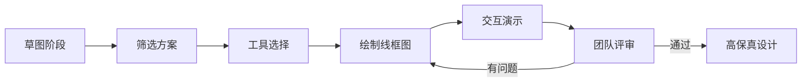

# 草图与线框图 | Sketching & Wireframing

> TL;DR: 草图和线框图是产品设计流程中不可或缺的低保真视觉工具，帮助产品经理和设计师快速将创意具象化、及早发现可用性问题、降低迭代成本。本文将重点介绍国产工具生态（墨刀、蓝湖、即时设计、MasterGo、Pixso）及AI赋能下的2026年原型设计新趋势，帮助AI产品经理掌握从手绘草图到高保真原型的全流程技能。

## 目录

1. [引言 | Introduction](#1-引言--introduction)
2. [草图与线框图基础概念](#2-草图与线框图基础概念)
3. [国产原型设计工具生态](#3-国产原型设计工具生态)
4. [草图绘制实践方法](#4-草图绘制实践方法)
5. [线框图设计工作流](#5-线框图设计工作流)
6. [AI赋能的原型设计新趋势](#6-ai赋能的原型设计新趋势)
7. [核心术语表 | Key Terminology](#核心术语表--key-terminology)
8. [自测题 | Self-Check Questions](#自测题--self-check-questions)
9. [实践练习 | Practice Exercises](#实践练习--practice-exercises)
10. [扩展阅读 | Further Reading](#扩展阅读--further-reading)

---

## 1. 引言 | Introduction

在AI产品开发过程中，许多初入行的产品经理面临一个经典挑战：**如何在技术实现之前，快速验证产品构想的可行性？**传统的文字需求文档（PRD）往往难以充分传达产品的交互逻辑和用户体验，而直接进入高保真UI设计或代码开发，一旦发现方向性问题，付出的试错成本极其高昂。

这正是草图（Sketch）和线框图（Wireframe）的价值所在——它们是介于抽象构思与具体实现之间的"可视化思考工具"，帮助团队以极低成本完成从0到1的产品雏形验证。

对于AI产品经理而言，草图与线框图的技能看似与算法模型、数据训练等"硬核"技术相去甚远，但实际上这是**打通技术与用户体验的关键桥梁**：

- 在智能推荐算法设计中，线框图帮助你规划用户看到推荐结果的展示逻辑；
- 在对话式AI界面设计中，草图快速勾勒多轮对话的分支流程；
- 在机器学习模型上线前，原型用于用户测试，验证模型输出是否符合实际使用场景。

本文将系统介绍草图与线框图的基础概念、国产工具生态、实践方法论，并重点探讨2026年AI技术如何重塑原型设计流程。

---

## 2. 草图与线框图基础概念

### 2.1 草图（Sketch）：快速具象化创意的第一步

草图是产品设计流程中**保真度最低、速度最快**的视觉表达形式，通常用纸笔或简单的绘图工具完成。

**核心特征：**
- **粗略性**：无需精确标注尺寸、颜色或字体，重点在于表达布局框架
- **快速性**：一个页面的草图通常5-10分钟即可完成
- **探索性**：鼓励同时绘制多个版本，快速比较不同方案

**典型应用场景：**
- 头脑风暴会议上快速记录创意方案
- 在用户访谈现场即时勾勒产品原型征求反馈
- 产品早期阶段，在需求尚未完全明确时探索多种可能性

**草图的价值在于"降低完美主义门槛"**：由于草图明显是未完成状态，团队成员和用户更愿意提出大胆的改进意见，而不是拘泥于细节。就像建筑师在设计大楼前先画概念草图，产品经理也应在功能列表确定前先画出核心流程的草图。

### 2.2 线框图（Wireframe）：结构与层次的蓝图

线框图是比草图更进一步的低保真设计产物，通常用专业工具（如墨刀、Axure）制作，重点在于**界面结构、信息层级和交互流程**。

**核心特征：**
- **结构化**：明确界面各区块的位置和大小比例
- **层级清晰**：通过大小、粗细区分内容的重要程度
- **交互可演示**：支持页面跳转、表单填写等基础交互逻辑

**线框图 vs 草图 vs 高保真设计对比：**

```
┌─────────────────────────────────────────────────────────────────┐
│         草图          →      线框图       →     高保真设计       │
├─────────────────────────────────────────────────────────────────┤
│  保真度：  ★☆☆☆☆      ★★★☆☆            ★★★★★              │
│  制作时间：  5-10分钟      0.5-2小时          2-8小时+          │
│  适用阶段：  创意发散      需求确认           视觉设计           │
│  修改成本：  极低          低                高                  │
└─────────────────────────────────────────────────────────────────┘
```

**线框图的三大核心要素：**

1. **布局结构（Layout）**
   - 顶部导航栏放置品牌Logo和主功能入口
   - 中部内容区采用单栏还是多栏布局
   - 底部放置次要功能或法律信息

2. **信息层级（Hierarchy）**
   - 标题用大字号醒目展示
   - 正文内容采用常规字号
   - 辅助说明用小字号或灰色弱化

3. **交互流程（User Flow）**
   - 点击按钮后跳转到哪个页面
   - 表单提交后显示成功还是错误提示
   - 用户如何返回上一级页面

### 2.3 保真度光谱：低保真 vs 高保真

产品设计中的"保真度（Fidelity）"指设计稿与最终产品的相似程度。理解保真度光谱有助于在不同阶段选择合适的工具和方法。

| 保真度级别 | 表现形式 | 主要用途 | 典型工具 |
|-----------|---------|---------|---------|
| **极低保真** | 纸笔手绘草图 | 创意发散、快速迭代 | 纸笔、白板 |
| **低保真** | 线框图（黑白灰） | 结构验证、流程测试 | 墨刀、Axure、Balsamiq |
| **中保真** | 带基本样式的线框图 | 交互演示、内部评审 | 即时设计、MasterGo |
| **高保真** | 接近真实产品的设计稿 | 用户测试、开发交付 | Sketch、Figma、Pixso |
| **可交互原型** | 包含动画和交互的模型 | 融资演示、上线前验证 | Principle、ProtoPie |

**保真度选择原则：**
- **早期探索阶段**：用低保真快速试错，避免在错误方向上浪费精力
- **需求确认阶段**：用中保真演示核心流程，确保团队理解一致
- **开发交付阶段**：用高保真明确视觉规范，减少开发还原偏差

---

## 3. 国产原型设计工具生态

### 3.1 工具生态概览

随着Figma在中国访问不稳定及数据安全问题凸显，国产原型设计工具迅速崛起。截至2026年，中国市场已形成"五大工具"格局：**墨刀（Modao）、蓝湖（Lanhu）、即时设计（Instant Design）、MasterGo、Pixso**。

**国产工具的核心优势：**
- **网络稳定性**：国内服务器部署，无需翻墙，访问速度快
- **本土化支持**：中文界面、中文客服、适配国内团队协作习惯
- **定价友好**：多数工具提供永久免费的个人版或教育版
- **AI能力领先**：2026年国产工具的AI生成功能已超越国际竞品

### 3.2 五大工具深度对比

#### 工具对比表

| 工具名称 | 核心定位 | AI能力 | 协作上限 | 免费版限制 | 适用场景 |
|---------|---------|--------|---------|-----------|---------|
| **墨刀** | 快速原型设计 | ★★★★★<br/>AI生成原型/PRD/竞品分析 | 无限制 | 3个项目 | 产品经理主导的快速验证 |
| **蓝湖** | 设计协作交付 | ★★☆☆☆<br/>自动标注/切图 | 无限制 | 仅查看功能 | 设计师与开发协作场景 |
| **即时设计** | 全能设计工具 | ★★★★☆<br/>即时AI生成UI设计稿 | 500人 | 永久免费无功能限制 | 中小团队一站式设计 |
| **MasterGo** | 企业级设计协作 | ★★★★☆<br/>智能设计建议/图片处理 | 500人 | 个人免费 | 大型企业设计系统管理 |
| **Pixso** | AI原生设计工具 | ★★★★★<br/>一键生成React/Vue代码 | 无限制 | 3个文件 | 快速MVP验证与融资演示 |

**数据来源：**各工具官方网站2026年1月信息（墨刀：https://modao.cc/ | 蓝湖：https://lanhuapp.com/ | 即时设计：https://js.design/ | MasterGo：https://mastergo.com/ | Pixso：https://pixso.cn/）

#### 3.2.1 墨刀（Modao）：产品经理的首选利器

**官方定位：** 在线产品设计协作平台，支持AI生成原型/AIPPT，兼容Axure/Sketch/Figma文件

**核心功能亮点：**

1. **AI Agent智能体**
   - 通过自然语言描述、线框草图或截图生成包含页面结构和交互逻辑的原型
   - 一键生成产品文档、竞品调研报告、产品交互说明等
   - 支持智能在线评审功能，自动识别设计问题

2. **高级交互设计**
   - 支持条件逻辑和变量，媲美Axure的交互能力
   - 可创建复杂交互流程（如登录状态判断、多步骤表单验证）

3. **10000+ 模板资源库**
   - 涵盖电商、社交、金融、教育等多个行业
   - 组件素材拿来即用，快速构建高保真原型

**适用场景：**
- AI产品经理快速验证智能推荐系统的页面交互逻辑
- 创业团队在融资路演前制作可演示的MVP原型
- 产品经理与开发团队沟通复杂交互需求

**实战洞察 💡**

在AI产品设计中，墨刀的条件逻辑功能尤其适合模拟**个性化推荐场景**。例如，设计一个新闻推荐APP时，你可以设置：
- 变量：用户兴趣标签（科技/娱乐/财经）
- 条件逻辑：根据兴趣标签显示不同的内容卡片
- 交互反馈：用户点击"不感兴趣"后触发标签更新

这种可演示的原型比静态线框图更容易说服团队和投资人，因为它直观展示了AI算法输出在真实界面中的呈现效果。

#### 3.2.2 蓝湖（Lanhu）：设计到开发的无缝桥梁

**官方定位：** 高效的产品设计协作平台，无缝连接产品、设计、研发流程

**核心功能亮点：**

1. **自动标注与切图**
   - 设计师上传设计稿后，系统自动生成尺寸标注
   - 支持多格式切图下载（PNG、SVG、WebP）
   - 前端工程师可直接复制CSS/Swift/Android代码

2. **版本控制与历史管理**
   - 查看设计稿的所有历史版本
   - 支持版本对比，快速发现改动内容
   - 误删文件可快速还原

3. **设计规范管理**
   - 统一管理颜色、字体、间距等设计规范
   - 确保团队设计输出的一致性

**适用场景：**
- 设计师交付高保真设计稿给开发团队
- 跨地域团队的异步协作（设计师在深圳，开发在北京）
- 大型项目需要严格的设计规范管理

**与原型工具的区别：**
蓝湖侧重**设计交付阶段**，而非原型设计阶段。如果你已有高保真设计稿（如Sketch或Figma导出），用蓝湖可以大幅提升与开发的协作效率；但如果需要从零开始绘制线框图，墨刀或即时设计更合适。

#### 3.2.3 即时设计（Instant Design）：永久免费的全能选手

**官方定位：** 首款国产专业级UI设计工具，永久免费，支持多平台使用

**核心功能亮点：**

1. **跨平台无缝切换**
   - 支持网页端、macOS、Windows、Linux、iOS、Android、微信小程序
   - 完美适配iPad，支持Apple Pencil手写绘图

2. **即时AI设计助手**
   - 通过自然语言描述快速生成可编辑的UI设计稿
   - 识别页面风格并自动生成组件样式、配色方案

3. **文件格式兼容**
   - 原生支持Sketch和XD文件导入
   - 全网首个支持Sketch文件导出的国产工具

4. **永久免费承诺**
   - 官方承诺基础版永久免费，功能不限制
   - 适合个人设计师和中小团队长期使用

**适用场景：**
- 学生学习UI设计，无需为软件付费
- 独立设计师接外包项目，零成本启动
- 中小型创业团队快速迭代产品设计

**实战洞察 💡**

即时设计的AI功能特别适合**非设计背景的AI产品经理**。假设你需要设计一个对话式AI聊天界面，但不懂Sketch或Figma的复杂操作，你可以：
1. 在即时AI中输入："设计一个客服聊天界面，左侧用户消息用蓝色气泡，右侧AI回复用灰色气泡，底部有输入框和发送按钮"
2. AI在30秒内生成初步设计稿
3. 你手动调整细节（如气泡圆角、字体大小）
4. 导出为PNG或分享链接给团队评审

这种"文字转设计"的能力大幅降低了原型设计的技术门槛，让产品经理能够独立完成从草图到中保真原型的全流程。

#### 3.2.4 MasterGo：字节跳动出品的企业级方案

**官方定位：** AI时代的数字界面生产平台（字节跳动旗下火山引擎发布）

**核心功能亮点：**

1. **AI智能设计建议**
   - 自动提供颜色搭配、布局调整、元素优化建议
   - 规范检查：自动校正不符合设计系统的元素样式

2. **图片处理AI**
   - 背景抠图功能，一键去除图片背景
   - 模糊图片转高清功能

3. **企业级协作**
   - 支持最多500人同时在线协同工作
   - 设计组件一键复用，一处修改全局同步

4. **本土化体验**
   - 结合Sketch和Figma的快捷键习惯，降低学习成本
   - 国内服务器，省钱且无需翻墙

**适用场景：**
- 大型企业统一设计系统管理（如电商平台的多个APP需保持视觉一致性）
- 设计团队需要AI辅助提升设计质量
- 跨部门大规模协作项目（产品、设计、开发、测试多角色并行）

**为什么选MasterGo而非Figma？**
对于中国团队，MasterGo的核心优势是**网络稳定性 + 企业级支持**。Figma在中国的访问速度不稳定，且企业数据存储在海外服务器，存在数据合规风险。MasterGo由字节跳动背书，提供私有化部署方案，满足大型企业的安全合规要求。

#### 3.2.5 Pixso：AI原生的一站式工具

**官方定位：** AI原生UI设计工具，一键生成设计稿与代码，国产Figma替代首选

**核心功能亮点：**

1. **AI一键生成代码**
   - 支持将设计稿导出为React/Vue代码
   - 开发人员可直接复制CSS样式代码

2. **原型到UI的一体化流程**
   - 从低保真线框图到高保真UI设计的无缝切换
   - 内置组件变体、自动布局等高级工具

3. **Pixso 2.0强大原型能力**
   - 几分钟内搭建多页面Demo
   - 支持复杂交互动画预设

**适用场景：**
- 创业团队快速验证MVP并融资演示
- 教师、培训机构或学生团队的教学工具
- 关注视觉规范与交互体验的设计团队

**Pixso vs 墨刀 vs 即时设计：如何选择？**

```
选择决策树：
├─ 你是产品经理，需要快速绘制低保真原型 → 墨刀
├─ 你是设计师，需要完整的设计到开发工作流 → Pixso
├─ 你是学生或独立开发者，预算为零 → 即时设计
└─ 你在大型企业，需要设计系统管理 → MasterGo
```

---

## 4. 草图绘制实践方法

### 4.1 草图绘制的核心原则

**原则一：拥抱"丑"**

草图的价值不在于美观，而在于快速试错。如果你花20分钟纠结一个按钮的圆角弧度，那就偏离了草图的初衷。记住：**草图应该看起来明显未完成，这样团队成员才敢于提出颠覆性建议。**

**原则二：大量快速迭代**

不要试图一次画出完美方案，而应在5分钟内画出3-5个不同的布局版本，然后快速筛选。这种"数量优先于质量"的策略在创意发散阶段尤其有效。

**原则三：专注核心流程**

草图阶段不要纠结边缘功能，先画出用户完成核心任务的"主干路径"。例如设计一个AI智能客服系统，先画"用户提问 → AI回答 → 用户评价"这条主线，而不是先画"用户登录 → 修改头像 → 查看历史记录"这些次要功能。

### 4.2 实用的草图绘制技巧

#### 技巧1：使用统一的符号体系

建立一套简单的符号语言，提高草图的可读性：

```
┌─────────────────────────────────────┐
│  常用草图符号                        │
├─────────────────────────────────────┤
│  □  = 占位图片                      │
│  ☐  = 复选框                        │
│  ○  = 单选按钮                      │
│  [Button] = 可点击按钮              │
│  ────────  = 文本段落               │
│  ≡  = 菜单/列表                     │
│  ⊗  = 关闭按钮                      │
│  ⚙  = 设置选项                      │
└─────────────────────────────────────┘
```

#### 技巧2：8分钟草图挑战法

限时8分钟完成一个完整的核心功能页面草图，强迫自己聚焦重点：
- 0-2分钟：画出页面框架（顶栏/主体/底栏）
- 2-5分钟：填充主要内容区块
- 5-8分钟：标注关键交互逻辑

#### 技巧3：Crazy 8s头脑风暴法

在一张A4纸上折叠出8个格子，每个格子1分钟内画一个不同的布局方案。这种方法强制你跳出惯性思维，探索极端方案（如"如果只能用3个按钮呢？""如果取消顶部导航栏呢？"）

### 4.3 草图工作流示例

以设计"AI论文摘要生成工具"为例：

**场景：** 用户上传PDF论文，AI自动生成中文摘要

**草图步骤：**

```
步骤1：绘制核心流程草图（5分钟）
┌─────────────────────────────────────────┐
│  [顶部Logo]     AI摘要助手              │
├─────────────────────────────────────────┤
│                                         │
│    [上传文件]                           │
│    ┌─────────┐                         │
│    │   📄    │  拖拽PDF到此处          │
│    └─────────┘                         │
│                                         │
│    [开始生成] ←点击后显示进度条         │
│                                         │
└─────────────────────────────────────────┘

步骤2：绘制结果展示页草图（5分钟）
┌─────────────────────────────────────────┐
│  摘要结果                    [复制][下载]│
├─────────────────────────────────────────┤
│  论文标题：XXXXX                        │
│  作者：XXXX                             │
│  ──────────────────────────             │
│  中文摘要：                             │
│  本文提出了一种基于深度学习的......   │
│  ──────────────────────────             │
│                                         │
│  关键词：机器学习、自然语言处理        │
│                                         │
│  [重新上传] [分享链接]                  │
└─────────────────────────────────────────┘
```

**草图评审要点：**
- ✅ 上传交互是否足够简单？（用户可能不熟悉拖拽操作）
- ✅ 生成过程需要等待时间，是否需要增加"预计耗时：30秒"提示？
- ✅ 摘要结果展示是否需要支持编辑功能？

---

## 5. 线框图设计工作流

### 5.1 从草图到线框图的转化流程



**转化关键步骤：**

1. **方案筛选**：从5个草图中选出最符合用户需求的2个，团队投票决定
2. **工具选择**：根据项目需求选择合适的原型工具（参考第3章工具对比）
3. **结构细化**：将草图中的模糊区块转化为具体的组件（如"内容区"细化为"标题+正文+配图"）
4. **交互标注**：用连线和箭头标注页面跳转逻辑
5. **演示测试**：用"演示模式"模拟用户操作流程

### 5.2 线框图设计的三大核心要素

#### 5.2.1 布局结构（Layout）

**常见布局模式：**

| 布局类型 | 特点 | 适用场景 | 案例 |
|---------|------|---------|------|
| **F型布局** | 用户视线呈F形扫描 | 内容密集型网站 | 新闻门户、博客 |
| **Z型布局** | 视线按Z字形流动 | 营销落地页 | 产品介绍页 |
| **卡片布局** | 内容分割为独立卡片 | 信息流产品 | 知乎、小红书 |
| **单栏居中** | 内容居中展示 | 简洁产品 | Medium文章页 |
| **双栏分栏** | 左侧导航+右侧内容 | 后台管理系统 | 企业CRM系统 |

**AI产品特别推荐：卡片布局**

对于AI推荐、内容生成类产品，卡片布局有独特优势：
- 每个卡片可展示一条AI生成内容（如新闻摘要、商品推荐）
- 支持无限滚动加载，适合流式数据展示
- 用户可对单个卡片操作（点赞/收藏/隐藏），方便收集反馈数据优化算法

#### 5.2.2 信息层级（Hierarchy）

**建立层级的三种方法：**

1. **尺寸对比**
   - 一级标题：24px 粗体
   - 二级标题：18px 粗体
   - 正文：14px 常规

2. **颜色深浅**
   - 主要信息：黑色 #000000
   - 次要信息：灰色 #666666
   - 辅助信息：浅灰 #999999

3. **空间间距**
   - 重要模块之间留白40px
   - 同一模块内元素间距16px
   - 行间距为字号的1.5倍

**常见层级错误：**
- ❌ 所有文字大小一致，用户无法快速抓取重点
- ❌ 过度强调次要信息（如页脚版权信息用了18px字号）
- ❌ 缺少视觉喘息空间，内容拥挤

#### 5.2.3 交互流程（User Flow）

**交互标注的最佳实践：**

1. **用箭头标注跳转逻辑**
   ```
   [首页] --点击"生成"按钮--> [生成中页面] --3秒后--> [结果页]
   ```

2. **用文字说明触发条件**
   ```
   当用户输入<100字时，显示"请输入更多描述"提示
   当用户输入≥100字时，"生成"按钮变为可点击状态
   ```

3. **用颜色区分状态**
   - 蓝色箭头：正常流程
   - 红色箭头：异常流程（如网络错误）
   - 橙色箭头：可选流程（如跳过登录）

### 5.3 使用墨刀绘制线框图实战

**场景：** 设计一个AI写作助手的核心功能页面

**步骤详解：**

**Step 1：创建项目与画布**
1. 登录墨刀（https://modao.cc/），点击"新建项目"
2. 选择"移动端APP"模板，画布尺寸选择iPhone 14（390x844px）
3. 命名项目为"AI写作助手-线框图v1.0"

**Step 2：绘制顶部导航栏**
1. 选择"矩形工具"（快捷键R），绘制一个390x64px的矩形作为顶栏
2. 填充颜色设为#F5F5F5（浅灰色）
3. 在顶栏内添加文字"AI写作助手"，字号18px，居中对齐
4. 添加左侧"返回"按钮和右侧"设置"图标

**Step 3：绘制主要内容区**
1. 在顶栏下方绘制一个390x600px的矩形，填充为白色
2. 内部添加文字占位符"请输入写作主题"，字号16px，灰色
3. 在输入框下方添加"写作类型"选项：
   - 单选按钮组：论文摘要 / 商业文案 / 小红书文案
4. 添加"生成长度"滑块组件：500字 - 2000字

**Step 4：绘制底部操作按钮**
1. 在页面底部绘制一个390x80px的区域
2. 添加"开始生成"按钮，宽度300px，高度44px，圆角8px
3. 按钮颜色设为#1677FF（品牌蓝色）

**Step 5：添加交互逻辑**
1. 选中"开始生成"按钮，点击右侧"交互"面板
2. 添加交互：点击时跳转到"生成中"页面
3. 创建新页面"生成中"，添加加载动画和进度条
4. 设置3秒后自动跳转到"结果展示"页面

**Step 6：添加注释**
1. 用墨刀的"批注工具"标注关键逻辑：
   - "输入框至少需要10个字才能激活生成按钮"
   - "生成时长约5-10秒，需显示预计剩余时间"

**Step 7：预览与分享**
1. 点击右上角"预览"按钮，测试交互流程
2. 点击"分享"，生成链接发送给团队成员评审

**墨刀快捷技巧：**
- 按住Alt键拖拽组件可快速复制
- Ctrl+G可将多个元素组合成组
- 使用"组件库"中的预设UI组件提升效率

### 5.4 线框图评审清单

在团队评审环节，用以下清单检查线框图质量：

**✅ 功能完整性**
- [ ] 所有核心功能是否都有对应的页面？
- [ ] 异常情况（如网络错误、空状态）是否有处理流程？

**✅ 交互逻辑**
- [ ] 用户能否顺利完成核心任务？
- [ ] 返回按钮的逻辑是否清晰？
- [ ] 是否有死循环路径（如无法退出的页面）？

**✅ 信息层级**
- [ ] 页面中最重要的信息是否最醒目？
- [ ] 次要功能是否被弱化处理？

**✅ 可访问性**
- [ ] 按钮尺寸是否足够大（推荐至少44x44px）？
- [ ] 文字颜色与背景对比度是否符合WCAG标准？
- [ ] 是否考虑了老年人或视障用户的需求？

**✅ 技术可行性**
- [ ] 开发团队是否确认交互逻辑可实现？
- [ ] 是否有需要调用第三方API的功能（如AI模型接口）？

---

## 6. AI赋能的原型设计新趋势

### 6.1 2026年AI原型设计工具现状

据行业调研，2026年全球AI原型设计工具市场呈现以下趋势：

**国际领先工具：**
- **UX Pilot**：Figma插件，文字描述生成线框图，支持移动端和桌面端
- **Visily**：上传手绘草图自动转化为数字线框图
- **Uizard**：多屏原型秒级生成，支持文本转设计
- **Relume**：专注网站原型，AI生成sitemap和文案
- **Miro AI**：白板工具内置AI，通过文字描述生成布局

**国产工具AI能力对比：**

| 工具 | AI生成速度 | 可编辑性 | 支持输入方式 | 适用场景 |
|-----|-----------|---------|------------|---------|
| 墨刀AI | 30秒 | ★★★★★ | 文字/草图/截图 | 产品原型+PRD |
| 即时AI | 30秒 | ★★★★☆ | 文字描述 | UI设计稿 |
| Pixso AI | 60秒 | ★★★★★ | 文字+风格参考 | 原型+代码 |
| MasterGo | 90秒 | ★★★★☆ | 手绘图识别 | 企业设计系统 |

**数据来源：** 各工具官方披露及UXPilot博客文章 "My 9 Best AI Prototyping Tools in 2026" (https://uxpilot.ai/blogs/best-ai-prototyping-tools)

### 6.2 AI原型生成的实战应用

#### 案例：用墨刀AI生成智能客服原型

**需求：** 设计一个企业内部智能客服系统，支持员工提问并由AI回答

**传统流程：** 手绘草图 → 墨刀手工绘制线框图 → 添加交互 → 评审（耗时约4小时）

**AI流程：**

**Step 1：撰写产品描述（5分钟）**
```
在墨刀AI输入：
"设计一个企业智能客服系统，包含以下功能：
1. 首页显示常见问题分类（考勤/报销/IT支持）
2. 点击分类后进入聊天界面
3. 用户输入问题，AI自动回答
4. 支持多轮对话，历史记录在左侧显示
5. 右上角有'转人工客服'按钮
6. 页面底部显示公司Logo和版权信息"
```

**Step 2：AI生成原型（30秒）**
墨刀AI自动生成包含以下页面的原型：
- 首页（3x3宫格展示问题分类）
- 聊天页面（左右气泡布局）
- 人工客服转接页面

**Step 3：手动优化（30分钟）**
- 调整聊天气泡的圆角和间距
- 增加"正在输入..."动画效果
- 添加语音输入按钮
- 完善异常流程（如网络断开提示）

**总耗时：** 约1小时（效率提升75%）

**实战洞察 💡**

AI生成原型的最佳实践是**"AI生成 + 人工精修"组合策略**：
- AI负责快速搭建页面结构，减少重复劳动
- 人工负责细节优化和逻辑完善，确保用户体验

切勿期望AI一次生成完美原型。通常AI生成的初稿准确率在70%-80%，剩余20%-30%需要人工调整交互细节、修正信息层级、补充边缘场景处理逻辑。

### 6.3 AI原型工具的局限性与应对策略

**局限性一：缺乏行业特定知识**

AI模型基于通用数据训练,对特定行业的专业术语和流程理解有限。例如生成医疗AI诊断系统原型时，AI可能无法准确理解"CDSS临床决策支持"的交互逻辑。

**应对策略：**
- 在提示词中补充行业背景："这是一个医疗领域的临床决策支持系统，需要展示患者病历、检查结果和AI建议的诊疗方案"
- 提供参考截图：上传类似产品的界面截图，AI会学习布局风格

**局限性二：复杂交互生成不准确**

涉及多步骤条件判断的复杂流程（如"当用户未登录且余额不足时，先引导登录再弹出充值弹窗"），AI容易遗漏分支逻辑。

**应对策略：**
- 拆分为多个简单页面分别生成，再手动串联
- 使用流程图工具（如Miro、Figma FigJam）先画清楚逻辑，再指导AI生成

**局限性三：风格一致性问题**

同一项目多次生成的页面，视觉风格可能不统一（如颜色、字号、间距）。

**应对策略：**
- 使用工具的"设计系统"功能，预设颜色和字体规范
- 第一次生成后，将满意的页面设为"参考模板"，后续生成时让AI保持一致风格

---

## 核心术语表 | Key Terminology

| 中文 | English | 解释 |
|------|---------|------|
| 草图 | Sketch | 用纸笔或简单工具快速绘制的低保真设计草稿，重点在于快速试错 |
| 线框图 | Wireframe | 展示界面结构、布局和交互流程的低保真设计图，通常为黑白灰色调 |
| 保真度 | Fidelity | 设计稿与最终产品的相似程度，分为低保真、中保真、高保真 |
| 原型 | Prototype | 包含交互逻辑的可点击设计模型，用于演示和用户测试 |
| 信息层级 | Information Hierarchy | 通过视觉手段区分内容的重要程度，引导用户视线 |
| 用户流程 | User Flow | 用户为完成特定任务而经历的页面跳转和交互路径 |
| 交互逻辑 | Interaction Logic | 定义用户操作与系统响应的规则（如点击按钮跳转页面） |
| 组件库 | Component Library | 预设的可复用UI元素集合（如按钮、表单、导航栏） |
| 自动布局 | Auto Layout | 根据内容自动调整组件尺寸和间距的智能排版功能 |
| 热区 | Hotspot | 线框图中可点击触发交互的区域标注 |
| 占位符 | Placeholder | 用简单图形或文字代替真实内容的临时元素 |
| 响应式设计 | Responsive Design | 界面布局自动适配不同屏幕尺寸（手机/平板/电脑） |
| 设计规范 | Design System | 统一的颜色、字体、间距等视觉标准，保证设计一致性 |
| 可用性测试 | Usability Testing | 观察真实用户使用原型，发现操作障碍和改进机会 |
| 注释/批注 | Annotation | 在线框图上添加的文字说明，解释交互逻辑或设计意图 |

---

## 自测题 | Self-Check Questions

1. **概念区分题**

   **问：** 请简述草图（Sketch）、线框图（Wireframe）、高保真设计（High-Fidelity Design）的主要区别，并说明分别适用于产品设计的哪个阶段？

   **参考答案：**
   - 草图：极低保真，纸笔手绘，用于创意发散阶段快速试错
   - 线框图：低保真，专业工具制作，用于需求确认阶段明确结构和流程
   - 高保真设计：高保真，包含真实视觉元素，用于开发交付阶段提供准确的视觉规范

2. **工具选择题**

   **问：** 你是一名AI产品经理，需要在3天内为投资人演示一个"智能简历生成器"的可点击原型。团队预算有限，你会选择哪个国产工具？请说明理由。

   **参考答案：**
   推荐墨刀或Pixso。理由：
   - 墨刀：AI生成原型速度快（30秒），内置10000+模板可快速复用，支持复杂交互逻辑
   - Pixso：一键生成代码功能可直接演示技术可行性，适合融资演示场景
   - 即时设计虽然永久免费，但AI生成能力侧重UI设计而非原型交互，不太适合快速演示需求

3. **实战应用题**

   **问：** 在为AI图像生成产品设计线框图时，你需要展示"用户上传参考图 → AI生成多张候选图 → 用户选择满意图片下载"这个流程。请列出至少需要绘制哪些页面/状态？

   **参考答案：**
   至少需要5个页面/状态：
   1. 上传页面（初始状态）
   2. 上传中页面（显示进度条）
   3. 生成中页面（AI处理中，预计等待时间）
   4. 结果展示页（多张候选图平铺展示）
   5. 下载完成页（确认提示或跳转到历史记录）

   可选补充：错误状态页（上传失败、生成失败）、空状态页（未上传图片时的引导）

4. **AI工具理解题**

   **问：** 墨刀AI支持三种输入方式生成原型：文字描述、线框草图、截图。请分别说明这三种方式的适用场景。

   **参考答案：**
   - 文字描述：适合从零开始设计全新产品，无参考对象时
   - 线框草图：适合已有手绘草图，需要快速转化为数字线框图时
   - 截图：适合参考竞品或已有产品迭代优化时（如"仿照微信支付页面设计我们的支付流程"）

5. **信息层级题**

   **问：** 以下线框图设计中存在哪些信息层级问题？如何改进？

   **场景：** 一个新闻APP首页，标题、正文、发布时间、作者、评论数都用了同样的16px黑色字体。

   **参考答案：**
   问题：
   - 缺乏视觉层级，用户无法快速抓取重点
   - 所有信息平等对待，违背"标题>正文>元数据"的重要性排序

   改进方案：
   - 标题：20px粗体黑色，提升视觉权重
   - 正文：14px常规灰色（#666666），缩小字号并降低对比度
   - 发布时间/作者：12px浅灰色（#999999），进一步弱化
   - 评论数：用图标+数字组合，减少文字干扰

6. **流程设计题**

   **问：** 请用文字或简图描述：一个AI智能客服系统中，"用户输入问题 → AI回答 → 用户评价回答质量"的完整交互流程，需考虑异常情况。

   **参考答案：**
   ```
   正常流程：
   [输入框] --用户输入问题--> [AI思考中（加载动画）] --3秒后--> [显示AI回答]
   [显示AI回答] --底部显示--> [满意😊 / 不满意😞 按钮]
   [用户点击满意] --> [显示"感谢反馈"提示，2秒后消失]
   [用户点击不满意] --> [弹出"转人工客服"按钮]

   异常流程：
   [AI思考中] --超过10秒无响应--> [显示"网络超时，请重试"提示]
   [AI思考中] --服务器返回错误--> [显示"服务异常，稍后再试"提示]
   [用户输入敏感词] --> [显示"请文明用语"提示，拒绝发送]
   ```

7. **趋势判断题**

   **问：** 2026年AI原型设计工具相比传统工具（如Axure、Balsamiq）的核心优势是什么？是否意味着传统工具会被完全替代？

   **参考答案：**
   核心优势：
   - 生成速度快：30秒生成多页原型，传统工具需数小时
   - 降低技术门槛：非设计背景的产品经理也能快速上手
   - 自动优化建议：AI可提供布局、配色建议

   不会完全替代的原因：
   - 复杂交互逻辑仍需人工精确控制（如Axure的条件逻辑）
   - 行业特定场景需要专业工具（如医疗、金融领域的合规要求）
   - AI生成结果需人工审核和优化，无法做到100%准确

   **未来趋势：** AI工具负责快速生成框架，传统工具负责精细调整，两者互补而非替代

---

## 实践练习 | Practice Exercises

### 练习1：8分钟草图挑战

**任务：** 为"AI英语口语陪练APP"设计核心功能页面草图

**功能需求：**
- 用户选择话题（旅游/商务/日常）
- AI扮演对话角色，用户语音输入
- AI实时评分并指出发音错误
- 对话结束后显示总结报告

**要求：**
1. 限时8分钟完成3个关键页面的纸笔草图
2. 标注主要交互逻辑（如点击按钮后跳转）
3. 用手机拍照提交，与团队成员讨论

**评估标准：**
- ✅ 核心流程是否完整？
- ✅ 信息层级是否清晰？
- ✅ 是否考虑了语音输入的视觉反馈？

---

### 练习2：墨刀线框图实战

**任务：** 使用墨刀完整设计"AI论文查重工具"原型

**功能需求：**
1. 首页：上传Word/PDF文件
2. 检测页：显示检测进度（预计3分钟）
3. 结果页：
   - 重复率百分比（用仪表盘图表展示）
   - 重复段落高亮标注
   - 参考文献列表
4. 报告页：生成PDF查重报告并支持下载

**步骤指引：**
1. 注册墨刀账号（免费版即可）
2. 选择"移动端APP"模板，画布尺寸390x844px
3. 参考第5.3节的详细步骤，逐步绘制4个页面
4. 添加页面跳转交互
5. 使用"预览模式"测试完整流程
6. 生成分享链接，提交作业

**进阶挑战：**
- 尝试使用墨刀AI生成初始版本，再手动优化细节
- 增加"会员功能"：免费用户每天只能检测3次，会员无限次

---

### 练习3：信息层级优化实战

**任务：** 下面是一个"AI智能日程助手"的线框图初稿（描述版），请指出信息层级问题并提出改进方案

**初稿描述：**
```
页面顶部：
- 标题"今日日程"（16px 黑色）
- 日期"2026年1月30日 星期四"（16px 黑色）
- 天气"北京 晴 15°C"（16px 黑色）

中部日程列表：
- 09:00 团队周会（16px 黑色）
  会议室：3F-301（16px 黑色）
  参会人：张三、李四（16px 黑色）

- 14:00 客户演示（16px 黑色）
  客户：XX科技（16px 黑色）
  准备材料：产品Demo（16px 黑色）

底部按钮：
- "添加日程"（16px 黑色）
```

**问题分析：**
1. 所有文字大小和颜色一致，缺乏层级
2. 标题未突出，日期和天气抢占视觉注意力
3. 会议详情与主标题平级，信息混乱

**优化方案（请你完成）：**
- 标题应调整为？
- 日期/天气应调整为？
- 会议主题应调整为？
- 会议详情应调整为？
- 底部按钮应调整为？

---

## 扩展阅读 | Further Reading

### 官方文档与教程

1. **墨刀官方教程中心**
   - URL：https://modao.cc/help
   - 内容：从基础操作到高级交互的完整视频教程
   - 推荐章节：《AI原型生成实战》《团队协作最佳实践》

2. **即时设计学习社区**
   - URL：https://js.design/community
   - 内容：海量免费设计资源、模板、插件
   - 推荐资源：《AI设计助手使用指南》《Sketch迁移手册》

3. **Pixso设计学院**
   - URL：https://pixso.cn/designskills/
   - 内容：UI设计理论、工具技巧、行业案例
   - 推荐文章：《2026年原型设计工具选型指南》

### 行业书籍（中文版）

4. **《用户体验要素》（原书第2版）**
   - 作者：Jesse James Garrett
   - 出版社：机械工业出版社
   - 核心内容：从战略层到表现层的完整UX框架，第二章详细讲解线框图在结构层的作用

5. **《点石成金：访客至上的Web和移动可用性设计秘笈》（原书第3版）**
   - 作者：Steve Krug
   - 出版社：机械工业出版社
   - 核心内容：可用性测试的实用方法，第7章专门讲解如何用低保真原型快速验证设计

### 在线文章与案例

6. **《三款主流原型设计工具深度测评：墨刀、Pixso与Axure真实使用体验》**
   - 来源：PMEcho博客
   - 内容：对比三款工具在实际项目中的表现，包含详细的功能评分和适用场景分析
   - 阅读时长：15分钟

7. **《AI时代产品经理必备技能：从文字描述到可交互原型》**
   - 来源：人人都是产品经理（woshipm.com）
   - 内容：2026年AI原型工具的最新应用案例，包含10+真实项目复盘
   - 阅读时长：20分钟

8. **《线框图设计的7个常见错误及改进方法》**
   - 来源：优设网（uisdc.com）
   - 内容：通过对比错误案例和正确案例，直观展示信息层级、交互流程的设计要点
   - 阅读时长：12分钟

### 国际前沿资源（需英文基础）

9. **Nielsen Norman Group: Wireframing Best Practices**
   - URL：https://www.nngroup.com/articles/wireflows/
   - 内容：用户体验研究鼻祖Jakob Nielsen的团队发布的线框图最佳实践，基于大量用户研究数据

10. **UX Pilot博客：My 9 Best AI Prototyping Tools in 2026**
    - URL：https://uxpilot.ai/blogs/best-ai-prototyping-tools
    - 内容：2026年全球AI原型工具横向对比，包含Visily、Uizard、Relume等国际主流工具的深度评测

---

**版权声明：** 本文档中提及的所有工具名称、Logo归其各自公司所有。工具功能描述基于2026年1月官方网站公开信息，具体功能以各工具实际版本为准。

**更新日期：** 2026年1月30日

**作者：** Claude for AI Product Manager Learners

---

**学习建议：**

1. **动手实践优先**：仅阅读理论无法掌握原型设计技能，务必完成至少练习1和练习2
2. **建立个人作品集**：将练习成果整理成在线作品集（可用即时设计的分享链接），求职时展示
3. **持续关注AI工具更新**：2026年AI原型设计领域快速迭代，每季度关注墨刀、Pixso等工具的新功能发布
4. **加入设计社区**：在即时设计、优设网等平台活跃互动，学习他人优秀案例并获得反馈

**下一步学习路径：**
- 完成本文的3个实践练习
- 学习下一章节《用户测试与迭代》，了解如何用线框图进行可用性测试
- 进阶学习高保真UI设计工具（如Figma、Sketch的进阶功能）
- 探索交互动效设计工具（如Principle、ProtoPie）

**有问题？** 加入墨刀官方社区（https://modao.cc/community）或即时设计问答区（https://js.design/qa），向数万名设计师和产品经理提问。

---

🎯 **记住：优秀的原型设计不在于工具的高级程度，而在于能否清晰传达产品价值、快速验证设计假设。先掌握草图和线框图的核心思维方法，再逐步精进工具技巧。**