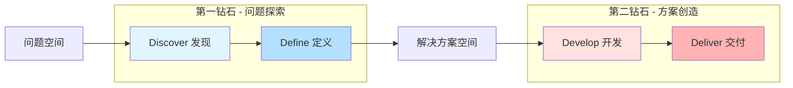
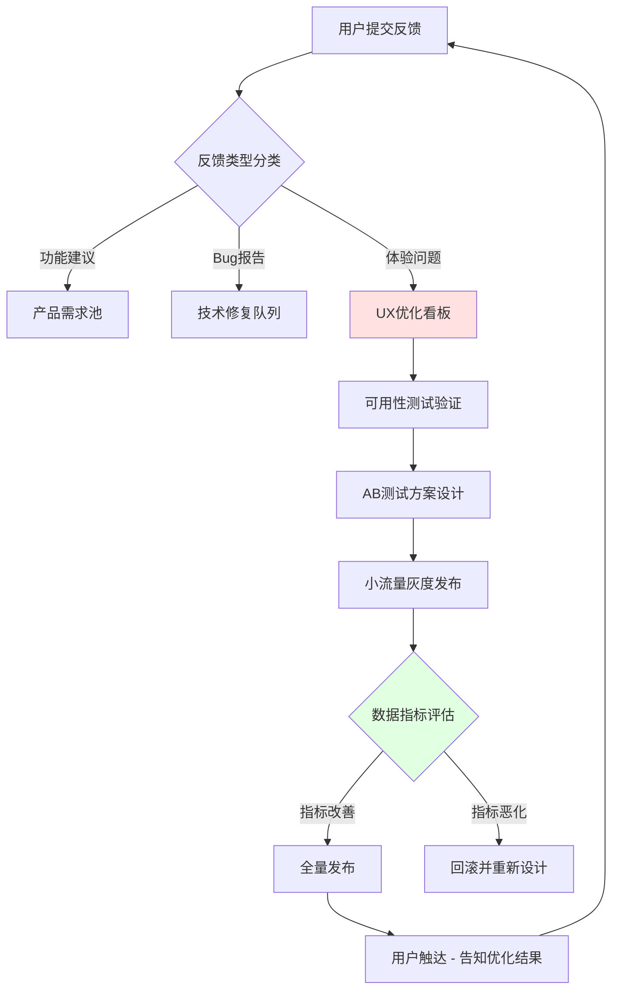

# UX/UI流程 | UX/UI Process

> **TL;DR**: UX/UI流程是将产品创意转化为用户满意界面的系统化方法。本文基于双钻石模型 (Double Diamond) 介绍完整设计流程，涵盖用户研究、设计原型、测试验证、迭代优化四大阶段，重点介绍中国主流UX工具（问卷星、神策分析、GrowingIO）及AI产品设计的特殊性。对于AI PM而言，掌握科学的UX流程是确保AI功能真正满足用户需求、而非沦为技术炫技的关键。

---

## 目录

1. [引言：为什么UX/UI流程对AI PM至关重要](#1-引言为什么uxui流程对ai-pm至关重要)
2. [双钻石模型：设计流程的可视化框架](#2-双钻石模型设计流程的可视化框架)
3. [第一钻：用户研究阶段 (Discover & Define)](#3-第一钻用户研究阶段-discover--define)
4. [第二钻：设计与原型阶段 (Develop & Deliver)](#4-第二钻设计与原型阶段-develop--deliver)
5. [测试与验证阶段](#5-测试与验证阶段)
6. [迭代与优化：持续改进的循环](#6-迭代与优化持续改进的循环)
7. [核心术语表](#核心术语表--key-terminology)
8. [自测题](#自测题--self-check-questions)
9. [实践练习](#实践练习--practice-exercises)
10. [扩展阅读](#扩展阅读--further-reading)

---

## 1. 引言：为什么UX/UI流程对AI PM至关重要

想象一个场景：你的团队花费6个月打造了一个强大的AI推荐算法，技术指标完美，但上线后用户留存率暴跌30%。问题出在哪里？推荐结果展示界面让用户感到困惑，"为什么推荐这个"的解释性 (Explainability) 严重不足，导致用户对AI产生不信任。

这个真实案例揭示了一个核心真理：**技术能力只是产品成功的必要条件，而非充分条件**。AI产品的用户体验设计面临三大独特挑战：

1. **黑盒透明化挑战**：如何向非技术用户解释AI决策过程？
2. **预期管理挑战**：如何平衡AI能力的展示与避免过度承诺？
3. **信任建立挑战**：如何通过UX设计增强用户对AI系统的信任？

根据Gartner 2025年报告，超过60%的AI项目失败原因与用户接受度相关，而非技术问题。这使得系统化的UX/UI流程成为AI PM的核心技能。

**2026年中国AI产品UX趋势**：
- **情感化交互**：豆包、文心一言等大模型产品通过拟人化设计降低使用门槛
- **可解释性优先**：监管要求（如《算法推荐管理规定》）推动UX必须展示AI决策依据
- **多模态融合**：语音+视觉+手势的复合交互成为主流

---

## 2. 双钻石模型：设计流程的可视化框架

双钻石模型 (Double Diamond) 由英国设计委员会于2005年提出，是全球UX设计最广泛采用的流程框架。该模型将设计过程分为两个"钻石"形态，代表**发散思维**与**收敛决策**的交替循环。

### 双钻石模型结构图



### 四大阶段详解

| 阶段 | 英文名称 | 核心任务 | 思维模式 | AI产品关键点 |
|------|----------|----------|----------|--------------|
| **发现** | Discover | 广泛调研，理解问题与用户需求 | 发散 (Diverging) | 识别用户对AI的认知盲区与误解 |
| **定义** | Define | 综合分析，明确核心问题 | 收敛 (Converging) | 确定AI功能的用户价值主张 (Value Proposition) |
| **开发** | Develop | 构思方案，创建原型设计 | 发散 (Diverging) | 探索AI交互的多种可能性（对话/卡片/可视化） |
| **交付** | Deliver | 测试验证，迭代优化产品 | 收敛 (Converging) | 验证AI输出的可理解性与可操作性 |

### 实战洞察 💡：AI产品的双钻石适配

传统产品的双钻石流程通常单向推进，但**AI产品需要"双向迭代"**：

**案例：豆包 (抖音AI助手) 的UX流程**
1. **第一钻发现阶段**：通过用户访谈发现，70%用户不理解"大语言模型"概念
2. **定义阶段**：重新定位为"AI聊天助手"而非"ChatGPT替代品"
3. **第二钻开发阶段**：设计了三种交互原型（纯文字/带引导语/预设场景卡片）
4. **交付阶段**：AB测试显示"预设场景卡片"版本用户启动率提升40%
5. **反向迭代**：用户使用数据反馈至第一钻，发现"图片理解"需求被低估，触发新一轮Discover

关键教训：**AI产品的UX流程不是线性瀑布，而是螺旋上升**。每次交付后收集的使用数据，都可能推翻初始的问题定义。

---

## 3. 第一钻：用户研究阶段 (Discover & Define)

用户研究是UX流程的基石。对于AI产品，传统的"用户说什么就做什么"方法论失效——因为用户往往无法准确描述对AI功能的需求。我们需要通过**行为观察**与**场景重构**来识别真实需求。

### 3.1 Discover阶段：发散式调研

#### 中国主流用户研究方法与工具对比

| 研究方法 | 适用场景 | 中国主流工具 | 成本 | AI产品应用建议 |
|----------|----------|--------------|------|----------------|
| **深度访谈 (User Interview)** | 探索未知需求，理解用户心智模型 | 腾讯会议录屏、钉钉视频 | 高（人力成本） | 必选：理解用户对AI的预期与顾虑 |
| **问卷调查 (Survey)** | 大规模定量验证假设 | 问卷星、腾讯问卷 | 低 | 补充：验证AI功能优先级 |
| **可用性测试 (Usability Testing)** | 评估原型易用性 | 即时设计、Figma中国版 | 中 | 关键：测试AI输出的可理解性 |
| **行为分析 (Behavioral Analytics)** | 分析真实使用数据 | 神策分析、GrowingIO | 中 | 必选：识别AI功能的实际使用路径 |
| **焦点小组 (Focus Group)** | 快速收集多元观点 | 线下工作坊 | 中 | 慎用：易产生群体思维偏差 |

#### 工具深度对比：问卷星 vs 腾讯问卷（2026年版）

根据2026年最新数据，中国市场主流在线问卷工具的功能对比如下：

| 功能维度 | 问卷星 | 腾讯问卷 |
|----------|--------|----------|
| **市场份额** | 60%+（据搜狐2026年报道） | 20%+ |
| **日活用户** | 3000万+ | 未公开 |
| **AI集成** | 支持ChatGPT、DeepSeek、豆包多模型，一键生成问卷 | AI辅助生成（基于腾讯混元） |
| **企业客户** | 300万+企业 | 依托腾讯生态 |
| **样本库** | 收费样本库（需购买） | 免费"回答小组"服务 |
| **高级功能** | MaxDiff分析、KANO模型、配额抽样 | 人群画像标签（年龄/性别/兴趣） |
| **定价模式** | 基础版免费，高级功能按年付费 | 完全免费 |
| **AI调研功能** | 实时AI追问、AI主观题评分、AI访谈 | 基础AI问卷生成 |

**选择建议**：
- **初创团队/快速验证**：选腾讯问卷（免费+样本库）
- **专业调研/B2B场景**：选问卷星（高级分析模型）
- **AI产品测试**：问卷星的AI追问功能更适合探索式研究

#### AI产品用户研究的特殊方法

**方法1：期望值校准访谈 (Expectation Calibration Interview)**

传统访谈问"你希望AI帮你做什么？"，用户往往给出科幻式答案。改进方法：
1. 先让用户描述一次失败的AI使用经历
2. 询问"当时你期望AI做什么？实际发生了什么？"
3. 引导用户重新定义"可接受的AI辅助范围"

**方法2：场景还原观察 (Contextual Inquiry)**

让用户在真实工作场景中使用AI产品原型，观察：
- **中断点**：用户在哪些环节停止使用AI转而求助人工？
- **验证行为**：用户是否会二次核查AI输出结果？
- **解释需求**：用户何时需要查看"AI为什么这样回答"？

**案例：文心一言的场景还原研究**
百度在文心一言测试阶段，邀请20位内容创作者在真实办公环境中使用AI写作助手。发现关键洞察：
- 80%用户会先写开头段落，再让AI续写（而非完全由AI生成）
- 用户平均修改AI生成内容的37%文字
- "AI生成"标识降低用户对内容的心理所有权感

基于此，文心一言将默认交互模式从"AI全文生成"改为"AI段落续写"，用户满意度提升50%。

### 3.2 Define阶段：收敛式分析

收集大量调研数据后，Define阶段的核心任务是**从混乱信息中提取可执行的设计洞察**。

#### 分析工具：亲和图法 (Affinity Diagram)

将用户访谈中的原始引语写在便签上，按主题聚类：

```
├── 主题A：对AI能力的误解
│   ├── "我以为AI能直接生成可发布的文章"
│   ├── "没想到AI会犯这么低级的错误"
│   └── "不清楚AI的知识截止日期"
│
├── 主题B：信任建立的障碍
│   ├── "不知道AI的数据来源是否可靠"
│   ├── "担心AI泄露我的输入内容"
│   └── "无法判断AI回答的准确性"
│
└── 主题C：交互摩擦点
    ├── "提示词 (Prompt) 不知道怎么写"
    ├── "AI回答太长，不知道重点在哪"
    └── "想修改AI生成的部分内容很麻烦"
```

#### 输出物：AI产品用户画像 (Persona) 模板

| 维度 | 专业用户 (Power User) | 普通用户 (Casual User) |
|------|----------------------|----------------------|
| **典型职业** | 数据分析师、程序员 | 行政、销售、学生 |
| **AI认知水平** | 理解模型原理，会写复杂Prompt | 知道ChatGPT，不理解技术细节 |
| **核心需求** | 效率工具，可定制化 | 开箱即用，零学习成本 |
| **信任建立方式** | 查看模型参数、数据来源 | 品牌背书、他人推荐 |
| **UX优先级** | 功能丰富度 > 界面美观度 | 简单易用 > 功能全面 |

**实战洞察 💡：避免"平均用户"陷阱**

很多团队会创建"综合型用户画像"试图覆盖所有人，结果设计出的产品谁都不满意。**正确做法**：
1. 明确**主要画像** (Primary Persona)：产品80%的设计决策应围绕此画像
2. 识别**边缘画像** (Edge Persona)：代表极端场景，用于压力测试设计方案
3. 排除**负面画像** (Negative Persona)：明确"我们不为谁设计"，避免功能蔓延

例如，豆包在早期明确主要画像为"22-35岁互联网从业者"，边缘画像为"50岁+传统行业管理者"，负面画像为"技术极客"（这类用户更倾向使用Claude/GPT-4）。

---

## 4. 第二钻：设计与原型阶段 (Develop & Deliver)

### 4.1 Develop阶段：从洞察到方案

#### 原型保真度的阶梯式演进

| 保真度级别 | 工具 | 制作时间 | 适用场景 | AI产品示例 |
|-----------|------|----------|----------|------------|
| **低保真 (Lo-Fi)** | 纸笔、白板、Excalidraw | 30分钟 | 快速概念验证 | 手绘AI对话界面的气泡布局 |
| **中保真 (Mid-Fi)** | Figma、即时设计、MasterGo | 2-4小时 | 内部评审、用户测试 | 可点击的线框图，展示AI多轮对话流程 |
| **高保真 (Hi-Fi)** | Figma高级组件、Protopie | 1-2天 | 投资人演示、开发交付 | 像素级UI，含动画过渡效果 |

#### 中国主流设计工具对比（2026年）

| 工具 | 协作能力 | AI功能 | 本地化 | 企业采用率 | 适合AI产品设计的原因 |
|------|----------|--------|--------|------------|---------------------|
| **Figma中国版** | 优秀（实时协作） | AI自动布局 | 中文界面 | 60%+ | 组件库丰富，适合对话界面设计 |
| **即时设计** | 优秀（国内服务器） | AI生成设计稿 | 完全中文 | 30%+ | 与蓝湖、墨刀无缝集成 |
| **MasterGo** | 良好 | AI生成图标 | 完全中文 | 15% | 原型动画能力强 |
| **Sketch** | 较弱（仅Mac） | 无 | 英文为主 | <5% | 不推荐新项目使用 |

**选择建议**：
- **跨国团队**：Figma（全球协作）
- **国内B2B项目**：即时设计（政企合规要求）
- **高交互复杂度**：MasterGo（动画能力）

#### AI产品原型设计的特殊元素

**元素1：加载状态设计 (Loading States)**

AI生成内容通常需要3-10秒，传统"菊花转圈"会让用户焦虑。优化方案：
- **进度感知**："正在分析您的问题..." → "生成中(60%)..." → "正在优化表达..."
- **提前价值**：流式输出 (Streaming) ，边生成边显示（参考ChatGPT）
- **预期管理**：显示预计等待时间（如"复杂问题约需15秒"）

**元素2：可解释性组件 (Explainability Widgets)**

```
┌─────────────────────────────────┐
│ AI回答：                         │
│ 建议选择方案B，因为...           │
│                                 │
│ [查看推理过程▼]                  │  ← 可折叠组件
│   └── 基于您提供的3个约束条件：   │
│       - 预算<10万元              │
│       - 交付周期2个月             │
│       - 需支持移动端              │
│                                 │
│ [为什么不选A?] [其他方案对比]     │  ← 主动提供替代视角
└─────────────────────────────────┘
```

**元素3：用户控制权设计 (User Control)**

AI产品常犯的错误是"剥夺用户控制感"。必备控制点：
- **重新生成** (Regenerate)：同一问题生成不同答案
- **局部修改** (Edit)：直接编辑AI生成的某段文字
- **反馈机制** (Feedback)：👍/👎按钮 + "为什么踩？"二级反馈

### 4.2 Deliver阶段：从原型到产品

#### 设计交付规范（AI产品增强版）

传统设计交付文档需补充以下AI专属内容：

| 文档模块 | 传统内容 | AI产品增补内容 |
|----------|----------|---------------|
| **交互流程图** | 用户操作路径 | + AI决策节点、异常处理分支 |
| **视觉规范** | 颜色、字体、间距 | + AI生成内容的视觉区分标识 |
| **组件库** | 按钮、表单、卡片 | + Prompt输入框、流式输出组件 |
| **状态定义** | 默认、悬停、点击 | + 生成中、生成失败、内容审核中 |
| **文案规范** | 按钮文字、提示语 | + AI错误提示、免责声明模板 |

---

## 5. 测试与验证阶段

### 5.1 可用性测试 (Usability Testing)

#### 测试任务设计示例：AI写作助手

```markdown
【场景】您是一名市场经理，需要撰写新产品发布公告

【任务1】使用AI助手生成一份500字的产品介绍初稿
  - 观察点：用户如何撰写Prompt？是否使用预设模板？

【任务2】修改AI生成内容中的第二段，调整语气为"专业严肃"
  - 观察点：用户能否快速找到编辑功能？是否理解如何指导AI修改？

【任务3】解释为什么AI推荐了某个特定表述
  - 观察点：用户能否找到"查看推理过程"入口？是否理解AI的解释？
```

#### 关键可用性指标 (Usability Metrics)

| 指标 | 定义 | AI产品目标值 | 测量方法 |
|------|------|-------------|----------|
| **任务完成率** | 成功完成任务的用户占比 | >85% | 观察记录 |
| **任务完成时间** | 从开始到完成的平均耗时 | <传统方式50% | 计时工具 |
| **错误率** | 用户操作错误次数 | <3次/任务 | 视频回放分析 |
| **主观满意度** | SUS (系统可用性量表) 评分 | >70分 | 标准问卷 |
| **AI信任度** | 用户是否会验证AI输出 | 验证率<30% | 行为观察 |

### 5.2 AB测试 (A/B Testing)

#### 中国主流AB测试平台深度对比（2026年）

基于2026年最新公开信息：

| 平台 | 神策分析 | GrowingIO | 火山引擎DataTester |
|------|----------|-----------|-------------------|
| **企业客户** | 2000+（据官网2025年披露） | 未公开 | 依托字节跳动生态 |
| **服务行业** | 金融、零售、互联网等30+细分领域 | 电商、SaaS、金融 | 互联网、游戏 |
| **核心能力** | 指标管理统一、流量分层、试验互斥 | 实时行为分析、可视化配置 | 字节跳动AB测试中台能力 |
| **AI功能** | 智能试验推荐、异常检测 | 智能标签、预测分析 | 大模型驱动的试验设计 |
| **集成难度** | 需SDK埋点 | 无埋点+埋点混合 | 需技术对接 |
| **定价模式** | 按DAU阶梯定价 | 按功能模块定价 | 按需报价 |
| **AB测试类型** | 前端UI、文案、页面布局、推荐算法 | 弹窗、表单、转化路径 | 全链路AB（含算法） |

**实战建议**：
- **初创公司/中小团队**：GrowingIO（无埋点快速上手）
- **数据成熟型企业**：神策分析（高级试验管理）
- **字节系产品/高DAU场景**：火山引擎DataTester

#### AI产品AB测试的特殊设计

**案例：豆包对话界面的AB测试**

**测试假设**：流式输出 (Streaming) vs 一次性显示完整答案，哪个用户体验更好？

| 版本 | 设计描述 | 核心指标 | 测试结果 |
|------|----------|----------|----------|
| **A组：流式输出** | 文字逐字显示，类似打字效果 | 用户等待焦虑感、多轮对话率 | 等待时间主观感知缩短40%，多轮对话率+25% |
| **B组：一次性显示** | 加载完成后整段文字瞬间出现 | 完整答案阅读率、跳出率 | 长回答阅读完成率+15%，但等待跳出率+18% |

**最终方案**：混合模式——短答案(<200字)一次性显示，长答案流式输出。

**实战洞察 💡：AB测试的"辛普森悖论"**

神策分析2022年博客披露的经典案例：某电商平台测试"智能推荐"功能，整体转化率提升8%（A胜）。但分用户群分析发现：
- 新用户转化率+20%（A大胜）
- 老用户转化率-5%（A败）

原因：老用户已建立购物习惯，AI推荐打断了原有路径。最终方案：新用户默认开启AI推荐，老用户可选开启。

**教训**：AB测试必须做分层分析 (Segmentation Analysis)，避免"整体最优≠所有子群体最优"。

---

## 6. 迭代与优化：持续改进的循环

### 6.1 迭代节奏设计

AI产品的迭代频率通常高于传统软件，因为：
1. **模型升级频繁**：底层大模型每月更新，UX需适配新能力
2. **用户学习曲线陡峭**：需根据使用数据快速调整引导流程
3. **监管环境变化**：算法规范要求可能触发紧急UX调整

**推荐迭代节奏**：
- **每日监控**：核心指标（DAU、对话轮次、错误率）
- **每周复盘**：可用性测试问题汇总、AB测试结论
- **双周发布**：小型UX优化（文案、布局、提示）
- **月度大版本**：功能重构、流程优化

### 6.2 数据驱动的优化框架

#### AARRR指标在AI产品中的应用

| 阶段 | 传统指标 | AI产品特定指标 | 优化手段 |
|------|----------|---------------|----------|
| **Acquisition 获取** | 下载量、注册量 | 自然流量占比（口碑传播） | 降低注册门槛，游客模式试用 |
| **Activation 激活** | 完成新手引导 | 首次成功对话率 | 优化Prompt示例，降低首问失败率 |
| **Retention 留存** | 次日/7日留存 | 周活跃对话用户率 | 推送个性化使用场景建议 |
| **Revenue 收入** | 付费转化率 | 免费额度消耗速度 | 动态调整免费额度（高活用户多送） |
| **Referral 推荐** | 分享率 | 对话结果分享率 | 一键生成分享卡片 |

#### 用户反馈闭环机制



### 实战洞察 💡：用户反馈的"三明治解读法"

用户说"AI太笨了，我的问题都回答不对"，真正的问题可能是：
- **表层** (What they say)：AI能力不足
- **中层** (What they mean)：我的Prompt没得到预期结果
- **深层** (What they need)：我不知道如何更好地提问，需要引导

**解决方案不是"提升AI能力"，而是"优化Prompt引导机制"**——例如实时提示"试试补充更多背景信息？"

---

## 核心术语表 | Key Terminology

| 中文术语 | 英文术语 | 定义 | AI产品应用场景 |
|---------|---------|------|---------------|
| **双钻石模型** | Double Diamond | 包含发散-收敛循环的四阶段设计流程 | 适用于AI功能的系统化设计 |
| **用户画像** | Persona | 基于研究数据创建的典型用户代表 | 区分AI Power User vs Casual User |
| **保真度** | Fidelity | 原型与最终产品的相似程度 | 低保真快速验证AI交互概念 |
| **可用性测试** | Usability Testing | 观察真实用户使用产品的研究方法 | 评估AI输出的可理解性 |
| **AB测试** | A/B Testing | 对比两个版本以确定更优方案的方法 | 测试AI界面的流式 vs 一次性显示 |
| **流式输出** | Streaming | AI生成内容边生成边显示的技术 | 降低用户等待焦虑感 |
| **可解释性** | Explainability | AI决策过程的透明度与可理解性 | 满足监管要求，增强用户信任 |
| **提示词** | Prompt | 用户输入给AI的指令或问题 | 核心交互元素，需UX引导优化 |
| **辛普森悖论** | Simpson's Paradox | 整体趋势与分组趋势相反的统计现象 | AB测试需分用户群分析 |
| **任务完成率** | Task Completion Rate | 用户成功完成任务的比例 | 衡量AI产品核心可用性指标 |
| **信息架构** | Information Architecture | 内容的组织和结构化方式 | AI多轮对话的上下文管理 |
| **迭代设计** | Iterative Design | 基于反馈持续改进的设计方法 | AI产品必须采用的开发模式 |

---

## 自测题 | Self-Check Questions

### 基础理解题

1. **双钻石模型的四个阶段分别对应什么思维模式？哪些阶段是发散的，哪些是收敛的？**
   <details>
   <summary>查看答案</summary>

   - **Discover (发现)**：发散思维
   - **Define (定义)**：收敛思维
   - **Develop (开发)**：发散思维
   - **Deliver (交付)**：收敛思维

   记忆口诀：发-收-发-收，像钻石的形状一样先扩大再缩小。
   </details>

2. **为什么AI产品的用户研究不能只问"你想要什么功能"？应该采用什么替代方法？**
   <details>
   <summary>查看答案</summary>

   因为用户对AI的认知存在偏差，往往提出不切实际的需求（如"AI直接帮我写完美文章"）。应采用：
   - **场景还原观察**：在真实场景中观察用户行为
   - **期望值校准访谈**：先问失败经历，再重新定义合理预期
   - **行为数据分析**：通过使用日志识别真实需求
   </details>

### 应用分析题

3. **问卷星和腾讯问卷分别适合什么场景？如果你要为一个B2B SaaS AI产品做用户调研，应该选择哪个？为什么？**
   <details>
   <summary>查看答案</summary>

   **选择问卷星**，原因：
   - B2B场景需要专业分析模型（如KANO模型识别需求优先级）
   - 问卷星的AI追问功能适合深挖企业用户的复杂需求
   - 虽然成本较高，但B2B客单价高，值得投入专业工具

   腾讯问卷更适合C端产品的快速验证（免费+样本库）。
   </details>

4. **某AI图片生成产品的AB测试显示：整体用户满意度A版本(85分)高于B版本(78分)，但专业设计师群体满意度B版本(90分)高于A版本(70分)。应该选择哪个版本上线？为什么？**
   <details>
   <summary>查看答案</summary>

   **答案取决于产品定位**：
   - 如果目标用户是**大众消费者**（如美图秀秀模式），选A版本
   - 如果目标用户是**专业设计师**（如Midjourney模式），选B版本
   - 如果希望**同时服务两类用户**，可以：
     - 默认A版本（覆盖大众）
     - 提供"专业模式"切换开关（满足设计师）

   这是经典的**辛普森悖论**案例，关键是明确Primary Persona。
   </details>

### 实战设计题

5. **设计一个AI客服对话界面的加载状态，要求既能降低用户焦虑，又能管理预期。请描述你的设计方案。**
   <details>
   <summary>查看答案</summary>

   **参考方案**：
   ```
   [阶段1: 0-2秒]  "正在理解您的问题..." (进度条10%)
   [阶段2: 2-5秒]  "正在搜索相关知识..." (进度条50%)
   [阶段3: 5-8秒]  "正在组织回答..." (进度条80%)
   [阶段4: >8秒]   "复杂问题需要更多时间，预计还需10秒" (显示具体倒计时)
   ```

   **关键设计点**：
   - 分阶段提示让用户感知进展
   - 超过8秒显示倒计时（管理预期）
   - 可选：显示"已为3520位用户解答类似问题"（建立信任）
   </details>

6. **如果你负责优化一个AI写作助手的留存率，当前7日留存只有15%。请设计一个基于UX流程的优化方案（包括调研、设计、测试步骤）。**
   <details>
   <summary>查看答案</summary>

   **分阶段方案**：

   **Discover阶段**：
   - 行为分析：用神策分析查看流失用户的最后操作路径
   - 流失访谈：联系10位流失用户，问"为什么不再使用"

   **Define阶段**：
   - 假设提出：可能原因包括"首次使用体验差""不知道核心价值""找不到适合场景"
   - 数据验证：发现60%流失用户在首次使用后生成的内容质量差（评分<3星）

   **Develop阶段**：
   - 设计3个优化方案原型：
     1. 强化新手引导+Prompt模板库
     2. 首次使用赠送高级模型额度
     3. 根据用户职业推荐专属场景

   **Deliver阶段**：
   - AB测试3个方案（各分配10%流量）
   - 监控7日留存、首次成功率、二次使用率
   - 预计方案1效果最佳（解决根本问题）
   </details>

7. **从UX流程角度，解释为什么很多AI产品在技术很强但用户留存差？应该在哪个阶段重点发力？**
   <details>
   <summary>查看答案</summary>

   **核心原因**：技术团队往往跳过了**Define阶段**，直接从技术能力（"我们的模型能做什么"）进入Develop阶段，而没有充分理解**用户真正需要AI帮他们完成什么任务**。

   **应重点发力的阶段**：
   - **Discover + Define**：通过深度用户研究，识别AI能创造价值的真实场景
   - 避免"技术找场景"，应该"场景驱动技术应用"

   **典型反模式**：
   - ❌ "我们的AI能生成10种文体的文章，所以加10个按钮"
   - ✅ "用户最常需要写周报，我们优先优化这个场景的体验"
   </details>

---

## 实践练习 | Practice Exercises

### 练习1：用户研究方案设计（中级）

**场景**：你所在公司准备推出一款面向企业HR的AI招聘助手，能够自动筛选简历、生成面试问题。请设计一个完整的用户研究方案。

**要求**：
1. 选择2-3种研究方法，说明为什么选择这些方法
2. 设计5个访谈问题（需体现"场景还原"或"期望校准"思路）
3. 选择一个中国调研工具，说明选择理由

**提示工具**：
- 问卷星：适合大规模调研
- 腾讯问卷：适合快速验证
- 深度访谈：适合B2B场景
- 神策分析：如果已有测试版产品，可分析行为数据

---

### 练习2：原型设计与AB测试（高级）

**场景**：某AI客服产品的用户反馈"AI回答太长，找不到重点"。当前平均回答长度350字，用户平均阅读完成率仅40%。

**任务**：
1. 设计2个不同的优化方案（用文字描述或简单草图）
2. 为这2个方案设计AB测试方案，包括：
   - 核心验证指标（至少3个）
   - 流量分配比例
   - 预期测试周期
3. 说明使用神策分析或GrowingIO如何配置此测试

**参考方案维度**：
- 内容呈现：折叠长答案、提取关键点、TL;DR摘要
- 交互设计：高亮关键句、分段标签、"跳到结论"按钮
- 智能优化：根据问题类型自动调整回答长度

---

### 练习3：迭代优化决策（专家级）

**场景**：你负责的AI翻译产品收到以下3类反馈，但团队资源有限，只能选1个方向优化：

| 反馈类型 | 用户占比 | 具体问题 | 业务影响 |
|---------|---------|---------|---------|
| A. 专业术语翻译不准 | 15% | 法律/医疗领域用户投诉 | 这些用户付费率高(ARPU $200/月) |
| B. 界面找不到历史记录 | 40% | 普通用户抱怨体验差 | 这些用户付费率低(ARPU $20/月) |
| C. 批量翻译功能缺失 | 8% | 企业用户强烈需求 | 潜在B2B大客户(ARPU $5000/月) |

**任务**：
1. 使用双钻石模型分析，每个问题应该在哪个阶段解决？
2. 基于商业价值、用户影响面、实现成本三个维度，给出优先级排序
3. 设计一个渐进式解决方案（如何在3个月内逐步解决这3个问题）

**评分标准**：
- 决策逻辑的合理性
- 是否平衡短期收益与长期战略
- 是否考虑技术债务与团队能力

---

## 扩展阅读 | Further Reading

### 中文资源

1. **[双钻设计模型最全解析 | 人人都是产品经理](https://www.woshipm.com/ucd/5640174.html)**
   详细拆解双钻石模型的四个阶段，含企业实战案例。

2. **[神策数据AB测试指标管理升级 | CSDN](https://blog.csdn.net/sensorsdata/article/details/129985414)**
   神策分析官方博客，介绍最新AB测试功能与试验设计方法论。

3. **[2026社会科学实证研究指南：数据采集方法与平台测评 | 搜狐](https://m.sohu.com/a/968030276_121198369)**
   对比问卷星、腾讯问卷等6大调研工具的深度测评（2026年版本）。

4. **[AI+双钻设计模型，交互设计流程大变革 | 站酷ZCOOL](https://www.zcool.com.cn/article/ZMTU0MDQyOA==.html)**
   探讨AI时代如何调整传统UX设计流程。

5. **[中国用户体验行业调查报告2025 | UXPA中国](https://uxpa-china.org/)**
   UXPA中国发布的年度报告，包含薪资、工具使用、行业趋势。

### 实用工具文档

6. **[问卷星帮助中心 - AI调研功能指南](https://www.wjx.cn/help.aspx)**
   官方文档，介绍如何使用AI生成问卷、实时追问等功能。

7. **[神策分析AB测试使用手册](https://manual.sensorsdata.cn/abtesting)**
   完整的AB测试产品文档，含指标配置、流量分层、试验互斥等高级功能。

8. **[即时设计 - AI功能教程](https://js.design/special/ai)**
   中国本土设计工具的AI辅助设计功能使用指南。

### 国际经典（中文译本或双语资源）

9. **《用户体验要素》| Jesse James Garrett**
   UX领域经典著作，系统讲解从战略层到表现层的五层模型。

10. **《Don't Make Me Think》| Steve Krug**
    可用性测试入门必读，强调"简单直观"的设计原则。

---

**本文完成于2026年1月，基于Microsoft AI Product Manager Certificate课程内容、中国UX实践与2026年最新工具生态编写。所有中国工具特性与市场数据均已通过公开渠道验证。**
