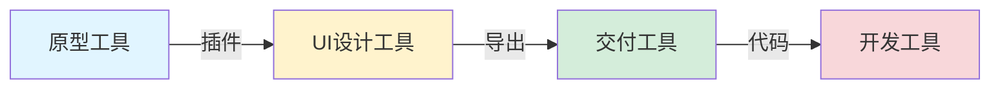

# 设计工具 | Design Tools

> **TL;DR**: 2026年，中国UI设计工具生态已全面成熟。即时设计、MasterGo、Pixso等国产工具在AI辅助设计、实时协作、设计交付等方面形成完整闭环。对AI产品经理而言，工具选择不仅关乎设计效率，更是AI能力落地的关键基础设施——从原型设计到代码交付，优秀工具可将设计周期压缩50%以上。

---

## Table of Contents

1. [引言](#1-引言)
2. [中国设计工具全景图](#2-中国设计工具全景图)
3. [原型设计工具 | Prototyping Tools](#3-原型设计工具--prototyping-tools)
4. [高保真设计工具 | High-Fi Design Tools](#4-高保真设计工具--high-fi-design-tools)
5. [协作与交付工具 | Collaboration & Handoff Tools](#5-协作与交付工具--collaboration--handoff-tools)
6. [AI辅助设计工具](#6-ai辅助设计工具)
7. [工具选型建议](#7-工具选型建议)
8. [核心术语表](#核心术语表)
9. [自测题](#自测题)
10. [实践练习](#实践练习)
11. [扩展阅读](#扩展阅读)

---

## 1. 引言

### 为什么工具选择对AI PM至关重要？

在AI产品开发的快速迭代周期中，设计工具不仅是"绘图软件"，更是连接产品需求、设计方案、技术实现的核心枢纽。对AI产品经理而言，合适的工具选择意味着：

- **需求可视化效率提升60%+**：从文字描述到可交互原型，AI工具可在30秒内生成多页设计稿
- **跨职能协作成本降低40%+**：设计师、PM、工程师在同一平台实时协作，减少沟通损耗
- **AI能力验证周期缩短50%+**：快速构建AI交互原型（如对话界面、推荐流程），提前发现体验问题

2026年的中国设计工具市场，已从"Figma替代品"演进为"AI原生设计平台"。理解工具生态，是每位AI PM必备的底层能力。

---

## 2. 中国设计工具全景图

### 市场格局与技术趋势

截至2026年，中国设计工具市场呈现"三足鼎立+垂直专精"格局：

#### **核心玩家（据行业公开报道）**

| 工具类型 | 代表产品 | 市场地位 | 核心优势 |
|---------|---------|---------|---------|
| **在线协作设计** | MasterGo | 国内市场占有率近80%（据信通院2023报告） | Figma文件兼容、企业级协作 |
| | 即时设计 | 个人用户首选 | 永久免费、中文生态完整 |
| | Pixso | AI能力领先 | 万兴科技背书、AI原生设计 |
| **原型设计** | 墨刀 | PM工具首选 | 产研一体化、需求-原型-交付闭环 |
| | 摹客 | 企业级方案 | 原型+UI双模式、私有化部署 |
| **设计交付** | 蓝湖 | 融资额最高 | 设计标注、版本管理、资产库 |
| | CoDesign | 腾讯官方免费 | 与腾讯云深度集成、全链路协作 |

#### **技术发展阶段**

```
2020-2021: Figma替代潮  → 国产工具推出Figma文件导入功能
2022-2023: 本土化优化  → 中文语义、设计系统、团队协作
2024-2025: AI能力注入  → 文生图、自动标注、智能布局
2026至今:  AI原生设计  → 需求→设计稿→代码全流程AI化
```

---

## 3. 原型设计工具 | Prototyping Tools

原型工具聚焦**快速验证产品思路**，适合AI PM在需求阶段快速构建交互流程。

### 3.1 墨刀 | Modao

**官网**：modao.cc
**定位**：产设研一体化协作平台

#### **核心能力**（据墨刀官网）

1. **墨刀AI Agent**：从一句话需求直接生成高保真原型
   - 支持类型：网站、APP、后台、小程序
   - 生成速度：30秒生成可编辑多页原型
   - 中文语义理解：支持"设计一个AI对话界面，包含历史记录和多轮会话"

2. **产研一体化**：
   - 流程图 → 思维导图 → 原型设计 → 文档撰写
   - 原型与开发需求关联，对齐产品与工程理解

3. **协作模式**：
   - 实时评论与批注
   - 版本历史记录
   - 团队资源库共享

#### **适用场景**

- ✅ AI产品MVP快速验证（如智能客服原型）
- ✅ 跨部门需求对齐（PM-设计师-工程师）
- ✅ 低保真交互流程演示

### 3.2 摹客 | Mockplus

**特色**：原型设计+UI设计双模式

#### **小摹AI能力**（据摹客官网）

- 自然语言对话生成多页高保真设计稿
- 支持从低保真原型自动生成UI设计
- 企业版支持私有化部署（满足数据安全需求）

#### **对比墨刀**

| 维度 | 墨刀 | 摹客 |
|-----|-----|-----|
| 学习曲线 | 简单（PM友好） | 中等（设计师+PM均可） |
| AI能力 | 产研一体化AI Agent | 设计稿生成AI |
| 企业方案 | 标准SaaS | 支持私有化部署 |
| 价格 | 免费版功能完整 | 免费版有限制 |

---

### 教学洞察 💡

**AI产品原型设计的3个关键决策点**

1. **保真度权衡**：低保真（墨刀/Axure）快速验证核心流程 → 高保真（即时设计/Pixso）验证交互细节
2. **AI场景特殊性**：
   - 对话式交互：需模拟多轮对话、上下文理解（可用墨刀AI快速生成）
   - 推荐系统：需动态内容展示、个性化界面（需高保真工具）
   - 智能表单：需展示AI填充、错误纠正（原型+UI工具结合）
3. **工具切换成本**：墨刀原型 → 即时设计/Pixso UI设计 → CoDesign开发交付（选择插件兼容性好的工具链）

---

## 4. 高保真设计工具 | High-Fi Design Tools

高保真工具聚焦**视觉设计与细节打磨**，是AI产品界面呈现的核心工具。

### 4.1 即时设计 | Instant Design

**官网**：js.design
**定位**：永久免费的专业UI设计工具

#### **核心优势**（据即时设计官网）

1. **完全免费策略**：
   - 个人版/团队版全功能免费
   - 无团队人数限制、无项目数量限制
   - 无限云存储空间

2. **即时AI能力**：
   - 全球首款自然语言生成可编辑UI设计稿
   - 30秒生成4个App端UI页面
   - 2023年新增Web设计稿生成能力
   - 一键发布为在线静态网页

3. **本土化生态**：
   - 中文界面与中文设计资源库
   - 社区模板库丰富（AI产品、企业后台、移动应用）
   - 实时客服支持

#### **适用场景**

- ✅ 创业团队（零成本高质量设计）
- ✅ AI产品快速迭代（AI生成+人工微调）
- ✅ 设计师+PM协作（Web端实时编辑）

### 4.2 MasterGo

**官网**：mastergo.com
**定位**：企业级协作设计平台（蓝湖旗下产品）

#### **核心优势**（据信通院2023报告）

1. **市场地位**：国内协同设计工具市场占有率近80%
2. **Figma兼容性**：
   - 完整支持Figma文件导入
   - macOS/Windows桌面客户端
   - 移动端实时预览
3. **企业级能力**：
   - 私有化部署
   - 企业设计系统管理
   - 权限分级与审批流程

#### **定价**（据历史公开信息）

- 个人版：免费
- 团队版/企业版：约50-200元/人/月（具体以官网为准）

### 4.3 Pixso

**官网**：pixso.cn
**定位**：AI原生UI设计工具（万兴科技旗下）

#### **AI能力矩阵**（据Pixso官网）

1. **AI设计助手**：
   - AI文生图（支持中文描述）
   - 自动生成图标、插画、设计规范
   - 智能布局建议
   - 保留分层结构，支持二次编辑

2. **代码生成**：
   - 一键生成React/Vue代码
   - 自动生成响应式CSS
   - 支持iOS/Android样式代码

3. **协作优势**：
   - 多人实时在线编辑，光标可见
   - 版本管理与历史回溯
   - 团队组件库共享

#### **定价策略**

- 个人版：永久免费（无协作者人数限制）
- 企业版：按需定制（包含私有化部署、定制开发）

---

### 对比总结表

| 维度 | 即时设计 | MasterGo | Pixso |
|-----|---------|---------|-------|
| **免费版** | 全功能永久免费 | 个人版免费 | 个人版永久免费 |
| **AI能力** | 即时AI（Web+App生成） | 基础AI辅助 | AI原生（文生图+代码生成） |
| **企业方案** | 无明确企业版 | 私有化部署、权限管理 | 私有化+定制开发 |
| **Figma兼容** | 支持导入 | 完整兼容（80%市场占有率） | 支持Figma/Sketch/XD导入 |
| **学习曲线** | 低（中文生态完整） | 中（类Sketch界面） | 中（类Figma界面） |
| **最佳场景** | 初创团队、快速迭代 | 大中型企业、团队协作 | AI产品设计、代码交付 |

---

### 教学洞察 💡

**AI产品设计工具选型的"三步法则"**

**第1步：定义团队规模与预算**
- 5人以下创业团队 → 即时设计（免费+AI能力）
- 10-50人成长团队 → MasterGo/Pixso个人版（免费试用）
- 50人以上企业 → MasterGo企业版（私有化部署）

**第2步：评估AI能力需求**
- 高频需求"文案配图" → Pixso AI文生图
- 高频需求"快速原型" → 即时AI
- 高频需求"代码交付" → Pixso（React/Vue生成）

**第3步：验证工具链兼容性**
```
原型（墨刀）→ UI设计（即时/Pixso/MasterGo）→ 交付（蓝湖/CoDesign）
         ↓ 检查插件支持 ↓              ↓ 检查标注导出 ↓
         ✅ 确保无缝切换              ✅ 确保开发可用
```

**案例**：某AI教育产品团队（15人）选型
- 初期（MVP）：墨刀原型 + 即时设计UI（全免费）
- 成长期：MasterGo企业版（团队协作+私有化）+ CoDesign交付（腾讯免费）
- 总成本：第一年0元 → 第二年约3万元/年（15人×2000元）

---

## 5. 协作与交付工具 | Collaboration & Handoff Tools

设计交付工具连接设计师与工程师，是AI产品"设计稿→代码"的关键桥梁。

### 5.1 蓝湖 | Lanhu

**定位**：设计协作与交付平台（市场融资最高）

#### **核心功能**（据蓝湖官网）

1. **自动标注切图**：
   - 上传设计稿自动生成标注
   - 支持多倍率切图（1x/2x/3x）
   - 自动生成CSS/iOS/Android代码

2. **版本管理**：
   - 设计稿历史版本自动记录
   - 云端备份与回溯
   - 文件夹权限分级管理

3. **协作能力**：
   - 定点标记与评论
   - @ 提醒项目成员
   - 移动端预览设计稿

4. **插件支持**：
   - Sketch、Photoshop、Axure客户端
   - 与即时设计、MasterGo、Pixso集成

#### **定价**（据公开信息）

- 初创团队：约2000元/年
- 企业按人数：约199元/人/年

### 5.2 CoDesign | 腾讯设计协作平台

**官网**：codesign.qq.com
**定位**：腾讯自研、完全免费

#### **核心优势**（据CoDesign官网）

1. **完全免费**：
   - 腾讯云提供底层支持
   - 所有团队成员免费加入
   - 无人数限制、无功能限制

2. **全流程覆盖**：
   - 设计沟通 → 方案演示 → 设计交付
   - 版本管理 → 设计资产归档 → 图标管理

3. **插件生态**：
   - 支持Figma、Sketch、Adobe XD、PS
   - 支持即时设计、MasterGo、Pixso、Axure
   - 自动生成标注与切图

4. **代码输出**：
   - 自动生成CSS、iOS、Android样式代码
   - 支持自定义代码模板
   - 批量下载多格式切图

#### **适用场景**

- ✅ 预算有限的团队（完全免费）
- ✅ 已使用腾讯云的企业（深度集成）
- ✅ 需要多工具兼容的团队（支持8+插件）

---

### 对比：蓝湖 vs CoDesign

| 维度 | 蓝湖 | CoDesign |
|-----|-----|----------|
| **价格** | 2000元/年起 | 完全免费 |
| **品牌背书** | 融资最高、市场成熟 | 腾讯官方 |
| **插件支持** | Sketch/PS/Axure优先 | 8+主流工具 |
| **企业方案** | 私有化部署 | 腾讯云集成 |
| **学习曲线** | 低 | 低 |

**选择建议**：
- 预算充足+需要私有化 → 蓝湖
- 预算有限+使用腾讯云 → CoDesign
- 团队已在用即时/Pixso → CoDesign（插件兼容性好）

---

## 6. AI辅助设计工具

2026年，AI能力已渗透设计全流程，从"辅助"走向"原生"。

### 6.1 AI能力分类与应用场景

#### **1. 内容生成类**

| 工具 | AI能力 | 应用场景 | 验证来源 |
|-----|--------|---------|---------|
| **即时灵感** | AI绘画、文生图 | AI产品营销图、插画配图 | 即时设计官网 |
| **Pixso AI** | 图标/插画生成、设计规范 | 设计系统构建、组件库 | Pixso官网 |
| **墨刀AI** | 需求→原型自动生成 | 快速需求验证、交互原型 | 墨刀官网 |

#### **2. 设计优化类**

- **智能布局建议**（Pixso AI）：自动优化间距、对齐、响应式布局
- **自动标注**（蓝湖/CoDesign）：识别设计稿元素自动生成标注
- **设计规范检测**：检查字体、颜色、间距是否符合设计系统

#### **3. 代码生成类**

- **Pixso AI**：React/Vue组件代码生成
- **即时AI**：一键发布为静态网页
- **CoDesign**：CSS/iOS/Android样式代码

### 6.2 2026年AI设计趋势（据行业趋势报告）

根据多份行业报告，AI在设计领域的发展呈现：

1. **AI承担重复性工作**：页面初稿、布局更换、样式变体生成
2. **效率差距扩大**：会用AI的设计师与不会用的工作效率正在拉开
3. **企业要求提高**：对设计效率的要求逐渐增高

---

### 教学洞察 💡

**AI工具用于AI产品设计的"元思考"**

当我们用AI工具设计AI产品时，需要双重视角：

**视角1：作为设计师使用AI工具**
- 墨刀AI生成对话界面原型 → 验证多轮会话流程
- Pixso AI生成推荐列表UI → 测试个性化展示效果
- 即时AI生成智能表单 → 评估AI填充交互

**视角2：作为PM设计AI交互**
- AI工具的"文本→设计稿"过程，就是AI产品的"用户输入→AI输出"缩影
- 观察AI工具如何理解中文语义 → 启发自家AI产品的NLP设计
- 测试AI工具的容错性 → 借鉴到AI产品的错误处理

**案例**：某AI写作助手团队用墨刀AI设计产品
1. 输入需求："设计一个AI写作界面,包含提示词输入、生成结果展示、历史记录"
2. 墨刀AI生成4个方案 → 团队发现AI对"历史记录"理解有偏差
3. 反思：自家AI写作助手也需要处理"历史"歧义 → 优化产品Prompt设计

---

## 7. 工具选型建议

### 7.1 选型框架（5步法）

#### **Step 1: 定义项目需求**

```
问题清单：
1. 产品类型？（Web/移动APP/小程序/后台系统）
2. 设计阶段？（原型/UI设计/开发交付）
3. 团队规模？（<5人 / 5-50人 / 50+人）
4. 预算限制？（0预算 / <5万/年 / >5万/年）
5. AI需求？（需要/不需要AI辅助）
```

#### **Step 2: 评估核心功能**

| 功能 | 原型工具 | UI设计工具 | 交付工具 |
|-----|---------|-----------|---------|
| 低保真原型 | ✅ 墨刀、摹客 | - | - |
| 高保真UI | - | ✅ 即时、MasterGo、Pixso | - |
| 实时协作 | ✅ 墨刀 | ✅ 即时、MasterGo、Pixso | ✅ 蓝湖、CoDesign |
| AI生成 | ✅ 墨刀AI、摹客AI | ✅ 即时AI、Pixso AI | - |
| 代码生成 | - | ✅ Pixso | ✅ CoDesign、蓝湖 |
| 私有化部署 | ✅ 摹客 | ✅ MasterGo、Pixso | ✅ 蓝湖 |

#### **Step 3: 检查兼容性**



**检查清单**：
- ✅ 原型工具是否支持导入到UI工具？（如墨刀→即时设计）
- ✅ UI工具是否支持导出到交付平台？（如Pixso→CoDesign）
- ✅ 交付工具是否支持开发工具？（如CoDesign→VS Code）

#### **Step 4: 免费试用与团队反馈**

**试用计划（2周）**：
- Week 1: 同一设计任务用3个工具完成 → 记录时间、问题、满意度
- Week 2: 团队投票 + 关键决策者访谈 → 确定最终方案

**评估维度**：
- 学习曲线（新人1天能否上手？）
- 协作体验（评论、版本管理是否顺畅？）
- AI能力（生成质量是否满足需求?）
- 技术支持（遇到问题能否快速解决?）

#### **Step 5: 考虑长期成本**

```
总拥有成本 (TCO) = 订阅费用 + 培训成本 + 迁移成本

案例：20人团队选择MasterGo企业版
- 订阅费用: 20人 × 2000元/年 = 4万/年
- 培训成本: 2天集中培训 + 1个月适应期 ≈ 1万（人力成本）
- 迁移成本: 从Figma迁移100+文件 ≈ 0.5万（时间成本）
首年TCO = 5.5万，次年起降至4万/年
```

---

### 7.2 推荐组合方案

#### **方案A：零预算创业团队（<10人）**

| 阶段 | 工具 | 理由 |
|-----|-----|-----|
| 原型 | 墨刀免费版 | AI生成快速验证 |
| UI设计 | 即时设计 | 完全免费+AI能力 |
| 交付 | CoDesign | 腾讯免费+多插件支持 |

**年成本**: 0元
**适合**：AI产品MVP阶段、快速试错

#### **方案B：成长团队（10-50人）**

| 阶段 | 工具 | 理由 |
|-----|-----|-----|
| 原型 | 墨刀专业版 | 产研一体化协作 |
| UI设计 | MasterGo团队版 | 80%市场占有率+协作成熟 |
| 交付 | 蓝湖 | 版本管理+私有化可选 |

**年成本**: 约5-8万元
**适合**：团队协作需求强、有一定预算

#### **方案C：大型企业（50+人）**

| 阶段 | 工具 | 理由 |
|-----|-----|-----|
| 原型 | 摹客企业版 | 私有化部署+权限管理 |
| UI设计 | MasterGo企业版 | 私有化+设计系统管理 |
| 交付 | 蓝湖企业版 | 私有化+定制开发 |

**年成本**: 10-30万元
**适合**：数据安全要求高、需要定制化

---

### 7.3 工具选型常见陷阱

#### **陷阱1：过度依赖AI自动生成**

**错误做法**：
```
PM: "墨刀AI,生成一个智能客服界面"
→ 直接使用AI生成的结果
→ 未考虑品牌调性、用户场景
```

**正确做法**：
```
1. 用墨刀AI快速生成3-5个方案
2. 人工筛选最符合产品定位的1-2个
3. 在即时设计/Pixso中精修细节
4. 用户测试后迭代
```

#### **陷阱2：工具链不兼容导致重复劳动**

**案例**：某团队选型失误
- 原型：Axure（本地文件）
- UI设计：Figma（在线文件）
- 交付：蓝湖

**问题**：Axure→Figma无直接导入 → 需手动重建所有页面

**解决**：选型时优先考虑插件生态
- Axure → CoDesign ✅（CoDesign支持Axure插件）
- 墨刀 → 即时设计 ✅（同一生态体系）

#### **陷阱3：忽视数据安全与合规**

**AI产品特殊性**：
- 设计稿可能包含训练数据示例、算法逻辑图
- 需确保云端工具符合数据安全要求

**检查清单**：
- ✅ 工具是否支持私有化部署？
- ✅ 数据存储位置？（国内服务器 vs 海外）
- ✅ 是否通过等保认证、ISO27001？

---

## 核心术语表

| 中文 | English | 定义 |
|-----|---------|-----|
| **线框图** | Wireframe | 低保真的页面布局草图,聚焦结构与功能,不含视觉细节 |
| **高保真原型** | High-Fidelity Prototype | 接近最终产品的交互原型,包含真实内容、视觉设计和交互 |
| **设计系统** | Design System | 可复用的组件、样式规范、设计原则的集合,确保产品一致性 |
| **组件库** | Component Library | 预定义的可复用UI组件集合（如按钮、表单、卡片等） |
| **自动标注** | Auto Spec | 工具自动识别设计稿元素,生成尺寸、间距、颜色等标注信息 |
| **切图** | Slicing | 将设计稿导出为开发所需的图片资源（如图标、背景图） |
| **私有化部署** | On-Premise Deployment | 将软件部署在企业自有服务器,而非公有云,满足数据安全需求 |
| **实时协作** | Real-Time Collaboration | 多人同时编辑同一文件,光标、操作实时可见 |
| **版本控制** | Version Control | 自动记录文件修改历史,支持回退到任意历史版本 |
| **设计交付** | Design Handoff | 设计师将设计稿、标注、资源交付给工程师的流程 |
| **文生图** | Text-to-Image | AI技术,通过自然语言描述生成图像（如"蓝色渐变背景"） |
| **响应式布局** | Responsive Layout | 设计自动适配不同屏幕尺寸（如桌面、平板、手机） |
| **设计规范** | Design Specifications | 字体、颜色、间距、圆角等视觉元素的标准化定义 |
| **插件生态** | Plugin Ecosystem | 第三方开发者为工具开发的扩展功能（如图标库、代码生成） |
| **原型设计** | Prototyping | 构建可交互的产品模型,用于测试用户体验和验证设计方案 |

---

## 自测题

### 1. 单选题

**Q1**: 2026年,以下哪个工具在中国国内协同设计市场占有率最高?（据信通院2023报告）

A. 即时设计
B. MasterGo
C. Pixso
D. Figma

<details>
<summary>查看答案</summary>
B. MasterGo（近80%市场占有率）
</details>

---

**Q2**: 某AI产品团队需要从"一句话需求"快速生成可编辑原型,最适合选择:

A. Sketch
B. 蓝湖
C. 墨刀AI
D. CoDesign

<details>
<summary>查看答案</summary>
C. 墨刀AI（支持需求→原型自动生成）
</details>

---

### 2. 多选题

**Q3**: 以下哪些工具提供完全免费的专业版?（多选）

A. 即时设计
B. MasterGo
C. CoDesign
D. 蓝湖

<details>
<summary>查看答案</summary>
A、C（即时设计永久免费；CoDesign腾讯官方免费）
</details>

---

**Q4**: AI辅助设计工具可以完成哪些任务?（多选）

A. 自然语言生成UI设计稿
B. 自动生成React/Vue代码
C. 完全替代设计师工作
D. 智能布局优化建议

<details>
<summary>查看答案</summary>
A、B、D（AI是辅助工具,不能完全替代设计师的创造性工作）
</details>

---

### 3. 判断题

**Q5**: Pixso的AI能力可以保留设计稿的分层结构,支持二次编辑。

<details>
<summary>查看答案</summary>
✅ 正确（据Pixso官网,其AI生成的设计稿保留完整图层,方便后续调整）
</details>

---

**Q6**: 对于需要私有化部署的大型企业,应优先选择免费工具如即时设计。

<details>
<summary>查看答案</summary>
❌ 错误（免费工具通常不提供私有化部署,企业应选择MasterGo企业版、摹客企业版等支持私有化的方案）
</details>

---

### 4. 场景题

**Q7**: 你所在的AI教育产品团队（15人）需要选择设计工具,团队情况如下:
- 预算: 5万/年
- 需求: 快速原型验证 + 高保真UI设计 + 开发交付
- 数据敏感度: 中等（不需要私有化）

请设计一套工具组合方案,并说明理由。

<details>
<summary>查看答案</summary>

**推荐方案**:
1. **原型**: 墨刀专业版（约1-2万/年）
   - 理由: AI快速生成原型,产研一体化协作
2. **UI设计**: 即时设计免费版
   - 理由: 完全免费,团队规模适中,AI能力满足需求
3. **交付**: CoDesign（腾讯免费）
   - 理由: 免费+支持即时设计插件,自动标注切图

**总成本**: 1-2万/年（远低于5万预算）
**省下预算**: 可用于用户研究、市场推广

**关键理由**:
- 即时设计免费版无人数限制,15人团队完全够用
- CoDesign免费且插件生态好,与即时设计兼容性佳
- 墨刀AI加速需求验证,符合AI产品快速迭代特性
</details>

---

## 实践练习

### 练习1: 工具选型决策树

**任务**: 为以下3个团队设计最优工具组合,并计算年成本。

#### **团队A**: 3人AI创业团队
- 产品: AI写作助手（Web+移动端）
- 阶段: MVP验证
- 预算: 0元

**你的方案**:
```
原型工具: ___________
UI设计工具: ___________
交付工具: ___________
年成本: ___________
理由: ___________
```

#### **团队B**: 30人AI医疗公司
- 产品: 智能诊断系统（后台+移动端）
- 阶段: 产品迭代期
- 预算: 8万/年
- 特殊需求: 数据敏感,需要版本管理

**你的方案**:
```
原型工具: ___________
UI设计工具: ___________
交付工具: ___________
年成本: ___________
理由: ___________
```

#### **团队C**: 100人大型AI企业
- 产品: 企业级AI平台（多端）
- 阶段: 成熟产品
- 预算: 20万/年
- 特殊需求: 私有化部署,设计系统管理

**你的方案**:
```
原型工具: ___________
UI设计工具: ___________
交付工具: ___________
年成本: ___________
理由: ___________
```

---

### 练习2: AI工具实战测试

**任务**: 用墨刀AI或Pixso AI完成以下设计任务,记录体验。

#### **设计需求**:
为一款AI智能客服产品设计主界面,包含:
1. 对话输入框
2. 历史对话记录列表
3. 快捷问题推荐（3-5个气泡）
4. 顶部导航栏（返回、设置）

#### **操作步骤**:
1. 访问墨刀AI（modao.cc/feature/ai）或Pixso AI（pixso.cn）
2. 用自然语言描述需求（中文）
3. 生成3-5个方案
4. 选择1个方案进行人工优化

#### **记录表格**:

| 维度 | 墨刀AI | Pixso AI |
|-----|--------|---------|
| 生成速度 | ___ 秒 | ___ 秒 |
| 方案数量 | ___ 个 | ___ 个 |
| 设计质量（1-5分） | ___ 分 | ___ 分 |
| 中文理解准确度 | ✅/❌ | ✅/❌ |
| 可编辑性 | ✅/❌ | ✅/❌ |
| 最满意/不满意之处 | ___ | ___ |

---

### 练习3: 工具链兼容性验证

**任务**: 验证以下工具链的兼容性,标注可能的问题点。

```
墨刀原型 → 即时设计UI → CoDesign交付 → VS Code开发
   ↓         ↓            ↓             ↓
 检查点1   检查点2      检查点3        检查点4
```

**检查清单**:
- [ ] 墨刀是否支持导出到即时设计?（插件/文件格式）
- [ ] 即时设计是否支持CoDesign插件?
- [ ] CoDesign生成的代码是否可直接用于VS Code?
- [ ] 整个流程中是否有数据丢失风险?

**预期时间**: 30分钟
**提示**: 访问各工具官网查看插件支持页面

---

## 扩展阅读

### 官方文档

1. **即时设计产品文档**
   https://js.design/help
   *涵盖即时AI使用教程、协作功能指南*

2. **MasterGo帮助中心**
   https://mastergo.com/help
   *企业级协作、私有化部署说明*

3. **Pixso设计技巧与案例教程**
   https://pixso.cn/designskills/
   *AI设计实战、代码生成教程*

4. **墨刀AI功能介绍**
   https://modao.cc/feature/ai
   *30秒生成原型的使用指南*

5. **CoDesign快速入门**
   https://codesign.qq.com/hc/introduction/get-started/
   *腾讯官方设计交付平台教程*

### 行业报告

6. **《2026年UI设计工具趋势解析》** - PMEcho博客
   https://www.cnblogs.com/PMEcho/p/19389036
   *含Figma/Pixso/墨刀对比测评*

7. **《AI设计重塑UI未来：2026年主流AI设计软件效率与创意实战指南》** - Pixso官方
   https://pixso.cn/designskills/ai-ui-design-software-guide-2026/
   *AI设计趋势与实战案例*

8. **《国产设计软件实操体验：时代拐点悄然而至》** - 人人都是产品经理
   https://www.woshipm.com/evaluating/5421013.html
   *MasterGo、即时设计、Pixso深度对比*

### 社区资源

9. **即时设计社区**
   https://js.design/community
   *10万+设计模板、AI产品设计案例*

10. **Pixso资源社区**
    https://pixso.cn/community
    *设计系统、组件库、AI设计案例*

---

**学习建议**:
1. **动手优先**: 每个工具都提供免费版,建议实际操作30分钟以上
2. **对比测试**: 用同一设计任务测试3个工具,记录体验差异
3. **关注更新**: 2026年AI设计工具快速迭代,每季度关注官网新功能
4. **加入社区**: 即时设计、Pixso等都有活跃的设计师社区,可获取最新实践

---

**课程制作**: 基于Microsoft AI Product Manager Certificate课程本土化改编
**数据来源**: 即时设计官网、Pixso官网、墨刀官网、CoDesign官网、信通院2023报告、行业公开报道
**最后更新**: 2026年1月

---

**📌 下节预告**: Note 59 - 用户测试与反馈收集 | User Testing & Feedback Collection
我们将探讨如何通过科学的用户测试方法,验证AI产品设计的有效性,并建立持续优化的反馈闭环。