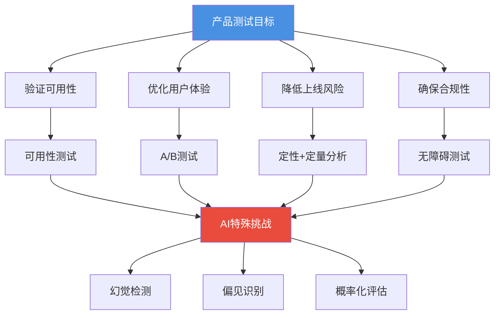
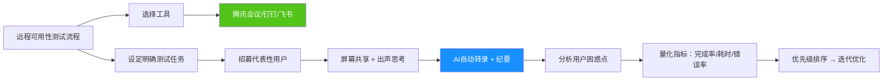
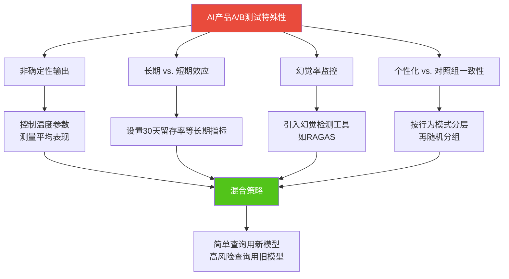
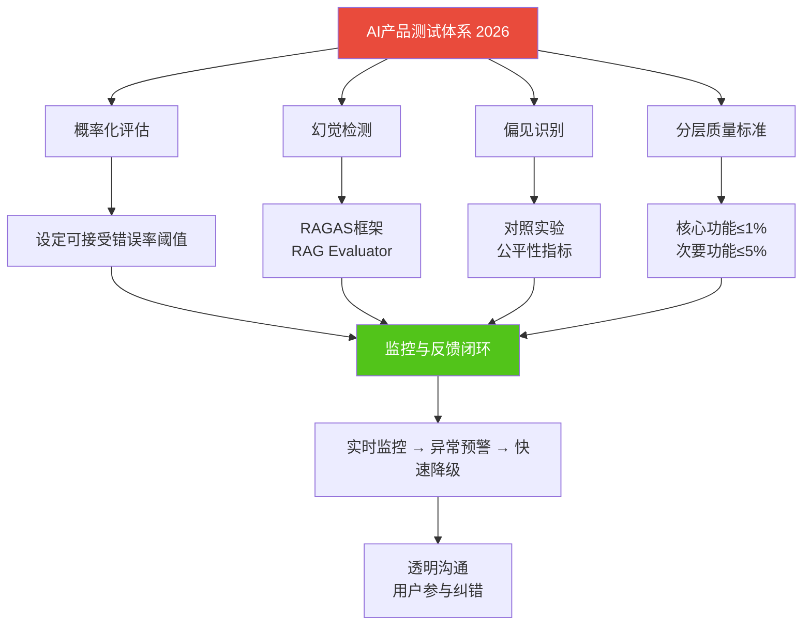

# 产品测试技术 | Product Testing Techniques

> **TL;DR**: 产品测试是验证用户体验的关键环节，涵盖可用性测试、A/B测试、无障碍测试等多种方法。对于AI产品而言，测试范式已从"通过/失败"二元判定转向概率化评估，需要特别关注大模型幻觉检测、偏见识别等新挑战。掌握中国本土化测试工具和标准（GB/T 37668-2019），能够帮助产品经理更高效地验证产品假设、优化用户体验、降低上线风险。

---

## 目录

- [1. 引言：为什么测试对AI产品至关重要](#1-引言为什么测试对ai产品至关重要)
- [2. 可用性测试：观察真实用户的交互行为](#2-可用性测试观察真实用户的交互行为)
  - [2.1 可用性测试的核心价值](#21-可用性测试的核心价值)
  - [2.2 远程可用性测试](#22-远程可用性测试)
  - [2.3 中国本土远程测试工具](#23-中国本土远程测试工具)
- [3. A/B测试：数据驱动的决策利器](#3-ab测试数据驱动的决策利器)
  - [3.1 A/B测试的工作原理](#31-ab测试的工作原理)
  - [3.2 中国主流A/B测试平台](#32-中国主流ab测试平台)
  - [实战洞察 💡：AI产品A/B测试的特殊性](#实战洞察-ai产品ab测试的特殊性)
- [4. 无障碍测试：让产品为所有人服务](#4-无障碍测试让产品为所有人服务)
  - [4.1 无障碍测试的三种核心方法](#41-无障碍测试的三种核心方法)
  - [4.2 中国无障碍标准：GB/T 37668-2019](#42-中国无障碍标准gbt-37668-2019)
- [5. 定性与定量数据：测试中的双引擎](#5-定性与定量数据测试中的双引擎)
  - [5.1 定性数据：揭示"为什么"](#51-定性数据揭示为什么)
  - [5.2 定量数据：衡量"是什么"](#52-定量数据衡量是什么)
  - [5.3 整合定性与定量洞察](#53-整合定性与定量洞察)
- [6. AI产品测试的特殊性](#6-ai产品测试的特殊性)
  - [6.1 测试范式转变：从二元到概率](#61-测试范式转变从二元到概率)
  - [6.2 大模型幻觉检测](#62-大模型幻觉检测)
  - [6.3 偏见识别与公平性测试](#63-偏见识别与公平性测试)
  - [实战洞察 💡：2026年AI测试的系统化挑战](#实战洞察-2026年ai测试的系统化挑战)
- [核心术语表](#核心术语表)
- [自测题](#自测题)
- [实践练习](#实践练习)
- [扩展阅读](#扩展阅读)

---

## 1. 引言：为什么测试对AI产品至关重要

想象一下：你的团队花费数月开发了一款AI驱动的CRM工具，但上线后发现销售人员在追踪客户线索时频繁迷失在复杂的导航路径中，甚至AI推荐功能会时不时给出"张冠李戴"的错误建议。这不仅浪费了开发成本，还可能导致客户流失和负面口碑。

**产品测试的本质**不是在产品完成后进行"事后检验"，而是在开发周期的每个阶段持续验证用户需求、发现可用性问题、降低上线风险的科学方法。对于AI产品而言，测试的意义更加深远：

- **早期干预，降低成本**：在开发早期发现问题，修复成本远低于上线后的重构
- **挑战假设**：避免团队陷入"我们认为用户需要"的主观陷阱
- **用户同理心**：通过观察真实用户的困惑和挫败，培养对用户痛点的深刻理解
- **合规与伦理**：特别是无障碍测试，既是法律要求（如中国GB/T 37668-2019标准），也是企业社会责任的体现

**AI产品的特殊挑战**：传统软件测试关注"功能是否正确"，而AI产品测试需要面对"概率性输出"——大模型可能产生幻觉（Hallucination）、存在隐性偏见（Bias），甚至在不同上下文中表现不一致。这要求我们在测试方法论上进行范式转变。



---

## 2. 可用性测试：观察真实用户的交互行为

### 2.1 可用性测试的核心价值

**可用性测试（Usability Testing）** 是通过观察真实用户与产品交互，识别可用性问题、理解用户行为的方法。与功能测试不同，它关注的不是"功能是否工作"，而是"用户能否轻松使用这些功能实现目标"。

**关键步骤**：

1. **明确测试目标**：是验证特定功能的可用性，还是评估整体用户体验？
2. **招募代表性用户**：确保测试参与者匹配目标用户画像（例如开发B2B生产力工具时，应招募实际使用类似工具的专业人士）
3. **设计真实任务**：任务应反映用户的实际使用场景（例如测试Excel新功能时，任务应基于日常电子表格操作）
4. **观察并记录**：记录用户完成任务的过程，标注困惑点和错误
5. **分析与迭代**：识别趋势，量化指标（任务完成率、耗时、错误率），优先处理高影响问题

**可用性测试的战略价值**：

- 作为"早期预警系统"，在问题可控且修复成本低的阶段发现潜在风险
- 直接洞察用户偏好和行为，确保产品符合真实需求而非主观臆断
- 提升用户满意度，降低后期支持成本

### 2.2 远程可用性测试

**远程可用性测试（Remote Usability Testing）** 打破了地理限制，允许产品团队从全球不同地区收集用户反馈，这对于服务于分散用户群的企业软件和B2B产品尤为重要。

**优势**：

- **全球化多样性**：覆盖不同文化背景、行业特性的用户群体（例如开发ERP系统时，可同时获取制造业、医疗、金融等不同行业的反馈）
- **成本优势**：减少差旅和场地成本，允许在预算内增加测试频次和参与者数量
- **灵活性**：参与者在自然环境中测试，反馈更真实
- **快速迭代**：快速招募、快速反馈，加速产品优化周期

**挑战与应对**：

| 挑战 | 应对策略 |
|------|---------|
| 技术故障（网络不稳定、软件兼容性） | 提前测试设备，提供技术支持，准备备用方案 |
| 缺乏非语言线索（面部表情、肢体语言） | 采用"出声思考法"（Think-Aloud），鼓励用户口头表达思考过程 |
| 建立信任感困难 | 通过友好的开场白、随意对话放松参与者 |
| 环境干扰（背景噪音、打断） | 事先沟通，强调安静环境的重要性 |

### 2.3 中国本土远程测试工具

对于面向中国市场的AI产品经理，熟悉本土化远程协作工具至关重要：

**工具对比**（据公开资料）：

| 工具 | 核心优势 | AI能力（2026） | 适用场景 |
|------|---------|---------------|---------|
| **腾讯会议** | 支持2000人同时在线，49元/月起的个人会员，具有最低入门门槛 | 实时转录、实时翻译、智能会议纪要（基于大语言模型） | 大规模远程可用性测试、观察用户屏幕共享 |
| **钉钉** | 5亿用户、1900万组织，集成即时通讯、日历、审批流程，采用端到端加密 | AI会议纪要、智能日程管理 | 企业级用户测试、B2B产品验证 |
| **飞书** | 字节跳动出品，强于文档协作和AI工作流，开放生态系统 | 智能日历、AI会议纪要、文档智能摘要 | 需要深度协作的敏捷测试、跨团队反馈收集 |

**最佳实践**：

- 使用屏幕录制功能（腾讯会议、飞书内置）捕获用户交互细节
- 开启AI会议纪要自动生成测试洞察摘要，节省人工整理时间
- 对于国际团队，利用实时翻译功能跨语言收集反馈



---

## 3. A/B测试：数据驱动的决策利器

### 3.1 A/B测试的工作原理

**A/B测试（A/B Testing）** 是通过对比两个或多个版本（A版本为对照组，B版本为实验组）的表现，科学验证产品改进假设的方法。它将用户随机分配到不同版本，通过量化指标（如转化率、留存率、任务完成时间）判断哪个版本更优。

**典型场景**：

- 测试不同UI布局对用户任务完成效率的影响
- 对比两种推荐算法的点击率和满意度
- 验证新功能对用户留存的提升效果

**关键要素**：

1. **明确假设**：例如"简化注册流程会提升10%的转化率"
2. **科学分流**：确保用户随机分配，避免样本偏差
3. **单一变量**：每次只测试一个变量，避免混淆因素
4. **统计显著性**：确保样本量足够大，结果具有统计学意义

### 3.2 中国主流A/B测试平台

**火山引擎 A/B测试（DataTester）**

火山引擎A/B测试是一站式全栈多场景实验平台，基于字节跳动内部实践，覆盖推荐、广告、搜索、UI、产品功能等场景。

**核心功能**：
- **全端支持**：客户端（Android、iOS、Web、H5、微信小程序）、服务端（Java、Python、Go、Node.js）
- **灰度发布**：逐步推广新功能，降低上线风险
- **可视化A/B测试**：无需编码即可创建实验
- **智能流量调优**：基于贝叶斯统计原理，自动优化流量分配
- **六种实验模版**：广告营销、可视化建站、多链接网页、客户端、服务端编程、个性化推送

**神策分析 A/B测试**

神策数据A/B测试与神策分析的10+数据分析模型全面打通，支持全链路深度下钻分析。

**核心优势**：
- **精准用户分群**：基于全端用户属性、行为和行为序列的精准分群
- **流量管理**：支持流量正交和流量互斥，高效实现流量复用
- **私有化部署**：适合对数据安全要求高的企业
- **深度分析集成**：A/B测试结果可直接导入神策分析进行多维度下钻

**GrowingIO A/B测试**

GrowingIO提供简单易用的A/B测试功能，适合项目早期快速验证假设。

**核心特点**：
- **上手容易**：界面友好，功能丰富，适合非技术团队
- **转化目标设置**：对比不同弹窗、活动页面的转化率
- **分群对比**：对同一用户群投放不同素材，对比效果
- **迭代支持**：支持基于实验结果快速迭代

**平台选型建议**：

| 场景 | 推荐平台 | 理由 |
|------|---------|------|
| 互联网产品（内容推荐、广告优化） | 火山引擎 | 字节跳动技术背书，智能流量调优 |
| 企业级数据驱动决策（重视数据资产） | 神策分析 | 私有化部署，深度分析集成 |
| 创业团队快速验证 | GrowingIO | 上手简单，功能完备 |

### 实战洞察 💡：AI产品A/B测试的特殊性

**AI产品A/B测试面临的独特挑战**：

1. **非确定性输出**：大模型的输出具有随机性，同一输入可能产生不同结果。这要求A/B测试时控制温度参数（Temperature）等变量，或者测量"平均表现"而非单次结果。

2. **长期效应 vs. 短期效应**：AI推荐算法的改进可能在短期内提升点击率，但长期可能导致用户疲劳。需要设置长期指标（如30天留存率）而非仅关注即时转化。

3. **幻觉与错误的传播**：如果A/B测试中的B版本使用了新的大模型，需要额外监控幻觉发生率。一个看似"更流畅"的AI对话可能因为幻觉率更高而损害用户信任。

4. **个性化与分群的矛盾**：AI产品常采用个性化推荐，但A/B测试要求用户分群具有一致性。需要在个性化和实验对照之间找到平衡（例如按用户行为模式分层再进行随机分组）。

**案例（虚构示例）**：某AI客服产品测试新模型（GPT-4.5 vs. GPT-4），发现GPT-4.5的响应速度快20%，用户满意度提升15%，但幻觉率从3%上升到5%。团队决定采用混合策略：对简单查询使用GPT-4.5，对高风险业务查询保留GPT-4，并通过置信度阈值触发人工审核。



---

## 4. 无障碍测试：让产品为所有人服务

### 4.1 无障碍测试的三种核心方法

**无障碍测试（Accessibility Testing）** 确保产品能够被所有人使用，包括视觉、听觉、运动或认知障碍的用户。这不仅是合规要求，也是企业包容性和社会责任的体现。

**方法一：自动化测试工具**

自动化工具快速扫描常见无障碍问题，如：
- 图片缺失替代文本（Alt Text）
- 文本与背景对比度不足
- 标题层级错误

**优点**：快速、一致、可集成到CI/CD流程
**局限**：无法评估内容的语义合理性或屏幕阅读器的实际体验

**方法二：手动辅助技术测试**

使用残障人士实际依赖的工具测试产品：
- **屏幕阅读器**（如NVDA、JAWS）：验证视障用户能否理解页面逻辑
- **键盘导航**：确保不依赖鼠标也能操作所有功能
- **语音识别软件**：测试语音指令的准确性

**优点**：发现自动化工具无法检测的问题（如错误消息是否被正确朗读）
**局限**：耗时，需要专业知识

**方法三：真实用户测试**

邀请残障人士参与测试，提供最真实的反馈：
- 视障用户可能指出页面结构混乱导致屏幕阅读器难以跟随
- 认知障碍用户可能反馈文本过于密集、令人困扰

**优点**：最具人性化洞察，发现微妙但重要的可用性问题
**局限**：组织复杂、成本较高

**整合策略**：自动化测试作为快速检查 → 手动测试深入评估 → 真实用户测试提供最终验证

### 4.2 中国无障碍标准：GB/T 37668-2019

**标准名称**：《信息技术 互联网内容无障碍可访问性 技术要求与测试方法》（GB/T 37668-2019）

**核心信息**（据国家标准化管理委员会）：
- **发布时间**：2019年8月30日
- **实施时间**：2020年3月1日
- **制定单位**：全国信息技术标准化技术委员会用户界面分技术委员会（TC28SC35）
- **主要起草单位**：浙江大学、中国电子标准化研究院、中国残疾人联合会信息中心、北京航空航天大学、中国信通院、阿里巴巴、深圳市信息无障碍研究会、百度等

**标准内容**：
- **59项具体指标**：涵盖感知、可操作、可理解、兼容性四大原则
- **三级分类**：根据对无障碍的影响程度、通用性和可扩展性、技术实现难度分为三个级别
- **测试方法**：提供详细的测试流程和验收标准

**相关标准**：
- GB/Z 41284-2022：《信息无障碍 网站设计无障碍等级评定测试方法》
- YD/T1822-2008（行业标准）：用于辅助评估

**合规意义**：
- 法律合规：满足中国《无障碍环境建设法》等法规要求
- 扩大用户群体：中国有超过8500万残障人士，无障碍设计直接影响市场覆盖
- 提升品牌形象：展现企业社会责任和包容性价值观

**AI产品的无障碍特殊考量**：
- **语音交互**：对视障用户是天然优势,但需确保语音指令准确识别
- **图像描述生成**：AI可自动为图片生成Alt Text，但需验证准确性
- **简化语言**：大模型可将复杂内容转换为易读版本，服务认知障碍用户

---

## 5. 定性与定量数据：测试中的双引擎

### 5.1 定性数据：揭示"为什么"

**定性数据（Qualitative Data）** 提供用户行为背后的动机、情感和上下文。收集方法包括：
- 用户访谈（User Interviews）
- 焦点小组（Focus Groups）
- 开放式问卷问题

**价值**：
- 揭示隐藏的痛点和未被满足的需求
- 理解用户的目标、动机和情感反应

**示例**：在开发AI驱动的CRM系统时，通过用户访谈发现销售人员觉得界面"太复杂"、"数据录入步骤太多"。这类反馈为重新设计界面提供了明确方向。

### 5.2 定量数据：衡量"是什么"

**定量数据（Quantitative Data）** 提供可衡量的用户行为和性能指标。收集方法包括：
- 闭合式问卷调查
- A/B测试
- 分析工具（如神策分析、GrowingIO）

**价值**：
- 提供客观、可重复的测量
- 验证假设，评估设计变更的成效

**示例**：在HR软件的A/B测试中，发现简化后的仪表板使平均任务完成时间减少25%。这一数据为优先推广新设计提供了依据。

### 5.3 整合定性与定量洞察

**整合步骤**：

1. **分别收集**：通过适当方法收集定性和定量数据
2. **清洗与组织**：确保数据准确性和一致性
3. **独立分析**：定性数据识别主题模式，定量数据识别关键指标和趋势
4. **识别交集与分歧**：找到两类数据相互支持或矛盾的领域
5. **情境化解读**：结合上下文理解数据，进行三角验证
6. **可视化呈现**：用图表、故事化叙述向利益相关者传达洞察

**案例（虚构）**：某项目管理工具发现大量用户在设置阶段放弃（定量数据）。通过用户访谈（定性数据）揭示根本原因：设置说明充斥技术术语，令人困惑。团队简化说明、增强视觉提示后，完成率大幅提升。

**挑战与应对**：
- **偏见**：确保样本多样性，使用中立语言，通过多数据源验证
- **利益相关者冲突**：以数据为准，保持透明沟通，寻求协作解决方案
- **保持中立**：优先考虑客观数据和用户利益，而非特定团队或利益相关者的偏好

```mermaid
graph LR
    A[定性数据] --> C[用户访谈]
    A --> D[焦点小组]
    A --> E[开放式问卷]

    B[定量数据] --> F[A/B测试]
    B --> G[分析工具]
    B --> H[闭合式问卷]

    C --> I[揭示"为什么"]
    D --> I
    E --> I

    F --> J[衡量"是什么"]
    G --> J
    H --> J

    I --> K[整合洞察]
    J --> K

    K --> L[识别趋势与模式]
    K --> M[验证假设]
    K --> N[迭代优化产品]

    style A fill:#FFD700,color:#000
    style B fill:#1890FF,color:#fff
    style K fill:#52C41A,color:#fff
```

---

## 6. AI产品测试的特殊性

### 6.1 测试范式转变：从二元到概率

传统软件测试遵循"通过/失败"的二元判定：功能要么正常工作,要么存在缺陷。但AI产品（特别是基于大模型的产品）的输出具有**概率性**：

- 同一输入可能产生不同输出
- 正确性往往是"程度问题"而非"绝对问题"
- 需要测量"幻觉发生率"、"可信度评分"等概率化指标

**2026年AI测试的核心转变**（据行业报道）：

> "行业不再试图消灭概率，而是用系统工程去约束概率。"

这意味着AI产品测试不再追求"零错误"，而是：
- 设定可接受的错误率阈值（如幻觉率≤5%）
- 通过分层策略管理风险（高风险场景采用更保守的模型或人工审核）
- 持续监控线上表现，动态调整

### 6.2 大模型幻觉检测

**幻觉（Hallucination）** 指AI模型生成看似合理但实际错误的内容，这是2026年AI领域的核心挑战。

**幻觉的不可根除性**（据OpenAI研究）：
- OpenAI的o3模型在PersonQA上对33%的问题产生幻觉，是o1和o3-mini（幻觉率16%和14.8%）的两倍
- "大模型无法自证清白，幻觉无法彻底根除"——这类似经济学中的"风险与收益平衡"

**幻觉检测方法**：

1. **RAGAS评估框架**：
   - 评估答案相关性（Answer Relevance）
   - 忠实度（Faithfulness）：答案是否基于提供的上下文
   - 上下文相关性（Context Relevance）
   - 幻觉概率公式：`(1 - faithfulness_score) × 模型基准幻觉率`

2. **连接真实数据库**：
   - 企业级解决方案（如Cito）通过连接真实数据库、基于实时数据进行归因分析和预测，而非依赖预训练数据的"脑补"
   - 减少幻觉的新方向：从"生成式推理"转向"检索增强生成"（RAG）

3. **RAG Evaluator自动化评估**：
   - 面向RAG系统的端到端评估框架
   - 从测试语料构建到系统质量评估的全流程自动化

**实战策略**：
- 为不同风险级别的任务设定不同的幻觉容忍度（如营销文案可容忍5%，法律文书需≤1%）
- 引入人工审核触发机制：当AI置信度低于阈值时，转交人工处理
- 持续收集用户反馈，标注幻觉案例，用于模型微调

### 6.3 偏见识别与公平性测试

AI模型可能从训练数据中继承社会偏见（性别、种族、年龄等），导致不公平的输出。虽然2026年相关资料中未详细展开偏见测试方法，但以下是行业通用实践：

**偏见测试维度**：
- **性别偏见**：AI招聘工具是否对女性候选人评分偏低？
- **语言偏见**：中文方言用户是否被语音识别系统歧视？
- **年龄偏见**：老年用户是否因操作习惯不同被系统"惩罚"？

**测试方法**：
- **对照实验**：输入相同内容但改变敏感属性（如性别），观察输出差异
- **公平性指标**：计算不同群体的误报率、漏报率是否均衡
- **多样性测试集**：确保测试数据涵盖不同人群、文化背景

### 实战洞察 💡：2026年AI测试的系统化挑战

**从"消灭Bug"到"约束概率"**：

传统软件测试的目标是"零缺陷"，但AI产品测试的目标是"可控风险"。这要求产品经理：

1. **建立分层质量标准**：
   - 核心功能（如支付流程）：幻觉率≤1%，人工审核100%
   - 次要功能（如内容推荐）：幻觉率≤5%，用户可自主纠正
   - 实验性功能（如创意生成）：幻觉率≤10%，明确告知用户"内容仅供参考"

2. **构建监控与反馈闭环**：
   - 线上实时监控幻觉率、偏见投诉、用户满意度
   - 建立快速响应机制：当指标异常时，立即降级或回滚模型

3. **透明沟通**：
   - 向用户明确AI的局限性（如"AI生成内容可能存在错误，请谨慎判断"）
   - 提供纠错入口，让用户参与质量改进

**案例（虚构）**：某AI法律咨询产品在测试中发现，新模型在解释《民法典》条款时幻觉率达8%。团队采取以下措施：
- 对涉及合同纠纷的高风险咨询，强制触发人工律师审核
- 对简单咨询（如"如何起诉"），允许AI直接回答，但附加免责声明
- 建立用户纠错奖励机制：每标注一个幻觉案例，奖励积分



---

## 核心术语表

| 术语 | 英文 | 定义 |
|------|------|------|
| 可用性测试 | Usability Testing | 通过观察真实用户与产品交互，识别可用性问题、理解用户行为的方法 |
| 远程可用性测试 | Remote Usability Testing | 打破地理限制，通过在线工具收集全球用户反馈的测试方法 |
| A/B测试 | A/B Testing | 对比两个或多个版本的表现，通过量化指标验证产品假设的方法 |
| 无障碍测试 | Accessibility Testing | 确保产品能够被所有人使用（包括残障人士）的测试方法 |
| 定性数据 | Qualitative Data | 描述用户动机、情感、上下文的非数值数据（如访谈、观察） |
| 定量数据 | Quantitative Data | 可衡量、可统计的数值数据（如完成率、耗时、点击率） |
| 幻觉 | Hallucination | AI模型生成看似合理但实际错误或无根据的内容 |
| 偏见 | Bias | AI模型从训练数据中继承的不公平倾向（如性别、种族歧视） |
| 出声思考法 | Think-Aloud Method | 鼓励用户在测试中口头表达思考过程，以洞察其认知模式 |
| 屏幕阅读器 | Screen Reader | 辅助技术工具，将屏幕内容转换为语音，服务视障用户 |
| 灰度发布 | Gradual Rollout / Canary Release | 逐步向部分用户推广新功能，降低上线风险的策略 |
| 检索增强生成 | Retrieval-Augmented Generation (RAG) | 结合检索真实数据和生成式AI的技术，减少幻觉 |
| 忠实度 | Faithfulness | AI回答基于提供上下文的准确程度（RAGAS评估指标之一） |
| GB/T 37668-2019 | GB/T 37668-2019 | 中国《信息技术 互联网内容无障碍可访问性 技术要求与测试方法》国家标准 |
| 任务完成率 | Task Completion Rate | 用户成功完成测试任务的比例（可用性测试关键指标） |

---

## 自测题

1. **可用性测试与功能测试的核心区别是什么？**
   - A. 可用性测试关注功能是否正常工作
   - B. 功能测试关注用户能否轻松使用功能实现目标
   - C. 可用性测试关注用户能否轻松使用功能实现目标
   - D. 两者没有区别

   <details>
   <summary>查看答案</summary>
   **答案：C**。可用性测试关注"用户能否轻松使用功能实现目标"，而功能测试关注"功能是否正确工作"。
   </details>

2. **在远程可用性测试中，如何弥补缺乏非语言线索（如面部表情）的挑战？**
   - A. 增加测试时长
   - B. 采用"出声思考法"，鼓励用户口头表达思考过程
   - C. 减少测试任务数量
   - D. 使用更多自动化工具

   <details>
   <summary>查看答案</summary>
   **答案：B**。出声思考法通过鼓励用户口头表达，弥补了无法观察面部表情和肢体语言的不足。
   </details>

3. **中国互联网内容无障碍国家标准GB/T 37668-2019于何时正式实施？**
   - A. 2019年8月30日
   - B. 2020年1月1日
   - C. 2020年3月1日
   - D. 2021年1月1日

   <details>
   <summary>查看答案</summary>
   **答案：C**。GB/T 37668-2019于2019年8月30日发布，2020年3月1日正式实施。
   </details>

4. **AI产品A/B测试与传统软件A/B测试的主要区别包括：**
   - A. AI产品需要监控幻觉发生率
   - B. AI产品输出具有非确定性
   - C. AI产品需要平衡个性化与对照组一致性
   - D. 以上都是

   <details>
   <summary>查看答案</summary>
   **答案：D**。AI产品A/B测试需要关注幻觉率、非确定性输出、个性化与对照组一致性等传统软件没有的挑战。
   </details>

5. **RAGAS评估框架主要用于评估AI系统的哪些方面？**
   - A. 答案相关性、忠实度、上下文相关性
   - B. 代码质量、运行速度、内存占用
   - C. 用户界面美观度
   - D. 市场占有率

   <details>
   <summary>查看答案</summary>
   **答案：A**。RAGAS主要评估AI（特别是RAG系统）的答案相关性、忠实度、上下文相关性等核心质量指标。
   </details>

6. **整合定性与定量数据的正确顺序是：**
   - A. 直接整合 → 分别收集 → 独立分析 → 可视化呈现
   - B. 分别收集 → 清洗组织 → 独立分析 → 识别交集 → 情境化解读 → 可视化呈现
   - C. 可视化呈现 → 分别收集 → 整合分析
   - D. 独立分析 → 分别收集 → 整合

   <details>
   <summary>查看答案</summary>
   **答案：B**。正确流程是：分别收集 → 清洗组织 → 独立分析 → 识别交集与分歧 → 情境化解读 → 可视化呈现。
   </details>

7. **2026年AI测试范式转变的核心理念是：**
   - A. 追求零错误
   - B. 用系统工程约束概率，而非消灭概率
   - C. 完全依赖自动化测试
   - D. 放弃质量标准

   <details>
   <summary>查看答案</summary>
   **答案：B**。2026年AI测试不再追求"零错误"，而是通过系统化方法（如分层质量标准、实时监控）约束和管理概率性风险。
   </details>

---

## 实践练习

### 练习1：设计远程可用性测试方案

**场景**：你正在开发一款面向中国市场的AI智能简历生成工具，目标用户是22-28岁的应届毕业生和职场新人。请设计一个远程可用性测试方案。

**要求**：
1. 选择合适的中国本土远程测试工具（腾讯会议/钉钉/飞书），并说明理由
2. 设计3个真实测试任务（例如：上传简历 → AI优化 → 导出）
3. 定义3个量化指标（如任务完成率、平均耗时）
4. 说明如何应对可能的技术故障

**参考答案框架**：
- 工具选择：飞书（理由：目标用户年轻，熟悉字节系产品；文档协作功能便于收集反馈）
- 测试任务：
  1. 使用AI生成一份适合互联网产品经理岗位的简历（目标：3分钟内完成）
  2. 根据AI建议修改"项目经历"部分（目标：理解AI建议逻辑）
  3. 导出PDF并分享给测试者本人（目标：无错误导出）
- 量化指标：任务完成率≥80%、平均耗时≤5分钟、用户满意度≥4/5分
- 技术故障应对：提前发送飞书测试链接、准备备用腾讯会议房间、录制屏幕以防中断

---

### 练习2：设计AI产品的A/B测试实验

**场景**：你的AI客服产品正在测试两个版本的回复策略：
- **A版本**：使用GPT-4，响应速度较慢（平均3秒），幻觉率3%
- **B版本**：使用轻量化模型，响应速度快（平均1秒），幻觉率6%

**要求**：
1. 定义实验假设
2. 设计流量分配策略（如50:50、按风险场景分层）
3. 选择合适的A/B测试平台（火山引擎/神策分析/GrowingIO）
4. 定义成功指标（需包含幻觉率监控）
5. 说明如何处理实验中的幻觉问题

**参考答案框架**：
- 假设：B版本的快速响应会提升10%用户满意度，即使幻觉率更高
- 流量分配：
  - 低风险场景（如常见问题查询）：50% A，50% B
  - 高风险场景（如退款申请）：100% A（不参与实验）
- 平台选择：火山引擎（理由：支持智能流量调优，可自动降低B版本流量若幻觉率过高）
- 成功指标：
  - 主要指标：用户满意度评分（目标：B版本≥A版本+10%）
  - 次要指标：幻觉率（B版本需≤8%，否则自动降级）
  - 监控指标：用户投诉率、会话轮次
- 幻觉处理：
  - 实时监控RAGAS忠实度评分
  - 若B版本幻觉率超过8%，自动将流量切回A版本
  - 收集幻觉案例，用于模型微调

---

### 练习3：执行无障碍测试检查清单

**场景**：你即将上线一个AI学习辅导网站，需要确保符合GB/T 37668-2019标准。

**要求**：
1. 使用自动化工具（如WAVE、Lighthouse）检查5个常见无障碍问题
2. 手动测试键盘导航（能否不用鼠标完成注册流程）
3. 使用屏幕阅读器（如NVDA）测试首页的逻辑清晰度
4. 列出3个AI产品特有的无障碍优化点

**参考检查清单**：
- 自动化检查：
  - [ ] 所有图片是否有Alt文本？
  - [ ] 文本与背景对比度是否≥4.5:1？
  - [ ] 表单输入框是否有明确标签？
  - [ ] 标题层级（H1、H2、H3）是否正确？
  - [ ] 链接文本是否具有描述性（避免"点击这里"）？
- 键盘导航测试：
  - [ ] Tab键能否按逻辑顺序聚焦所有交互元素？
  - [ ] Enter键能否触发按钮和链接？
  - [ ] Esc键能否关闭弹窗？
- 屏幕阅读器测试：
  - [ ] 页面结构是否通过朗读清晰可懂？
  - [ ] 错误提示是否被正确朗读？
- AI产品特有优化：
  - [ ] AI生成的图表是否有文字描述替代？
  - [ ] 语音对话功能是否支持视障用户？
  - [ ] AI推荐内容是否提供"跳过"选项（避免认知负担）？

---

## 扩展阅读

1. **官方标准与指南**
   - [GB/T 37668-2019 信息技术 互联网内容无障碍可访问性 技术要求与测试方法](https://openstd.samr.gov.cn/bzgk/gb/newGbInfo?hcno=35ECC696805C1A67C93B74FB6D0D8EFB)（国家标准全文公开系统）
   - [Web Content Accessibility Guidelines (WCAG) 2.2](https://www.w3.org/WAI/WCAG22/quickref/)（国际无障碍标准，可参照对比）

2. **工具与平台**
   - [火山引擎 A/B测试平台文档](https://www.volcengine.com/docs/6287)
   - [神策分析 A/B测试使用手册](https://manual.sensorsdata.cn/abtesting)
   - [GrowingIO 增长平台 - A/B测试指南](https://docs.growingio.com/op/product-manual/mp/mp/popup/ab-experiment)

3. **AI测试前沿研究**
   - [《2025，我们这样评测 AI》](https://testerhome.com/topics/43475)（测试之家，AI测试方法论）
   - [《告别大模型幻觉：2026年企业AI的"深度"与"广度"之争》](https://aicoding.csdn.net/696e0406a16c6648a9837b43.html)（CSDN AI编程社区）
   - [《四位国产大模型「训练师」，聊了聊中国AI的2026》](https://www.geekpark.net/news/359250)（极客公园，行业趋势洞察）

4. **书籍推荐**
   - 《精益数据分析》（Lean Analytics） - Alistair Croll & Benjamin Yoskovitz：系统讲解如何通过数据驱动产品决策
   - 《Don't Make Me Think》 - Steve Krug：可用性测试经典入门书籍

5. **中文社区与资源**
   - [人人都是产品经理 - 用户研究专题](https://www.woshipm.com)：丰富的可用性测试、A/B测试案例
   - [中国互联网应用适老化及无障碍公共服务平台](http://wza.isc.org.cn)：获取最新无障碍政策和标准解读

---

**课程导航**：
- ⬅️ 上一节：[Note 59 - 用户故事与敏捷开发 | User Stories & Agile Development]
- ➡️ 下一节：[Note 61 - 产品设计中的用户研究 | User Research in Product Design]
- 🏠 返回：[Course 4 首页 - 产品设计与UX/UI基础]

---

*本笔记生成于2026年1月，内容基于Microsoft AI Product Manager Certificate课程，结合中国AI产品管理实践编写。如有疑问或建议，欢迎反馈。*