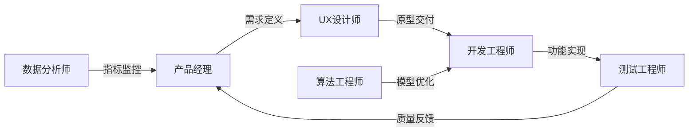
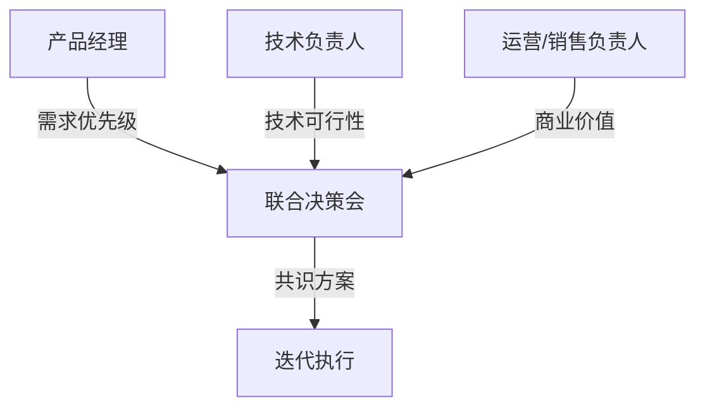

# 迭代设计 | Iterating on Design

> **TL;DR**: 迭代设计是产品从"能用"到"好用"的核心路径。通过设计-实现-测试-优化的循环,AI产品经理能够快速验证假设、响应市场变化,最终打造超越用户预期的产品体验。在2026年的中国AI市场,快速迭代能力已成为头部企业的核心竞争力。

## 1. 为什么AI产品需要迭代设计

在传统瀑布式(Waterfall)开发中,产品需求在项目初期就被完全定义,后续按线性流程推进。这种方式适合需求明确、变化较少的场景,但对于AI产品来说存在致命缺陷:

**AI产品的三大不确定性:**
- **技术边界不确定**: 大模型能力边界难以预测,需要通过实际应用验证
- **用户需求动态变化**: AI应用场景快速演进,用户期望持续升级
- **市场窗口期短**: 据2026年行业数据,超过73%的科技公司已将大模型深度融入核心产品,竞争激烈

迭代设计通过循环式开发,将产品打磨过程分解为多个短周期(Sprint),每个周期都包含完整的"设计→开发→测试→反馈"流程。这就像雕刻家反复打磨作品,每一轮迭代都让产品更接近最优状态。

### 实战洞察 💡 **AI产品迭代的特殊性**

传统软件迭代主要优化功能和交互,而AI产品迭代还需要关注**模型能力边界**。以豆包(抖音AI助手)为例,团队通过持续迭代优化了:
- **Prompt工程**: 根据用户对话数据优化提示词模板
- **模型调优**: 基于失败案例微调模型参数
- **评估体系**: 建立动态评估指标,监控模型表现

这种"产品迭代+模型迭代"的双重循环,是AI PM必须掌握的核心能力。每次用户反馈都是免费的数据标注,帮助团队了解模型能力边界。

## 2. 迭代设计的四大核心原则

### 2.1 用户中心(User-Centric)

**定义**: 将实际用户作为设计决策的核心依据,而非依赖团队的主观判断。

**实践方法**:
```
用户反馈收集 → 需求优先级排序 → 快速原型验证 → 数据驱动决策
```

**案例**: Microsoft Teams在疫情期间通过迭代快速响应远程办公需求。团队每周收集企业用户反馈,优先开发高频痛点功能(如背景虚化、会议录制),3个月内DAU增长300%。

### 2.2 灵活适应(Flexible)

AI技术和市场趋势快速变化,产品需要保持高度适应性。

**2026年中国AI市场特征**(据行业调研):
- **技术迭代快**: GPT-5、Claude 4等新模型持续发布,能力边界不断拓展
- **应用场景多样**: 从办公助手到编程工具,垂直场景持续涌现
- **监管政策动态**: AI安全、数据隐私等合规要求持续更新

**应对策略**: 采用模块化架构,将核心能力(如模型调用、数据处理)与业务逻辑解耦,降低迭代成本。

### 2.3 跨职能协作(Collaborative)



**中国团队协作特色**:
- **产研一体化**: 字节跳动等公司推行产品经理与技术团队深度绑定,减少沟通损耗
- **敏捷站会(Daily Stand-up)**: 每日15分钟同步进度,快速识别阻塞点
- **双周Sprint**: 2周为一个迭代周期,平衡开发效率与反馈速度

### 2.4 持续改进(Improvement-Focused)

迭代不止于产品上线,而是贯穿整个生命周期。

**改进循环示意图**:
```
┌─────────────────────────────────────┐
│  上线后持续监控                     │
│  ├─ 用户行为数据(GA/神策)           │
│  ├─ 性能指标(响应时间/错误率)       │
│  └─ 用户满意度(NPS/CSAT)            │
└──────────┬──────────────────────────┘
           ↓
    识别优化机会
           ↓
    规划下一轮迭代
           ↓
    返回第1步
```

**案例**: Azure AI服务通过持续迭代,在3年内将API响应速度提升40%,同时成本降低25%。关键举措包括:
- 每月分析Top 10用户投诉,纳入迭代计划
- 建立A/B测试平台,并行验证多个优化方案
- 设立"质量门禁",关键指标未达标不允许上线

## 3. 中国团队的敏捷实践本土化

### 3.1 Sprint规划的中国式调整

**标准Scrum流程** vs **中国团队实践**:

| 环节 | 标准Scrum | 中国本土化改进 |
|------|-----------|----------------|
| Sprint时长 | 2-4周 | **多数采用2周**(快节奏市场需求) |
| 每日站会 | 15分钟 | **融入飞书/钉钉在线文档**,异步更新+同步讨论 |
| 回顾会议 | 每Sprint结束 | **增加"复盘文档"沉淀**,知识库归档 |
| 用户故事 | 英文模板 | **中英双语**,如"作为营销PM,我希望..." |

### 3.2 工具链本土化

**西方工具 → 中国替代方案**:

- **项目管理**: Jira → 飞书项目 / TAPD / Worktile
- **设计协作**: Figma → 即时设计 / MasterGo
- **文档协作**: Confluence → 飞书文档 / 语雀
- **原型工具**: Sketch → 墨刀 / Axure中文版

### 3.3 字节跳动的迭代实践(据公开报道)

字节跳动在AI产品迭代中强调**三大执行能力**:

1. **精准的战略方向**: 通过数据分析锁定核心场景(如豆包的对话式搜索)
2. **高效的研发资源配置**: 2026年动员数百名工程师集中攻关豆包优化
3. **快速的市场迭代**: 关注"早期成功信号",每2周验证产品方向是否正确

**迭代节奏**:
- **周迭代**: 小功能优化(UI调整、文案优化)
- **双周迭代**: 中等功能(新增对话场景、模型参数调优)
- **月度迭代**: 大型特性(多模态能力、知识库集成)

### 实战洞察 💡 **中国AI团队的迭代文化差异**

相比西方团队的"完美主义",中国团队更强调**"小步快跑,快速试错"**:

- **MVP优先**: 先上线最小可行产品,快速占领市场心智
- **数据驱动**: 依赖A/B测试和用户行为数据,而非长周期用户研究
- **高强度协作**: 7×16小时工作制(早9晚9,一周6天)在创业公司常见

**风险提示**: 过度追求速度可能导致技术债累积。建议每3-4个Sprint安排一次"技术偿还周期",重构代码、优化架构。

## 4. 设计Sprint方法论

### 4.1 Google设计Sprint的5天流程

Google Ventures提出的设计Sprint是快速验证创意的利器:

**Day 1 - 理解问题(Understand)**
- 定义核心挑战:"用户在哪个环节流失?"
- 用户旅程地图(User Journey Map)绘制
- 输出: 明确的问题陈述(Problem Statement)

**Day 2 - 发散创意(Sketch)**
- 团队成员独立绘制解决方案草图
- 采用"疯狂8分钟"法: 8分钟内画出8个创意
- 输出: 多样化解决方案池

**Day 3 - 决策(Decide)**
- 投票选出最优方案(每人3票)
- 绘制详细故事板(Storyboard)
- 输出: 可执行的原型方案

**Day 4 - 原型(Prototype)**
- 开发高保真原型(Figma/墨刀)
- 准备测试脚本和任务列表
- 输出: 可交互的Demo

**Day 5 - 测试(Test)**
- 邀请5-8名目标用户测试
- 观察用户行为,记录痛点
- 输出: 验证结论 + 改进建议

### 4.2 中国团队的Sprint改进

**挑战**: 5天周期对国内快节奏业务压力较大

**本土化方案**:
- **压缩为3天Sprint**: Day1理解+发散, Day2决策+原型, Day3测试+复盘
- **远程协作**: 利用飞书妙记实时记录,支持异地团队参与
- **AI工具赋能**:
  - 用ChatGPT/文心一言辅助头脑风暴
  - 用即时设计AI功能快速生成原型变体(还原度可达90%)

### 4.3 案例:某CRM产品的销售管道可视化优化

**背景**: 企业用户反馈销售管道功能难用,导致功能使用率不足30%

**3天Sprint过程**:

**Day 1(周一)**:
- **上午**: 产品经理David分析用户反馈,发现3大痛点
  1. 管道阶段切换步骤繁琐(平均需5次点击)
  2. 数据可视化不直观(缺少漏斗图)
  3. 缺少自定义能力(无法调整阶段名称)
- **下午**: UX设计师Emily组织头脑风暴,团队产出12个解决方案草图

**Day 2(周二)**:
- **上午**: 投票决策,选出"拖拽式管道编辑"+"可视化看板"方案
- **下午**: Emily用Figma制作高保真原型,支持:
  - 拖拽卡片切换阶段
  - 实时漏斗图展示转化率
  - 自定义阶段标签和颜色

**Day 3(周三)**:
- **上午**: 邀请6名销售总监远程测试(通过Teams共享屏幕)
- **下午**: 数据分析
  - 任务完成率: 从40%提升至85%
  - 平均操作步骤: 从5步降至2步
  - 用户满意度(CSAT): 4.2/5分

**结果**: 方案通过验证,纳入下一个双周Sprint开发计划

## 5. 持续改进的组织文化

### 5.1 建立"安全试错"环境

**腾讯AI产品经理培训生项目**(2026年启动)强调的核心理念:

> "把每一次失败都视为数据标注的机会,而非绩效考核的污点"

**具体措施**:
- **OKR而非KPI**: 关注目标(Objective)而非硬性指标,鼓励探索
- **失败复盘会**: 每月分享1-2个"有价值的失败案例",奖励勇于尝试的团队
- **沙盒环境**: 为新功能提供独立测试环境,避免影响主线产品

### 5.2 数据驱动的改进循环

**核心指标体系(以B2B SaaS为例)**:

| 指标类型 | 具体指标 | 采集工具 | 迭代触发阈值 |
|---------|---------|---------|-------------|
| 用户留存 | 次日/7日/30日留存率 | 神策数据/GrowingIO | 低于行业平均值10% |
| 功能使用 | 核心功能DAU/渗透率 | 自建埋点系统 | 新功能7日渗透率<15% |
| 用户满意度 | NPS / CSAT | 问卷星/腾讯问卷 | NPS<40或CSAT<3.5 |
| 业务价值 | 付费转化率/ARPU | CRM系统 | 环比下降>5% |

**改进决策流程**:
```
指标异常预警
  ↓
根因分析(5-Why法)
  ↓
优先级排序(Impact-Effort矩阵)
  ↓
纳入迭代计划
  ↓
A/B测试验证
  ↓
全量上线/快速回滚
```

### 5.3 跨部门协同机制

**挑战**: 产品、技术、运营、销售目标不一致,导致迭代方向冲突

**解决方案 - "铁三角"模式**:



**会议机制**:
- **频率**: 每Sprint启动前召开(双周1次)
- **时长**: 2小时
- **产出**:
  - 本Sprint优先级Top 5功能列表
  - 技术债偿还计划
  - 资源分配方案

### 实战洞察 💡 **AI产品的"数据飞轮"效应**

传统产品迭代是线性改进,而AI产品能够形成正向循环:

```
更多用户 → 更多数据 → 更好模型 → 更佳体验 → 更多用户
```

**案例**: 某智能客服系统通过迭代实现飞轮效应
- **V1.0**: 基础规则引擎,问题解决率45%
- **V2.0**: 收集3万条真实对话,训练意图识别模型,解决率提升至65%
- **V3.0**: 积累10万条标注数据,引入大模型,解决率达到82%
- **V4.0**: 用户主动反馈机制,每日新增500条标注,持续优化

**关键**: 在产品设计中预埋**数据反馈机制**(如"回答是否有用?"按钮),让迭代形成自驱动。

## 6. 迭代设计的常见陷阱与应对

### 6.1 陷阱1: 过度迭代导致方向迷失

**症状**: 团队疲于响应用户反馈,产品方向飘忽不定

**案例**: 某To B工具根据每个大客户需求定制,最终产品变成"功能堆砌怪",新用户学习成本极高

**应对策略**:
- **设立产品愿景(North Star Metric)**: 明确核心价值主张,所有迭代围绕核心指标
- **区分战略性迭代 vs 战术性优化**:
  - 战略性(20%): 影响产品定位的大特性,需CEO/VP审批
  - 战术性(80%): 体验优化、Bug修复,团队自主决策

### 6.2 陷阱2: 技术债失控

**症状**: 快速迭代3-6个月后,系统稳定性下降,新功能开发周期倍增

**数据**: 某创业公司因技术债,第10个Sprint的开发速度仅为第1个Sprint的30%

**应对策略**:
- **"80/20原则"**: 80%时间开发新功能,20%时间偿还技术债
- **代码质量门禁**:
  - 单元测试覆盖率 ≥ 70%
  - 代码Review通过率 100%
  - 关键模块重构纳入OKR

### 6.3 陷阱3: 用户反馈代表性偏差

**症状**: 团队只听"会反馈的用户"声音,忽视沉默大多数

**案例**: 某企业软件基于客服工单优化,但工单主要来自高级用户,导致新手用户流失率不降反升

**应对策略**:
- **多渠道采集**: 工单、NPS调研、用户访谈、行为数据四维交叉验证
- **用户分层**: 按使用频率/付费等级分组分析,避免头部用户绑架产品方向
- **沉默用户调研**: 主动联系流失用户,挖掘真实痛点

## 核心术语表

| 中文术语 | 英文术语 | 解释 |
|---------|---------|------|
| 迭代设计 | Iterative Design | 通过设计-测试-反馈的循环不断优化产品 |
| 敏捷开发 | Agile Development | 采用短周期迭代、快速响应变化的开发方法论 |
| Sprint | Sprint | 敏捷开发中的一个时间盒(通常2-4周),完成特定功能 |
| 最小可行产品 | MVP (Minimum Viable Product) | 具备核心功能、可快速验证市场需求的产品版本 |
| 用户故事 | User Story | 描述用户需求的格式:"作为[角色],我希望[功能],以便[价值]" |
| 每日站会 | Daily Stand-up | 敏捷团队每日15分钟同步会议,讨论进展和阻塞 |
| 回顾会议 | Sprint Retrospective | Sprint结束后团队反思流程改进的会议 |
| A/B测试 | A/B Testing | 对比两个版本效果的实验方法 |
| 北极星指标 | North Star Metric | 反映产品核心价值的关键指标 |
| 技术债 | Technical Debt | 为快速交付而牺牲的代码质量,需后续偿还 |
| 净推荐值 | NPS (Net Promoter Score) | 衡量用户忠诚度的指标(0-10分制) |
| 客户满意度 | CSAT (Customer Satisfaction) | 针对特定交互的满意度评分 |
| 任务成功率 | Task Success Rate | 用户成功完成任务的比例 |
| 影响力-复杂度矩阵 | Impact-Effort Matrix | 用于优先级排序的2×2矩阵工具 |
| 数据飞轮 | Data Flywheel | AI产品通过用户增长→数据积累→能力提升形成的正向循环 |

## 自测题

1. **单选**: 相比瀑布式开发,迭代设计最核心的优势是?
   - A. 降低开发成本
   - B. 缩短项目周期
   - C. 快速响应需求变化
   - D. 减少团队沟通成本

   <details>
   <summary>查看答案</summary>
   **C**. 迭代设计的核心优势在于灵活性,能够根据用户反馈和市场变化快速调整方向。
   </details>

2. **多选**: 在敏捷环境中,以下哪些是有效的迭代实践?
   - A. 每个Sprint时长固定为4周
   - B. 每日站会控制在15分钟内
   - C. 每次迭代结束进行回顾会议
   - D. 技术债可以无限累积,等产品稳定后统一偿还

   <details>
   <summary>查看答案</summary>
   **B、C**. Sprint时长应根据团队节奏调整(2-4周均可),技术债需要定期偿还,不能无限累积。
   </details>

3. **判断**: AI产品的迭代设计只需要关注产品功能优化,模型调优由算法团队负责,无需产品经理参与。
   - A. 正确
   - B. 错误

   <details>
   <summary>查看答案</summary>
   **B**. AI产品需要"产品迭代+模型迭代"双重循环,PM需要理解模型能力边界,参与Prompt优化和评估体系设计。
   </details>

4. **案例分析**: 某SaaS产品在上线3个月后,团队发现:
   - 核心功能DAU持续增长(+15%/月)
   - 但用户NPS从50降至35
   - 客服工单量增长200%

   作为产品经理,你应该优先采取哪些行动?(多选)
   - A. 立即暂停新功能开发,集中修复Bug
   - B. 分析NPS下降的根因,识别主要痛点
   - C. 对客服工单进行分类,找出高频问题
   - D. 继续按原计划推进新功能,NPS下降是短期波动

   <details>
   <summary>查看答案</summary>
   **B、C**. 数据出现矛盾时(DAU增长但NPS下降),应先根因分析。可能是新增功能带来学习成本,或者产品稳定性下降。不应盲目暂停或忽视警示信号。
   </details>

5. **简答**: 解释"数据飞轮效应"在AI产品迭代中的作用,并举一个实际例子。

   <details>
   <summary>参考答案</summary>
   数据飞轮是指AI产品通过"用户增长→数据积累→模型优化→体验提升→吸引更多用户"形成的正向循环。例如:推荐系统初期推荐准确率70%,吸引10万用户;用户行为产生100万条交互数据,用于训练模型;模型准确率提升至85%,用户留存率提高;良好口碑吸引50万新用户...循环加速。关键是在产品中预埋数据采集机制(如点赞/收藏/分享等反馈按钮)。
   </details>

6. **场景题**: 你负责一款AI写作助手,计划在下个Sprint增加"智能改写"功能。设计Sprint的5天流程中,Day 3(决策日)需要输出什么?应该包含哪些关键内容?

   <details>
   <summary>参考答案</summary>
   **Day 3输出**:
   1. **最终方案选择**: 通过投票从多个草图中选出最优方案(如"句子级改写" vs "段落级改写")
   2. **详细故事板(Storyboard)**: 绘制用户使用流程的6-8个关键界面,包括:
      - 触发入口(选中文本→右键菜单)
      - 改写选项界面(正式/口语/简洁3种风格)
      - 加载状态
      - 结果展示(原文/改写对比)
      - 用户操作(接受/重新生成/编辑)
   3. **技术可行性确认**: 与算法团队确认模型能力边界
   4. **原型开发分工**: 明确Day 4的开发任务和责任人
   </details>

7. **数据分析**: 某企业CRM系统进行销售管道可视化优化后,以下哪个数据最能证明迭代成功?
   - A. 开发团队加班时间减少30%
   - B. 任务完成率从40%提升至85%
   - C. 代码行数增加5000行
   - D. 设计稿获得CEO点赞

   <details>
   <summary>查看答案</summary>
   **B**. 任务完成率(Task Success Rate)直接反映用户能否顺利完成目标,是迭代效果的核心指标。其他选项要么是内部指标(A/C),要么是主观评价(D)。
   </details>

## 实践练习

### 练习1: 设计你的第一个Sprint计划

**场景**: 你负责一款AI面试助手产品,近期用户反馈"模拟面试功能不够真实,问题太简单"。请设计一个2周Sprint来优化这个功能。

**要求**:
1. 定义本Sprint的目标(Goal)
2. 列出3-5个用户故事(User Story)
3. 规划每日站会的关键检查点
4. 设计Sprint结束时的验收标准

**参考答案示例**:
```
Sprint目标: 提升模拟面试真实度,使问题难度与实际面试匹配

用户故事:
1. 作为求职者,我希望能选择面试难度(初级/中级/高级),以便匹配目标岗位
2. 作为求职者,我希望面试问题包含追问,以便模拟真实面试节奏
3. 作为求职者,我希望获得详细的表现分析,以便了解改进方向

每日站会检查点:
- Day 1-3: 难度分级算法完成情况
- Day 4-7: 追问逻辑开发进展
- Day 8-10: 评分体系集成状态
- Day 11-14: 测试用例通过率

验收标准:
- 功能: 3个难度级别可选,追问成功率≥80%
- 性能: 问题生成延迟<3秒
- 质量: 用户满意度≥4/5分(至少10名测试用户)
```

### 练习2: 优先级矩阵实战

**场景**: 产品待办列表(Backlog)中有以下需求,利用Impact-Effort矩阵进行排序:

| 需求 | 预期影响 | 开发工作量 |
|-----|---------|-----------|
| A. 新增Excel导入功能 | 提升20%企业客户转化率 | 2周 |
| B. 优化加载速度 | 减少15%用户流失 | 3天 |
| C. 集成第三方CRM系统 | 拓展新市场,潜在100家客户 | 6周 |
| D. 修复已知的3个小Bug | 减少5%客服工单 | 1天 |
| E. 重构底层架构 | 降低30%运维成本 | 8周 |

**任务**:
1. 绘制2×2矩阵,将需求标注在对应象限
2. 给出前3个Sprint的优先级排序,并说明理由

**参考答案**:
```
Impact-Effort矩阵:

高影响 │ B(速度优化)      │ A(Excel导入)
       │ D(Bug修复)      │ C(CRM集成)
───────┼─────────────────┼──────────────
低影响 │                 │ E(架构重构)
       │ 低工作量         │ 高工作量

优先级排序:
Sprint 1: B + D (快速见效,提升用户体验)
Sprint 2: A (中等工作量,高商业价值)
Sprint 3: C (高工作量,但打开新市场)

理由:
- B和D属于"高影响-低工作量"象限,优先处理(Quick Wins)
- A是"高影响-中等工作量",符合迭代原则
- C虽然工作量大,但商业价值明确,排第3
- E虽重要但非紧急,可在后续技术债偿还周期处理
```

### 练习3: 复盘一次失败的迭代

**场景**: 你的团队在上个Sprint推出了"智能推荐"功能,但数据显示:
- 功能使用率仅8%(目标≥30%)
- 推荐准确率62%(目标≥80%)
- 开发延期1周

**任务**: 组织一次回顾会议(Retrospective),运用"5-Why分析法"找出根因,并提出改进措施。

**参考框架**:
```
现象: 使用率低(8%)
├─ Why 1: 用户不知道有这个功能?
│  └─ 数据: 仅30%用户看到过入口引导
│     └─ Why 2: 引导设计不明显?
│        └─ 发现: 引导仅在首次登录显示,且可跳过
│           └─ Why 3: 产品经理未考虑多次触达?
│              └─ 根因: 用户教育策略缺失
│
├─ Why 1: 用户尝试后不再使用?
   └─ 数据: 点击率18%,但重复使用率<5%
      └─ Why 2: 推荐内容不相关?
         └─ 发现: 准确率仅62%,用户信任度低
            └─ Why 3: 模型训练数据不足?
               └─ 根因: 冷启动问题,数据积累<1万条

改进措施:
1. 短期(下个Sprint):
   - 增加多轮引导(登录3次内重复提示)
   - 在高频场景增加推荐入口(如搜索结果页)
2. 中期(2-3个Sprint):
   - 优化推荐算法,引入协同过滤
   - 增加用户反馈机制("推荐是否有用?"按钮)
3. 长期:
   - 建立用户教育体系(新手任务、视频教程)
   - 设立数据质量门禁(训练数据≥5万条才上线新场景)
```

## 扩展阅读

1. **《精益创业》(The Lean Startup)** - Eric Ries
   - 核心观点: "开发-测量-认知"循环,快速验证商业假设
   - 适用场景: 0-1阶段的产品迭代

2. **《用户故事地图》(User Story Mapping)** - Jeff Patton
   - 工具: 可视化用户旅程,识别迭代优先级
   - 中文资源: https://www.woshipm.com/pmd/user-story-mapping

3. **《敏捷回顾:让团队更优秀》(Agile Retrospectives)** - Esther Derby
   - 方法: 回顾会议的25种引导技巧
   - 实践: 适合中国团队的"六顶思考帽"法

4. **行业报告**: 《2026年中国AI产品经理能力图谱》(据公开信息整理)
   - 数据来源: 腾讯、字节跳动、阿里校招JD分析
   - 核心发现: AI PM需具备"技术理解+快速迭代+数据思维"三大能力
   - 获取: 搜索"2026 AI产品经理 能力模型"

5. **工具实践**: 飞书/Jira敏捷看板配置指南
   - 中文教程: 飞书帮助中心 → 项目 → 敏捷开发
   - 模板: Sprint计划模板、用户故事卡片模板
   - 视频: B站搜索"敏捷开发实战"(推荐UP主:产品大峡谷)

---

**下一节预告**: Note 63 将探讨**可用性测试方法**(Usability Testing Methods),深入讲解如何设计有效的测试方案,从用户行为中挖掘产品改进机会。

**学习建议**: 迭代设计不是纸上谈兵,建议立即在实际项目中尝试:
1. 选择一个小功能,规划一个2周Mini-Sprint
2. 记录每日进展和遇到的问题
3. Sprint结束后组织15分钟回顾会
4. 对比理论与实践的差异,沉淀自己的方法论

**记住**: 完美的产品不是设计出来的,而是迭代出来的!