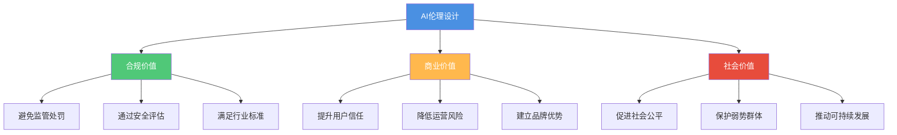
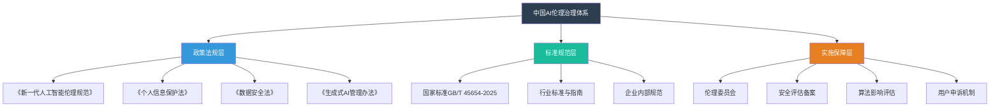
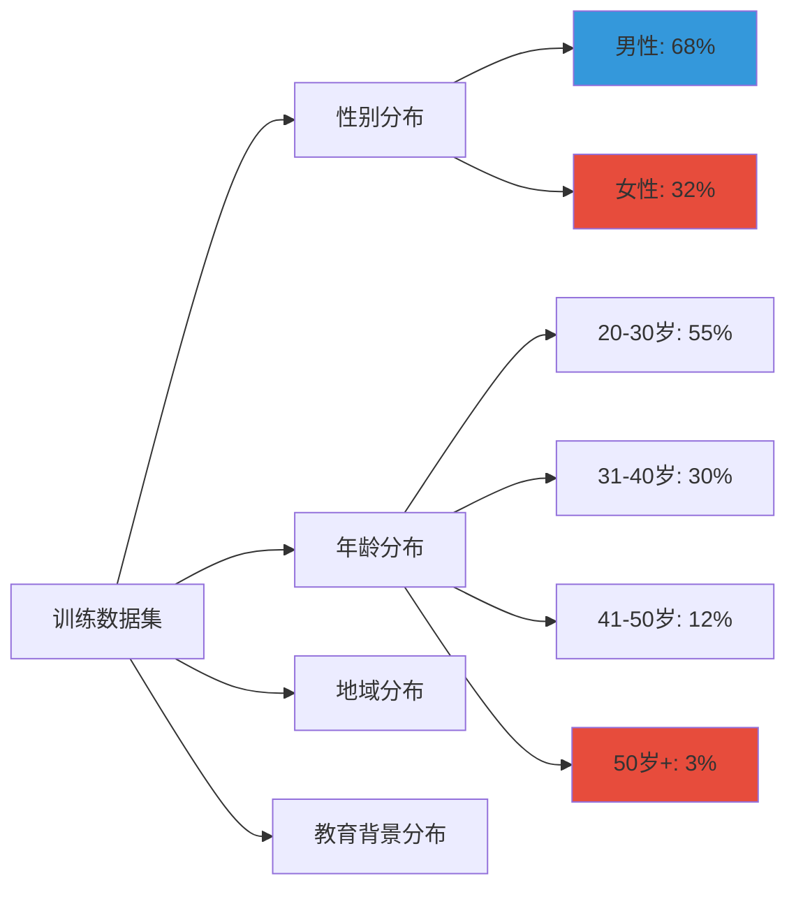
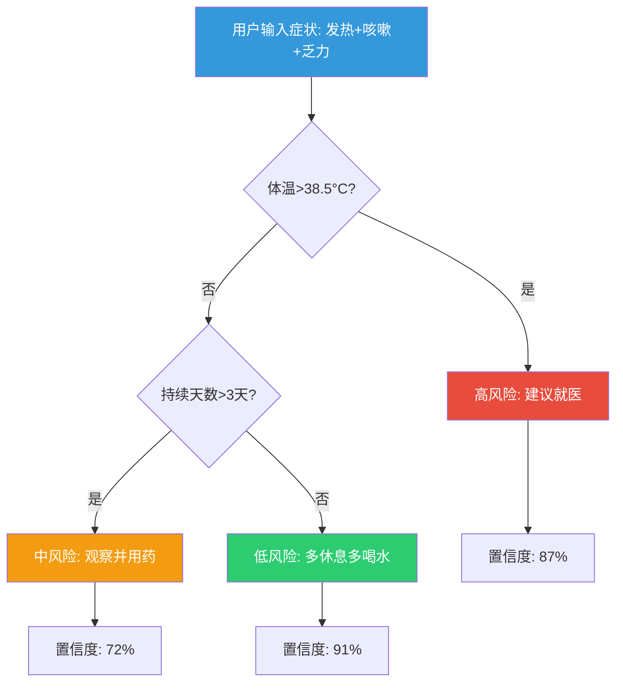
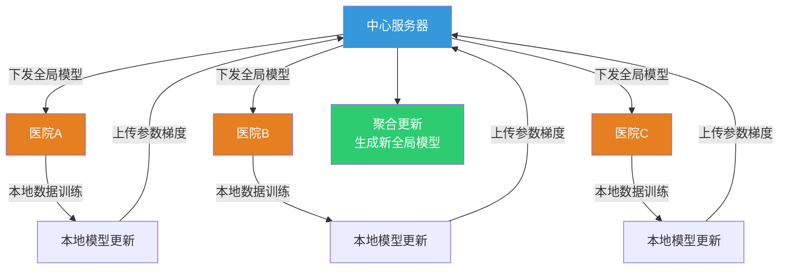

# AI设计伦理 | Ethical Considerations in AI Design

> **TL;DR**: AI产品伦理设计不仅是技术挑战,更是社会责任。作为AI PM,你需要在创新与责任之间找到平衡,确保AI系统体现公平、透明、可问责的核心价值,同时遵循中国《新一代人工智能伦理规范》等监管框架。本笔记将带你掌握负责任AI设计的原则、方法与实践,助力构建可信赖的AI产品。

## Table of Contents

- [1. 引言:AI伦理为何至关重要](#1-引言ai伦理为何至关重要)
- [2. AI伦理核心原则](#2-ai伦理核心原则)
- [3. 中国AI伦理规范框架](#3-中国ai伦理规范框架)
- [4. 算法偏见的识别与消除](#4-算法偏见的识别与消除)
- [5. 可解释AI设计实践](#5-可解释ai设计实践)
- [6. 隐私保护与数据伦理](#6-隐私保护与数据伦理)
- [7. 包容性设计策略](#7-包容性设计策略)
- [8. 伦理困境与决策框架](#8-伦理困境与决策框架)
- [核心术语表](#核心术语表)
- [自测题](#自测题)
- [实践练习](#实践练习)
- [扩展阅读](#扩展阅读)

---

## 1. 引言:AI伦理为何至关重要

当AI从"技术亮点"成为"业务底座",产品经理面临的问题不再是"AI能做什么",而是"AI应该做什么"。2025年,随着豆包、文心一言、通义千问等大模型的广泛应用,AI伦理已从边缘话题跃升为核心竞争力。

### 为什么AI伦理是PM的核心职责?

想象这样一个场景:你的招聘AI系统因训练数据偏差,系统性地筛掉了优秀女性候选人;你的信贷评估模型因为"邮编"特征,对特定社区的申请者给出了不公平的低分;你的客服AI在处理用户隐私数据时缺乏透明度,导致用户信任危机。

这些不是假设——它们是真实发生过的AI伦理失败案例。据艾瑞咨询2025年报告,73%的中国用户表示"AI产品的伦理表现"会直接影响他们的使用决策。更重要的是,中国已建立起完善的AI监管体系,2025年6月发布的GB/T 45654-2025《网络安全技术 生成式人工智能服务安全基本要求》对算法透明度、数据安全、责任追溯提出明确技术规范。

**AI伦理的三重价值**:



### 2026年中国AI伦理现状

根据国家网信办2025年9月发布的指导意见,中国AI治理已形成"风险清单→治理体系"的演进逻辑,从模型研发、应用部署到运营管理建立"三阶段"安全指引。对AI PM而言,这意味着:

- **研发阶段**:需进行算法影响评估,系统识别性别、地域等潜在偏见
- **部署阶段**:需实施内容标识化,对AI生成内容进行明确标注
- **运营阶段**:需建立用户反馈机制,持续监测并修正不公平输出

---

## 2. AI伦理核心原则

无论是微软的Responsible AI框架,还是中国的《新一代人工智能伦理规范》,全球AI伦理体系都围绕六大核心原则展开:

### 2.1 公平性 Fairness

**定义**: AI系统应平等对待所有用户群体,避免基于种族、性别、年龄、地域等特征的歧视。

**实践要点**:
- 训练数据代表性检查:确保各人口群体在数据集中均衡分布
- 公平性指标评估:使用统计均等性(Demographic Parity)、机会均等(Equal Opportunity)等量化指标
- 多维度测试:针对不同用户群体进行独立的性能测试

**中国案例**: 某头部金融科技公司在开发信贷风控模型时,发现模型对农村地区申请者的拒绝率显著高于城市用户。通过引入"对抗性去偏"(Adversarial Debiasing)技术,在保持风险预测能力的同时,将地域差异导致的不公平降低了42%。

### 2.2 可靠性与安全性 Reliability & Safety

**定义**: AI系统应在各种场景下稳定运行,不产生有害输出,能够优雅地处理边缘情况。

**实践要点**:
- 鲁棒性测试:对抗性样本测试、边界条件压力测试
- 失效保护机制:当AI无法给出可靠答案时的降级策略
- 人类在环(Human-in-the-Loop):关键决策保留人工审核

### 2.3 隐私与安全 Privacy & Security

**定义**: 保护用户数据隐私,遵循最小必要原则,建立清晰的数据使用边界。

**中国监管要求**(据《个人信息保护法》):
- 用户数据用于AI训练需单独获取同意
- 必须进行个人信息保护影响评估(PIA)
- 实施数据分级、加密、去标识化等安全措施

### 2.4 包容性 Inclusiveness

**定义**: AI产品应服务于不同能力、背景、文化的用户,特别关注残障人士、老年人等弱势群体。

**实践示例**:
- 某智能客服产品支持方言识别(粤语、四川话等),覆盖普通话能力较弱的老年用户
- 视障用户模式:优化语音交互流程,提供详细的屏幕阅读器适配

### 2.5 透明性 Transparency

**定义**: 用户应理解AI如何做出决策,企业应公开算法逻辑的关键信息。

**中国监管要求**(据《生成式人工智能服务管理暂行办法》):
- 披露训练数据来源
- 对生成内容进行标识
- 实施AI服务安全评估备案制度

### 2.6 问责性 Accountability

**定义**: 明确AI系统的责任主体,建立可追溯的决策链条,当出现问题时能够追责。

**实践要点**:
- 建立AI决策日志系统,记录关键决策路径
- 设立AI伦理委员会,定期审查高风险应用
- 制定清晰的申诉与纠错机制

### 教学洞察 💡 六大原则的优先级权衡

在实际产品开发中,六大原则常常存在张力。例如,提高透明性可能增加系统复杂度影响可靠性;强化隐私保护可能限制个性化能力影响包容性。如何权衡?

**决策框架**:
1. **风险分级**: 高风险场景(医疗诊断、信贷审批)优先保证公平性与问责性;低风险场景(推荐阅读)可适度放宽
2. **用户参与**: 通过用户研究明确目标群体最看重的原则,例如金融用户更关注隐私,教育用户更关注公平
3. **渐进迭代**: 从MVP阶段建立基础伦理防线,随产品成熟逐步强化各维度能力

某教育AI公司的做法值得借鉴:他们为不同产品线设定"伦理优先级矩阵",K12作业批改产品将公平性设为P0级,而成人职业培训产品则将包容性设为P0级,实现了差异化的伦理治理策略。

---

## 3. 中国AI伦理规范框架

中国已建立起全球领先的AI伦理治理体系。作为AI PM,必须熟练掌握核心政策文件。

### 3.1 《新一代人工智能伦理规范》(2021年9月)

由国家新一代人工智能治理专业委员会发布,是中国AI伦理的纲领性文件。

**核心内容**:

**伦理原则** (6项):
- 增进人类福祉
- 促进公平公正
- 保护隐私安全
- 确保可控可信
- 强化责任担当
- 提升伦理素养

**治理原则** (4项):
- 敏捷治理:快速响应技术发展
- 分类分级:差异化监管策略
- 协同治理:政府、企业、社会多方参与
- 开放共享:促进国际交流

**活动规范**: 涵盖AI研发、供给、使用全生命周期的具体要求

### 3.2 2025年重点监管政策

**GB/T 45654-2025《生成式AI服务安全基本要求》**(2025年6月发布):
- 明确训练数据安全、模型安全、安全措施的技术规范
- 要求建立"三阶段"安全指引:研发→部署→运营
- 强制要求对生成内容进行标识

**《AI科技伦理审查服务办法(试行)》**(2025年8月征求意见):
- 提出对AI活动进行伦理审查的详细要求
- 覆盖算法偏见、模型鲁棒性、日志管理等维度
- 建立分级分类审查机制

### 3.3 中国AI伦理治理体系架构



### 3.4 合规检查清单

作为AI PM,在产品上线前应完成以下合规检查:

**✅ 数据合规**:
- [ ] 训练数据来源合法,获得必要授权
- [ ] 用户数据用于训练已获单独同意
- [ ] 完成个人信息保护影响评估(PIA)
- [ ] 实施数据分级、加密、去标识化

**✅ 算法合规**:
- [ ] 完成算法影响评估,识别潜在偏见
- [ ] 高风险应用(招聘、信贷等)通过公平性测试
- [ ] 披露算法逻辑关键信息
- [ ] 建立算法决策日志系统

**✅ 内容合规**:
- [ ] AI生成内容已明确标识
- [ ] 建立内容安全审核机制
- [ ] 设置敏感话题拒答策略

**✅ 运营合规**:
- [ ] 完成AI服务安全评估备案(针对生成式AI)
- [ ] 建立用户申诉与纠错通道
- [ ] 定期开展伦理审计

---

## 4. 算法偏见的识别与消除

算法偏见是AI伦理最核心的挑战。当AI从有偏见的数据中学习时,它会放大而非消除不平等。

### 4.1 偏见的三大来源

**数据偏见 Data Bias**:
- **样本偏差**: 训练数据未能代表真实人口分布
  - 案例:某人脸识别系统在浅肤色人群上准确率95%,深肤色人群仅73%,因训练数据中浅肤色样本占比82%
- **标注偏差**: 人工标注者带入主观偏见
  - 案例:简历筛选训练数据中,标注者倾向于将"985高校"标记为高质量候选人,忽视其他维度

**算法偏见 Algorithmic Bias**:
- **特征选择偏差**: 选择了具有歧视性的特征
  - 案例:信贷模型使用"邮编"作为特征,实际上引入了种族/经济地位的代理变量
- **优化目标偏差**: 单一优化指标忽视公平性
  - 案例:广告推荐系统优化CTR,导致高薪职位广告更多展示给男性用户

**设计偏见 Design Bias**:
- **假设偏差**: 开发者对用户群体做出错误假设
  - 案例:语音助手设计假设用户标准普通话发音,对老年人、方言用户识别率大幅下降
- **场景盲点**: 未考虑弱势群体的特殊需求
  - 案例:智能客服缺少视障模式,无法为屏幕阅读器提供适配

### 4.2 偏见检测方法论

**Step 1: 数据审计 Data Audit**

检查训练数据的代表性和平衡性:

```python
# 示例:检查招聘数据集的性别分布
import pandas as pd

# 统计各维度分布
gender_dist = df['gender'].value_counts(normalize=True)
education_dist = df['education'].value_counts(normalize=True)

# 检查交叉分布
cross_dist = pd.crosstab(df['gender'], df['position_level'], normalize='index')

# 识别显著不平衡(如某性别在高级岗位占比<30%)
```

**可视化检查**:



⚠️ 红色标记的群体占比过低,可能导致模型对其表现不佳

**Step 2: 公平性指标测试**

使用量化指标评估不同群体的模型表现差异:

**统计均等性 Demographic Parity**:
- 定义:各群体获得正向结果的概率应相等
- 公式: P(Y=1|A=a) = P(Y=1|A=b) (A为敏感属性如性别)
- 适用场景:招聘初筛、广告投放

**机会均等 Equal Opportunity**:
- 定义:真实合格者在各群体中被正确识别的概率应相等
- 公式: P(Ŷ=1|Y=1, A=a) = P(Ŷ=1|Y=1, A=b)
- 适用场景:贷款审批、医疗诊断

**实际案例**: 某招聘AI的公平性测试结果

| 群体 | 简历通过率 | TPR(真阳性率) | FPR(假阳性率) |
|------|------------|---------------|---------------|
| 男性 | 42% | 0.73 | 0.15 |
| 女性 | 28% | 0.58 | 0.08 |
| **差距** | **14%** | **0.15** | **0.07** |

结论:存在显著性别偏见,需进行去偏处理

**Step 3: 子群体性能分析**

将测试集按敏感属性分层,独立评估各子群体的性能:

```python
# 分性别评估模型性能
from sklearn.metrics import accuracy_score, f1_score

for gender in ['male', 'female']:
    subset = test_df[test_df['gender'] == gender]
    acc = accuracy_score(subset['label'], subset['prediction'])
    f1 = f1_score(subset['label'], subset['prediction'])
    print(f"{gender} - Accuracy: {acc:.3f}, F1: {f1:.3f}")

# 输出示例:
# male - Accuracy: 0.876, F1: 0.854
# female - Accuracy: 0.792, F1: 0.763
# 差距过大,需优化!
```

### 4.3 偏见缓解策略

**策略1: 数据重采样 Data Resampling**

调整训练数据,使各群体更加平衡:

- **过采样**: 增加少数群体样本(复制或合成)
- **欠采样**: 减少多数群体样本
- **SMOTE**: 合成少数类过采样技术

**实施要点**:
- 保留原始测试集以真实评估性能
- 防止过采样导致过拟合
- 结合领域知识判断合成样本的合理性

**策略2: 对抗性去偏 Adversarial Debiasing**

训练两个神经网络:主网络学习预测任务,对抗网络学习预测敏感属性。通过对抗训练,使主网络的输出无法推断敏感属性。

**优势**: 无需人工调整特征,适用于复杂深度学习模型
**适用场景**: 图像识别、自然语言处理

**策略3: 公平性约束优化 Fairness-Constrained Optimization**

在模型训练时加入公平性约束条件:

- **目标函数**: min Loss(accuracy) subject to Fairness Metric < threshold
- **实现方式**: 拉格朗日乘子法、后处理阈值调整

**中国案例**: 某金融科技公司在风控模型中应用公平性约束,在保持AUC仅下降0.02的前提下,将城乡用户间的违约预测偏差从18%降至5%以内,符合监管对普惠金融的要求。

**策略4: 人工审核与例外处理**

对高风险决策保留人工复核机制:

- **双轨制**: AI给出初步建议,关键决策由人工确认
- **申诉机制**: 用户可对AI决策提出异议,人工重新评估
- **例外名单**: 对历史受歧视群体设置保护性规则

### 教学洞察 💡 偏见检测的"三级火箭"方法

某头部互联网公司AI伦理团队总结的偏见检测最佳实践:

**Level 1 - 数据层(开发前)**:
- 建立数据集"营养成分表":记录各人口群体占比、标注者背景
- 设置数据平衡红线:任何群体占比<15%时强制告警
- 引入外部数据源:弥补内部数据的结构性偏差

**Level 2 - 模型层(开发中)**:
- 分层测试集:按性别、年龄、地域等维度切分测试集,要求各层性能差距<10%
- A/B对比实验:同时训练有偏/无偏数据集的两个模型,量化偏见影响
- 可解释性分析:使用SHAP等工具检查敏感特征的影响权重

**Level 3 - 应用层(上线后)**:
- 实时监控:持续追踪不同用户群体的结果分布,设置异常告警
- 用户反馈收集:设置"反馈此结果不公平"按钮,建立偏见案例库
- 定期审计:每季度由独立团队进行公平性审计,出具报告

通过三级防护,该公司将AI产品的偏见投诉率从上线初期的3.2%降至0.4%,显著提升了用户信任度。

---

## 5. 可解释AI设计实践

可解释性(Explainability)是AI透明性原则的核心体现。当用户理解AI如何做决策时,他们更愿意信任和采纳系统建议。

### 5.1 为什么需要可解释AI?

**监管合规需求**:
- 据《生成式人工智能服务管理暂行办法》,企业需"披露算法逻辑"
- 高风险应用(信贷、医疗)的用户有"知情权",需解释决策依据

**用户信任建立**:
- 麦肯锡2024年调查显示,67%的中国用户表示"能解释决策的AI更值得信任"
- 当AI拒绝用户请求(如贷款申请)时,清晰解释能显著降低投诉率

**系统调试优化**:
- 开发团队通过可解释性工具发现模型错误,加速迭代
- 业务团队理解AI逻辑后,能提出更有针对性的优化建议

### 5.2 可解释性的三个层次

**全局可解释性 Global Explainability**:
- 解释模型整体如何工作,哪些特征最重要
- 适用对象:数据科学团队、监管机构
- 工具:特征重要性排序、偏依赖图(Partial Dependence Plot)

**局部可解释性 Local Explainability**:
- 解释单个预测为何得出此结果
- 适用对象:终端用户、客服团队
- 工具:LIME、SHAP值

**反事实解释 Counterfactual Explanation**:
- 告诉用户"改变哪些条件可以得到不同结果"
- 适用对象:被拒绝的申请者、需优化表现的用户
- 示例:"如果您的月收入提高15%,信贷审批通过概率将提升至72%"

### 5.3 XAI界面设计模式

**模式1: 决策因素可视化**

适用场景:信贷审批、简历筛选、风险评估

设计要点:
- 列出影响决策的Top 3-5因素
- 用进度条或占比展示各因素贡献度
- 用红绿色区分正向/负向影响

**示例**: 贷款申请审批界面

```
┌─────────────────────────────────────────┐
│  申请结果: 已通过 ✓                     │
│                                         │
│  主要决策因素:                          │
│  ━━━━━━━━━━━━━━━━━━━━━━━━━━━━━━━━━━  │
│  ✓ 信用评分 (750分)          [█████] 35%│
│  ✓ 收入稳定性 (5年工龄)      [████ ] 28%│
│  ✓ 负债收入比 (22%)          [███  ] 20%│
│  ✓ 历史还款记录 (无逾期)     [██  ] 12%│
│  ⚠ 贷款金额 (略高于平均)     [█   ]  5%│
│                                         │
│  [查看详细评估报告]                     │
└─────────────────────────────────────────┘
```

**模式2: 自然语言解释**

适用场景:客服机器人、推荐系统、智能助手

设计要点:
- 用简洁的日常语言(避免技术术语)
- 突出核心逻辑(不超过3句话)
- 提供"了解更多"入口供深入探索

**示例**: 智能客服推荐解决方案

```
┌─────────────────────────────────────────┐
│  建议解决方案: 重置路由器网络设置      │
│                                         │
│  为什么推荐这个方案?                    │
│  根据您描述的"频繁断网且LED灯异常闪烁" │
│  以及设备使用3年的情况,这与78%的类似   │
│  案例原因相同——网络配置文件损坏。该方  │
│  案解决率89%,平均耗时5分钟。           │
│                                         │
│  [查看操作步骤] [咨询人工客服]         │
└─────────────────────────────────────────┘
```

**模式3: 决策路径树**

适用场景:诊断系统、故障排查、多步骤决策

设计要点:
- 展示AI推理的完整路径
- 允许用户回溯和分支探索
- 标注每一步的置信度

**可视化示例**:



### 5.4 SHAP值实战应用

SHAP(SHapley Additive exPlanations)是当前最流行的可解释性工具,基于博弈论Shapley值计算每个特征对预测的贡献。

**实施步骤**:

```python
import shap
import xgboost as xgb

# 1. 训练模型
model = xgb.XGBClassifier()
model.fit(X_train, y_train)

# 2. 创建SHAP解释器
explainer = shap.TreeExplainer(model)

# 3. 计算SHAP值
shap_values = explainer.shap_values(X_test)

# 4. 可视化单个预测
shap.force_plot(explainer.expected_value, shap_values[0,:], X_test.iloc[0,:])

# 5. 全局特征重要性
shap.summary_plot(shap_values, X_test)
```

**解读SHAP输出**:
- **红色区域**: 该特征推高了预测概率
- **蓝色区域**: 该特征压低了预测概率
- **宽度**: 该特征的影响程度

**产品化策略**: 某金融APP将SHAP值转化为用户友好的"信用提升建议":

```
您的信用评分: 680分

提升建议:
🔴 信用卡使用率过高(当前82%) → 降至30%以下可提升约45分
🔴 近期查询次数较多(3个月5次) → 减少申请频率可提升约20分
🔵 工作年限较短(1.5年) → 保持稳定就业可逐步提升评分
🔵 名下资产较少 → 增加储蓄或资产可提升约15分

预计6个月后,您的评分可提升至750分以上
```

### 5.5 可解释性的边界与权衡

**复杂度悖论**: 模型越复杂(如深度神经网络),预测越准确,但可解释性越差

**解决方案**:
- **模型蒸馏**: 用复杂模型训练,用简单模型(决策树)近似解释
- **混合架构**: 核心逻辑用可解释模型,辅助任务用黑盒模型
- **分层解释**: 对不同角色提供不同深度的解释

**隐私冲突**: 过度解释可能泄露训练数据中的敏感信息

**解决方案**:
- 限制解释粒度,只提供必要信息
- 使用差分隐私技术保护训练数据
- 针对高敏感场景设计专门的隐私保护型解释方法

---

## 6. 隐私保护与数据伦理

数据是AI的燃料,但不当使用会侵犯用户隐私、破坏信任。中国《个人信息保护法》和《数据安全法》对AI产品的数据使用提出了严格要求。

### 6.1 AI场景下的隐私风险

**训练数据泄露**:
- 模型记忆训练数据,通过精心设计的查询可提取原始数据
- 案例:研究者从GPT-2中提取出训练语料中的真实姓名、地址

**推理数据滥用**:
- 用户输入被用于改进模型,但未获明确授权
- 案例:某智能客服将用户咨询内容用于训练,泄露商业敏感信息

**模型倒推攻击**:
- 攻击者通过查询模型推断训练集中是否包含特定个体(成员推理攻击)
- 案例:医疗AI模型被用于推断某人是否患有特定疾病

**再识别风险**:
- 去标识化数据与其他数据源结合后重新识别个体
- 案例:匿名化的位置数据通过家庭/工作地址交叉分析重新识别用户

### 6.2 中国隐私保护监管要求

据《个人信息保护法》和《数据安全法》:

**合规要点**:

✅ **告知与同意**:
- 收集个人信息前需明确告知目的、方式、范围
- 用户数据用于AI训练需**单独获取同意**(不能捆绑)
- 提供便捷的撤回同意机制

✅ **最小必要原则**:
- 只收集实现处理目的所必需的最少信息
- 禁止"一揽子授权"或"强制索权"

✅ **个人信息保护影响评估(PIA)**:
- 开展高风险活动(如敏感信息处理、大规模画像)前必须进行PIA
- 评估内容:处理必要性、影响范围、安全措施、合法性

✅ **数据安全措施**:
- 实施数据分级分类管理
- 采取加密、去标识化等技术措施
- 建立数据泄露应急预案

✅ **用户权利保障**:
- 提供数据访问、更正、删除的渠道
- 支持数据可携带(导出个人数据)
- 自动化决策需提供人工复核选项

### 6.3 隐私保护技术方案

**方案1: 差分隐私 Differential Privacy**

**核心思想**: 向数据/模型输出中添加经过精心校准的噪声,使单个用户的数据无法被推断,但整体统计特性保持不变。

**应用场景**:
- 用户行为统计发布
- 联邦学习中的梯度保护
- 模型训练数据保护

**实施示例** (以数据统计发布为例):

```python
import numpy as np

def add_laplace_noise(true_value, sensitivity, epsilon):
    """
    添加拉普拉斯噪声实现差分隐私
    epsilon: 隐私预算,越小隐私保护越强但准确度越低
    """
    scale = sensitivity / epsilon
    noise = np.random.laplace(0, scale)
    return true_value + noise

# 示例:发布用户平均年龄
true_avg_age = 32.5
private_avg_age = add_laplace_noise(true_avg_age, sensitivity=1, epsilon=0.1)
# 输出可能为: 33.2 (加入噪声后)
```

**中国应用案例**: 某地图应用在发布区域人流密度热力图时应用差分隐私,在保护单个用户位置隐私的同时,提供准确的整体人流趋势,满足监管要求。

**方案2: 联邦学习 Federated Learning**

**核心思想**: 数据不出本地,只共享模型参数更新,在多方数据上协同训练模型。

**应用场景**:
- 跨医院联合训练疾病预测模型
- 跨银行联合训练反欺诈模型
- 多设备协同训练输入法模型

**架构图**:



**优势**:
- 原始数据不离开本地,满足数据安全法要求
- 可利用多方数据提升模型性能
- 适用于医疗、金融等高隐私敏感行业

**挑战**:
- 通信成本高
- 需防范梯度倒推攻击(结合差分隐私)
- 各方数据分布差异影响效果

**方案3: 去标识化与假名化**

**去标识化**: 删除或转换直接识别个体的信息(姓名、身份证号、手机号等)

**假名化**: 用假名/ID替代真实标识,保留数据关联性

**技术手段**:
- **泛化**: 将精确值替换为范围(如"32岁"→"30-40岁")
- **抑制**: 删除敏感字段
- **哈希**: 单向加密转换标识符
- **数据脱敏**: 部分遮盖(如手机号130****5678)

**注意**: 去标识化数据仍可能通过外部数据源再识别,需评估风险

**方案4: 同态加密 Homomorphic Encryption**

**核心思想**: 对加密数据进行运算,结果解密后与明文运算结果一致

**应用场景**:
- 云端模型推理(用户输入加密,云端处理,结果仍加密)
- 隐私保护的数据分析

**局限**: 计算开销大,当前主要用于低频高敏感场景

### 6.4 隐私设计原则 Privacy by Design

将隐私保护嵌入产品全生命周期,而非事后补救:

**7大原则**:
1. **主动预防**: 设计阶段就考虑隐私,而非被动应对
2. **默认隐私保护**: 默认设置提供最强隐私保护,用户可选择放宽
3. **隐私嵌入设计**: 隐私是核心功能,非附加选项
4. **全功能**: 隐私保护不以牺牲功能为代价,寻求双赢
5. **端到端保护**: 覆盖数据全生命周期(收集→存储→使用→删除)
6. **可见透明**: 让用户清楚数据如何被使用
7. **尊重用户**: 以用户为中心,保障用户对数据的控制权

**实践案例**: 某社交APP的隐私设计

- **主动预防**: 默认好友动态仅三天可见,用户可选择扩展
- **默认隐私**: 新用户默认开启"陌生人不可查看朋友圈"
- **隐私嵌入**: 阅后即焚消息,服务器不留存
- **全功能**: 支持端到端加密通话,不影响通话质量
- **端到端**: 提供"彻底删除账号及所有数据"功能
- **可见透明**: 隐私仪表盘展示数据使用情况
- **尊重用户**: 每项数据授权可独立开关,随时撤回

### 教学洞察 💡 隐私合规的"四象限优先级矩阵"

某头部AI公司隐私合规团队的实战经验:

将数据按"敏感度"和"使用频率"划分为四象限,差异化处理:

```
         高频使用
             ↑
    Ⅱ区 严格保护 | Ⅰ区 核心关注
    - 联邦学习   | - 差分隐私
    - 最小化收集 | - 重点审计
    - 短期留存   | - 用户透明
    ─────────┼─────────→ 高敏感
    Ⅲ区 标准流程 | Ⅳ区 特殊处理
    - 常规加密   | - 去标识化
    - 定期审查   | - 延迟删除
    - 分级授权   | - 外部审计
             ↓
         低频使用
```

**策略**:
- **Ⅰ区(高敏感+高频)**: 如用户位置、通讯录,重点投入差分隐私等先进技术,设立专人负责
- **Ⅱ区(高敏感+低频)**: 如医疗记录、财务数据,严格最小化收集,能不收集就不收集
- **Ⅲ区(低敏感+高频)**: 如APP使用日志,按标准流程加密存储、定期清理
- **Ⅳ区(低敏感+低频)**: 如设备型号,去标识化后可用于分析

该矩阵帮助团队高效配置资源,在满足合规要求的同时,避免过度保护影响产品体验。

---

## 7. 包容性设计策略

包容性(Inclusiveness)要求AI产品服务于所有用户,特别关注残障人士、老年人、少数民族、低收入群体等易被忽视的人群。

### 7.1 为什么包容性至关重要?

**社会责任**: 技术应是机会均等的工具,而非加剧数字鸿沟的推手

**商业价值**:
- 中国60岁以上老年人口超2.8亿,是巨大的潜在市场
- 残障人士约8500万,适配需求强烈
- 农村人口5亿+,对方言、低带宽环境的适配能提升渗透率

**法律合规**: 《无障碍环境建设法》(2023年9月施行)要求信息无障碍建设

### 7.2 常见包容性缺陷

**语言与文化**:
- 只支持普通话,不支持方言(粤语、闽南语、四川话等)
- 忽视少数民族语言(藏语、维吾尔语等)
- 文化语境错位(国外训练数据的表达习惯在中国不适用)

**认知能力**:
- 复杂的导航结构对老年人不友好
- 专业术语过多,教育水平较低用户难以理解
- 缺少新手引导,学习曲线陡峭

**感官能力**:
- 视障人士:缺少屏幕阅读器适配、语音导航
- 听障人士:语音交互无文字替代方案
- 色盲用户:仅用颜色区分信息(如红绿表示成功失败)

**技术环境**:
- 模型体积过大,农村地区弱网环境无法使用
- 需要高端设备,低端手机运行卡顿
- 仅支持最新系统版本,老旧设备被排除

### 7.3 包容性设计实践

**实践1: 多模态交互**

提供文字、语音、视觉等多种交互方式,用户可根据场景和能力自由切换:

- **视障模式**: 强化语音反馈,优化屏幕阅读器适配
  - 案例:某导航APP视障模式下,每个操作都有详细语音提示:"向左滑动查看更多选项","当前选中:回家按钮"

- **听障模式**: 语音信息自动转文字,视觉提示增强
  - 案例:视频通话应用提供实时字幕,关键提示用震动反馈

- **老年模式**: 大字体、大按钮、简化流程
  - 案例:某支付APP老年版只保留扫码支付、收钱、转账三大功能,去除理财、保险等复杂服务

**实践2: 方言与地方语言支持**

**技术路径**:
- 收集方言语料,训练方言识别模型
- 采用迁移学习,利用普通话模型加速方言模型训练
- 允许用户切换语言/方言偏好

**中国案例**: 某智能音箱支持粤语、四川话、东北话等8种方言,覆盖80%以上的方言使用人群。其策略:
- 识别失败时自动切换普通话模式
- 逐步学习用户语言习惯(个性化适配)
- 鼓励用户标注数据,众包优化方言模型

**实践3: 低资源环境优化**

**策略**:
- **模型压缩**: 知识蒸馏、剪枝、量化,减少模型体积
- **端云协同**: 高频低复杂度任务在端侧,复杂任务云端处理
- **离线模式**: 核心功能支持离线使用
- **渐进加载**: 先加载基础功能,再按需加载高级功能

**案例**: 某拍照翻译APP针对农村用户优化:
- 端侧模型仅15MB,支持离线识别常见单词
- 复杂句子自动队列,待网络可用时批量处理
- 自动检测网络质量,弱网环境压缩图片后上传

**实践4: 可定制化与个性化**

**核心理念**: 没有"标准用户",允许用户根据自身需求调整系统

**实施要点**:
- **偏好设置中心**: 字体大小、语速、交互方式、隐私级别等可调
- **学习用户习惯**: 自动适应用户的使用模式
- **情境感知**: 根据环境(如驾车、运动)自动切换模式

**案例**: 某阅读APP的包容性设置:
- 字体:5档大小 + 12种字体(含老年友好的黑体)
- 排版:行距、边距、对齐方式可调
- 辅助:长按发音、生词本、护眼模式
- 个性化:记忆每本书的阅读偏好设置

### 7.4 包容性评估方法

**方法1: 多样化用户测试**

主动招募不同背景的测试用户:

| 维度 | 多样性要求 |
|------|-----------|
| 年龄 | 18-30岁、31-50岁、51-70岁、70岁以上 |
| 教育 | 初中及以下、高中/中专、大学、研究生 |
| 地域 | 一线城市、二三线城市、县城、农村 |
| 能力 | 视障、听障、肢体障碍、认知障碍 |
| 技术 | 技术小白、一般用户、技术专家 |

**测试指标**:
- 任务完成率: 各群体是否都能完成核心任务?
- 完成时长: 是否存在显著群体差异?
- 错误率: 某些群体是否频繁犯错?
- 满意度: 各群体主观感受如何?

**方法2: 无障碍审计**

使用专业工具检查产品的无障碍性:

**常用工具**:
- **iOS**: Accessibility Inspector (Xcode自带)
- **Android**: Accessibility Scanner
- **Web**: WAVE、axe DevTools

**审计维度**:
- 所有控件是否有清晰的标签(label)?
- 色彩对比度是否符合WCAG 2.1标准(正常文字4.5:1,大字3:1)?
- 键盘导航是否流畅?
- 屏幕阅读器是否能准确朗读所有信息?

**方法3: 边缘场景压力测试**

测试产品在极端条件下的表现:

- **弱网环境**: 2G网络、高延迟、频繁断网
- **低端设备**: 3年前的入门级手机、512MB内存
- **嘈杂环境**: 语音识别在地铁、菜市场等场景的准确率
- **多任务干扰**: 后台运行多个应用时的性能

### 教学洞察 💡 包容性设计的"同理心工坊"

某互联网大厂UX团队的最佳实践:

**目标**: 让团队成员切身体验不同用户群体的痛点

**活动设计**:
1. **视障体验**: 戴眼罩使用自家产品30分钟,只能依赖屏幕阅读器
2. **老年体验**: 戴上模拟老花眼的眼镜+触觉迟钝手套,操作复杂流程
3. **弱网体验**: 将设备网络限速至2G,完成关键任务
4. **认知负荷**: 在嘈杂环境下同时执行多个任务,模拟注意力分散

**产出**:
- 每位成员提交3个以上包容性缺陷
- 团队共创包容性改进方案
- 建立"包容性检查清单",纳入产品发布标准

通过半年4次工坊,该团队产品的无障碍评分从62分提升至89分,老年用户留存率提升35%,成为行业标杆。

---

## 8. 伦理困境与决策框架

AI产品开发中,常常面临"没有完美答案"的伦理困境。作为PM,你需要一套系统化的决策框架。

### 8.1 典型伦理困境

**困境1: 公平性 vs 准确性**

场景:招聘AI在全体候选人上准确率85%,但对女性候选人仅78%。通过算法去偏可提升女性群体准确率至82%,但整体准确率下降至83%。

问题:是否应接受整体性能下降以换取公平性?

**困境2: 透明性 vs 竞争力**

场景:披露算法细节可提升用户信任,但可能被竞争对手模仿,丧失技术优势。

问题:在透明度和商业秘密间如何平衡?

**困境3: 个性化 vs 隐私**

场景:收集更多用户数据可提供更精准的个性化服务,但增加隐私风险。

问题:如何在用户体验和隐私保护间找到平衡点?

**困境4: 自动化 vs 就业**

场景:AI客服可替代60%人工客服工作,大幅降低成本,但将导致员工失业。

问题:企业是否应考虑AI对就业的冲击?

**困境5: 全球模型 vs 地方价值观**

场景:AI内容审核模型在全球市场使用,但不同地区对"敏感内容"定义不同。

问题:如何处理价值观冲突?

### 8.2 伦理决策框架

**框架1: 利益相关者分析**

识别所有受影响方,评估影响程度:

| 利益相关者 | 正向影响 | 负向影响 | 权重 |
|-----------|---------|---------|------|
| 终端用户 | 更快的服务 | 隐私担忧 | 40% |
| 员工 | 减少重复劳动 | 岗位被替代 | 25% |
| 股东 | 成本降低 | 声誉风险 | 20% |
| 社会 | 效率提升 | 就业冲击 | 15% |

**决策要点**:
- 各方利益是否存在"零和博弈"还是可以"共赢"?
- 是否存在被严重伤害的弱势群体?
- 长期影响vs短期影响如何权衡?

**框架2: 后果主义评估**

评估不同方案的整体后果,选择"最大化整体福祉"的方案:

**步骤**:
1. 列出所有可行方案
2. 预测每个方案对各方的影响(量化打分)
3. 计算加权总分
4. 选择总分最高的方案

**示例**: 信贷审批AI去偏决策

| 方案 | 整体准确率 | 公平性改善 | 实施成本 | 综合评分 |
|------|-----------|-----------|---------|---------|
| A:不去偏 | 85% (+10分) | 0% (0分) | 低 (+5分) | 15分 |
| B:轻度去偏 | 84% (+9分) | 50% (+5分) | 中 (+3分) | 17分 ✓|
| C:激进去偏 | 81% (+6分) | 90% (+9分) | 高 (+1分) | 16分 |

结论:选择方案B,在公平性和准确性间取得平衡

**框架3: 义务论审查**

无论后果如何,某些行为本身是对/错的(基于道德规则):

**核心问题**:
- 该行为是否违反基本人权?(如隐私权、平等权)
- 是否欺骗或操纵用户?
- 是否将人仅仅作为工具?(康德绝对命令)
- 是否遵守承诺和法律?

**应用**: 即使收集更多数据可提升准确率,但若未获用户明确同意,义务论会判定其不可接受。

**框架4: 公平性测试**

罗尔斯的"无知之幕"思想实验:

假设你不知道自己将处于社会的哪个位置(可能是受益者,也可能是受损者),你会选择哪种方案?

**示例**: AI招聘系统设计
- 如果不知道自己性别,你是否会接受一个对某性别有偏见的系统?
- 如果不知道自己学历,你是否会接受一个过度看重学历的系统?

这个测试促使决策者考虑最弱势群体的处境。

**框架5: 中国文化语境的补充考量**

在应用西方伦理框架时,需结合中国文化特点:

- **集体主义 vs 个人主义**: 中国文化更强调集体利益,个人隐私让渡的容忍度相对较高
- **关系伦理**: 对不同关系(家人、朋友、陌生人)的伦理义务不同
- **和谐价值**: 倾向于避免对抗性解决方案,寻求各方接受的折中方案
- **权威认可**: 政府指导、行业规范的权威性更强

### 8.3 伦理决策流程

**Step 1: 问题识别**
- 清晰定义伦理困境是什么?
- 涉及哪些原则的冲突?
- 影响哪些利益相关者?

**Step 2: 事实调查**
- 收集相关数据和证据
- 咨询领域专家意见
- 了解相似案例的处理方式

**Step 3: 方案生成**
- 头脑风暴多种可能方案
- 包括"不作为"选项
- 考虑创新性的"双赢"方案

**Step 4: 多维度评估**
- 利益相关者分析
- 后果主义评估
- 义务论审查
- 公平性测试
- 法律合规检查

**Step 5: 决策与执行**
- 基于评估结果做出决策
- 记录决策理由和依据
- 制定实施计划和监测机制

**Step 6: 监测与迭代**
- 持续监测实际影响
- 收集利益相关者反馈
- 必要时调整方案

### 8.4 伦理决策案例

**案例: 疫情期间健康码AI判定标准**

**背景**: 某省级健康码系统需要AI判定行程码异常标准,涉及公共卫生安全和个人自由的平衡。

**困境**:
- **方案A(严格)**: 只要14天内到过中风险区域即判定黄码,隔离观察
  - 优点:最大化防疫安全
  - 缺点:大量"误伤",影响正常生活和经济活动

- **方案B(宽松)**: 只有确诊/密接才判定红码,其他绿码
  - 优点:最小化对个人自由的限制
  - 缺点:漏检风险高,可能导致疫情扩散

- **方案C(智能)**: 结合停留时长、场所风险等级、当地疫情严重度等多维度智能判定
  - 优点:精准度更高,平衡安全和自由
  - 缺点:算法复杂,可能存在偏差,透明度挑战

**决策过程**:

1. **利益相关者分析**:
   - 全体公民健康安全:最高优先级
   - 被隔离者的自由和经济损失:需最小化
   - 医疗系统负荷:需可控

2. **后果评估**:
   - 方案A:预计"误判"率30%,每日影响10万人,但疫情控制最有效
   - 方案B:漏检率可能达15%,潜在疫情扩散风险
   - 方案C:预计"误判"率降至10%,技术可行性需验证

3. **义务论审查**:
   - 政府有保护公民生命健康的义务(支持方案A)
   - 但也需尊重公民自由和正当权利(反对过度限制)

4. **公平性测试**:
   - 如果你是被误判者,能否接受方案A的隔离要求?
   - 如果你是高危人群,能否接受方案B的漏检风险?

5. **中国语境考量**:
   - 集体主义文化下,为公共安全短期让渡个人自由的接受度较高
   - 政府权威主导,公民配合意愿强
   - 但需保证程序公正和申诉渠道

**最终决策**: 采用方案C(智能判定),并辅以以下措施:
- 建立快速申诉通道,48小时内人工复核
- 公开判定逻辑的核心要素(但不公开具体算法)
- 提供"点对点"转运等人性化服务,降低被隔离者损失
- 每周评估误判率,动态调整阈值

**实施效果**:
- 误判率控制在12%,显著低于方案A
- 疫情得到有效控制,未出现大规模扩散
- 申诉响应及时,公众满意度78%

**关键启示**:
- 伦理困境往往没有完美答案,需要在多个价值间权衡
- 技术方案(方案C)可以缓解而非消除伦理张力
- 配套措施(申诉机制、人性化服务)可提升方案可接受性
- 持续监测和动态调整至关重要

### 教学洞察 💡 建立AI伦理委员会

**为什么需要伦理委员会?**

单个PM或团队容易陷入"群体思维",伦理委员会提供多元视角和独立审查。

**组成建议**:
- **内部成员**: 产品、技术、法务、PR各1-2人
- **外部成员**: 伦理学专家、用户代表、行业专家
- **规模**: 5-9人为宜(奇数便于投票)

**职责**:
- 审查高风险AI项目的伦理影响
- 制定和更新公司AI伦理准则
- 处理用户投诉和伦理争议
- 定期伦理培训和案例分享

**运作机制**:
- **常规审查**: 季度会议,审查项目清单
- **快速通道**: 紧急项目24小时内响应
- **分级制度**: 低风险项目简化审查,高风险项目需全员投票

**案例**: 某科技公司伦理委员会在一次审查中否决了一个"AI情绪识别用于员工监控"的项目,认为其侵犯隐私且易被滥用,虽然技术可行但伦理不可接受。最终公司将该技术转向"客服质检"等更合适场景,避免了潜在的法律和声誉风险。

---

## 核心术语表

| 中文术语 | 英文术语 | 定义 |
|---------|---------|------|
| 负责任AI | Responsible AI | 遵循伦理原则(公平、透明、问责等)开发和部署AI系统的实践框架 |
| 算法偏见 | Algorithmic Bias | AI系统由于数据、算法或设计缺陷,对某些群体产生系统性不公平结果的现象 |
| 可解释AI | Explainable AI (XAI) | 使AI决策过程透明、可理解的技术和方法,帮助用户理解"为什么" |
| 差分隐私 | Differential Privacy | 通过添加噪声保护单个数据点隐私,同时保持整体统计特性的技术 |
| 联邦学习 | Federated Learning | 多方协同训练模型但数据不出本地的分布式机器学习方法 |
| 统计均等性 | Demographic Parity | 公平性指标,要求不同人口群体获得正向结果的概率相等 |
| 机会均等 | Equal Opportunity | 公平性指标,要求真实合格者在各群体中被正确识别的概率相等 |
| 对抗性去偏 | Adversarial Debiasing | 通过对抗训练使模型预测结果无法推断敏感属性,从而减少偏见的方法 |
| SHAP值 | SHAP Values | 基于博弈论Shapley值计算特征对预测贡献度的可解释性方法 |
| 人类在环 | Human-in-the-Loop | AI系统保留人工干预和审核机制,而非完全自动化决策 |
| 无知之幕 | Veil of Ignorance | 罗尔斯提出的伦理思想实验,假设不知道自己社会地位来评估公平性 |
| 个人信息保护影响评估 | Privacy Impact Assessment (PIA) | 评估数据处理活动对个人隐私影响的系统性流程,中国法律要求 |
| 去标识化 | De-identification | 删除或转换直接识别个体的信息(如姓名、身份证号)的技术 |
| 同态加密 | Homomorphic Encryption | 对加密数据进行运算,结果解密后与明文运算结果一致的加密技术 |
| 包容性设计 | Inclusive Design | 设计产品时考虑不同能力、背景用户需求,确保所有人可用的设计理念 |

---

## 自测题

**1. 单选题**: 根据中国《新一代人工智能伦理规范》,以下哪项不属于核心伦理原则?

A. 增进人类福祉
B. 促进公平公正
C. 追求利润最大化
D. 保护隐私安全

<details>
<summary>查看答案</summary>
C. 追求利润最大化(虽然是企业目标,但不是AI伦理核心原则)
</details>

**2. 多选题**: 某招聘AI系统对女性候选人通过率显著低于男性,可能采取哪些措施消除偏见?(多选)

A. 在训练数据中增加女性简历样本
B. 使用对抗性去偏技术
C. 删除所有性别相关特征
D. 设置公平性约束条件
E. 完全依赖AI判断,不进行人工复核

<details>
<summary>查看答案</summary>
A、B、D。C选项删除性别特征可能不够,因为其他特征(如教育经历)可能成为性别的代理变量;E选项错误,高风险决策应保留人工复核。
</details>

**3. 判断题**: 为了提升AI模型准确率,可以在未告知用户的情况下收集其行为数据用于训练。

A. 正确
B. 错误

<details>
<summary>查看答案</summary>
B. 错误。根据《个人信息保护法》,用户数据用于AI训练需单独获取同意,未告知违反法律规定。
</details>

**4. 案例分析题**: 某教育AI产品在农村地区使用时,发现对方言口音学生的语音识别准确率仅60%,而标准普通话学生达90%。作为PM,你会如何处理?

<details>
<summary>参考答案</summary>
**问题诊断**: 训练数据中方言样本不足,导致模型偏见,违反包容性原则。

**解决方案**:
1. **短期**(1-2周):
   - 添加"识别不准确?"反馈按钮,收集方言样本
   - 提供文字输入替代方案
   - 在产品说明中诚实告知当前局限性

2. **中期**(1-3个月):
   - 针对性收集目标地区方言语料
   - 训练方言适配模型或采用迁移学习
   - 小范围测试优化后模型

3. **长期**(3-6个月):
   - 建立方言多样性测试集,确保各方言准确率>80%
   - 将方言支持纳入产品核心指标
   - 开展包容性用户研究,发现其他盲点

**关键**: 将此视为包容性缺陷而非"可接受的边缘情况",主动改进而非等待投诉。
</details>

**5. 情景题**: 你的AI推荐系统可以通过分析用户浏览历史预测其政治倾向,从而推送更精准的新闻。但这可能加剧"信息茧房"效应。你会如何决策?

<details>
<summary>参考答案</summary>
**伦理困境**: 个性化效果 vs 信息多样性

**决策框架应用**:

**1. 利益相关者分析**:
- 用户: 短期获得感兴趣内容,长期陷入信息茧房
- 平台: 提升参与度和广告收入,但可能损害社会责任形象
- 社会: 加剧极化,损害公共讨论质量

**2. 后果评估**:
- 完全个性化: 用户满意度+15%,但多样性-40%
- 不个性化: 用户满意度-10%,但多样性保持
- 混合方案: 70%个性化+30%多样性内容

**3. 义务论审查**:
- 是否操纵用户认知? 是,通过选择性推送塑造世界观
- 是否侵犯用户知情权? 用户未意识到被"茧房化"

**推荐方案**: 采用混合推荐+透明化策略
- 70%推荐用户可能感兴趣的内容
- 30%推荐不同视角/新鲜主题("探索模块")
- 明确告知用户算法逻辑,提供"减少个性化"选项
- 定期评估内容多样性指标

**关键**: 平台应承担社会责任,不能为短期指标牺牲长期价值。
</details>

**6. 开放题**: 请设计一个"AI伦理审查检查清单",用于评估新AI功能上线前的伦理风险。至少包含5个维度、每个维度3个检查项。

<details>
<summary>参考答案</summary>

**AI伦理审查检查清单 v1.0**

**维度1: 公平性**
- [ ] 训练数据是否覆盖所有目标用户群体,各群体占比是否平衡?
- [ ] 是否对不同人口群体(性别、年龄、地域)进行分层测试,性能差距是否<10%?
- [ ] 是否使用统计均等性/机会均等等指标量化评估公平性?

**维度2: 透明性与可解释性**
- [ ] 用户是否知道正在与AI交互(而非人类)?
- [ ] 关键决策是否提供解释(如拒绝理由、影响因素)?
- [ ] 是否披露算法逻辑的核心要素(如使用了哪些数据类型)?

**维度3: 隐私与数据安全**
- [ ] 数据收集是否获得明确同意,用途说明是否清晰?
- [ ] 是否完成个人信息保护影响评估(PIA)?
- [ ] 是否实施加密、去标识化等技术保护措施?

**维度4: 包容性**
- [ ] 是否支持视障/听障用户的无障碍访问?
- [ ] 是否考虑老年人、低教育水平用户的使用场景?
- [ ] 是否在低资源环境(弱网、低端设备)下可用?

**维度5: 安全性与可靠性**
- [ ] 是否进行对抗性样本测试,评估鲁棒性?
- [ ] 是否设置人类在环机制,高风险决策保留人工复核?
- [ ] 是否建立用户申诉与纠错通道?

**维度6: 问责性**
- [ ] 是否明确AI系统的责任主体?
- [ ] 是否建立AI决策日志,关键决策可追溯?
- [ ] 出现问题时是否有明确的补救措施?

**使用说明**:
- 每项检查均需通过,否则需整改后重新审查
- 高风险应用(医疗、金融、招聘)需100%通过,中低风险应用需≥80%通过
- 每季度更新检查清单,纳入新的监管要求和最佳实践
</details>

**7. 计算题**: 某信贷AI模型在测试集上的表现如下:

| 群体 | 申请人数 | 实际违约率 | AI预测违约率 | 被拒绝率 |
|------|---------|-----------|-------------|---------|
| 城市用户 | 1000 | 8% | 10% | 12% |
| 农村用户 | 1000 | 12% | 18% | 22% |

(1) 计算两个群体的"假阳性率"(错误拒绝合格者的比例)
(2) 判断是否存在显著偏见
(3) 如果要求两组假阳性率差距<5%,需如何调整?

<details>
<summary>查看答案</summary>

**(1) 计算假阳性率**:

假阳性率 = (被AI错误预测为违约的合格者数量) / 合格者总数

- **城市用户**:
  - 合格者数量: 1000 × (1-8%) = 920人
  - AI预测违约率10% → 预测违约100人
  - 实际违约80人,则错误预测20人
  - 但更准确的计算: 被拒绝122人,实际违约80人,其中来自合格者的被拒数 ≈ 122 - 80 = 42人
  - 假阳性率 ≈ 42/920 ≈ 4.6%

- **农村用户**:
  - 合格者数量: 1000 × (1-12%) = 880人
  - 被拒绝220人,实际违约120人,来自合格者的被拒数 ≈ 220 - 120 = 100人
  - 假阳性率 ≈ 100/880 ≈ 11.4%

**(2) 偏见判断**:

农村用户假阳性率(11.4%)显著高于城市用户(4.6%),差距6.8%,**存在明显偏见**,违反公平性原则。

**(3) 调整方案**:

目标: 农村用户假阳性率降至 ≤ 4.6% + 5% = 9.6%

**方法1: 阈值调整**
- 针对农村用户降低风险判定阈值,减少拒绝数量
- 预计需将农村被拒率从22%降至约15%
- 代价: 可能增加实际违约通过率

**方法2: 算法去偏**
- 使用公平性约束优化,要求两组假阳性率接近
- 在损失函数中加入公平性惩罚项
- 可能导致整体准确率小幅下降

**方法3: 特征工程**
- 检查是否存在城乡代理变量(如邮编、收入来源类型)
- 去除或重新编码这些特征

**推荐**: 结合方法2+3,既优化算法又改进特征,确保公平性。
</details>

---

## 实践练习

### 练习1: 偏见检测与修复

**场景**: 你负责一款AI简历筛选工具,发现以下问题:

**测试数据**:
- 男性候选人通过率: 45%
- 女性候选人通过率: 28%
- 某"985高校"毕业生通过率: 72%
- 非"985高校"毕业生通过率: 31%

**任务**:
1. 诊断可能的偏见来源(数据偏见/算法偏见/设计偏见)
2. 设计3个偏见检测实验,验证你的假设
3. 提出2-3个偏见缓解方案,评估各方案的优缺点
4. 设计一个"公平性测试报告模板",用于未来迭代

**提示**:
- 考虑历史招聘数据可能存在的偏差
- 思考"学历"特征是否真正预测工作表现
- 探索是否存在"间接歧视"(如通过兴趣爱好推断性别)

---

### 练习2: 可解释性界面设计

**场景**: 你的团队开发了一款"健康风险预测AI",输入用户的年龄、BMI、运动习惯、饮食偏好等,输出未来5年患慢性病的风险评分(0-100分)。

**任务**:
1. 设计一个"风险评估结果页",需包含:
   - 评分展示
   - 主要影响因素可视化(至少3种展现形式)
   - 改进建议(反事实解释)
   - 透明度说明(让用户理解AI如何工作)
2. 针对不同用户群体(医生、普通用户、老年人),设计差异化的解释策略
3. 说明如何平衡"详细解释"与"避免用户焦虑"

**提示**:
- 参考SHAP值可视化、决策树路径等方法
- 考虑用交通灯(红黄绿)等隐喻增强理解
- 思考何时该"坦诚告知不确定性"

---

### 练习3: 伦理困境角色扮演

**场景**: 你所在公司开发了一款"员工效率监控AI",可以通过分析电脑使用记录、会议参与度、代码提交频率等,给每位员工的"工作投入度"打分。销售部门认为这能提升管理效率,但员工抱怨感觉被"监视"。

**角色分配**:
- 角色A: 产品经理(你)
- 角色B: 销售负责人(支持部署)
- 角色C: 员工代表(反对监控)
- 角色D: 法务/伦理顾问(中立评估)

**任务**:
1. 各角色准备论据(10分钟)
2. 进行伦理听证会(20分钟)
3. 投票表决是否部署该功能(仅PM和伦理顾问有否决权)
4. 输出"伦理决策报告",记录:
   - 各方观点总结
   - 决策依据(引用伦理框架)
   - 如果部署,需设置哪些限制条件?
   - 如果不部署,有无替代方案?

**思考点**:
- 员工监控的边界在哪里?
- 提升效率是否可以成为侵犯隐私的理由?
- 如何在企业利益和员工权利间平衡?

---

## 扩展阅读

### 官方政策文件

1. **《新一代人工智能伦理规范》**(2021)
   国家新一代人工智能治理专业委员会
   链接: [国家科技伦理委员会官网](http://www.most.gov.cn)

2. **GB/T 45654-2025《网络安全技术 生成式人工智能服务安全基本要求》**
   国家标准化管理委员会(2025年6月)

3. **《个人信息保护法》(2021)与《数据安全法》(2021)**
   全国人大常委会

4. **《生成式人工智能服务管理暂行办法》**(2023)
   国家网信办等七部门

### 国际框架参考

5. **Microsoft Responsible AI**
   微软负责任AI原则与实践指南
   链接: [microsoft.com/ai/responsible-ai](https://www.microsoft.com/en-us/ai/responsible-ai)

6. **EU AI Act** (欧盟AI法案,2024)
   全球首个综合性AI监管法规,值得借鉴其风险分级思路

7. **IEEE Ethically Aligned Design**(2019)
   IEEE关于伦理对齐设计的系统性指南

### 学术与行业报告

8. **《人工智能伦理治理研究报告(2023年)》**
   中国信息通信研究院科技伦理研究中心

9. **AI Fairness 360 工具包**
   IBM开源的公平性检测与缓解工具集
   链接: [aif360.mybluemix.net](http://aif360.mybluemix.net)

10. **《可解释AI方法综述》**(论文)
    Arrieta et al., "Explainable Artificial Intelligence (XAI): Concepts, taxonomies, opportunities and challenges toward responsible AI" (2020)

### 推荐书籍

11. **《AI伦理学》** - 李开复、王咏刚(2021)
    结合中国实际的AI伦理入门读物

12. **《Weapons of Math Destruction》** - Cathy O'Neil (2016)
    揭示算法如何加剧不平等的经典著作

13. **《人工智能伦理》** - 李伦(2019)
    国内学者系统性论述AI伦理的专著

---

**学习建议**:
- 优先阅读中国官方政策文件(1-4),建立合规基线
- 结合国际框架(5-7)扩展视野,学习最佳实践
- 动手实践公平性工具(9),将理论转化为技能
- 通过案例(11-12)培养伦理敏感度

AI伦理不是"一次性任务",而是贯穿产品生命周期的持续实践。作为AI PM,你的每一个设计决策都在塑造技术如何影响社会。记住:好的AI产品不仅是"能用的",更应该是"应该用的"。让我们共同构建一个公平、透明、负责任的AI未来!
