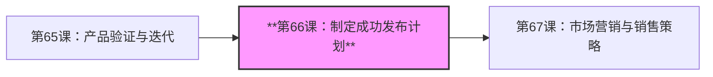
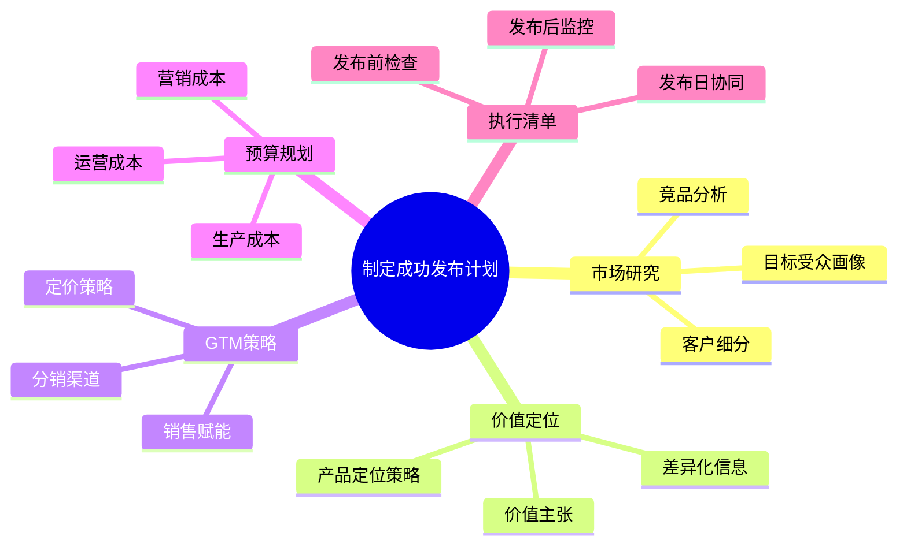
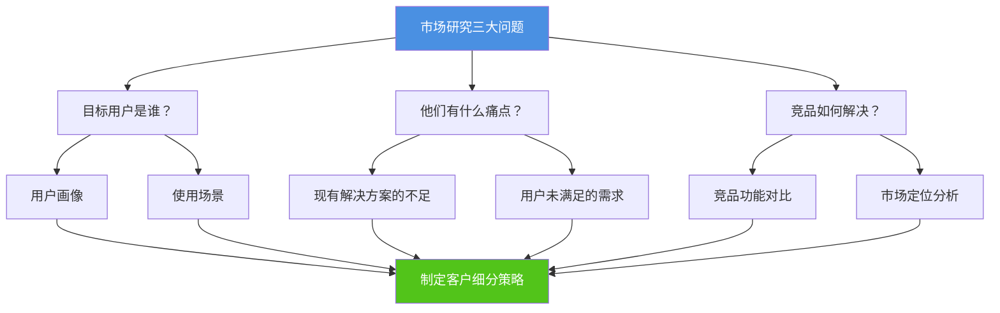
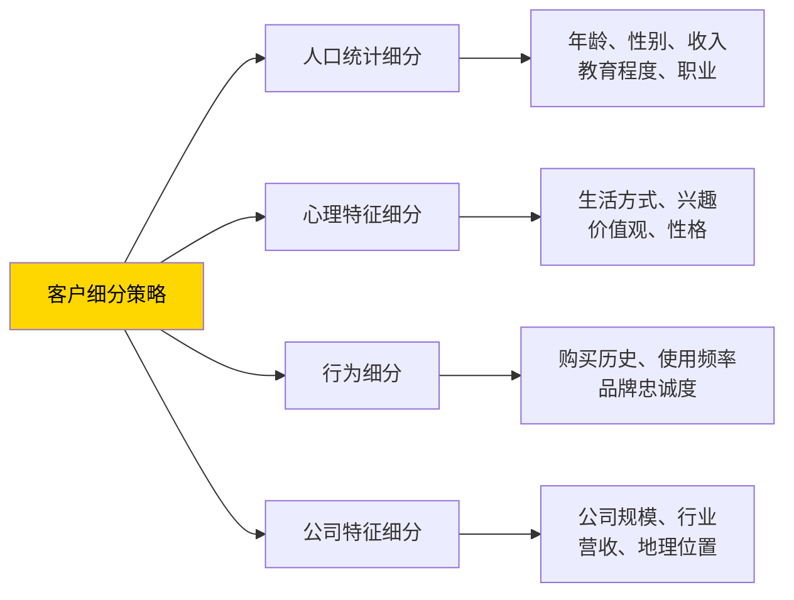
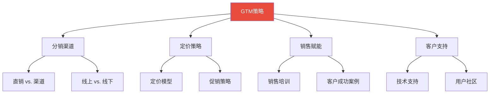
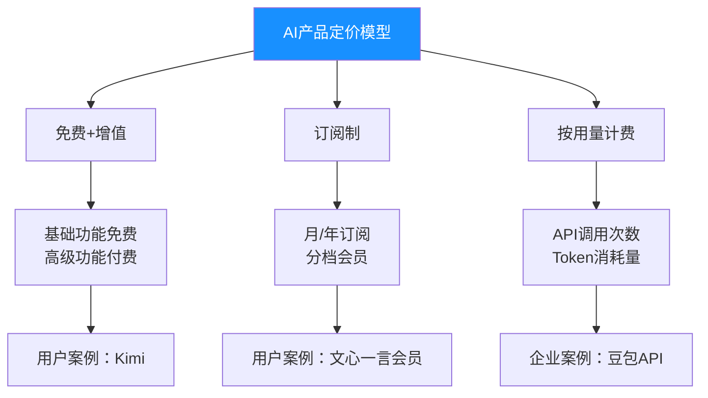
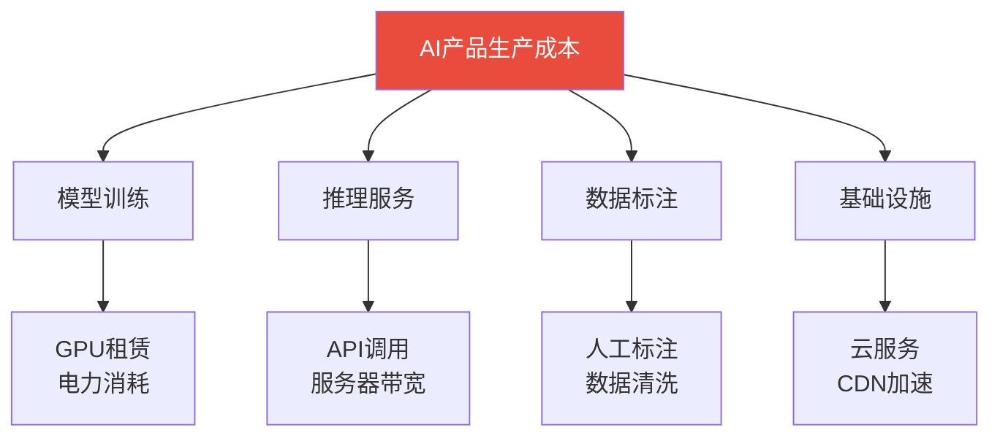
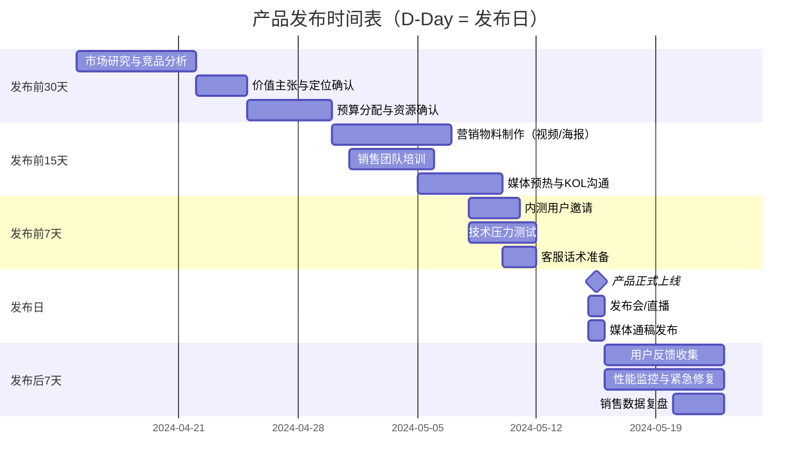
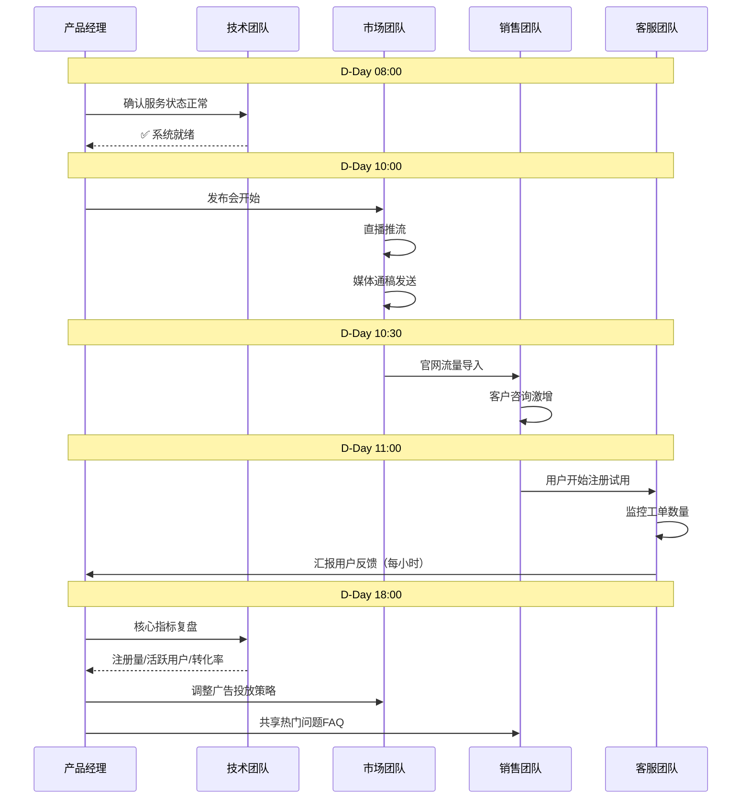
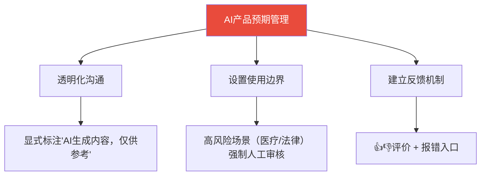

# 制定成功发布计划 | Crafting Launch Plan

> **TL;DR**: 产品发布计划是连接研发完成与市场成功的关键桥梁。在中国AI产品爆发的2024-2025年，豆包实现50万亿日Token调用、Kimi在23天内达成3000万MAU、通义千问下载量破亿——这些成功背后都有系统化的发布计划。本文解构发布计划的五大核心流程（市场研究→价值定位→渠道策略→预算分配→执行清单），结合中国AI产品实战案例，为你打造可落地的发布方法论。

---

## 目录 | Table of Contents

- [学习路径](#学习路径)
- [内容思维导图](#内容思维导图)
- [1. 引言：2024-2025中国AI产品发布战场](#1-引言2024-2025中国ai产品发布战场)
- [2. 市场研究：理解你的受众](#2-市场研究理解你的受众)
- [3. 客户细分与价值定位](#3-客户细分与价值定位)
- [4. GTM策略：渠道、定价与销售](#4-gtm策略渠道定价与销售)
- [5. 预算规划：营销、生产与运营成本](#5-预算规划营销生产与运营成本)
- [6. 发布执行清单](#6-发布执行清单)
- [7. AI产品发布的特殊性](#7-ai产品发布的特殊性)
- [核心术语表](#核心术语表)
- [关键要点](#关键要点)
- [自测题](#自测题)
- [实践任务](#实践任务)
- [下节预告](#下节预告)

---

## 学习路径

---

## 内容思维导图

---

## 1. 引言：2024-2025中国AI产品发布战场

2024年5月15日，字节跳动在火山引擎FORCE大会上正式发布豆包大模型。仅5个月后，豆包日Token调用量突破50万亿，成为中国使用最广泛的大模型之一。同年8月，Kimi智能助手在公测23天内MAU达到3000万，超越ChatGPT成为全球增长最快的AI应用。阿里通义千问App下载量突破1亿，文心一言MAU超过2亿——中国AI产品的"超级入口之战"已全面打响。

这些成功的发布背后，都有一个共同点：**系统化的发布计划**。

### 为什么发布计划对AI产品至关重要？

**传统软件 vs. AI产品的发布差异**：

| 维度 | 传统软件 | AI产品 |
|------|---------|--------|
| **功能确定性** | 功能固定，用户预期明确 | 概率性输出，需管理用户对"AI不完美"的预期 |
| **价值传递** | "这个软件能做什么" | "AI如何帮你更好地工作"（需教育市场） |
| **合规要求** | 标准软件合规 | 深度合成标识、算法备案（中国特色） |
| **运营复杂度** | 功能迭代即可 | 持续模型优化+用户反馈闭环 |

**发布计划的战略意义**：

1. **降低上线风险**：通过分阶段验证（内测→公测→正式发布），避免"一次性失败"
2. **最大化市场影响**：协调PR、市场、销售团队同步发力，形成声量矩阵
3. **财务可控**：预算规划确保资源不浪费，每一分钱都花在刀刃上
4. **团队对齐**：清晰的时间表和责任分工，避免部门间扯皮

> 💡 **洞察**：豆包发布时采用"火山引擎技术大会发布+抖音流量矩阵推广"的双轮驱动策略，既建立技术权威性，又快速触达C端用户，这是典型的系统化发布计划设计。

---

## 2. 市场研究：理解你的受众

### 2.1 市场研究的三大支柱

发布计划的第一步是**深度市场研究**，回答三个核心问题：

### 2.2 用户画像与场景挖掘

**案例：Kimi智能助手的用户画像设计**（据公开报道）

Kimi在发布前通过市场研究锁定三类核心用户：

| 用户类型 | 核心痛点 | Kimi解决方案 | 使用场景 |
|---------|---------|-------------|---------|
| **知识工作者** | 需要快速检索大量文档，ChatGPT单次对话字数限制4096 | 支持20万汉字长文本输入，直接上传PDF | 研究报告撰写、合同审查、文献综述 |
| **学生群体** | 网课笔记整理费时，复习效率低 | 一键生成视频字幕摘要，提取知识点 | 考试复习、论文写作、课程预习 |
| **职场新人** | 不熟悉工作流程，需要结构化指导 | 基于长文本理解生成SOP（标准作业流程） | 入职培训、流程学习、任务分解 |

**关键洞察**：Kimi没有试图"服务所有人"，而是聚焦"需要处理长文本"这一垂直场景，实现精准打击。

### 2.3 竞品分析框架

**中国AI对话产品竞品分析（2024年数据）**：

| 产品 | 核心差异化 | 定价策略 | 目标用户 | 市场地位 |
|------|----------|---------|---------|---------|
| **豆包** | 价格优势（比行业低99.3%），与抖音生态深度整合 | 免费为主，API调用0.0008元/千tokens（据火山引擎） | C端泛娱乐+B端企业客户 | 日Token调用量50万亿，市场第一 |
| **Kimi** | 超长文本（20万汉字），知识密集型场景 | 免费版+Pro版（68元/月，据月之暗面官网） | 知识工作者、学生 | 23天3000万MAU，增长最快 |
| **通义千问** | 阿里生态整合（钉钉、1688），电商场景优化 | 免费为主，企业版按需定价 | 阿里系企业、电商商家 | 下载量破亿 |
| **文心一言** | 百度搜索生态，内容生成能力强 | 免费版+会员版（59.9元/月，据百度官网） | 内容创作者、营销人员 | MAU超2亿 |

**竞品分析工具推荐**：
- 市场数据：易观千帆、艾瑞咨询（中国本土数据源）
- 功能对比：自建对比表格，逐一试用记录
- 定价情报：官网公开信息+销售咨询

---

## 3. 客户细分与价值定位

### 3.1 客户细分的四种策略

根据不同维度细分目标市场，定制差异化营销策略：

**案例：文心一言的分层用户策略**（基于公开信息推断）

| 细分维度 | 用户群体 | 核心诉求 | 产品策略 |
|---------|---------|---------|---------|
| **人口统计** | 18-35岁互联网用户 | 娱乐、社交内容生成 | 免费版，强调"文案生成""图片创作" |
| **心理特征** | 追求效率的职场人士 | 快速完成工作任务 | 会员版，提供"优先响应""更长输出" |
| **行为** | 高频使用用户（日均>10次对话） | 深度依赖，愿意付费 | 会员权益：无限对话次数、优先体验新功能 |
| **公司特征** | 500人以上企业 | 知识库搭建、客服自动化 | 企业版，私有化部署+定制训练 |

### 3.2 价值主张设计

**价值主张（Value Proposition）**：用一句话说清楚"为什么用户应该选你而不是竞品"。

**公式**：价值主张 = 目标用户 + 核心痛点 + 你的解决方案 + 差异化优势

**示例：**

- **豆包**："最懂你的AI助手，抖音生态无缝接入，让创作更简单"（目标：内容创作者；痛点：创作灵感枯竭；方案：AI生成；优势：抖音生态）
- **Kimi**："20万字长文本AI助手，一次对话处理整本书"（目标：知识工作者；痛点：文档检索效率低；方案：超长文本理解；优势：20万字）

### 3.3 产品定位策略

**四种经典定位策略**：

| 定位类型 | 定义 | 适用场景 | AI产品案例 |
|---------|------|---------|-----------|
| **高端定位** | 强调高品质、专业性、稀缺性 | 企业级客户，对价格不敏感 | OpenAI GPT-4（企业定制版） |
| **性价比定位** | 提供可靠服务，价格亲民 | 预算有限的中小企业、个人用户 | 豆包（价格比行业低99.3%） |
| **细分定位** | 专注特定细分市场 | 有明确垂直场景需求 | Kimi（长文本场景）、妙鸭相机（AI证件照） |
| **创新定位** | 强调技术领先、功能突破 | 早期adopter、技术爱好者 | DeepSeek（开源大模型，技术透明） |

> ⚠️ **注意**：定位不等于"给自己贴标签"，而是"在用户心智中占据独特位置"。豆包从未说"我是最便宜的AI"，但用户自然感知到"字节的AI很实惠"。

---

## 4. GTM策略：渠道、定价与销售

### 4.1 Go-to-Market策略概览

### 4.2 分销渠道选择

**直销 vs. 渠道销售**：

| 模式 | 优势 | 劣势 | 适用场景 |
|------|------|------|---------|
| **直销** | 利润率高，用户反馈直接 | 覆盖面窄，销售成本高 | 高价值企业客户（如定制化AI解决方案） |
| **渠道销售** | 快速扩大市场覆盖，借力经销商网络 | 利润率低，渠道管理复杂 | 标准化SaaS产品（如通用AI助手） |
| **混合模式** | 平衡覆盖面和利润率 | 需处理渠道冲突 | 大部分B2B AI产品 |

**中国AI产品的典型渠道策略**：

- **豆包**：直销（App Store/应用商店下载）+ 抖音生态导流（超级App流量入口）
- **通义千问**：阿里云市场（云服务集成销售）+ 钉钉内置（企业协同工具捆绑）
- **文心一言**：百度App内置 + 独立App下载 + 百度云API

### 4.3 定价策略设计

**AI产品定价的三种模型**：

**案例：Kimi的定价策略**（据月之暗面公开信息）

| 版本 | 定价 | 核心权益 | 目标用户 |
|------|------|---------|---------|
| **免费版** | 0元 | 每日10次长文本对话 | 尝鲜用户、轻度使用者 |
| **Pro版** | 68元/月 | 无限对话次数、优先响应、更长输出（4倍） | 知识工作者、重度用户 |
| **API** | 按调用计费 | 灵活集成到企业系统 | 开发者、企业客户 |

**定价心理学技巧**：
- **锚定效应**：先展示高价版本，再展示标准版，用户觉得"更划算"
- **尾数定价**：68元比70元更易接受（虽然差距小）
- **免费试用**：7天免费Pro会员，降低决策门槛

### 4.4 销售赋能：让销售团队成为产品专家

**销售赋能三件套**：

1. **产品培训**
   - 每周产品更新培训（30分钟）
   - 竞品对比话术库（"客户问ChatGPT和我们有什么区别，怎么回答？"）
   - 核心功能Demo视频（5分钟快速展示）

2. **客户成功案例库**
   - 案例格式：客户背景 → 面临挑战 → 使用方案 → 量化成果
   - 示例："某制造企业使用豆包客服助手后，人工客服工作量减少60%，客户满意度提升25%"

3. **销售工具包**
   - 产品对比表（Excel/PPT）
   - ROI计算器（"输入你的客服团队人数，自动计算节省成本"）
   - 试用申请流程（一键发送试用账号）

> 🎯 **实战提示**：销售团队最常问的三个问题是"我们和竞品的区别"、"客户为什么要买"、"价格能不能打折"。提前准备标准答案，避免销售"自由发挥"导致品牌信息不一致。

---

## 5. 预算规划：营销、生产与运营成本

### 5.1 预算规划的战略意义

预算规划不是"算账"，而是**资源配置的决策过程**：

- **确保资金可用**：发布日前确认营销费用到位，避免"钱没到位活动上线"
- **风险管控**：预留10-20%应急资金，应对突发情况（如竞品突然降价）
- **ROI优化**：根据历史数据，优先投入高回报渠道

### 5.2 营销成本：创造认知与需求

**营销成本构成**（AI产品典型分配）：

| 成本项 | 占比 | 具体内容 | 中国本土工具推荐 |
|--------|------|---------|----------------|
| **线上广告** | 40% | 抖音/快手信息流广告、百度SEM、微信朋友圈广告 | 巨量引擎、百度推广、腾讯广告 |
| **内容营销** | 25% | 公众号图文、视频号短视频、知乎/小红书种草 | 微信生态、抖音创作者平台 |
| **公关活动** | 20% | 产品发布会、媒体专访、行业峰会演讲 | 36氪、极客公园、虎嗅 |
| **KOL/KOC合作** | 10% | 科技博主测评、行业大V推荐 | 新榜、微播易（KOL投放平台） |
| **用户增长活动** | 5% | 新用户红包、老带新奖励、限时会员折扣 | 自研运营系统 |

**案例：豆包发布期的营销预算分配**（基于公开信息推断）

豆包在2024年5月15日发布时，采用"技术大会发布+抖音流量矩阵"双轮驱动：

- **技术大会（20%预算）**：火山引擎FORCE大会，邀请媒体、开发者、企业客户，建立"技术领先"形象
- **抖音流量推广（50%预算）**：信息流广告+创作者激励（鼓励用豆包生成内容），快速触达C端用户
- **内容种草（20%预算）**：科技媒体深度报道、行业KOL测评视频、知乎"如何评价豆包"话题运营
- **用户裂变（10%预算）**：邀请好友送会员、新用户注册送Token额度

### 5.3 生产成本：AI产品的特殊性

**AI产品的"生产成本"构成**：

**成本估算示例**（假设场景：中型AI对话产品发布前3个月）

| 成本项 | 具体内容 | 预估金额（万元） | 备注 |
|--------|---------|----------------|------|
| **模型训练** | 租用GPU集群（H800/A100）训练3个月 | 500-1000 | 可选阿里云PAI、火山引擎机器学习平台 |
| **数据标注** | 10万条对话数据人工标注 | 50-100 | 可外包给数据标注公司（如澜舟科技） |
| **推理服务** | 云服务器+负载均衡，支撑100万DAU | 200-300/月 | 阿里云/腾讯云按需计费 |
| **CDN加速** | 全国节点覆盖，确保响应速度 | 20-50/月 | 又拍云、七牛云 |
| **合计** | - | **770-1450** | **发布前3个月总成本** |

> ⚠️ **注意**：AI产品的成本结构与传统软件完全不同——传统软件研发完成后，边际成本接近0；AI产品每次用户调用都产生推理成本，需要在定价策略中考虑"用户越多，成本越高"的矛盾。

### 5.4 运营成本：持续服务的代价

**运营成本三大类**：

| 成本类别 | 具体项目 | 月度预算（万元） | 优化建议 |
|---------|---------|---------------|---------|
| **人力成本** | 产品经理、算法工程师、运营、客服 | 50-100 | 前期精简团队，核心岗位优先 |
| **技术运维** | 服务器、数据库、监控工具（如神策分析） | 10-30 | 使用云服务按需扩容，避免资源浪费 |
| **客户支持** | 在线客服系统（如美洽）、工单系统 | 5-10 | 初期可使用AI客服+人工审核 |

**成本控制策略**：

1. **云服务按需付费**：避免购买预留实例，前期流量不确定时使用按量计费
2. **开源工具优先**：项目管理用飞书/PingCode免费版，监控用开源Prometheus
3. **外包非核心业务**：客服、数据标注可外包，避免全职雇佣

---

## 6. 发布执行清单

### 6.1 发布计划的时间轴

### 6.2 发布前检查清单

> 📌 **必学**：这份清单是发布前的"安全阀"，每一项都对应真实的失败案例。请逐条核对，避免重蹈覆辙。

**市场与定位**
- [ ] 完成目标用户画像（至少3类细分用户）
- [ ] 价值主张一句话测试（让非团队成员复述，看是否理解）
- [ ] 竞品对比表完成（核心竞品≥3家）
- [ ] 定价策略确认（含促销活动规则）

**营销与传播**
- [ ] 发布会/直播脚本终稿（含应急问答）
- [ ] 媒体通稿发布渠道确认（至少10家媒体）
- [ ] 官网/落地页上线（PC+移动端适配）
- [ ] 社交媒体账号注册（微信公众号、抖音、小红书、知乎）
- [ ] KOL合作确认（签约+档期锁定）

**销售与支持**
- [ ] 销售培训完成（产品Demo、竞品话术、价格体系）
- [ ] 客户成功案例库（至少3个典型案例）
- [ ] 试用/Demo账号准备（100个预留账号）
- [ ] 客服系统上线（工单系统+知识库）
- [ ] 售后支持SLA明确（响应时间、解决时效）

**技术与合规**
- [ ] 产品功能全流程测试（核心路径无Bug）
- [ ] 性能压力测试（模拟10倍预期流量）
- [ ] 应急预案（服务器宕机/流量过载/安全事件）
- [ ] 深度合成内容标识（符合《人工智能生成合成内容标识办法》）
- [ ] 算法备案完成（如需，向网信办提交备案）
- [ ] 用户隐私协议更新（GDPR/个保法合规）

**预算与资源**
- [ ] 营销费用到账确认（广告预充值、KOL预付款）
- [ ] 云服务资源扩容（弹性伸缩策略配置）
- [ ] 应急预算预留（总预算的10-20%）

### 6.3 发布日协同流程

**发布日的"战斗序列"**：

**关键时间节点**：

| 时间 | 负责人 | 动作 | 风险应对 |
|------|--------|------|---------|
| **08:00** | 技术团队 | 服务最后巡检，确认监控告警正常 | 如有异常，立即汇报并修复 |
| **10:00** | 市场团队 | 发布会/直播开始，媒体通稿发送 | 准备应急话术应对突发提问 |
| **10:30** | 销售团队 | 开放注册/试用通道，接待咨询客户 | 预设常见问题FAQ快速回复 |
| **12:00** | 产品经理 | 第一次数据复盘（注册量、转化率） | 如低于预期，立即调整广告投放 |
| **18:00** | 全体 | 当日数据总结会议（30分钟） | 识别问题，制定明日优化计划 |

### 6.4 发布后监控指标

**核心指标看板**（建议使用神策分析/GrowingIO搭建）：

| 指标类别 | 具体指标 | 目标值（示例） | 监控频率 |
|---------|---------|--------------|---------|
| **用户获取** | 新注册用户数 | 10,000/天 | 每小时 |
| **激活** | 新用户完成首次对话比例 | ≥60% | 每小时 |
| **留存** | 次日留存率 | ≥40% | 每日 |
| **收入** | 付费转化率 | ≥3% | 每日 |
| **技术** | API响应时间（P99） | ≤2s | 实时 |
| **客服** | 工单响应时间 | ≤30分钟 | 实时 |

**异常处理机制**：

- **流量过载**：自动扩容+限流策略（如Nginx限流）
- **舆情危机**：24小时舆情监控（如识微商情），负面信息1小时内响应
- **功能Bug**：紧急修复流程（热修复or灰度回滚）

---

## 7. AI产品发布的特殊性

### 7.1 概率性输出的预期管理

**挑战**：AI不像传统软件"输入A必定输出B"，用户可能遇到"幻觉"（生成错误信息）。

**应对策略**：

**案例：豆包的免责声明设计**

豆包在对话界面底部固定显示："AI生成内容，可能存在错误，仅供参考"，符合《人工智能生成合成内容标识办法》要求。

### 7.2 合规要求：深度合成标识与算法备案

**中国AI产品发布的两大合规要点**：

| 合规项 | 法规依据 | 具体要求 | 违规后果 |
|--------|---------|---------|---------|
| **深度合成标识** | 《人工智能生成合成内容标识办法》（2025.9.1施行） | 显式标识+隐式标识（元数据嵌入） | 警告、下架、罚款 |
| **算法备案** | 《互联网信息服务算法推荐管理规定》（2022.3.1施行） | 提供服务后10个工作日内备案 | 责令整改、罚款 |

**操作指南**：

1. **深度合成标识**
   - 显式标识：在生成内容显著位置标注"AI生成"
   - 隐式标识：文件元数据嵌入提供者名称、内容标识编号

2. **算法备案**
   - 登录"互联网信息服务算法备案系统"（https://beian.cac.gov.cn）
   - 提交材料：算法基本原理、目的意图、主要运行机制、自评估报告
   - 预计审批周期：15-30个工作日

### 7.3 运营闭环：持续模型优化

**传统软件 vs. AI产品的迭代差异**：

| 维度 | 传统软件 | AI产品 |
|------|---------|--------|
| **迭代周期** | 月度/季度版本更新 | 模型持续训练（周级别） |
| **用户反馈** | Bug报告+功能建议 | 对话质量评分+Bad Case标注 |
| **成本结构** | 研发成本为主 | 研发+推理成本+标注成本 |

**AI产品的"飞轮效应"设计**：

---

## 核心术语表

| 中文术语 | 英文术语 | 定义 |
|---------|---------|------|
| **发布计划** | Launch Plan | 协调产品上线前后所有活动的系统化方案，包括市场研究、定位、渠道、预算、执行清单 |
| **目标市场** | Target Market | 产品计划服务的特定用户群体，基于市场细分确定 |
| **价值主张** | Value Proposition | 产品为用户解决的核心问题及差异化优势，通常用一句话表达 |
| **产品定位** | Product Positioning | 产品在用户心智中占据的独特位置，区别于竞品的认知差异 |
| **客户细分** | Customer Segmentation | 根据人口统计、心理特征、行为、公司特征等维度划分用户群体 |
| **GTM策略** | Go-to-Market Strategy | 产品进入市场的路径设计，包含分销渠道、定价、销售策略 |
| **分销渠道** | Distribution Channel | 产品到达用户的路径，如直销、渠道销售、线上/线下 |
| **销售赋能** | Sales Enablement | 为销售团队提供培训、工具、资料，提升销售效率 |
| **营销成本** | Marketing Cost | 用于创造产品认知和需求的费用，如广告、公关、内容营销 |
| **运营成本** | Operational Cost | 维持产品日常运营的持续费用，如人力、服务器、客服 |
| **发布清单** | Launch Checklist | 发布前后需完成的任务列表，确保无遗漏 |
| **深度合成标识** | Deep Synthesis Labeling | 中国法规要求，AI生成内容需标注"AI生成"（显式+隐式） |
| **算法备案** | Algorithm Filing | 中国法规要求，算法服务提供者向监管部门报备算法信息 |
| **竞品分析** | Competitive Analysis | 研究竞争对手的产品、定价、市场策略，识别差异化机会 |
| **客户成功案例** | Customer Success Story | 客户使用产品解决问题的真实故事，用于销售和营销 |

---

## 关键要点

**Must Know (核心必学):**
- 发布计划包含五大流程：市场研究 → 价值定位 → GTM策略 → 预算规划 → 执行清单
- 价值主张公式：目标用户 + 核心痛点 + 解决方案 + 差异化优势
- AI产品定价三种模型：免费+增值、订阅制、按用量计费
- 中国AI产品发布必须完成深度合成标识和算法备案（如适用）
- 发布日需建立技术-市场-销售-客服协同机制，实时监控核心指标

**Good to Know (拓展了解):**
- 豆包在2024年5月发布时采用"技术大会+抖音流量矩阵"双轮驱动策略
- Kimi通过聚焦"20万字长文本"垂直场景，实现快速差异化
- AI产品的"飞轮效应"：用户使用 → 数据生成 → 模型优化 → 体验提升 → 更多用户
- 营销预算分配参考：线上广告40%、内容营销25%、公关20%、KOL10%、用户增长5%
- 发布后7天是"黄金窗口期"，需每日复盘核心指标并快速迭代

---

## 自测题

1. **在制定发布计划时，价值主张的核心作用是什么？**

参考答案

**答案**：价值主张用一句话说清楚"为什么用户应该选你而不是竞品"，是发布计划的指北针。它回答了"目标用户是谁"、"他们有什么痛点"、"你的解决方案"、"差异化优势"四个核心问题，指导后续的定位、营销、定价策略。

**示例**：豆包的价值主张"最懂你的AI助手，抖音生态无缝接入，让创作更简单"明确了目标用户（内容创作者）、痛点（创作灵感枯竭）、方案（AI生成）、优势（抖音生态）。

---

2. **某AI对话产品计划采用"免费+增值"定价模型，请设计三档会员权益。**

参考答案

**参考设计**（借鉴Kimi、文心一言）：

| 版本 | 定价 | 核心权益 | 目标用户 |
|------|------|---------|---------|
| **免费版** | 0元 | 每日10次对话，基础功能 | 尝鲜用户、轻度使用者 |
| **标准会员** | 49元/月 | 无限对话、优先响应、更长输出 | 职场人士、学生 |
| **专业会员** | 199元/月 | 标准会员权益+API访问+团队协作+优先新功能 | 企业用户、开发者 |

**设计逻辑**：
- 免费版设置使用上限，激发付费意愿
- 标准会员覆盖核心痛点（无限对话），定价亲民
- 专业会员提供企业级功能，单价高但客户价值高

---

3. **发布日当天，产品出现严重Bug导致用户无法注册。作为产品经理，你应如何处理？**

参考答案

**应急处理流程**：

1. **立即评估影响范围**（5分钟内）
   - 技术团队确认Bug严重程度、影响用户量、预计修复时间

2. **决策：暂停推广 or 继续**（10分钟内）
   - 如修复时间≤30分钟：继续推广，技术团队紧急修复
   - 如修复时间>30分钟：暂停新增广告投放，避免流量浪费

3. **用户沟通**（15分钟内）
   - 官网挂公告："系统升级中，预计X分钟后恢复，给您带来不便敬请谅解"
   - 社交媒体同步发布
   - 客服准备统一话术应对咨询

4. **修复验证**（修复后）
   - 技术团队测试完成后，产品经理亲自验证核心流程
   - 确认无误后，恢复推广投放

5. **复盘与补偿**（当天晚上）
   - 团队复盘：为什么发布前测试没发现？如何避免再次发生？
   - 用户补偿：向受影响用户发送优惠券/会员补偿

**关键原则**：透明沟通 > 掩盖问题。用户能理解技术故障，但无法接受欺瞒。

---

## 实践任务

- [ ] **任务1：竞品分析练习**
  选择一个你感兴趣的AI产品（如豆包、Kimi、通义千问），完成竞品分析表：
  - 核心差异化是什么？
  - 目标用户是谁？
  - 定价策略如何？
  - 分销渠道有哪些？
  对比至少3家竞品，形成1页PPT总结

- [ ] **任务2：价值主张提炼**
  为你负责的产品（或假设场景）撰写价值主张（一句话），确保包含：
  - 目标用户
  - 核心痛点
  - 解决方案
  - 差异化优势

  示例格式："[目标用户]面临[痛点]，[产品名]通过[方案]提供[优势]"

- [ ] **任务3：发布清单定制**
  根据本文的发布清单模板，结合你的产品特点，定制一份"发布前30天倒计时清单"，至少包含：
  - 市场与定位（3项）
  - 营销与传播（5项）
  - 技术与合规（3项）
  - 预算与资源（2项）

---

## 下节预告

下一节**《市场营销与销售策略》**将深入探讨：

- **如何设计高转化的营销漏斗**（认知→兴趣→决策→行动）
- **中国AI产品的增长黑客策略**（抖音/小红书/知乎种草玩法）
- **B2B vs. B2C的销售打法差异**（企业采购流程 vs. 个人决策）
- **客户成功体系搭建**（让用户"用得好"才是真正的成功）

如果说发布计划是"起跑前的准备"，那么营销与销售策略就是"冲刺时的加速器"。我们将分享更多实战案例，助你打造从0到1的增长引擎。

---

**版权声明**：本文档基于Microsoft AI Product Manager Certificate课程内容，结合中国AI产品管理实践编写。引用数据均已注明来源（豆包、Kimi等产品信息来自公开报道和官方渠道）。文中提及的产品名称为相关公司商标，仅用于案例分析，不构成商业推广。

**更新日志**：
- 2026-01-30：初版发布，基于2024-2025年中国AI产品发布实践整理
- 数据截止日期：2026年1月
- 下次更新计划：根据监管政策变化和产品迭代情况，每季度更新一次
