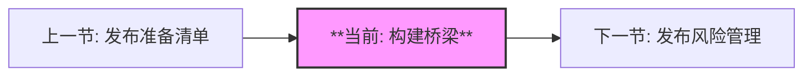
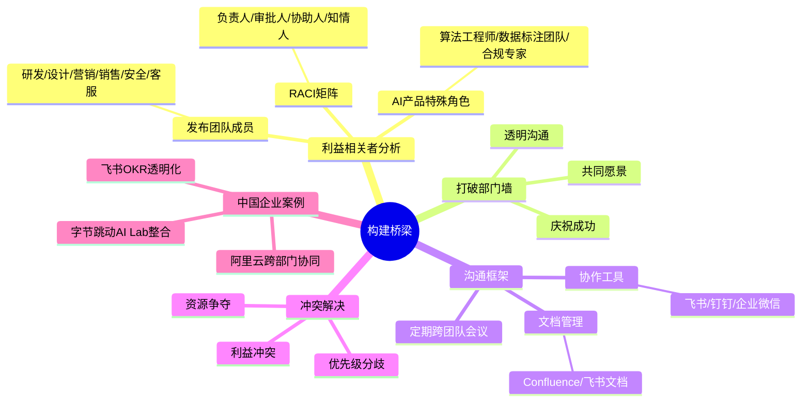
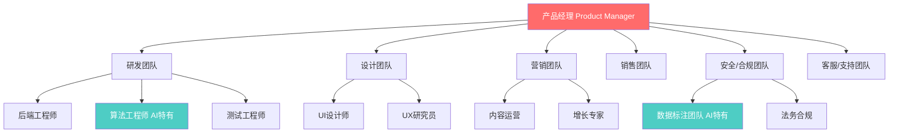
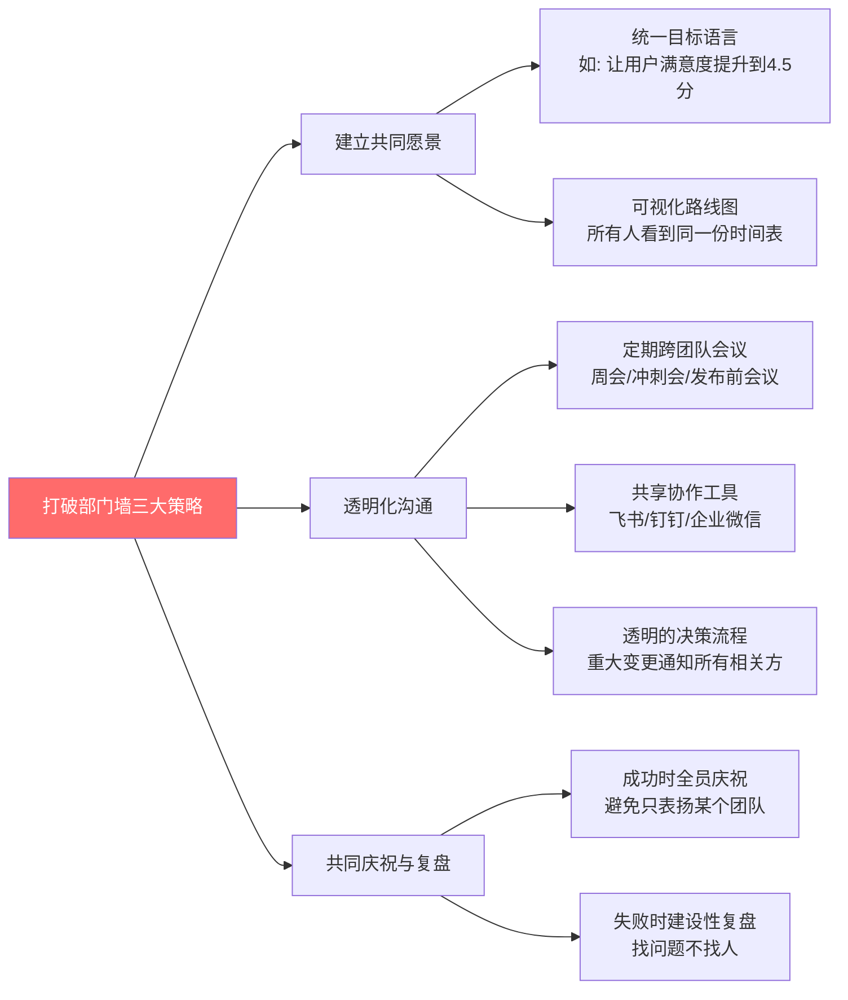
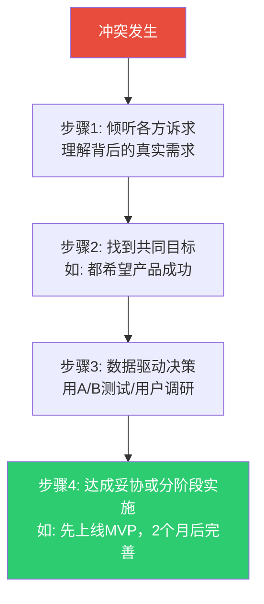

# 构建桥梁 | Building Bridges

> **TL;DR**: 产品发布从来不是单打独斗，而是一场精心编排的"交响乐"——研发、设计、营销、销售、安全、客服各司其职，PM是乐队指挥。本文聚焦跨团队协作的软技能：如何打破部门墙（Silos）、建立共同愿景、用RACI矩阵明确职责、通过飞书/钉钉等工具实现透明沟通。结合字节跳动AI Lab整合、阿里云跨部门协同等2025-2026真实案例，助你成为连接各方的"架桥者"，让产品发布从混乱走向协同。

---

## 目录 | Table of Contents

1. [为什么跨团队协作是产品发布的生命线](#1-为什么跨团队协作是产品发布的生命线)
2. [识别关键利益相关者 | 发布团队的黄金阵容](#2-识别关键利益相关者--发布团队的黄金阵容)
3. [打破部门墙：从"各自为战"到"统一战线"](#3-打破部门墙从各自为战到统一战线)
4. [沟通框架：RACI矩阵与协作工具](#4-沟通框架raci矩阵与协作工具)
5. [冲突解决：当利益相关者意见不一致时](#5-冲突解决当利益相关者意见不一致时)
6. [中国企业跨部门协作实战：字节、阿里案例解析](#6-中国企业跨部门协作实战字节阿里案例解析)
7. [核心术语表](#核心术语表)
8. [自测题](#自测题)
9. [实践练习](#实践练习)

---

## 学习路径 | Learning Path

---

## 内容思维导图 | Content Mind Map

---

## 1. 为什么跨团队协作是产品发布的生命线

想象你是一位AI对话产品的PM，准备发布新的"多轮情境理解"功能。研发团队刚完成模型训练，设计团队在赶UI适配，营销团队已经草拟推广文案，销售团队在客户演示中提前"预告"，而安全团队突然发现模型输出存在敏感信息泄露风险——如果这些团队各自为战，发布日当天可能是一场灾难。

**跨团队协作的本质**：将分散的专业能力整合成统一的执行力，确保所有人朝同一个目标前进。

### 1.1 产品发布是"交响乐"，不是"独奏"

每个团队都是乐器组：
- **研发**是弦乐组，奏出产品的核心旋律（功能实现）
- **设计**是木管组，增添细腻的情感层次（用户体验）
- **营销**是铜管组，营造气势磅礴的宣传氛围（市场声量）
- **销售**是打击乐，敲出成交的节奏（收入转化）
- **安全/合规**是指挥的耳朵，随时纠正走音（风险把控）

**PM是指挥**：不是演奏者，但需要理解每个乐器的特性，协调节奏，确保和谐共鸣。

### 1.2 代价：部门墙造成的产品灾难

**案例（虚构）**：某AI客服产品上线前一天，研发团队突然发现营销文案承诺的"7×24小时秒级响应"需要额外云资源，但预算已用完；销售团队此时才知道"方言识别"功能因数据不足被砍掉，已签约客户要求退款。

**根本原因**：缺乏透明沟通，各团队信息孤岛化。

**统计数据**：据McKinsey报告，跨部门协作不佳的企业，产品上市时间平均延迟30%，客户投诉率提升40%。

> 💡 **洞察**：跨团队协作不是"锦上添花"，而是"生死攸关"。在AI产品领域尤其如此——算法工程师、数据标注团队、法务合规、客服团队的紧密配合，直接决定产品能否安全、高质量上线。

---

## 2. 识别关键利益相关者 | 发布团队的黄金阵容

### 2.1 产品发布的核心团队架构

### 2.2 利益相关者分析矩阵

| 角色 | 核心职责 | 关注重点 | 常见痛点 | AI产品特殊考量 |
|------|---------|---------|---------|---------------|
| **研发团队** | 实现功能、保证稳定性 | 技术可行性、交付时间 | 需求频繁变更、技术债 | 模型训练周期长、算力资源争夺 |
| **设计团队** | 用户体验、界面美观 | 用户满意度、一致性 | 与研发理解不同步 | AI输出不确定性导致UI设计复杂 |
| **营销团队** | 市场推广、品牌声量 | 卖点提炼、竞品对比 | 技术细节难懂、无法转化话术 | 如何向用户解释AI能力边界 |
| **销售团队** | 成交转化、客户关系 | 产品价值、竞争优势 | Demo功能不稳定、客户期望管理 | 需要理解AI"概率性输出"以正确演示 |
| **安全/合规团队** | 风险防控、监管合规 | 数据安全、隐私保护 | 被视为"拖后腿"、沟通不足 | AI模型偏见检测、深度合成标识 |
| **客服团队** | 用户支持、问题反馈 | 产品稳定性、用户教育 | 上线前培训不足、故障手册缺失 | AI幻觉问题的应对话术 |
| **数据标注团队（AI特有）** | 训练数据质量 | 标注一致性、效率 | 需求变化导致重新标注 | 标注标准与产品目标对齐 |

### 2.3 RACI矩阵：明确谁做什么

**RACI**是一个职责分配框架：
- **R (Responsible)**: 负责执行
- **A (Accountable)**: 最终审批/负责人（只能有1个）
- **C (Consulted)**: 被咨询意见
- **I (Informed)**: 需要知情

**示例：AI对话产品"多轮理解"功能发布**

| 任务 | 产品经理 | 算法 | 后端 | 设计 | 营销 | 安全 | 客服 |
|------|---------|------|------|------|------|------|------|
| 功能需求定义 | A | C | C | C | C | C | I |
| 模型训练与调优 | C | R, A | I | I | I | C | I |
| 后端API开发 | C | C | R, A | I | I | C | I |
| UI/UX设计 | C | I | I | R, A | C | I | I |
| 营销文案撰写 | C | C | I | C | R, A | I | I |
| 安全性审计 | I | C | C | I | I | R, A | I |
| 客服培训材料 | C | I | I | I | I | I | R, A |
| 上线决策 | A | C | C | C | C | C | C |

**关键原则**：
1. 每个任务只有1个A（最终负责人），避免"三个和尚没水喝"
2. R可以有多个（如后端和算法联合负责模型部署）
3. C和I的区别：C需要提供意见并参与讨论，I只需接收信息

> 🎯 **实战提示**：在项目启动会上，用RACI矩阵逐条过一遍任务，当场澄清模糊职责。飞书/钉钉支持在线表格实时编辑，团队成员看到自己是"A"时会更有owner意识。

---

## 3. 打破部门墙：从"各自为战"到"统一战线"

### 3.1 部门墙的三大表现

**表现1：信息孤岛**
- 研发在内部群讨论技术方案，营销完全不知道
- 营销承诺的功能，研发从未被告知
- 客服收集的用户痛点，产品经理半年后才看到

**表现2：目标错位**
- 研发追求技术创新，营销要求"快速上线抢占市场"
- 设计强调用户体验，销售要求"直接展示卖点"
- 安全团队要求完善审计，业务团队嫌流程繁琐

**表现3：责任甩锅**
- 上线失败后，研发说"需求不明确"，产品说"技术能力不足"
- 客户投诉时，销售说"产品问题"，产品说"销售过度承诺"

### 3.2 打破部门墙的三大策略

**策略1：建立共同愿景**

**反面案例（虚构）**：某AI写作工具发布，研发团队目标是"模型准确率提升5%"，营销团队目标是"DAU增长10万"，客服团队目标是"投诉率下降"——三个团队各有目标，但不互相支持。

**正面案例**：统一愿景为"让用户用AI写作节省50%时间且满意度≥4.5分"，所有团队目标对齐：
- 研发优化响应速度（影响时间节省）
- 营销强调"快速生成"卖点（对齐时间节省）
- 客服培训"如何引导用户高效使用"（提升满意度）

**落地方法**：
1. 在项目启动会上，PM用一句话描述愿景，贴在飞书/钉钉群公告
2. 每次周会开头，重复这句话，强化记忆
3. OKR拆解时，确保所有KR都支撑这个愿景

**策略2：透明化沟通**

**定期跨团队会议节奏**：
- **周会**：各团队同步进度、暴露风险（30分钟）
- **冲刺评审会**（敏捷模式）：展示已完成功能，收集反馈（1小时）
- **发布前Go/No-Go会议**：所有团队投票决定是否上线（见下文详述）

**沟通工具选择**（中国本土化）：

| 工具 | 核心优势 | 适用场景 | 2026年用户数据 |
|------|---------|---------|---------------|
| **钉钉** | 7亿用户，2300万企业，生态整合强（审批/日历/视频会议） | 传统企业、跨组织协作 | 日活1.2亿，市占率32.7% |
| **企业微信** | 与微信互通，5亿日活，1200万企业连接 | 外部客户沟通、销售团队 | 日活5亿，市占率25.4% |
| **飞书** | 字节跳动出品，OKR透明化，文档协作强 | 互联网公司、敏捷团队 | 用户1200万，市占率18.9% |

**工具使用最佳实践**：
1. **所有项目沟通在一个群**：避免私聊导致信息丢失
2. **关键决策用@所有人**：确保知情范围
3. **会议纪要自动生成**：飞书/钉钉的AI会议纪要功能，自动整理待办事项
4. **文档统一管理**：Confluence或飞书文档，所有人查看最新版本

**策略3：共同庆祝与复盘**

**成功时的庆祝仪式**：
- 不要只表扬某个团队（如"研发团队辛苦了"），而是"整个发布团队的努力"
- 在公司周会上展示跨团队协作照片/视频
- 设立"协作之星"奖项，表彰跨部门沟通的典范

**失败时的建设性复盘**：
- 采用"5 Whys"法找根因，而非追责
- 问题记录进"经验库"（飞书文档/Confluence），下次发布前查阅
- 将复盘结论转化为流程改进（如增加安全审计节点）

### 3.3 真实场景：产品发布Go/No-Go会议

**时间点**：上线前48小时

**参会人员**：PM、研发负责人、设计负责人、营销负责人、安全负责人、客服负责人

**会议流程**：
1. **各团队汇报准备度**（每人2分钟）
   - 研发："功能已完成，剩余2个P2 Bug，计划上线前修复；已完成压力测试，QPS支持10万"
   - 设计："UI适配完成，无障碍测试通过，用户引导视频已录制"
   - 营销："推广文案已审核，KOL预热已启动，首日投放预算100万"
   - 安全："通过渗透测试，深度合成标识已添加，符合GB 45438-2025标准"
   - 客服："培训完成，FAQ文档已上传知识库，预计上线后咨询量增加30%"

2. **风险评估**（5分钟）
   - PM："当前最大风险是2个P2 Bug，如果修复失败是否可以接受带Bug上线？"
   - 研发："Bug影响5%用户，可通过灰度发布控制在1%"
   - 安全："建议灰度先5%，观察24小时"

3. **投票决策**（3分钟）
   - Go（按计划上线）/ No-Go（延期）/ Conditional Go（有条件上线，如先灰度5%）
   - 规则：如果安全团队投No-Go，必须延期（一票否决权）

4. **决策记录**（写入飞书文档，所有相关方可见）

> ⚠️ **注意**：Go/No-Go会议不是"走过场"，必须给每个团队真正的话语权。如果发现安全隐患，即使CEO施压也要坚持延期——这是PM的职业底线。

---

## 4. 沟通框架：RACI矩阵与协作工具

### 4.1 沟通清晰度的量化评估

**好的沟通**：接收者理解的内容 = 发送者想传达的内容

**实战案例（虚构）**：
- **模糊沟通**："这个功能要尽快上线"（什么是"尽快"？本周？下周？）
- **清晰沟通**："这个功能需要在3月15日前上线，因为客户合同约定3月20日演示，需要5天缓冲"

### 4.2 高效会议的七大原则

| 原则 | 具体做法 | 反面教材 |
|------|---------|---------|
| **1. 明确目标** | 会前发送议程："讨论发布时间表，决策是否延期" | "大家聊聊发布的事" |
| **2. 控制时长** | 30分钟周会，用倒计时器 | 开会2小时，一半时间跑题 |
| **3. 必要参与者** | 只邀请RACI中的A、R、C角色 | 拉上所有人"听听" |
| **4. 会前准备** | 提前发阅读材料："请看附件PRD第3版" | 开会时才分享文档，浪费时间 |
| **5. 记录待办** | AI会议纪要自动生成，分配责任人+截止日期 | 口头约定，事后无人跟进 |
| **6. 决策透明** | 会后发决策邮件/钉钉公告 | 只有参会者知道决策 |
| **7. 行动导向** | 每个议题必须有结论："决定延期到3月20日" | 讨论完没结论，下次再议 |

### 4.3 协作工具的深度应用（中国本土化）

**飞书OKR透明化**（字节跳动实践）

字节跳动10万员工通过飞书OKR平台实现目标透明化：
- **公司级OKR**：公开给全员，所有人看到公司战略
- **部门OKR**：自动对齐到公司OKR，可跨部门查看
- **个人OKR**：每个人知道自己的工作如何支撑公司目标

**效果**：研发看到营销的OKR是"提升品牌知名度"，主动优化产品演示功能；营销看到研发的OKR是"降低延迟10%"，文案强调"秒级响应"。

**钉钉审批流集成**（传统企业实践）

某制造业企业将产品发布审批流嵌入钉钉：
1. PM发起"发布申请"
2. 自动流转：研发负责人审批 → 安全负责人审批 → CTO终审
3. 每个节点有SLA（如研发负责人需24小时内审批）
4. 审批意见同步到项目群，透明可追溯

**企业微信客户连接**（销售团队实践）

销售团队通过企业微信与客户建立连接：
- 客户在微信端看到"XX公司-销售张三"
- 销售离职后，客户自动转给新销售，避免流失
- 产品发布时，销售通过企业微信群向客户推送更新

### 4.4 文档管理：Confluence的中国化替代

**Confluence核心价值**：
1. **知识库**：所有产品文档（PRD、技术方案、发布计划）集中管理
2. **版本控制**：修改历史可追溯，避免"不知道谁改了什么"
3. **权限管理**：敏感文档（如商务合同）只对相关人可见

**中国本土替代方案**：

| 功能 | Confluence | 飞书文档 | 钉钉文档 | 语雀（阿里） |
|------|-----------|---------|---------|-------------|
| 多人协作编辑 | ✅ | ✅ | ✅ | ✅ |
| 版本历史 | ✅ | ✅ | ✅ | ✅ |
| 权限管理 | ✅ | ✅ | ✅ | ✅ |
| 与会议工具集成 | ✅ | ✅（飞书会议） | ✅（钉钉视频会议） | ❌ |
| AI自动生成摘要 | ❌ | ✅ | ✅ | ❌ |
| 价格 | $5-10/人/月 | 免费/商业版¥49/人/月 | 免费/专业版¥9.9/人/月 | 免费/会员¥99/年 |

**选型建议**：
- **互联网公司/敏捷团队**：飞书文档（与飞书生态深度集成，AI能力强）
- **传统企业/大型组织**：钉钉文档（用户基数大，员工已熟悉）
- **技术团队/开源文化**：语雀（Markdown友好，技术文档体验好）

---

## 5. 冲突解决：当利益相关者意见不一致时

### 5.1 常见冲突场景

**场景1：资源争夺**
- **冲突**：研发团队希望2个月打磨功能，营销团队要求1个月上线抢占市场
- **本质**：短期市场机会 vs. 长期产品质量

**场景2：优先级分歧**
- **冲突**：产品经理要求先做AI功能创新，销售团队要求先修已知Bug（客户投诉多）
- **本质**：增长 vs. 稳定

**场景3：技术方案争议**
- **冲突**：算法团队建议用GPT-4.5（准确但慢），后端团队建议用轻量模型（快但准确度低）
- **本质**：性能 vs. 体验

### 5.2 冲突解决的四步法

**步骤1：倾听各方诉求，理解真实需求**

**对话示例1：研发 vs. 营销**
- **PM**："研发团队，你们为什么希望2个月？"
- **研发**："因为当前模型幻觉率8%，需要优化到5%才敢上线"
- **PM**："营销团队，你们为什么着急1个月上线？"
- **营销**："因为竞品下个月发布类似功能，晚了就失去先发优势"

**真实需求**：研发担心质量风险，营销担心市场机会。

**步骤2：找到共同目标**

**PM**："我们共同目标是什么？——让产品成功上线且用户满意。那能否找到方案，既控制风险，又抓住市场机会？"

**步骤3：数据驱动决策**

**PM**："我们调研一下竞品的幻觉率是多少？用户能接受的幻觉率是多少？"
- 数据显示：竞品幻觉率10%，用户可接受8%
- 结论：当前8%的幻觉率可以上线

**步骤4：达成妥协或分阶段实施**

**最终方案**：
1. **1个月后上线MVP版本**，幻觉率8%，灰度5%用户
2. **2个月后全量发布**，幻觉率优化到5%
3. **营销侧配合**：文案强调"Beta版本，欢迎反馈"，管理用户预期
4. **研发侧配合**：设置幻觉监控阈值，如果超过10%自动降级

### 5.3 冲突解决的沟通话术

| 场景 | ❌ 低效话术 | ✅ 高效话术 |
|------|------------|-----------|
| **拒绝不合理需求** | "这个做不了" | "理解你的需求，但当前资源有限。能否这样：先做A（核心功能），B（次要功能）排到下个迭代？" |
| **化解资源冲突** | "资源就这么多，你们自己协调" | "我们一起看数据：功能A影响10万用户，功能B影响1万用户。按影响面优先，先做A，可以吗？" |
| **推动决策** | "你们决定吧" | "我整理了三个方案：方案1成本最低但风险高，方案2成本高但稳妥，方案3折中。我倾向方案3，大家意见？" |
| **处理情绪化反对** | "你这是个人情绪" | "感受到你的担忧。能具体说说哪些地方让你不放心？我们逐个讨论" |

### 5.4 向上管理：当高层施压时

**场景**：CEO要求"必须在本月底上线"，但安全团队发现严重漏洞。

**PM的责任**：平衡业务压力与风险控制，向上传递真实信息。

**沟通策略**：
1. **量化风险**："如果本月上线，安全漏洞影响10%用户数据，可能导致监管处罚（参考《个人信息保护法》罚款上限5000万）"
2. **提供替代方案**："建议延期7天，完成安全修复；或者按计划上线，但仅对VIP用户开放（风险可控）"
3. **寻求支持**："需要您支持延期决策，我会向全公司说明原因，承担沟通成本"

**关键原则**：不隐瞒风险，不甩锅给高层，提供有决策依据的方案。

> ⚠️ **注意**：如果CEO坚持冒险上线且不听劝阻，PM应以邮件形式记录风险提示（保护自己），并在上线后密切监控、准备应急预案。

---

## 6. 中国企业跨部门协作实战：字节、阿里案例解析

### 6.1 字节跳动AI Lab整合：消除研产内耗

**背景（2025年真实案例）**：
字节跳动将集团级AI研究部门AI Lab整体并入大模型部门Seed，实现"研产一体化"。

**改革前的问题**：
- AI Lab专注前沿研究，Seed负责产品化，两个团队目标不一致
- AI Lab的论文成果难以转化为产品功能
- 资源分散，模型训练算力被两个团队争抢

**改革后的效果**：
- **扁平化架构**：研究员直接参与产品需求讨论，缩短"论文→产品"周期
- **目标对齐**：统一KPI为"豆包用户满意度+模型性能提升"，不再单独考核论文数量
- **资源集中**：算力预算统一管理，优先支持用户影响最大的方向

**启示**：
- 跨部门协作的最大障碍往往是**目标不一致**
- 组织架构调整是打破部门墙的"终极手段"，但成本高，需谨慎
- PM在无法调整架构时，可通过**OKR对齐**实现类似效果（如将研究团队的KR与产品团队的KR绑定）

### 6.2 阿里云跨部门协同：AI岗位占比80%的秘密

**背景（2026届校招数据）**：
阿里云、阿里国际、钉钉的AI岗位占比达80%，高德占比75%——这意味着几乎所有业务线都在深度整合AI能力。

**跨部门协作挑战**：
- **传统业务线**（如高德地图）需要AI团队提供"路线推荐算法"
- **AI团队**不了解地图业务，提供的通用模型不适配
- **产品经理**需要在两个团队之间"翻译"需求

**阿里的解决方案**：
1. **设立AI产品经理岗**：要求既懂业务（如地图导航），又懂AI（如强化学习），担任"桥梁"
2. **跨部门联合项目制**：AI团队成员短期"借调"到业务线，深入理解场景
3. **共享案例库**：钉钉建立"AI应用案例库"，记录各业务线的AI落地经验，供其他团队参考

**启示**：
- AI产品经理需要**"双语能力"**：对业务团队讲业务语言，对技术团队讲技术语言
- 短期"借调"是快速建立跨部门信任的有效方法
- 案例库可以避免"重复造轮子"

### 6.3 飞书OKR透明化：10万人协同的秘密

**字节跳动的OKR文化**：
- **全员可见**：任何员工可以查看CEO到实习生的OKR
- **自下而上对齐**：个人OKR不是领导分配，而是员工根据公司/部门OKR自主拆解
- **Context, Not Control**：管理者提供上下文（Context），而非事无巨细的控制（Control）

**实战案例（虚构，基于公开报道推演）**：
- **公司OKR**："豆包DAU达到2亿，用户满意度≥4.5分"
- **AI Lab OKR**："模型幻觉率降低到3%，支撑豆包核心场景"
- **营销团队OKR**："通过内容营销获取5000万新用户，重点人群为22-28岁职场新人"
- **个人OKR（某算法工程师）**："优化对话生成模型，使金融咨询场景幻觉率≤2%"

**透明化的价值**：
- 算法工程师看到营销团队重点人群是"职场新人"，主动优化"职场场景"（如简历优化、面试准备）的训练数据
- 营销团队看到AI Lab在攻克幻觉率，文案强调"可信赖的AI助手"，与技术优势对齐

**启示**：
- OKR透明化是打破部门墙的"信息基础设施"
- PM应主动将自己的OKR与所有相关团队分享，邀请他们对齐

---

## 核心术语表

| 中文术语 | 英文术语 | 定义 |
|---------|---------|------|
| **跨团队协作** | Cross-Functional Collaboration | 不同职能团队（研发/设计/营销等）为共同目标协同工作的过程 |
| **利益相关者** | Stakeholder | 对产品发布有影响或受影响的个人/团队，包括内部团队和外部客户 |
| **部门墙** | Silos | 部门间缺乏沟通、信息孤立、各自为战的现象 |
| **RACI矩阵** | RACI Matrix | 职责分配框架，明确谁负责执行(R)、谁审批(A)、谁被咨询(C)、谁需知情(I) |
| **共同愿景** | Shared Vision | 所有团队成员认同的统一目标，回答"我们为什么做这件事" |
| **向上管理** | Managing Up | 与上级领导有效沟通、影响决策、获取支持的技巧 |
| **Go/No-Go会议** | Go/No-Go Meeting | 产品上线前的关键决策会议，决定是否按计划发布 |
| **灰度发布** | Canary Release / Gradual Rollout | 将新功能先发布给小部分用户，验证稳定性后再全量发布 |
| **OKR对齐** | OKR Alignment | 将个人/团队的OKR（目标与关键结果）与公司战略目标对齐 |
| **研产一体化** | Research-Production Integration | 研究团队与产品团队深度协同，缩短技术成果到产品功能的转化周期 |
| **Context, Not Control** | Context, Not Control | 管理理念：提供上下文信息让团队自主决策，而非事无巨细控制 |
| **5 Whys法** | 5 Whys Method | 连续问5次"为什么"，找到问题根本原因的分析方法 |
| **AI幻觉监控** | Hallucination Monitoring | 实时监测AI生成内容的准确性，识别虚假信息的机制 |

---

## 自测题

1. **在RACI矩阵中，某任务的"A"角色代表什么？该角色可以有几个人？**

参考答案

**答案**：
- **A (Accountable)** 代表"最终负责人"或"审批人"，对任务结果承担最终责任
- **只能有1个人**：这是RACI的核心原则，避免"三个和尚没水喝"——如果有多个A，责任会被稀释，出问题时无人担责

**延伸**：如果团队初期设置了多个A，PM应立即澄清："我们需要明确一个最终决策者。研发和算法都参与模型部署，但谁来最终拍板是否上线？"

---

2. **某AI客服产品发布前，研发团队希望延期1个月优化模型，营销团队要求按计划上线抢占市场。作为PM，你会如何解决这个冲突？（请列出至少3个步骤）**

参考答案

**参考步骤**：

**步骤1：倾听各方真实诉求**
- 询问研发："为什么需要1个月？当前版本有什么具体风险？"（如幻觉率过高）
- 询问营销："为什么必须现在上线？晚1个月会损失什么？"（如竞品抢先）

**步骤2：量化风险与机会**
- 调研数据：竞品的幻觉率是多少？用户可接受阈值是多少？
- 计算成本：延期1个月损失多少潜在用户？当前版本上线风险有多大？

**步骤3：提出妥协方案**
- 方案A：灰度发布，先给5%用户，观察1周后决定是否全量
- 方案B：按计划上线，但营销侧配合管理预期（如标注"Beta版"）
- 方案C：延期2周（而非1个月），研发重点优化高频场景，降低幻觉率到可接受范围

**步骤4：寻求共识**
- 组织Go/No-Go会议，让研发和营销投票选择方案
- 如果无法达成一致，PM基于数据做最终决策，并向双方说明理由

---

3. **字节跳动将AI Lab整体并入Seed部门，这体现了打破部门墙的哪个策略？为什么这个调整能提升跨部门协作效率？**

参考答案

**答案**：体现了**"建立共同愿景"**和**"组织架构调整"**策略。

**原因分析**：
1. **改革前的问题**：
   - AI Lab目标是"发论文、做前沿研究"
   - Seed目标是"豆包产品体验+用户满意度"
   - 两个团队目标不一致，导致AI Lab的研究成果难以转化为产品功能

2. **改革后的效果**：
   - **统一目标**：整合后的团队目标统一为"提升豆包产品能力"
   - **缩短链条**：研究员直接参与产品需求讨论，减少"需求→研究→产品化"的沟通成本
   - **资源集中**：算力预算统一管理，避免两个团队争抢资源

**延伸启示**：
- PM在无法调整组织架构时，可通过**OKR对齐**实现类似效果（如将研究团队的KR与产品KR绑定）
- 跨部门协作的核心是**目标一致**，而非简单地"多开会"

---

4. **判断题：在Go/No-Go会议中，如果安全团队投"No-Go"（不建议上线），但CEO坚持上线，PM应服从CEO决定。（对/错，并说明理由）**

参考答案

**答案：错**

**理由**：
1. **安全风险的特殊性**：安全问题可能导致用户数据泄露、监管处罚、品牌声誉损害，后果远超延期上线的损失
2. **PM的职业责任**：PM有责任向CEO传递真实风险信息，而非盲目服从
3. **正确做法**：
   - 量化风险："如果上线，安全漏洞可能影响X%用户，违反《个人信息保护法》，罚款上限5000万"
   - 提供替代方案："建议延期Y天修复，或灰度发布降低风险"
   - 记录决策：如果CEO坚持冒险上线，PM应以邮件形式记录风险提示（保护自己和团队）

**底线**：如果CEO不听劝阻且要求违反法律法规（如不添加深度合成标识），PM应拒绝执行并考虑上报更高层或离职。

---

## 实践练习

### 练习1：为AI产品发布创建RACI矩阵

**场景**：你是某AI写作工具的PM，准备发布"长文生成"功能（可一键生成5000字报告）。请为以下7个任务分配RACI角色。

**团队成员**：
- 你（产品经理）
- 算法工程师（负责模型）
- 后端工程师（负责API）
- 前端工程师（负责UI）
- 营销专员
- 安全合规专家
- 客服主管

**任务列表**：
1. 功能需求定义（如生成逻辑、字数控制）
2. 模型训练与调优（长文生成质量）
3. 后端API开发（接口设计、性能优化）
4. 前端UI设计（生成按钮、进度条、结果展示）
5. 营销文案撰写（宣传"5000字一键生成"卖点）
6. 深度合成标识添加（符合GB 45438-2025）
7. 客服FAQ准备（如"生成时间多久""如何修改生成内容"）

**要求**：
- 每个任务指定1个A（最终负责人）
- 可以有多个R（执行者）
- 标注谁需要被咨询(C)、谁需要知情(I)

**参考答案框架**（展开details查看）：

参考答案

| 任务 | PM | 算法 | 后端 | 前端 | 营销 | 安全 | 客服 |
|------|---|------|------|------|------|------|------|
| 1. 功能需求定义 | **A** | C | C | C | C | C | I |
| 2. 模型训练与调优 | C | **R, A** | I | I | I | C | I |
| 3. 后端API开发 | C | C | **R, A** | C | I | C | I |
| 4. 前端UI设计 | C | I | C | **R, A** | C | I | I |
| 5. 营销文案撰写 | C | C | I | I | **R, A** | I | I |
| 6. 深度合成标识 | I | C | C | C | I | **R, A** | I |
| 7. 客服FAQ准备 | C | I | I | I | I | I | **R, A** |

**关键决策说明**：
- 任务1：PM是A，因为需求定义是PM的核心职责
- 任务2：算法工程师是R和A，因为模型质量由他们负责
- 任务6：安全合规专家是A，因为标识不合规会导致监管处罚，必须由专业人员把关

---

### 练习2：设计一场高效的跨团队周会

**场景**：你负责的AI客服产品计划在4周后上线，需要每周召集研发、设计、营销、安全团队开周会同步进度。

**要求**：
1. 设计会议议程（30分钟，包含几个环节？每个环节几分钟？）
2. 会前需要准备什么材料？
3. 如何确保会议有结论、不跑题？
4. 会后如何跟进待办事项？

**参考答案框架**：

参考答案

**会议议程（30分钟）**：

1. **重申愿景（2分钟）**
   - PM开场："我们的目标是4周后上线AI客服，让客户咨询效率提升50%，满意度≥4.5分"

2. **各团队进度同步（15分钟，每团队3分钟）**
   - 研发："模型准确率达90%，完成度70%，风险：训练数据不足"
   - 设计："UI已完成，正在做可用性测试"
   - 营销："推广文案草稿已完成，等待产品确认卖点"
   - 安全："完成初步审计，发现1个中危漏洞，需2周修复"

3. **风险暴露与讨论（8分钟）**
   - PM："当前最大风险是安全漏洞和训练数据不足。安全团队，漏洞能否1周修复？研发团队，数据不足影响有多大？"
   - 各团队回答，PM记录解决方案

4. **待办事项分配（3分钟）**
   - PM："本周待办：研发补充500条训练数据，安全优先修复漏洞，营销等产品确认卖点后修改文案。责任人和截止日期已记录在飞书文档"

5. **下周预告（2分钟）**
   - PM："下周我们将进行首次内测，请各团队准备演示材料"

**会前准备**：
- PM提前24小时发送飞书日历邀请，附上议程和上周会议纪要
- 各团队提前更新进度到共享文档（飞书多维表格）

**确保会议有结论**：
- 每个风险必须有"解决方案+责任人+截止日期"
- 如果讨论超时，PM："这个问题我们会后单独讨论，先继续下一项"

**会后跟进**：
- 飞书AI会议纪要自动生成待办清单
- PM在项目群@责任人："请确认本周待办，截止日期X月X日"
- 下周会议开场先检查上周待办完成情况

---

### 练习3：化解跨团队冲突

**场景**：你的AI推荐系统准备上线，但遇到以下冲突：

**冲突内容**：
- **算法团队**："新模型点击率提升15%，但计算成本增加50%，需要申请更多云资源预算"
- **运营团队**："当前预算已用完，无法追加。能否用旧模型？"
- **营销团队**："我们已经宣传'智能推荐2.0'，承诺推荐更准确，不能用旧模型"

**要求**：
1. 分析冲突的本质（各方真实诉求是什么？）
2. 提出至少2个可能的解决方案
3. 设计一场冲突解决会议（谁参加？议程是什么？）

**参考答案框架**：

参考答案

**1. 冲突本质分析**：

| 团队 | 表面诉求 | 真实诉求 | 底层担忧 |
|------|---------|---------|---------|
| 算法 | 申请更多预算 | 上线高质量模型，体现技术价值 | 如果用旧模型，用户体验差会被归咎于算法团队 |
| 运营 | 拒绝追加预算 | 控制成本，完成年度预算目标 | 预算超支会影响KPI考核 |
| 营销 | 必须用新模型 | 兑现对用户的承诺，避免虚假宣传 | 如果用旧模型，用户投诉会影响品牌 |

**核心矛盾**：成本控制 vs. 产品质量 vs. 市场承诺

**2. 可能的解决方案**：

**方案A：灰度发布（推荐）**
- **具体做法**：新模型仅对20%用户开放（控制成本），旧模型服务80%用户
- **各方收益**：
  - 算法：新模型上线，技术价值得到体现
  - 运营：成本增加仅10%（20%×50%），在可控范围内
  - 营销：可宣传"部分用户体验智能推荐2.0"，逐步扩大
- **风险**：20%和80%用户体验差异可能引发投诉

**方案B：申请临时预算**
- **具体做法**：PM向CEO申请临时追加预算（如从营销预算调拨）
- **各方收益**：
  - 算法：全量上线新模型
  - 运营：不占用运营预算
  - 营销：兑现承诺
- **风险**：临时预算可能不被批准

**方案C：优化算法降低成本**
- **具体做法**：算法团队用2周时间优化模型推理效率，降低计算成本
- **各方收益**：
  - 算法：技术优化，提升工程能力
  - 运营：成本可控
  - 营销：延期2周，但最终兑现承诺
- **风险**：延期可能错过市场窗口

**3. 冲突解决会议设计**：

**参会人员**：PM（主持）、算法负责人、运营负责人、营销负责人

**议程（45分钟）**：
1. **PM开场（5分钟）**："我们的共同目标是让推荐系统成功上线。今天讨论如何平衡成本、质量、市场承诺"
2. **各方陈述诉求（15分钟，每人5分钟）**
3. **PM提出3个方案（10分钟）**：讲解方案A、B、C的利弊
4. **讨论与投票（10分钟）**：各团队投票选择方案
5. **达成共识与行动计划（5分钟）**：PM记录决策，分配后续任务

**会后跟进**：
- 将决策写入飞书文档，抄送所有相关方
- 如果选择方案A（灰度发布），PM立即协调算法和运营制定灰度方案

---

**版权声明**：本文档基于Microsoft产品管理课程内容，结合中国AI产品实践编写。文中提及的企业名称（字节跳动、阿里巴巴等）及产品（飞书、钉钉、企业微信）仅用于案例分析，不构成商业推广。数据来源已在文中注明。

---

**下一节预告**：在构建起跨团队协作的桥梁后，我们将学习如何识别和管理产品发布的潜在风险——从技术故障、安全漏洞到市场变化，全方位的风险应对策略等你探索。