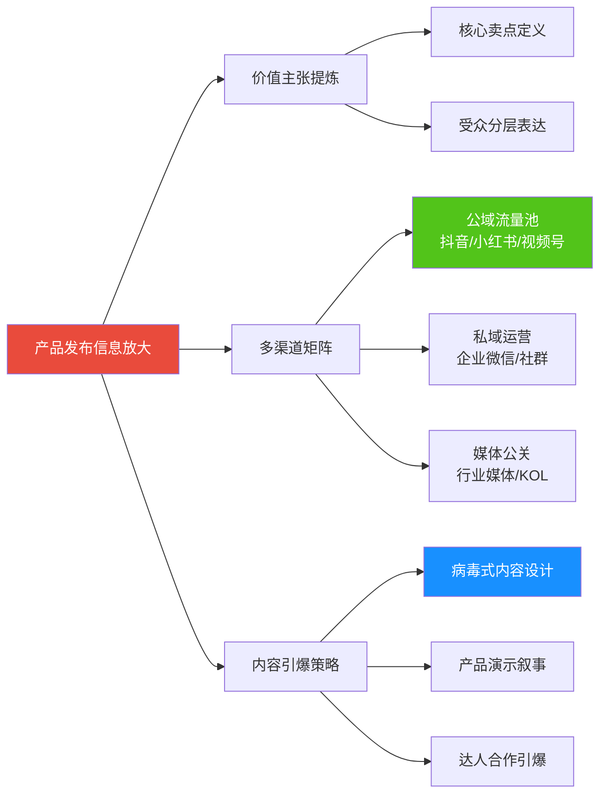
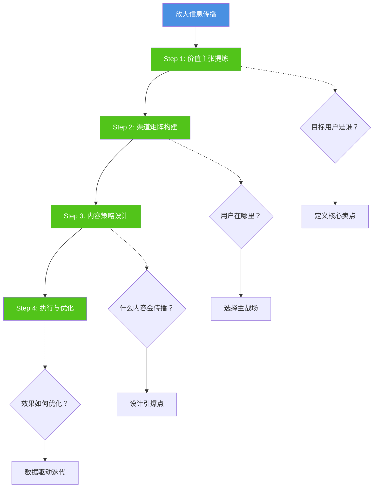
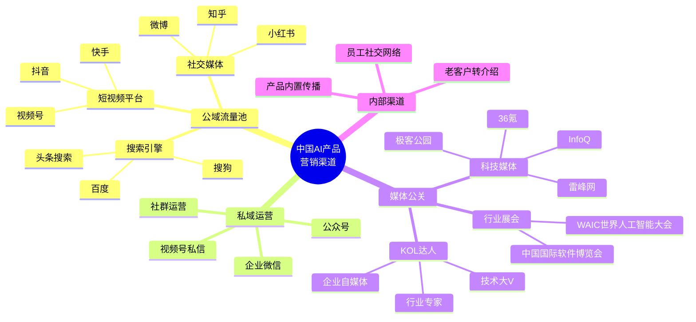
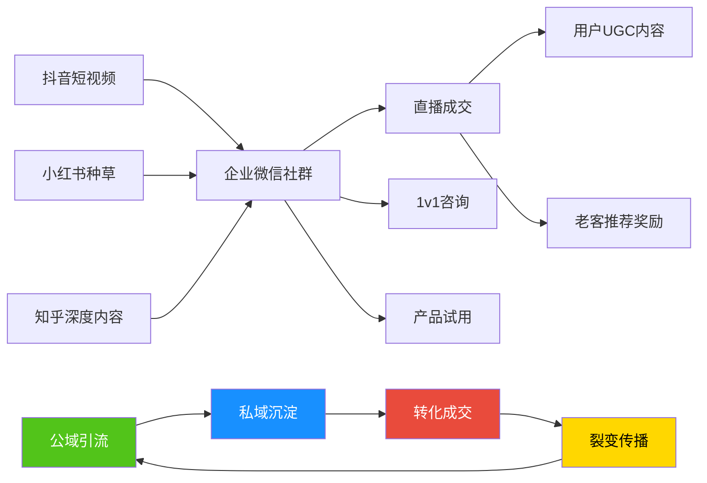
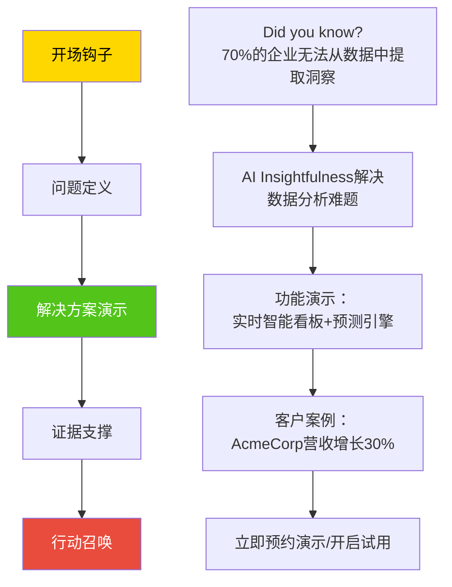
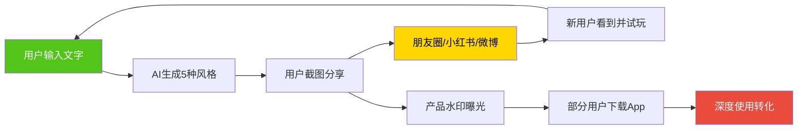

# 放大信息传播 | Amplifying Message

> **TL;DR**: 在产品发布的竞技场上，好产品需要好声音。本文系统拆解信息放大的三大支柱：价值主张提炼（Value Proposition Crafting）、多渠道矩阵（Multi-Channel Matrix）、内容引爆策略（Content Amplification），结合豆包、腾讯元宝等2026中国AI产品的实战案例，揭示如何在碎片化媒体环境中精准触达目标用户。你将掌握从战略定位到执行落地的完整方法论，学会在抖音、小红书、视频号等中国本土渠道设计病毒式传播路径，用最小预算撬动最大声量。

---

## 目录

- [引言：2026中国AI产品发布的"声量战"](#引言2026中国ai产品发布的声量战)
- [价值主张：让产品说人话](#价值主张让产品说人话)
  - [价值主张三要素](#价值主张三要素)
  - [针对不同决策者的定制化表达](#针对不同决策者的定制化表达)
  - [避坑指南：常见价值主张误区](#避坑指南常见价值主张误区)
- [多渠道矩阵：在正确的地方说正确的话](#多渠道矩阵在正确的地方说正确的话)
  - [中国AI产品营销渠道全景](#中国ai产品营销渠道全景)
  - [平台选择决策框架](#平台选择决策框架)
  - [内外部渠道协同策略](#内外部渠道协同策略)
- [内容引爆：从零到病毒式传播](#内容引爆从零到病毒式传播)
  - [社交媒体内容设计法则](#社交媒体内容设计法则)
  - [产品演示：从功能介绍到故事讲述](#产品演示从功能介绍到故事讲述)
  - [KOL与达人合作策略](#kol与达人合作策略)
- [实战案例：豆包的低成本高增长模式](#实战案例豆包的低成本高增长模式)
- [核心术语表](#核心术语表)
- [自测题](#自测题)
- [实践练习](#实践练习)

---

## 引言：2026中国AI产品发布的"声量战"

想象你站在一个拥挤的房间里，所有人都在同时说话，如何让目标用户听到你的声音？这就是2026年AI产品发布面临的真实挑战。

截至2025年8月，中国已有538款生成式AI产品完成备案，用户规模超5.15亿，渗透率超36%。在这场AI产品"百团大战"中，信息放大能力成为决胜关键。

### 2026信息放大的三大变化

**从流量采买到生态共建**

传统B2B营销依赖LinkedIn广告、行业媒体投放，但2026年中国市场呈现独特格局：

- **私域流量为王**：企业微信、社群运营成为核心阵地
- **短视频原生化**：抖音、视频号成为B2B产品触达决策者的主流渠道
- **AI驱动内容生产**：多模态内容生成引擎效率是纯人工的6-12倍（据2026中国营销智能生态报告）

**从单一渠道到矩阵作战**

豆包DAU突破1亿，却是字节历史上推广费最少的破亿产品。秘诀？**全渠道协同+低成本引爆**：

- 抖音生态导流（含极速版月活10.01亿）
- 三宫格P图玩法登上微博热搜，每天带来百万级自然下载
- 2026年春晚AI云独家合作（据澎湃新闻2026年1月报道）

**从品牌曝光到转化闭环**

AI产品营销已从"广而告之"转向"精准转化"：

- **GEO（生成式引擎优化）**：在豆包/文心/千问等AI平台优化品牌曝光
- **社交电商转化**：小红书种草→视频号直播→企业微信成交
- **数据驱动迭代**：实时监控转化漏斗，A/B测试内容策略

### 学习路径

---

## 价值主张：让产品说人话

### 价值主张三要素

价值主张（Value Proposition）是产品存在的理由，回答三个核心问题：

1. **这个产品做什么？**（What）
2. **谁会从中受益？**（Who）
3. **为什么比其他选择更好？**（Why）

**优秀价值主张示例：Microsoft Azure**

> "用可扩展的计算资源、强大的安全功能和与Microsoft产品的无缝集成，赋能您的业务。"

**拆解其高明之处**：

| 要素 | 表达方式 | 触达的痛点 |
|------|----------|------------|
| **可扩展** | "适应各种业务规模和需求" | IT经理担心系统扩展成本 |
| **安全功能** | "企业数据保护" | 决策者关注数据安全合规 |
| **无缝集成** | "已有Microsoft工具生态" | 降低迁移成本和学习曲线 |

**中国AI产品价值主张对比**（据公开资料）：

| 产品 | 价值主张 | 定位策略 |
|------|----------|----------|
| **豆包** | "你的AI智能助手，随时随地高效工作" | 强调便捷性+全场景覆盖 |
| **腾讯元宝** | "你的全能AI助手" | 强调综合能力+腾讯生态 |
| **文心一言** | "更懂中文的AI助手" | 强调本土化优势 |

### 针对不同决策者的定制化表达

B2B产品采购涉及多层决策者，价值主张需分层表达：

**场景：推广AI项目管理工具**

| 决策角色 | 关注点 | 价值主张定制 |
|----------|--------|--------------|
| **CEO/业务负责人** | ROI、战略对齐 | "提升30%项目交付速度，直接转化为营收增长" |
| **IT经理** | 技术可行性、安全 | "与现有系统无缝集成，符合等保2.0安全标准" |
| **项目经理（使用者）** | 易用性、功能 | "直观任务看板+实时预警，不再错过关键里程碑" |

**实战技巧**：

1. **CEO层沟通**：用财务语言（降本增效、市场份额）
2. **中层管理者**：用业务场景（解决XX痛点、优化XX流程）
3. **一线用户**：用体验语言（简单易用、节省时间）

### 避坑指南：常见价值主张误区

**❌ 误区1：堆砌技术术语**

> "基于Transformer架构的大语言模型，采用强化学习+人类反馈微调..."

**✅ 改进版**：

> "像真人一样理解你的需求，生成高质量内容"

---

**❌ 误区2：只谈功能不谈价值**

> "我们的CRM支持自定义字段、自动化工作流、API集成..."

**✅ 改进版**：

> "用AI预测客户行为，让销售团队提前发现高价值商机"

---

**❌ 误区3：泛化表达，缺乏差异化**

> "一款强大的企业协作工具"

**✅ 改进版**：

> "远程团队专用协作平台，让跨时区沟通像面对面一样高效"（明确目标人群+独特场景）

---

> 💡 **洞察**：价值主张不是写给所有人看的广告语，而是写给"最痛的那群人"的解决方案说明书。

---

## 多渠道矩阵：在正确的地方说正确的话

### 中国AI产品营销渠道全景

2026年中国B2B营销渠道呈现"公域+私域+媒体"三位一体格局：

### 平台选择决策框架

**Step 1: 目标受众定位**

| 目标用户 | 主战场平台 | 次要平台 | 触达策略 |
|----------|------------|----------|----------|
| **技术开发者** | 掘金、CSDN、知乎 | 微信公众号、视频号 | 技术深度内容+开源社区运营 |
| **产品经理** | 人人都是产品经理、知乎、小红书 | 视频号、抖音 | 实战案例+工具测评 |
| **企业决策者** | 脉脉、36氪、视频号 | 抖音、知乎 | 行业洞察+ROI案例 |
| **普通消费者** | 抖音、小红书、视频号 | 微博、快手 | 场景化体验+明星/达人背书 |

**Step 2: 产品类型匹配**

| 产品特点 | 优先渠道 | 内容形式 |
|----------|----------|----------|
| **高度视觉化**（如AI绘画） | 小红书、抖音 | 对比图、创作过程视频 |
| **技术复杂**（如企业级AI平台） | 知乎、掘金、线下展会 | 技术白皮书、架构解析 |
| **工具型产品**（如办公AI助手） | 视频号、抖音、B站 | 操作教程、效率对比实验 |
| **轻量级应用**（如AI聊天工具） | 抖音、小红书、微博 | 趣味互动、热点跟进 |

**Step 3: 预算资源配置**

**有限预算方案（<50万）**：

- **核心**：内容营销（知乎专栏/公众号深度文章）+ 社群运营（企业微信）
- **引爆点**：小红书达人种草（小微达人性价比高）+ 抖音短视频测评
- **公关**：科技媒体投稿（36氪、极客公园接受优质投稿）

**中等预算方案（50-200万）**：

- **核心**：上述方案 + 信息流广告（抖音巨量引擎、腾讯广告）
- **放大**：腰部KOL合作（10-50万粉丝）+ 行业展会参展
- **公关**：专业公关公司服务 + 行业峰会演讲

**充足预算方案（>200万）**：

- **核心**：全渠道覆盖（抖音/快手/视频号/小红书）
- **放大**：头部KOL代言 + 综艺/晚会冠名（如豆包×春晚）
- **公关**：品牌IP打造 + 自建行业峰会

### 内外部渠道协同策略

**外部引流 → 私域沉淀 → 转化成交 → 裂变传播**

**实战案例：Alpha Software Solutions（虚构）**

某B2B协作工具发布策略：

1. **阶段一：预热造势（发布前30天）**
   - 知乎发布《远程协作工具选型指南》长文（嵌入产品价值点）
   - 公众号连载《远程办公的10个痛点》系列（每篇植入功能预告）
   - 朋友圈海报预热（"即将发布，解决XX痛点"）

2. **阶段二：引爆传播（发布周）**
   - 抖音短视频：《远程会议尴尬瞬间 vs. 用XX后的高效场景》对比视频
   - 小红书：10位腰部KOL同步发布产品测评
   - 36氪/极客公园：独家专访报道
   - 线上发布会（视频号直播+抖音同步）

3. **阶段三：转化沉淀（发布后）**
   - 企业微信社群：定向邀请200家企业加入"早期用户俱乐部"
   - 社群内提供专属优惠+功能抢先体验
   - 用户案例征集：优秀案例给予免费套餐奖励

4. **阶段四：持续放大**
   - 用户UGC内容二次传播（小红书/抖音晒使用心得）
   - 老客推荐计划（推荐1家企业=赠送3个月会员）
   - 行业展会参展（WAIC、软博会）展示标杆客户案例

---

> 🎯 **实战提示**：B2B产品不适合纯流量打法，核心是"精准触达+信任建立+长周期转化"。抖音/小红书负责"认知种草"，企业微信/社群负责"深度转化"。

---

## 内容引爆：从零到病毒式传播

### 社交媒体内容设计法则

2026年中国社交媒体内容呈现"短视频原生化+AI批量生产+平台定制化"趋势。

**三要素引爆公式**：

1. **视觉冲击力**（Eye-catching Visuals）
2. **共鸣文案**（Compelling Copy）
3. **明确CTA**（Call-to-Action）

**平台适配策略**：

| 平台 | 内容形式 | 文案风格 | CTA设计 |
|------|----------|----------|----------|
| **抖音** | 15-60秒竖屏视频 | 口语化、强节奏感 | "点赞收藏不迷路" / "评论区抽奖" |
| **小红书** | 图文笔记（6-9图） | 干货型、清单体 | "关注我，持续分享XX" |
| **视频号** | 1-3分钟视频 | 专业但接地气 | "转发到群/朋友圈" |
| **知乎** | 3000+字深度文章 | 理性分析、数据支撑 | "点赞收藏，方便下次查看" |
| **微博** | 140字+9图/短视频 | 时事热点结合、话题标签 | "#话题#参与讨论" |

**内容创意类型库**：

**类型1：痛点场景还原**

> 标题：《每天开3小时无效会议，直到我用了这个AI助手...》
>
> 结构：
> - 前3秒：痛点放大（会议室混乱场景）
> - 中段：产品介入（AI自动记录+提炼待办）
> - 结尾：效果对比（会议时间减少50%）

**类型2：对比实验**

> 标题：《人工写周报 vs. AI写周报，结果震惊了！》
>
> 画面：
> - 左右分屏：人工苦思冥想1小时 vs. AI 30秒生成
> - 数据对比：质量评分、耗时、老板满意度

**类型3：用户证言**

> 标题：《产品经理用豆包3个月后，工作效率翻倍的秘密》
>
> 内容：
> - 真人出镜讲述使用前后变化
- 展示实际工作场景（PRD撰写、竞品分析）
> - 结尾：产品链接+限时优惠

**类型4：知识科普**

> 标题：《为什么你的AI助手总是"听不懂人话"？背后的技术原理是...》
>
> 内容：
> - 用动画解释prompt工程、上下文理解
> - 植入产品优势（我们如何解决这个问题）
> - 引导试用

**类型5：热点借势**

> 标题：《春晚都在用的AI技术，你的工作也能用上！》（借势豆包×春晚合作）
>
> 内容：
> - 热点事件切入
> - 关联到日常应用场景
> - 产品功能展示

### 产品演示：从功能介绍到故事讲述

传统产品演示："这是XX功能，点击这里可以..." ❌

2026年产品演示："让我给你讲个故事..." ✅

**演示叙事框架（基于课程内容）**：

**实战案例：虚构AI Insightfulness平台演示**

**场景**：向企业CTO演示数据分析平台

**开场（30秒）**：

> "您知道吗，70%的企业坐拥海量数据，却无法从中提取真正可行的洞察。这导致商机错失、决策失误。"

**问题定义（1分钟）**：

> "传统BI工具只能回答'发生了什么'，但企业更需要知道'为什么发生'和'接下来会怎样'。"

**解决方案演示（3分钟）**：

> "AI Insightfulness的五大核心能力：
> 1. **预测洞察引擎**：不仅分析历史，还预测未来趋势
> 2. **实时智能看板**：关键指标自动预警
> 3. **自适应学习系统**：随业务变化自动优化算法
> 4. **智能异常检测**：自动发现数据中的隐藏问题
> 5. **洞察协作中心**：团队共享分析结果"
>
> （配合实时Demo演示）

**证据支撑（2分钟）**：

> "让我分享一个真实案例：AcmeCorp电商公司因库存管理混乱面临裁员危机。使用AI Insightfulness后：
> - 需求预测准确率达95%
> - 库存周转率提升40%
> - 发现个性化推荐新商机，营收增长30%"

**行动召唤（30秒）**：

> "今天预约演示，即可获得：
> - 免费30天试用
> - 专属技术顾问1v1支持
> - 行业最佳实践白皮书"

---

> ⚠️ **注意**：B2B演示切忌"功能堆砌"，核心是**讲故事+证明价值+降低决策门槛**。

### KOL与达人合作策略

**中国KOL生态特点**（2026）：

- **分类细化**：技术类、职场类、知识类、生活方式类
- **平台专属**：抖音达人≠小红书博主（内容风格、粉丝画像差异大）
- **真实转化为王**：品牌方更看重GMV转化，而非虚高粉丝数

**KOL选型矩阵**：

| KOL类型 | 粉丝量级 | 合作成本 | 适用场景 | 效果预期 |
|---------|----------|----------|----------|----------|
| **头部KOL** | 100万+ | 10万-50万/条 | 品牌曝光、新品首发 | 高曝光、低转化率 |
| **腰部KOL** | 10万-100万 | 1万-10万/条 | 深度种草、专业背书 | 中曝光、中转化率 |
| **尾部KOL** | 1万-10万 | 1千-1万/条 | 垂直圈层渗透 | 低曝光、高转化率 |
| **素人UGC** | <1万 | 产品置换/少量费用 | 真实口碑扩散 | 低曝光、高信任度 |

**合作流程最佳实践**：

1. **筛选阶段**：
   - 用新榜、卡思数据等工具分析KOL数据真实性
   - 查看历史商业合作案例及用户评论
   - 评估粉丝画像与目标用户匹配度

2. **沟通阶段**：
   - 提供产品深度体验（寄送样品/开通账号）
   - 不过度干预内容创作（给达人自由发挥空间）
   - 明确合作KPI（曝光量/互动率/转化量）

3. **执行阶段**：
   - 提供素材包（产品图片、视频、卖点文档）
   - 建立快速沟通机制（企业微信群/飞书群）
   - 内容发布前审核（避免违规风险）

4. **复盘阶段**：
   - 追踪数据（播放量、点赞、评论、转化）
   - 分析高质量互动内容（用户真实反馈）
   - 沉淀合作资产（优质内容二次传播）

**避坑指南**：

❌ **误区1**：只看粉丝数，不看互动率
→ 100万粉丝但互动率<1%的账号，不如10万粉丝互动率>5%的账号

❌ **误区2**：要求达人完全按脚本拍摄
→ 达人最懂自己粉丝，过度干预反而降低内容质量

❌ **误区3**：一次性投放，不做持续合作
→ 头部品牌都与核心KOL建立长期合作关系（如年度代言）

---

> 💎 **经典案例**：小米手机×科技区UP主何同学，长期深度合作，每次新品发布必有何同学测评视频，形成"期待何同学视频→观看→种草→购买"的转化闭环。

---

## 实战案例：豆包的低成本高增长模式

**背景**（据公开报道）：

- 豆包DAU突破1亿，成为字节历史上推广费最少的破亿产品
- 2025年11月投放素材量仅占市场11%（腾讯元宝46%、千问34%）
- 用户增长主要依靠产品驱动+生态协同

**增长策略拆解**：

### 策略一：抖音生态深度绑定

**核心打法**：

- 抖音月活10.01亿，为豆包提供天然流量池
- 抖音搜索结果页嵌入豆包功能入口
- 抖音创作者工具集成豆包AI能力（脚本生成、文案优化）

**效果**：

- 用户在抖音内完成"需求唤起→体验→下载"闭环
- 降低独立App推广成本

### 策略二：产品功能病毒式传播

**引爆点**：

- **三宫格P图玩法**：用户上传照片→AI生成9种风格→分享到社交媒体
- 连续登上微博热搜
- 每天带来百万级自然下载

**设计精妙之处**：

1. **低门槛**：用户只需上传1张照片
2. **高分享欲**：9种风格满足"晒图+对比"心理
3. **品牌露出**：每张图带豆包水印

### 策略三：生态产品矩阵

**产品组合拳**：

- 豆包（主力AI助手）
- 即梦（AI绘画）
- 猫箱（AI音乐）
- 红果（AI搜索）

**策略意图**：

- 覆盖不同用户需求（文本/图像/音频/搜索）
- 用户在任一产品体验后，交叉导流到其他产品
- 形成"字节AI全家桶"认知

### 策略四：高势能事件营销

**2026年春晚AI云独家合作**：

- 火山引擎（豆包技术底座）成为央视春晚独家AI云合作伙伴
- 预计曝光量数亿次
- 强化"国民级AI产品"心智

**启示**：

- B2C产品适合借势头部IP（春晚、综艺、大事件）
- B2B产品适合行业峰会、专业奖项（如WAIC创新奖）

### 策略五：成本结构优化

**传统AI产品获客成本**：

- 信息流广告：CPA（单个下载成本）10-30元
- 应用商店推广：CPA 20-50元
- KOL投放：CPM（千次曝光成本）50-200元

**豆包低成本模式**：

- 抖音生态导流：边际成本接近0
- 产品自传播：用户UGC内容二次扩散
- 春晚合作：虽成本高，但单次曝光成本远低于广告

**对AI PM的启示**：

1. **生态位选择**：产品定位要与公司核心资源结合（字节=抖音流量）
2. **产品即营销**：设计病毒式传播点（如三宫格）比砸广告更有效
3. **阶梯式打法**：早期低成本验证→中期生态放大→后期高势能背书

---

> 🎯 **实战提示**：豆包模式不可完全复制（抖音生态是独特资源），但其"产品驱动+生态协同+低成本引爆"思路值得学习。

---

## 核心术语表

| 中文术语 | 英文术语 | 定义 |
|---------|---------|------|
| **价值主张** | Value Proposition | 产品为目标用户提供的核心价值承诺，回答"为什么选择这个产品"的问题 |
| **多渠道矩阵** | Multi-Channel Matrix | 整合多个营销渠道（公域/私域/媒体），形成协同传播网络 |
| **内容营销** | Content Marketing | 通过创造有价值的内容（文章/视频/白皮书）吸引和留住目标用户 |
| **KOL** | Key Opinion Leader | 关键意见领袖，在特定领域拥有影响力和话语权的个人或机构 |
| **达人** | Influencer | 在社交媒体平台拥有一定粉丝基础并能影响粉丝决策的内容创作者 |
| **UGC** | User-Generated Content | 用户生成内容，由产品用户自发创作的评测、分享、案例等内容 |
| **CTA** | Call-to-Action | 行动召唤，引导用户执行特定操作的指令（如"立即试用""点击了解"） |
| **病毒式传播** | Viral Marketing | 通过用户自发分享实现指数级传播增长的营销方式 |
| **GEO** | Generative Engine Optimization | 生成式引擎优化，针对AI搜索引擎（如豆包/文心）优化品牌曝光的策略 |
| **私域流量** | Private Domain Traffic | 品牌可直接触达、反复利用的用户池（如企业微信、社群、公众号粉丝） |
| **公域流量** | Public Domain Traffic | 需付费或通过算法推荐获取的平台流量（如抖音、微博、百度） |
| **信息流广告** | Feed Ads | 在社交媒体信息流中以原生内容形式展示的广告 |
| **转化漏斗** | Conversion Funnel | 用户从认知到购买的各阶段流失情况，通常包括曝光→点击→咨询→成交 |
| **ROI** | Return on Investment | 投资回报率，营销投入与收益的比值 |
| **A/B测试** | A/B Testing | 对比两个版本内容/广告的效果差异，选择更优方案 |

---

## 自测题

### 选择题

**1. 以下哪个是优秀价值主张的核心要素？**

A. 突出技术先进性，使用专业术语展示实力
B. 明确目标用户、核心价值、差异化优势
C. 列举所有产品功能，让用户全面了解
D. 强调价格优势，吸引价格敏感用户

查看答案

**答案：B**

**解析**：优秀价值主张需回答三个问题：产品做什么（What）、谁受益（Who）、为什么更好（Why）。A选项的技术术语会降低可理解性；C选项堆砌功能无法突出核心价值；D选项单一价格维度缺乏差异化。

---

**2. 豆包DAU破亿的核心增长策略不包括以下哪项？**

A. 抖音生态深度绑定，低成本获取流量
B. 三宫格P图等病毒式功能引爆传播
C. 大规模信息流广告投放
D. 2026年春晚AI云独家合作

查看答案

**答案：C**

**解析**：据2025年11月数据，豆包投放素材量仅占市场11%（远低于腾讯元宝46%、千问34%），核心增长依靠产品驱动+生态协同，而非大规模广告投放。

---

**3. 在中国B2B营销渠道选择中，以下说法正确的是？**

A. LinkedIn是B2B营销的主战场
B. 抖音、视频号仅适合B2C产品营销
C. 企业微信、社群是B2B私域转化的核心阵地
D. 知乎、掘金不适合技术类产品推广

查看答案

**答案：C**

**解析**：中国B2B营销呈现独特格局，LinkedIn在中国影响力有限（应用脉脉）；抖音、视频号已成为触达企业决策者的主流渠道；企业微信、社群承担深度转化功能；知乎、掘金是技术类产品的重要阵地。

---

**4. 以下哪种内容最适合小红书平台传播AI产品？**

A. 3000字技术白皮书
B. 图文笔记："AI帮我提效的10个小技巧"（6-9图清单体）
C. 15秒快节奏短视频
D. 行业深度分析报告

查看答案

**答案：B**

**解析**：小红书用户偏好干货型、清单体、图文笔记形式。A选项过长不适合碎片化阅读；C选项更适合抖音；D选项适合知乎/公众号。

---

**5. KOL合作中，以下哪种做法最可能降低传播效果？**

A. 只看粉丝数量，不关注互动率和粉丝画像
B. 给达人充分创作自由，不过度干预内容
C. 建立长期合作关系，形成品牌专属背书
D. 追踪数据并复盘优化

查看答案

**答案：A**

**解析**：高粉丝数但低互动率的账号传播效果差（可能存在僵尸粉）。B、C、D均是最佳实践。经验法则：10万粉丝互动率>5%的账号，优于100万粉丝互动率<1%的账号。

---

## 实践练习

### 练习1：价值主张提炼工作坊

**场景**：你正在为一款AI客服机器人产品设计上市推广方案。产品核心功能：

- 支持20+语言
- 7×24小时自动响应
- 接入企业知识库，准确率90%
- 与钉钉、企业微信无缝集成

**任务**：

1. 为**三类决策者**分别撰写价值主张（100字内）：
   - CEO（关注成本、营收）
   - IT经理（关注技术、安全）
   -客服主管（关注易用性、效率）

2. 找出以下价值主张的问题并改进：
   > "我们的AI客服基于先进的NLP技术，采用Transformer架构，支持多轮对话和意图识别，帮助企业提升服务效率。"

**参考答案框架**：

**CEO版**：
> "AI客服7×24小时在线，客服成本降低60%，客户满意度提升40%，直接转化为营收增长。"

**IT经理版**：
> "与现有系统（钉钉/企业微信）一键集成，支持私有化部署，符合等保2.0标准，无需额外IT投入。"

**客服主管版**：
> "10分钟上手，自动接管80%重复性问题，让客服团队专注处理高价值客户，工作体验提升明显。"

**原价值主张问题**：
- 堆砌技术术语（NLP、Transformer）
- 没有量化价值（"提升效率"太模糊）
- 未区分目标用户

**改进版**：
> "让客服团队下班回家，AI自动处理80%常见问题，客户满意度不降反升。"

---

### 练习2：渠道组合策略设计

**场景**：你是一款面向程序员的AI代码助手产品经理，产品刚完成开发，预算100万，准备上市推广。

**任务**：

1. 设计3个月的渠道组合方案（填写下表）：

| 渠道 | 投入预算 | 内容形式 | 预期目标 |
|------|----------|----------|----------|
| ？ | ？万 | ？ | ？ |
| ？ | ？万 | ？ | ？ |
| ？ | ？万 | ？ | ？ |

2. 说明为什么选择这些渠道（目标用户在哪里？内容匹配度？）

**参考答案框架**：

| 渠道 | 投入预算 | 内容形式 | 预期目标 |
|------|----------|----------|----------|
| **掘金/CSDN** | 20万 | 技术深度文章+开源代码示例 | 获取5000精准技术用户注册 |
| **B站** | 30万 | 腰部技术UP主合作（代码演示视频） | 品牌曝光50万次，获取1万试用 |
| **GitHub** | 10万 | 开源插件+官方文档 | 开发者社区口碑建立 |
| **抖音** | 20万 | 短视频（"代码神器测评"系列） | 泛用户认知，触达20万潜在用户 |
| **企业微信社群** | 10万 | 早期用户运营+反馈收集 | 深度转化500付费企业客户 |
| **预留优化** | 10万 | 根据前期数据调整 | 灵活应对 |

**选择理由**：
- 程序员主要活跃在掘金、CSDN、GitHub、B站
- 技术内容适合深度文章+视频演示
- 抖音触达泛技术用户（扩大认知）
- 企业微信承接转化（B2B销售需长周期沟通）

---

### 练习3：内容引爆点设计

**场景**：你的AI写作助手产品即将上线，需要设计一个"病毒式传播"的内容活动。

**任务**：

1. 设计一个类似"豆包三宫格P图"的产品功能，满足：
   - 用户低门槛参与
   - 高分享欲望
   - 品牌露出自然

2. 绘制传播路径图（从用户体验→分享→二次传播）

3. 预估需要的技术投入和风险点

**参考答案框架**：

**功能创意："AI写作风格转换器"**

- **玩法**：用户输入一段文字→AI生成5种风格版本（古文、现代诗、新闻稿、社交媒体风、学术论文风）
- **低门槛**：只需输入1段话（50-200字）
- **高分享欲**：用户好奇自己的文字在不同风格下的表现，乐于分享对比图
- **品牌露出**：生成图片带产品logo水印

**传播路径**：

**技术投入**：
- 大模型API调用成本（按Token计费）
- 图片生成与合成技术
- 高并发服务器支持（防止爆红后宕机）

**风险点**：
- 用户输入敏感内容，导致生成违规文本
- 过度消耗API额度，成本失控
- 内容质量不稳定，影响用户体验

**应对措施**：
- 增加内容审核机制（关键词过滤+人工复审）
- 设置单用户每日使用次数上限
- A/B测试优化prompt，提升生成质量

---

**版权声明**：本文档内容基于Microsoft Product Launch课程、公开行业报告和产品实践整理。文中提及的产品名称（豆包、腾讯元宝、文心一言等）为相关公司商标，仅用于案例分析。

**更新日志**：
- 2026-01-30：初版发布，基于2026年中国AI产品发布环境编写
- 数据来源：公开报道、行业白皮书、产品官网
- 下次更新计划：根据市场变化和新案例，季度更新
