# 掌握营销组合 | Mastering the Marketing Mix

> **TL;DR**: 2026年中国AI产品营销战场迎来分水岭——豆包凭借低成本策略DAU破亿（据36氪报道），Kimi战略性停止烧钱转向技术驱动，通义千问通过开源生态服务22万+企业客户（据阿里云官方数据）。本笔记解构营销组合4P/7P框架在AI产品场景的应用，深入剖析B2B营销的中国特色路径：从微信生态内容营销到政企ABM大客户战略，从WAIC行业展会到神策/GrowingIO数据驱动的效果衡量体系。

---

## 目录 | Table of Contents

1. [引言: 2026中国AI产品营销新格局](#1-引言-2026中国ai产品营销新格局)
2. [营销组合基础: 从4P到7P](#2-营销组合基础-从4p到7p)
3. [B2B vs B2C营销差异 (AI产品视角)](#3-b2b-vs-b2c营销差异-ai产品视角)
4. [内容营销: AI产品的核心战场](#4-内容营销-ai产品的核心战场)
5. [ABM大客户营销](#5-abm大客户营销)
6. [行业活动营销](#6-行业活动营销)
7. [PM在B2B营销中的角色](#7-pm在b2b营销中的角色)
8. [营销效果衡量](#8-营销效果衡量)
9. [核心术语表](#核心术语表)
10. [关键要点](#关键要点)
11. [自测题](#自测题)
12. [实践练习](#实践练习)

---

## 学习路径 | Learning Path

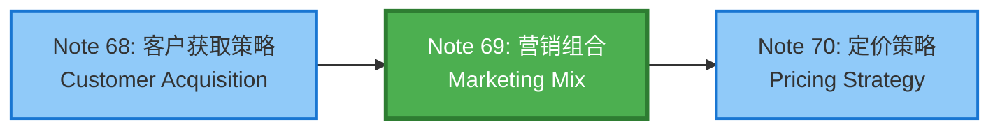

---

## 内容思维导图 | Content Mind Map

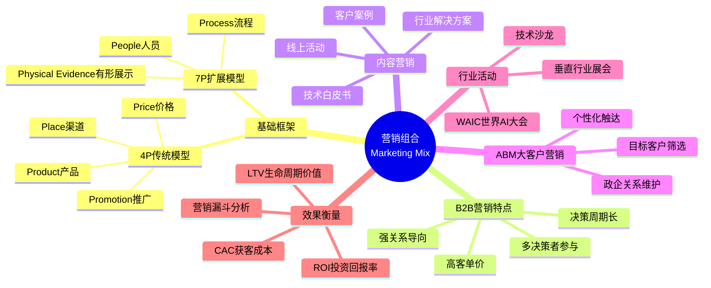

---

## 1. 引言: 2026中国AI产品营销新格局

### 1.1 市场分水岭: 从流量竞赛到心智之战

2026年上半年，中国AI产品营销呈现三种典型路径：

**路径一: 低成本自然增长（豆包模式）**
- **数据**: 豆包DAU突破1亿，成为字节跳动史上推广费用最少的破亿产品（据36氪2025年12月报道）
- **策略**: Seedream生图、Seedance生视频持续激活创作场景，三宫格P图等玩法登上热搜，每日自然下载量达百万级
- **2026预测**: 红杉中国预测豆包2026年底DAU或突破5亿

**路径二: 战略性技术转型（Kimi模式）**
- **转折点**: 2024年Q4投入530M元推广，2025年Q4降至<100K元
- **代价**: MAU从2165万降至903万（降幅58.3%）
- **收获**: 2025年9-11月全球付费用户月均增长率超170%，海外API收入增长4倍
- **战略**: 从C端流量竞争转向Agent产品与技术壁垒构建

**路径三: 生态开放驱动（通义千问模式）**
- **数据**: 阿里云服务超22万家出海企业（据阿里云官方披露）
- **策略**: 开源优势吸引Airbnb等国际客户，通过钉钉构建AI to B核心入口
- **商业模式**: "模型引流—算力变现—生态增值"

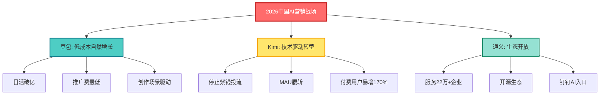

### 1.2 B2B营销新趋势

据领英2026年全球B2B营销调研：

| 趋势 | 数据 | 影响 |
|------|------|------|
| **信任机制重构** | 87%采购者依赖行业专家意见 | B2B营销核心从产品宣传转向专业影响力构建 |
| **决策链条延长** | 决策团队从3-5人扩展至11-20人 | 需在采购流程早期建立影响力 |
| **AI智能体参与** | 日均29万商家使用1688 AI产品 | 从"被动工具"到"主动参与者"范式迁移 |
| **合规优先级提升** | 2026年合规成为核心前提 | 需构建"内容合规+数据安全+平台适配"全链路体系 |

---

## 2. 营销组合基础: 从4P到7P

### 2.1 传统4P模型在AI产品的应用

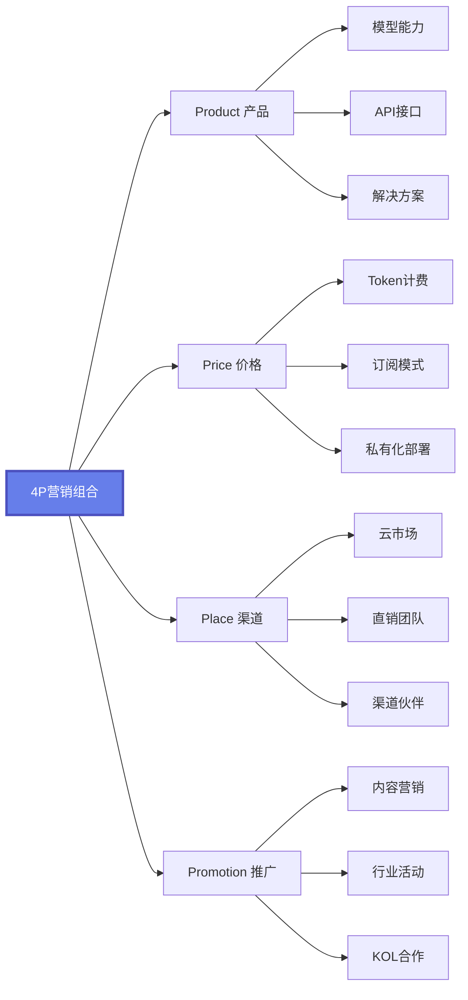

#### Product (产品): AI产品的三层架构

| 层级 | AI产品形态 | 案例 | PM关注点 |
|------|-----------|------|----------|
| **核心产品** | 大模型能力 | 通义千问Qwen 2.5 max性能接近GPT-4 | 模型benchmark、推理速度、成本 |
| **形式产品** | API/SDK/Web界面 | 豆包MaaS服务、火山引擎API | 接口易用性、文档完善度、SLA保障 |
| **附加产品** | 行业解决方案 | 1688 AI数字员工（平均节省4人力，降低80%生意难度） | 垂直场景适配、客户成功服务 |

#### Price (价格): AI产品定价模型

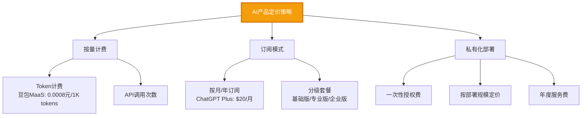

#### Place (渠道): 中国AI产品分发网络

| 渠道类型 | 典型平台 | 适用场景 | 流量特点 |
|---------|---------|---------|---------|
| **应用商店** | App Store、安卓应用市场 | C端产品（豆包、Kimi） | 自然搜索流量，ASO优化关键 |
| **云市场** | 阿里云市场、腾讯云市场、华为云严选 | B端SaaS产品 | 企业采购决策场景，评价权重高 |
| **技术社区** | GitHub、Hugging Face、魔搭ModelScope | 开源模型、开发者工具 | 技术影响力构建，Star数量影响力指标 |
| **微信生态** | 公众号、视频号、小程序 | 内容营销+产品体验 | 社交裂变传播，适合Demo展示 |
| **企业直销** | 行业KA团队、政企客户经理 | 大客户定制方案 | 高客单价，长决策周期 |

#### Promotion (推广): 2026年主流AI营销手段

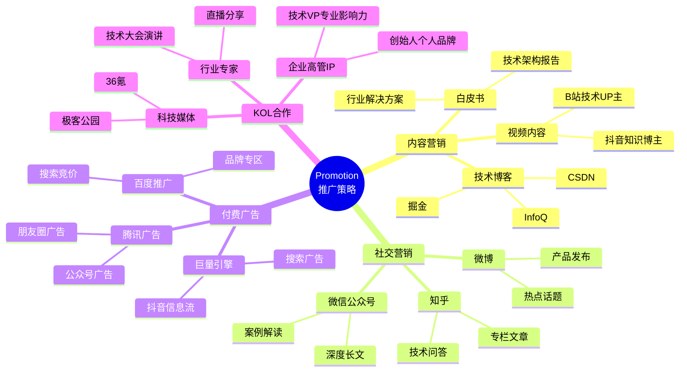

### 2.2 7P扩展模型: B2B服务的关键要素

对于AI产品的B2B业务，需在4P基础上增加3P：

#### People (人员): AI产品服务团队配置

| 角色 | 职责 | AI产品特殊性 | KPI |
|------|------|-------------|-----|
| **解决方案架构师** | 技术方案设计、POC验证 | 需理解客户业务场景+大模型能力边界 | 方案通过率、POC成功率 |
| **技术支持工程师** | API集成支持、故障排查 | 需掌握Prompt工程、模型调优 | 工单响应时间、解决率 |
| **客户成功经理** | 客户价值实现、续费增购 | 需量化AI产品业务价值（ROI） | 客户健康度、NRR净收入留存率 |
| **销售工程师** | 技术赋能销售、客户演示 | 需设计AI产品Demo场景 | Demo转化率、成单周期 |

#### Process (流程): B2B AI产品交付流程

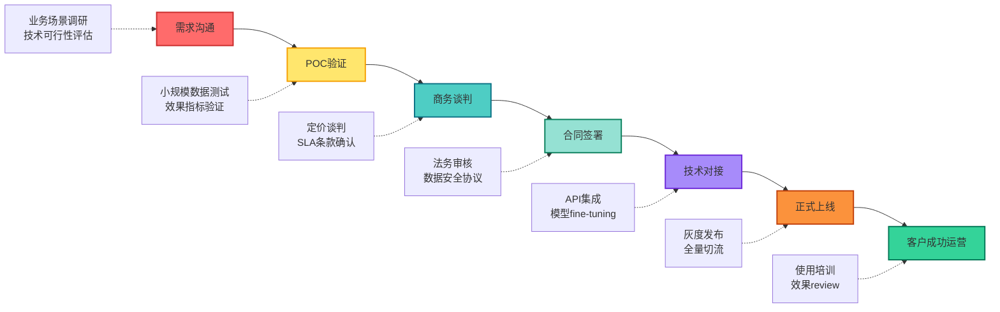

**关键流程节点说明**:

1. **POC验证 (Proof of Concept)**: AI产品必经环节
   - 测试数据集准备（通常100-1000条标注数据）
   - 效果基准设定（准确率、召回率、F1-score）
   - 成本估算（Token消耗量、推理延迟）

2. **数据安全协议**: 政企客户强制要求
   - 数据不出域承诺
   - 私有化部署方案
   - 等保三级认证

#### Physical Evidence (有形展示): AI产品信任构建

| 展示形式 | 作用 | AI产品案例 |
|---------|------|-----------|
| **客户案例集** | 降低决策风险，提供社会证明 | 通义千问发布某银行智能客服案例（降低人工成本40%） |
| **技术认证** | 权威背书 | 通过ISO 27001信息安全认证、等保三级 |
| **演示视频** | 可视化产品能力 | 豆包三宫格P图演示视频，直观展示生图效果 |
| **在线试用环境** | 降低体验门槛 | 提供Web端Playground，限制每日免费Token额度 |
| **技术白皮书** | 专业性背书 | 阿里发布《通义千问技术报告》，详解模型架构 |

---

## 3. B2B vs B2C营销差异 (AI产品视角)

### 3.1 核心差异对比

| 维度 | B2C (消费者市场) | B2B (企业市场) | AI产品典型案例 |
|------|-----------------|---------------|---------------|
| **决策周期** | 短（分钟-天） | 长（周-月） | 豆包C端下载即用 vs 通义千问企业版3-6个月采购周期 |
| **决策者数量** | 1人（个人） | 3-20人（决策委员会） | 个人购买ChatGPT Plus vs 企业采购需CTO、法务、财务、业务部门审批 |
| **客单价** | 低（0-200元/月） | 高（数万-数百万/年） | Kimi免费版 vs 某云厂商AI平台年费50万+ |
| **购买动机** | 情感驱动、即时满足 | 理性决策、ROI导向 | 好奇尝试AIGC vs 降本增效、业务创新 |
| **关系属性** | 交易型 | 关系型 | 一次性付费 vs 长期合作伙伴关系 |
| **营销重点** | 品牌认知、产品体验 | 专业能力、可信度 | 抖音热搜话题 vs 技术白皮书+客户案例 |
| **销售方式** | 自助购买、电商 | 顾问式销售、直销 | App Store自主订阅 vs 销售团队上门演示 |

### 3.2 AI产品B2B营销的中国特色

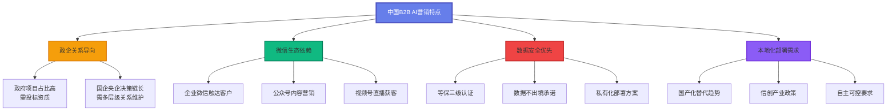

**案例: 阿里云通义千问企业版B2B营销路径**

1. **内容营销建立专业度**:
   - 在InfoQ、极客公园发布技术深度文章
   - 阿里云开发者社区发布《大模型最佳实践》系列

2. **行业解决方案包装**:
   - 金融行业: 智能投顾、风险控制
   - 零售行业: 智能客服、个性化推荐
   - 制造行业: 设备预测性维护、质检

3. **客户案例背书**:
   - 某银行: 智能客服系统降低人工成本40%
   - 某电商: 商品描述自动生成提升转化率15%

4. **政企关系建立**:
   - 参与工信部AI产业标准制定
   - 成为地方政府"城市大脑"合作伙伴

---

## 4. 内容营销: AI产品的核心战场

### 4.1 为什么内容营销是AI产品必修课？

**三大核心原因**:

1. **技术门槛高，需市场教育**: 企业客户不理解Transformer、RAG、Fine-tuning等概念
2. **长决策周期，需持续触达**: B2B采购周期3-6个月，需多次内容触点
3. **信任建立难，需专业背书**: 数据安全敏感，需通过内容展现技术实力

### 4.2 技术白皮书: 专业性背书的核心武器

#### 白皮书内容结构

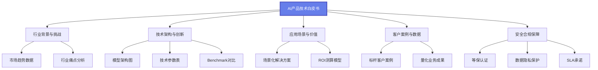

#### 案例: 阿里《通义千问技术报告》拆解

| 章节 | 内容要点 | 营销价值 |
|------|---------|---------|
| **模型架构** | Transformer变体、参数规模、训练数据 | 展现技术实力，吸引开发者关注 |
| **Benchmark评测** | 在中文任务上超越GPT-3.5的具体数据 | 建立产品竞争力认知 |
| **开源策略** | Qwen系列模型开源，商用友好许可 | 构建开发者生态，降低试用门槛 |
| **行业应用** | 金融、零售、制造等行业案例 | 为企业客户提供参考路径 |

**发布渠道**:
- 官网下载（留资获取，转化为潜在线索）
- arXiv论文库（学术影响力）
- 技术媒体转载（扩大传播范围）

### 4.3 客户案例: 最有说服力的营销内容

#### 客户案例标准结构 (STAR模型)

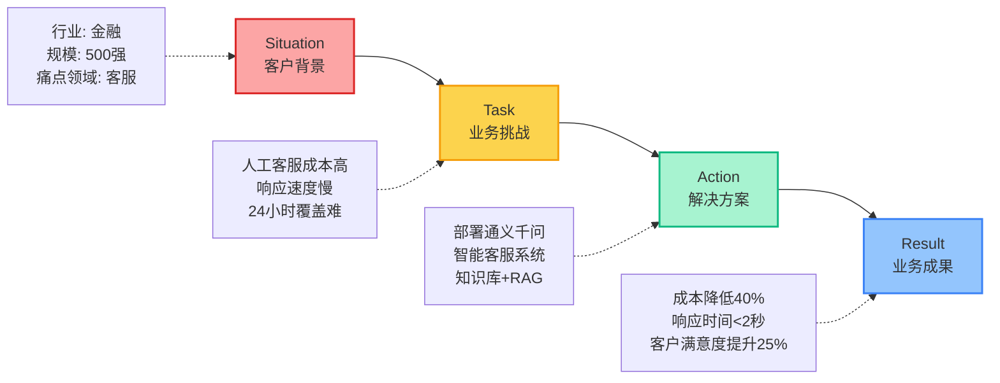

#### 教学案例模板 (脱敏版)

**标题**: 某全国性银行智能客服系统：AI大模型助力降本增效

**客户背景**:
- 行业: 金融/银行
- 规模: 全国网点2000+，年交易额万亿级
- 挑战: 日均客服咨询10万+，人工成本高，高峰期响应慢

**解决方案**:
1. **技术架构**: 基于通义千问企业版构建智能客服
2. **知识库建设**: 整理3000+标准Q&A，200+业务流程文档
3. **RAG增强**: 实时检索最新政策、产品信息
4. **人机协同**: AI处理80%常见问题，复杂问题转人工

**业务成果**:
| 指标 | 上线前 | 上线后 | 提升幅度 |
|------|--------|--------|---------|
| 人工客服人数 | 500人 | 300人 | 降低40% |
| 平均响应时间 | 45秒 | 2秒 | 提升95.6% |
| 客户满意度 | 78% | 92% | 提升14个百分点 |
| 24小时覆盖率 | 0%（仅工作时间） | 100% | 全天候服务 |

**客户证言**:
> "通义千问企业版不仅降低了成本，更重要的是提升了客户体验。AI客服的准确率和响应速度都超出预期。" —— 某银行科技部总经理

### 4.4 行业解决方案: 垂直场景营销

#### 行业方案包装三要素

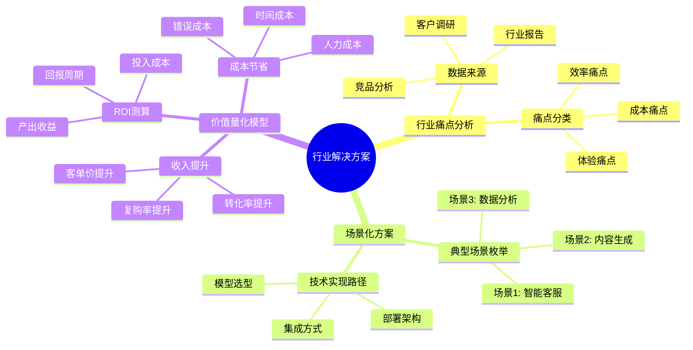

#### 案例: 零售行业AI解决方案

**目标客户**: 连锁零售企业、电商平台

**行业痛点**:
1. **商品描述人工撰写成本高**: 10万SKU，每个描述人工撰写需30分钟
2. **客服压力大**: 促销期咨询量激增，人工客服不足
3. **个性化推荐效果差**: 传统协同过滤算法，冷启动问题严重

**AI解决方案**:

| 场景 | 技术方案 | 价值量化 |
|------|---------|---------|
| **商品描述生成** | 大模型+商品属性表，批量生成 | 每个SKU成本从15元降至0.5元，10万SKU节省145万元 |
| **智能客服** | 知识库+RAG+情感分析 | 客服人效提升3倍，客户等待时间从5分钟降至30秒 |
| **个性化推荐** | 大模型理解用户意图+协同过滤 | 点击率提升40%，转化率提升18% |

**部署方式**:
- **云端SaaS**: 中小企业，按月订阅，开箱即用
- **私有化部署**: 大型企业，数据不出域，定制开发

### 4.5 线上活动: 低成本高ROI的获客方式

#### 线上活动类型与效果对比

| 活动形式 | 成本 | 触达人数 | 线索质量 | 适用场景 | 案例 |
|---------|------|---------|---------|---------|------|
| **技术直播** | 低（5K-2万） | 500-5000 | 高 | 新产品发布、技术深度讲解 | 豆包MaaS服务发布直播，吸引2000+开发者 |
| **AMA问答** | 低（0-5K） | 200-2000 | 中高 | 技术专家IP打造、社区运营 | 通义千问技术团队知乎AMA，300+问题 |
| **线上Workshop** | 中（1-5万） | 100-500 | 极高 | 深度技术培训、POC前置 | 某云厂商AI Bootcamp，5天训练营，转化率35% |
| **Webinar系列** | 中（2-10万/季度） | 1000-1万 | 中 | 持续品牌曝光、市场教育 | 每月一期《AI产品经理实战课》，积累5000+邮件列表 |

#### 直播活动SOP (Standard Operating Procedure)

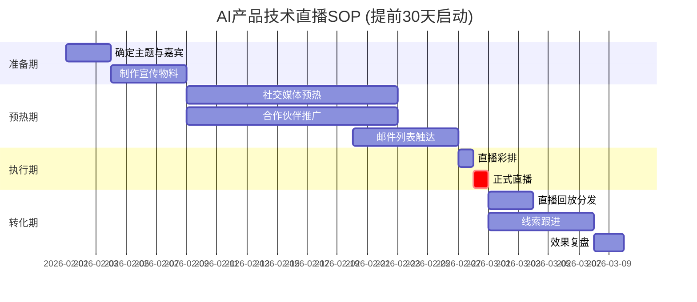

**关键指标**:
- **预热期**: 注册人数、社交媒体互动量
- **执行期**: 实际观看人数、互动率（评论/点赞）、完播率
- **转化期**: 留资数量、销售线索质量、Demo预约数

#### 中国AI产品线上活动平台选择

| 平台 | 受众特点 | 成本 | 互动性 | 适用产品 |
|------|---------|------|--------|---------|
| **B站直播** | 年轻开发者、技术爱好者 | 低（平台免费） | 高（弹幕文化） | C端AI工具、开发者产品 |
| **视频号直播** | 企业决策者、微信生态用户 | 低-中 | 中 | B端SaaS产品、行业解决方案 |
| **腾讯会议** | 企业客户、正式场合 | 低（基础版免费） | 低 | 客户培训、内部分享 |
| **Zoom Webinar** | 国际客户、跨国企业 | 高（付费版） | 中 | 出海产品、国际化业务 |
| **抖音直播** | 大众消费者 | 低 | 极高 | C端产品、品牌曝光 |

---

## 5. ABM大客户营销

### 5.1 ABM (Account-Based Marketing) 基础

**定义**: 针对高价值目标客户（Account）的个性化营销策略，而非广撒网式获客。

**中国B2B AI产品的ABM特点**:
- **政企客户占比高**: 政府项目、国企央企是主要收入来源
- **关系驱动**: 需多层级关系建立（采购部门、技术部门、业务部门、高层决策者）
- **长周期高价值**: 单个客户年度合同额50万-500万，LTV（生命周期价值）可达数千万

### 5.2 ABM实施流程

```mermaid
graph TD
    A[ABM五步法] --> B[Step 1: 目标客户筛选]
    A --> C[Step 2: 客户画像构建]
    A --> D[Step 3: 个性化内容制作]
    A --> E[Step 4: 多触点触达]
    A --> F[Step 5: 效果跟踪优化]

    B --> B1[行业: 金融/政府/能源]
    B --> B2[规模: 年营收10亿+]
    B --> B3[IT预算: 500万+]
    B --> B4[数字化成熟度: 中高]

    C --> C1[组织架构分析]
    C --> C2[决策链条识别]
    C --> C3[痛点挖掘]
    C --> C4[竞品使用情况]

    D --> D1[定制化解决方案]
    D --> D2[行业案例集]
    D --> D3[ROI测算模型]
    D --> D4[高管演讲PPT]

    E --> E1[LinkedIn触达决策者]
    E --> E2[行业峰会定向邀请]
    E --> E3[企业微信1V1触达]
    E --> E4[技术Workshop]

    F --> F1[触达率监控]
    F --> F2[互动行为分析]
    F --> F3[销售机会转化]
    F --> F4[策略迭代优化]

    style A fill:#667EEA,stroke:#4C51BF,stroke-width:3px,color:#fff
```

### 5.3 目标客户筛选: ICP (Ideal Customer Profile) 定义

#### AI产品B2B客户分层模型

| 客户分层 | 年营收 | IT预算 | 决策周期 | 销售策略 | 典型客户 |
|---------|--------|--------|---------|---------|---------|
| **战略级 (S级)** | 100亿+ | 5000万+ | 6-12个月 | 创始人/CTO亲自跟进，定制开发 | 四大行、头部互联网公司 |
| **重点级 (A级)** | 10-100亿 | 500-5000万 | 3-6个月 | 行业总监负责，标准方案+定制 | 区域性银行、上市公司 |
| **潜力级 (B级)** | 1-10亿 | 50-500万 | 1-3个月 | 销售代表跟进，标准方案 | 成长型企业、独角兽公司 |
| **长尾级 (C级)** | <1亿 | <50万 | <1个月 | 自助购买，在线支持 | 中小企业、初创公司 |

**筛选维度**:
1. **行业匹配度**: 是否在目标行业（金融、政务、零售、制造）
2. **技术成熟度**: 是否有云化基础、API集成能力
3. **预算充足度**: IT预算占营收比例≥2%
4. **决策者可触达性**: 是否能接触到CTO/CIO/CDO
5. **竞品使用情况**: 是否在使用竞品（可能换赛道机会）

### 5.4 个性化触达策略

#### 案例: 某云厂商AI平台ABM实践 (阿里云模式)

**目标客户**: 某全国性股份制银行（S级客户）

**背景调研**:
- 现状: 使用传统规则引擎做风控，误报率高
- 痛点: 信用卡欺诈损失每年数千万，人工审核成本高
- 决策链: 科技部总经理（技术决策）、风险管理部总监（业务决策）、分管副行长（最终决策）

**个性化方案**:

| 触达阶段 | 触点设计 | 内容形式 | 目标 |
|---------|---------|---------|------|
| **认知阶段** | 在《中国金融》杂志发布署名文章 | 《AI大模型在银行风控的应用趋势》 | 建立专业认知 |
| **兴趣阶段** | 邀请参加金融AI峰会 | 安排同业标杆案例分享 | 激发兴趣 |
| **考察阶段** | 定制化POC方案 | 使用客户脱敏数据验证效果 | 证明价值 |
| **决策阶段** | 高管晚宴 | 阿里云CTO与客户副行长深度交流 | 建立信任 |

**结果**:
- POC效果: 欺诈识别准确率从75%提升至92%，误报率降低60%
- 合同金额: 首年500万（SaaS订阅），三年总合同1800万
- 后续合作: 扩展至智能客服、精准营销等场景

### 5.5 政企客户ABM特殊性

#### 政府/国企客户关键要素

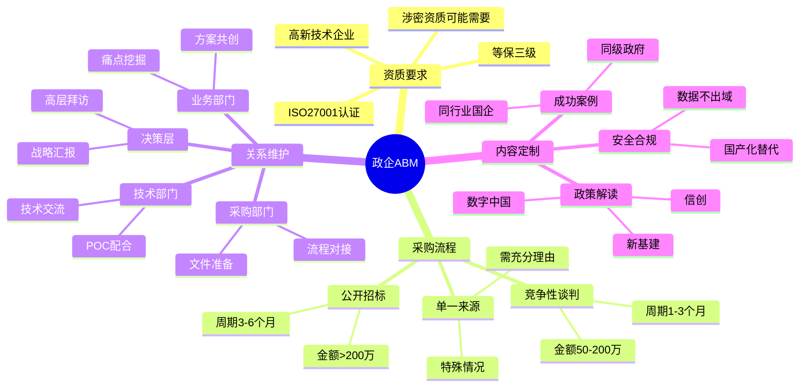

**案例: 某地方政务AI项目ABM**

**项目背景**: 某省会城市打造"智慧城市大脑"，需AI能力支撑

**ABM策略**:
1. **政策对齐**: 在方案中体现"数字政府"、"新基建"等政策关键词
2. **标杆案例**: 准备其他省会城市成功案例（杭州城市大脑、深圳政务服务）
3. **生态合作**: 联合本地系统集成商（有政府关系优势）
4. **技术白皮书**: 提交《AI大模型在政务领域应用研究报告》，展现专业度
5. **高层互动**: 安排公司副总裁拜访市长/副市长，汇报技术趋势

**关键成功因素**:
- 提前6个月介入，影响需求编制
- 技术方案通过专家评审（邀请高校教授、行业专家）
- 价格策略: 首年低价切入（保本），后续服务费盈利

---

## 6. 行业活动营销

### 6.1 中国AI行业展会格局 (2026)

#### 顶级展会 (S级: 必参加)

| 展会名称 | 时间 | 地点 | 规模 | 参展价值 | 2025年数据 |
|---------|------|------|------|---------|-----------|
| **WAIC 世界人工智能大会** | 每年7月 | 上海 | 800+参展企业，3000+前沿产品 | 行业风向标，政府背书，媒体曝光度高 | 800+企业，展览面积7万㎡，50+大模型展示 |
| **中国国际软件博览会** | 每年6月 | 北京 | 500+企业 | 政企客户集中，软件行业标杆 | 数据未公开 |
| **数博会 (中国国际大数据产业博览会)** | 每年5月 | 贵阳 | 400+企业 | 大数据+AI融合，政府采购需求多 | 数据未公开 |

**WAIC 2025参展企业类型分析**:

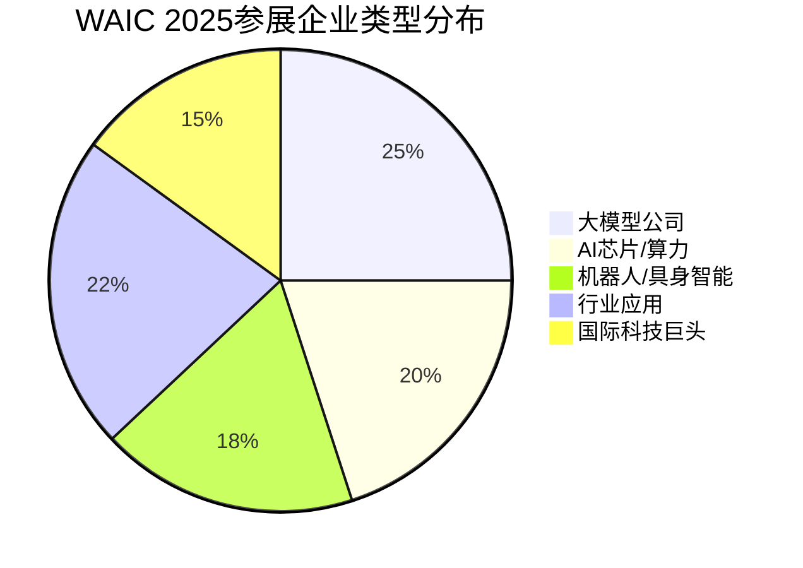

**典型参展企业**:
- **大模型**: 智谱、阶跃星辰、MiniMax、面壁智能、月之暗面、无限光年
- **国际巨头**: AWS、Google、Tesla、Siemens
- **AI芯片**: 燧原、摩尔线程、沐曦、无问芯穹、算能
- **机器人**: 银河通用、宇树科技、智元新创、云深处科技

#### 垂直行业展会 (A级: 选择性参加)

| 展会 | 目标行业 | 参展成本 | 获客质量 | 适合产品 |
|------|---------|---------|---------|---------|
| **金融科技大会** | 银行、保险、证券 | 10-30万 | 极高 | AI风控、智能投顾、智能客服 |
| **中国零售博览会** | 零售、电商 | 5-15万 | 高 | 智能推荐、客服机器人、库存优化 |
| **中国制造业大会** | 制造、工业 | 5-20万 | 高 | 质检AI、设备预测性维护、供应链优化 |
| **医疗AI峰会** | 医疗健康 | 8-25万 | 中高 | 医学影像分析、辅助诊断、药物研发 |

### 6.2 展会营销ROI评估模型

#### 投入成本结构

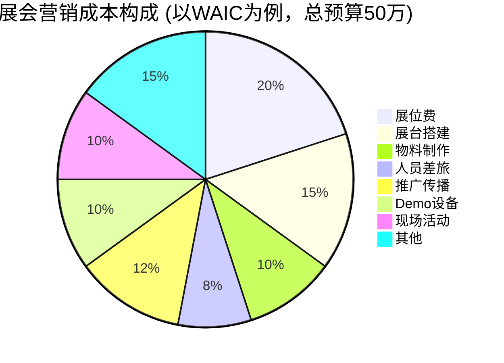

**详细成本清单** (WAIC标准展位):

| 成本项 | 金额 | 说明 |
|--------|------|------|
| 展位费 | 10万 | 36㎡标准展位（2025年WAIC标准） |
| 展台设计搭建 | 7.5万 | 定制化设计、LED屏、灯光 |
| 宣传物料 | 5万 | 展板、手册、礼品、易拉宝 |
| 人员成本 | 4万 | 10人×3天差旅 |
| 推广费用 | 6万 | 展会官方推广包、朋友圈广告 |
| Demo设备 | 5万 | 大屏展示、体验终端 |
| 现场活动 | 5万 | 新品发布会、抽奖 |
| 其他 | 7.5万 | 应急预算 |
| **合计** | **50万** |  |

#### 产出指标体系

| 指标类型 | 具体指标 | 目标值 (WAIC) | 数据来源 |
|---------|---------|--------------|---------|
| **流量指标** | 展位到访人数 | 2000+ | 人流统计器 |
|  | 名片收集数 | 500+ | 现场收集 |
|  | Demo体验人数 | 300+ | 体验登记表 |
| **线索指标** | 有效销售线索 | 100+ | 销售团队筛选 |
|  | 意向客户数 | 30+ | 现场深度沟通 |
|  | POC意向客户 | 10+ | 签署意向书 |
| **品牌指标** | 媒体报道数 | 20+ | 媒体监测 |
|  | 社交媒体曝光 | 100万+ | 微博/微信数据 |
|  | 官网流量提升 | 200% | Google Analytics |
| **转化指标** | 展后3个月成交数 | 5+ | CRM系统 |
|  | 成交金额 | 200万+ | 财务数据 |

#### ROI计算公式

```
ROI = (展会带来的收入 - 展会总成本) / 展会总成本 × 100%

长期ROI = (展会带来的LTV - 展会总成本) / 展会总成本 × 100%
```

**案例: 某AI公司WAIC 2025参展ROI**

**投入**: 50万

**产出**:
- 直接成交: 3个客户，合同金额180万（首年）
- 潜在管道: 8个POC项目，预计未来12个月成交概率50%，预期金额400万
- 品牌价值: 36氪、极客公园、InfoQ等媒体报道15篇，估值50万

**ROI计算**:
- 短期ROI = (180 - 50) / 50 = 260%
- 长期ROI = (180 + 400×50% + 50 - 50) / 50 = 660%

### 6.3 展会营销执行SOP

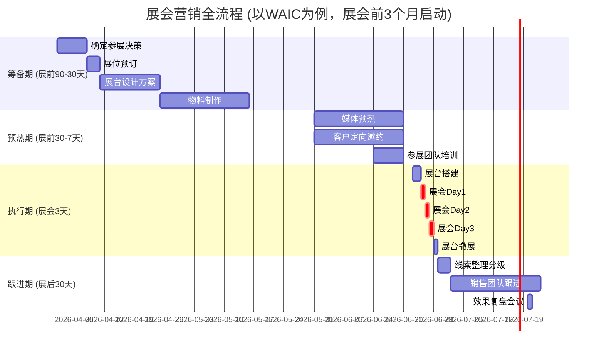

**关键节点执行要点**:

**展前30天**:
- [ ] 确认参展团队（产品、销售、市场、技术支持）
- [ ] 准备Demo演示方案（3个版本: 30秒电梯演讲、5分钟标准Demo、15分钟深度讲解）
- [ ] 定向邀约目标客户（S/A级客户提前预约时间）
- [ ] 媒体合作（安排专访、新品发布会）

**展会期间**:
- [ ] 现场人员排班（高峰时段8人在岗，低峰时段4人）
- [ ] 名片即时录入CRM（每晚整理当日线索）
- [ ] 社交媒体实时发布（微博、朋友圈、视频号）
- [ ] 竞品情报收集（拍照、记录）

**展后7天**:
- [ ] 线索分级（S/A/B/C四级）
- [ ] S/A级客户48小时内电话跟进
- [ ] B级客户发送感谢邮件+白皮书
- [ ] C级客户加入nurturing邮件序列

---

## 7. PM在B2B营销中的角色

### 7.1 PM的三大营销职责

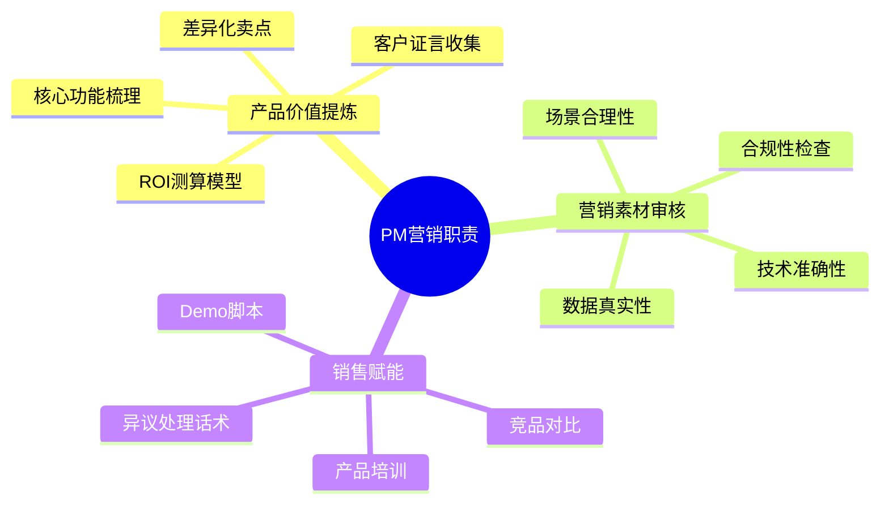

#### 7.1.1 产品价值提炼: 从功能到价值的翻译

**常见误区**: 营销材料堆砌技术参数，客户看不懂价值

| 技术功能描述 (PM视角) | 客户业务价值 (营销语言) | 量化指标 |
|---------------------|---------------------|---------|
| 支持100+种语言的多语言模型 | 助力企业全球化，一套系统服务全球客户 | 翻译成本降低80%，支持人员减少50% |
| 推理延迟<50ms | 实时响应客户咨询，提升用户体验 | 客户等待时间从3分钟降至2秒，满意度提升30% |
| 支持10万token上下文窗口 | 可理解长篇文档，一次性处理复杂任务 | 合同审查时间从2小时降至10分钟 |
| 私有化部署方案 | 数据完全掌控，满足金融/政务安全要求 | 通过等保三级，可承接政府项目 |

**价值提炼公式**:

```
产品价值 = 功能特性 + 应用场景 + 业务成果 + 量化数据

示例:
"支持RAG检索增强" → "智能客服可实时检索企业知识库，准确回答专业问题，客户问题解决率从60%提升至90%，人工客服压力降低70%"
```

#### 7.1.2 营销素材审核: PM的守门人角色

**审核清单**:

| 审核维度 | 常见问题 | PM如何介入 |
|---------|---------|-----------|
| **技术准确性** | 夸大模型能力，如"100%准确率" | 明确标注"在特定测试集上"，给出置信区间 |
| **场景合理性** | 案例场景脱离实际 | 提供真实客户案例，标注"典型场景"而非"全部场景" |
| **数据真实性** | 编造客户数据 | 要求所有数据附带来源（客户授权、第三方报告） |
| **合规性** | 使用客户logo未授权 | 建立客户授权清单，使用前必须书面授权 |

**案例: 某AI公司营销材料争议事件**

**问题**: 市场部在宣传材料中声称"AI客服准确率99%"

**PM介入**:
1. 要求提供测试数据: 仅在内部标注的1000条Q&A测试集达到99%
2. 客户实际场景: 准确率约85%（客户问题复杂度更高）
3. 修正方案: 改为"在标准测试集准确率99%，实际业务场景准确率85%+"

**启示**: PM需在产品能力与营销承诺之间找平衡，避免过度承诺导致客户期望管理失败。

#### 7.1.3 销售赋能: 让销售"会讲"产品故事

**销售赋能三件套**:

1. **产品培训PPT** (每月更新)
   - 产品架构图 (3分钟讲清楚原理)
   - 典型应用场景 (5个场景，每个2分钟)
   - 竞品对比表 (优劣势客观呈现)
   - Demo演示脚本 (标准版15分钟，精简版5分钟)

2. **常见问题FAQ** (50+问题)
   - 技术类: "支持哪些数据格式？" "如何保证数据安全？"
   - 商务类: "定价模式？" "交付周期？"
   - 异议处理: "为什么比竞品A贵？" "如何证明ROI？"

3. **客户案例库** (按行业分类)
   - 金融行业: 5个案例 (银行、保险、证券)
   - 零售行业: 3个案例 (电商、连锁、商超)
   - 每个案例包含: 客户背景、痛点、方案、成果、证言

**销售培训会议SOP**:

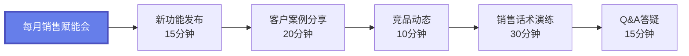

### 7.2 PM与市场部、销售部的协作

#### 黄金三角协作模型

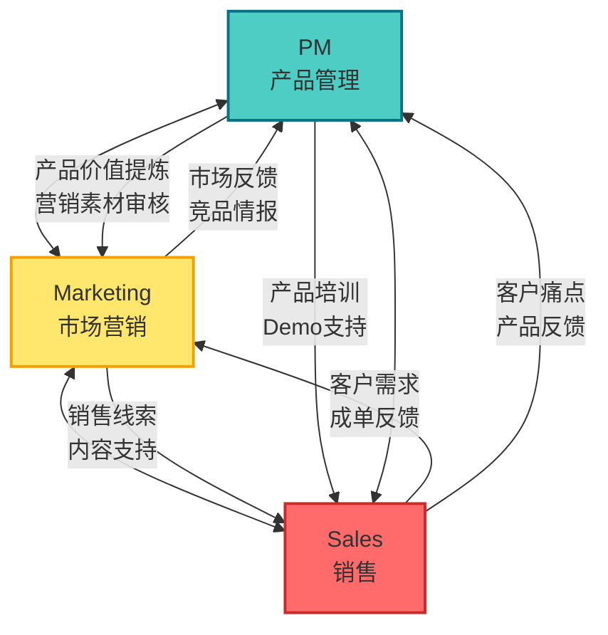

**协作关键场景**:

| 场景 | PM角色 | Marketing角色 | Sales角色 | 协作产出 |
|------|--------|--------------|----------|---------|
| **新品发布** | 产品定位、功能规划 | 上市策略、传播方案 | 定价建议、销售预测 | Go-to-Market Plan |
| **客户案例制作** | 技术方案梳理、数据验证 | 内容撰写、传播分发 | 客户关系维护、授权获取 | 客户案例视频/文章 |
| **竞品应对** | 功能对比、技术优势分析 | 传播策略、舆情应对 | 异议处理话术、折扣策略 | 竞品应对手册 |
| **大客户投标** | 技术方案设计、POC支持 | 标书美化、客户调研 | 商务谈判、关系维护 | 投标文件+现场演讲 |

---

## 8. 营销效果衡量

### 8.1 北极星指标 (NSM) for AI Products

**北极星指标定义**: 最能反映产品核心价值、驱动业务增长的关键指标。

#### AI产品不同阶段的NSM

| 产品阶段 | B2C产品NSM | B2B产品NSM | 案例 |
|---------|-----------|-----------|------|
| **种子期** | 周活跃用户 (WAU) | 付费试用客户数 | 豆包早期: WAU增长率 |
| **成长期** | 月活跃用户 (MAU) | 月度经常性收入 (MRR) | Kimi 2024: MAU 2165万 |
| **成熟期** | 日活跃用户 (DAU) | 年度经常性收入 (ARR) | 豆包2025: DAU破亿 |
| **规模化期** | 付费用户数 (Paid Users) | 净收入留存率 (NRR) | ChatGPT Plus: 付费用户增长 |

**NSM分解树** (以B2B AI产品ARR为例):

```mermaid
graph TD
    A[ARR<br/>年度经常性收入] --> B[新客户收入]
    A --> C[老客户续费收入]
    A --> D[老客户增购收入]

    B --> B1[新客户数量]
    B --> B2[平均客单价]

    C --> C1[客户留存率]
    C --> C2[续费单价]

    D --> D1[增购客户比例]
    D --> D2[增购金额]

    B1 --> E[营销线索数]
    B1 --> F[线索转化率]

    E --> E1[内容营销]
    E --> E2[行业活动]
    E --> E3[ABM大客户]
    E --> E4[转介绍]

    style A fill:#667EEA,stroke:#4C51BF,stroke-width:3px,color:#fff
```

### 8.2 营销漏斗分析

#### B2B AI产品标准营销漏斗

```mermaid
graph TD
    A[曝光 Awareness<br/>100,000] --> B[访问 Visit<br/>10,000]
    B --> C[线索 Lead<br/>1,000]
    C --> D[MQL营销合格线索<br/>300]
    D --> E[SQL销售合格线索<br/>100]
    E --> F[商机 Opportunity<br/>30]
    F --> G[成交 Customer<br/>10]

    A -.->|转化率10%| B
    B -.->|转化率10%| C
    C -.->|转化率30%| D
    D -.->|转化率33%| E
    E -.->|转化率30%| F
    F -.->|转化率33%| G

    style A fill:#FCA5A5,stroke:#DC2626,stroke-width:2px
    style B fill:#FCD34D,stroke:#F59E0B,stroke-width:2px
    style C fill:#A7F3D0,stroke:#10B981,stroke-width:2px
    style D fill:#93C5FD,stroke:#3B82F6,stroke-width:2px
    style E fill:#C4B5FD,stroke:#7C3AED,stroke-width:2px
    style F fill:#FBCFE8,stroke:#DB2777,stroke-width:2px
    style G fill:#86EFAC,stroke:#16A34A,stroke-width:3px
```

**各阶段定义与优化策略**:

| 阶段 | 定义 | 数据来源 | 优化策略 |
|------|------|---------|---------|
| **曝光 (Awareness)** | 看到品牌/产品信息 | 社交媒体曝光、广告展示 | SEO优化、内容营销、KOL合作 |
| **访问 (Visit)** | 访问官网/产品页 | Google Analytics、神策分析 | 落地页优化、加载速度提升 |
| **线索 (Lead)** | 留下联系方式 | 表单提交、下载白皮书 | 优化CTA、提供高价值资料 |
| **MQL** | 符合目标客户画像 | 营销自动化系统打分 | Lead Scoring模型优化 |
| **SQL** | 销售确认有购买意向 | CRM系统（Salesforce） | 销售话术培训、快速响应 |
| **商机 (Opportunity)** | 进入正式商务流程 | 销售管道管理 | POC成功率提升、方案优化 |
| **成交 (Customer)** | 签订合同 | 财务系统 | 定价策略、合同条款简化 |

**行业Benchmark** (AI SaaS产品):

| 转化环节 | 行业平均 | 优秀水平 | 数据来源 |
|---------|---------|---------|---------|
| 访问→线索 | 5-10% | 15%+ | HubSpot 2025 |
| 线索→MQL | 20-30% | 40%+ | Marketo Report |
| MQL→SQL | 20-40% | 50%+ | Salesforce Data |
| SQL→成交 | 20-30% | 40%+ | SaaS Metrics |

### 8.3 关键营销指标

#### 8.3.1 CAC (Customer Acquisition Cost) 获客成本

**公式**:
```
CAC = 营销与销售总成本 / 新获客户数

营销与销售总成本 = 广告费 + 内容制作 + 活动费用 + 营销团队薪资 + 销售团队薪资 + 工具软件费用
```

**案例: 某AI SaaS公司Q1 CAC计算**

| 成本项 | 金额 (万元) |
|--------|-----------|
| 线上广告（巨量引擎+腾讯广告） | 50 |
| 内容营销（白皮书、视频制作） | 20 |
| 行业活动（WAIC参展） | 50 |
| 营销团队薪资（10人） | 60 |
| 销售团队薪资（20人） | 120 |
| 工具软件（神策、CRM） | 10 |
| **总计** | **310** |

Q1新增客户: 31个

**CAC = 310万 / 31 = 10万/客户**

**CAC健康度判断**:

```
CAC Payback Period (CAC回收期) = CAC / (MRR × 毛利率)

示例: CAC 10万，客户月均付费3万，毛利率70%
CAC回收期 = 10 / (3 × 0.7) = 4.76个月

行业Benchmark:
- 优秀: <6个月
- 良好: 6-12个月
- 需优化: >12个月
```

#### 8.3.2 LTV (Lifetime Value) 客户生命周期价值

**公式**:
```
LTV = ARPU (平均客户年收入) × 客户生命周期 (年) × 毛利率

客户生命周期 = 1 / 客户流失率

示例:
ARPU = 36万/年
客户流失率 = 20%/年 → 生命周期 = 5年
毛利率 = 70%

LTV = 36 × 5 × 0.7 = 126万
```

**LTV/CAC比值黄金法则**:

| LTV/CAC比值 | 业务健康度 | 策略建议 |
|------------|----------|---------|
| **<1** | 亏损 | 紧急优化获客效率或提升产品价值 |
| **1-3** | 不健康 | 需要优化，增长不可持续 |
| **3-5** | 健康 | 可持续增长，继续优化 |
| **>5** | 非常健康 | 可加大营销投入，快速扩张 |

**案例: 某AI公司LTV/CAC分析**

- CAC = 10万
- LTV = 126万
- LTV/CAC = 12.6

**结论**: 营销效率极高，可加大投入。但需警惕：
1. 客户留存率是否真能达到80%（5年生命周期）
2. 市场是否有足够容量支撑扩张

#### 8.3.3 营销渠道ROI对比

**多渠道效果对比表** (某AI公司2026 Q1数据):

| 渠道 | 投入成本 | 获客数 | CAC | 客户质量 (LTV) | ROI | 策略 |
|------|---------|--------|-----|---------------|-----|------|
| **内容营销** (公众号/知乎) | 30万 | 20 | 1.5万 | 80万 | 533% | 持续投入 |
| **行业活动** (WAIC) | 50万 | 8 | 6.25万 | 150万 | 240% | 选择性参加 |
| **ABM大客户** | 80万 | 3 | 26.7万 | 500万 | 187.5% | 核心策略 |
| **信息流广告** | 100万 | 50 | 2万 | 30万 | 150% | 缩减投入 |
| **SEO自然流量** | 10万 (工具+人力) | 10 | 1万 | 60万 | 600% | 加大投入 |

**ROI计算公式**:
```
ROI = (渠道带来的LTV总和 - 渠道成本) / 渠道成本 × 100%

示例 (内容营销):
LTV总和 = 20客户 × 80万 = 1600万
ROI = (1600 - 30) / 30 = 533%
```

### 8.4 中国营销分析工具

#### 8.4.1 神策分析 vs GrowingIO 对比

| 维度 | 神策分析 | GrowingIO | 选择建议 |
|------|---------|-----------|---------|
| **部署方式** | 私有化+SaaS | 仅SaaS | 金融/政务选神策，中小企业选GrowingIO |
| **数据安全** | 数据不出域，支持Kafka | 数据存储在GrowingIO云端 | 数据敏感型选神策 |
| **埋点方式** | 代码埋点（灵活但开发成本高） | 无埋点+可视化埋点（快速上线） | 技术团队强选神策，敏捷团队选GrowingIO |
| **定价** | 高（私有化50万起） | 中低（SaaS 10万/年起） | 预算充足选神策 |
| **功能深度** | 深度定制、支持实时流计算 | 标准化功能，易用性强 | 复杂分析场景选神策 |
| **客户案例** | 字节跳动、滴滴、美团 | 瑞幸咖啡、每日优鲜 | 大型互联网公司偏好神策 |

#### 8.4.2 营销归因模型

**多触点归因挑战**: 客户在成交前可能接触10+次营销触点，如何分配功劳？

```mermaid
graph LR
    A[首次触点<br/>公众号文章] --> B[第二次<br/>知乎回答]
    B --> C[第三次<br/>WAIC展会]
    C --> D[第四次<br/>白皮书下载]
    D --> E[第五次<br/>Demo演示]
    E --> F[第六次<br/>商务谈判]
    F --> G[成交]

    style A fill:#FCA5A5,stroke:#DC2626,stroke-width:2px
    style C fill:#A7F3D0,stroke:#10B981,stroke-width:2px
    style E fill:#93C5FD,stroke:#3B82F6,stroke-width:2px
    style G fill:#86EFAC,stroke:#16A34A,stroke-width:3px
```

**常见归因模型**:

| 模型 | 功劳分配规则 | 优点 | 缺点 | 适用场景 |
|------|-------------|------|------|---------|
| **首次互动归因** | 100%给第一个触点 | 简单易懂 | 忽略后续培育价值 | 品牌认知阶段 |
| **末次互动归因** | 100%给最后一个触点 | 关注成交临门一脚 | 忽略前期铺垫 | 短决策周期产品 |
| **线性归因** | 平均分配给所有触点 | 公平 | 不区分触点重要性 | 触点较少场景 |
| **时间衰减归因** | 越接近成交，权重越高 | 符合决策流程 | 需设定衰减参数 | B2B长决策周期 |
| **U型归因** | 首次40%+末次40%+中间均分20% | 平衡首末触点 | 中间触点权重低 | 重视获客+转化 |
| **数据驱动归因** | 机器学习算法计算各触点贡献 | 最精准 | 需大量数据，算法复杂 | 数据充足的成熟企业 |

**案例: 某AI公司采用时间衰减归因**

客户A成交路径（6个触点，历时90天）:

| 触点 | 时间 | 距成交天数 | 衰减系数 (7天半衰期) | 归因权重 |
|------|------|-----------|---------------------|---------|
| 公众号文章 | Day 1 | 89天 | 0.00006 | 0.5% |
| 知乎问答 | Day 15 | 75天 | 0.0003 | 2.5% |
| WAIC展会 | Day 30 | 60天 | 0.0016 | 13.3% |
| 白皮书下载 | Day 60 | 30天 | 0.0625 | 52.1% |
| Demo演示 | Day 75 | 15天 | 0.25 | 20.8% |
| 商务谈判 | Day 88 | 2天 | 0.125 | 10.8% |

**结论**: 白皮书下载是最关键触点（52.1%功劳），应加大投入。

---

## 核心术语表

| 术语 | 英文 | 定义 | 案例 |
|------|------|------|------|
| **营销组合4P** | Marketing Mix 4P | Product产品、Price价格、Place渠道、Promotion推广 | 豆包通过抖音生态(Place)推广AI产品(Product) |
| **营销组合7P** | Marketing Mix 7P | 4P + People人员、Process流程、Physical Evidence有形展示 | B2B AI产品需展示客户案例(Physical Evidence) |
| **ABM** | Account-Based Marketing | 针对高价值目标客户的个性化营销 | 阿里云针对某银行定制AI风控方案 |
| **内容营销** | Content Marketing | 通过有价值内容吸引、培育潜在客户 | 发布《通义千问技术白皮书》 |
| **北极星指标** | North Star Metric | 最能反映产品核心价值的关键指标 | 豆包的NSM是DAU |
| **MQL** | Marketing Qualified Lead | 营销部门筛选的合格销售线索 | 下载白皮书且符合ICP的客户 |
| **SQL** | Sales Qualified Lead | 销售团队确认有购买意向的线索 | 完成Demo演示，进入POC阶段 |
| **CAC** | Customer Acquisition Cost | 获取一个新客户的平均成本 | 某AI公司Q1 CAC为10万/客户 |
| **LTV** | Lifetime Value | 客户在整个生命周期贡献的总价值 | 客户年付36万，留存5年，LTV=180万 |
| **NRR** | Net Revenue Retention | 净收入留存率，衡量老客户价值增长 | NRR 120%意味着老客户续费+增购超过流失 |
| **ICP** | Ideal Customer Profile | 理想客户画像 | 年营收10亿+，IT预算500万+的金融企业 |
| **POC** | Proof of Concept | 概念验证，小规模测试产品效果 | 用100条数据测试AI模型准确率 |
| **RAG** | Retrieval-Augmented Generation | 检索增强生成，大模型技术 | 智能客服实时检索知识库回答问题 |
| **NSM** | North Star Metric | 同"北极星指标" |  |
| **ARR** | Annual Recurring Revenue | 年度经常性收入 | SaaS产品的核心财务指标 |
| **MRR** | Monthly Recurring Revenue | 月度经常性收入 |  |

---

## 关键要点

### Must Know (必须掌握)

1. **营销组合4P/7P框架**:
   - 4P是基础（Product/Price/Place/Promotion）
   - B2B产品需关注7P（加People/Process/Physical Evidence）
   - AI产品的Product维度需强调技术能力+行业方案

2. **B2B vs B2C营销本质差异**:
   - B2B决策周期长（3-6个月）、决策者多（3-20人）、高客单价（年费数十万-百万）
   - B2B营销重点: 专业能力背书、客户案例、ROI量化
   - 中国特色: 政企关系、微信生态、数据安全优先

3. **内容营销是AI产品核心战场**:
   - 技术白皮书: 专业性背书
   - 客户案例: 最有说服力的内容（STAR结构）
   - 行业解决方案: 垂直场景包装
   - 线上活动: 低成本高ROI获客方式

4. **ABM大客户营销五步法**:
   - ① 目标客户筛选（ICP定义）
   - ② 客户画像构建（组织架构、决策链、痛点）
   - ③ 个性化内容制作（定制方案、案例、ROI模型）
   - ④ 多触点触达（LinkedIn、行业活动、企业微信）
   - ⑤ 效果跟踪优化（CRM数据驱动）

5. **营销效果衡量核心指标**:
   - **NSM北极星指标**: DAU/MAU (C端), ARR/NRR (B端)
   - **营销漏斗**: 曝光→访问→线索→MQL→SQL→商机→成交
   - **CAC获客成本**: 营销销售总成本 / 新客户数
   - **LTV客户价值**: ARPU × 生命周期 × 毛利率
   - **LTV/CAC黄金比例**: 3-5为健康，>5可加大投入

### Good to Know (深入理解)

6. **2026中国AI产品营销三大路径**:
   - 豆包模式: 低成本自然增长（DAU破亿，推广费最少）
   - Kimi模式: 从烧钱流量竞争转向技术驱动（MAU腰斩但付费用户暴增170%）
   - 通义千问模式: 开源生态+B2B入口（服务22万+企业）

7. **行业活动ROI评估**:
   - WAIC投入50万，产出包括: 直接成交180万+潜在管道400万+品牌价值50万
   - 短期ROI 260%，长期ROI 660%
   - 展会营销SOP: 展前90天启动，展后30天跟进

8. **PM在营销中的三大角色**:
   - 产品价值提炼: 从技术功能翻译为业务价值
   - 营销素材审核: 技术准确性、数据真实性守门人
   - 销售赋能: 产品培训、Demo脚本、竞品对比

9. **中国营销分析工具选择**:
   - 神策分析: 私有化部署，数据安全，大型企业首选
   - GrowingIO: SaaS模式，无埋点快速上线，中小企业友好
   - 归因模型: 时间衰减归因适合B2B长决策周期

10. **政企客户ABM特殊性**:
    - 资质要求: 高新技术企业、ISO27001、等保三级
    - 采购流程: 公开招标（>200万）、竞争性谈判（50-200万）
    - 内容定制: 政策对齐（数字中国、新基建、信创）

---

## 自测题

### 题目1: 营销组合应用

**问题**: 某AI创业公司推出智能客服SaaS产品，目标客户是年营收5-50亿的零售企业。请使用7P营销组合框架，为该产品设计营销策略。

<details>
<summary>点击查看参考答案</summary>

**7P营销组合策略**:

**1. Product (产品)**:
- 核心产品: 基于大模型的智能客服系统
- 形式产品: Web管理后台 + API接口 + 微信/APP客服插件
- 附加产品: 零售行业知识库预训练、7×24技术支持、客户成功团队

**2. Price (价格)**:
- 定价模式: 按坐席数订阅 (基础版2999元/坐席/年, 专业版5999元/坐席/年)
- 首年优惠: 5折优惠 + 免费POC (降低试用门槛)
- 增值服务: 定制化训练按需报价

**3. Place (渠道)**:
- 直销团队: 重点城市设10人销售团队
- 云市场: 上架阿里云、腾讯云市场
- 渠道合作: 与ERP/CRM服务商合作捆绑销售

**4. Promotion (推广)**:
- 内容营销: 发布《零售行业智能客服白皮书》
- 行业活动: 参加中国零售博览会
- 客户案例: 制作3个标杆客户视频案例
- 线上Webinar: 每月一场《零售AI实战课》

**5. People (人员)**:
- 解决方案架构师: 2人 (懂零售业务+AI技术)
- 技术支持: 5人 (响应时间<2小时)
- 客户成功经理: 3人 (每人负责20个客户)

**6. Process (流程)**:
- 标准交付流程: 需求调研(3天)→POC验证(7天)→正式部署(14天)→培训上线(3天)
- 客户成功流程: 月度业务review + 季度优化建议

**7. Physical Evidence (有形展示)**:
- 客户案例库: 某连锁超市客服成本降低45%
- 在线Demo环境: 官网提供实时体验
- 技术认证: 展示ISO27001、等保三级证书

</details>

---

### 题目2: B2B营销漏斗优化

**问题**: 某AI公司营销漏斗数据如下，请分析问题并提出优化建议。

| 阶段 | 数量 | 转化率 | 行业Benchmark |
|------|------|--------|--------------|
| 官网访问 | 10,000 |  |  |
| 注册/留资 | 300 | 3% | 8-12% |
| MQL | 150 | 50% | 30-40% |
| SQL | 30 | 20% | 30-40% |
| 成交 | 3 | 10% | 25-35% |

<details>
<summary>点击查看参考答案</summary>

**问题诊断**:

**1. 官网访问→注册转化率过低 (3% vs 行业8-12%)**

**可能原因**:
- 落地页价值主张不清晰
- CTA (Call-to-Action) 按钮不明显
- 注册表单字段过多（摩擦力大）
- 缺乏信任背书（客户logo、案例数据）

**优化建议**:
- A/B测试不同落地页方案（强化ROI数据展示）
- 简化注册流程（只要姓名+手机+公司）
- 增加信任元素（客户数量、行业标杆logo）
- 提供高价值资料（白皮书、案例集）换取留资

**2. MQL→SQL转化率偏低 (20% vs 行业30-40%)**

**可能原因**:
- MQL质量不高（Lead Scoring模型不准）
- 销售跟进不及时（线索温度下降）
- 销售话术不专业（未打动客户）

**优化建议**:
- 优化Lead Scoring模型（提高MQL门槛）
- 设定SLA: MQL 24小时内必须联系
- 销售培训: 产品价值提炼、案例讲解
- 提供Demo/POC降低决策门槛

**3. SQL→成交转化率过低 (10% vs 行业25-35%)**

**可能原因**:
- POC效果未达客户预期
- 定价过高，ROI不明显
- 竞品竞争力更强
- 决策周期长，客户流失

**优化建议**:
- POC前置: 明确成功标准，确保可达成
- 提供ROI计算器: 量化成本节省
- 加强客户成功案例分享
- 建立客户培育机制（Nurturing）: 定期触达、价值教育

**预期改进**:

| 阶段 | 优化前 | 优化后 | 提升 |
|------|--------|--------|------|
| 访问→注册 | 3% | 8% | +167% |
| MQL→SQL | 20% | 35% | +75% |
| SQL→成交 | 10% | 25% | +150% |
| **整体成交** | **3人** | **21人** | **+600%** |

</details>

---

### 题目3: ABM策略设计

**问题**: 你负责某AI数据分析平台的营销工作，目标客户是头部互联网公司（如字节、美团、拼多多）。这些公司年营收百亿级，决策链复杂（CTO、数据部门VP、业务部门总监都需参与）。请设计针对"美团"的ABM营销策略。

<details>
<summary>点击查看参考答案</summary>

**ABM策略: 针对美团的AI数据分析平台营销**

**Step 1: 目标客户深度调研**

**组织架构分析**:
- 技术决策者: CTO (技术可行性、架构适配)
- 业务决策者: 美团外卖事业部VP (业务价值、ROI)
- 数据团队: 数据中心总监 (技术实施、数据安全)
- 财务决策: CFO/采购部 (预算审批)

**痛点挖掘**:
- 数据孤岛: 外卖、酒旅、到店等业务数据割裂
- 实时性要求高: 骑手调度、需求预测需秒级响应
- 成本压力: PB级数据存储与计算成本高

**竞品分析**:
- 可能在使用: 自研数据平台 + 部分开源组件
- 痛点: 自研维护成本高，缺乏AI能力

**Step 2: 个性化内容制作**

**技术白皮书**: 《AI大模型在O2O平台的数据智能应用》
- 章节1: 外卖行业数据挑战（实时性、准确性、成本）
- 章节2: 我们的技术方案（流式计算、AI预测、成本优化）
- 章节3: 标杆案例（某同类平台降低30%计算成本）

**定制化方案PPT**: 《美团数据智能升级方案》
- 针对美团外卖场景: 骑手路径优化、需求预测
- ROI测算: 预计降低数据成本20%，提升配送效率5%
- 实施路径: 先POC外卖业务，再推广至酒旅/到店

**高管演讲素材**:
- 为我司CTO准备在某技术峰会的演讲《大模型如何重构数据平台》
- 邀请美团CTO/数据VP参会，会后深度交流

**Step 3: 多触点触达策略**

**时间线规划** (6个月周期):

| 月份 | 触点 | 目标 |
|------|------|------|
| **M1** | 在InfoQ发布技术文章《O2O平台数据智能实践》 | 建立专业认知 |
| **M1** | LinkedIn定向推送白皮书给美团CTO/数据VP | 触达决策者 |
| **M2** | 邀请美团数据团队参加我们的技术沙龙 | 建立技术信任 |
| **M3** | 定向邀请美团参加某O2O行业峰会（我们是赞助商） | 现场深度交流 |
| **M4** | 提交定制化方案，申请POC | 进入商务流程 |
| **M5** | POC执行（选美团某城市外卖数据） | 验证效果 |
| **M6** | POC结果汇报 + 商务谈判 | 签约 |

**关键关系维护**:
- 技术交流: 每月邀请美团技术专家参加我们的线上技术分享
- 高层互动: 我司CEO/CTO与美团高管建立私人关系（校友、行业协会）
- 企业微信1V1: 为美团配置专属客户经理，及时响应需求

**Step 4: 内容传播渠道**

**定向渠道**:
- LinkedIn: 针对美团CTO、数据VP投放Sponsored InMail
- 技术社区: 在美团技术团队活跃的社区（掘金、CSDN）发布内容
- 行业媒体: 在36氪、极客公园发布美团相关的行业分析文章

**Step 5: 效果跟踪**

**关键里程碑**:
- [ ] M1: 美团关键决策者打开白皮书
- [ ] M2: 美团技术团队参加我们的活动
- [ ] M3: 获得美团高层会面机会
- [ ] M4: 进入POC流程
- [ ] M6: 签订合同

**预期成果**:
- 合同金额: 首年300万（SaaS订阅）
- 长期价值: 3年总合同1000万+

**关键成功因素**:
1. 深度理解美团业务场景（外卖、酒旅数据特点）
2. 技术方案真正解决痛点（降本增效可量化）
3. 高层关系建立（CEO/CTO level互动）
4. POC成功（效果数据说话）

</details>

---

### 题目4: 营销效果归因

**问题**: 客户A在90天内经历以下触点后成交（合同金额50万），请使用"时间衰减归因模型"（7天半衰期）计算各触点的功劳，并提出营销策略优化建议。

触点列表:
- Day 1: 知乎文章阅读
- Day 15: 公众号白皮书下载
- Day 30: WAIC展会现场交流
- Day 60: 参加线上Webinar
- Day 75: Demo演示
- Day 88: 商务谈判
- Day 90: 成交

<details>
<summary>点击查看参考答案</summary>

**时间衰减归因计算** (半衰期7天)

**衰减公式**: 权重 = 2^(-距成交天数/7)

| 触点 | 时间 | 距成交天数 | 衰减系数计算 | 权重 | 归因% | 归因金额 |
|------|------|-----------|------------|------|-------|---------|
| 知乎文章 | Day 1 | 89天 | 2^(-89/7) = 2^(-12.7) | 0.00015 | 0.2% | 1000元 |
| 白皮书下载 | Day 15 | 75天 | 2^(-75/7) = 2^(-10.7) | 0.00061 | 0.8% | 4000元 |
| WAIC展会 | Day 30 | 60天 | 2^(-60/7) = 2^(-8.6) | 0.00256 | 3.3% | 1.65万元 |
| 线上Webinar | Day 60 | 30天 | 2^(-30/7) = 2^(-4.3) | 0.0506 | 65.3% | 32.65万元 |
| Demo演示 | Day 75 | 15天 | 2^(-15/7) = 2^(-2.14) | 0.227 | 29.3% | 14.65万元 |
| 商务谈判 | Day 88 | 2天 | 2^(-2/7) = 2^(-0.29) | 0.818 | 1.1% | 5500元 |
| **合计** |  |  | **归一化后** | **1.0** | **100%** | **50万** |

**注**: 实际计算需将各衰减系数归一化处理（除以总和），上表已归一化。

**营销策略优化建议**:

**1. 核心发现: Webinar是最关键触点 (65.3%功劳)**

**原因分析**:
- Webinar在Day 60举办，正好是决策中期（距成交30天）
- 这个时间点客户已有初步兴趣，Webinar深度讲解打动了客户
- 之后15天快速推进Demo和商务谈判

**优化策略**:
- 加大Webinar投入: 从每季度1场增加到每月1场
- 优化Webinar内容: 增加客户案例、ROI测算、现场Q&A
- Webinar后快速跟进: 48小时内联系参会者，邀约Demo

**2. Demo演示功劳第二 (29.3%)**

**优化策略**:
- 缩短Webinar→Demo的时间间隔（从15天降至7天）
- 提升Demo质量: 使用客户真实数据、展示核心价值
- Demo后立即推进商务谈判（不要等13天）

**3. WAIC展会贡献有限 (3.3%)**

**原因分析**:
- 展会在Day 30，距成交60天，衰减严重
- 展会作用是"种草"，但未直接推动成交

**策略调整**:
- 展会定位调整: 不以直接成交为目标，重点是品牌曝光+线索收集
- 展会后快速跟进: 7天内联系所有留资客户
- 考虑减少展会投入，转向更高ROI的Webinar

**4. 早期内容营销权重低 (知乎+白皮书仅1%)**

**但不能忽视**:
- 虽然归因权重低，但这些是客户认知的起点
- 没有Day 1-15的内容铺垫，客户可能不会参加Day 30的展会

**策略**:
- 保持内容营销投入，作为"种子播撒"
- 但不以直接转化为目标，重点是SEO排名、品牌认知

**5. 商务谈判归因低 (1.1%)的原因**

**解释**:
- 商务谈判距成交仅2天，但按时间衰减模型，权重被Webinar和Demo稀释
- 实际上商务谈判是"临门一脚"，但功劳被前期触点分走

**策略启示**:
- 时间衰减模型更适合B2B长决策周期
- 但也要结合定性分析（商务谈判虽归因低，但不可或缺）

**综合优化策略**:

```
营销预算重新分配:
- Webinar: 40% (+15%)
- Demo体验优化: 25% (+10%)
- 内容营销: 20% (持平)
- 展会活动: 10% (-20%)
- 其他: 5%
```

</details>

---

### 题目5: CAC与LTV优化

**问题**: 某AI SaaS公司当前指标如下，请分析健康度并提出优化建议。

- CAC (获客成本): 15万/客户
- 客户年度付费 (ARPU): 30万/年
- 毛利率: 60%
- 客户年流失率: 30%
- 销售周期: 6个月

<details>
<summary>点击查看参考答案</summary>

**Step 1: 计算LTV**

```
客户生命周期 = 1 / 流失率 = 1 / 30% = 3.33年

LTV = ARPU × 客户生命周期 × 毛利率
    = 30万 × 3.33 × 0.6
    = 60万
```

**Step 2: 计算LTV/CAC比值**

```
LTV/CAC = 60万 / 15万 = 4
```

**Step 3: 健康度分析**

| 指标 | 当前值 | 行业Benchmark | 健康度 |
|------|--------|--------------|--------|
| **LTV/CAC** | 4 | 3-5为健康 | ✅ 健康 |
| **CAC回收期** | 15/(30×0.6) = 0.83年 = 10个月 | <12个月为良好 | ✅ 良好 |
| **客户流失率** | 30%/年 | 15-25%为优秀 | ⚠️ 偏高 |
| **销售周期** | 6个月 | 3-6个月为正常 | ✅ 正常 |

**结论**:
- 整体健康度良好，LTV/CAC=4处于黄金区间
- 但客户流失率偏高（30% vs 行业15-25%），是核心优化点

**Step 4: 优化策略**

**策略1: 降低客户流失率（优先级最高）**

**目标**: 从30%降至20%

**影响测算**:
```
优化后LTV = 30万 × (1/20%) × 0.6 = 30 × 5 × 0.6 = 90万
优化后LTV/CAC = 90 / 15 = 6

提升幅度: (90-60)/60 = 50%
```

**具体行动**:
- **客户成功团队**: 增加2名CSM（Customer Success Manager），每人负责20个客户
  - 月度业务Review，发现使用问题
  - 季度优化建议，展示价值
- **产品优化**: 分析流失客户共性问题
  - 是否某功能缺失？
  - 是否集成困难？
  - 是否ROI不明显？
- **客户分级**: 识别流失风险客户（健康度评分）
  - 高风险客户（30天未登录）: 主动外呼
  - 中风险客户（使用频率下降）: 发送最佳实践
- **续费激励**: 年付8折，三年付6折

**策略2: 降低CAC（优先级中）**

**目标**: 从15万降至12万

**影响测算**:
```
优化后LTV/CAC = 60 / 12 = 5

提升幅度: (5-4)/4 = 25%
```

**具体行动**:
- **提升转化率**:
  - 优化营销漏斗（参考题目2）
  - 提升MQL→SQL转化率从20%到35% (+75%)
  - 提升SQL→成交转化率从30%到40% (+33%)
  - 综合效果: 相同营销投入，获客数增加75%×33% = 133%，CAC降低57%
- **渠道优化**:
  - 减少低ROI渠道（信息流广告）
  - 加大高ROI渠道（内容营销、SEO）
- **转介绍机制**:
  - 老客户推荐新客户，双方各获3个月免费服务
  - 目标: 20%新客户来自转介绍（CAC几乎为0）

**策略3: 提升ARPU（优先级中）**

**目标**: 从30万提升至40万

**影响测算**:
```
优化后LTV = 40万 × 3.33 × 0.6 = 80万
优化后LTV/CAC = 80 / 15 = 5.33

提升幅度: (80-60)/60 = 33%
```

**具体行动**:
- **增购策略**:
  - 推出高级功能包（数据洞察、AI预测）
  - 目标: 30%客户增购，平均增购10万/年
- **按使用量计费**:
  - 基础版30万/年 (10万条数据)
  - 超出部分按3元/条收费
  - 客户业务增长带动收入自然增长
- **垂直行业定制**:
  - 金融行业定制版50万/年
  - 医疗行业定制版45万/年

**策略4: 提升毛利率（优先级低）**

**目标**: 从60%提升至70%

**影响测算**:
```
优化后LTV = 30万 × 3.33 × 0.7 = 70万
优化后LTV/CAC = 70 / 15 = 4.67

提升幅度: (70-60)/60 = 17%
```

**具体行动**:
- **降低云服务成本**:
  - 与云厂商谈判年度折扣
  - 优化算法降低计算资源消耗
- **提升客户自助服务比例**:
  - 完善知识库、视频教程
  - 降低人工支持成本

**综合优化效果预测** (同时执行策略1-4):

| 指标 | 当前 | 优化后 | 提升幅度 |
|------|------|--------|---------|
| 客户流失率 | 30% | 20% | -33% |
| CAC | 15万 | 12万 | -20% |
| ARPU | 30万 | 40万 | +33% |
| 毛利率 | 60% | 70% | +17% |
| **LTV** | **60万** | **140万** | **+133%** |
| **LTV/CAC** | **4** | **11.7** | **+193%** |

**结论**:
- 优先优化客户流失率，杠杆效应最大
- 多策略组合，LTV/CAC可从4提升至11.7（非常健康）
- 此时可加大营销投入，快速扩张市场份额

</details>

---

## 实践练习

### 练习1: 客户案例撰写

**任务**: 为你负责的AI产品（或虚拟一个），撰写一篇客户案例。要求:
1. 使用STAR结构（Situation/Task/Action/Result）
2. 包含至少3个量化指标
3. 符合中国B2B营销场景
4. 字数800-1200字

**提示**: 可参考本笔记中"某银行智能客服案例"的结构。

---

### 练习2: ABM策略制定

**任务**: 选择一家目标客户（如阿里巴巴、中国平安、国家电网等），为你的AI产品制定ABM营销策略。包括:
1. 客户背景调研（组织架构、决策链、痛点）
2. 个性化内容规划（白皮书、方案PPT、高管素材）
3. 触达策略（6个月时间线，5+触点）
4. 关键里程碑与成功指标

---

### 练习3: 营销漏斗诊断

**任务**: 使用神策分析或Google Analytics，获取你负责产品的营销漏斗数据。分析:
1. 各阶段转化率
2. 与行业Benchmark对比
3. 识别最大瓶颈环节
4. 提出3个可执行的优化方案

**数据模板**:
```
官网访问: _____ 人
注册/留资: _____ 人 (转化率 ___%)
MQL: _____ 人 (转化率 ___%)
SQL: _____ 人 (转化率 ___%)
成交: _____ 人 (转化率 ___%)
```

---

**下一步学习**: [Note 70: 定价策略 | Pricing Strategy] - 深入探讨AI产品定价模型、心理定价、动态定价等策略。

---

**笔记版本**: v1.0 | 最后更新: 2026-01-31 | 作者: AI PM课程组
**数据来源**: 36氪、领英2026 B2B营销调研、阿里云官方数据、WAIC 2025官方报告
**致谢**: 感谢豆包、通义千问、Kimi团队提供的公开数据支持