# 销售策略 | Sales Strategies for Product Success

> **TL;DR**
> AI产品销售不仅需要传统销售技巧，更需要技术赋能、价值量化和PM-销售深度协作。本笔记涵盖AI产品销售赋能体系（技术白皮书、ROI计算器、Demo设计）、中国特色销售策略（关系型销售、多层决策、政企流程）、数据驱动销售预测，以及PM与销售团队的协作机制，并结合阿里云、百度、腾讯等头部厂商的实战案例。

---

## 目录 | Table of Contents

1. [引言: AI产品销售的独特挑战](#1-引言-ai产品销售的独特挑战)
2. [销售赋能：让销售团队成为AI产品专家](#2-销售赋能让销售团队成为ai产品专家)
3. [销售技术与策略](#3-销售技术与策略)
4. [PM与销售团队协作](#4-pm与销售团队协作)
5. [中国AI产品销售实战](#5-中国ai产品销售实战)
6. [核心术语表](#核心术语表)
7. [关键要点](#关键要点)
8. [自测题](#自测题)
9. [实践练习](#实践练习)

---

## 学习路径

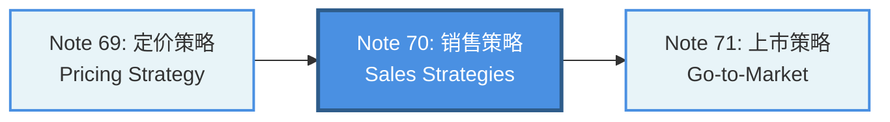

---

## 内容思维导图

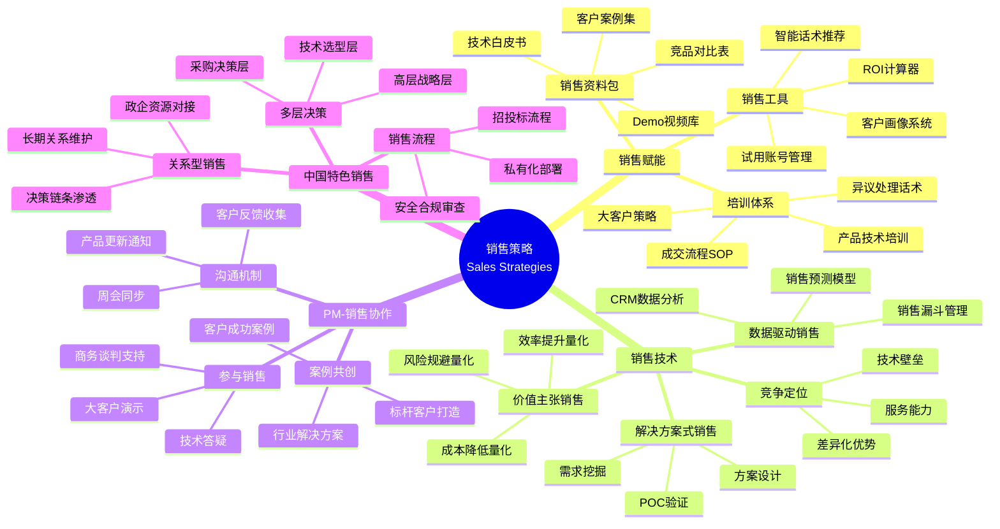

---

## 1. 引言: AI产品销售的独特挑战

### 1.1 AI产品销售 vs 传统软件销售

AI产品销售面临三大独特挑战：

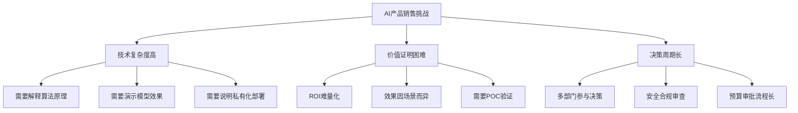

| 维度 | 传统软件销售 | AI产品销售 |
|------|-------------|-----------|
| **技术门槛** | 功能演示即可 | 需要讲解模型原理、训练数据、推理性能 |
| **价值证明** | 功能对比 | 需要量化ROI（如"降低客服成本60%"） |
| **Demo形式** | 界面操作演示 | 实时对话演示、API调用展示、准确率对比 |
| **客户疑虑** | 价格、易用性 | 数据安全、模型可控性、私有化部署 |
| **销售周期** | 1-3个月 | 3-12个月（大客户可达18个月） |
| **决策层级** | IT部门 | IT部门 + 业务部门 + 安全合规 + 高层战略 |

**典型场景：**
某企业要采购AI客服系统，销售团队需要：
- 解释NLP模型如何理解客户意图（技术层）
- 演示在真实场景下的问答准确率（效果层）
- 计算替代人工客服后的年度成本节省（价值层）
- 说明数据不出库的私有化部署方案（安全层）

---

## 2. 销售赋能：让销售团队成为AI产品专家

### 2.1 销售资料包（Sales Collateral）

AI产品销售资料包需要覆盖技术、商业、合规三个层面：

| 资料类型 | 核心内容 | 中国AI产品示例 |
|---------|---------|---------------|
| **技术白皮书** | 模型架构、训练数据、性能指标、API文档 | 阿里云通义千问技术白皮书（模型参数、推理速度、支持语言） |
| **客户案例集** | 行业背景、痛点、解决方案、量化效果 | 百度文心在金融行业的智能风控案例（欺诈识别准确率提升40%） |
| **Demo视频库** | 产品核心功能演示、真实场景应用 | 腾讯混元在企业内部知识库问答的3分钟演示视频 |
| **竞品对比表** | 功能、性能、价格、服务对比 | 通义千问 vs 文心一言 vs ChatGPT企业版对比表 |
| **ROI计算器** | 成本节省、效率提升、收入增长计算模型 | AI客服ROI计算器（输入客服量→输出年度节省成本） |
| **安全合规文档** | 数据安全、隐私保护、等保认证 | 私有化部署方案说明书（数据不出库、本地模型推理） |

**2026年新趋势：AI销售资料智能化**
纷享销客和销售易的AI PaaS平台已支持：
- **AI文案生成**：根据客户行业自动生成定制化产品介绍
- **智能话术推荐**：基于CRM历史数据推荐高转化话术
- **客户画像系统**：自动分析客户需求和决策偏好

### 2.2 销售工具（Sales Tools）

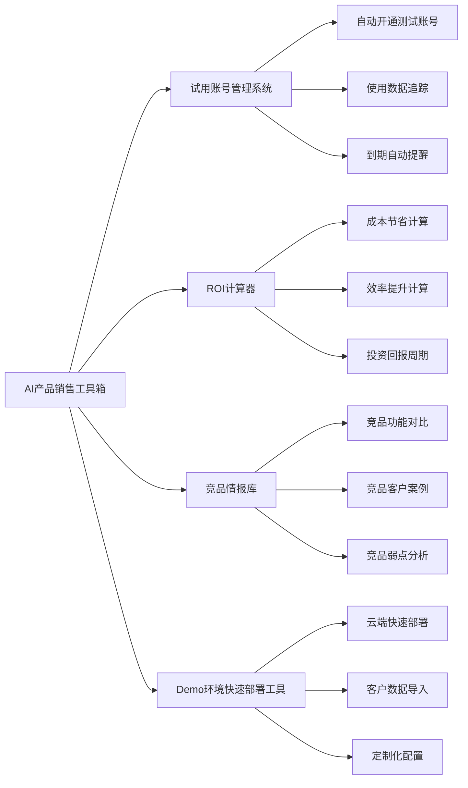

**中国特色销售工具：**

| 工具 | 功能 | 使用场景 | 2026年主流平台 |
|------|------|---------|---------------|
| **企业微信SCRM** | 客户关系管理、销售行为追踪 | 跟进B端客户、自动化营销 | 纷享销客、销售易、腾讯企点 |
| **飞书CRM** | 销售流程管理、团队协作 | 销售团队内部协作、客户信息共享 | 飞书CRM + 销售易集成 |
| **AI销售助手** | 智能话术推荐、客户意图分析 | 销售电话实时指导、邮件自动回复 | 纷享销客AI PaaS、销售易NeoAgent |
| **ROI计算器小程序** | 客户自助计算投资回报 | 初次接触客户、方案报价阶段 | 自研小程序 + 阿里云PAI模型 |

**案例：阿里云通义千问的销售工具体系**
- **在线体验平台**：客户可在官网直接体验通义千问的对话、文档理解、代码生成能力
- **API试用账号**：提供1000万Token免费额度，降低客户试用门槛
- **企业版ROI计算器**：输入客服工单量、人均处理时间，自动计算AI客服替代后的成本节省

### 2.3 培训体系（Sales Training）

AI产品销售培训需要分层设计：

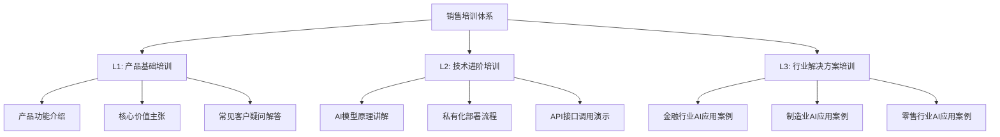

**培训内容设计：**

| 培训层级 | 培训对象 | 核心内容 | 考核标准 | 时长 |
|---------|---------|---------|---------|------|
| **L1: 基础培训** | 全体销售 | 产品定位、核心功能、价格体系、竞品对比 | 通过产品知识测试（80分以上） | 2天 |
| **L2: 技术培训** | 技术销售 | AI模型原理、API调用、私有化部署、安全合规 | 能独立完成产品Demo演示 | 3天 |
| **L3: 行业培训** | 行业销售 | 行业痛点、解决方案、标杆案例、ROI计算 | 能设计客户定制化方案 | 2天 |
| **L4: 异议处理** | 全体销售 | 常见客户疑虑、应对话术、成交技巧 | 角色扮演通过率100% | 1天 |

**2026年培训新模式：AI赋能销售培训**
- **AI模拟客户对话**：销售在系统中与AI模拟的客户对话，系统实时评分并给出改进建议
- **智能话术库**：纷享销客AI PaaS自动生成行业话术，销售可直接调用
- **视频学习 + AI问答**：销售观看培训视频后，向AI助手提问，巩固学习效果

---

## 3. 销售技术与策略

### 3.1 解决方案式销售（Solution Selling）

AI产品销售的核心是"卖解决方案，不是卖产品"。

**解决方案式销售流程：**

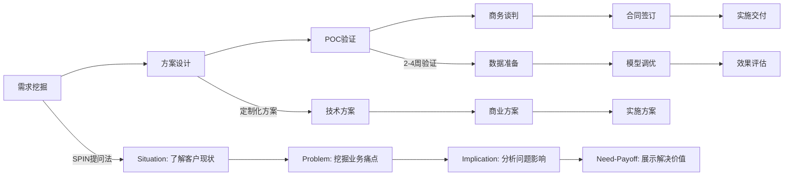

**SPIN提问法在AI产品销售中的应用：**

| SPIN阶段 | 提问示例 | 挖掘目标 |
|---------|---------|---------|
| **Situation（现状）** | "贵司目前客服团队规模是多少？日均处理工单量是多少？" | 了解客户基本情况 |
| **Problem（问题）** | "客服人员流失率高吗？培训成本如何？重复性问题占比多少？" | 挖掘业务痛点 |
| **Implication（影响）** | "如果客服响应慢，客户满意度会下降多少？会影响续费率吗？" | 放大问题严重性 |
| **Need-Payoff（价值）** | "如果AI客服能处理60%的重复性问题，每年能节省多少成本？" | 展示解决方案价值 |

**案例：百度文心在金融行业的解决方案式销售**
1. **需求挖掘**：某银行信用卡中心日均客服咨询量10万次，人工客服400人，年成本约4000万元
2. **方案设计**：部署文心智能客服，处理60%重复性问题（额度查询、还款提醒、积分兑换）
3. **POC验证**：选取1万次真实咨询数据，AI客服准确率达92%，客户满意度4.5/5
4. **价值量化**：年节省成本2400万元（400人×60%×15万/人/年），投资回报周期8个月
5. **合同签订**：3年合同，总金额1800万元

### 3.2 价值主张销售（Value Proposition Selling）

AI产品的价值主张必须量化，不能停留在"提升效率"的抽象描述。

**价值量化三板斧：**

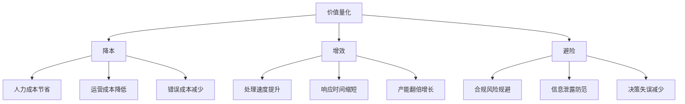

**价值量化公式：**

| 价值维度 | 计算公式 | AI产品应用场景 |
|---------|---------|---------------|
| **降本（Cost Saving）** | 年节省成本 = 替代人力数 × 人均年薪 | AI客服替代人工客服 |
| **增效（Efficiency Gain）** | 效率提升 = (AI处理速度 - 人工处理速度) / 人工处理速度 × 100% | AI内容生成（1分钟生成5000字文章 vs 人工2小时） |
| **避险（Risk Mitigation）** | 风险规避价值 = 潜在损失 × 风险发生概率 × AI降低概率 | AI风控系统降低金融欺诈损失 |

**中国AI产品常用价值主张：**

| AI产品类型 | 核心价值主张 | 量化指标 | 典型客户 |
|-----------|-------------|---------|---------|
| **AI客服** | 降低客服成本60%，7×24小时在线 | 年节省人力成本、客户满意度提升 | 电商、银行、保险 |
| **AI内容生成** | 内容生产效率提升5倍，保持品牌调性 | 日均产出文章数、人均创作时长 | 媒体、电商、广告 |
| **AI风控** | 欺诈识别准确率提升40%，减少损失 | 年度欺诈损失降低、误判率下降 | 金融、支付、电商 |
| **AI智能座舱** | 提升驾驶体验，增加车型溢价 | 用户满意度、复购率、品牌溢价 | 汽车制造 |
| **AI代码生成** | 开发效率提升30%，代码质量提升 | 人均代码产出、Bug率下降 | 软件开发、互联网 |

### 3.3 数据驱动销售（Data-Driven Selling）

AI产品销售团队必须善用CRM数据，实现销售预测和精准跟进。

**销售漏斗管理：**

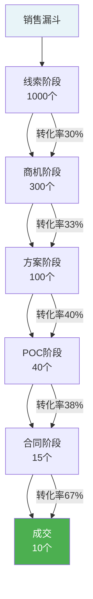

**2026年AI驱动的销售预测：**

| 预测维度 | 传统方法 | AI驱动方法 | 准确率提升 |
|---------|---------|-----------|-----------|
| **成交概率预测** | 销售主观判断 | 基于历史数据的机器学习模型 | +25% |
| **成交时间预测** | 经验估算 | 分析客户行为（邮件回复速度、Demo参与度） | +30% |
| **客户流失预警** | 季度回访 | 实时监控客户使用数据，异常行为预警 | +40% |
| **交叉销售推荐** | 人工推荐 | 基于客户画像的AI推荐 | +35% |

**案例：纷享销客AI销售预测系统**
据公开报道，2025年某B2B软件服务商使用纷享销客AI销售预测功能后：
- AI渠道销售线索量增长180%
- 高质量线索占比超40%
- 线索获取成本较其他渠道降低35%

### 3.4 竞争定位策略（Competitive Positioning）

中国AI大模型市场竞争激烈，2026年主要玩家包括：

| 厂商 | 代表产品 | 核心优势 | 目标客户 |
|------|---------|---------|---------|
| **阿里云** | 通义千问 | 电商场景深耕、云服务生态、API丰富 | 电商、零售、物流 |
| **百度** | 文心一言 | 搜索场景优势、企业服务经验、行业深度 | 金融、医疗、教育 |
| **腾讯** | 混元大模型 | 社交生态、企业微信集成、游戏场景 | 企业服务、游戏、社交 |
| **字节跳动** | 豆包大模型 | 内容生成优势、年轻用户触达、抖音生态 | 内容创作、营销、电商 |
| **讯飞** | 星火大模型 | 语音识别优势、教育场景深耕 | 教育、政务、医疗 |

**竞争定位策略：**

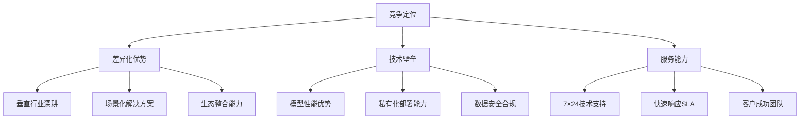

**竞品对比表示例（2026年数据）：**

| 对比维度 | 通义千问企业版 | 文心一言企业版 | ChatGPT企业版 |
|---------|--------------|--------------|--------------|
| **模型参数** | 720亿（Qwen-72B） | 650亿 | 1750亿（GPT-4） |
| **中文理解** | ★★★★★ | ★★★★★ | ★★★★ |
| **API价格** | ¥0.008/千Token | ¥0.012/千Token | ¥0.12/千Token（约$0.015） |
| **私有化部署** | 支持 | 支持 | 不支持 |
| **数据安全** | 数据不出境 | 数据不出境 | 数据存储海外 |
| **行业方案** | 电商、金融、制造 | 金融、医疗、教育 | 通用场景 |
| **SLA承诺** | 99.95% | 99.9% | 99.9% |

---

## 4. PM与销售团队协作

### 4.1 沟通机制

PM与销售团队的协作机制决定了产品市场反馈的速度和销售效率。

**协作框架：**

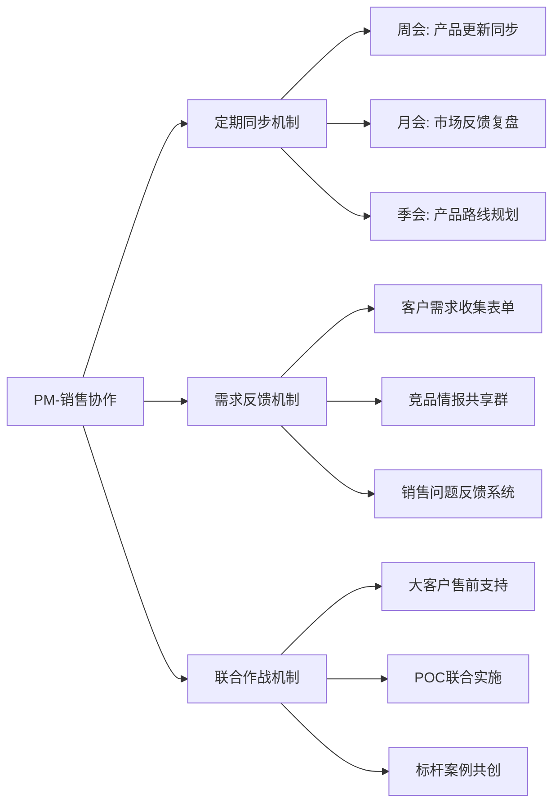

**协作机制设计：**

| 协作场景 | 频率 | 参与人 | 核心产出 | 工具支持 |
|---------|------|--------|---------|---------|
| **产品更新同步会** | 每周 | PM + 销售总监 + 技术销售 | 产品更新PPT、销售话术更新 | 飞书文档、腾讯会议 |
| **客户需求评审会** | 每两周 | PM + 销售代表 | 需求优先级排序、产品路线调整 | 飞书多维表格、TAPD |
| **大客户售前支持** | 按需 | PM + 技术销售 + 客户 | 定制化方案、技术演示 | 飞书群聊、腾讯会议 |
| **市场反馈复盘会** | 每月 | PM团队 + 销售团队 | 竞品分析、价格策略调整 | 飞书妙记、石墨文档 |

**2026年协作工具栈：**
- **飞书CRM + 销售易**：销售流程管理、客户信息共享
- **企业微信SCRM**：客户关系维护、销售行为追踪
- **飞书文档/腾讯文档**：产品资料共享、协作编辑
- **TAPD/Jira**：需求管理、功能排期透明化

### 4.2 参与销售过程

PM在关键销售节点的深度参与可显著提升成交率。

**PM参与销售的典型场景：**

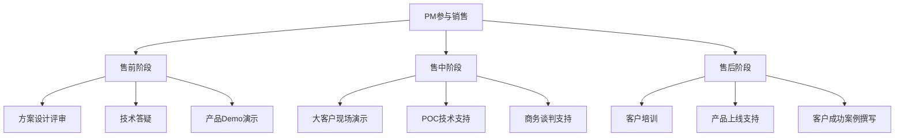

**PM在销售中的角色定位：**

| 销售阶段 | PM角色 | 核心任务 | 成功标准 |
|---------|--------|---------|---------|
| **售前（Pre-Sales）** | 技术顾问 | 解答客户技术疑问、评估需求可行性 | 客户技术疑虑消除 |
| **方案设计** | 方案架构师 | 设计定制化技术方案、评估实施难度 | 方案通过客户技术评审 |
| **POC验证** | 技术支持 | 数据准备、模型调优、效果评估 | POC通过率≥90% |
| **商务谈判** | 产品专家 | 解释产品路线规划、承诺功能交付 | 客户对产品信心提升 |
| **售后交付** | 交付顾问 | 产品培训、上线支持、问题解决 | 客户满意度≥4.5/5 |

**案例：阿里云通义千问PM参与大客户销售**
某头部电商平台要采购AI客服系统，阿里云PM团队深度参与：
1. **售前阶段**：PM现场讲解通义千问在电商场景的NLP模型优化（商品推荐、订单查询、售后处理）
2. **POC阶段**：PM团队用客户真实数据训练模型，准确率从82%提升至94%
3. **商务谈判**：PM承诺3个月内上线"智能商品推荐"功能，打消客户疑虑
4. **结果**：成功签约3年合同，总金额2800万元

### 4.3 案例共创

PM与销售联合打造客户成功案例，形成销售飞轮。

**案例共创流程：**

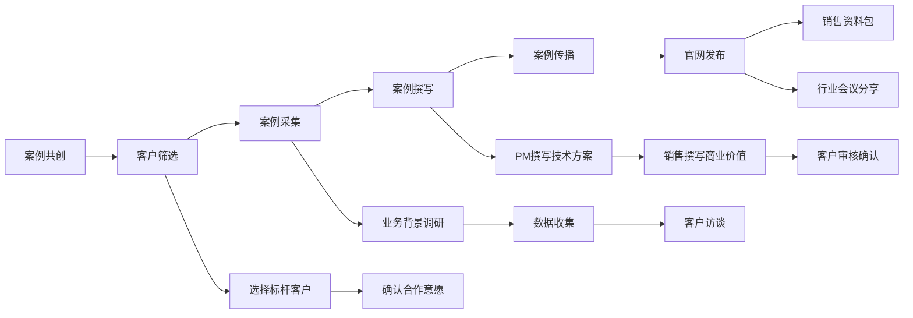

**成功案例的关键要素：**

| 案例要素 | 内容要求 | 示例（AI客服案例） |
|---------|---------|------------------|
| **客户背景** | 行业地位、业务规模、团队规模 | "某头部保险公司，年保费收入500亿，客服团队800人" |
| **业务痛点** | 具体问题、量化影响 | "日均客服咨询10万次，人工响应时间平均5分钟，客户满意度3.8/5" |
| **解决方案** | 技术方案、实施周期 | "部署通义千问智能客服，3个月上线，处理60%重复性问题" |
| **量化效果** | 数据对比、ROI计算 | "客服响应时间降至30秒，满意度提升至4.6/5，年节省成本3600万" |
| **客户评价** | 客户原话引用 | "AI客服不仅降低成本，还提升了客户体验"——某保险公司CIO |

**2026年案例传播新渠道：**
- **官网案例库**：分行业、分场景展示客户案例
- **短视频平台**：抖音、视频号发布客户访谈视频
- **行业白皮书**：与艾瑞咨询、IDC等机构联合发布行业报告
- **客户直播间**：邀请客户在线分享AI产品应用经验

---

## 5. 中国AI产品销售实战

### 5.1 案例一：阿里云通义千问 — 汽车行业智能座舱销售

**客户背景：**
某新能源汽车厂商，年销量50万辆，计划在2026年新车型中搭载AI智能座舱。

**销售策略：**

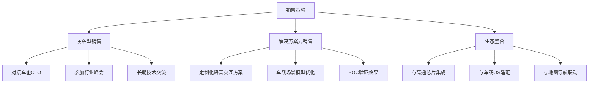

**销售过程：**
1. **关系建立（3个月）**：阿里云销售通过行业峰会认识车企CTO，PM团队定期分享AI在汽车行业的最新应用
2. **需求挖掘（2个月）**：通过SPIN提问法发现痛点：现有语音交互识别率仅75%，用户抱怨多
3. **方案设计（1个月）**：PM设计车载场景专属模型，优化方言识别、噪音环境识别
4. **POC验证（2个月）**：在真实车载环境测试，识别率提升至92%，唤醒速度从2秒降至0.5秒
5. **商务谈判（1个月）**：承诺持续模型优化，提供7×24技术支持
6. **合同签订**：3年合作，总金额5000万元

**量化效果：**
- 语音识别准确率从75%提升至92%
- 用户满意度从3.5/5提升至4.7/5
- 车型溢价增加8000元/辆

**据公开报道**，阿里云通义千问已与宝马、小鹏、极氪、零跑等车企达成智能座舱合作。

### 5.2 案例二：百度文心 — 金融行业智能风控销售

**客户背景：**
某股份制银行，年信贷规模2000亿元，面临信用卡欺诈损失问题。

**销售策略：**

| 销售阶段 | 策略 | 具体行动 | 时长 |
|---------|------|---------|------|
| **线索获取** | 行业会议营销 | 在金融科技大会展示AI风控能力 | 1个月 |
| **需求挖掘** | 数据驱动销售 | 分析银行公开财报，发现欺诈损失达2亿/年 | 2周 |
| **方案设计** | 价值主张销售 | 承诺欺诈识别准确率提升40%，年减损8000万 | 1个月 |
| **POC验证** | 联合实施 | PM团队用10万笔历史交易数据训练模型 | 3个月 |
| **商务谈判** | 多层决策渗透 | 分别对接技术部、风控部、合规部、高层 | 2个月 |
| **合同签订** | 安全合规保障 | 提供私有化部署方案，数据不出行 | 1个月 |

**销售过程亮点：**
1. **价值量化**：ROI计算器显示，AI风控系统投入2000万，年减损8000万，投资回报周期3个月
2. **POC验证**：在10万笔真实交易数据上，AI模型识别出98%的欺诈交易，误判率仅2%
3. **多层决策**：技术部关注模型性能，风控部关注业务效果，合规部关注数据安全，高层关注ROI

**合同结果：**
3年合同，总金额6000万元，包含模型持续优化、7×24技术支持、季度业务复盘。

**据公开报道**，百度文心大模型已在金融、医疗、教育等行业探索应用场景，月活用户数突破2亿（截至2026年）。

### 5.3 案例三：腾讯混元 — 企业服务市场销售

**客户背景：**
某大型制造企业，员工5万人，希望搭建企业内部知识库问答系统。

**销售策略：**

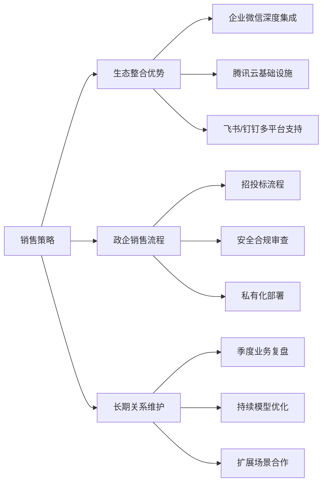

**销售过程：**
1. **生态切入**：企业已使用企业微信，腾讯销售从企业微信客户经理获得引荐
2. **需求挖掘**：企业内部制度文档10万份，员工查找效率低，HR每月接到3000次咨询
3. **方案设计**：部署腾讯混元企业知识库，接入企业微信，员工可在聊天窗口直接提问
4. **POC验证**：导入5000份制度文档，问答准确率达88%，HR咨询量下降70%
5. **招投标流程**：配合客户完成安全合规审查、私有化部署方案评审
6. **合同签订**：3年合同，总金额1500万元

**量化效果：**
- HR人工咨询量下降70%（从3000次/月降至900次/月）
- 员工查找制度文档时间从平均30分钟降至2分钟
- 员工满意度从3.2/5提升至4.4/5

**据公开报道**，腾讯混元大模型已支持腾讯内部700余个业务场景，并在2025年腾讯全球数字生态大会上推出覆盖30多个垂直行业的解决方案。

---

## 核心术语表

| 中文术语 | English | 定义 |
|---------|---------|------|
| **销售赋能** | Sales Enablement | 为销售团队提供工具、资料、培训，提升销售效率 |
| **解决方案式销售** | Solution Selling | 以客户业务痛点为导向，提供定制化解决方案 |
| **价值主张** | Value Proposition | 产品为客户带来的核心价值，需量化表达 |
| **SPIN提问法** | SPIN Selling | Situation、Problem、Implication、Need-Payoff四阶段提问法 |
| **ROI** | Return on Investment | 投资回报率 = (收益 - 成本) / 成本 × 100% |
| **POC** | Proof of Concept | 概念验证，用真实数据验证产品效果 |
| **销售漏斗** | Sales Funnel | 从线索到成交的销售阶段转化模型 |
| **客户画像** | Customer Persona | 基于数据分析的客户特征、需求、行为模型 |
| **关系型销售** | Relationship Selling | 中国特色销售方式，强调长期关系维护 |
| **多层决策** | Multi-Level Decision | 企业采购涉及技术层、业务层、高层多层决策 |
| **CRM** | Customer Relationship Management | 客户关系管理系统（如纷享销客、销售易） |
| **SCRM** | Social CRM | 社交化客户关系管理（如企业微信SCRM） |
| **SLA** | Service Level Agreement | 服务等级协议（如99.9%可用性） |
| **私有化部署** | On-Premise Deployment | 软件部署在客户自有服务器，数据不出库 |

---

## 关键要点

1. **AI产品销售的独特挑战**：技术复杂度高、价值证明困难、决策周期长，需要PM深度参与
2. **销售赋能体系**：技术白皮书、ROI计算器、Demo视频库、竞品对比表、AI销售助手
3. **解决方案式销售**：SPIN提问法挖掘需求，设计定制化方案，POC验证效果
4. **价值主张量化**：降本、增效、避险三板斧，必须用数据说话（如"降低成本60%"）
5. **数据驱动销售**：CRM数据分析、销售漏斗管理、AI销售预测，提升成交率
6. **PM-销售协作**：周会同步、需求反馈、大客户售前支持、案例共创
7. **中国特色销售**：关系型销售、多层决策、招投标流程、私有化部署
8. **2026年AI销售工具**：纷享销客AI PaaS、销售易NeoAgent、企业微信SCRM、飞书CRM

---

## 自测题

### 1. AI产品销售与传统软件销售的核心区别是什么？请列举3点并说明应对策略。

<details>
<summary>点击查看答案</summary>

**核心区别与应对策略：**

1. **技术复杂度高**
   - **区别**：AI产品需要解释模型原理、训练数据、推理性能，而传统软件只需演示功能
   - **应对策略**：准备技术白皮书、PM参与技术答疑、设计分层培训体系（L1基础、L2技术、L3行业）

2. **价值证明困难**
   - **区别**：AI产品效果因场景而异，难以标准化承诺，需要POC验证
   - **应对策略**：价值量化三板斧（降本、增效、避险），设计ROI计算器，用客户真实数据POC验证

3. **决策周期长**
   - **区别**：AI产品涉及多部门决策（技术、业务、合规、高层），周期可达6-18个月
   - **应对策略**：多层决策渗透（技术选型层、采购决策层、高层战略层），分别准备针对性材料

4. **数据安全疑虑**（额外补充）
   - **区别**：AI产品需要客户数据训练模型，客户担心数据泄露
   - **应对策略**：提供私有化部署方案、数据不出库承诺、通过等保三级认证

</details>

---

### 2. 设计一个AI客服产品的ROI计算器，需要收集客户哪些数据？如何计算年度成本节省？

<details>
<summary>点击查看答案</summary>

**ROI计算器设计：**

**需要收集的客户数据：**
1. **人力成本数据**
   - 当前客服团队规模（人数）
   - 人均年薪（含五险一金）
   - 客服人员年流失率
   - 新员工培训成本

2. **业务数据**
   - 日均客服咨询量（次/天）
   - 人工处理平均时长（分钟/次）
   - 重复性问题占比（%）
   - 客户满意度（当前）

3. **成本数据**
   - 客服系统年费用
   - 办公场地成本（工位/人）
   - 管理成本（主管、质检）

**年度成本节省计算公式：**

```
年度成本节省 = 减少人力成本 + 减少培训成本 + 减少场地成本 - AI系统投入

其中：
减少人力成本 = 替代人数 × 人均年薪
替代人数 = 当前客服人数 × AI可处理问题占比 × 效率系数

效率系数 = AI处理速度 / 人工处理速度
```

**示例计算：**
- 当前客服：400人，人均年薪15万（含五险一金）
- 日均咨询：10万次，重复性问题占比60%
- AI客服可处理60%问题，处理速度是人工5倍

```
替代人数 = 400 × 60% × (5/5) = 240人
减少人力成本 = 240 × 15万 = 3600万元/年
AI系统投入 = 1200万元（3年分摊400万/年）
年度净节省 = 3600万 - 400万 = 3200万元
投资回报周期 = 1200万 / 3200万 = 4.5个月
```

</details>

---

### 3. 在阿里云通义千问的汽车行业案例中，PM在哪些销售节点提供了关键支持？分析其作用。

<details>
<summary>点击查看答案</summary>

**PM在销售中的关键支持节点：**

| 销售节点 | PM支持行为 | 作用分析 |
|---------|-----------|---------|
| **关系建立期** | 定期分享AI在汽车行业的最新应用 | **建立专业信任**：展示技术深度，让客户认为阿里云是AI领域专家 |
| **需求挖掘期** | 与销售一起参与客户访谈 | **发现真实痛点**：从技术视角理解"语音识别率75%"的技术原因 |
| **方案设计期** | PM设计车载场景专属模型 | **差异化竞争**：定制化方案比通用方案更有说服力 |
| **POC验证期** | PM团队优化方言识别、噪音环境识别 | **证明产品能力**：识别率从75%提升至92%，用数据打消客户疑虑 |
| **商务谈判期** | PM承诺持续模型优化、7×24技术支持 | **降低客户风险**：承诺长期服务，增强客户信心 |
| **售后交付期** | PM提供产品培训、上线支持 | **确保客户成功**：提升客户满意度，为续约和口碑传播打基础 |

**核心作用总结：**
1. **技术背书**：PM的专业性让客户相信产品技术实力
2. **方案定制**：PM理解客户业务场景，设计针对性解决方案
3. **效果验证**：PM在POC阶段调优模型，用数据证明产品价值
4. **风险承诺**：PM承诺持续优化和技术支持，降低客户决策风险

**关键启示：**
在AI产品这类技术复杂、需求多样的场景中，PM不是"产品交付者"，而是"解决方案架构师"，必须深度参与销售全流程。

</details>

---

### 4. 纷享销客和销售易在2026年推出了哪些AI销售助手功能？这些功能如何提升销售效率？

<details>
<summary>点击查看答案</summary>

**纷享销客AI PaaS平台功能（2026年）：**

| 功能模块 | 具体功能 | 销售效率提升 |
|---------|---------|-------------|
| **AI文案生成** | 根据客户行业自动生成定制化产品介绍、邮件、话术 | 减少销售准备时间70%（从1小时降至20分钟） |
| **智能话术推荐** | 基于CRM历史数据推荐高转化话术 | 成交率提升25%（据2025年某B2B服务商数据） |
| **客户画像系统** | 自动分析客户需求、决策偏好、购买意向 | 线索质量提升40%，减少无效跟进 |
| **销售预测** | 基于客户行为数据预测成交概率和时间 | 预测准确率提升30%，优化资源分配 |
| **智能体设计器** | 企业可用自然语言配置专属AI助手 | 降低AI应用门槛，中小企业也能用AI销售 |

**销售易NeoAgent六大垂直智能体：**

| 智能体类型 | 功能 | 应用场景 |
|-----------|------|---------|
| **线索智能体** | 自动线索分级、潜客推荐 | 市场部线索分发给销售 |
| **客户智能体** | 客户画像分析、流失预警 | 销售团队客户维护 |
| **商机智能体** | 成交概率预测、跟进提醒 | 销售漏斗管理 |
| **营销智能体** | 营销素材生成（话术、邮件、海报） | 市场活动策划 |
| **服务智能体** | 客户问题分类、智能工单分配 | 售后服务团队 |
| **分析智能体** | 销售数据分析、趋势预测 | 销售管理层决策 |

**效率提升量化数据（据公开报道）：**
- **AI渠道线索量增长180%**（2025年某B2B软件服务商）
- **高质量线索占比超40%**（被销售认定为有效线索）
- **线索获取成本降低35%**（相比其他渠道）
- **销售人均产出提升30%**（CRM厂商平均数据）

**关键启示：**
2026年AI销售工具已从"辅助工具"进化为"智能协作伙伴"，销售人员可专注于高价值客户关系维护，重复性工作由AI完成。

</details>

---

### 5. 在中国B2B AI产品销售中，"多层决策"是什么意思？如何针对不同决策层设计销售策略？

<details>
<summary>点击查看答案</summary>

**多层决策定义：**
中国大中型企业采购AI产品时，通常涉及4层决策人，每层关注点不同，需要分别攻克。

**多层决策结构与应对策略：**

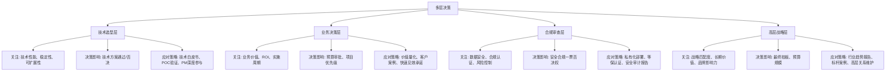

**针对性销售策略设计：**

| 决策层 | 典型角色 | 关注问题 | 销售资料 | 沟通策略 |
|-------|---------|---------|---------|---------|
| **技术选型层** | CTO、技术总监、架构师 | "模型性能如何？能否私有化部署？" | 技术白皮书、API文档、架构图 | PM深度参与技术交流，POC验证 |
| **业务决策层** | 业务VP、部门总监 | "能解决什么业务问题？ROI多少？" | 客户案例、ROI计算器、实施方案 | 价值量化、快速见效承诺 |
| **合规审查层** | 安全总监、法务、合规 | "数据是否安全？是否符合监管？" | 等保认证、安全审计报告、隐私协议 | 私有化部署、数据不出库承诺 |
| **高层战略层** | CEO、CFO | "战略匹配度？长期价值？品牌影响？" | 行业趋势报告、标杆案例、竞争分析 | 高层关系维护、行业峰会演讲 |

**典型销售流程时间分配：**
1. **技术选型层**（1-2个月）：技术交流、POC验证、技术方案评审
2. **业务决策层**（1个月）：业务价值论证、预算申请
3. **合规审查层**（1-2个月）：安全评审、合规审查、法务审核
4. **高层战略层**（2周-1个月）：高层汇报、最终决策

**案例：百度文心在某银行的多层决策应对**
- **技术层**：PM团队演示AI风控模型，识别准确率98%，通过技术评审
- **业务层**：风控部门计算年减损8000万，推动预算审批
- **合规层**：提供私有化部署方案，数据不出行，通过安全审查
- **高层**：CEO看到同业标杆案例（某国有大行AI风控），最终拍板6000万合同

**关键启示：**
中国B2B销售不是"单点突破"，而是"多点协同"，销售团队需要针对不同决策层准备不同材料，PM、售前、销售、高层需协同作战。

</details>

---

## 实践练习

### 练习1：设计AI产品销售资料包

**场景：**
你是某AI代码生成工具（类似GitHub Copilot）的产品经理，公司计划进入中国市场，目标客户是大中型互联网公司和软件开发企业。

**任务：**
设计一套完整的销售资料包，包含：
1. 技术白皮书目录（列出章节和核心内容）
2. 客户案例模板（设计案例结构和关键指标）
3. ROI计算器设计（列出输入参数和计算公式）
4. 竞品对比表（对比GitHub Copilot、通义灵码、文心快码）

**输出要求：**
- 技术白皮书：包含模型架构、代码生成准确率、支持语言、API文档
- 客户案例：包含客户背景、痛点、解决方案、量化效果
- ROI计算器：量化"开发效率提升30%"对应的成本节省
- 竞品对比：功能、性能、价格、数据安全、本地化支持

---

### 练习2：设计PM-销售协作机制

**场景：**
你所在的AI产品团队（30人）与销售团队（50人）协作不畅，存在以下问题：
- 销售不了解产品新功能，客户问到时答不上来
- PM不知道客户真实需求，闭门造车
- 大客户售前支持响应慢，PM临时被拉去讲解，准备不足

**任务：**
设计一套PM-销售协作机制，包括：
1. 定期沟通会议（频率、参与人、议题、产出）
2. 需求反馈流程（客户需求如何从销售传递给PM）
3. 大客户售前支持机制（PM如何高效参与售前）
4. 协作工具选型（推荐2-3个工具及使用场景）

**输出要求：**
- 设计周会、月会、季度会的议题和产出
- 绘制需求反馈流程图（从销售收集需求→PM评审→产品路线规划）
- 设计售前支持SLA（客户提出技术问题→PM响应时间≤4小时）
- 推荐飞书、企业微信、TAPD等工具的使用场景

---

### 练习3：模拟AI产品销售场景

**场景：**
你是阿里云通义千问的销售，客户是某头部零售企业（年营收500亿，员工2万人），客户希望用AI提升客服效率。

**客户信息：**
- 当前客服团队：600人
- 日均客服咨询：15万次
- 人工响应时间：平均8分钟
- 客户满意度：3.5/5
- 客户疑虑：担心AI客服答非所问，影响客户体验

**任务：**
使用SPIN提问法设计销售对话，包括：
1. **Situation（现状问题）**：了解客户当前客服运营情况
2. **Problem（痛点挖掘）**：挖掘客服团队的具体痛点
3. **Implication（影响放大）**：分析痛点对业务的影响
4. **Need-Payoff（价值展示）**：展示AI客服的解决价值

**输出要求：**
- 每个阶段设计3-5个问题
- 设计AI客服的价值主张（量化降本、增效、避险）
- 设计POC验证方案（如何用客户真实数据验证效果）
- 计算ROI（AI客服投入 vs 年度成本节省）

---

**学习建议：**
- 完成练习后，与同事或同学进行角色扮演，模拟真实销售场景
- 参考阿里云、百度、腾讯官网的客户案例，学习如何撰写商业案例
- 关注纷享销客、销售易的产品更新，了解最新AI销售工具

---

**下一步学习：**
[Note 71: 上市策略 | Go-to-Market Strategy](71-go-to-market-strategy.md) — 学习AI产品的市场定位、渠道策略、推广策略，打造从0到1的市场增长飞轮。