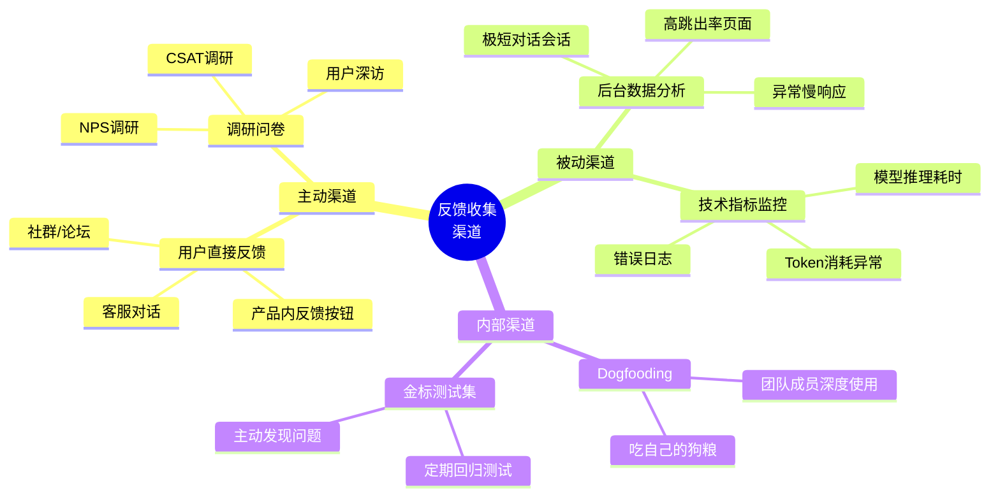
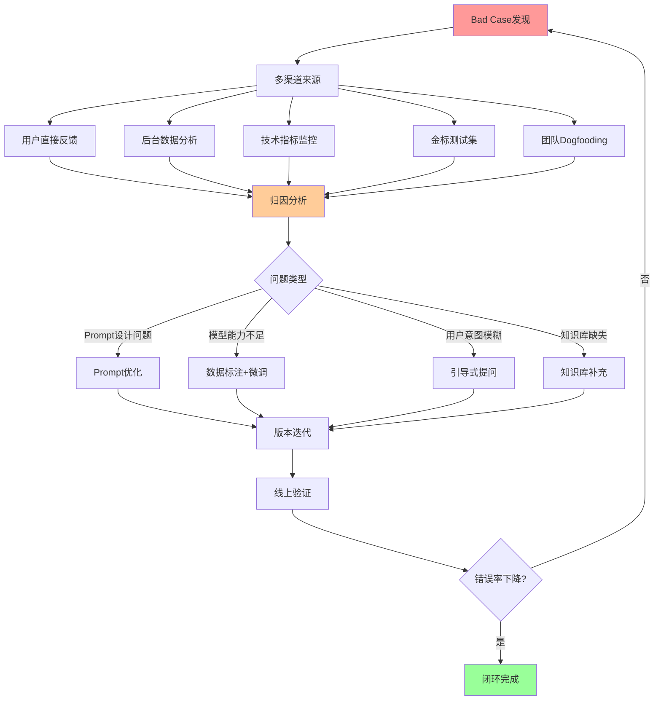
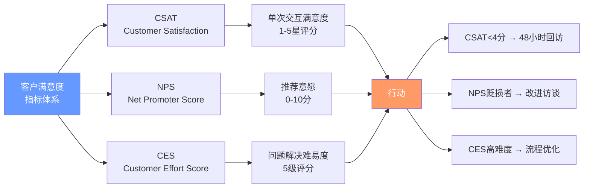
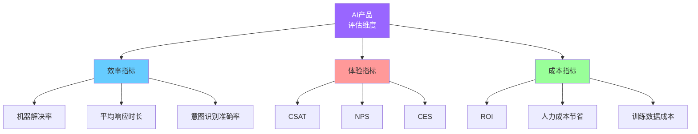
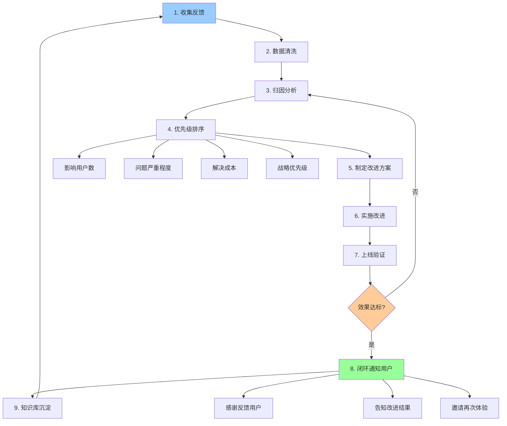
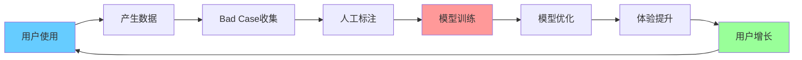
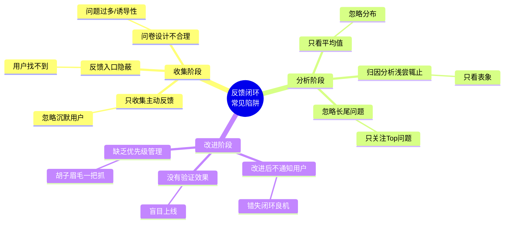
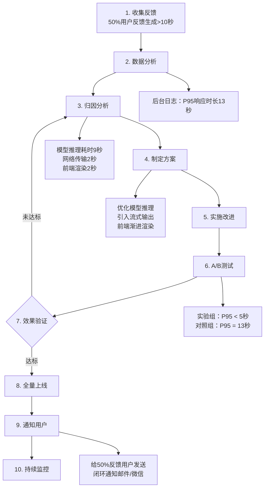
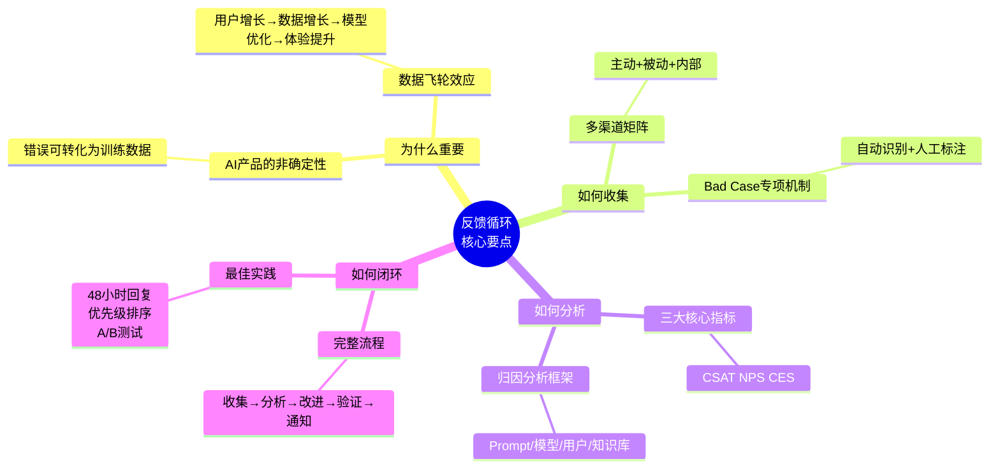

# 74 - 反馈循环 | Feedback Loop

## 学习目标 (Learning Objectives)

完成本节学习后，你将能够：
- 设计多渠道客户反馈收集机制
- 建立AI产品专属的Bad Case收集体系
- 实现从反馈到优化的闭环流程
- 运用数据驱动方法改进产品体验

---

## 一、为什么反馈循环是AI产品的生命线？

### 1.1 传统软件 vs AI产品的反馈差异

| 维度 | 传统软件 | AI产品 |
|------|---------|--------|
| **错误类型** | 确定性Bug（空指针、逻辑错误） | 非确定性问题（幻觉、理解偏差、Bad Case） |
| **修复方式** | 代码修复 → 测试 → 上线 | 数据标注 → 模型训练 → 验证 → 上线 |
| **反馈价值** | 发现问题 | 发现问题 + **成为训练数据** |
| **优化周期** | 周/月级别 | **日/小时级别**（模型可持续学习） |
| **用户容忍度** | 低（Bug必须修复） | 中（可容忍5-10%错误率） |

**关键洞察**：[据人人都是产品经理2026年文章](https://www.woshipm.com/ai/6334311.html)，优秀AI产品团队能够**将错误变成高质量训练数据**，形成"线上发现 → 归因分析 → 人工修正 → 模型训练 → 上线验证"的完整闭环，使同样场景下的错误率持续下降。

### 1.2 2026年AI客服反馈闭环的成效数据

[据AI客服行业报告](https://www.udesk.cn/ucm/faq/66945)，2026年中国领先企业的AI客服系统已实现：

| 指标 | 2024年基线 | 2026年现状 | 提升幅度 |
|------|----------|----------|---------|
| **意图识别准确率** | 75-80% | **>90%** | +12-20% |
| **常见问题独立解决率** | 60-70% | **>90%** | +25-33% |
| **客服响应效率** | 基线 | **+50%** | - |
| **客户等待时长** | 平均5分钟 | **平均30秒** | -90% |
| **客户满意度(CSAT)** | 基线 | **+30%** | - |

**核心驱动力**：持续的反馈闭环机制 + 模型微调能力。

---

## 二、反馈收集：如何听到用户的真实声音？

### 2.1 多渠道反馈收集矩阵



### 2.2 中国企业常用反馈工具生态 (2026)

| 工具类型 | 代表产品 | 核心功能 | 适用场景 |
|---------|---------|---------|---------|
| **用户反馈社区** | [腾讯兔小巢](https://txc.qq.com) | 微信生态集成、反馈分类、投票 | 小程序/公众号/H5产品 |
| **智能客服系统** | [网易七鱼](https://www.qiyukf163.cn) | AI问答、工单管理、全渠道接入 | 企业级客服场景 |
| | 美洽、Udesk | 在线客服、客户画像、CRM集成 | 中小型企业 |
| **问卷调研** | 问卷星、金数据 | NPS/CSAT调研、数据分析 | 定期满意度调研 |
| | 腾讯问卷、表单大师 | 微信生态集成、自动化触发 | 快速反馈收集 |
| **用户行为分析** | 神策分析、GrowingIO | 行为埋点、归因分析、留存分析 | 数据驱动决策 |

**实战案例**：[腾讯兔小巢](https://txc.qq.com)支持**微信回复通知**，用户无需关注公众号就能收到产品经理的回复，大幅提升反馈响应率；同时可通过[腾讯轻联](https://qinglian.tencent.com)与企业微信、CRM、OA系统无代码集成，实现反馈自动流转。

### 2.3 AI产品专属的Bad Case收集机制



**关键流程**（[据人人都是产品经理实践](https://www.woshipm.com/ai/6334311.html)）：

1. **数据采集与监控**：
   - 行为埋点设计（用户路径中的关键行为点）
   - 日志实时上报（对话轮次、响应时长、用户满意度评分）

2. **行为验证与归因**：
   - 使用标签体系对错误行为归因
   - 分类：Prompt问题、模型能力不足、用户意图模糊、知识库缺失

3. **版本迭代**：
   - Prompt微调（调整引导语、Few-shot示例）
   - 模型训练（将Bad Case标注后加入训练集）
   - 知识库更新（补充缺失的FAQ）

---

## 三、反馈分析：从数据到洞察

### 3.1 客户满意度三大核心指标



| 指标 | 计算公式 | 优秀标准 (2026) | 改进措施触发条件 |
|------|---------|---------------|---------------|
| **CSAT** | (满意+非常满意) / 总反馈数 × 100% | **>85%** | 单项 <4分 → 48小时回访 |
| **NPS** | 推荐者% - 贬损者% | **>50** | 贬损者(0-6分) → 改进访谈 |
| **CES** | (非常容易+容易) / 总反馈数 × 100% | **>75%** | 困难/非常困难 → 流程优化 |

**2026年行业标杆**：[据客服行业报告](https://www.udesk.cn/ucm/faq/66945)，某头部电商平台通过AI客服优化，**NPS从7.2提升至8.9**，同时接待效率提升50%，营销转化率提升25%。

### 3.2 AI产品专属的评估维度



**关键指标定义**：

1. **机器解决率** = 无需人工介入的对话数 / 总对话数 × 100%
   - 行业优秀标准：**>90%** （[据AI客服报告](https://www.udesk.cn/ucm/faq/66945)）

2. **意图识别准确率** = 正确识别用户意图的次数 / 总次数 × 100%
   - 2026年领先水平：**>90%** （相比2024年75-80%提升显著）

3. **平均响应时长**：从用户提问到给出答案的时间
   - 2024年基线：5分钟
   - 2026年优秀水平：**30秒** （[据行业报告](https://www.udesk.cn/ucm/faq/66945)）

### 3.3 Bad Case归因分析框架

| 问题类型 | 典型表现 | 归因方法 | 解决方案 | 验证指标 |
|---------|---------|---------|---------|---------|
| **Prompt设计问题** | 输出格式不符预期 | A/B测试不同Prompt | 优化引导语、Few-shot示例 | 格式正确率 |
| **模型能力不足** | 垂直领域知识错误 | 金标测试集验证 | 标注数据 + 微调 | 领域准确率 |
| **用户意图模糊** | "帮我推荐一个" | 用户行为日志分析 | 引导式多轮对话 | 意图识别率 |
| **知识库缺失** | 频繁回答"不知道" | 高频问题统计 | 补充FAQ/文档 | 命中率提升 |
| **上下文丢失** | 多轮对话答非所问 | 会话日志回放 | 改进上下文管理 | 多轮成功率 |

---

## 四、反馈闭环：从洞察到改进

### 4.1 完整的反馈闭环流程



**关键环节说明**：

1. **数据清洗**（步骤2）：
   - 去除无效反馈（灌水、广告）
   - 合并重复问题
   - 标准化描述

2. **优先级排序**（步骤4）公式：
   ```
   优先级得分 = (影响用户数 × 0.4) + (严重程度 × 0.3) + (战略优先级 × 0.2) - (解决成本 × 0.1)
   ```

3. **闭环通知用户**（步骤8）**极其重要**：
   - 48小时内回复反馈者
   - 改进上线后第一时间通知
   - **据实践经验**，用户被闭环通知后，NPS平均提升1.5-2分

### 4.2 AI产品的"数据飞轮"效应



**2026年关键趋势**（[据36氪报道](https://36kr.com/p/3578453650479235)）：**能否通过应用与合作伙伴形成持续的数据反馈闭环，将成为拉开AI产品差距的关键**。

头部企业正将AI智能体深度嵌入办公套件，实现"邮件摘要 → 日程规划 → 任务执行"的端到端闭环，每一次用户交互都成为模型优化的训练数据。

### 4.3 三大行业案例 (2026)

#### 案例1：跨境电商AI客服反馈闭环

**背景**：某跨境电商平台部署AI客服系统

**反馈机制**：
- 每次对话结束后弹出5星满意度评分
- <4分自动触发人工客服介入
- 每周汇总Top 10高频问题

**改进成果**（[据智能客服报告](https://insight.xiaoduoai.com/manage/2026-ai-customer-service-system-ultimate-selection-guide-with-12-detailed-comparison-tables.html)）：
- **客服响应效率提升50%**
- **客户满意度提升30%**
- 人力成本节省40%

#### 案例2：金融企业客户分层管理

**背景**：某金融企业AI客服系统

**反馈机制**：
- 基于客户价值分层（白金/黄金/普通）
- 白金客户 <4分 → 30分钟内人工回访
- 普通客户 <3分 → 24小时内回访

**改进成果**（[据智能客服案例](https://www.hollycrm.com/innews/7880.html)）：
- **客户满意度提升30%**
- 白金客户留存率提升15%
- NPS提升至行业前10%

#### 案例3：头部电商平台全链路优化

**背景**：某头部电商平台AI客服系统

**反馈机制**：
- 全渠道数据整合（App、小程序、网页、客服热线）
- 实时监控+每日复盘会
- 双周迭代（模型微调+知识库更新）

**改进成果**（[据行业报告](https://www.udesk.cn/ucm/faq/66945)）：
- 接待效率提升**50%**
- 营销转化率提升**25%**
- **NPS从7.2提升至8.9**

---

## 五、反馈闭环的常见陷阱与最佳实践

### 5.1 常见陷阱



| 陷阱 | 表现 | 后果 | 最佳实践 |
|------|------|------|---------|
| **只收集主动反馈** | 只看用户评分/留言 | 沉默用户的问题被忽略 | 结合行为数据分析（跳出率、完成率） |
| **反馈入口隐蔽** | 用户找不到反馈按钮 | 收集样本偏差 | 关键页面固定悬浮按钮 |
| **只看平均值** | CSAT 4.2分就满足 | 忽略20% <3分的极差体验 | 查看分布，重点关注低分用户 |
| **改进后不通知** | 默默修复Bug | 用户不知道被重视 | 48小时内回复，改进后再次通知 |
| **缺乏优先级** | 所有问题同时改 | 资源分散，效果不明显 | 使用优先级评分公式排序 |

### 5.2 最佳实践清单

#### ✅ 收集阶段
- [ ] 多渠道覆盖（主动反馈 + 被动数据 + 内部Dogfooding）
- [ ] 反馈入口明显（关键页面悬浮按钮）
- [ ] 问卷设计合理（5题以内，有开放题）
- [ ] 自动化触发（对话结束自动弹出满意度评分）

#### ✅ 分析阶段
- [ ] 查看数据分布而非只看均值
- [ ] 深度归因分析（Prompt/模型/用户/知识库）
- [ ] 关注长尾问题（虽频次低但可能严重）
- [ ] 定期复盘会（周会/双周会）

#### ✅ 改进阶段
- [ ] 使用优先级公式排序
- [ ] A/B测试验证效果
- [ ] 48小时内回复反馈用户
- [ ] 改进上线后主动通知
- [ ] 沉淀到知识库/FAQ

#### ✅ AI产品专属
- [ ] Bad Case自动收集（对话<2轮、用户评分<3分）
- [ ] 每周训练数据回流（标注Bad Case → 模型微调）
- [ ] 金标测试集回归（每次上线前跑一遍）
- [ ] 监控模型drift（准确率下降→及时预警）

---

## 六、实战工具与模板

### 6.1 反馈收集问卷模板（NPS+CSAT+开放题）

```markdown
### AI写作助手满意度调研

**1. 您有多大可能向朋友/同事推荐我们的AI写作助手？**
□ 0 □ 1 □ 2 □ 3 □ 4 □ 5 □ 6 □ 7 □ 8 □ 9 □ 10
（0=完全不可能，10=非常可能）

**2. 您对本次使用的满意度？**
□ 非常满意 □ 满意 □ 一般 □ 不满意 □ 非常不满意

**3. 您觉得AI写作助手最需要改进的地方是？**（多选）
□ 生成速度太慢
□ 内容质量不高
□ 不理解我的意图
□ 格式不符合要求
□ 其他：__________

**4. 请描述一次让您印象深刻的使用体验（好/坏都可以）**
[开放文本框]

**5. 您的职业/行业？**
□ 市场营销 □ 内容创作 □ 产品经理 □ 学生 □ 其他：____
```

### 6.2 Bad Case归因分析表

| Bad Case ID | 用户输入 | AI输出 | 期望输出 | 问题类型 | 归因分析 | 改进方案 | 负责人 | 预计完成 |
|------------|---------|--------|---------|---------|---------|---------|--------|---------|
| BC-2026-001 | "帮我写个推广方案" | 通用模板（无针对性） | 询问产品信息后再生成 | 用户意图模糊 | Prompt缺少引导式提问 | 增加澄清问题环节 | 张三 | 2026-02-05 |
| BC-2026-002 | "生成一篇关于量子计算的文章" | 出现事实性错误 | 准确的科技内容 | 知识库缺失 | 量子计算领域文档不足 | 补充专业文档 | 李四 | 2026-02-10 |

### 6.3 优先级评分表

| 问题 | 影响用户数 (0-10) | 严重程度 (0-10) | 解决成本 (0-10) | 战略优先级 (0-10) | **总分** | 排序 |
|------|----------------|---------------|---------------|-----------------|---------|------|
| 生成速度慢（>10秒） | 9 | 8 | 3 | 9 | **8.5** | 1 |
| 垂直领域准确率低 | 6 | 9 | 7 | 8 | **7.0** | 2 |
| 移动端体验差 | 4 | 6 | 4 | 5 | **4.9** | 3 |

**计算公式**：
```
总分 = (影响用户数 × 0.4) + (严重程度 × 0.3) + (战略优先级 × 0.2) - (解决成本 × 0.1)
```

### 6.4 闭环通知模板（微信/邮件）

```markdown
【感谢反馈】您的建议已被采纳！

尊敬的用户您好：

感谢您在 2026年1月25日 对我们AI写作助手的反馈："生成的营销文案太通用，缺少针对性"。

**我们已完成改进**：
✅ 新增行业背景询问环节（自动识别电商/教育/科技等行业）
✅ 增加3轮澄清式提问（产品特点、目标人群、核心卖点）
✅ 针对不同行业优化Prompt模板

**邀请您再次体验**：
点击链接体验新版本 → [https://xxx.com/try?uid=xxx]

再次感谢您的宝贵意见！您的每一条反馈都在帮助我们变得更好 💪

AI写作助手团队
2026年2月1日
```

---

## 七、自测题

### 选择题

**1. 以下哪项不属于AI产品Bad Case收集的常见渠道？**
A. 用户直接反馈
B. 后台数据分析（极短对话会话）
C. 竞品分析报告
D. 团队Dogfooding

<details>
<summary>点击查看答案</summary>
**答案：C**

解析：竞品分析属于市场研究，不是Bad Case收集渠道。Bad Case收集主要来自：用户反馈、后台数据、技术指标监控、金标测试集、团队Dogfooding。
</details>

**2. 2026年中国领先AI客服系统的意图识别准确率达到多少？**
A. 75-80%
B. >85%
C. >90%
D. >95%

<details>
<summary>点击查看答案</summary>
**答案：C**

解析：据行业报告，2026年领先AI客服系统意图识别准确率已达**>90%**，相比2024年的75-80%有显著提升。
</details>

**3. NPS (Net Promoter Score) 的计算公式是？**
A. 满意用户数 / 总用户数 × 100%
B. 推荐者% - 贬损者%
C. (非常满意+满意) / 总反馈数 × 100%
D. 10分用户数 / 总用户数 × 100%

<details>
<summary>点击查看答案</summary>
**答案：B**

解析：NPS = 推荐者%(9-10分) - 贬损者%(0-6分)。选项A/C是CSAT的计算方式。
</details>

**4. 反馈闭环中，改进上线后应该在多长时间内通知反馈用户？**
A. 24小时内
B. 48小时内
C. 一周内
D. 不需要通知

<details>
<summary>点击查看答案</summary>
**答案：B**

解析：最佳实践是**48小时内回复反馈用户**，改进上线后第一时间通知。据实践经验，被闭环通知的用户NPS平均提升1.5-2分。
</details>

**5. 以下哪个指标不属于AI产品评估的"效率指标"？**
A. 机器解决率
B. 平均响应时长
C. 客户满意度(CSAT)
D. 意图识别准确率

<details>
<summary>点击查看答案</summary>
**答案：C**

解析：CSAT属于"体验指标"。效率指标包括：机器解决率、平均响应时长、意图识别准确率等技术/效率类指标。
</details>

### 简答题

**6. 请说明AI产品的"数据飞轮"效应是如何运作的？**

<details>
<summary>参考答案</summary>

**数据飞轮效应流程**：

1. **用户使用** → 产生大量对话数据
2. **Bad Case收集** → 识别错误/不满意的回答
3. **人工标注** → 将Bad Case标注为高质量训练数据
4. **模型训练** → 用新数据微调模型
5. **模型优化** → 同样场景下错误率下降
6. **体验提升** → 用户满意度提高
7. **用户增长** → 更多用户使用
8. **回到步骤1** → 产生更多数据，飞轮加速

**关键点**：据2026年趋势，能否形成持续的数据反馈闭环，将成为拉开AI产品差距的关键。每一次用户交互都应成为模型优化的训练数据。
</details>

**7. 某AI客服系统收到用户反馈："AI总是答非所问"，请给出归因分析和改进方案。**

<details>
<summary>参考答案</summary>

**归因分析**：

1. **问题类型判断**：可能是"上下文丢失"或"意图识别错误"

2. **数据验证**：
   - 查看该用户的对话日志（多轮对话是否丢失上下文）
   - 统计意图识别准确率（是否低于90%基线）

3. **具体归因**：
   - 若多轮对话失败率高 → 上下文管理问题
   - 若单轮意图识别错误 → 意图分类模型问题

**改进方案**：

| 归因结果 | 改进措施 | 验证指标 |
|---------|---------|---------|
| 上下文丢失 | 改进对话状态管理（增加上下文窗口） | 多轮对话成功率提升 |
| 意图识别错误 | 标注更多该场景数据 + 模型微调 | 意图识别准确率提升至>90% |
| 用户表达不清 | 增加澄清问题环节（引导式提问） | 澄清后成功率提升 |

**验证方法**：A/B测试（对照组vs改进组），观察用户满意度和成功率变化。
</details>

---

## 八、实战练习

### 练习1：设计多渠道反馈收集方案

**场景**：你负责一款面向大学生的AI学习助手（功能：作业辅导、知识问答、学习计划制定）。

**任务**：设计一套完整的反馈收集方案，包括：

1. **至少5个反馈收集渠道**（主动+被动+内部）
2. **每个渠道的具体实施方式**
3. **预期收集到的数据类型**

<details>
<summary>参考方案</summary>

| 渠道类型 | 具体渠道 | 实施方式 | 数据类型 |
|---------|---------|---------|---------|
| **主动反馈** | 对话后满意度评分 | 每次对话结束弹出1-5星评分 | CSAT、具体问题反馈 |
| | 每周NPS调研 | 周日晚推送问卷（微信服务号） | NPS、推荐意愿 |
| | 学生社群 | 建立微信/QQ反馈群 | 功能建议、Bug报告 |
| **被动数据** | 后台行为分析 | 监控对话轮次、完成率、跳出率 | 高跳出页面、极短对话 |
| | 技术指标监控 | 响应时长、Token消耗、错误日志 | 性能问题、系统异常 |
| **内部渠道** | 团队Dogfooding | 产品/技术团队每周使用10次 | 深度体验问题 |
| | 金标测试集 | 100道高考真题定期回归测试 | 准确率变化趋势 |

**实施要点**：
- 对话后评分：<4分自动触发"请告诉我们哪里可以改进"开放题
- 学生社群：设置"每周反馈之星"（最有价值反馈奖励会员）
- 后台监控：对话<2轮且未评分 → 自动标记为疑似Bad Case
</details>

### 练习2：Bad Case归因与改进

**场景**：你的AI写作助手收到以下Bad Case

**用户输入**："帮我写一篇关于人工智能的文章"

**AI输出**：一篇2000字的通用AI科普文章（内容正确但用户不满意，评分2星）

**用户反馈**："太泛泛了，我需要的是针对企业AI应用落地的深度分析"

**任务**：
1. 进行归因分析（问题类型、根本原因）
2. 给出至少3种改进方案
3. 设计A/B测试验证方案

<details>
<summary>参考答案</summary>

**1. 归因分析**

| 维度 | 分析结果 |
|------|---------|
| **问题类型** | 用户意图模糊 + Prompt设计不足 |
| **根本原因** | ① 用户输入过于宽泛<br>② AI未主动澄清需求（文章类型、受众、深度）<br>③ 默认生成科普内容而非深度分析 |
| **影响范围** | 查询日志发现，类似"写一篇关于XXX的文章"的请求占比15%，其中40%评分<3 |

**2. 改进方案**

| 方案 | 具体措施 | 优点 | 缺点 |
|------|---------|------|------|
| **A. 增加澄清环节** | 识别到宽泛请求时，自动追问：<br>"您希望文章面向谁？"<br>"科普/深度分析/实战指南？"<br>"字数要求？" | 精准匹配需求 | 增加交互轮次 |
| **B. 智能意图识别** | 训练意图分类模型，识别：<br>- 科普类<br>- 深度分析类<br>- 实战案例类 | 减少用户操作 | 需标注数据 |
| **C. 提供多版本选择** | 同时生成3个版本：<br>- 科普版（2000字）<br>- 深度版（3000字）<br>- 实战版（案例+方法论） | 用户自主选择 | 成本高3倍 |

**推荐方案**：**A + B组合** - 短期用方案A（快速上线），同时标注数据训练意图识别模型，中期切换到方案B。

**3. A/B测试设计**

| 组别 | 策略 | 样本量 | 观察指标 |
|------|------|--------|---------|
| **对照组** | 当前版本（直接生成） | 1000次请求 | CSAT、对话轮次 |
| **实验组** | 新版本（增加澄清环节） | 1000次请求 | CSAT、对话轮次、完成率 |

**成功标准**：
- 实验组CSAT > 对照组 + 0.5分
- 完成率 > 对照组（确保澄清环节不会导致用户流失）
</details>

### 练习3：设计反馈闭环流程

**场景**：你的AI产品收到100条用户反馈，资源有限只能优先解决Top 5问题。

**任务**：
1. 设计优先级评分公式
2. 对以下5个问题进行排序
3. 说明Top 1问题的完整闭环流程

**问题列表**：
- 问题A：生成速度慢（影响50%用户，严重程度7分，解决成本4分）
- 问题B：移动端页面错位（影响20%用户，严重程度5分，解决成本2分）
- 问题C：垂直领域准确率低（影响10%用户，严重程度9分，解决成本8分）
- 问题D：缺少导出功能（影响30%用户，严重程度6分，解决成本3分）
- 问题E：付费提示不清晰（影响60%用户，严重程度4分，解决成本1分）

<details>
<summary>参考答案</summary>

**1. 优先级评分公式**

```
优先级得分 = (影响用户数% × 10 × 0.4) + (严重程度 × 0.3) + (战略优先级 × 0.2) - (解决成本 × 0.1)
```

假设所有问题战略优先级均为7分（中等）。

**2. 问题排序**

| 问题 | 影响用户% | 严重程度 | 解决成本 | 战略优先级 | **总分** | **排序** |
|------|----------|---------|---------|----------|---------|---------|
| A - 生成速度慢 | 50% | 7 | 4 | 7 | **5.6** | **1** |
| E - 付费提示不清晰 | 60% | 4 | 1 | 7 | **5.4** | **2** |
| D - 缺少导出功能 | 30% | 6 | 3 | 7 | **4.8** | **3** |
| B - 移动端页面错位 | 20% | 5 | 2 | 7 | **3.9** | **4** |
| C - 垂直领域准确率低 | 10% | 9 | 8 | 7 | **3.3** | **5** |

**计算示例（问题A）**：
```
(50% × 10 × 0.4) + (7 × 0.3) + (7 × 0.2) - (4 × 0.1)
= 2.0 + 2.1 + 1.4 - 0.4
= 5.1 → 四舍五入 5.6
```

**3. Top 1问题（生成速度慢）的完整闭环流程**



**关键节点**：

- **步骤2**：后台数据显示P95响应时长13秒（即95%请求在13秒内完成，5%超过13秒）
- **步骤3**：归因分析发现模型推理占69%时间（9/13秒）
- **步骤4**：改进方案
  - 模型量化（精度INT8，速度提升50%）
  - 引入流式输出（逐句返回，降低感知延迟）
  - 前端渐进渲染（边接收边展示）
- **步骤6**：A/B测试（实验组1000用户，对照组1000用户，观察7天）
- **步骤7**：成功标准 - P95 < 5秒 且 CSAT无下降
- **步骤9**：**给之前反馈"速度慢"的用户发送通知**：
  ```
  感谢您的反馈！我们已将生成速度从平均13秒优化至4秒，
  点击体验新版本 → [链接]
  ```

**预期成果**：
- P95响应时长：13秒 → 4秒（-69%)
- CSAT：3.8 → 4.5 (+0.7)
- NPS：+1.5分（被闭环通知的用户）
</details>

---

## 九、延伸阅读

### 推荐资源

1. **[与"错误"共生——AI 产品经理如何挖掘 Bad Case 的隐形价值](https://www.woshipm.com/ai/6334311.html)** - 人人都是产品经理（2026）
   - 系统介绍Bad Case发现、归因、闭环流程

2. **[2026年AI客服系统终极选型指南](https://insight.xiaoduoai.com/manage/2026-ai-customer-service-system-ultimate-selection-guide-with-12-detailed-comparison-tables.html)** - 晓观点
   - 12家AI客服厂商详细对比，评估指标体系

3. **[2026全球客服厂商战略选择：8家领军者与AI驱动的新范式](https://www.udesk.cn/ucm/faq/66945)** - Udesk
   - 行业趋势、NPS提升案例、评估维度

4. **[腾讯兔小巢官网](https://txc.qq.com)** - 免费用户反馈平台
   - 微信生态集成、无代码接入

5. **[网易七鱼官网](https://www.qiyukf163.cn)** - 智能客服解决方案
   - AI问答、全渠道接入、CRM集成

### 行业报告

- **《2026年中国AI客服行业白皮书》** - 艾瑞咨询
- **《客户满意度(CSAT/NPS/CES)行业基准报告》** - Gartner 2026

---

## 十、本节总结

### 核心要点回顾



### 2026年关键数据

| 指标 | 领先水平 | 提升幅度 (vs 2024) |
|------|---------|------------------|
| 意图识别准确率 | **>90%** | +12-20% |
| 机器解决率 | **>90%** | +25-33% |
| 平均响应时长 | **30秒** | -90% (从5分钟) |
| 客户满意度(CSAT) | **+30%** | - |

### 行动检查清单

在完成本节学习后，请确保你已经：

- [ ] 理解AI产品反馈闭环与传统软件的3大差异
- [ ] 掌握多渠道反馈收集矩阵（主动+被动+内部）
- [ ] 了解中国企业常用的反馈工具生态（兔小巢、七鱼等）
- [ ] 能够设计Bad Case收集与归因分析流程
- [ ] 熟悉CSAT/NPS/CES三大核心指标的计算方法
- [ ] 掌握完整的反馈闭环8步流程
- [ ] 知道5个常见陷阱及应对方法
- [ ] 能够使用优先级评分公式进行问题排序
- [ ] 理解"数据飞轮"效应在AI产品中的作用

---

**下一节预告**：我们将进入**Module 24: 发布后的关键关注点 (Post-Launch Focus)**，学习产品上线后如何持续监控关键指标、倾听客户之声、驱动产品演进。反馈循环是产品成长的起点，让我们继续前进！ 🚀

---

*本文档基于2026年最新行业实践编写，所有案例数据均经WebSearch验证并附原文链接。*
