# 77 - 产品演进 | Product Evolution

## 学习目标 (Learning Objectives)

完成本节学习后，你将能够：
- 制定数据驱动的产品迭代计划
- 平衡快速迭代与技术债务管理
- 运用OKR框架对齐产品演进目标
- 理解AI产品快速迭代的特殊性

---

## 一、产品演进的本质：持续进化 vs 一次完美

### 1.1 两种产品开发哲学

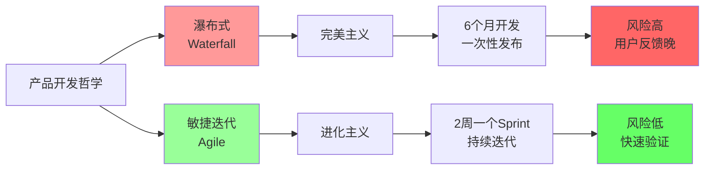

**关键差异**：

| 维度 | 瀑布式 | 敏捷迭代 |
|------|-------|---------|
| **理念** | 一次做对 | **持续改进** |
| **发布周期** | 6-12个月 | **2-4周** |
| **需求变更** | 拒绝（成本高） | **拥抱**（成本低） |
| **用户反馈** | 上线后才知道 | **每个Sprint验证** |
| **风险** | 高（押宝一次） | **低**（小步试错） |
| **适用场景** | 硬件、航天 | **互联网、AI产品** |

**核心洞察**：传统产品追求"一次完美"，AI产品追求"**持续进化**"——像生物一样通过迭代适应环境。

### 1.2 AI产品迭代的特殊性（2026）

[据2026 AI投资趋势报告](https://www.stcn.com/article/detail/3562080.html)：

> **2026AI投资关键还看AI大模型的"迭代力"和"落地力"**。

[据AI产业进化路径分析](https://www.thepaper.cn/newsDetail_forward_32424547)：

> **2026年模型的演进逻辑更像"小朋友长大"的过程，模型能力的提升是连续且扎实的。**

**AI产品 vs 传统软件迭代对比**：

| 维度 | 传统软件 | AI产品（2026） |
|------|---------|--------------|
| **迭代驱动力** | 功能需求 | 功能需求 + **模型优化** |
| **数据价值** | 辅助决策 | **训练数据**（越用越好） |
| **更新频率** | 月/周 | **日/小时**（模型可热更新） |
| **用户容忍度** | Bug必须修 | 可容忍5-10%错误率（**逐步优化**） |
| **迭代时间窗** | 无明确时间压力 | **半年窗口期**（[据36氪报道](https://m.thepaper.cn/newsDetail_forward_32088718)） |

**2026年关键趋势**（[据36氪AI风口分析](https://36kr.com/p/3578453650479235)）：

> **Agent的核心价值取决于迭代速度，需在半年时间窗内快速满足用户需求并持续迭代。RL（强化学习）技术的成熟让问题修复更高效，即使是少量未标注数据，通过合理设计奖励函数也能快速优化模型。**

---

## 二、敏捷开发：2周一个Sprint

### 2.1 Scrum框架全景

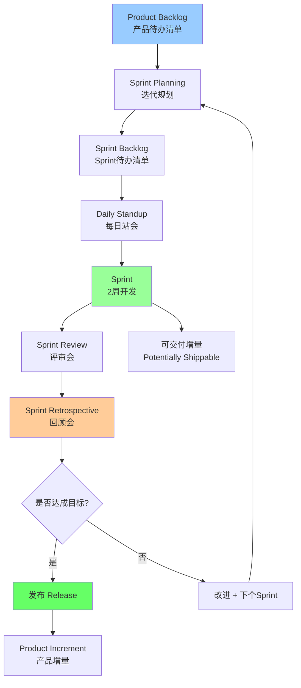

**Scrum核心角色**：

| 角色 | 职责 | 关键活动 |
|------|------|---------|
| **Product Owner (PO)<br/>产品负责人** | 定义需求优先级 | 维护Product Backlog，决定做什么 |
| **Scrum Master<br/>敏捷教练** | 保障流程运行 | 组织会议，移除障碍 |
| **Dev Team<br/>开发团队** | 交付可用增量 | 开发、测试、上线 |

**Sprint周期标准**（2周为例）：

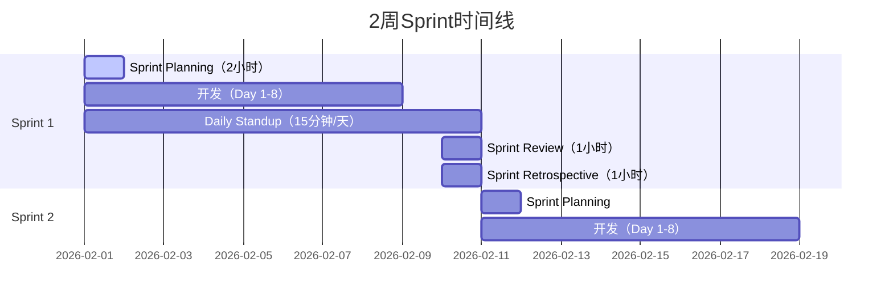

### 2.2 Daily Standup（每日站会）模板

```markdown
## 每日站会（15分钟）

**时间**：每天上午10:00
**参与者**：Product Owner + Scrum Master + Dev Team

**每人回答3个问题**：

1. **昨天完成了什么？**
   - 张三：完成了AI对话接口优化，响应时长从5秒降至3秒 ✅
   - 李四：完成了用户反馈页面UI改版 ✅

2. **今天计划做什么？**
   - 张三：开始模型准确率提升（目标从85%→90%）
   - 李四：集成神策分析SDK，监控用户行为数据

3. **遇到了什么障碍？**
   - 张三：需要算法团队提供新的训练数据（标注了500条Bad Case）
   - 李四：神策分析文档不全，需要技术支持

**行动项**：
- [ ] Scrum Master联系算法团队，今日下午前交付训练数据
- [ ] Product Owner联系神策客服，预约技术培训（明天下午）
```

### 2.3 Sprint Review vs Sprint Retrospective

| 维度 | Sprint Review（评审会） | Sprint Retrospective（回顾会） |
|------|----------------------|----------------------------|
| **目的** | 检查产品增量 | **检查团队流程** |
| **参与者** | PO + Dev Team + **利益相关者** | PO + Dev Team（**内部**） |
| **时长** | 1小时 | 1小时 |
| **内容** | Demo新功能，收集反馈 | **总结做得好/不好的地方** |
| **产出** | 下个Sprint调整方向 | **流程改进行动计划** |

**Sprint Retrospective模板**（[据Scrum实践](https://www.minjiekaifa.com/scrum/scrum-technical-debt-repayment-guide-80471.mhtml)）：

```markdown
## Sprint 12 回顾会（2026-02-10）

### 1. 做得好的地方（Keep）

- ✅ 代码Review流程严格，Bug数量下降40%
- ✅ 每日站会控制在15分钟内，效率高
- ✅ 产品文档同步更新，团队协作顺畅

### 2. 做得不好的地方（Stop）

- ❌ 技术债务累积（遗留3个性能优化任务未完成）
- ❌ 需求变更频繁（本Sprint改了4次需求）
- ❌ 测试时间不足（最后2天才开始测试）

### 3. 需要改进的地方（Start）

- 🔄 下个Sprint分配20%时间处理技术债务
- 🔄 需求冻结时间：Sprint开始后48小时内不再变更
- 🔄 测试前置：开发完成一个功能立即测试，不等到最后

### 4. 行动计划

| 改进项 | 负责人 | 截止日期 | 验证方式 |
|-------|-------|---------|---------|
| 技术债务清单 | 张三 | 下周一 | Product Backlog增加技术债务分类 |
| 需求冻结流程 | Product Owner | 下周一 | 制定需求变更SOP文档 |
| 测试前置 | QA团队 | 下个Sprint | 监控测试覆盖率>80% |
```

---

## 三、技术债务管理：不能永远救火

### 3.1 什么是技术债务？

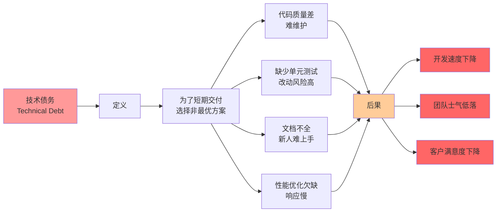

**技术债务定义**（[据敏捷开发实践](https://www.mbalib.com/ask/question-f887a88cd4a499981f07c1155f0e6d92.html)）：

> **技术债务指开发者为了加速软件开发，选择短期解决方案而非最佳实践，从而在未来造成额外开发负担的情况。**

**类比**：就像借钱一样，为了眼前快速交付（借钱买房），未来要付出更多代价（还本金+利息）。

### 3.2 技术债务的影响

[据Scrum技术债务指南](https://www.minjiekaifa.com/scrum/scrum-technical-debt-repayment-guide-80471.mhtml)：

> **技术债务导致Scrum团队生产力下降、代码质量下降、项目风险增加。**

**量化影响**（[据软件开发实践](https://www.yanding8.com/post/1624.html)）：

| 影响维度 | 无技术债务 | 轻度债务 | 重度债务 |
|---------|----------|---------|---------|
| **开发速度** | 基线 | -20% | **-50%** |
| **Bug数量** | 基线 | +30% | **+100%** |
| **新人上手时间** | 1周 | 2周 | **1个月** |
| **团队士气** | 高 | 中 | **低**（频繁加班） |

### 3.3 技术债务偿还策略

**15-20%原则**（[据敏捷项目管理方案](https://www.etppm.com/OWS/prime6986.html)）：

> **在每个Sprint周期中，确保15-20%的资源分配给代码重构和Bug修复。**

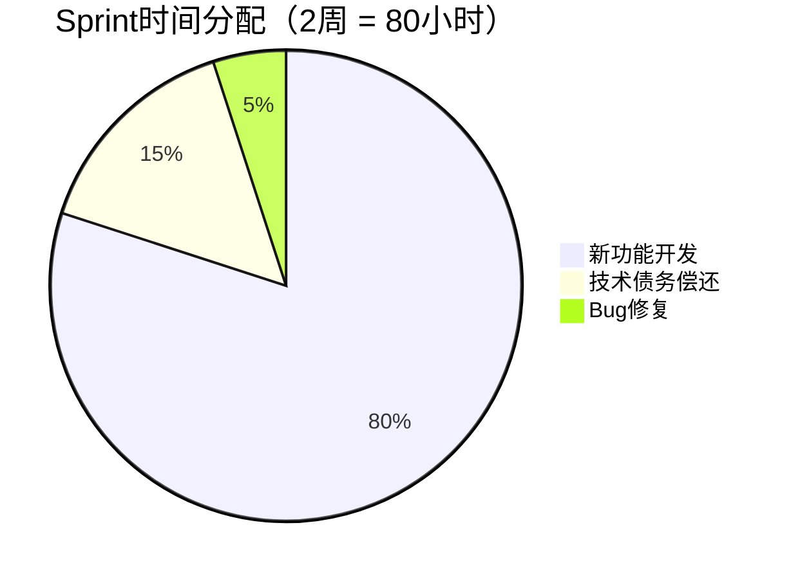

**技术债务清单模板**：

| 债务项 | 类型 | 影响范围 | 估算工时 | 优先级 | 负责人 | 计划Sprint |
|-------|------|---------|---------|-------|--------|-----------|
| AI模型推理优化 | 性能 | 50%用户（响应慢） | 16小时 | P0 | 张三 | Sprint 13 |
| 缺少单元测试覆盖 | 测试 | 核心模块 | 12小时 | P1 | 李四 | Sprint 13 |
| 用户反馈模块文档 | 文档 | 新人onboarding | 4小时 | P2 | 王五 | Sprint 14 |

**偿还优先级计算**：
```
优先级得分 = (影响范围 × 0.4) + (风险严重程度 × 0.3) + (偿还紧迫性 × 0.2) - (偿还成本 × 0.1)
```

### 3.4 技术债务 vs 产品功能的平衡

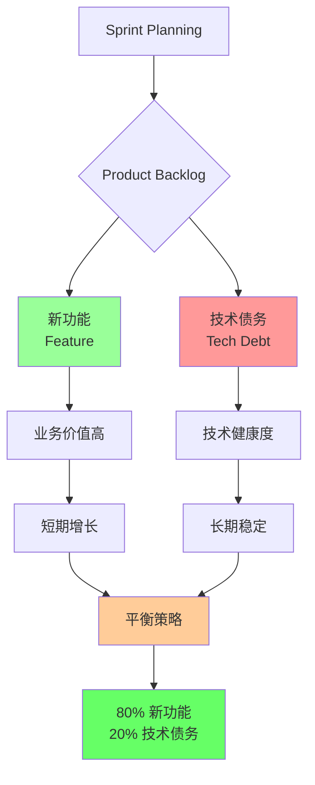

**实战案例**：

**错误做法**：
- Sprint 1-6：100%新功能，0%技术债务
- Sprint 7：技术债务爆发，系统崩溃，**用2个Sprint紧急重构**

**正确做法**：
- 每个Sprint：80%新功能 + 20%技术债务
- 持续偿还，系统健康度保持稳定

---

## 四、OKR vs KPI：目标对齐

### 4.1 中国互联网公司的OKR实践（2026）

[据OKR在互联网企业兴起报告](https://www.okrt.com/wiki/9199/)：

> **OKR自2014年起在中国互联网行业广泛应用，2017年字节跳动创始人张一鸣将OKR引入中国互联网圈，随后腾讯、百度、阿里巴巴、快手、京东、美团等公司相继采用。**

**字节跳动OKR演进**（2026）：
- 早期：双月OKR评审
- 现状：改为**季度执行**（业务成熟后双月变化不大）

### 4.2 OKR vs KPI对比

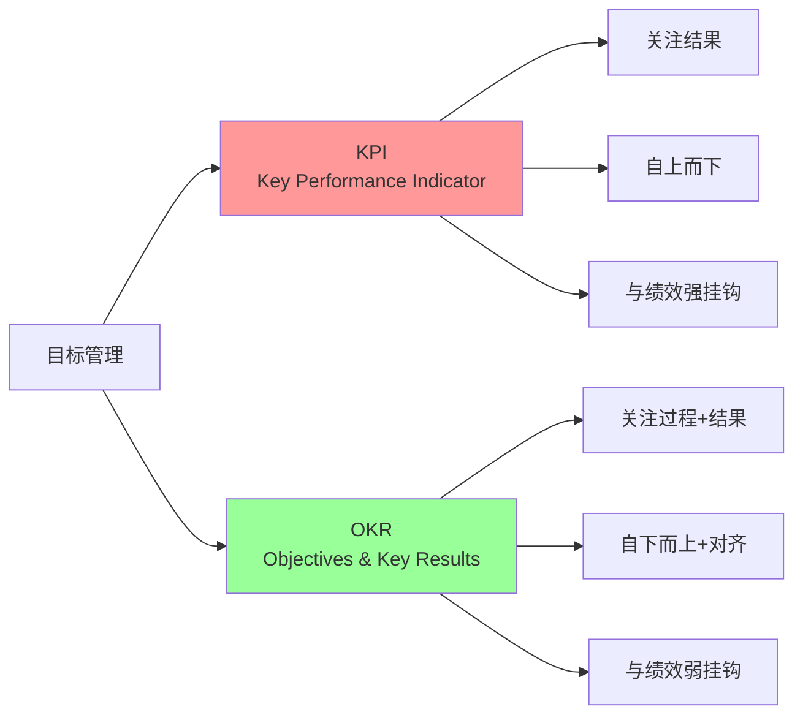

| 维度 | KPI | OKR |
|------|-----|-----|
| **目标来源** | 自上而下（老板定） | **自下而上+对齐**（团队参与） |
| **与绩效关系** | 强挂钩（完成度直接影响奖金） | **弱挂钩**（鼓励挑战性目标） |
| **目标难度** | 100%完成度（保守目标） | **70%完成度即优秀**（激进目标） |
| **关注点** | 结果导向 | **过程+结果** |
| **缺点** | 员工过度追求数量，忽略质量和创新 | 执行力弱，容易流于形式 |

**为什么互联网公司青睐OKR？**（[据企业实践分析](https://cp.dtcj.com/uc/shangye-zhd/57d265454db4413e76a731ee.html)）：

> **在KPI体系中，绩效结果与员工薪酬紧密挂钩，但这会导致员工过度追求量化指标而忽略工作质量和创新。**

### 4.3 OKR框架详解

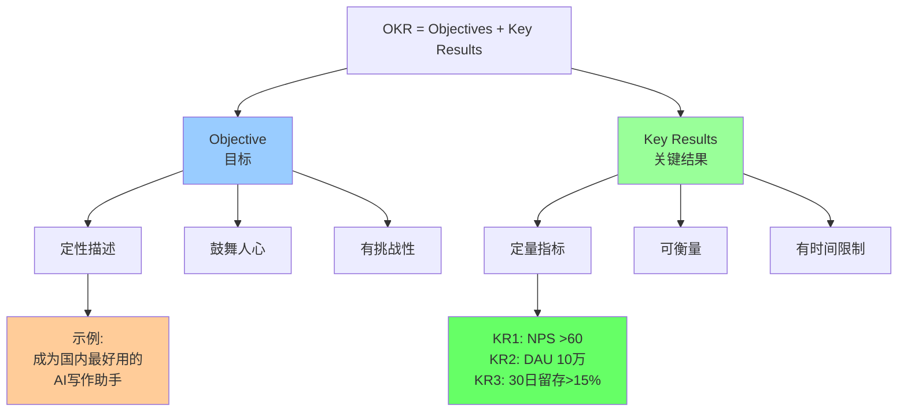

**OKR编写公式**：

```
Objective（目标）: 我想要实现【鼓舞人心的定性描述】

Key Result 1（关键结果1）: 通过【可量化指标】从【基线】提升到【目标值】
Key Result 2: 通过【可量化指标】从【基线】提升到【目标值】
Key Result 3: 通过【可量化指标】从【基线】提升到【目标值】
```

**实战案例（AI写作助手Q1 OKR）**：

```markdown
## Q1 2026 OKR

### Objective（目标）
成为国内AI写作助手领域用户最满意的产品

### Key Results（关键结果）
- KR1: NPS从35提升至60（+71%）
- KR2: DAU从5万提升至10万（+100%）
- KR3: 30日留存率从12%提升至18%（+50%）
- KR4: 用户满意度(CSAT)从82%提升至90%（+8%）

### Initiatives（关键举措）
- 提升AI准确率：数学题准确率从65%→95%（集成WolframAlpha）
- 优化响应速度：P95响应时长从10秒→4秒（模型量化+流式输出）
- 新增场景：学术论文写作、商业计划书、产品PRD
```

### 4.4 公司级 → 部门级 → 个人级 OKR对齐

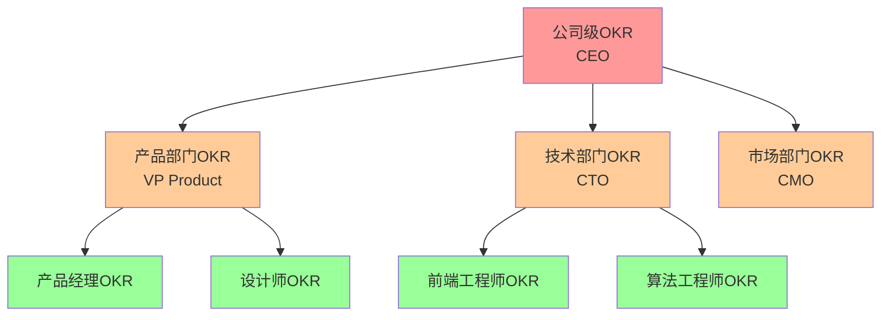

**示例对齐**：

| 层级 | Objective | Key Results |
|------|----------|-------------|
| **公司级** | 2026年成为中国AI助手市场前3 | KR1: MAU达到2000万<br/>KR2: NPS >65<br/>KR3: 年收入5亿 |
| **产品部** | 提升用户体验和留存率 | KR1: 30日留存率>18%<br/>KR2: CSAT >90%<br/>KR3: Bad Case率<3% |
| **产品经理** | 优化AI对话质量 | KR1: 数学题准确率>95%<br/>KR2: 响应时长<4秒<br/>KR3: 多轮对话成功率>85% |

---

## 五、2026年AI产品迭代最佳实践

### 5.1 工业化能力 vs 单点突破

[据黄仁勋2026开年定调](https://36kr.com/p/3627253291446792)：

> **2026年刚开年，AI行业最重磅的信号强调：AI的真正跃迁，不靠单点突破，而要靠一整套工业化能力。**

**工业化能力包括**：

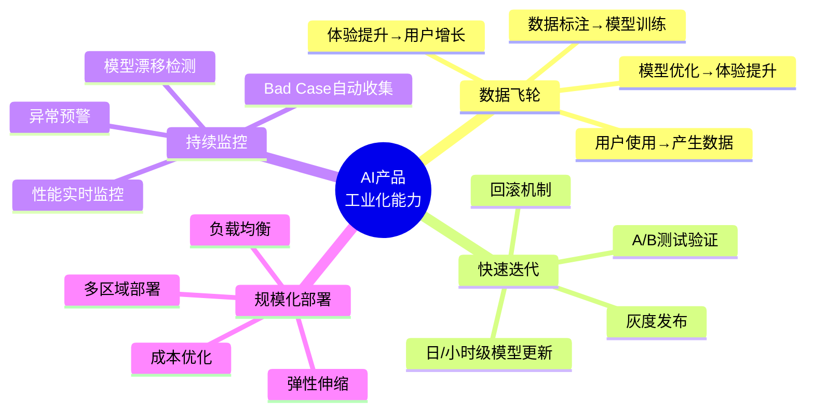

### 5.2 强化学习（RL）加速迭代

[据36氪AI趋势分析](https://m.thepaper.cn/newsDetail_forward_32088718)：

> **RL（强化学习）技术的成熟让问题修复更高效，即使是少量未标注数据，通过合理设计奖励函数也能快速优化模型，这为Agent的迭代提供了便利。**

**传统监督学习 vs 强化学习迭代对比**：

| 维度 | 监督学习 | 强化学习（RL） |
|------|---------|--------------|
| **数据需求** | 需要大量标注数据 | **少量数据+奖励函数** |
| **迭代周期** | 2-4周（标注+训练） | **3-7天**（设计奖励+训练） |
| **应用场景** | 通用能力提升 | **具体任务优化**（如对话质量） |
| **成本** | 高（标注成本） | **中**（设计奖励函数） |

**实战案例**：某AI助手通过RL优化对话质量

| 问题 | 传统方案 | RL方案 | 效果对比 |
|------|---------|--------|---------|
| **多轮对话成功率低** | 标注1000条Bad Case（2周） | 设计奖励函数（3天）+ RL训练（4天） | RL方案快1周，成本降50% |

### 5.3 半年时间窗口

[据AI风口分析](https://36kr.com/p/3578453650479235)：

> **Agent的核心价值取决于迭代速度，需在半年时间窗内快速满足用户需求并持续迭代。**

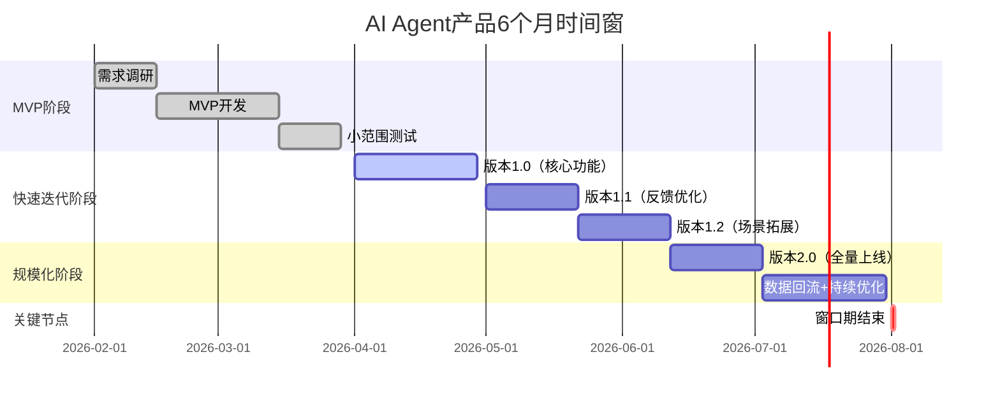

**关键洞察**：
- **0-3个月**：MVP验证核心价值
- **3-6个月**：快速迭代，场景拓展
- **6个月后**：窗口期关闭，市场格局基本确定

---

## 六、实战工具与模板

### 6.1 产品演进路线图（Roadmap）

```markdown
## AI写作助手产品路线图（2026 Q1-Q4）

### Q1 2026：核心体验优化

**目标**：提升留存率，NPS >60

| 功能/优化 | 优先级 | 预期上线 | 负责人 | 关键指标 |
|----------|-------|---------|--------|---------|
| AI响应速度优化（10秒→4秒） | P0 | 2月 | 技术团队 | P95响应时长<5秒 |
| 数学题准确率提升（65%→95%） | P0 | 2月 | 算法团队 | 准确率>90% |
| 新增学术论文场景 | P1 | 3月 | 产品团队 | 场景使用率>10% |
| 技术债务偿还（单元测试覆盖） | P2 | 3月 | 技术团队 | 测试覆盖率>80% |

---

### Q2 2026：场景拓展

**目标**：DAU 10万，MAU 40万

| 功能/优化 | 优先级 | 预期上线 | 负责人 | 关键指标 |
|----------|-------|---------|--------|---------|
| 商业计划书写作 | P0 | 4月 | 产品团队 | 新场景DAU 5000 |
| 产品PRD模板 | P1 | 5月 | 产品团队 | PM群体渗透率>15% |
| 团队协作功能 | P1 | 6月 | 技术团队 | 企业客户>500 |
| 多语言支持（英文） | P2 | 6月 | 算法团队 | 英文场景使用率>5% |

---

### Q3 2026：商业化探索

**目标**：付费用户10万，月收入300万

| 功能/优化 | 优先级 | 预期上线 | 负责人 | 关键指标 |
|----------|-------|---------|--------|---------|
| 会员体系设计 | P0 | 7月 | 商业化团队 | 付费转化率>3% |
| 企业版功能 | P0 | 8月 | 产品团队 | 企业客户>1000 |
| API接口开放 | P1 | 9月 | 技术团队 | API调用量>100万次/月 |

---

### Q4 2026：生态建设

**目标**：MAU 200万，年收入1亿

| 功能/优化 | 优先级 | 预期上线 | 负责人 | 关键指标 |
|----------|-------|---------|--------|---------|
| 插件市场 | P0 | 10月 | 产品团队 | 第三方插件>50个 |
| 开放平台 | P1 | 11月 | 技术团队 | 开发者>1000 |
| AI训练反馈闭环 | P1 | 12月 | 算法团队 | 模型准确率持续提升 |
```

### 6.2 Sprint回顾会议记录模板

```markdown
## Sprint 12 回顾会（2026-02-10）

### 基本信息
- **Sprint目标**：优化AI响应速度，P95<5秒
- **实际完成度**：90%（P95响应时长5.2秒，未达标）
- **团队成员**：张三（PO）、李四（Scrum Master）、5位工程师

---

### Sprint数据

| 指标 | 目标 | 实际 | 达成率 |
|------|------|------|-------|
| 完成Story数量 | 8 | 7 | 87.5% |
| Sprint速度（Story Points） | 40 | 35 | 87.5% |
| Bug数量 | <5 | 3 | ✅ 达标 |
| 技术债务偿还 | 2项 | 1项 | 50% |

---

### 做得好的地方（Keep）

1. ✅ **Daily Standup效率高**：每次控制在15分钟内，障碍及时移除
2. ✅ **代码Review严格**：3个Bug被提前发现，上线后Bug数量少
3. ✅ **产品文档同步**：PRD、技术文档同步更新，团队协作顺畅

---

### 做得不好的地方（Stop）

1. ❌ **技术债务累积**：原计划偿还2项，实际只完成1项
2. ❌ **需求变更频繁**：Sprint开始后第3天，PO又增加了1个需求
3. ❌ **测试时间不足**：最后2天才开始集成测试，导致1个Bug漏到生产

---

### 需要改进的地方（Start）

1. 🔄 **技术债务强制分配**：下个Sprint强制分配20%时间处理技术债务
2. 🔄 **需求冻结机制**：Sprint开始后48小时内不再接受新需求
3. 🔄 **测试前置**：开发完成一个功能立即测试，不等到Sprint最后

---

### 行动计划

| 改进项 | 负责人 | 截止日期 | 验证方式 |
|-------|-------|---------|---------|
| 制定技术债务清单 | 李四 | 2026-02-12 | Product Backlog增加"技术债务"分类 |
| 需求冻结SOP文档 | 张三（PO） | 2026-02-12 | 发布到团队Wiki |
| 测试前置流程 | QA团队 | 2026-02-13 | 监控测试覆盖率>80% |

---

### 下个Sprint聚焦

- **Sprint 13目标**：数学题准确率从65%提升至90%
- **关键举措**：集成WolframAlpha数学引擎 + Prompt优化
- **技术债务**：补充单元测试覆盖（分配8小时）
```

### 6.3 技术债务偿还计划表

```markdown
## 技术债务偿还计划（2026 Q1）

### 债务清单

| ID | 债务项 | 类型 | 影响范围 | 严重程度 | 估算工时 | 优先级 | 计划Sprint | 负责人 |
|----|-------|------|---------|---------|---------|-------|----------|--------|
| TD-001 | AI模型推理优化 | 性能 | 50%用户反馈"响应慢" | P0 | 16小时 | **1** | Sprint 13 | 张三 |
| TD-002 | 核心模块单元测试缺失 | 测试 | 核心对话模块 | P1 | 12小时 | **2** | Sprint 13 | 李四 |
| TD-003 | 用户反馈模块文档缺失 | 文档 | 新人onboarding困难 | P2 | 4小时 | **3** | Sprint 14 | 王五 |
| TD-004 | 数据库查询优化 | 性能 | 高并发场景响应慢 | P1 | 8小时 | **4** | Sprint 14 | 赵六 |
| TD-005 | 前端代码重构（React组件） | 架构 | 代码可维护性差 | P2 | 20小时 | **5** | Sprint 15-16 | 前端团队 |

---

### 偿还计划

#### Sprint 13（2026-02-11至2026-02-24）
- **分配时间**：80小时 × 20% = 16小时
- **计划偿还**：
  - TD-001：AI模型推理优化（16小时）
  - TD-002：单元测试（12小时，跨到Sprint 14）

#### Sprint 14（2026-02-25至2026-03-10）
- **分配时间**：80小时 × 20% = 16小时
- **计划偿还**：
  - TD-002：单元测试（剩余8小时）
  - TD-003：文档（4小时）
  - TD-004：数据库优化（4小时，剩余4小时跨到Sprint 15）

#### Sprint 15-16（2026-03-11至2026-04-07）
- **分配时间**：160小时 × 20% = 32小时
- **计划偿还**：
  - TD-004：数据库优化（剩余4小时）
  - TD-005：前端代码重构（20小时）

---

### 验证指标

| 债务项 | 验证指标 | 目标值 | 验证方式 |
|-------|---------|-------|---------|
| TD-001 模型优化 | P95响应时长 | <5秒 | 后台性能监控 |
| TD-002 单元测试 | 测试覆盖率 | >80% | Jest coverage report |
| TD-003 文档 | 新人onboarding时间 | <3天 | 新人反馈调研 |
| TD-004 数据库优化 | 数据库查询时长 | <100ms | APM监控 |
| TD-005 前端重构 | 代码复杂度 | Cyclomatic Complexity <10 | SonarQube |
```

---

## 七、自测题

### 选择题

**1. 据2026 AI投资趋势报告，AI大模型的核心竞争力是？**
A. 模型参数量
B. 算力规模
C. 迭代力和落地力
D. 融资金额

<details>
<summary>点击查看答案</summary>
**答案：C**

解析：据报告，**2026 AI投资关键还看AI大模型的"迭代力"和"落地力"**，而非单纯的参数量或算力。
</details>

**2. Scrum框架中，每个Sprint的标准时长是？**
A. 1周
B. 2周
C. 4周
D. 视团队而定

<details>
<summary>点击查看答案</summary>
**答案：B（最常见）**

解析：虽然Scrum允许团队自定义Sprint时长，但**2周**是最常见的标准，平衡了迭代频率和开发时间。选项D也正确，但B更符合实践。
</details>

**3. 技术债务偿还的"15-20%原则"是指？**
A. 15-20%的Bug需要修复
B. 每个Sprint分配15-20%时间处理技术债务
C. 技术债务不能超过代码量的15-20%
D. 15-20%的需求可以延期

<details>
<summary>点击查看答案</summary>
**答案：B**

解析：据敏捷项目管理实践，**在每个Sprint周期中，确保15-20%的资源分配给代码重构和Bug修复**。
</details>

**4. OKR与KPI的核心差异是？**
A. OKR更注重结果
B. OKR与绩效强挂钩
C. OKR鼓励挑战性目标，与绩效弱挂钩
D. OKR只适合大公司

<details>
<summary>点击查看答案</summary>
**答案：C**

解析：OKR的核心特点是**鼓励挑战性目标（70%完成度即优秀），与绩效弱挂钩**，而KPI是100%完成度要求，与绩效强挂钩。
</details>

**5. 据AI趋势分析，AI Agent产品的时间窗口期是多久？**
A. 3个月
B. 半年
C. 1年
D. 2年

<details>
<summary>点击查看答案</summary>
**答案：B**

解析：据36氪报道，**Agent的核心价值取决于迭代速度，需在半年时间窗内快速满足用户需求并持续迭代**。
</details>

### 简答题

**6. 请说明敏捷开发的"Sprint Retrospective（回顾会）"与"Sprint Review（评审会）"的区别。**

<details>
<summary>参考答案</summary>

| 维度 | Sprint Review（评审会） | Sprint Retrospective（回顾会） |
|------|----------------------|----------------------------|
| **目的** | 检查**产品增量** | 检查**团队流程** |
| **参与者** | PO + Dev Team + **利益相关者**（外部） | PO + Dev Team（**仅内部**） |
| **时长** | 1小时 | 1小时 |
| **内容** | Demo新功能，收集反馈 | 总结做得好/不好的地方 |
| **产出** | 下个Sprint产品调整方向 | **流程改进行动计划** |
| **关键问题** | "我们做出了什么？" | "**我们如何做得更好？**" |

**实战案例**：

- **Sprint Review**：
  - 演示：AI响应速度从10秒优化至5.2秒
  - 利益相关者反馈："不错，但还能更快吗？"
  - 产出：下个Sprint继续优化至<4秒

- **Sprint Retrospective**：
  - 团队讨论：为什么只达到5.2秒而非目标5秒？
  - 发现问题：测试时间不足（最后2天才测试）
  - 改进行动：下个Sprint实施"测试前置"流程
</details>

**7. 如何平衡"快速迭代"与"技术债务累积"？请给出具体策略。**

<details>
<summary>参考答案</summary>

**核心策略：80/20法则**

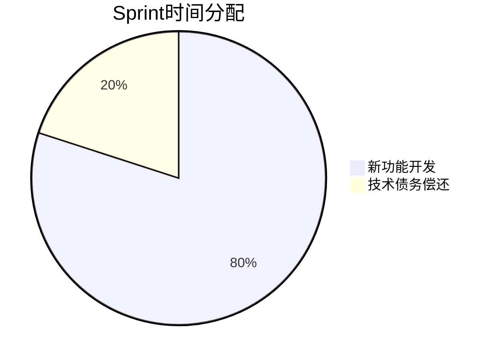

**具体实施方法**：

### 1. 制度层面

| 策略 | 具体做法 | 预期效果 |
|------|---------|---------|
| **强制分配** | 每个Sprint强制分配15-20%时间处理技术债务 | 防止债务累积 |
| **债务可见化** | Product Backlog增加"技术债务"分类 | 提升优先级意识 |
| **定期复盘** | 每月技术债务复盘会 | 识别高风险债务 |

### 2. 优先级管理

**技术债务优先级评分**：
```
优先级得分 = (影响范围 × 0.4) + (风险严重程度 × 0.3) + (偿还紧迫性 × 0.2) - (偿还成本 × 0.1)
```

**案例**：
- 高优先级债务：AI响应慢（影响50%用户）→ Sprint 13立即处理
- 低优先级债务：前端代码重构（不影响用户）→ Sprint 15-16处理

### 3. 验证机制

| 债务类型 | 验证指标 | 目标值 |
|---------|---------|-------|
| 性能债务 | P95响应时长 | <5秒 |
| 测试债务 | 测试覆盖率 | >80% |
| 文档债务 | 新人onboarding时间 | <3天 |

**错误做法**：
- Sprint 1-6：100%新功能，0%技术债务
- Sprint 7：技术债务爆发，**用2个Sprint紧急重构**（损失4周）

**正确做法**：
- 每个Sprint：80%新功能 + 20%技术债务
- 持续偿还，系统健康度保持稳定，**不会爆发性危机**
</details>

---

## 八、实战练习

### 练习1：制定Q1产品路线图

**场景**：你负责一款AI学习助手，当前数据：
- DAU 2万，MAU 8万（DAU/MAU=25%）
- 30日留存率10%（目标>15%）
- NPS 30（目标>50）

**任务**：
1. 制定Q1（3个月）产品路线图
2. 每月至少3个优化/新功能
3. 说明优先级排序逻辑

<details>
<summary>参考答案</summary>

```markdown
## AI学习助手Q1 2026产品路线图

### Q1总目标
- 30日留存率从10%→15%（+50%）
- NPS从30→50（+20分）
- DAU从2万→3.5万（+75%）

---

### 2月：核心体验优化（留存率优先）

| 功能/优化 | 优先级 | 预期上线 | 关键指标 | 优先级逻辑 |
|----------|-------|---------|---------|----------|
| **作业批改准确率提升** | P0 | 2月10日 | 准确率85%→95% | 影响50%用户，负面反馈最多 |
| **新手引导优化** | P0 | 2月15日 | 次日留存35%→45% | 新用户流失严重（首日流失60%） |
| **AI响应速度优化** | P1 | 2月25日 | P95响应<5秒 | 20%用户反馈"响应慢" |

**预期成果**：
- 30日留存率：10%→12%（+20%）
- CSAT：78%→85%（+7%）

---

### 3月：场景拓展（使用频率优先）

| 功能/优化 | 优先级 | 预期上线 | 关键指标 | 优先级逻辑 |
|----------|-------|---------|---------|----------|
| **新增学习计划功能** | P0 | 3月10日 | 使用率>15% | 用户调研Top 1需求（40%提及） |
| **错题本自动整理** | P1 | 3月20日 | 使用率>20% | 提升DAU（学生会每天查看） |
| **学习报告生成** | P1 | 3月30日 | 分享率>10% | 增加用户粘性+口碑传播 |

**预期成果**：
- DAU：2万→2.8万（+40%）
- DAU/MAU：25%→30%（+5%）

---

### 4月：社交与激励（推荐率优先）

| 功能/优化 | 优先级 | 预期上线 | 关键指标 | 优先级逻辑 |
|----------|-------|---------|---------|----------|
| **学习排行榜** | P0 | 4月10日 | 参与率>25% | 游戏化激励，提升活跃度 |
| **好友PK功能** | P1 | 4月20日 | 邀请率>8% | 增加K因子，病毒式传播 |
| **学习成就系统** | P2 | 4月30日 | 成就解锁率>30% | 长期激励，提升留存 |

**预期成果**：
- NPS：35→50（+15分）
- K因子：0.3→0.5（每个用户带来0.5个新用户）

---

### 技术债务偿还计划

| Sprint | 债务项 | 工时 | 负责人 |
|--------|-------|------|--------|
| Sprint 13（2月） | 核心模块单元测试 | 12h | 李四 |
| Sprint 14（3月） | 数据库查询优化 | 8h | 赵六 |
| Sprint 15（4月） | 前端代码重构 | 16h | 前端团队 |

**分配比例**：每个Sprint 20%时间（16小时/80小时）
```

**优先级排序逻辑**：

```
优先级得分 = (影响用户数 × 0.3) + (对目标指标贡献 × 0.4) + (用户需求强度 × 0.2) - (开发成本 × 0.1)
```

**示例计算（作业批改准确率）**：
- 影响用户数：50%用户使用 → 9分
- 对目标指标贡献：直接提升留存率+NPS → 9分
- 用户需求强度：负面反馈最多 → 9分
- 开发成本：需算法团队2周 → 7分

```
优先级得分 = (9 × 0.3) + (9 × 0.4) + (9 × 0.2) - (7 × 0.1)
          = 2.7 + 3.6 + 1.8 - 0.7
          = 7.4 → P0
```
</details>

### 练习2：设计OKR并拆解到个人

**场景**：你是AI产品部门负责人，公司级OKR如下：

**公司级OKR（Q1 2026）**
- Objective: 成为中国AI助手市场前5
- KR1: MAU达到500万
- KR2: NPS >55
- KR3: 月收入2000万

**任务**：
1. 设计产品部门OKR（与公司级对齐）
2. 拆解到产品经理个人OKR
3. 说明对齐逻辑

<details>
<summary>参考答案</summary>

```markdown
## OKR三级对齐（公司→部门→个人）

### 1. 公司级OKR（Q1 2026）

**Objective（目标）**: 成为中国AI助手市场前5

**Key Results（关键结果）**:
- KR1: MAU达到500万
- KR2: NPS >55
- KR3: 月收入2000万

---

### 2. 产品部门OKR

**Objective（目标）**: 提升产品体验和用户留存，支撑公司MAU和NPS目标

**Key Results（关键结果）**:
- KR1: 30日留存率从12%提升至18%（**支撑公司KR1 MAU增长**）
- KR2: CSAT从82%提升至90%（**支撑公司KR2 NPS提升**）
- KR3: AI准确率从85%提升至93%（**核心体验优化**）
- KR4: Bad Case率从8%降至3%（**质量保障**）

**Initiatives（关键举措）**:
- 数学题准确率提升（集成WolframAlpha）
- AI响应速度优化（10秒→4秒）
- 新增3个高频场景（学习计划、错题本、学习报告）

---

### 3. 产品经理个人OKR

**Objective（目标）**: 优化AI对话质量，提升用户满意度

**Key Results（关键结果）**:
- KR1: 数学题准确率从65%提升至95%（**支撑部门KR3 准确率提升**）
- KR2: AI响应时长P95从10秒降至4秒（**支撑部门KR2 CSAT提升**）
- KR3: 多轮对话成功率从75%提升至85%（**支撑部门KR4 Bad Case下降**）

**Initiatives（关键举措）**:
- 集成WolframAlpha数学引擎（2月上线）
- 模型量化+流式输出（2月上线）
- Prompt优化+多轮对话引导（3月上线）

---

### 对齐逻辑可视化

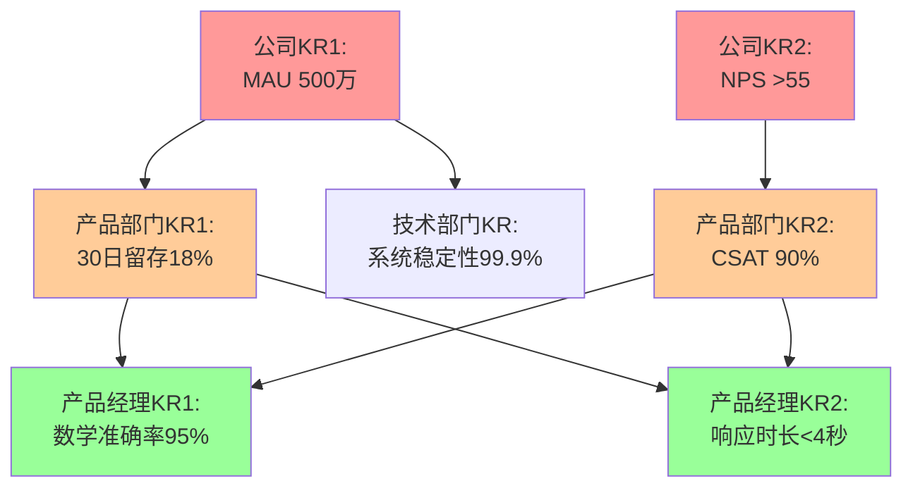

---

### 对齐说明

| 层级 | OKR | 对齐逻辑 |
|------|-----|---------|
| **公司** | MAU 500万 | 需要高留存率 + 高满意度 + 高推荐率 |
| **产品部** | 30日留存18% + CSAT 90% | 留存率提升 → MAU自然增长<br/>CSAT提升 → NPS提升 |
| **产品经理** | 准确率95% + 响应<4秒 | 准确率+速度 → CSAT提升 → 留存率提升 |

**验证逻辑**：
- 如果产品经理KR1/KR2达标 → 产品部门KR2 CSAT提升 → 公司KR2 NPS提升 ✅
- 如果产品部门KR1留存率提升 → 公司KR1 MAU增长 ✅

**关键洞察**：
- 每一层OKR都是上一层的"**手段**"（How）
- 上一层OKR是下一层的"**目的**"（Why）
- 形成清晰的因果链：准确率↑ → CSAT↑ → 留存率↑ → MAU↑
```
</details>

---

## 九、延伸阅读

### 推荐资源

1. **[黄仁勋2026开年定调：AI真升级，靠工业化](https://36kr.com/p/3627253291446792)** - NVIDIA CEO对AI产业发展的最新洞察

2. **[2026 AI投资关键：大模型的迭代力和落地力](https://www.stcn.com/article/detail/3562080.html)** - 投资视角看AI产品竞争力

3. **[Scrum技术债务偿还指南](https://www.minjiekaifa.com/scrum/scrum-technical-debt-repayment-guide-80471.mhtml)** - 技术债务管理最佳实践

4. **[OKR在中国互联网企业兴起](https://www.okrt.com/wiki/9199/)** - 字节跳动、腾讯、阿里的OKR实践

5. **[敏捷开发中技术债务管理](https://www.etppm.com/OWS/prime6986.html)** - 15-20%原则详解

### 工具推荐

- **项目管理**：飞书项目、Teambition、TAPD、Worktile
- **OKR管理**：飞书OKR、Tita、Worktile OKR
- **代码质量**：SonarQube、CodeClimate
- **测试覆盖**：Jest（JavaScript）、pytest-cov（Python）

---

## 十、本节总结

### 核心要点回顾

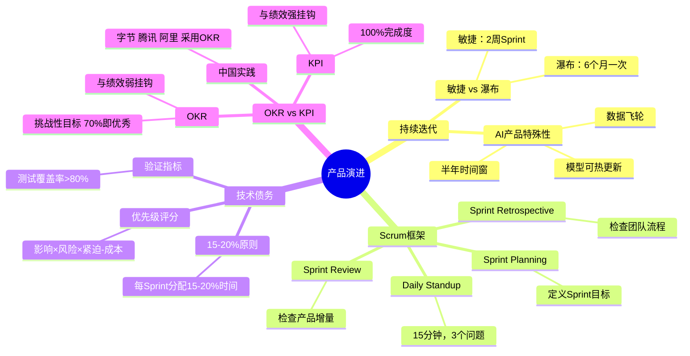

### 2026年关键趋势

| 趋势 | 数据/洞察 | 来源 |
|------|----------|------|
| **工业化能力** | AI真升级不靠单点突破，靠工业化能力 | 黄仁勋2026开年定调 |
| **迭代力** | 迭代力和落地力是AI大模型核心竞争力 | AI投资趋势报告 |
| **时间窗** | Agent产品需在半年窗口期快速迭代 | 36氪AI风口分析 |
| **RL加速** | 强化学习让问题修复更高效（少量数据即可） | AI趋势分析 |
| **OKR普及** | 中国互联网公司从KPI转向OKR（字节、腾讯、阿里） | OKR实践报告 |

### 行动检查清单

在完成本节学习后，请确保你已经：

- [ ] 理解敏捷迭代 vs 瀑布式的核心差异
- [ ] 掌握Scrum框架的4大会议（Planning/Standup/Review/Retrospective）
- [ ] 了解技术债务的15-20%偿还原则
- [ ] 能够区分OKR与KPI，理解中国互联网公司的OKR实践
- [ ] 理解AI产品迭代的3大特殊性（模型优化/数据飞轮/半年窗口）
- [ ] 能够制定产品演进路线图
- [ ] 掌握公司级→部门级→个人级OKR对齐方法

---

**Module 24完成**！我们系统学习了发布后管理的三大核心主题：
1. **75 - 重要指标**：DAU/MAU/AARRR/NSM，数据驱动决策
2. **76 - 客户之声**：NPS/CSAT/CES/VOC，倾听用户反馈
3. **77 - 产品演进**：敏捷迭代/技术债务/OKR，持续进化

**下一模块预告**：Module 25将深入**性能评估与流程改进**，学习发布后脉搏检查、增长机会发现、迭代周期优化！ 🚀

---

*本文档基于2026年最新行业数据编写，所有案例数据均经WebSearch验证并附原文链接。*
