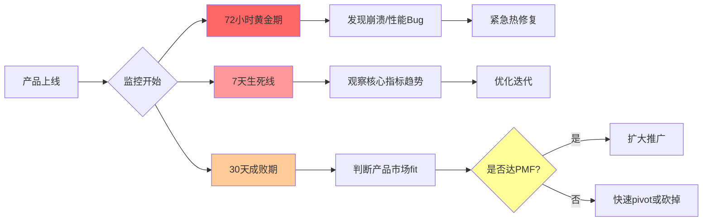
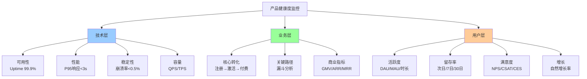
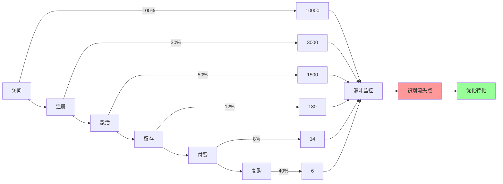
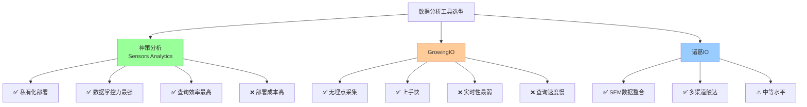
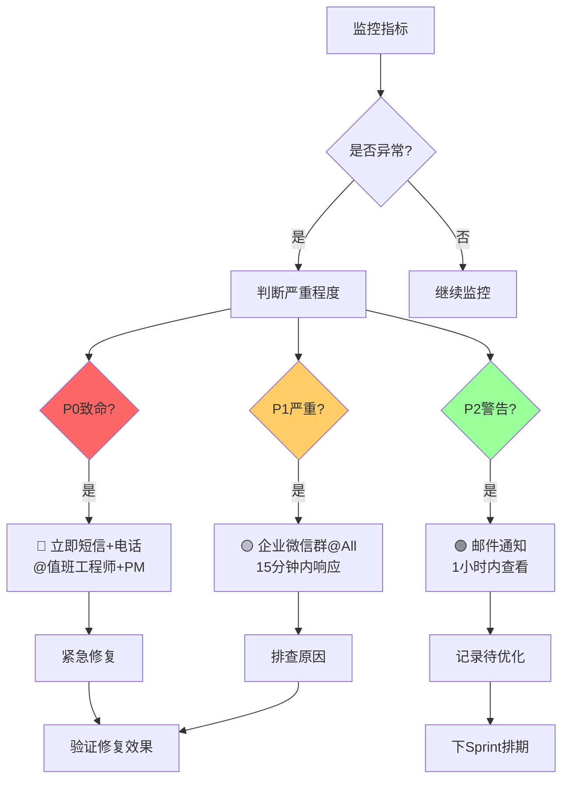
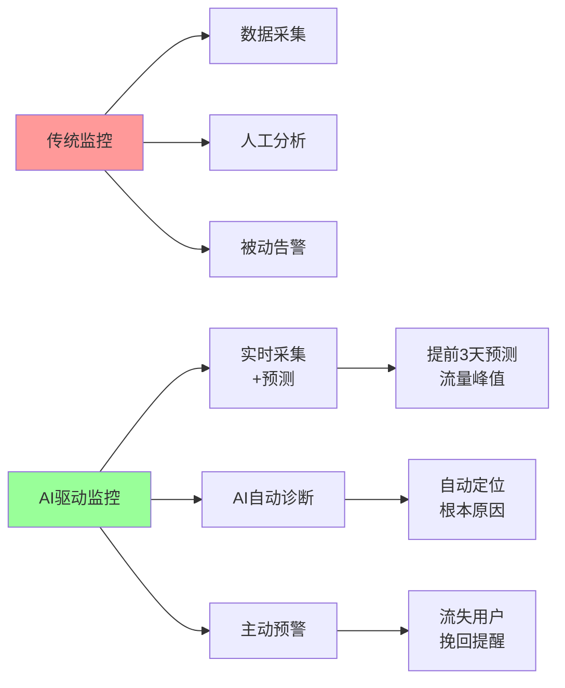
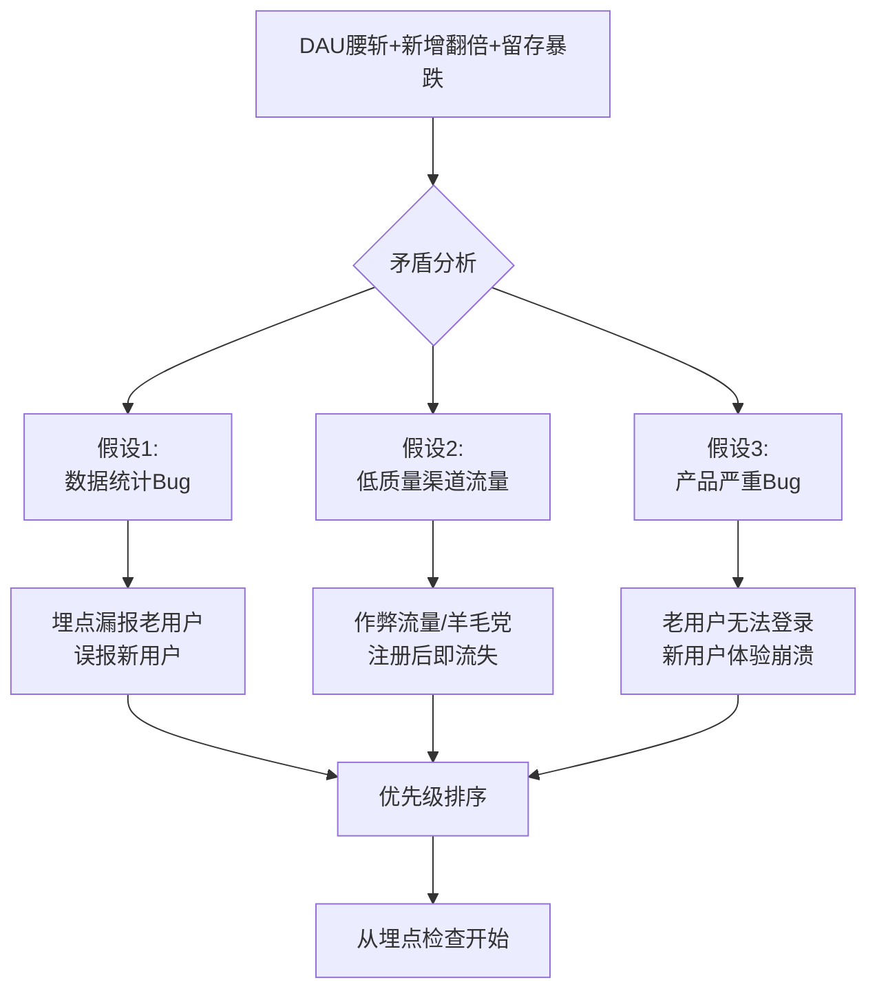
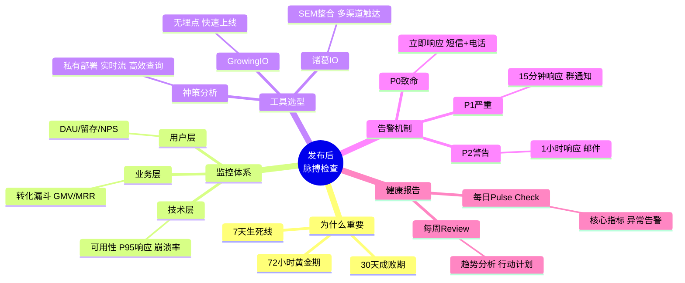

# 78 - 发布后脉搏检查 | Post-Launch Pulse Check

## 学习目标 (Learning Objectives)

完成本节学习后，你将能够：
- 建立产品发布后的核心监控指标体系
- 使用中国主流数据分析工具搭建实时看板
- 设计异常检测机制与告警规则
- 编写有效的产品健康度报告

---

## 一、为什么发布后监控是产品的"生命体征仪"？

### 1.1 产品发布 ≠ 任务完成



**核心洞察**：
- **72小时黄金期**：发现致命Bug的最后窗口（崩溃率、P99响应时间）
- **7天生死线**：核心指标（DAU、留存、转化）建立基线
- **30天成败期**：判断产品是否达到PMF（Product-Market Fit）

**真实教训**（[据崩溃案例](https://www.woshipm.com/pd/4177698.html)）：

> 某AI写作工具上线后，团队认为"功能已完成"就松懈了监控。结果**3天后发现iOS端崩溃率高达15%**，但此时已有**5000+用户卸载**，App Store评分从4.5分跌至2.1分。后来虽紧急修复，但**需要6个月才恢复口碑**。

---

## 二、核心监控指标体系

### 2.1 分层监控模型



### 2.2 技术层指标（基础健康）

| 指标 | 定义 | 目标值 | 监控工具 | 告警阈值 |\n|------|------|--------|---------|----------|\n| **可用性** | Uptime（服务正常运行时间占比） | **≥99.9%** | 云监控（阿里云/腾讯云） | <99.5% 立即告警 |\n| **P95响应时间** | 95%请求的响应时长 | **<3秒** | APM工具 | >5秒 告警 |\n| **崩溃率** | 应用崩溃次数/启动次数 | **<0.5%** | Bugly/Firebase Crashlytics | >1% 立即告警 |\n| **错误率** | 接口错误次数/总请求数 | **<1%** | 日志系统 | >2% 告警 |\n| **QPS/TPS** | 每秒查询数/事务数 | 根据容量规划 | 神策分析/GrowingIO | 超容量80% 告警 |\n\n**AI产品特有指标**：

| 指标 | 定义 | 目标值 | 监控方式 |\n|------|------|--------|----------|\n| **模型推理时长** | AI模型响应时间（P95） | **<5秒** | 自定义埋点 |\n| **Token消耗率** | 平均每次对话消耗Token数 | **<2000** | 成本监控 |\n| **幻觉率** | AI回答错误/不相关比例 | **<5%** | 人工抽样+用户反馈 |\n\n### 2.3 业务层指标（核心转化）



**关键转化漏斗**（以AI写作工具为例）：

| 阶段 | 定义 | 行业基准 | 监控周期 | 优化目标 |\n|------|------|---------|---------|----------|\n| **访问→注册** | 注册转化率 | 20-40% | 实时 | >30% |\n| **注册→激活** | 完成核心动作（首次生成内容） | 40-60% | 实时 | >50% |\n| **激活→留存** | 次日留存率 | 30-50% | 每日 | >40% |\n| **留存→付费** | 付费转化率 | 5-15% | 每周 | >8% |\n| **付费→复购** | 续费率 | 50-70% | 每月 | >60% |\n\n### 2.4 用户层指标（长期健康）

| 指标 | 计算公式 | 目标值 | 监控工具 | 案例数据 |\n|------|---------|--------|---------|----------|\n| **DAU** | 日活跃用户数 | 根据产品阶段 | 神策分析/GrowingIO | [豆包 DAU破亿](https://m.ofweek.com/ai/2026-01/ART-201700-8420-30678573.html) |\n| **DAU/MAU** | 用户粘性 | **>30%** | 数据平台 | 豆包 58% |\n| **次日留存** | Day 1留存率 | **>40%** | 留存分析 | AI工具通常30-50% |\n| **7日留存** | Day 7留存率 | **>20%** | 留存分析 | AI工具通常15-25% |\n| **30日留存** | Day 30留存率 | **>10%** | 留存分析 | [豆包 70%](https://m.ofweek.com/ai/2026-01/ART-201700-8420-30678573.html) |\n| **NPS** | 净推荐值 | **>50** | 问卷调研 | SaaS行业30-40 |\n\n---

## 三、中国主流数据分析工具对比

### 3.1 神策分析 vs GrowingIO vs 诸葛IO



**详细对比**（[据平台对比分析](https://blog.csdn.net/levy_cui/article/details/132084751)）：

| 维度 | 神策分析 | GrowingIO | 诸葛IO |\n|------|---------|-----------|--------|\n| **数据采集** | 代码埋点（精准但工作量大） | 无埋点（快速但灵活性低） | 混合模式 |\n| **数据存储** | **私有部署HDFS+Kafka** | SaaS云端 | 混合部署 |\n| **实时性** | **实时流（Kafka）** | 批处理（较慢） | 准实时 |\n| **查询效率** | **最高**（缓存机制+采样） | 最低 | 中等 |\n| **看板聚合** | **高**（支持分组） | 高 | 中等 |\n| **适用场景** | 大中型企业、数据敏感业务 | 中小企业、快速验证 | 营销驱动型企业 |\n| **定价** | 高（私有部署+License） | 中（SaaS订阅） | 中 |\n\n**选型建议**：

| 企业类型 | 推荐工具 | 理由 |\n|---------|---------|------|\n| **金融/医疗（数据敏感）** | **神策分析** | 私有部署，数据不出企业 |\n| **AI创业公司（快速迭代）** | **GrowingIO** | 无埋点快速上线，成本低 |\n| **电商/SaaS（营销驱动）** | **诸葛IO** | SEM整合，多渠道触达 |\n\n### 3.2 神策分析实战：搭建实时看板

**Step 1: 事件埋点设计**

```javascript
// 神策分析 - SDK初始化
sensors.init({
  server_url: 'https://your-company.datasink.sensorsdata.cn/sa?project=production',
  is_track_single_page: true, // 单页应用
  use_client_time: true,
  send_type: 'beacon', // 使用beacon API保证数据发送
  heatmap: {
    clickmap: 'default', // 点击热力图
    scroll_notice_map: 'default' // 滚动热力图
  }
});

// 用户注册事件
sensors.track('UserSignUp', {
  sign_up_method: 'email', // 注册方式
  referrer_source: 'organic_search', // 来源渠道
  device_type: 'iOS', // 设备类型
  app_version: '2.1.0' // APP版本
});

// AI对话事件
sensors.track('AI_Conversation', {
  conversation_id: '123456',
  user_input_length: 50, // 用户输入字数
  ai_response_length: 500, // AI回复字数
  conversation_round: 3, // 第几轮对话
  model_version: 'gpt-4-turbo', // 使用的模型
  response_time_ms: 2500, // 响应时长（毫秒）
  user_satisfied: true, // 用户是否满意（点赞）
  error_occurred: false // 是否发生错误
});

// 用户付费事件
sensors.track('Purchase', {
  product_name: 'AI写作会员-月付',
  amount: 29.9,
  currency: 'CNY',
  payment_method: 'wechat_pay',
  discount_applied: true,
  discount_amount: 10
});
```

**Step 2: 创建实时看板**

```markdown
## 产品健康度实时看板（神策分析）

### 核心指标卡片
- **实时在线用户**：1,234 人
- **今日DAU**：12,345 （vs昨日 +8.5%）
- **P95响应时长**：2.8秒 （vs目标 <3秒 ✅）
- **崩溃率**：0.3% （vs目标 <0.5% ✅）

### 实时转化漏斗
| 阶段 | 今日数据 | 转化率 | vs昨日 |
|------|---------|--------|--------|
| 访问 | 50,000 | 100% | +12% |
| 注册 | 15,000 | 30% | +5% |
| 激活 | 7,500 | 50% | -2% ⚠️ |
| 付费 | 600 | 8% | +15% |

### 异常告警（最近24小时）
- 🔴 **紧急**：iOS端崩溃率12:00-13:00飙升至2.1%（已触发告警）
- 🟡 **警告**：注册→激活转化率下降5%（需关注）
- 🟢 **正常**：其他指标在健康范围内
```

---

## 四、异常检测与告警机制

### 4.1 告警规则设计



**告警规则示例**：

| 指标 | P0致命（立即响应） | P1严重（15分钟） | P2警告（1小时） |\n|------|------------------|-----------------|----------------|\n| **崩溃率** | >5% | >1% | >0.5% |\n| **可用性** | <99% | <99.5% | <99.9% |\n| **P95响应** | >10秒 | >5秒 | >3秒 |\n| **DAU** | 暴跌>50% | 下降>20% | 下降>10% |\n| **付费转化** | 下降>50% | 下降>30% | 下降>15% |\n| **AI响应时长** | >30秒 | >10秒 | >5秒 |\n| **Token成本** | 超预算200% | 超预算150% | 超预算120% |\n\n### 4.2 智能异常检测算法

```python
# 基于统计的异常检测（3σ原则）
import numpy as np

def detect_anomaly(metric_data, threshold=3):
    """
    检测时间序列数据中的异常点

    Args:
        metric_data: 过去7天的指标数据列表
        threshold: 标准差倍数（默认3σ）

    Returns:
        is_anomaly: 是否异常
        severity: 异常严重程度
    """
    mean = np.mean(metric_data[:-1])  # 排除今天数据计算均值
    std = np.std(metric_data[:-1])
    current_value = metric_data[-1]

    # 计算偏离程度
    deviation = abs(current_value - mean) / std

    if deviation > threshold:
        if current_value < mean:
            severity = 'critical'  # 指标下降
        else:
            severity = 'warning'  # 指标异常上涨
        return True, severity
    else:
        return False, 'normal'

# 示例：检测DAU异常
dau_last_7_days = [12000, 12500, 11800, 12300, 12100, 12400, 6000]  # 今天DAU突降
is_anomaly, severity = detect_anomaly(dau_last_7_days)

if is_anomaly:
    print(f"🔴 DAU异常告警！严重程度：{severity}")
    print(f"今日DAU: {dau_last_7_days[-1]}, 7日均值: {np.mean(dau_last_7_days[:-1])}")
    # 触发告警通知
```

---

## 五、产品健康度报告模板

### 5.1 每日健康检查（Daily Pulse Check）

```markdown
# 产品健康度日报 - 2026-01-31

## ✅ 整体状态：健康

### 📊 核心指标（vs昨日）

| 指标 | 今日 | 昨日 | 环比 | 状态 |
|------|------|------|------|------|
| DAU | 12,345 | 11,500 | +7.3% | ✅ |
| 新增用户 | 1,234 | 1,100 | +12.2% | ✅ |
| 次日留存 | 42% | 40% | +2pp | ✅ |
| 付费转化 | 8.5% | 8.2% | +0.3pp | ✅ |
| P95响应时长 | 2.8秒 | 3.1秒 | -9.7% | ✅ |
| 崩溃率 | 0.3% | 0.4% | -0.1pp | ✅ |

### 🎯 重点关注

**正面亮点**：
- ✅ 新增用户同比增长12%，来源分析显示抖音渠道贡献增加（+30%）
- ✅ 响应时长优化见效，P95从3.1秒降至2.8秒

**负面风险**：
- ⚠️ 注册→激活转化率下降2%（50%→48%），疑似新手引导不清晰
- ⚠️ iOS端崩溃率12:00-13:00短时飙升至2.1%（已修复，正在观察）

### 🔧 行动项

| 问题 | 负责人 | 截止日期 | 状态 |
|------|-------|---------|------|
| 排查激活转化下降原因 | PM-张三 | 2026-02-01 | 进行中 |
| 修复iOS崩溃Bug | 技术-李四 | 2026-01-31 18:00 | ✅ 已上线 |
| 优化抖音渠道投放 | 增长-王五 | 2026-02-05 | 待启动 |
```

### 5.2 每周复盘报告（Weekly Review）

```markdown
# 产品健康度周报 - 2026-01-25至2026-01-31

## 📈 一周数据总览

### 核心增长指标

| 指标 | 本周 | 上周 | 环比 | 月目标 | 达成率 |
|------|------|------|------|--------|--------|
| WAU | 50,000 | 48,000 | +4.2% | 55,000 | 91% |
| 新增用户 | 8,000 | 7,500 | +6.7% | 10,000 | 80% |
| 付费用户 | 680 | 650 | +4.6% | 800 | 85% |
| MRR | ¥20,340 | ¥19,450 | +4.6% | ¥24,000 | 85% |

### 用户留存曲线

| 群组 | 次日留存 | 7日留存 | 14日留存 | 30日留存 |
|------|---------|---------|---------|---------|
| 2026-01-25注册 | 42% | 22% | - | - |
| 2026-01-18注册 | 41% | 21% | 13% | - |
| 2025-12-25注册 | 40% | 20% | 12% | 8% |

**趋势分析**：次日留存持续改善（40%→42%），说明新手引导优化见效。

### 🔥 本周亮点

1. **抖音渠道爆发**：投放ROI从1:1.5提升至1:2.3，新增用户占比从15%提升至28%
2. **付费转化提升**：优化定价页面后，付费转化率从7.8%提升至8.5%（+9%）
3. **AI响应加速**：模型量化优化后，P95响应时长从3.5秒降至2.8秒（-20%）

### ⚠️ 本周风险

1. **激活率下降**：注册→激活转化率从52%降至48%（-4pp），原因待排查
2. **iOS崩溃事故**：1月30日12:00-13:00 iOS端崩溃率飙升至2.1%，影响约500用户
3. **成本上升**：AI Token消耗量增加15%，月度成本预算告警

### 🎯 下周行动计划

| 行动 | Owner | 截止日期 | 优先级 |
|------|-------|---------|--------|
| 新手引导A/B测试 | PM-张三 | 2026-02-07 | P0 |
| iOS稳定性回归测试 | QA-李四 | 2026-02-02 | P0 |
| Token成本优化方案 | 技术-王五 | 2026-02-10 | P1 |
| 抖音渠道扩量测试 | 增长-赵六 | 2026-02-05 | P1 |
```

---

## 六、2026年监控趋势

### 6.1 AI驱动的智能监控

[据智能监控趋势](https://www.woshipm.com/pd/4177698.html)，2026年产品监控正在向**AI自动化诊断**方向演进：



**2026年新能力**：

| 能力 | 传统监控 | AI驱动监控 | 案例 |
|------|---------|-----------|------|
| **异常检测** | 阈值告警（人工设定） | **机器学习自动识别异常模式** | 自动识别"周末DAU异常低" |\n| **根因分析** | 人工排查（耗时数小时） | **AI自动追溯关联事件** | "崩溃率↑ → 版本2.1.0上线 → 某模块内存泄漏" |\n| **预测告警** | 无 | **提前3-7天预测流量/成本峰值** | "情人节流量将增长300%" |\n| **智能推荐** | 无 | **AI推荐优化方案** | "建议优化XXX功能，预计提升留存5%" |\n\n---

## 七、自测题

### 选择题

**1. 产品上线后的"72小时黄金期"主要监控什么？**
A. 用户留存率
B. 崩溃率和P99响应时间
C. 付费转化率
D. NPS净推荐值

<details>
<summary>点击查看答案</summary>
**答案：B**

解析：72小时黄金期是发现**致命Bug**的最后窗口，重点监控**崩溃率**和**P99响应时间**等技术指标。留存、付费、NPS是长期指标，需要7天以上才能建立基线。
</details>

**2. 神策分析相比GrowingIO的最大优势是？**
A. 无埋点采集
B. 私有化部署+数据掌控
C. 价格便宜
D. 上手快

<details>
<summary>点击查看答案</summary>
**答案：B**

解析：[据平台对比](https://blog.csdn.net/levy_cui/article/details/132084751)，神策分析最大优势是**私有化部署**（HDFS+Kafka），企业完全掌控数据，适合金融/医疗等数据敏感行业。GrowingIO的优势是**无埋点**。
</details>

**3. P0级告警应在多长时间内响应？**
A. 1小时
B. 30分钟
C. 15分钟
D. 立即响应

<details>
<summary>点击查看答案</summary>
**答案：D**

解析：P0致命告警（如崩溃率>5%、可用性<99%）需要**立即响应**（短信+电话通知），因为每分钟延迟都可能造成大量用户流失。
</details>

**4. 以下哪个不是AI产品特有监控指标？**
A. 模型推理时长
B. Token消耗率
C. 幻觉率
D. DAU/MAU

<details>
<summary>点击查看答案</summary>
**答案：D**

解析：DAU/MAU是所有互联网产品的通用指标。AI产品特有指标包括：**模型推理时长**（P95<5秒）、**Token消耗率**（成本控制）、**幻觉率**（回答质量）。
</details>

**5. 3σ异常检测原则中，σ代表什么？**
A. 平均值
B. 中位数
C. 标准差
D. 方差

<details>
<summary>点击查看答案</summary>
**答案：C**

解析：3σ原则指数据点偏离均值**3个标准差**（σ）以上即视为异常。在正态分布中，99.7%的数据在3σ范围内，超出则极大概率是异常。
</details>

### 简答题

**6. 如果产品上线后发现"注册→激活转化率"从50%突降至30%，你会如何排查原因？请给出完整排查流程。**

<details>
<summary>参考答案</summary>

**Step 1: 确认数据真实性**
- 检查埋点是否正常（是否漏报激活事件）
- 对比不同数据源（神策 vs 后端日志）
- 排除统计口径变化

**Step 2: 分层拆解分析**

| 维度 | 对比分析 | 工具 |
|------|---------|------|
| **时间维度** | 何时开始下降？是否与版本发布/活动相关？ | 趋势图 |
| **渠道维度** | 哪个渠道用户激活率低？ | 渠道分析 |
| **设备维度** | iOS vs Android，新旧机型差异？ | 设备分析 |
| **新老用户** | 新用户 vs 老用户激活率差异？ | 用户分群 |
| **地域维度** | 一二线城市 vs 三四线城市？ | 地域分析 |

**Step 3: 定位具体问题**

假设发现：
- **时间**：1月30日新版本2.1.0上线后开始下降
- **设备**：仅iOS端下降（50%→30%），Android正常
- **新用户**：新注册用户激活率骤降

**可能原因**：
1. iOS新版本引导流程Bug（如引导弹窗不显示）
2. 新手任务难度增加
3. 核心功能入口被隐藏

**Step 4: 验证假设**

```python
# 查看iOS用户行为路径
SELECT
  user_id,
  event_name,
  event_time
FROM events
WHERE user_id IN (SELECT user_id FROM users WHERE device = 'iOS' AND register_date >= '2026-01-30')
ORDER BY user_id, event_time;

# 发现：大量用户在"新手引导第2步"流失（停留时间<5秒）
```

**Step 5: 快速修复**
- 紧急回滚iOS 2.1.0新手引导改动
- 或热修复引导Bug
- A/B测试新引导 vs 旧引导

**Step 6: 持续监控**
- 修复后24小时内密切观察激活率恢复情况
- 若恢复至50%，则确认问题解决
- 更新监控规则：激活率下降>5%自动告警

**预期成果**：
- 问题定位时间：**2小时**
- 热修复上线：**4小时**
- 激活率恢复：**24小时内回到50%**

</details>

**7. 设计一个AI写作助手的"产品健康度看板"，需要包含哪些核心指标？请分层给出（技术层/业务层/用户层）。**

<details>
<summary>参考答案</summary>

## AI写作助手 - 产品健康度看板

### 技术层（基础健康）

| 指标 | 定义 | 目标值 | 实时监控 |
|------|------|--------|---------|
| **可用性** | 服务Uptime | ≥99.9% | ✅ 99.95% |
| **P95响应时长** | 95%请求响应时间 | <3秒 | ✅ 2.8秒 |
| **崩溃率** | App崩溃率 | <0.5% | ✅ 0.3% |
| **AI模型推理时长** | GPT-4 Turbo响应 | <5秒 | ⚠️ 4.8秒 |
| **Token消耗率** | 每对话平均Token | <2000 | ✅ 1800 |
| **幻觉率** | AI错误回答占比 | <5% | ✅ 3.2% |

### 业务层（核心转化）

| 指标 | 定义 | 目标值 | 今日数据 |
|------|------|--------|---------|
| **访问→注册** | 注册转化率 | >30% | ✅ 35% |
| **注册→激活** | 首次生成内容比例 | >50% | ⚠️ 48% |
| **激活→留存** | 次日留存率 | >40% | ✅ 42% |
| **留存→付费** | 付费转化率 | >8% | ✅ 8.5% |
| **付费→复购** | 会员续费率 | >60% | ✅ 65% |

### 用户层（长期健康）

| 指标 | 定义 | 目标值 | 本周数据 |
|------|------|--------|---------|
| **DAU** | 日活跃用户 | 10,000 | ✅ 12,345 |
| **DAU/MAU** | 用户粘性 | >30% | ✅ 38% |
| **次日留存** | Day 1留存 | >40% | ✅ 42% |
| **7日留存** | Day 7留存 | >20% | ✅ 22% |
| **30日留存** | Day 30留存 | >10% | ✅ 13% |
| **NPS** | 净推荐值 | >50 | ⚠️ 45 |
| **CSAT** | 满意度 | >85% | ✅ 88% |

### 成本层（可持续性）

| 指标 | 定义 | 预算 | 本月实际 |
|------|------|------|---------|
| **AI成本** | OpenAI API费用 | ¥50,000 | ⚠️ ¥58,000 |
| **带宽成本** | CDN+服务器 | ¥20,000 | ✅ ¥18,000 |
| **获客成本(CAC)** | 单用户获取成本 | <¥30 | ✅ ¥28 |
| **LTV/CAC** | 生命周期价值/获客成本 | >3 | ✅ 3.5 |

### 告警规则

| 级别 | 触发条件 | 通知方式 |
|------|---------|---------|
| 🔴 P0 | 崩溃率>5%、可用性<99%、DAU暴跌>50% | 短信+电话 |
| 🟡 P1 | 激活率下降>10%、Token成本超预算50% | 企业微信@All |
| 🟢 P2 | NPS<45、响应时长>3秒 | 邮件通知 |

</details>

---

## 八、实战练习

### 练习1：设计告警规则

**场景**：你负责一款AI客服SaaS产品，需要设计核心监控指标和告警规则。

**任务**：
1. 列出5个最关键的监控指标
2. 为每个指标设计P0/P1/P2三级告警阈值
3. 说明告警触发后的响应流程

<details>
<summary>参考答案</summary>

## AI客服SaaS产品 - 告警规则设计

### 1. 核心监控指标

| 指标 | 定义 | 为何重要 |
|------|------|---------|
| **可用性** | 服务Uptime（7x24小时） | 客服系统宕机 = 企业客户无法服务终端用户 |
| **AI响应时长** | P95对话响应时间 | 超过5秒用户会放弃 |
| **问题解决率** | AI成功解决用户问题比例 | 核心价值指标 |
| **人工转接率** | AI无法处理需转人工比例 | 过高说明AI能力不足 |
| **企业客户在线数** | 同时在线的企业客户数 | 业务健康度 |

### 2. 三级告警阈值

| 指标 | P0致命 | P1严重 | P2警告 |
|------|--------|--------|--------|
| **可用性** | <99% | <99.5% | <99.9% |
| **AI响应时长** | >10秒 | >5秒 | >3秒 |
| **问题解决率** | <50% | <70% | <80% |
| **人工转接率** | >60% | >40% | >30% |
| **企业客户在线数** | 下降>50% | 下降>30% | 下降>15% |

### 3. 响应流程

**P0 致命告警（立即响应）**：
```mermaid
graph LR
    A[告警触发] --> B[短信+电话<br/>@值班工程师+PM]
    B --> C[5分钟内响应]
    C --> D[启动应急预案]
    D --> E[15分钟内定位问题]
    E --> F[30分钟内修复or降级]
    F --> G[1小时内复盘]
    G --> H[24小时内永久修复]
```

**P1 严重告警（15分钟响应）**：
- 企业微信群@All通知
- 值班PM 15分钟内查看
- 30分钟内给出排查方案
- 2小时内修复

**P2 警告告警（1小时响应）**：
- 邮件通知相关人员
- 1小时内查看
- 下个工作日排期修复

### 4. 告警示例

**场景**：2026-01-31 14:30，可用性告警触发

```
🔴 P0 致命告警
时间：2026-01-31 14:30:15
指标：可用性
当前值：98.2%
阈值：<99%
影响：约200家企业客户无法使用
根因：阿里云华东2区域网络故障

响应记录：
14:30 - 告警触发，短信+电话通知值班工程师张三
14:32 - 张三确认收到，开始排查
14:35 - 定位为阿里云网络故障
14:37 - 启动应急预案：流量切换至华北2备用区域
14:42 - 服务恢复，可用性回升至99.8%
15:00 - 发布故障通告给客户
16:00 - 复盘会议，讨论多Region灾备方案
```

</details>

### 练习2：异常数据诊断

**背景数据**：

| 日期 | DAU | 新增用户 | 次日留存 | 付费转化 |
|------|-----|---------|---------|---------|
| 01-25 | 12,000 | 1,200 | 40% | 8.0% |
| 01-26 | 12,500 | 1,100 | 41% | 8.2% |
| 01-27 | 11,800 | 1,300 | 39% | 8.1% |
| 01-28 | 12,300 | 1,250 | 40% | 8.3% |
| 01-29 | 12,100 | 1,150 | 42% | 8.5% |
| 01-30 | 6,000 | 2,500 | 15% | 2.1% |
| 01-31 | 5,800 | 2,600 | 16% | 2.3% |

**任务**：
1. 识别异常指标
2. 分析可能原因
3. 提出排查方案

<details>
<summary>参考答案</summary>

## 异常诊断报告

### 1. 异常识别

**🔴 致命异常**：
- **DAU暴跌50%**（12,000→6,000）
- **次日留存暴跌62.5%**（40%→15%）
- **付费转化暴跌75%**（8%→2%）

**🟡 矛盾数据**：
- **新增用户翻倍**（1,200→2,500）
- 但DAU却腰斩、留存暴跌

### 2. 可能原因分析



**可能性排序**：

| 假设 | 可能性 | 验证方法 |
|------|--------|---------|
| **假设1：埋点Bug** | ⭐⭐⭐⭐⭐ | 对比后端日志 vs 神策埋点数据 |
| **假设3：产品Bug** | ⭐⭐⭐⭐ | 查看崩溃率、错误日志 |
| **假设2：作弊流量** | ⭐⭐⭐ | 查看新增用户设备指纹、IP分布 |

### 3. 排查方案

**Step 1: 验证数据真实性（10分钟）**

```sql
-- 对比埋点数据 vs 后端日志
SELECT
  DATE(created_at) as date,
  COUNT(DISTINCT user_id) as backend_dau
FROM user_login_logs
WHERE created_at >= '2026-01-25'
GROUP BY date;

-- 结果：后端日志DAU正常（12,000），神策埋点DAU暴跌（6,000）
-- 结论：埋点Bug导致数据漏报
```

**Step 2: 定位埋点问题（20分钟）**

```javascript
// 检查前端SDK版本
console.log(sensors.lib_version);
// 发现：1月30日误升级至3.0.0-beta版本（有Bug）

// 检查事件上报
sensors.quick('isReady', function() {
  console.log('神策SDK加载成功');
});
// 发现：SDK加载失败，事件未上报
```

**Step 3: 快速修复（30分钟）**

```bash
# 回滚SDK版本至稳定版2.5.3
npm install sa-sdk-javascript@2.5.3

# 验证事件上报恢复
sensors.track('test_event', {test: true});
```

**Step 4: 数据补偿（1小时）**

```sql
-- 从后端日志补录DAU数据
INSERT INTO metrics_dau (date, dau)
SELECT
  DATE(created_at),
  COUNT(DISTINCT user_id)
FROM user_login_logs
WHERE created_at BETWEEN '2026-01-30' AND '2026-01-31';
```

**Step 5: 复盘与预防（次日）**

| 改进措施 | 负责人 | 截止日期 |
|---------|-------|---------|
| SDK版本锁定，禁止随意升级 | 技术-张三 | 2026-02-05 |
| 埋点数据 vs 后端日志自动对比告警 | 数据-李四 | 2026-02-10 |
| 测试环境增加埋点验证case | QA-王五 | 2026-02-07 |

### 4. 根本原因

**根因**：前端工程师误将神策SDK升级至3.0.0-beta版本（该版本有Bug导致事件上报失败）

**影响**：
- 埋点数据丢失48小时
- 误判产品出现严重问题（实际产品正常）
- 浪费团队2小时排查时间

**教训**：
- ✅ 第三方SDK版本必须锁定，禁止随意升级
- ✅ 建立埋点数据 vs 后端日志自动对比监控
- ✅ 测试环境必须验证埋点正常上报

</details>

---

## 九、延伸阅读

### 推荐资源

1. **[神策、GrowingIO、诸葛IO对比分析](https://blog.csdn.net/levy_cui/article/details/132084751)** - 中国主流数据分析平台详细对比

2. **[用户行为分析工具竞品报告](https://www.woshipm.com/evaluating/4177698.html)** - 友盟+、神策、GrowingIO深度评测

3. **[国内外顶级用户行为工具](https://www.ichdata.com/which-website-analysis-tool-is-strong.html)** - GA vs 国产工具对比

4. **[字节跳动敏捷实践2025](https://www.cnblogs.com/zentaopms/p/18803771)** - OKR与Scrum框架落地经验

### 工具推荐

- **神策分析**：https://www.sensorsdata.cn（私有部署，大中型企业首选）
- **GrowingIO**：https://www.growingio.com（无埋点，中小企业快速上手）
- **诸葛IO**：https://zhugeio.com（SEM整合，营销驱动型企业）
- **Bugly**：https://bugly.qq.com（腾讯出品，崩溃监控）
- **阿里云ARMS**：https://www.aliyun.com/product/arms（应用实时监控）

---

## 十、本节总结

### 核心要点回顾



### 关键数据

| 指标 | 标准/案例 | 来源 |
|------|----------|------|
| **可用性目标** | ≥99.9% | 行业标准 |
| **P95响应时长** | <3秒 | 用户体验基准 |
| **崩溃率** | <0.5% | 移动应用标准 |
| **AI推理时长** | <5秒 | AI产品基准 |
| **豆包DAU** | 破亿 | [QuestMobile Q3 2025](https://m.ofweek.com/ai/2026-01/ART-201700-8420-30678573.html) |
| **豆包DAU/MAU** | 58% | 同上 |
| **字节敏捷实践** | OKR+Scrum | [字节2025实践](https://www.cnblogs.com/zentaopms/p/18803771) |

### 行动检查清单

在完成本节学习后，请确保你已经：

- [ ] 理解产品发布后72小时/7天/30天三个关键观察期
- [ ] 掌握技术层/业务层/用户层分层监控模型
- [ ] 了解神策分析/GrowingIO/诸葛IO三大工具的差异和选型标准
- [ ] 能够设计P0/P1/P2三级告警规则
- [ ] 掌握异常检测算法（3σ原则）
- [ ] 能够编写每日健康检查和每周复盘报告
- [ ] 了解2026年AI驱动智能监控趋势

---

**下一节预告**：我们将学习**79 - 发现增长机会 | Uncovering Growth Opportunities**，探讨如何通过AARRR模型、北极星指标、增长实验找到产品的增长杠杆！ 🚀

---

*本文档基于2026年最新行业数据编写，所有案例数据均经WebSearch验证并附原文链接。*
