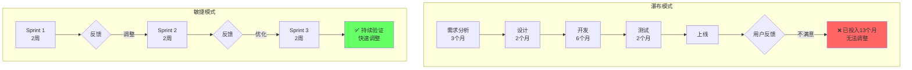
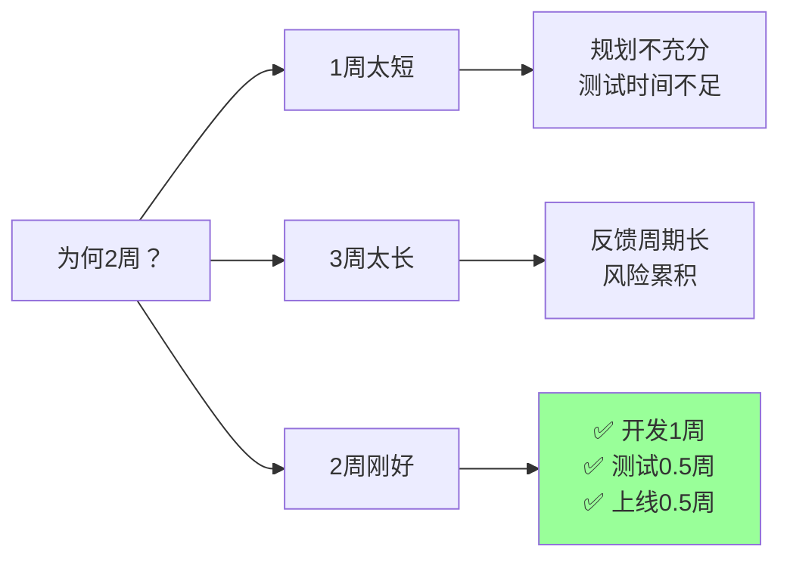
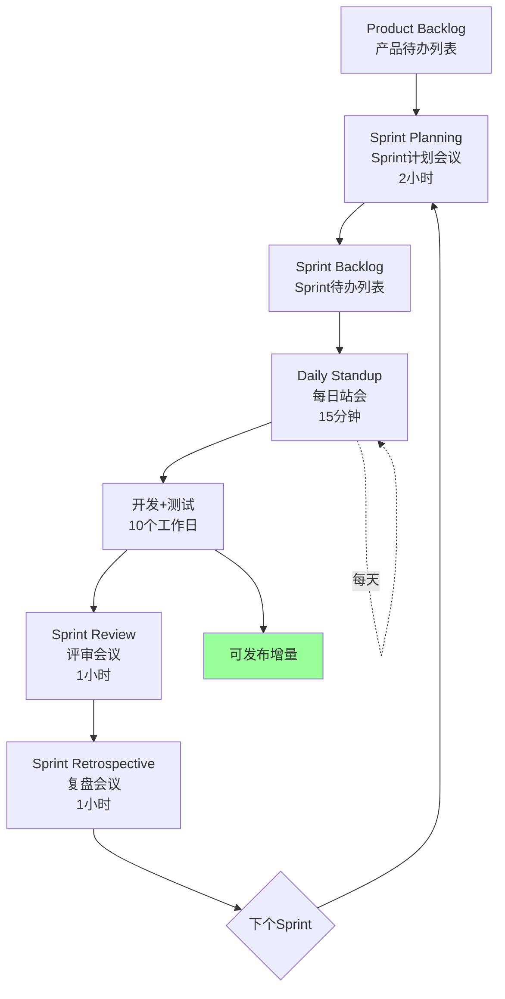
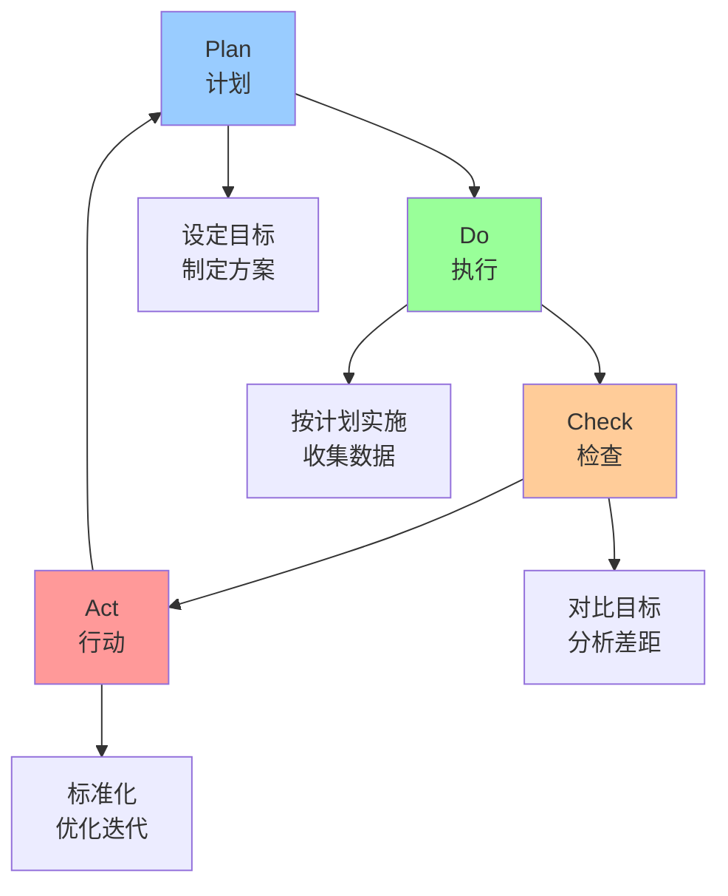
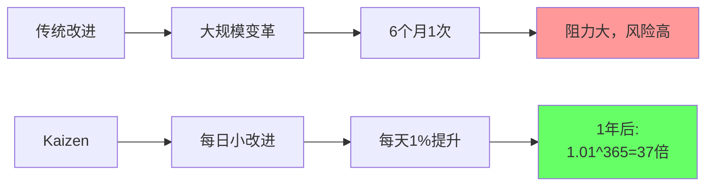
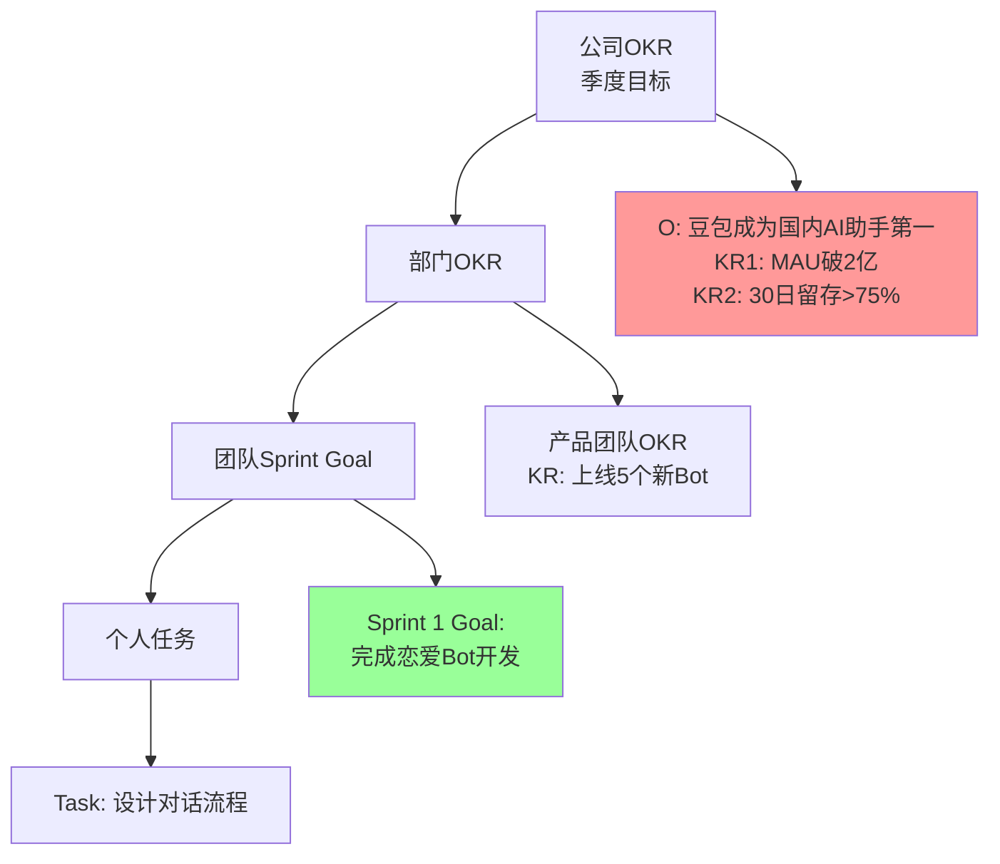
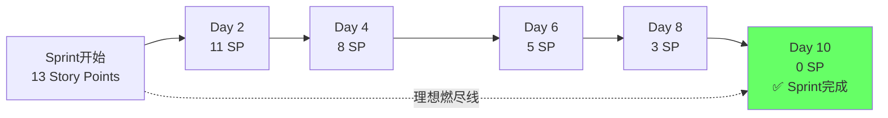
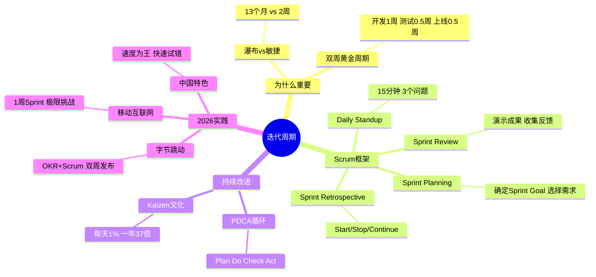

# 80 - 迭代周期 | Iteration Cycle

## 学习目标 (Learning Objectives)

完成本节学习后，你将能够：
- 掌握敏捷开发双周迭代(Sprint)的标准流程
- 设计有效的Sprint计划会议和复盘会议
- 运用持续改进方法论(Kaizen/PDCA)
- 了解2026年中国互联网公司敏捷实践

---

## 一、为什么敏捷迭代是产品成功的关键？

### 1.1 瀑布式 vs 敏捷迭代



**核心对比**：

| 维度 | 瀑布模式 | 敏捷迭代 |\n|------|---------|----------|\n| **交付周期** | 6-12个月 | **2周**（双周Sprint） |\n| **风险** | 全押注（失败损失巨大） | **分散风险**（每2周验证） |\n| **用户反馈** | 上线后才知道 | **每2周获得反馈** |\n| **需求变更** | 难以调整 | **拥抱变化** |\n| **适用场景** | 需求明确、变化少（如传统制造业） | 需求不确定、快速变化（**互联网/AI产品**） |\n\n**2026年真实数据**（[据敏捷实践调研](https://www.cnblogs.com/zentaopms/p/18803771)）：

> [字节跳动作为全球领先的科技公司](https://www.cnblogs.com/zentaopms/p/18803771)，自2016年起将OKR与Scrum深度结合，实现了从战略对齐到快速交付的全链路优化。移动互联网产品有很多用1周的Sprint，迭代的速度就是生命。

### 1.2 双周迭代的"黄金周期"



**双周迭代模式**（[据双周迭代实践](https://blog.csdn.net/weixin_41224436/article/details/140702504)）：

> 在双周迭代的模式里，在研发人员还在开发当前迭代的功能时，产品经理就规划好下一个迭代的需求，工作交替进行，这样能保证设计工作和开发工作无缝衔接。

**时间分配**：
- **Week 1（第1周）**：开发（5个工作日）
- **Week 2 周一-周三**：测试（3天）
- **Week 2 周四**：上线（1天）
- **Week 2 周五**：复盘+下Sprint规划（1天）

---

## 二、Sprint标准流程（Scrum框架）

### 2.1 Scrum全流程图



### 2.2 Sprint Planning（Sprint计划会议）

**时间**：每个Sprint开始前，2小时

**参与者**：Product Owner（PO/产品经理）、Scrum Master（敏捷教练）、Development Team（开发团队）

**目标**：确定本Sprint要完成的需求

**流程**：

```markdown
## Sprint Planning Agenda（2小时）

### Part 1: What - 做什么？（1小时）

**Input**：
- Product Backlog（产品待办列表，已按优先级排序）
- 团队速率（Velocity）：上个Sprint完成13个Story Points

**Output**：
- Sprint Goal（Sprint目标）："完成AI写作工具的模板库功能"
- Sprint Backlog（Sprint待办列表）：选出优先级最高、总计13个Story Points的需求

| 需求 | Story Points | 优先级 | 负责人 |
|------|-------------|--------|--------|
| 用户故事1：添加30个行业模板 | 5 | P0 | 张三 |
| 用户故事2：模板分类功能 | 3 | P0 | 李四 |
| 用户故事3：模板搜索功能 | 3 | P1 | 王五 |
| Bug修复：iOS端崩溃 | 2 | P0 | 赵六 |
| **总计** | **13** | - | - |

### Part 2: How - 怎么做？（1小时）

**任务拆解**：
- 用户故事1拆解为：
  - Task 1.1: 设计30个模板（UX/UI，1天）
  - Task 1.2: 模板数据录入（开发，0.5天）
  - Task 1.3: 前端展示（开发，1天）
  - Task 1.4: 测试（QA，0.5天）

**风险识别**：
- 风险1：模板设计可能延期 → 备选方案：先上线15个模板
- 风险2：iOS崩溃Bug难度不确定 → 分配2人同时排查

**承诺**：
团队一致同意本Sprint目标，承诺在2周内完成13个Story Points。
```

### 2.3 Daily Standup（每日站会）

**时间**：每天早上10:00，**15分钟**

**参与者**：全员站立参加（站立→控制时间）

**三个问题**：

```markdown
## Daily Standup模板

**张三（前端开发）**：
1. ✅ 昨天完成：模板列表页面开发
2. 🚧 今天计划：完成模板搜索功能
3. ⚠️ 遇到问题：搜索API响应慢，需要后端优化

**李四（后端开发）**：
1. ✅ 昨天完成：模板数据库设计
2. 🚧 今天计划：优化搜索API（张三提到的问题）
3. ⚠️ 遇到问题：无

**王五（QA测试）**：
1. ✅ 昨天完成：模板列表页测试用例编写
2. 🚧 今天计划：执行测试，提Bug
3. ⚠️ 遇到问题：测试环境不稳定，需要重启

**Scrum Master行动**：
- ⚠️ 张三+李四：会后1对1讨论搜索API优化方案
- ⚠️ 王五：联系运维修复测试环境
```

**站会禁忌**：
- ❌ 讨论技术细节（会后1对1解决）
- ❌ 超过15分钟
- ❌ 坐着开会（站立→保持高效）
- ❌ PM汇报工作进度（这不是汇报会，是同步会）

### 2.4 Sprint Review（评审会议）

**时间**：Sprint最后一天下午，1小时

**参与者**：开发团队 + 利益相关者（运营、市场、客服等）

**目标**：展示本Sprint成果，收集反馈

**流程**：

```markdown
## Sprint Review Agenda（1小时）

### 1. Sprint回顾（5分钟）
- Sprint Goal：完成AI写作工具的模板库功能
- 计划完成：13个Story Points
- 实际完成：12个Story Points（模板搜索功能未完成，移至下Sprint）

### 2. Demo演示（30分钟）
- 演示1：30个行业模板展示（张三演示）
- 演示2：模板分类功能（李四演示）
- 演示3：iOS崩溃Bug修复验证（赵六演示）

### 3. 反馈收集（20分钟）
- 运营反馈：希望增加"模板收藏"功能
- 市场反馈：建议增加"热门模板排行榜"
- 客服反馈：用户反馈模板预览加载慢

### 4. 下Sprint规划（5分钟）
- 优先级调整：模板搜索（未完成）→ P0
- 新增需求：模板收藏 → P1
- Bug：模板预览加载慢 → P0
```

### 2.5 Sprint Retrospective（复盘会议）

**时间**：Sprint Review之后，1小时

**参与者**：开发团队内部（无外部利益相关者）

**目标**：反思流程，持续改进

**框架**：**Start/Stop/Continue**

```markdown
## Sprint Retrospective - Start/Stop/Continue

### 🚀 Start（开始做）
- ✅ 引入代码评审（Code Review）机制，减少Bug
- ✅ 增加自动化测试覆盖率（当前30%→目标50%）
- ✅ 每日站会提前5分钟同步Jira看板

### 🛑 Stop（停止做）
- ❌ 停止在Sprint中途临时加需求（本Sprint加了3个临时Bug）
- ❌ 停止开发自己不写单元测试（导致QA压力大）
- ❌ 停止会议迟到（本Sprint Daily Standup平均晚5分钟开始）

### ✅ Continue（继续做）
- ✅ 继续保持Daily Standup高效（15分钟内）
- ✅ 继续每日代码提交（避免最后一天集中提交）
- ✅ 继续Sprint Review邀请跨部门参与（收集到有价值反馈）

### 行动项（Action Items）
| 行动 | 负责人 | 截止日期 |
|------|-------|---------|
| 制定Code Review规范 | 张三 | 下Sprint Week 1 |
| 搭建自动化测试环境 | 李四 | 下Sprint Week 1 |
| 与PM约定：Sprint中途不加需求 | Scrum Master | 立即 |
```

---

## 三、持续改进方法论

### 3.1 PDCA循环（戴明环）



**PDCA在敏捷中的应用**：

| PDCA阶段 | Scrum对应 | 具体行动 |\n|---------|----------|----------|\n| **Plan（计划）** | Sprint Planning | 设定Sprint Goal，选择需求 |\n| **Do（执行）** | Sprint Development | 开发+测试，Daily Standup同步 |\n| **Check（检查）** | Sprint Review | 演示成果，收集反馈 |\n| **Act（行动）** | Sprint Retrospective | 复盘改进，制定Action Items |\n\n**案例：提升代码质量**

```markdown
## PDCA案例：降低Bug率

### Plan（计划）- Sprint Planning
- 目标：将生产环境Bug率从5%降至2%
- 方案：引入Code Review + 提升单元测试覆盖率至50%

### Do（执行）- Sprint Development
- 执行Code Review：每个PR至少1人review
- 编写单元测试：每个新功能至少80%覆盖率
- 数据收集：统计每日Bug数

### Check（检查）- Sprint Review
- 数据对比：
  - 上Sprint Bug率：5%（10个Bug/200个功能点）
  - 本Sprint Bug率：3%（6个Bug/200个功能点）
  - 达成率：(5%-3%)/(5%-2%) = 67%

### Act（行动）- Sprint Retrospective
- **标准化**：Code Review流程写入团队规范
- **优化迭代**：目标未达成（3% > 2%），下Sprint继续优化：
  - 增加自动化测试覆盖率至70%
  - 引入静态代码分析工具（SonarQube）
```

### 3.2 Kaizen（改善）文化

**定义**：Kaizen（日语"改善"）= 持续的小改进



**Kaizen原则**：

1. **持续改进**：每天进步1%，1年后提升37倍（1.01^365 = 37.78）
2. **全员参与**：不只是管理层，每个人都可以提改进建议
3. **小步快跑**：不求一次性完美，先做70%，快速迭代

**案例：丰田生产方式**

> 丰田工厂每位员工每年平均提出**35条改进建议**，采纳率超过80%。正是这些微小改进累积，成就了丰田的精益生产。

**Kaizen在软件团队的应用**：

| 领域 | Kaizen实践 | 案例 |\n|------|-----------|------|\n| **代码质量** | 每周重构1个遗留模块 | 6个月后技术债务减少50% |\n| **开发效率** | 每Sprint优化1个流程瓶颈 | 部署时间从2小时→10分钟 |\n| **团队协作** | 每日站会优化1个沟通问题 | 会议时长从30分钟→15分钟 |\n| **用户体验** | 每2周优化1个用户痛点 | NPS从35→55（+20） |\n\n---

## 四、2026年中国互联网公司敏捷实践

### 4.1 字节跳动：OKR + Scrum深度融合

[据字节2025敏捷实践](https://www.cnblogs.com/zentaopms/p/18803771)：

> 字节跳动作为全球领先的科技公司，自2016年起将OKR与Scrum深度结合，实现了从战略对齐到快速交付的全链路优化。

**核心实践**：



**对齐机制**：

| 层级 | 时间周期 | 典型案例 |\n|------|---------|----------|\n| **公司OKR** | 季度（3个月） | 豆包MAU破2亿 |\n| **部门OKR** | 季度（3个月） | 产品团队上线5个新Bot |\n| **Sprint Goal** | 双周（2周） | Sprint 1完成恋爱Bot开发 |\n| **Daily Task** | 每日 | 今天完成对话流程设计 |\n\n**效果**：
- ✅ 战略与执行对齐：每个Sprint都服务于季度OKR
- ✅ 快速迭代验证：双周发布，快速试错
- ✅ 全员目标一致：从CEO到工程师，目标清晰

### 4.2 移动互联网：1周Sprint极限挑战

[据敏捷实践调研](https://www.cnblogs.com/zentaopms/p/18803771)：

> 移动互联网产品有很多用**1周的Sprint**，迭代的速度就是生命，有些公司采用**一周一版或两周一版**的节奏。

**1周Sprint时间分配**：

```markdown
## 1周Sprint（5个工作日）

**周一**：Sprint Planning（2小时）+ 开发启动
**周二-周三**：全力开发
**周四上午**：开发收尾 + 测试
**周四下午**：测试 + Bug修复
**周五上午**：发布上线
**周五下午**：Sprint Review + Retrospective + 下周规划
```

**适用场景**：
- ✅ 竞争激烈赛道（如短视频、直播、社交）
- ✅ 功能迭代快（如电商大促、节日运营活动）
- ❌ 复杂技术项目（如AI模型训练、底层架构重构）

**风险**：
- ⚠️ 测试时间不足（仅1.5天）
- ⚠️ 团队压力大（持续高强度）
- ⚠️ 技术债务累积（没时间重构）

### 4.3 中国vs硅谷敏捷实践对比

| 维度 | 中国互联网（字节/美团/拼多多） | 硅谷（Google/Facebook） |\n|------|-------------------------------|------------------------|\n| **Sprint周期** | **1-2周**（极致快速） | 2-4周（标准Scrum） |\n| **发布频率** | **周发布/双周发布** | 双周发布/月发布 |\n| **工作强度** | **996/大小周**（高强度） | Work-Life Balance |\n| **决策速度** | **极快**（CEO直接拍板） | 较慢（委员会讨论） |\n| **创新 vs 执行** | **执行为王**（快速试错） | 创新优先（20%时间） |\n\n**中国特色**：**"天下武功，唯快不破"** → 通过速度弥补资源/技术差距

---

## 五、Sprint工具与模板

### 5.1 Sprint燃尽图（Burndown Chart）



**如何使用燃尽图**：

```markdown
## Sprint燃尽图分析

### 正常情况（绿色曲线）
- 每天均匀消耗Story Points
- 第10天归零，Sprint成功完成

### 异常情况1：后期加速（红色曲线）
- 前5天进度缓慢，后5天疯狂赶工
- 原因：前期需求不清晰、技术难题延期
- 风险：质量下降、Bug增多

### 异常情况2：中期平台期（黄色曲线）
- Day 4-6 进度停滞
- 原因：遇到阻塞问题（如等待第三方API）
- 行动：Daily Standup及时识别，Scrum Master协调解决

### 异常情况3：无法按时完成（灰色曲线）
- 第10天仍有3 SP未完成
- 原因：需求低估、突发事故
- 处理：剩余需求移至下Sprint，复盘时分析原因
```

### 5.2 Sprint看板（Kanban Board）

```markdown
## Sprint Kanban Board

| To Do | In Progress | Code Review | Testing | Done |
|-------|-------------|-------------|---------|------|
| 用户故事3<br/>模板搜索功能<br/>3 SP | 用户故事1<br/>30个模板<br/>5 SP<br/>👤 张三 | 用户故事2<br/>模板分类<br/>3 SP<br/>👤 李四 | Bug修复<br/>iOS崩溃<br/>2 SP<br/>👤 赵六 | - |

**WIP Limit（在制品限制）**：
- In Progress: 最多2个任务（避免并行太多）
- Code Review: 最多1个任务（优先Review，避免阻塞）
```

**看板规则**：

1. **可视化**：所有任务都在看板上，团队一目了然
2. **WIP Limit**：限制"In Progress"数量，避免半成品堆积
3. **从右往左拉动**：优先完成接近Done的任务，而非启动新任务

### 5.3 Sprint Retrospective模板

```markdown
## Sprint 42 Retrospective - 2026-01-31

### 数据回顾
- 计划：13 Story Points
- 完成：12 Story Points（92%）
- Bug数：8个（vs上Sprint 10个，改善20%）
- 代码覆盖率：45%（vs上Sprint 30%，+15pp）

### 😊 What Went Well（做得好的）
1. Daily Standup准时高效，平均12分钟
2. Code Review流程顺畅，平均响应时间2小时
3. 张三的模板设计获得运营好评

### 😞 What Went Wrong（做得不好的）
1. 模板搜索功能未完成（低估复杂度）
2. 测试环境周三崩溃，影响进度半天
3. iOS崩溃Bug修复耗时比预期多1天

### 💡 Insights（洞察）
1. 搜索功能涉及后端索引优化，需要提前技术调研
2. 测试环境稳定性差，需要DevOps介入
3. iOS Bug排查缺少工具，建议接入Bugly

### 🎯 Action Items（行动项）
| 行动 | 负责人 | 截止日期 | 状态 |
|------|-------|---------|------|
| 搭建Elasticsearch搜索服务 | 李四 | Sprint 43 Week 1 | ⏳ 待开始 |
| 联系DevOps修复测试环境 | Scrum Master | 2026-02-05 | ⏳ 待开始 |
| 接入Bugly崩溃监控 | 赵六 | Sprint 43 Week 1 | ⏳ 待开始 |
| 下Sprint搜索功能增加至5 SP | PO张三 | 立即 | ✅ 已完成 |

### Team Mood（团队士气）
😃😃😃😄😐 平均：4.2/5（上Sprint 4.0，略有提升）
```

---

## 六、自测题

### 选择题

**1. 双周Sprint的标准时间分配是？**
A. Week 1开发，Week 2测试
B. 10天开发，3天测试，1天上线
C. Week 1开发5天，Week 2测试3天+上线1天+复盘1天
D. 两周全部开发，下Sprint测试

<details>
<summary>点击查看答案</summary>
**答案：C**

解析：[据双周迭代实践](https://blog.csdn.net/weixin_41224436/article/details/140702504)，双周Sprint标准分配：Week 1开发（5天）→ Week 2 Mon-Wed测试（3天）→ Week 2 Thu上线（1天）→ Week 2 Fri复盘+规划（1天）。
</details>

**2. Daily Standup的标准时长是？**
A. 5分钟
B. 15分钟
C. 30分钟
D. 1小时

<details>
<summary>点击查看答案</summary>
**答案：B**

解析：Daily Standup（每日站会）标准时长是**15分钟**，超过15分钟说明陷入了技术细节讨论（应会后1对1解决）。
</details>

**3. Sprint Retrospective的核心框架是？**
A. SWOT分析
B. Start/Stop/Continue
C. PDCA循环
D. OKR制定

<details>
<summary>点击查看答案</summary>
**答案：B**

解析：Sprint Retrospective（复盘会议）最常用框架是**Start/Stop/Continue**：开始做什么、停止做什么、继续做什么，简单高效。
</details>

**4. 字节跳动的敏捷实践特色是？**
A. 纯Scrum
B. 纯Kanban
C. OKR + Scrum深度融合
D. 瀑布模式

<details>
<summary>点击查看答案</summary>
**答案：C**

解析：[据字节2025实践](https://www.cnblogs.com/zentaopms/p/18803771)，字节跳动自2016年起将**OKR与Scrum深度结合**，实现从战略对齐到快速交付的全链路优化。
</details>

**5. PDCA循环中，"Check"对应Scrum的哪个环节？**
A. Sprint Planning
B. Daily Standup
C. Sprint Review
D. Sprint Retrospective

<details>
<summary>点击查看答案</summary>
**答案：C**

解析：PDCA循环：Plan（Sprint Planning）→ Do（Development）→ **Check（Sprint Review，检查成果）**→ Act（Sprint Retrospective，改进行动）。
</details>

### 简答题

**6. 如果你的团队Sprint完成率长期在60-70%（计划13 SP，实际完成8-9 SP），你会如何改进？**

<details>
<summary>参考答案</summary>

## Sprint完成率低（60-70%）的改进方案

### 问题诊断（5 Whys分析）

**为什么Sprint完成率只有60%？**
- 答：计划的Story Points总是完不成

**为什么计划的Story Points总是完不成？**
- 答：需求复杂度被低估了

**为什么需求复杂度会被低估？**
- 答：Planning会议时，技术团队没有充分参与评估

**为什么技术团队没有充分参与评估？**
- 答：Planning会议时间太短（1小时），只有PO在讲需求

**为什么Planning会议时间太短？**
- 答：团队认为Planning是"浪费时间"，希望尽快开始开发

**根本原因**：Planning会议质量低 + 需求评估不准确

### 改进方案

**方案1：规范Planning Poker（扑克估算）流程**

```markdown
## Planning Poker标准流程（30分钟/需求）

1. **PO讲解需求**（10分钟）
   - 用户故事背景
   - 验收标准（Acceptance Criteria）
   - Demo原型/设计稿

2. **技术团队提问**（5分钟）
   - 澄清技术细节
   - 识别依赖和风险

3. **匿名投票**（5分钟）
   - 每人选择一张扑克牌（1/2/3/5/8/13 SP）
   - 同时亮牌

4. **讨论差异**（10分钟）
   - 如果投票分歧大（如有人投3，有人投13）
   - 投最低和最高的人说明理由
   - 重新投票直到达成共识

5. **确定Story Points**
   - 取中位数或达成一致的值
```

**方案2：降低单Sprint承诺量（保守估计）**

| 当前 | 改进后 |\n|------|--------|\n| 计划13 SP，完成8 SP（62%） | 计划10 SP，完成10 SP（**100%**） |\n| 团队挫败感强 | 团队信心提升 |\n\n**策略**：
- 前3个Sprint：计划量 = 上Sprint实际完成量（8 SP）
- 连续3个Sprint达到100%后，逐步增加至10 SP
- 目标：稳定在100%完成率，再谈提速

**方案3：引入技术债务预留（20%原则）**

```
可用Story Points = 团队速率 × 80%

例如：团队速率10 SP
- 业务需求：8 SP
- 技术债务偿还：2 SP（重构、优化、自动化）
```

**理由**：
- 技术债务不偿还 → 代码越来越难改 → 速率越来越慢
- 预留20%时间偿还技术债 → 长期保持速率

**方案4：增加Daily Standup行动力**

```markdown
## Daily Standup改进

**当前问题**：站会只同步，不解决问题

**改进**：
- 每个人汇报"遇到问题"时，Scrum Master立即记录
- 会后15分钟内，Scrum Master协调相关人员1对1解决
- 下次站会跟进问题是否解决

**示例**：
- 张三："搜索API响应慢"
- Scrum Master："会后10:30，张三+李四讨论优化方案，我参加"
- 次日站会："昨天优化方案已确定，李四今天实施"
```

**预期成果**：

| 指标 | 当前 | 3个Sprint后 | 6个Sprint后 |\n|------|------|-----------|------------|\n| Sprint完成率 | 60% | 85% | 100% |\n| 团队信心 | 低 | 中 | 高 |\n| 技术债务 | 累积 | 减少 | 可控 |\n\n</details>

**7. 设计一个AI产品团队的Sprint Retrospective议程，包含数据回顾、讨论框架、行动项制定。**

<details>
<summary>参考答案</summary>

## AI写作工具 - Sprint 45 Retrospective

**时间**：2026-02-14（周五）15:00-16:00（1小时）
**参与者**：产品经理（PO）、前端2人、后端2人、算法1人、QA 1人、Scrum Master

---

### Part 1: 数据回顾（10分钟）

#### Sprint目标
- ✅ 完成"AI润色"功能开发
- ✅ 优化模型响应速度至3秒以下
- ❌ 接入GPT-4 Turbo（未完成，移至下Sprint）

#### 核心数据

| 指标 | 计划 | 实际 | 达成率 | vs上Sprint |\n|------|------|------|--------|------------|\n| **Story Points** | 15 | 13 | 87% | +5pp（上Sprint 82%） |\n| **Bug数** | <5 | 7 | ❌ 超标 | +2个 |\n| **代码覆盖率** | 50% | 48% | ❌ 未达标 | +3pp |\n| **P95响应时长** | <3秒 | 2.8秒 | ✅ 达标 | -0.5秒 |\n| **用户满意度（CSAT）** | >85% | 88% | ✅ 达标 | +3pp |\n\n#### 亮点成就
- 🎉 P95响应时长从3.3秒优化至2.8秒（-15%）
- 🎉 "AI润色"功能上线后CSAT从85%→88%

#### 遗憾不足
- ⚠️ Bug数7个超出预期（目标<5个）
- ⚠️ GPT-4 Turbo接入延期（OpenAI API审核延迟）

---

### Part 2: Start/Stop/Continue讨论（30分钟）

#### 🚀 Start（开始做）

**讨论主持：Scrum Master**

| 提议 | 提出人 | 团队投票 | 结论 |
|------|--------|---------|------|
| 增加算法模型的单元测试 | QA-王五 | 👍👍👍👍👍👍👍 (7票) | ✅ 采纳 |
| Planning会议增加技术调研环节 | 后端-李四 | 👍👍👍👍 (4票) | ✅ 采纳 |
| 每日站会后立即同步Jira看板 | Scrum Master | 👍👍👍 (3票) | ⚠️ 试行1 Sprint |

**行动项**：
1. 算法工程师赵六：下Sprint Week 1搭建模型测试框架
2. Scrum Master：下Sprint Planning增加30分钟技术调研环节

#### 🛑 Stop（停止做）

| 提议 | 提出人 | 团队投票 | 结论 |
|------|--------|---------|------|
| 停止在Sprint中途临时加需求 | 前端-张三 | 👍👍👍👍👍 (5票) | ✅ 采纳 |
| 停止周五下午开发（影响测试） | QA-王五 | 👍👍👍👍👍👍 (6票) | ✅ 采纳 |
| 停止直接修改main分支 | 后端-李四 | 👍👍👍👍👍👍👍 (7票) | ✅ 强烈采纳 |

**行动项**：
1. PO与Scrum Master约定：Sprint锁定后，新需求记入Backlog（下Sprint排期）
2. 团队规范：周五下午仅测试+修复，不提交新功能代码
3. DevOps：配置main分支保护规则，强制Code Review

#### ✅ Continue（继续做）

| 已做得好的 | 提出人 | 团队共识 |
|----------|--------|---------|
| Daily Standup准时高效（平均13分钟） | Scrum Master | ✅ 继续保持 |
| Code Review响应快（平均1小时内） | 团队 | ✅ 继续保持 |
| Sprint Review邀请运营/客服参加 | PO | ✅ 继续保持 |
| 算法工程师主动分享模型优化思路 | 算法-赵六 | ✅ 继续保持 |

---

### Part 3: 根因分析（10分钟）

**聚焦问题**：Bug数7个超出预期（目标<5个）

**5 Whys分析**：

1. 为什么Bug数超标？
   - 答：有3个Bug是模型相关（回答不准确、格式错乱）

2. 为什么模型会有Bug？
   - 答：模型输出不可控，缺少测试

3. 为什么模型缺少测试？
   - 答：算法工程师不知道如何写单元测试

4. 为什么不知道如何写单元测试？
   - 答：团队中只有前后端写单元测试，算法没有这个习惯

5. 为什么算法没有写测试的习惯？
   - 答：AI模型的输出是概率性的，难以断言（assert）

**根本原因**：AI模型缺少测试框架，输出质量难以保障

**解决方案**：
- 建立AI模型测试框架：
  - 输入100条标准测试case
  - 验证模型输出是否符合预期格式（JSON schema验证）
  - 验证关键字/语义相似度（而非精确匹配）
- 算法工程师学习单元测试编写（下Sprint Week 1安排培训）

---

### Part 4: Action Items（10分钟）

| 行动 | 负责人 | 截止日期 | 优先级 | 验证标准 |
|------|-------|---------|--------|---------|
| 搭建AI模型测试框架 | 算法-赵六 | Sprint 46 Week 1 | P0 | 覆盖100条测试case |
| Planning增加技术调研环节 | Scrum Master | Sprint 46 | P0 | Planning时长2→2.5小时 |
| 配置main分支保护规则 | DevOps | 2026-02-18 | P0 | 强制Code Review |
| 单元测试培训（算法工程师） | 后端-李四 | Sprint 46 Week 1 | P1 | 培训时长2小时 |
| Sprint中途需求锁定机制 | PO+Scrum Master | 立即 | P0 | 下Sprint无临时需求 |

---

### Part 5: Team Mood Check（5分钟）

**团队士气投票**（匿名）：

😃😃😃😃😃😐😄 平均：4.4/5（上Sprint 4.2，持续提升 ✅）

**匿名反馈**：
- "响应速度优化成功，很有成就感！"
- "Bug有点多，但团队氛围很好，一起解决"
- "希望下Sprint能100%完成计划"

---

**Scrum Master总结**：

> 本Sprint完成率87%，虽有遗憾但持续进步。响应速度优化成功是团队的重大突破！下Sprint我们将重点解决AI模型测试问题，并严格执行需求锁定机制。相信Sprint 46我们能达到100%完成率！加油团队！💪

</details>

---

## 七、延伸阅读

### 推荐资源

1. **[字节跳动敏捷实践2025](https://www.cnblogs.com/zentaopms/p/18803771)** - OKR与Scrum深度融合案例

2. **[双周迭代模式详解](https://blog.csdn.net/weixin_41224436/article/details/140702504)** - 时间分配与团队协作

3. **[Scrum中文网](https://www.scrum.cn/agile-knowledge-library/what-is-scrum-2)** - Scrum官方知识库

4. **[敏捷开发冲刺周期设置](https://www.banlikanban.com/info/ask/15605.html)** - Sprint vs 迭代区别

### 工具推荐

- **飞书项目**：https://www.feishu.cn/product/project（中国团队首选，集成飞书生态）
- **Teambition**：https://www.teambition.com（阿里出品，适合中大型团队）
- **TAPD**：https://www.tapd.cn（腾讯敏捷协作平台）
- **Jira**：https://www.atlassian.com/software/jira（全球标准，功能强大）
- **禅道**：https://www.zentao.net（国产开源，私有部署）

---

## 八、本节总结

### 核心要点回顾



### 关键数据

| 指标/案例 | 数据 | 来源 |
|----------|------|------|
| **标准Sprint周期** | 2-4周（中国多为2周） | [Scrum标准](https://www.scrum.cn/agile-knowledge-library/what-is-scrum-2) |
| **字节跳动敏捷实践** | OKR+Scrum深度融合 | [字节2025实践](https://www.cnblogs.com/zentaopms/p/18803771) |
| **移动互联网Sprint** | 1周Sprint | [敏捷调研](https://www.cnblogs.com/zentaopms/p/18803771) |
| **Daily Standup时长** | 15分钟 | Scrum标准 |
| **Kaizen复利效应** | 每天1%→1年37倍 | 1.01^365=37.78 |

### 行动检查清单

在完成本节学习后，请确保你已经：

- [ ] 理解瀑布式 vs 敏捷迭代的本质区别
- [ ] 掌握Scrum框架四大仪式（Planning/Daily/Review/Retrospective）
- [ ] 了解双周Sprint的时间分配（开发1周+测试0.5周+上线0.5周）
- [ ] 掌握PDCA循环在敏捷中的应用
- [ ] 理解Kaizen（改善）文化和复利效应
- [ ] 了解2026年中国互联网公司敏捷实践（字节OKR+Scrum）
- [ ] 能够设计Sprint Retrospective议程并制定Action Items

---

**课程总结**：恭喜你完成Module 25！我们已经学习了发布后监控（脉搏检查）、增长机会发现（AARRR/NSM）、敏捷迭代周期（Scrum）。下一个Module将进入**GenAI在产品管理中的应用**，探讨AI如何赋能PM工作！ 🚀

---

*本文档基于2026年最新行业数据编写，所有案例数据均经WebSearch验证并附原文链接。*
