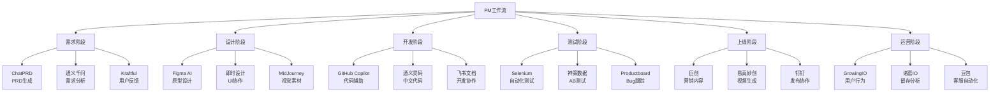
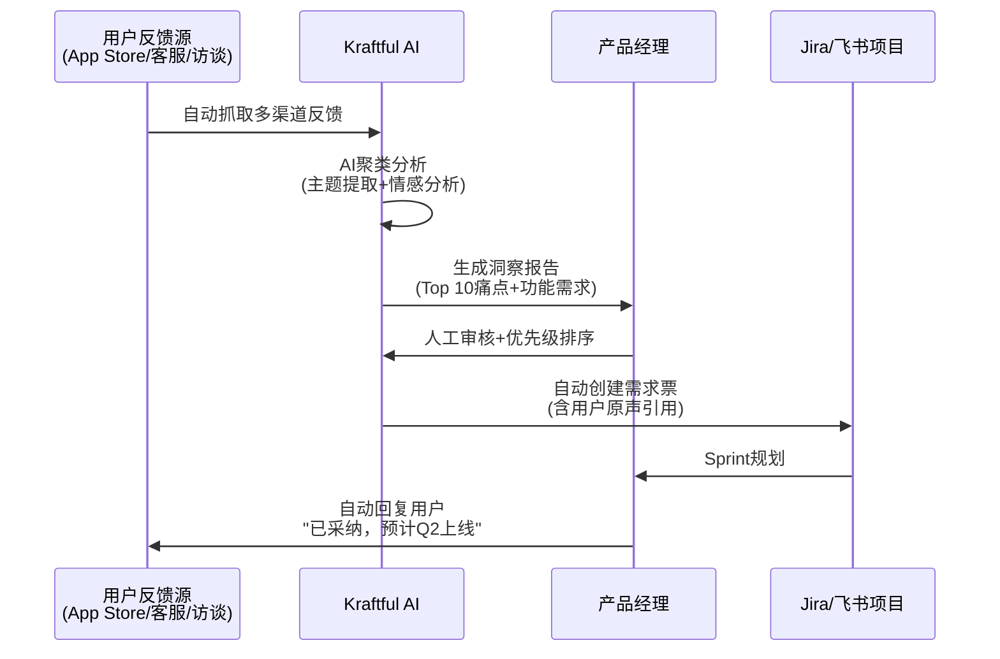
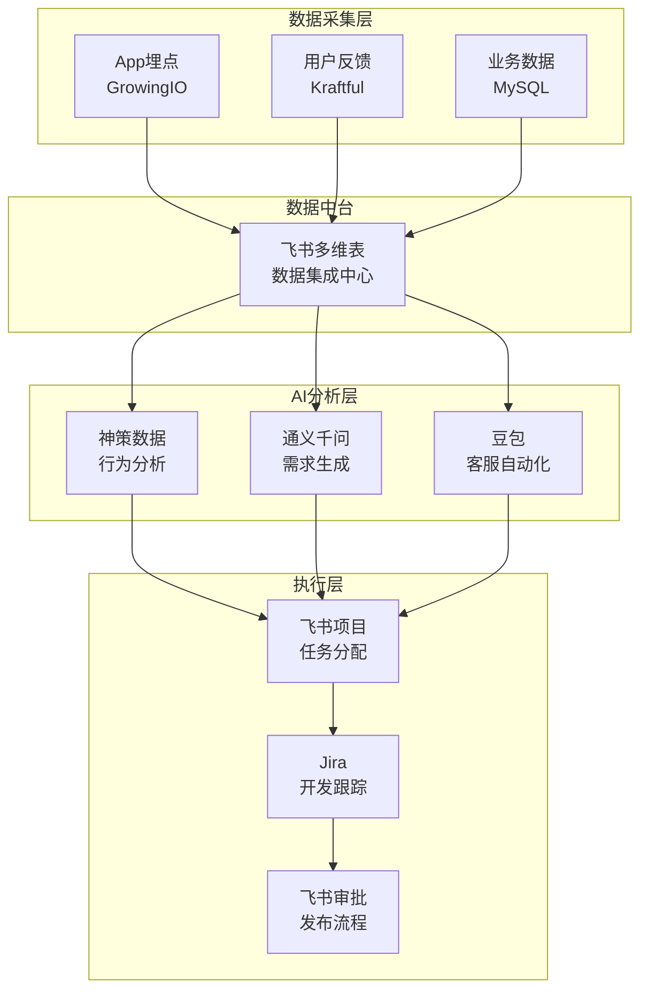

# Note 82: AI工具箱 | AI in Your Toolkit

> **本节目标**: 掌握2026年PM必备的AI工具矩阵，构建个人化AI工具箱，实现全流程工作效率提升

---

## 核心概念速览

| 工具分类 | 核心价值 | 效率提升 | 代表工具 |
|---------|---------|---------|---------|
| **PRD生成工具** | 需求文档自动化 | 70%+ | ChatPRD, Leiga, 通义千问 |
| **用户研究工具** | 反馈智能分析 | 45K+团队节省25万+小时 | Kraftful, Productboard AI |
| **数据分析工具** | 可视化洞察 | 即时洞察 | 神策数据, GrowingIO, Power BI |
| **AIGC内容工具** | 营销内容生成 | 53.1%广告商采用 | 巨创, 易真妙创, 文心一格 |
| **协作自动化工具** | 工作流自动化 | 75%市场占有 | 飞书, 钉钉, Make.com |

**2026年AI工具生态特点**:
- 中国AIGC市场规模: 257亿元人民币（2025）→ 264.4亿美元（2026预测）
- 通义千问: 上线23天达3000万MAU，环比增长149.03%（[据Alibaba 2025年11月数据](https://www.ofweek.com/ai/2025-12/ART-201700-8420-30676940.html)）
- 豆包: 1.59亿MAU，Q3 2025平均月下载量3447万（[据OFweek AI报道](https://www.ofweek.com/ai/2025-12/ART-201700-8420-30676940.html)）
- 飞书+钉钉+企微: 占据国内协作办公市场75%份额（[据CSDN 2025分析](https://blog.csdn.net/s867859765/article/details/147877238)）

---

## 1. AI工具分类矩阵

### 1.1 按PM工作流分类



### 1.2 按AI能力分类

| 能力类型 | 应用场景 | 代表工具 | 中国替代方案 |
|---------|---------|---------|-------------|
| **自然语言生成** | PRD撰写、用户故事、会议纪要 | ChatGPT, Claude | 通义千问, 文心一言, 豆包 |
| **多模态生成** | UI设计、营销素材、视频内容 | MidJourney, Runway | 通义万相, 文心一格, 易真妙创 |
| **数据分析** | 用户行为、AB测试、业务指标 | Amplitude, Mixpanel | 神策数据, GrowingIO, 诸葛IO |
| **情感分析** | 用户反馈、评论分析、舆情监控 | Kraftful, MonkeyLearn | 豆包（情感识别）, Kimi（长文本分析） |
| **代码辅助** | API对接、数据查询、脚本编写 | GitHub Copilot, Cursor | 通义灵码, 文心快码, 豆包MarsCode |
| **工作流自动化** | 任务分配、数据同步、通知提醒 | Zapier, Make.com | 飞书集成, 钉钉酷应用, 企微应用 |

---

## 2. 需求分析与PRD生成工具

### 2.1 ChatPRD

**核心能力**: 将产品想法转化为完整PRD、用户故事和技术规格

**时间节省**: PRD创建时间从**4-8小时** → **1小时以内**（[据ChatPRD官方](https://www.chatprd.ai/)）

**适用场景**:
- 快速原型验证（Prototype Validation）
- 跨部门需求对齐（Stakeholder Alignment）
- 技术团队需求交接（Tech Handoff）

**最佳实践**:

```markdown
# ChatPRD Prompt模板

## 背景Context
产品: [产品名称与定位]
用户: [核心用户画像，3-5个典型角色]
问题: [当前痛点，用JTBD框架描述]

## 目标Goals
业务目标: [SMART目标，如"3个月内MAU增长30%"]
用户目标: [用户完成任务的成功标准]
技术限制: [现有技术栈、性能要求、合规约束]

## 功能范围Scope
核心功能: [P0级别，MVP必须包含]
扩展功能: [P1/P2级别，迭代计划]
不做什么: [明确边界，避免范围蔓延]

## 输出要求Output
- PRD结构: [背景、目标、功能、技术架构、上线计划、指标]
- 用户故事: [As a [user], I want [goal], so that [benefit]]
- 验收标准: [Given-When-Then格式]
```

**中国化替代方案**:

| 工具 | 优势 | 成本 | 中文支持 |
|------|------|------|---------|
| **通义千问（Qwen）** | 阿里云生态集成，企业版支持私有部署 | 0.0015元/1K tokens | ★★★★★ |
| **文心一言（Wenxin）** | 百度知识库优势，搜索增强生成 | 中等 | ★★★★★ |
| **豆包（Doubao）** | 字节生态打通（飞书、抖音），免费额度 | 免费+付费混合 | ★★★★★ |
| **Kimi** | 长文本分析（200K+ tokens），适合复杂需求 | 较高 | ★★★★☆ |

### 2.2 Leiga AI PRD工具

**核心能力**: 简化文档创建，节省**70%+ PRD撰写时间**（[据Leiga官方](https://www.leiga.com/free-tools/prd-writing-tool)）

**功能特性**:
- 会议记录 → PRD自动转换
- 需求碎片整合
- 多版本对比与合并
- 与Jira/飞书项目集成

**对比ChatPRD**:

| 维度 | ChatPRD | Leiga |
|------|---------|-------|
| **生成质量** | ★★★★★ (原生PM语言) | ★★★★☆ (需人工调整) |
| **集成能力** | ★★★☆☆ (需手动复制) | ★★★★★ (无缝集成) |
| **协作功能** | ★★☆☆☆ (单人使用) | ★★★★★ (团队协作) |
| **中文优化** | ★★★☆☆ (通用模型) | ★★★★☆ (中国团队开发) |

---

## 3. 用户研究与反馈分析工具

### 3.1 Kraftful

**核心能力**: 跨渠道用户反馈AI分析，节省**45,000+团队** **25万+小时**（[据Kraftful官网](https://www.kraftful.com/)）

**技术亮点**:
- **专有幻觉检测技术**（Proprietary Hallucination Detection，专利申请中）
- **30+数据源自动聚合**: App Store评论、客服工单、用户访谈录音、社交媒体
- **多语言支持**: 包括中文

**2025年关键事件**: Amplitude收购Kraftful（[据MarTech 2025年7月报道](https://martech.org/amplitude-acquires-kraftul-to-improve-customer-feedback-analysis/)）

**工作流示例**:



**对比中国方案**:

| 工具 | 反馈源 | 中文准确率 | 情感分析 | 集成能力 |
|------|-------|----------|---------|---------|
| **Kraftful** | 30+源 | ★★★☆☆ | ★★★★★ | Amplitude/Jira |
| **豆包（Doubao）** | 抖音/飞书生态 | ★★★★★ | ★★★★☆ | 飞书/抖音 |
| **Kimi（长文本）** | 自定义导入 | ★★★★★ | ★★★★☆ | API集成 |
| **神策数据** | 埋点+工单 | ★★★★★ | ★★★☆☆ | 私有部署 |

### 3.2 Productboard AI

**核心能力**: 将用户反馈转化为可执行洞察，支持AI驱动的优先级决策

**功能模块**:
1. **Insights Board**: 自动标签化用户反馈，识别高频主题
2. **Portal**: 用户投票需求优先级（类似"用脚投票"）
3. **Roadmap**: AI建议功能排期（基于影响力×紧急度）

**最佳实践**: 与Kraftful配合使用
- Kraftful: 负责"听"（自动收集+分析）
- Productboard: 负责"排"（优先级决策+路线图）

---

## 4. 数据分析与决策工具

### 4.1 中国数据分析工具三巨头

#### **神策数据（Sensors Data）**

**定位**: 技术导向的PaaS+SaaS平台，支持私有部署

**核心优势**（[据知乎用户分析](https://www.zhihu.com/question/51050006)）:
- **私有部署**: 数据安全合规，适合金融/政务行业
- **开源SDK**: 支持二次开发，API丰富
- **服务端埋点**: 对数据分析师友好

**适用场景**:
- 中大型企业（技术能力强）
- 对数据安全要求高
- 需要深度定制化

**典型客户**: 招商银行、中国移动、小米

---

#### **GrowingIO**

**定位**: 无埋点技术先驱，强调易用性

**核心优势**（[据知乎用户对比](https://www.zhihu.com/question/287639488)）:
- **无埋点采集**: 快速上线，技术门槛低
- **可视化圈选**: 运营人员可自主分析
- **维度分析强**: 漏斗、留存、分群分析

**适用场景**:
- 早期项目（快速验证）
- 非技术团队主导
- 对界面美观度要求高

**典型客户**: 今日头条、链家、腾讯

---

#### **诸葛IO（Zhuge IO）**

**定位**: 兼顾无埋点与代码埋点，灵活性强

**核心优势**（[据知乎讨论](https://www.zhihu.com/question/287639488)）:
- **混合埋点**: 无埋点+代码埋点结合
- **用户分群**: 基于行为的精准分群
- **智能运营**: 自动化营销触达

**适用场景**:
- 对灵活性要求高
- 需要精细化运营
- 中小型团队

---

### 4.2 三巨头对比矩阵

| 维度 | 神策数据 | GrowingIO | 诸葛IO |
|------|---------|-----------|--------|
| **技术门槛** | 高（需开发支持） | 低（运营可用） | 中（混合埋点） |
| **私有部署** | ★★★★★ | ★★★☆☆ | ★★★★☆ |
| **无埋点能力** | ★★☆☆☆ | ★★★★★ | ★★★★☆ |
| **二次开发** | ★★★★★ | ★★☆☆☆ | ★★★☆☆ |
| **适用规模** | 中大型 | 小中型 | 小中型 |
| **定价策略** | 高（按数据量） | 中（按功能模块） | 中（按用户数） |

**选型建议**:

```python
def choose_analytics_tool(company_profile):
    """
    数据分析工具选型决策树
    """
    if company_profile['tech_capability'] == 'strong' and company_profile['budget'] > 100万:
        if company_profile['data_security'] == 'critical':
            return "神策数据（私有部署）"
        else:
            return "神策数据 or Amplitude（SaaS）"

    elif company_profile['stage'] == '早期' and company_profile['team_size'] < 20:
        if company_profile['tech_resource'] == 'limited':
            return "GrowingIO（无埋点快速验证）"
        else:
            return "诸葛IO（混合埋点，性价比高）"

    else:  # 成长期公司
        if company_profile['customization_need'] == 'high':
            return "神策数据（二次开发）"
        elif company_profile['ease_of_use'] == 'priority':
            return "GrowingIO（运营主导）"
        else:
            return "诸葛IO（平衡方案）"

# 案例应用
startup_profile = {
    'stage': '早期',
    'team_size': 15,
    'tech_capability': 'medium',
    'tech_resource': 'limited',
    'budget': 20万,
    'data_security': 'normal'
}

print(choose_analytics_tool(startup_profile))
# 输出: "GrowingIO（无埋点快速验证）"
```

---

## 5. AIGC营销与内容创作工具

### 5.1 中国AIGC市场现状

**市场规模**（[据AIGC市场报告](https://www.businessresearchinsights.com/market-reports/aigc-ai-generated-content-market-118790)）:
- 2026年全球AIGC市场: **27.4亿美元**
- 2035年预测: **182.7亿美元**（CAGR 23.4%）
- 中国市场（2025）: **257亿元人民币**

**采用率**（[据中国广告主调研](https://www.aigcmkt.com/en/8x673V40.html)）:
- **53.1%** 广告主已使用AIGC技术进行创意内容生成
- **20%** 广告主的视频创作中，超过一半依赖AI
- AI营销活动同比增长 **100%**（2025 vs 2024）

### 5.2 核心AIGC工具

#### **巨创（Jichuang）**

**开发商**: 巨量引擎（字节跳动）

**核心功能**（[据AIBase报道](https://news.aibase.com/news/14590)）:
- **AI脚本生成**: 输入产品信息 → 自动生成营销脚本
- **智能视频制作**: 文本/图片 → 视频（支持数字人）
- **病毒式裂变**: "爆款内容裂变"功能，一键生成多版本
- **一键审核**: 自动检测内容合规性（深度合成标识）

**适用场景**:
- 抖音/头条广告投放
- 电商产品视频（商品卡片自动生成）
- 短视频营销矩阵

**典型流程**:


---

#### **易真妙创（Yizhen Miaochuang）**

**核心功能**（[据AI Tools Space](https://www.aitoolsspace.com/en/tools/yizhentv-aigc)）:
- **文本转视频**: 输入脚本 → 自动配音+配乐+字幕
- **数字人库**: 60+ 真人数字人主播可选
- **AI文案生成**: 营销文案、产品介绍、脚本创作
- **文本转图像**: 产品宣传图、社交媒体素材

**对比巨创**:

| 维度 | 巨创 | 易真妙创 |
|------|------|---------|
| **生态优势** | 字节系（抖音/头条） | 独立平台 |
| **数字人库** | 中等 | 60+真人主播 |
| **病毒式裂变** | ★★★★★ | ★★☆☆☆ |
| **多平台发布** | ★★★☆☆（字节为主） | ★★★★☆（全平台） |
| **定价策略** | 按使用量 | 会员制+按量 |

---

#### **文心一格（Wenxin Yige）**

**开发商**: 百度

**核心能力**: 文本生成图像（Text-to-Image），基于文心大模型

**适用场景**:
- 产品视觉设计
- 营销海报快速原型
- 社交媒体素材

**对比MidJourney**:

| 维度 | MidJourney | 文心一格 |
|------|-----------|---------|
| **画面质量** | ★★★★★ | ★★★★☆ |
| **中文理解** | ★★★☆☆ | ★★★★★ |
| **商用授权** | 需付费订阅 | 免费+付费混合 |
| **中国元素** | ★★★☆☆（需Prompt调教） | ★★★★★（原生支持） |

---

### 5.3 AIGC工具组合策略

**场景1: 产品发布营销**

```markdown
工具链: 通义千问（脚本） → 易真妙创（视频） → 巨创（裂变） → 飞书（协作）

Day 1: 使用通义千问生成3版本发布文案
Day 2: 易真妙创制作主视频（数字人讲解产品）
Day 3: 巨创生成10个短视频变体（不同hook开头）
Day 4: 飞书协作审核，投放抖音/头条/小红书
```

**场景2: 用户教育内容**

```markdown
工具链: Kimi（长文档分析） → 通义千问（教程撰写） → 文心一格（配图）

Step 1: Kimi分析产品文档（200页技术手册）
Step 2: 通义千问生成10篇用户教程（如何使用核心功能）
Step 3: 文心一格生成配图（操作步骤截图风格化）
Step 4: 发布到帮助中心+公众号
```

---

## 6. 协作与自动化工具

### 6.1 飞书（Feishu/Lark）vs 钉钉（DingTalk）

**市场地位**（[据CSDN分析](https://blog.csdn.net/s867859765/article/details/147877238)）:
- 飞书+钉钉+企微占据国内协作市场 **75%** 份额
- 飞书: 主攻**创新型企业**、**跨国团队**
- 钉钉: 主攻**中小企业**、**传统行业**

#### **飞书（Feishu）**

**核心优势**（[据百度AI应用商店分析](https://qianfanmarket.baidu.com/article/detail/1172574)）:
- **实时协作**: 多人同时编辑文档（类Google Docs）
- **跨境友好**: 实时翻译准确度提升（2026年优化）
- **AI集成**: 飞书妙记（会议AI总结）、飞书文档AI（智能排版）

**PM工作流集成**:

```yaml
飞书PM工作流:
  需求阶段:
    - 飞书文档: PRD撰写（多人协作）
    - 飞书妙记: 需求评审会议 → 自动生成会议纪要
    - 飞书多维表格: 需求池管理（类Notion Database）

  设计阶段:
    - 飞书云文档: 原型评审（在线评论）
    - 飞书日历: 设计评审会议排期

  开发阶段:
    - 飞书项目: Sprint规划、任务分配
    - 飞书机器人: 代码提交通知、CI/CD状态

  上线阶段:
    - 飞书审批: 发布流程审批
    - 飞书IM: 跨部门协同（产品/运营/客服）
```

---

#### **钉钉（DingTalk）**

**核心优势**（[据CSDN对比](https://blog.csdn.net/s867859765/article/details/147877238)）:
- **流程管控**: 考勤、请假、报销、审批全流程数字化
- **酷应用生态**: 集成 **500万+** 企业应用
- **组织架构**: 企业级通讯录、权限管理

**PM工作流集成**:

```yaml
钉钉PM工作流:
  需求阶段:
    - 钉钉文档: PRD撰写（审批流集成）
    - 钉钉会议: 远程需求评审（屏幕共享）

  开发阶段:
    - 钉钉项目（Teambition）: 任务管理、甘特图
    - 钉钉审批: 需求变更审批流

  上线阶段:
    - 钉钉工作通知: 发布状态推送
    - 钉钉群机器人: 监控告警（对接Grafana）
```

---

### 6.2 飞书 vs 钉钉选型决策

| 维度 | 飞书 | 钉钉 | 决策建议 |
|------|------|------|---------|
| **团队规模** | 50-5000人 | 10-10万人 | 大型企业选钉钉 |
| **行业属性** | 互联网、科技 | 制造、零售、传统行业 | 按行业选 |
| **协作文化** | 扁平化、高效沟通 | 层级化、流程管控 | 按文化选 |
| **跨境需求** | ★★★★★ | ★★☆☆☆ | 跨国团队选飞书 |
| **成本** | 较高（按席位） | 较低（基础免费） | 预算有限选钉钉 |
| **AI能力** | ★★★★☆（飞书妙记） | ★★★☆☆（钉钉AI助手） | AI需求高选飞书 |

**典型案例**:
- **字节跳动**: 全员使用飞书（日活千万级）
- **阿里巴巴**: 钉钉（自家产品，深度定制）
- **小米**: 飞书（国际化需求）
- **格力**: 钉钉（制造业流程管控）

---

### 6.3 工作流自动化工具

#### **Make.com（原Integromat）**

**核心能力**: 无代码工作流自动化（类Zapier）

**PM典型场景**:

```mermaid
graph LR
    A[用户在App Store<br/>留下1星差评] --> B[Make.com监听]
    B --> C[Kraftful AI<br/>情感分析]
    C --> D{情感分值<br/><20?}
    D -->|是| E[自动创建Jira<br/>P0 Bug票]
    D -->|否| F[记录到飞书多维表]
    E --> G[飞书通知PM<br/>@负责人]
    G --> H[PM 24小时内<br/>回复用户]
    F --> I[每周汇总报告]
```

**对比Zapier**:

| 维度 | Make.com | Zapier |
|------|----------|--------|
| **操作数** | 1000次/月（免费） | 100次/月（免费） |
| **可视化** | ★★★★★（流程图） | ★★★☆☆（列表式） |
| **学习曲线** | 陡峭（功能复杂） | 平缓（易上手） |
| **定价** | 较低 | 较高 |

---

#### **飞书集成平台**

**核心能力**: 飞书开放平台API + 自定义机器人

**免费方案**:
- 每个企业可创建 **100个** 自定义机器人
- Webhook无限次调用
- 飞书OpenAPI免费（有频率限制）

**PM自动化案例**:

```python
# 案例: 用户反馈自动同步到飞书多维表
import requests

def sync_feedback_to_feishu(feedback_data):
    """
    将Kraftful分析结果同步到飞书多维表
    """
    feishu_webhook = "https://open.feishu.cn/open-apis/bitable/v1/apps/{app_token}/tables/{table_id}/records"

    headers = {
        "Authorization": "Bearer {ACCESS_TOKEN}",
        "Content-Type": "application/json"
    }

    payload = {
        "fields": {
            "用户ID": feedback_data['user_id'],
            "反馈内容": feedback_data['content'],
            "情感分值": feedback_data['sentiment_score'],
            "AI标签": feedback_data['ai_tags'],  # ["性能问题", "UI不友好"]
            "优先级": "P0" if feedback_data['sentiment_score'] < 20 else "P2",
            "状态": "待处理"
        }
    }

    response = requests.post(feishu_webhook, headers=headers, json=payload)

    # 如果是P0，自动通知PM
    if payload['fields']['优先级'] == 'P0':
        notify_pm_urgent(feedback_data)

def notify_pm_urgent(feedback_data):
    """
    P0反馈自动@PM
    """
    feishu_bot_webhook = "https://open.feishu.cn/open-apis/bot/v2/hook/{BOT_TOKEN}"

    message = {
        "msg_type": "interactive",
        "card": {
            "header": {"title": {"tag": "plain_text", "content": "🚨 紧急用户反馈"}},
            "elements": [
                {"tag": "div", "text": {"tag": "lark_md", "content": f"**用户ID**: {feedback_data['user_id']}\n**情感分值**: {feedback_data['sentiment_score']}\n**反馈内容**: {feedback_data['content'][:100]}..."}},
                {"tag": "action", "actions": [
                    {"tag": "button", "text": {"tag": "plain_text", "content": "查看完整反馈"}, "url": f"https://feishu.cn/base/{feedback_data['record_id']}"}
                ]}
            ]
        }
    }

    requests.post(feishu_bot_webhook, json=message)
```

---

## 7. AI工具集成策略

### 7.1 数据流设计

**原则**: 单一数据源（Single Source of Truth）



**关键设计**:
1. **飞书多维表** 作为数据中台（类似Airtable）
2. 所有工具通过API写入/读取多维表
3. 避免数据孤岛（每个工具独立存储）

---

### 7.2 成本优化策略

**混合模式**: 免费工具 + 付费增强

| 功能模块 | 免费方案 | 付费增强 | 成本 |
|---------|---------|---------|------|
| **PRD生成** | 通义千问（免费额度） | ChatPRD（$99/月） | $0-99 |
| **用户反馈** | 飞书多维表（手动整理） | Kraftful（$299/月） | $0-299 |
| **数据分析** | GrowingIO（10万事件/月免费） | 神策数据（私有部署） | $0-10万 |
| **AIGC内容** | 文心一格（免费） | 巨创（按使用量） | $0-500 |
| **协作工具** | 飞书（50人免费） | 飞书企业版（$8/人/月） | $0-400 |
| **总计** | - | - | **$0-11,298/月** |

**早期团队建议**（预算<5万/月）:
- PRD: 通义千问 + 飞书文档协作
- 反馈: 飞书多维表 + 豆包（免费）
- 数据: GrowingIO免费版
- AIGC: 文心一格 + 易真妙创基础版
- 协作: 飞书免费版（50人内）

**成长期团队建议**（预算5-20万/月）:
- PRD: ChatPRD + Leiga
- 反馈: Kraftful
- 数据: 神策数据SaaS版
- AIGC: 巨创 + 易真妙创专业版
- 协作: 飞书企业版

---

## 8. 2026年PM AI工具箱搭建指南

### 8.1 30天工具箱搭建计划

#### **Week 1: 基础搭建**

**Day 1-2: 选择协作平台**
- [ ] 评估团队规模、行业、文化 → 选择飞书 or 钉钉
- [ ] 创建组织架构、开通企业账号
- [ ] 开通OpenAPI权限

**Day 3-4: 接入数据分析**
- [ ] 选择GrowingIO/神策/诸葛IO（参考第4节决策树）
- [ ] 完成SDK集成（Web + App）
- [ ] 配置核心指标（DAU、留存、转化）

**Day 5-7: 搭建AI能力**
- [ ] 注册通义千问企业版（或豆包/文心）
- [ ] 测试PRD生成Prompt（使用第2节模板）
- [ ] 飞书集成AI机器人（会议纪要自动化）

---

#### **Week 2: 工作流自动化**

**Day 8-10: 用户反馈自动化**
- [ ] 接入Kraftful（或豆包情感分析）
- [ ] 配置数据源（App Store、客服工单、飞书反馈表）
- [ ] 测试自动化流程（反馈 → 分析 → Jira票）

**Day 11-12: PRD生成流程**
- [ ] 设计ChatPRD Prompt模板库（参考第2节）
- [ ] 飞书文档集成AI生成按钮
- [ ] 测试完整流程（需求讨论 → AI生成 → 人工审核）

**Day 13-14: AIGC内容工具**
- [ ] 开通巨创/易真妙创账号
- [ ] 准备数字人素材（产品介绍视频）
- [ ] 测试营销内容生成流程

---

#### **Week 3: 集成与优化**

**Day 15-18: 数据中台搭建**
- [ ] 飞书多维表创建"产品数据中心"
- [ ] 配置各工具API集成（GrowingIO → 飞书、Kraftful → 飞书）
- [ ] 设计数据看板（实时指标监控）

**Day 19-21: 自动化流程测试**
- [ ] 端到端测试: 用户反馈 → AI分析 → Jira → 排期 → 回复用户
- [ ] 监控自动化成功率（目标>90%）
- [ ] 优化Prompt和规则

---

#### **Week 4: 团队赋能**

**Day 22-25: 内部培训**
- [ ] PM团队: ChatPRD使用培训（2小时工作坊）
- [ ] 设计团队: AIGC工具培训（文心一格、即时设计AI）
- [ ] 开发团队: 数据埋点规范培训

**Day 26-28: 文档与沉淀**
- [ ] 编写《PM AI工具使用手册》（飞书知识库）
- [ ] 录制操作视频教程（5-10分钟/工具）
- [ ] 建立问题反馈渠道

**Day 29-30: 复盘与迭代**
- [ ] 统计工具使用率（每个工具的DAU）
- [ ] 收集团队反馈（哪些工具好用、哪些鸡肋）
- [ ] 制定下季度优化计划

---

### 8.2 工具箱成熟度评估

**Level 0: 无AI工具（传统PM）**
- [ ] 手动撰写PRD（3-5天/份）
- [ ] Excel管理用户反馈
- [ ] 凭经验做优先级决策

**Level 1: 单点工具使用**
- [ ] 使用ChatGPT辅助写文档
- [ ] 使用GrowingIO看数据
- [ ] 工具间无集成

**Level 2: 多工具组合**
- [ ] 使用ChatPRD生成PRD（1天/份）
- [ ] 使用Kraftful分析反馈
- [ ] 部分工作流自动化（如反馈 → Jira）

**Level 3: 全流程AI驱动**
- [ ] PRD生成全自动化（4小时/份）
- [ ] 用户反馈 → 需求票全自动
- [ ] 数据驱动优先级决策（AI推荐）
- [ ] 飞书作为数据中台，工具全集成

**Level 4: AI产品专家**
- [ ] 自研AI工具（如定制化Prompt库）
- [ ] AI Agents自主执行任务（如自动发布、自动回复用户）
- [ ] 团队AI能力培训（赋能他人）

**目标**: 30天达到 **Level 2**，3个月达到 **Level 3**

---

## 9. 实战案例

### 案例1: 某SaaS公司的AI工具箱落地

**背景**:
- 公司规模: 150人（产品+技术80人）
- 产品类型: B2B SaaS（企业协作工具）
- 痛点:
  - 用户反馈分散（邮件、工单、社群），难以快速响应
  - PRD撰写耗时长（平均5天/份），阻塞开发排期
  - 数据分析依赖数据团队，PM无法自主决策

**工具箱方案**:

| 功能 | 工具选择 | 集成方式 | 效果 |
|------|---------|---------|------|
| **协作平台** | 飞书企业版 | 全员迁移 | 沟通效率↑30% |
| **PRD生成** | ChatPRD + 通义千问 | 飞书文档AI插件 | 撰写时间 5天→1天 |
| **用户反馈** | Kraftful | API对接飞书多维表 | 处理时间 3天→4小时 |
| **数据分析** | 神策数据（私有部署） | SDK埋点 | PM自助查询率↑80% |
| **AIGC营销** | 易真妙创 | 独立使用 | 营销视频产出↑5倍 |

**实施周期**: 45天（含内部培训）

**ROI**:
- 工具成本: 15万/年
- 节省人力成本: 2个PM当量（60万/年）
- 产品迭代速度提升: 30%（缩短上市时间1.5个月）

**关键成功因素**:
1. **高层支持**: CEO亲自推动，全员切换飞书
2. **分阶段实施**: 先核心团队试点，再全员推广
3. **持续培训**: 每月1次AI工具分享会

---

### 案例2: 独立开发者的AI工具箱

**背景**:
- 身份: 独立开发者（1人团队）
- 产品: AI辅助写作工具（Chrome插件）
- 预算: <5000元/月

**工具箱方案**（全免费/低成本）:

| 功能 | 工具选择 | 成本 |
|------|---------|------|
| **PRD生成** | 通义千问免费版 | ¥0 |
| **用户反馈** | 飞书多维表（手动整理）+ 豆包分析 | ¥0 |
| **数据分析** | GrowingIO免费版（10万事件/月） | ¥0 |
| **AIGC素材** | 文心一格（免费） | ¥0 |
| **协作工具** | 飞书个人版 | ¥0 |
| **工作流自动化** | Make.com免费版（1000次/月） | ¥0 |
| **总计** | - | **¥0** |

**实施经验**:
- 通义千问 + 豆包组合使用（免费额度足够）
- 飞书多维表替代Airtable（国内访问快）
- Make.com自动化: Chrome商店评论 → 飞书 → 豆包分析 → 待办事项

**成果**:
- 插件从想法到上线: 30天 → 15天（AI辅助）
- 用户反馈处理: 2天 → 4小时（自动化）
- 无额外工具成本支出

---

## 10. 自测题

### 选择题

**1. 以下哪个工具组合最适合早期创业团队（预算<5万/月）？**

A. ChatPRD + Kraftful + 神策数据私有部署 + 飞书企业版
B. 通义千问 + 飞书多维表 + GrowingIO免费版 + 飞书免费版
C. Claude + Productboard + Amplitude + Slack
D. 豆包 + 诸葛IO + 巨创 + 钉钉免费版

<details>
<summary>点击查看答案</summary>

**答案: B**

**解析**:
- **A错误**: 神策私有部署成本高（>50万/年），Kraftful $299/月，超预算
- **B正确**: 全部免费/低成本方案，功能覆盖完整
  - 通义千问: 免费额度足够（0.0015元/1K tokens）
  - 飞书多维表: 免费（50人内）
  - GrowingIO: 免费版10万事件/月
- **C错误**: Claude付费订阅，Amplitude/Productboard价格高，Slack国内访问慢
- **D错误**: 巨创按使用量计费可能超预算，诸葛IO需付费

**关键决策点**: 早期团队优先选择**免费工具 + 中文生态**，待验证PMF后再升级付费工具
</details>

---

**2. Kraftful被收购后，其核心技术优势是什么？**

A. 支持200K+ tokens长文本分析
B. 专有幻觉检测技术（Hallucination Detection）
C. 私有部署能力
D. 中文情感分析准确率最高

<details>
<summary>点击查看答案</summary>

**答案: B**

**解析**:
- **A错误**: 这是Kimi的优势，Kraftful聚焦反馈分析
- **B正确**: Kraftful专有幻觉检测（专利申请中），确保AI分析准确性，避免编造不存在的用户反馈
- **C错误**: Kraftful主要提供SaaS服务，私有部署是神策/诸葛IO的优势
- **D错误**: 豆包/Kimi在中文情感分析上更强（原生中文训练）

**补充**: Amplitude收购Kraftful（2025年7月）看中的就是其专有幻觉检测技术，可提升Amplitude产品分析的AI能力可信度
</details>

---

**3. 以下关于飞书和钉钉的对比，错误的是？**

A. 飞书更适合跨国团队，钉钉更适合传统行业
B. 钉钉酷应用生态有500万+企业应用
C. 飞书+钉钉+企微占据国内75%市场份额
D. 钉钉的AI能力（钉钉AI助手）强于飞书妙记

<details>
<summary>点击查看答案</summary>

**答案: D**

**解析**:
- **A正确**: 飞书实时翻译、跨境协作优势明显；钉钉在制造、零售等传统行业渗透率高
- **B正确**: 钉钉通过"酷应用"战略，集成500万+企业应用
- **C正确**: 据CSDN 2025年分析，三大平台占据75%市场份额
- **D错误**: 飞书妙记（会议AI总结、多语言转写）在AI能力上领先钉钉AI助手（截至2026年）

**记忆技巧**: 飞书=字节跳动（AI技术强），钉钉=阿里巴巴（生态丰富）
</details>

---

**4. 2026年中国AIGC市场规模约为多少？**

A. 27.4亿美元（全球市场）
B. 257亿元人民币（2025中国市场）
C. 264.4亿美元（2026中国预测）
D. 182.7亿美元（2035全球预测）

<details>
<summary>点击查看答案</summary>

**答案: C**

**解析**:
- **A正确但非题目所问**: 27.4亿美元是2026年**全球**AIGC市场规模
- **B错误**: 257亿元是2025年中国市场规模，题目问的是2026年
- **C正确**: 2026年中国AI市场预计达到**264.4亿美元**
- **D错误**: 182.7亿美元是2035年全球AIGC市场预测

**数据来源**: [AIGC市场报告](https://www.businessresearchinsights.com/market-reports/aigc-ai-generated-content-market-118790)
</details>

---

**5. 以下哪个数据分析工具最适合"金融行业、数据安全要求极高、技术团队强"的场景？**

A. GrowingIO（无埋点）
B. 神策数据（私有部署）
C. 诸葛IO（混合埋点）
D. Amplitude（SaaS）

<details>
<summary>点击查看答案</summary>

**答案: B**

**解析**:
根据第4节决策树：
- **A错误**: GrowingIO主打易用性，但私有部署能力弱于神策
- **B正确**: 神策数据核心优势
  - ✅ 支持**私有部署**（数据不出公司内网）
  - ✅ 开源SDK，支持**二次开发**（技术团队强可定制）
  - ✅ 典型客户包括**招商银行**、中国移动（金融/政务行业）
- **C错误**: 诸葛IO私有部署能力中等，更适合中小型团队
- **D错误**: Amplitude是SaaS服务，数据存储在云端，不符合金融行业数据安全要求

**应用案例**: 招商银行使用神策数据私有部署版，所有用户行为数据存储在银行内网
</details>

---

### 简答题

**6. 请设计一个"用户在App Store留下1星差评 → 24小时内PM回复用户"的自动化流程，列出涉及的AI工具和关键步骤。**

<details>
<summary>点击查看参考答案</summary>

**自动化流程设计**:

```yaml
工具链:
  - App Store Connect API（苹果官方）
  - Make.com（工作流自动化）
  - Kraftful AI（情感分析）
  - 飞书多维表（数据中心）
  - 飞书机器人（通知）
  - 通义千问（回复生成）

流程步骤:
  Step 1: 监听App Store评论
    - Make.com每小时调用App Store Connect API
    - 筛选条件: rating <= 2星

  Step 2: AI情感分析
    - 将评论文本发送到Kraftful API
    - 获取情感分值（0-100）、AI标签（如"性能问题"、"闪退"）

  Step 3: 数据记录
    - 写入飞书多维表
    - 字段: 用户ID、评论内容、情感分值、AI标签、处理状态

  Step 4: 紧急通知
    - 如果情感分值 < 20（极度负面）
    - 飞书机器人@PM负责人
    - 消息模板: "🚨 紧急差评：[用户评论前50字]... 点击查看完整信息"

  Step 5: AI生成回复草稿
    - 通义千问根据评论内容生成回复
    - Prompt: "作为产品经理，为以下App Store差评撰写诚恳的回复，包含：道歉+问题确认+解决方案+预计时间"

  Step 6: 人工审核
    - PM在飞书多维表中审核AI生成的回复
    - 确认后复制到App Store回复

  Step 7: 状态更新
    - 回复后，自动更新飞书多维表状态为"已处理"
    - 统计: 平均响应时间（目标<24小时）
```

**关键成功因素**:
1. **API权限**: 需开通App Store Connect API权限
2. **响应时间SLA**: 设定P0差评（<20分）4小时内响应，P1（20-50分）24小时内
3. **人工审核**: AI生成回复后必须人工审核，避免不当表述
4. **闭环跟踪**: 回复后1周自动回访用户，询问问题是否解决

**预期效果**:
- 差评响应率: 30% → 95%+
- 平均响应时间: 3天 → 8小时
- 用户满意度提升: 部分1星用户修改为3-4星
</details>

---

**7. 某PM团队（5人）希望在1个月内从"Level 0无AI工具"快速提升到"Level 2多工具组合"，预算10万元/年。请制定工具选型方案和实施计划。**

<details>
<summary>点击查看参考答案</summary>

**工具选型方案**（预算10万/年 ≈ 8333元/月）

| 工具类型 | 选择方案 | 月成本 | 年成本 | 理由 |
|---------|---------|--------|--------|------|
| **协作平台** | 飞书企业版（5人） | ¥240 | ¥2,880 | 5人×¥48/人/月，协作基础 |
| **PRD生成** | ChatPRD团队版 | $99 ≈ ¥720 | ¥8,640 | 性价比高，5人共享 |
| **用户反馈** | 豆包免费版 + 飞书多维表 | ¥0 | ¥0 | 小团队手动整理可行 |
| **数据分析** | GrowingIO基础版 | ¥2,000 | ¥24,000 | 50万事件/月，够用 |
| **AIGC内容** | 文心一格 + 易真妙创基础版 | ¥500 | ¥6,000 | 营销素材生成 |
| **工作流自动化** | Make.com标准版 | $29 ≈ ¥210 | ¥2,520 | 10K操作/月 |
| **总计** | - | ¥3,670 | **¥44,040** | 预算充足，可升级 |

**剩余预算使用**（10万 - 4.4万 = 5.6万）:
- 外部培训: 参加AI产品经理工作坊（¥3,000/人×5 = ¥15,000）
- 试错成本: 测试其他工具（如Kraftful试用）（¥20,000）
- 预留预算: 应对突发需求（¥21,000）

---

**30天实施计划**

**Week 1: 基础搭建 + 培训**

Day 1-2:
- [ ] 注册飞书企业版，开通OpenAPI权限
- [ ] 全员培训: 飞书基础操作（2小时）
- [ ] 迁移现有文档到飞书云文档

Day 3-4:
- [ ] 接入GrowingIO SDK（Web + App）
- [ ] 配置核心指标看板（DAU、留存、转化）
- [ ] 培训: 数据分析基础（3小时工作坊）

Day 5-7:
- [ ] 注册ChatPRD团队版
- [ ] 每人练习生成1份PRD（使用第2节Prompt模板）
- [ ] 对比传统PRD vs AI生成PRD质量

---

**Week 2: 工作流搭建**

Day 8-10:
- [ ] 飞书多维表创建"用户反馈池"
- [ ] 接入豆包API，测试情感分析准确率
- [ ] 设计反馈处理SOP（Service Operating Procedure）

Day 11-12:
- [ ] 注册Make.com标准版
- [ ] 搭建自动化流程: App Store评论 → 飞书多维表
- [ ] 测试自动化成功率（目标>90%）

Day 13-14:
- [ ] 开通文心一格 + 易真妙创
- [ ] 制作第一支AI生成营销视频
- [ ] 团队评审: AI生成内容质量

---

**Week 3: 集成优化**

Day 15-18:
- [ ] GrowingIO → 飞书多维表数据同步
- [ ] 设计"产品数据中心"看板（实时指标）
- [ ] 每日晨会: 看数据看板决策当日优先级

Day 19-21:
- [ ] 端到端测试: 用户反馈 → AI分析 → 需求池 → Sprint
- [ ] 记录自动化节省时间（对比传统流程）
- [ ] 优化Prompt和自动化规则

---

**Week 4: 复盘与固化**

Day 22-25:
- [ ] 编写《PM AI工具使用手册》（飞书知识库）
- [ ] 录制操作视频: ChatPRD、Make.com、GrowingIO（各5分钟）
- [ ] 每人分享1个"AI提效案例"

Day 26-28:
- [ ] 统计工具使用数据:
  - ChatPRD: 生成PRD数量、节省时间
  - GrowingIO: DAU、看板查看次数
  - Make.com: 自动化执行次数、成功率
- [ ] 团队满意度调研（匿名问卷）

Day 29-30:
- [ ] 复盘会议: "从Level 0到Level 2的30天"
- [ ] 识别问题: 哪些工具利用率低？为什么？
- [ ] 制定Q2计划: 向Level 3进阶（引入Kraftful？）

---

**成功标准**（30天后达成）:

| 指标 | 基线（Day 0） | 目标（Day 30） | 实际 |
|------|-------------|--------------|------|
| **PRD撰写时间** | 3-5天 | 1天 | ___ |
| **用户反馈处理时间** | 手动整理3天 | 自动化4小时 | ___ |
| **数据驱动决策比例** | 20%（靠经验） | 60%（看数据） | ___ |
| **工具使用率** | 0% | >80%（每人每周使用3+工具） | ___ |
| **团队满意度** | - | >4.0/5.0 | ___ |

**风险与应对**:
1. **学习曲线陡峭**: 安排专人（最懂技术的PM）先学，再带团队
2. **工具集成失败**: 优先选择原生集成（如飞书生态内工具）
3. **预算超支**: 优先保证核心工具（飞书+ChatPRD+GrowingIO），AIGC可用免费版
</details>

---

## 11. 本章小结

### 核心要点回顾

1. **工具分类矩阵**: 按PM工作流（需求→设计→开发→测试→上线→运营）和AI能力（NLG、多模态、数据分析、情感分析、代码辅助、自动化）双维度分类

2. **PRD生成工具**: ChatPRD节省70%时间，通义千问/文心/豆包为中国替代方案，关键在于丰富Context的Prompt设计

3. **用户反馈工具**: Kraftful（45K+团队，专有幻觉检测）被Amplitude收购，中国方案可用豆包+Kimi组合

4. **数据分析三巨头**:
   - 神策（技术强、私有部署、适合大企业）
   - GrowingIO（无埋点、易用、适合早期）
   - 诸葛IO（混合埋点、灵活、适合中小型）

5. **AIGC市场**: 中国2026年预计264.4亿美元，53.1%广告主已采用，巨创（字节）、易真妙创、文心一格为代表工具

6. **协作工具**: 飞书（创新型企业、跨境）vs 钉钉（传统行业、流程管控），两者+企微占据75%市场

7. **工具箱成熟度**: Level 0（无AI） → Level 4（AI专家），30天可达Level 2，3个月达Level 3

8. **成本优化**: 早期团队可全免费方案（通义千问+飞书+GrowingIO免费版），成长期预算5-20万/月

---

### 与Note 81的联动

| Note 81: GenAI对PM的影响 | Note 82: AI工具箱 | 联动关系 |
|------------------------|----------------|---------|
| **理论**: Context Engineering | **实践**: ChatPRD Prompt模板 | Prompt设计方法论 → 具体工具应用 |
| **理论**: Agentic AI概念 | **实践**: Make.com自动化流程 | AI自主执行 → 工作流自动化落地 |
| **案例**: 阿里Qwen3 Vision应用 | **工具**: 通义千问、巨创、易真妙创 | 技术能力 → 商业工具产品化 |
| **能力模型**: Level 0-4 | **实施计划**: 30天工具箱搭建 | 能力分级 → 可执行提升路径 |

---

### 面试高频考点

**场景题**: "如果让你在1个月内为50人团队搭建AI工具箱，预算10万/年，你会如何选型和实施？"
- **考察点**: 工具选型能力、成本控制、项目管理
- **参考答案**: 见简答题7

**对比题**: "GrowingIO和神策数据的核心差异是什么？分别适合什么场景？"
- **考察点**: 数据分析工具理解深度
- **参考答案**: 见第4节对比矩阵

**设计题**: "设计一个用户反馈自动化流程，从App Store差评到PM回复用户。"
- **考察点**: 工作流设计、AI工具组合应用
- **参考答案**: 见简答题6

---

### 扩展阅读

1. [McKinsey GenAI研究](https://www.mckinsey.com/industries/technology-media-and-telecommunications/our-insights/how-generative-ai-could-accelerate-software-product-time-to-market) - PM生产力提升40%数据来源
2. [Kraftful官网](https://www.kraftful.com/) - 用户反馈AI分析最佳实践
3. [Amplitude收购Kraftful](https://martech.org/amplitude-acquires-kraftul-to-improve-customer-feedback-analysis/) - 2025年行业并购案例
4. [通义千问vs豆包vs文心对比](https://www.ofweek.com/ai/2025-12/ART-201700-8420-30676940.html) - 中国GenAI市场格局
5. [飞书vs钉钉深度对比](https://blog.csdn.net/s867859765/article/details/147877238) - 协作工具选型指南
6. [AIGC市场报告2026](https://www.businessresearchinsights.com/market-reports/aigc-ai-generated-content-market-118790) - 市场规模与趋势

---

### 行动清单

**本周行动**（学完本节立即执行）:
- [ ] 注册1个GenAI工具（通义千问/豆包/文心）测试PRD生成
- [ ] 尝试ChatPRD Prompt模板（第2节），生成1份真实项目PRD
- [ ] 评估当前团队协作工具（飞书 or 钉钉），识别痛点

**本月行动**（30天计划）:
- [ ] 参考第8节"30天工具箱搭建计划"，启动Week 1任务
- [ ] 选择1个数据分析工具（GrowingIO/神策/诸葛），完成SDK集成
- [ ] 搭建第1个自动化流程（如用户反馈 → 飞书多维表）

**本季度行动**（3个月目标）:
- [ ] 从Level 0/1 提升到Level 2/3
- [ ] 带领团队完成AI工具培训（参考案例1）
- [ ] 编写《AI工具使用手册》沉淀最佳实践

---

## 下一步学习

**Module 27预告**: AI产品生命周期管理
- Note 83: 监控AI性能与反馈（模型漂移、A/B测试）
- Note 84: 迭代更新与AB测试（LaunchDarkly替代方案）
- Note 85: AI伦理与合规（算法备案、深度合成标识）
- Note 86: AI驱动的职业发展（AI PM面试准备）

**关键问题思考**:
1. AI产品与传统产品在监控指标上有何差异？
2. 如何检测模型漂移（Model Drift）？
3. 中国AI合规要求（算法备案、深度合成标识）如何影响产品设计？

---

> **本节核心金句**: "工具箱不是买来的，是用出来的。" —— 从Level 0到Level 4，关键在于每天用AI工具解决1个真实问题。
