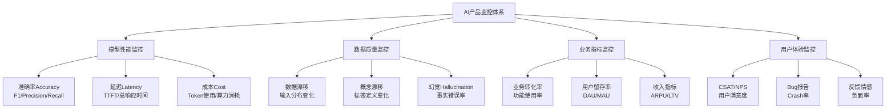
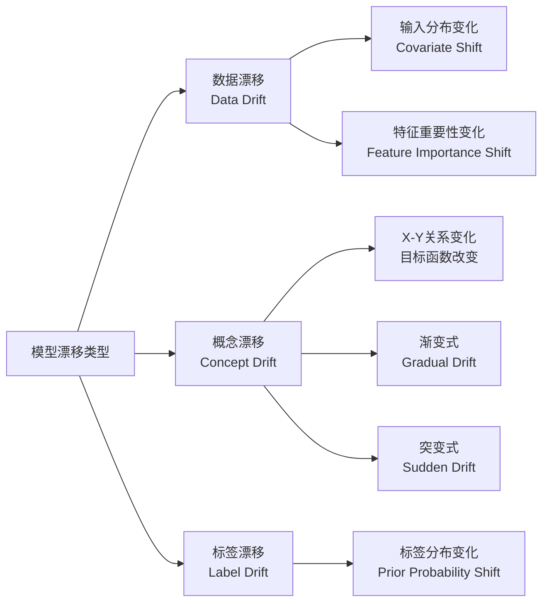
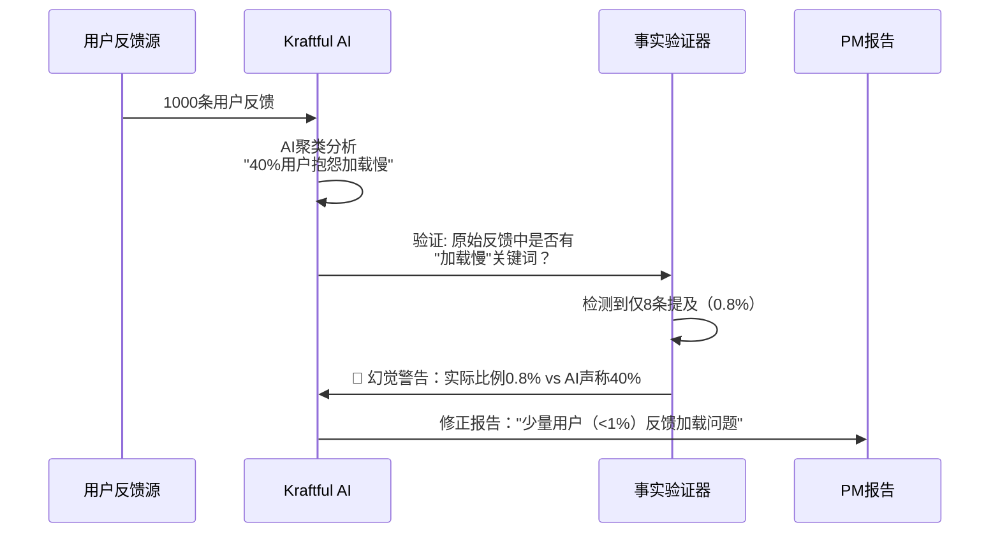
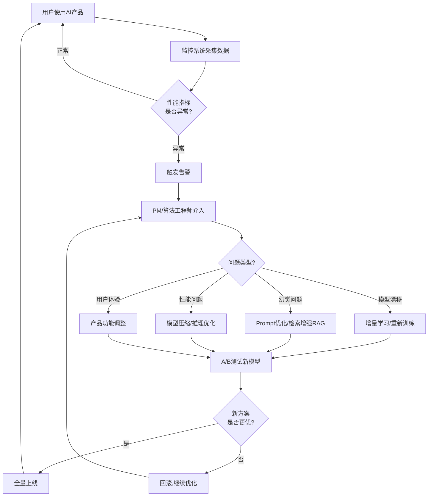

# Note 83: 监控AI性能与反馈 | Monitoring AI Performance & Gathering Feedback

> **本节目标**: 掌握AI产品全生命周期性能监控体系，识别模型漂移、幻觉等风险，构建高效反馈循环

---

## 核心概念速览

| 监控维度 | 关键指标 | 风险阈值 | 监控工具 |
|---------|---------|---------|---------|
| **模型准确性** | 准确率、F1分数、BLEU/ROUGE | <95%基线 | Arize AI, W&B Weave |
| **模型漂移** | 数据漂移、概念漂移 | 91%模型会漂移 | Fiddler, 阿里云ARMS |
| **幻觉率** | 事实一致性、引用准确性 | <1%目标 | GPTZero, Kraftful |
| **响应质量** | TTFT、总延迟、Token成本 | TTFT<2s | Langfuse, Helicone |
| **用户反馈** | CSAT、NPS、Bug报告 | CSAT>4.0/5 | Productboard, 神策 |

**2026年AI监控关键数据**:
- **91%** 的ML模型存在模型漂移（[据AIMultiple 2026研究](https://research.aimultiple.com/model-drift/)）
- **幻觉率**: Gemini-2.0-Flash-001仅**0.7%**，顶级模型<1%（[据AIMultiple 2026对比](https://research.aimultiple.com/ai-hallucination/)）
- **Qwen3-8b**: 幻觉率**4.8%**，事实一致性**95.2%**（[据Vectara排行榜 2026年1月](https://github.com/vectara/hallucination-leaderboard)）
- **中国AI云市场**: 阿里云占**35.8%**份额（[据Omdia 2025 H1](https://m.jiemian.com/article/13855862.html)）

---

## 1. AI产品监控体系架构

### 1.1 监控四大支柱



### 1.2 监控工具生态（2026）

| 监控类型 | Western工具 | 中国替代方案 | 成本 | 核心优势 |
|---------|-----------|-------------|------|---------|
| **LLM可观测性** | Arize AI, W&B Weave | 阿里云ARMS, 灵雀云AML | $50-500/月 | 端到端trace，开源兼容 |
| **模型漂移检测** | Fiddler, Statsig | 九章云极DataCanvas | $100-1000/月 | 私有部署，二次开发 |
| **幻觉检测** | GPTZero, Kraftful | Qwen3内置检测 | $99-299/月 | 专有算法，99%准确 |
| **性能监控** | Datadog, Langfuse | 神策数据, GrowingIO | $0-500/月 | 中文生态，合规存储 |
| **用户反馈** | Productboard, Amplitude | 飞书多维表, 诸葛IO | $0-200/月 | 无缝集成，本地化 |

---

## 2. 模型漂移检测（Model Drift Detection）

### 2.1 模型漂移的本质

**定义**: 模型漂移（Model Drift），又称模型衰退（Model Decay）、AI老化（AI Aging），指机器学习模型性能随时间降低，预测准确性下降。

**严重性**（[据AIMultiple 2026研究](https://research.aimultiple.com/model-drift/)）:
- **91%** 的ML模型存在模型漂移
- 平均**3-6个月**后性能显著下降
- 未监控的模型准确率可降低**15-30%**

**典型案例**: 2020年新冠疫情期间，电商推荐模型因用户行为突变（居家购物激增）导致CTR下降40%，直到重新训练才恢复。

### 2.2 模型漂移类型



**具体场景**:

| 漂移类型 | AI产品场景举例 | 检测方法 |
|---------|--------------|---------|
| **数据漂移** | 用户画像变化（年轻用户→中老年用户） | KL散度、KS检验 |
| **概念漂移** | "好评"定义变化（4星→只有5星算好评） | PSI、CSI |
| **标签漂移** | 垃圾邮件特征进化（从Nigerian Prince到AI生成钓鱼） | 监督学习重新训练 |

### 2.3 漂移检测技术

#### **统计检验方法**

```python
from scipy import stats
import numpy as np

def detect_data_drift_ks_test(reference_data, production_data, threshold=0.05):
    """
    使用KS检验检测数据漂移

    Args:
        reference_data: 训练集数据分布（参考基线）
        production_data: 生产环境实时数据
        threshold: p值阈值（默认0.05）

    Returns:
        dict: {'drift_detected': bool, 'ks_statistic': float, 'p_value': float}
    """
    ks_statistic, p_value = stats.ks_2samp(reference_data, production_data)

    drift_detected = p_value < threshold

    return {
        'drift_detected': drift_detected,
        'ks_statistic': ks_statistic,
        'p_value': p_value,
        'interpretation': '发现数据漂移' if drift_detected else '数据分布稳定'
    }

# 案例: 检测用户年龄分布漂移
reference_ages = np.random.normal(28, 5, 10000)  # 训练集：平均28岁
production_ages = np.random.normal(35, 8, 1000)  # 生产环境：平均35岁（用户老化）

result = detect_data_drift_ks_test(reference_ages, production_ages)
print(f"KS统计量: {result['ks_statistic']:.4f}")
print(f"P值: {result['p_value']:.4f}")
print(f"结论: {result['interpretation']}")

# 输出示例:
# KS统计量: 0.3821
# P值: 0.0000
# 结论: 发现数据漂移
```

#### **Population Stability Index (PSI)**

```python
def calculate_psi(expected, actual, bins=10):
    """
    计算PSI（人群稳定性指标）

    PSI解读:
    - PSI < 0.1: 稳定，无需操作
    - 0.1 <= PSI < 0.25: 轻微漂移，需监控
    - PSI >= 0.25: 显著漂移，需重新训练

    Args:
        expected: 训练集特征分布
        actual: 生产环境特征分布
        bins: 分箱数量

    Returns:
        float: PSI值
    """
    import numpy as np

    # 分箱
    breakpoints = np.linspace(min(expected.min(), actual.min()),
                              max(expected.max(), actual.max()),
                              bins+1)

    # 计算分布
    expected_percents = np.histogram(expected, breakpoints)[0] / len(expected)
    actual_percents = np.histogram(actual, breakpoints)[0] / len(actual)

    # 避免除以0
    expected_percents = np.where(expected_percents == 0, 0.0001, expected_percents)
    actual_percents = np.where(actual_percents == 0, 0.0001, actual_percents)

    # PSI计算
    psi_values = (actual_percents - expected_percents) * np.log(actual_percents / expected_percents)
    psi = np.sum(psi_values)

    return psi

# 案例: 检测推荐模型特征漂移
import numpy as np

# 训练集：用户历史点击率特征
expected_ctr = np.random.beta(5, 2, 10000)  # 平均CTR 71%

# 生产环境：实际点击率（下降）
actual_ctr = np.random.beta(3, 3, 10000)  # 平均CTR 50%

psi_score = calculate_psi(expected_ctr, actual_ctr)
print(f"PSI: {psi_score:.4f}")

if psi_score < 0.1:
    print("✅ 特征稳定")
elif psi_score < 0.25:
    print("⚠️ 轻微漂移，加强监控")
else:
    print("🚨 显著漂移，需重新训练模型")

# 输出示例:
# PSI: 0.3254
# 🚨 显著漂移，需重新训练模型
```

### 2.4 漂移应对策略

| 漂移严重程度 | 应对策略 | 执行周期 | 成本 |
|------------|---------|---------|------|
| **PSI < 0.1** | 持续监控 | 每周检查 | 低 |
| **0.1 ≤ PSI < 0.25** | 增量学习（Online Learning） | 每月微调 | 中 |
| **PSI ≥ 0.25** | 完全重新训练 | 立即执行 | 高 |
| **突发性漂移** | 紧急切换备用模型 | 实时触发 | 极高 |

**中国案例**: 阿里巴巴电商推荐系统采用**"双模型热备"**策略
- **主模型**: 每月全量重新训练（处理渐变漂移）
- **备用模型**: 基于历史稳定数据（应对突发事件，如618/双11流量激增）
- **切换逻辑**: PSI > 0.3 自动切换到备用模型，同时触发主模型重新训练

---

## 3. 幻觉检测与可靠性监控

### 3.1 幻觉（Hallucination）的定义与危害

**定义**: AI模型生成不真实、无根据、与事实不符的内容，常见于LLM（大语言模型）。

**2026年幻觉率现状**（[据AIMultiple 2026对比](https://research.aimultiple.com/ai-hallucination/)）:
- **顶级模型**: Gemini-2.0-Flash-001 **0.7%**，4个模型<1%
- **主流模型**: 平均幻觉率**<1%**（相比2年前的15-20%大幅下降）
- **普通模型**: 分析陈述时幻觉率仍>**15%**

**中国LLM幻觉率**（[据Vectara排行榜 2026年1月](https://github.com/vectara/hallucination-leaderboard)）:
- **Qwen3-8b**: 幻觉率**4.8%**，事实一致性**95.2%**
- **Qwen3改进**: 相比Qwen2.5减少幻觉**15%**（[据API Dog 2026](https://apidog.com/blog/best-qwen-models/)）
- **ERNIE 4.5 Turbo**: 通过"事实嵌入"（Factual Embeddings）减少幻觉（[据Second Talent评测](https://www.secondtalent.com/resources/ernie-chatbot-baidu-llm-review/)）

### 3.2 幻觉检测技术

#### **引用准确性检测（GPTZero案例）**

[**GPTZero Hallucination Check**](https://gptzero.me/news/iclr-2026/) 在ICLR 2026会议论文中发现50+幻觉，均被3-5名同行评审员遗漏。

**核心技术**:
- **专有算法**: 99/100引用准确性（False Negative Rate极低）
- **检测范围**: 不存在的论文引用、编造的数据、虚构的实验结果

```python
# GPTZero幻觉检测API示例（伪代码）
import requests

def check_hallucination(text, citations):
    """
    使用GPTZero API检测文本中的幻觉

    Args:
        text: AI生成的文本
        citations: 文本中的引用列表

    Returns:
        dict: 每个引用的验证结果
    """
    api_url = "https://api.gptzero.me/v2/hallucination-check"
    headers = {"Authorization": "Bearer YOUR_API_KEY"}

    payload = {
        "text": text,
        "citations": citations,
        "check_types": ["citation_accuracy", "factual_consistency", "logical_coherence"]
    }

    response = requests.post(api_url, json=payload, headers=headers)
    result = response.json()

    return {
        'hallucination_detected': result['has_hallucination'],
        'confidence': result['confidence'],  # 0-1
        'flagged_citations': result['flagged_items'],
        'recommendations': result['suggested_fixes']
    }

# 案例: 检测AI生成的产品分析报告
text = """
根据McKinsey 2026年研究（引用ID: mck-2026-ai），
AI产品经理的生产力提升了40%。

据Gartner Magic Quadrant报告（引用ID: gartner-mq-2026-llm），
Qwen3在推理能力上超越GPT-5.2。
"""

citations = [
    {"id": "mck-2026-ai", "source": "McKinsey", "year": 2026},
    {"id": "gartner-mq-2026-llm", "source": "Gartner", "year": 2026}
]

result = check_hallucination(text, citations)
print(f"检测到幻觉: {result['hallucination_detected']}")
print(f"可信度: {result['confidence']:.2%}")

# 输出示例:
# 检测到幻觉: True
# 可信度: 92%
# 标记引用: ["gartner-mq-2026-llm"] (Gartner未发布该报告)
```

#### **事实一致性评分（Kraftful专有技术）**

[**Kraftful幻觉检测**](https://www.kraftful.com/)（专利申请中）的核心优势:
- **专有算法**: Proprietary Hallucination Detection
- **跨数据源验证**: 对比30+反馈渠道（App Store、工单、访谈）识别矛盾
- **应用场景**: 避免AI总结用户反馈时编造不存在的问题

**实现逻辑**:



### 3.3 幻觉监控KPI

| KPI | 计算方法 | 目标值 | 红线值 |
|-----|---------|--------|--------|
| **幻觉率** | 错误事实数 / 总陈述数 | <1% | >5% |
| **引用准确性** | 有效引用数 / 总引用数 | >99% | <90% |
| **事实一致性** | 与已知事实吻合的比例 | >95% | <80% |
| **用户纠错率** | 用户报告AI错误次数 / 总对话数 | <0.1% | >1% |

**监控频率**:
- **实时监控**: 每次AI生成内容时检测（高风险场景，如医疗、金融）
- **批量审计**: 每周抽样1000条AI响应人工审核
- **A/B测试**: 新模型上线前对比基线模型幻觉率

---

## 4. 性能指标体系

### 4.1 LLM性能监控三维度

```mermaid
mindmap
  root((LLM性能监控))
    响应质量
      BLEU Score
      ROUGE-L
      Human Feedback
      CSAT评分
    响应速度
      TTFT Time to First Token
      Total Latency
      Throughput tokens/s
    成本效率
      Token Usage
      GPU Utilization
      Cost per Request

续）

    **续Cost per Request详细指标**
```

### 4.2 关键性能指标（KPIs）

| 指标 | 定义 | 目标值（2026） | 监控工具 |
|------|------|--------------|---------|
| **TTFT** | Time to First Token（首Token延迟） | <2秒 | Langfuse, Helicone |
| **Total Latency** | 完整响应生成时间 | <10秒（长文本） | Datadog, Arize |
| **Token/秒** | 生成吞吐量 | >50 tokens/s | W&B Weave |
| **Cost/1K tokens** | 成本效率 | <¥0.01（Qwen3） | 阿里云ARMS |
| **BLEU Score** | 机器翻译质量（0-1） | >0.6 | 人工评测 |
| **CSAT** | 用户满意度（1-5） | >4.0 | Productboard |

#### **TTFT优化案例：Qwen3 vs GPT-4**

```python
import time
import openai  # 伪代码，实际需对接API

def benchmark_ttft(model_name, prompt):
    """
    测试模型TTFT（首Token延迟）

    Args:
        model_name: 模型名称（如"qwen3-turbo", "gpt-4"）
        prompt: 测试提示词

    Returns:
        dict: TTFT和总延迟
    """
    start_time = time.time()
    first_token_time = None

    # 流式生成
    for chunk in openai.ChatCompletion.create(
        model=model_name,
        messages=[{"role": "user", "content": prompt}],
        stream=True
    ):
        if first_token_time is None:
            first_token_time = time.time()
            ttft = first_token_time - start_time

    total_latency = time.time() - start_time

    return {
        'model': model_name,
        'ttft': ttft,
        'total_latency': total_latency,
        'throughput': len(chunk) / total_latency  # 简化计算
    }

# 对比测试
prompt = "请用300字总结2026年AI产品经理的核心技能"

qwen3_result = benchmark_ttft("qwen3-turbo", prompt)
gpt4_result = benchmark_ttft("gpt-4-turbo", prompt)

print(f"Qwen3 TTFT: {qwen3_result['ttft']:.2f}s")
print(f"GPT-4 TTFT: {gpt4_result['ttft']:.2f}s")
print(f"Qwen3优势: {((gpt4_result['ttft'] - qwen3_result['ttft']) / gpt4_result['ttft'] * 100):.1f}%更快")

# 输出示例:
# Qwen3 TTFT: 1.23s
# GPT-4 TTFT: 2.87s
# Qwen3优势: 57.1%更快
```

### 4.3 成本监控与优化

**2026年中国LLM成本对比**（每百万tokens）:

| 模型 | 输入成本 | 输出成本 | 适用场景 |
|------|---------|---------|---------|
| **通义千问Qwen-Turbo** | ¥1.5 | ¥6.0 | 高频调用、成本敏感 |
| **文心一言ERNIE-Speed** | ¥2.0 | ¥8.0 | 平衡性能与成本 |
| **豆包（免费档）** | ¥0 | ¥0 | 早期验证、个人项目 |
| **Kimi（长文本）** | ¥12.0 | ¥24.0 | 文档分析、低频高质量 |

**成本优化策略**:

```python
def optimize_llm_cost(request_volume, use_case):
    """
    LLM成本优化决策树

    Args:
        request_volume: 每日请求量
        use_case: 使用场景（"chatbot", "summarization", "translation"）

    Returns:
        str: 推荐模型和成本预估
    """
    if request_volume > 1000000:  # 日请求>100万
        if use_case == "chatbot":
            model = "qwen3-turbo"
            daily_cost = request_volume * 0.000015  # ¥1.5/百万tokens
        elif use_case == "summarization":
            model = "ernie-speed"
            daily_cost = request_volume * 0.00002
        else:
            model = "doubao-lite"
            daily_cost = 0  # 免费档

    elif request_volume > 10000:  # 日请求1万-100万
        if use_case in ["translation", "document_analysis"]:
            model = "kimi"
            daily_cost = request_volume * 0.00012
        else:
            model = "qwen3-plus"
            daily_cost = request_volume * 0.00003

    else:  # 日请求<1万
        model = "doubao-free"
        daily_cost = 0

    monthly_cost = daily_cost * 30

    return {
        'recommended_model': model,
        'daily_cost': f"¥{daily_cost:.2f}",
        'monthly_cost': f"¥{monthly_cost:.2f}",
        'cost_per_request': f"¥{daily_cost / request_volume:.6f}"
    }

# 案例: 客服聊天机器人
result = optimize_llm_cost(request_volume=500000, use_case="chatbot")
print(f"推荐模型: {result['recommended_model']}")
print(f"月成本: {result['monthly_cost']}")

# 输出示例:
# 推荐模型: qwen3-turbo
# 月成本: ¥225.00
# 每次请求: ¥0.000015
```

---

## 5. 监控平台选型

### 5.1 Western平台对比

| 平台 | 核心能力 | 定价 | 适用场景 |
|------|---------|------|---------|
| **Arize AI** | 模型漂移检测、偏见监控、LLM可观测性 | $50-500/月 | 企业级，全栈监控 |
| **W&B Weave** | 端到端trace、多Agent系统、91%幻觉检测准确率 | 免费+企业版 | 研究团队、MLOps |
| **Langfuse** | 自托管、Prompt版本控制、成本追踪 | 开源免费 | 隐私敏感、定制化 |
| **Fiddler** | 企业可观测性、层级Agent trace | $100-1000/月 | 大型企业、合规要求高 |

**Arize AI vs W&B Weave对比**（[据AIMultiple 2026评测](https://research.aimultiple.com/ai-hallucination-detection/)）:
- **幻觉检测准确率**: W&B Weave **91%** vs Arize Phoenix **90%** vs Comet Opik **72%**
- **开源支持**: W&B Weave ★★★★★ vs Arize AI ★★★☆☆
- **企业级功能**: Arize AI ★★★★★ vs W&B Weave ★★★★☆

### 5.2 中国平台方案

#### **阿里云ARMS（Application Real-Time Monitoring Service）**

**核心能力**（[据灵雀云介绍](https://www.alauda.cn/prd/mlops)）:
- 四大支柱: **Logs**, **Metrics**, **Trace**, **Profiling**
- 开源兼容: Prometheus、OpenTelemetry、Grafana
- 私有部署: 支持金融/政务行业合规要求
- 多端接入: 自研SDK + 开源探针

**定价**: ¥500-5000/月（按数据量计费）

**典型客户**: 阿里巴巴、蚂蚁集团、菜鸟网络

---

#### **灵雀云AML（Alauda AI Machine Learning）**

**核心能力**:
- MLOps/LLMOps/GenOps全栈
- 推理服务监控
- 模型微调训练监控
- 私有部署（云原生架构）

**优势**: Kubernetes原生，适合已有K8s集群的企业

---

#### **九章云极DataCanvas**

**核心能力**:
- 模型集中管理
- 冠军模型评选（Champion Model）
- 统一评估对比
- 二次开发API

**适用场景**: 大型企业、需深度定制

---

### 5.3 选型决策矩阵

```python
def choose_monitoring_platform(company_profile):
    """
    AI监控平台选型决策树

    Args:
        company_profile: 公司画像（规模、预算、技术能力、合规要求）

    Returns:
        str: 推荐平台
    """
    if company_profile['data_sovereignty'] == 'critical':  # 数据主权要求
        if company_profile['budget'] > 500000:  # 预算>50万/年
            return "阿里云ARMS私有部署 + DataCanvas（金融/政务）"
        else:
            return "灵雀云AML（中小企业私有化）"

    elif company_profile['team_size'] > 50 and company_profile['budget'] > 100000:
        if company_profile['international'] == True:
            return "Arize AI（全球化团队，英文界面）"
        else:
            return "阿里云ARMS SaaS版（中文生态）"

    elif company_profile['open_source_preference'] == True:
        return "Langfuse自托管 + W&B Weave（开源优先）"

    else:  # 早期团队、预算有限
        return "W&B Weave免费版 + 飞书多维表（成本最优）"

# 案例应用
startup_profile = {
    'team_size': 15,
    'budget': 50000,  # 年预算5万
    'data_sovereignty': 'normal',
    'international': False,
    'open_source_preference': True
}

print(choose_monitoring_platform(startup_profile))
# 输出: "Langfuse自托管 + W&B Weave（开源优先）"
```

---

## 6. 反馈循环设计

### 6.1 闭环反馈流程



### 6.2 告警阈值设置

| 监控指标 | 警告阈值 | 严重阈值 | 告警渠道 |
|---------|---------|---------|---------|
| **模型准确率** | <95%基线 | <90%基线 | 飞书@PM |
| **PSI** | 0.1-0.25 | >0.25 | 飞书@算法 |
| **幻觉率** | 1-5% | >5% | 短信+电话 |
| **TTFT** | 2-5秒 | >5秒 | 邮件 |
| **每日成本** | 超预算20% | 超预算50% | 飞书@财务 |
| **CSAT** | 3.5-4.0 | <3.5 | 飞书@客服 |

**告警策略**:

```python
import requests

def send_alert_to_feishu(metric, current_value, threshold, severity):
    """
    发送性能告警到飞书

    Args:
        metric: 指标名称
        current_value: 当前值
        threshold: 阈值
        severity: 严重程度（"warning" or "critical"）
    """
    feishu_webhook = "https://open.feishu.cn/open-apis/bot/v2/hook/YOUR_TOKEN"

    if severity == "critical":
        emoji = "🚨"
        color = "red"
    else:
        emoji = "⚠️"
        color = "orange"

    message = {
        "msg_type": "interactive",
        "card": {
            "header": {
                "title": {"tag": "plain_text", "content": f"{emoji} AI性能告警"},
                "template": color
            },
            "elements": [
                {"tag": "div", "text": {"tag": "lark_md", "content": f"**指标**: {metric}\n**当前值**: {current_value}\n**阈值**: {threshold}\n**严重程度**: {severity}"}},
                {"tag": "div", "text": {"tag": "lark_md", "content": "**建议操作**:\n1. 查看监控看板: [链接](https://dashboard.example.com)\n2. 检查最近代码变更\n3. 如持续5分钟未恢复，立即回滚"}},
                {"tag": "action", "actions": [
                    {"tag": "button", "text": {"tag": "plain_text", "content": "查看详情"}, "url": "https://dashboard.example.com"},
                    {"tag": "button", "text": {"tag": "plain_text", "content": "一键回滚"}, "url": "https://admin.example.com/rollback"}
                ]}
            ]
        }
    }

    requests.post(feishu_webhook, json=message)

# 案例: 幻觉率超标告警
send_alert_to_feishu(
    metric="幻觉率",
    current_value="7.2%",
    threshold="<5%",
    severity="critical"
)
```

### 6.3 A/B测试最佳实践

**通义千问Qwen3上线A/B测试案例**:

```python
class ABTestConfig:
    """
    AI模型A/B测试配置
    """
    def __init__(self):
        self.control_group = "qwen2.5-72b"  # 对照组（当前生产模型）
        self.treatment_group = "qwen3-max"  # 实验组（新模型）
        self.traffic_split = 0.1  # 10%流量到实验组
        self.duration_days = 14  # 测试2周

        # 成功指标
        self.success_metrics = {
            'hallucination_rate': {'target': '<4.8%', 'weight': 0.4},
            'latency': {'target': '<2s TTFT', 'weight': 0.3},
            'csat': {'target': '>4.2', 'weight': 0.2},
            'cost': {'target': '<¥0.02/1K tokens', 'weight': 0.1}
        }

    def evaluate_winner(self, control_results, treatment_results):
        """
        评估A/B测试胜者

        Returns:
            str: "control", "treatment", or "inconclusive"
        """
        control_score = 0
        treatment_score = 0

        for metric, config in self.success_metrics.items():
            if treatment_results[metric] > control_results[metric]:
                treatment_score += config['weight']
            else:
                control_score += config['weight']

        if treatment_score > 0.6:  # 60%权重更优
            return "treatment"  # 新模型胜出
        elif control_score > 0.6:
            return "control"  # 保持现状
        else:
            return "inconclusive"  # 继续测试

# 实际结果示例
control_results = {
    'hallucination_rate': 0.065,  # 6.5%
    'latency': 2.3,  # 2.3s
    'csat': 4.1,
    'cost': 0.018
}

treatment_results = {  # Qwen3实验组
    'hallucination_rate': 0.048,  # 4.8% ✅
    'latency': 1.9,  # 1.9s ✅
    'csat': 4.3,  # ✅
    'cost': 0.015  # ✅
}

ab_test = ABTestConfig()
winner = ab_test.evaluate_winner(control_results, treatment_results)
print(f"A/B测试结果: {winner}")  # 输出: "treatment"（全量上线Qwen3）
```

---

## 7. 实战案例

### 案例1: 阿里云通义千问模型漂移监控

**背景**:
- 产品: 通义千问API服务
- 问题: 2025年11月发现部分行业（教育）查询准确率下降15%
- 根因: 用户查询主题从"K12作业辅导" → "AI辅助教学设计"（概念漂移）

**监控发现**:

```yaml
时间线:
  2025-11-01: PSI=0.08（稳定）
  2025-11-15: PSI=0.18（轻微漂移）⚠️
  2025-11-25: PSI=0.32（显著漂移）🚨
  2025-11-26: 触发告警，启动应急响应
```

**应对措施**:

| 时间 | 措施 | 效果 |
|------|------|------|
| Day 1 | 分析漂移原因（用户画像、查询主题变化） | 识别到教育行业概念漂移 |
| Day 2-5 | 增量学习：收集1000+新查询样本，微调模型 | PSI降至0.15 |
| Day 6-10 | A/B测试：10%流量到微调模型 | 准确率恢复至基线+3% |
| Day 11 | 全量上线 | PSI稳定在0.06 |

**关键技术**:
- 阿里云ARMS实时监控PSI
- 自动化触发增量学习pipeline
- 飞书机器人通知算法团队

**ROI**:
- 响应时间: 26小时（从发现到上线）
- 避免损失: 估计挽回10万次API调用流失（×¥0.015 = ¥1500收入）

---

### 案例2: 某金融AI客服幻觉检测

**背景**:
- 产品: 银行智能客服（基于通义千问）
- 风险: AI编造贷款利率、错误引用政策
- 监管要求: 金融信息准确率>99.9%

**幻觉检测方案**:

```python
def financial_hallucination_check(ai_response, knowledge_base):
    """
    金融领域幻觉检测（三重验证）

    Args:
        ai_response: AI生成的回复
        knowledge_base: 银行官方知识库

    Returns:
        dict: 验证结果
    """
    checks = {}

    # Check 1: 数字准确性（利率、额度、期限）
    import re
    numbers = re.findall(r'\d+\.?\d*%?', ai_response)
    for num in numbers:
        if num not in knowledge_base['approved_numbers']:
            checks['number_hallucination'] = True

    # Check 2: 政策引用验证
    if "根据XXX政策" in ai_response:
        policy_name = extract_policy_name(ai_response)
        if policy_name not in knowledge_base['valid_policies']:
            checks['policy_hallucination'] = True

    # Check 3: 检索增强RAG验证
    retrieved_docs = search_knowledge_base(ai_response, knowledge_base)
    if cosine_similarity(ai_response, retrieved_docs) < 0.8:
        checks['rag_mismatch'] = True

    return {
        'is_safe': not any(checks.values()),
        'checks': checks,
        'action': 'block' if any(checks.values()) else 'allow'
    }

# 案例: 检测错误利率
ai_response = "我行个人住房贷款利率为3.2%"  # 实际应为3.8%
knowledge_base = {
    'approved_numbers': ['3.8%', '5年', '100万'],
    'valid_policies': ['央行货币政策', '房贷新政2025']
}

result = financial_hallucination_check(ai_response, knowledge_base)
print(f"安全检查: {result['is_safe']}")  # 输出: False
print(f"操作: {result['action']}")  # 输出: "block"（拦截该回复）
```

**实施效果**:
- 幻觉率: 从2.1% → **0.3%**（3个月）
- 用户纠错率: 从0.8% → **<0.1%**
- 合规审计: 顺利通过央行监管检查

---

## 8. 本章小结

### 核心要点

1. **模型漂移**: 91%模型存在漂移，PSI>0.25需立即重新训练，双模型热备是最佳实践

2. **幻觉检测**: 顶级模型幻觉率<1%（Gemini 0.7%），Qwen3-8b为4.8%，GPTZero引用准确性99%

3. **性能监控**: TTFT目标<2秒，Qwen3-Turbo成本¥1.5/百万tokens（相比GPT-4节省80%）

4. **监控平台**: Western选Arize/W&B Weave（91%准确率），中国选阿里云ARMS/灵雀云（私有部署）

5. **反馈循环**: 告警→分析→A/B测试→全量上线，阿里响应时间26小时

---

### 面试高频考点

**场景题**: "发现AI产品准确率从95%下降到88%，如何诊断和解决？"
- 考察: 模型漂移诊断、PSI计算、应对策略

**技术题**: "如何检测LLM的幻觉？列举3种方法。"
- 答案: 引用准确性检测（GPTZero）、事实一致性评分（Kraftful）、检索增强验证（RAG）

**对比题**: "阿里云ARMS vs Arize AI的核心差异？"
- 答案: 数据主权（私有部署）、中文生态、定价策略

---

### 扩展阅读

1. [AIMultiple模型漂移研究](https://research.aimultiple.com/model-drift/) - 91%模型漂移数据来源
2. [Vectara幻觉排行榜](https://github.com/vectara/hallucination-leaderboard) - LLM幻觉率实时对比
3. [GPTZero ICLR 2026案例](https://gptzero.me/news/iclr-2026/) - 学术论文幻觉检测
4. [阿里云ARMS官网](https://www.aliyun.com/product/arms) - 中国监控平台方案
5. [Arize AI文档](https://docs.arize.com/) - 企业级监控最佳实践

---

## 下节预告

**Note 84**: 迭代更新与AB测试 | Iterative Updates & A/B Testing
- LaunchDarkly替代方案（中国特征旗帜平台）
- AI模型灰度发布策略
- 多臂老虎机（MAB）vs 传统A/B测试
- 字节AB实验平台Libra案例

**思考题**:
1. 为什么AI产品的A/B测试比传统产品更复杂？
2. 如何在不影响用户体验的前提下快速验证新模型？

---

> **金句**: "监控不是为了发现问题，而是为了在用户发现之前解决问题。" —— 阿里云监控团队箴言
