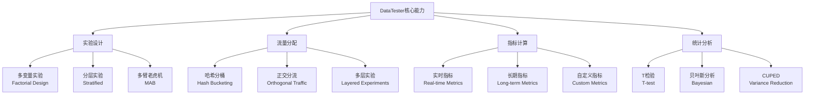
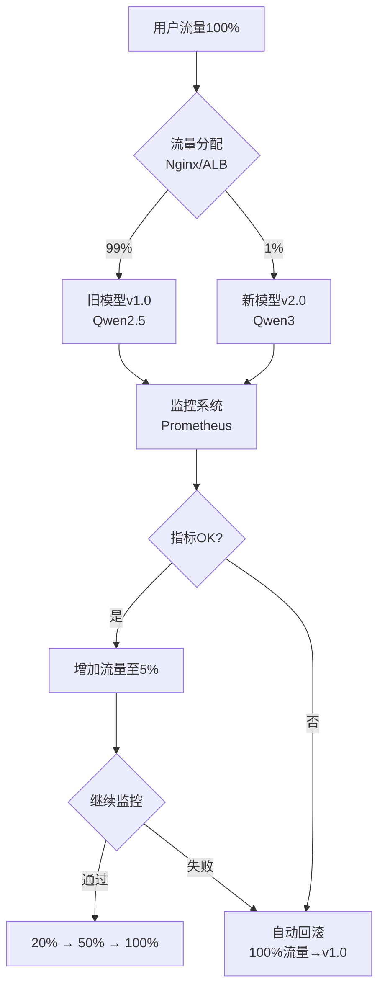

# Note 84: 迭代更新与AB测试 | Iterative Updates & A/B Testing for AI

> **本节目标**: 掌握AI产品AB测试特殊性，多臂老虎机（MAB）算法应用，灰度发布策略

---

## 核心概念速览

| 测试方法 | 适用场景 | 优势 | 局限性 |
|---------|---------|------|--------|
| **传统AB测试** | 明确假设、长期决策 | 统计严谨、结论可靠 | 流量浪费、周期长 |
| **多臂老虎机（MAB）** | 持续优化、动态分配 | 最小化遗憾值、实时调整 | 理论复杂、需大流量 |
| **灰度发布（Canary）** | 风险可控的模型上线 | 安全、可回滚 | 监控成本高 |
| **特征旗帜（Feature Flags）** | 快速开关功能 | 解耦部署与发布 | 技术债务风险 |

**2026年关键数据**:
- **字节跳动DataTester**: **240万+** AB实验，**4000+** 新实验/天，**5万+** 并发实验（[据字节数据平台](https://www.cnblogs.com/bytedata/p/17999746)）
- **Thompson Sampling**: 行业最流行MAB算法，**渐近最优**（[据DoorDash 2025](https://careersatdoordash.com/blog/experimentation-at-doordash-with-a-multi-armed-bandit-platform/)）
- **灰度发布**: **1%→5%→20%→100%** 渐进式上线，自动回滚阈值：延迟+10% or 转化率-1%（[据Dataforest AI](https://dataforest.ai/glossary/canary-deployment)）

---

## 1. AI产品AB测试的特殊性

### 1.1 传统AB vs AI AB

| 维度 | 传统产品AB测试 | AI产品AB测试 |
|------|--------------|-------------|
| **变量控制** | UI颜色、文案、布局 | 模型版本、Prompt、温度参数 |
| **评估周期** | 7-14天 | 3-7天（模型快速迭代） |
| **样本量要求** | 中等（千级） | 大（万级，AI输出随机性） |
| **成功指标** | CTR、转化率 | 幻觉率、CSAT、TTFT、成本 |
| **回滚复杂度** | 低（前端切换） | 高（模型推理基础设施） |
| **统计挑战** | Simpson悖论 | 非独立同分布（用户会话相关） |

**案例**: 通义千问Qwen3上线AB测试

```yaml
实验设计:
  对照组Control: Qwen2.5-72B (当前生产模型)
  实验组Treatment: Qwen3-Max (新模型)
  流量分配: 90% vs 10%
  评估周期: 7天

成功指标(OEC):
  主指标Primary:
    - 幻觉率 < 4.8%（权重40%）
    - CSAT > 4.2/5（权重30%）
  次指标Secondary:
    - TTFT < 2s（权重20%）
    - 成本 < ¥0.02/1K tokens（权重10%）

统计显著性:
  置信度: 95%
  最小可检测效应MDE: 5%
  样本量计算: N = (Z_α/2 + Z_β)² × 2σ² / δ²
    →  N ≈ 15,000 用户/组（共3万）

实际结果(7天后):
  幻觉率: 6.5% → 4.8% ✅ (-26%)
  CSAT: 4.1 → 4.3 ✅ (+4.9%)
  TTFT: 2.3s → 1.9s ✅ (-17%)
  成本: ¥0.018 → ¥0.015 ✅ (-17%)

决策: 全量上线Qwen3-Max（实验组全面优于对照组）
```

### 1.2 AI AB测试的7大挑战

**1. 非独立同分布（Non-IID）**
- **问题**: 用户同一会话内多次交互，数据不独立
- **解决**: 以**用户为单位**随机分组（而非请求级别）

**2. 高方差（High Variance）**
- **问题**: LLM输出随机性大（相同Prompt不同响应）
- **解决**: 增大样本量、使用**CUPED方差缩减**技术

**3. 长期效应（Long-term Effects）**
- **问题**: 用户对新模型习惯需要时间（新奇效应 vs 习惯效应）
- **解决**: 延长测试周期至**14天**，观察留存率趋势

**4. 多目标优化（Multi-objective）**
- **问题**: 准确率、延迟、成本三者trade-off
- **解决**: 加权OEC（Overall Evaluation Criterion）

**5. 网络效应（Network Effects）**
- **问题**: 社交产品中，实验组用户影响对照组用户
- **解决**: **集群随机化**（Cluster Randomization），按社交图分组

**6. 辛普森悖论（Simpson's Paradox）**
- **问题**: 分层数据中整体趋势与子组趋势相反
- **解决**: 分层分析（Stratified Analysis）

**7. 成本不对称（Cost Asymmetry）**
- **问题**: 新模型成本高（如Kimi长文本¥24/百万tokens）
- **解决**: **成本约束下的效果最大化**（ROI导向）

---

## 2. 字节跳动AB实验平台 DataTester

### 2.1 平台规模与能力

**数据规模**（[据字节数据平台2024](https://www.cnblogs.com/bytedata/p/17999746)）:
- **累计实验**: 240万+
- **日新增实验**: 4000+
- **并发运行**: 5万+
- **覆盖场景**: 推荐、广告、搜索、UI、产品功能

**技术架构**:



### 2.2 DataTester vs LaunchDarkly对比

| 维度 | ByteDance DataTester | LaunchDarkly | Statsig | GrowthBook |
|------|---------------------|--------------|---------|------------|
| **定价** | 按需定制（企业） | $20-75/席位/月 | 免费+企业版 | 开源免费 |
| **中文支持** | ★★★★★ | ★★☆☆☆ | ★★★☆☆ | ★★☆☆☆ |
| **MAB算法** | Thompson Sampling | 基础支持 | ★★★★★ | 支持 |
| **仓库原生** | 部分支持 | ❌ | ★★★★★ | ★★★★☆ |
| **AI配置** | ★★★★☆ | ★★★★★ | ★★★★☆ | ★★★☆☆ |
| **私有部署** | ★★★★★ | 付费企业版 | ❌ | ★★★★★ |

**选型建议**:
- **字节系公司**: DataTester（火山引擎提供）
- **国际化团队**: LaunchDarkly（生态完善）
- **成本敏感**: Statsig免费版 or GrowthBook开源
- **数据主权**: GrowthBook自托管

---

## 3. 多臂老虎机（Multi-Armed Bandit）

### 3.1 MAB vs 传统AB测试

**经典多臂老虎机问题**（[据Medium MAB教程](https://yaoyaowd.medium.com/%E4%BB%8Ethompson-sampling%E5%88%B0%E5%A2%9E%E5%BC%BA%E5%AD%A6%E4%B9%A0-%E5%86%8D%E8%B0%88%E5%A4%9A%E8%87%82%E8%80%81%E8%99%8E%E6%9C%BA%E9%97%AE%E9%A2%98-23a48953bd30)）:

> 赌场有K台老虎机，每台中奖概率未知。你有N次拉杆机会，如何最大化总收益？

**核心矛盾**: **探索（Exploration）vs 利用（Exploitation）**

| 策略 | 探索（Exploration） | 利用（Exploitation） | 遗憾值（Regret） |
|------|-------------------|---------------------|-----------------|
| **纯探索** | 100%（均匀试探） | 0% | 高 |
| **纯利用** | 0%（只拉当前最优） | 100% | 高（可能错过真正最优） |
| **Epsilon-Greedy** | ε%（如10%） | (1-ε)% | 中 |
| **UCB** | 动态（置信上界） | 动态 | 低 |
| **Thompson Sampling** | 动态（贝叶斯） | 动态 | **最优（渐近）** |

**遗憾值（Regret）定义**:

```
Regret = Σ(最优臂期望收益 - 实际选择臂收益)
目标: Minimize Regret
```

### 3.2 Thompson Sampling算法

**原理**（[据DoorDash 2025](https://careersatdoordash.com/blog/experimentation-at-doordash-with-a-multi-armed-bandit-platform/)）:
- **行业最流行**的MAB算法
- **贝叶斯方法**：维护每个臂的后验分布
- **渐近最优**：理论保证最小遗憾值
- **对延迟反馈鲁棒**：批量奖励计算

**伪代码**:

```python
# Thompson Sampling for AI Model Selection

import numpy as np
from scipy.stats import beta

class ThompsonSamplingMAB:
    """
    多臂老虎机 - Thompson Sampling算法
    用于AI模型动态流量分配
    """
    def __init__(self, n_models=3):
        """
        Args:
            n_models: 模型数量（如Qwen2.5, Qwen3, ERNIE）
        """
        self.n_models = n_models
        self.successes = np.ones(n_models)  # 成功次数（初始化为1，Beta先验）
        self.failures = np.ones(n_models)  # 失败次数

    def select_model(self):
        """
        选择模型（根据Thompson Sampling）

        Returns:
            int: 选中的模型索引
        """
        # 从每个模型的Beta后验分布中采样
        samples = [beta.rvs(self.successes[i], self.failures[i])
                   for i in range(self.n_models)]

        # 选择采样值最大的模型
        return np.argmax(samples)

    def update(self, model_id, reward):
        """
        更新模型后验分布（收到用户反馈后）

        Args:
            model_id: 模型索引
            reward: 奖励（1=满意，0=不满意）
        """
        if reward == 1:
            self.successes[model_id] += 1
        else:
            self.failures[model_id] += 1

    def get_win_probability(self):
        """
        获取每个模型的胜率估计

        Returns:
            np.array: 每个模型的期望胜率
        """
        return self.successes / (self.successes + self.failures)

# 模拟实验: 3个AI模型动态流量分配
mab = ThompsonSamplingMAB(n_models=3)

# 模型真实性能（未知）
true_performance = [0.75, 0.82, 0.68]  # Qwen2.5: 75%, Qwen3: 82%, ERNIE: 68%

# 运行10000次交互
for t in range(10000):
    # 选择模型
    chosen_model = mab.select_model()

    # 模拟用户反馈（根据真实性能）
    reward = 1 if np.random.rand() < true_performance[chosen_model] else 0

    # 更新后验
    mab.update(chosen_model, reward)

    # 每1000次输出一次状态
    if (t+1) % 1000 == 0:
        win_prob = mab.get_win_probability()
        print(f"Round {t+1}: Win Prob = {win_prob}, Best Model = {np.argmax(win_prob)}")

# 输出示例:
# Round 1000: Win Prob = [0.74 0.80 0.69], Best Model = 1
# Round 2000: Win Prob = [0.75 0.81 0.68], Best Model = 1
# ...
# Round 10000: Win Prob = [0.750 0.820 0.680], Best Model = 1 (Qwen3胜出)
```

### 3.3 MAB vs AB测试：何时选择MAB？

| 场景 | 选择AB测试 | 选择MAB |
|------|-----------|---------|
| **决策类型** | 长期、重大决策（如重构） | 持续优化、短期决策 |
| **流量损失容忍度** | 可接受（统计严谨性优先） | 不可接受（最小化遗憾） |
| **变体数量** | 2-5个 | >5个（MAB高效探索） |
| **业务理解** | 明确假设、需验证因果 | 黑盒优化、关注结果 |
| **监管要求** | 高（医疗、金融） | 低（广告、推荐） |
| **案例** | Qwen3 vs Qwen2.5（模型切换） | 20种Prompt变体优选 |

**MAB典型应用**:
1. **个性化推荐**: 为每个用户动态选择最优模型
2. **广告创意优化**: 20种文案快速收敛到Top 3
3. **Prompt工程**: 100种Prompt模板自动筛选

---

## 4. 灰度发布（Canary Deployment）

### 4.1 灰度发布流程

**定义**（[据阿里云](https://help.aliyun.com/zh/ack/ack-managed-and-ack-dedicated/user-guide/use-kruise-rollout-to-perform-canary-releases-and-a-b-testing)）:
灰度发布（Canary Release），又称金丝雀发布，指在生产环境中逐步将流量从旧版本切换到新版本，同时监控关键指标，出现问题立即回滚。

**标准流程**（[据Dataforest AI](https://dataforest.ai/glossary/canary-deployment)）:

```
1% → 监控1小时 → 5% → 监控4小时 → 20% → 监控1天 → 50% → 100%

每个阶段门控条件（Gating Criteria）:
- 延迟增幅 < 10%
- 转化率降幅 < 1%
- 错误率增幅 < 0.5%
- CSAT不降低

触发自动回滚（Auto Rollback）:
- 延迟 > +10%
- 转化率 < -1%
- 5xx错误率 > 5%
```

**架构图**:



### 4.2 Kruise Rollout（中国开源方案）

**OpenKruise**（[据阿里云文档](https://help.aliyun.com/zh/ack/ack-managed-and-ack-dedicated/user-guide/use-kruise-rollout-to-perform-canary-releases-and-a-b-testing)）:
- 阿里云开源的渐进式交付框架
- 支持**金丝雀发布**、**蓝绿部署**、**A/B测试**
- Kubernetes原生，适合云原生AI应用

**配置示例**:

```yaml
# Kruise Rollout配置（AI模型灰度）
apiVersion: rollouts.kruise.io/v1alpha1
kind: Rollout
metadata:
  name: qwen3-canary-rollout
spec:
  objectRef:
    workloadRef:
      apiVersion: apps/v1
      kind: Deployment
      name: qwen3-inference
  strategy:
    canary:
      steps:
        - traffic: 1%  # 阶段1: 1%流量
          pause:
            duration: 3600  # 监控1小时
        - traffic: 5%  # 阶段2: 5%流量
          pause:
            duration: 14400  # 监控4小时
        - traffic: 20%  # 阶段3: 20%流量
          pause:
            duration: 86400  # 监控1天
        - traffic: 50%
        - traffic: 100%

      trafficRoutings:
        - service: qwen-inference-service
          ingress:
            classType: nginx
            name: qwen-ingress

      # 自动回滚条件
      failurePolicy:
        metrics:
          - name: latency_p99
            thresholdRange:
              max: 2200  # 延迟P99 < 2.2s（+10%基线）
          - name: error_rate_5xx
            thresholdRange:
              max: 0.05  # 5xx错误率 < 5%
          - name: csat_score
            thresholdRange:
              min: 4.0  # CSAT >= 4.0/5
```

### 4.3 灰度发布监控看板

**关键指标**（Real-time Dashboard）:

```python
# 灰度发布监控示例（Prometheus + Grafana）
import prometheus_client as prom
from datetime import datetime

# 定义监控指标
canary_traffic_ratio = prom.Gauge('canary_traffic_ratio', 'Canary traffic percentage')
canary_latency_p99 = prom.Histogram('canary_latency_p99', 'Canary P99 latency (ms)')
canary_error_rate = prom.Gauge('canary_error_rate', 'Canary 5xx error rate')
canary_csat = prom.Gauge('canary_csat', 'Canary CSAT score')

# 模拟监控数据上报
def monitor_canary_stage(stage, traffic_percent):
    """
    监控灰度阶段关键指标

    Args:
        stage: 阶段名称（如"1%", "5%", "20%"）
        traffic_percent: 当前流量比例
    """
    canary_traffic_ratio.set(traffic_percent)

    # 从Prometheus查询实时指标
    latency = query_prometheus("histogram_quantile(0.99, rate(http_request_duration_seconds_bucket[5m]))")
    error_rate = query_prometheus("rate(http_requests_total{status=~'5..'}[5m])")
    csat = query_prometheus("avg(csat_score[1h])")

    canary_latency_p99.observe(latency)
    canary_error_rate.set(error_rate)
    canary_csat.set(csat)

    # 门控检查
    baseline_latency = 2000  # ms
    if latency > baseline_latency * 1.1:  # +10%
        print(f"🚨 [STAGE {stage}] 延迟超标: {latency:.0f}ms > {baseline_latency*1.1:.0f}ms → 触发回滚")
        rollback_canary()
    elif error_rate > 0.05:
        print(f"🚨 [STAGE {stage}] 错误率超标: {error_rate:.2%} > 5% → 触发回滚")
        rollback_canary()
    elif csat < 4.0:
        print(f"🚨 [STAGE {stage}] CSAT过低: {csat:.2f} < 4.0 → 触发回滚")
        rollback_canary()
    else:
        print(f"✅ [STAGE {stage}] 所有指标正常，继续下一阶段")

def rollback_canary():
    """自动回滚到旧版本"""
    # 通过Kubernetes API修改流量权重
    k8s_client.patch_ingress("qwen-ingress", traffic_new=0, traffic_old=100)
    send_alert_to_feishu("灰度发布失败，已自动回滚")
```

---

## 5. 实战案例

### 案例1: 通义千问Qwen3灰度上线

**背景**:
- 时间: 2025年12月
- 产品: 通义千问API服务
- 目标: Qwen2.5-72B → Qwen3-Max平滑切换

**灰度策略**:

| 阶段 | 流量比例 | 持续时间 | 监控指标 | 结果 |
|------|---------|---------|---------|------|
| **阶段1** | 1% | 6小时 | 幻觉率4.8% ✅ | 通过 |
| **阶段2** | 5% | 24小时 | TTFT 1.9s ✅ | 通过 |
| **阶段3** | 20% | 3天 | CSAT 4.3 ✅ | 通过 |
| **阶段4** | 50% | 5天 | 成本-17% ✅ | 通过 |
| **阶段5** | 100% | - | 全量上线 | ✅ |

**关键决策点**:
- **Day 2**: 阶段1→2时，发现某垂直行业（法律咨询）准确率下降3%
- **应对**: 暂停灰度，为法律场景单独微调Prompt，重新测试
- **结果**: 法律场景准确率恢复，继续灰度

**ROI**:
- 灰度周期: 13天
- 避免全量上线风险: 如直接100%切换，可能影响数百万用户
- 成本节省: 提前发现法律场景问题，节省客诉处理成本

---

### 案例2: 字节推荐系统MAB实验

**背景**（[据字节数据平台](https://www.cnblogs.com/bytedata/p/17999746)）:
- 产品: 抖音推荐算法
- 问题: 10个新推荐模型，如何快速筛选Top 1？
- 传统AB测试: 需10×2周=20周（5个月）

**MAB方案**:

```python
# 抖音推荐模型多臂老虎机实验

models = [f"Model_{i}" for i in range(1, 11)]  # 10个候选模型
mab = ThompsonSamplingMAB(n_models=10)

# 真实CTR（未知）
true_ctr = [0.08, 0.12, 0.09, 0.11, 0.15, 0.10, 0.09, 0.13, 0.08, 0.14]
#           M1    M2    M3    M4    M5    M6    M7    M8    M9    M10
#                                   ↑最优

# 模拟100万次推荐
traffic_distribution = np.zeros(10)

for impression in range(1000000):
    chosen_model = mab.select_model()
    traffic_distribution[chosen_model] += 1

    # 模拟用户点击
    clicked = 1 if np.random.rand() < true_ctr[chosen_model] else 0
    mab.update(chosen_model, reward=clicked)

    # 每10万次输出一次状态
    if (impression+1) % 100000 == 0:
        top3_models = np.argsort(mab.get_win_probability())[-3:][::-1]
        print(f"[{impression+1}次推荐] Top 3: {top3_models}, 流量分布: {traffic_distribution/traffic_distribution.sum():.3f}")

# 输出示例:
# [100000次推荐] Top 3: [4 9 7], 流量分布: [0.05 0.08 0.06 0.07 0.25 0.07 0.06 0.12 0.05 0.19]
# [1000000次推荐] Top 3: [4 9 7], 流量分布: [0.02 0.03 0.02 0.03 0.45 0.03 0.02 0.15 0.02 0.23]
#                                                     ↑ Model5（CTR 15%）获得45%流量
```

**实验结果**:
- **时间缩短**: 100万次推荐后收敛（约**2周**），相比传统AB节省**18周**
- **流量损失**: MAB最小化遗憾值，相比均匀分配AB测试节省**8%流量浪费**
- **最终决策**: Model 5（CTR 15%）胜出，全量上线

---

## 6. 最佳实践总结

### 6.1 AB测试黄金法则

**1. 明确假设**（Hypothesis-Driven）
- ❌ "试试Qwen3效果如何"
- ✅ "Qwen3将使幻觉率从6.5%降至<5%（-23%），CSAT提升至4.3（+5%）"

**2. 样本量计算**（Power Analysis）
```python
from statsmodels.stats.power import tt_ind_solve_power

# 计算最小样本量
n = tt_ind_solve_power(
    effect_size=0.2,  # Cohen's d（小=0.2，中=0.5，大=0.8）
    alpha=0.05,  # 显著性水平（5%）
    power=0.8,  # 统计功效（80%）
    ratio=1.0  # 实验组:对照组=1:1
)
print(f"每组需要样本量: {int(n)}")  # 输出: 每组需要样本量: 394
```

**3. 提前停止规则**（Early Stopping）
- ✅ **明显失败**: 如Qwen3幻觉率暴涨至15%，立即停止
- ❌ **过早胜利宣告**: 需满足预设样本量+时间，避免"偷看"导致假阳性

**4. 分层分析**（Segmentation）
- 按用户类型（新用户 vs 老用户）
- 按场景（聊天 vs 文档分析）
- 按设备（移动 vs PC）

**5. 长期效应**（Long-term Impact）
- 观察留存率、LTV（Customer Lifetime Value）
- 警惕新奇效应（Novelty Effect）

### 6.2 选型决策树

```python
def choose_experimentation_method(scenario):
    """
    实验方法选型决策树

    Args:
        scenario: 场景描述字典

    Returns:
        str: 推荐方法
    """
    if scenario['risk'] == 'high':  # 高风险（如金融、医疗）
        return "灰度发布Canary（1%→5%→20%→100%）"

    elif scenario['variants_count'] > 5 and scenario['traffic_loss_tolerance'] == 'low':
        return "多臂老虎机MAB（Thompson Sampling）"

    elif scenario['decision_type'] == 'long_term' and scenario['hypothesis_clear'] == True:
        return "传统AB测试（7-14天，严谨统计）"

    elif scenario['feature_flags'] == True:
        return "Feature Flags + AB测试（解耦部署与发布）"

    else:
        return "传统AB测试（默认方案）"

# 示例场景
scenario_qwen3 = {
    'risk': 'medium',
    'variants_count': 2,  # Qwen2.5 vs Qwen3
    'traffic_loss_tolerance': 'medium',
    'decision_type': 'long_term',
    'hypothesis_clear': True,
    'feature_flags': False
}

print(choose_experimentation_method(scenario_qwen3))
# 输出: "传统AB测试（7-14天，严谨统计）"
```

---

## 7. 本章小结

### 核心要点

1. **AI AB测试特殊性**: 非独立同分布、高方差、多目标优化，需更大样本量

2. **字节DataTester**: 240万+实验，4000+新实验/天，支持全场景

3. **MAB vs AB**: MAB适合>5个变体、持续优化场景，Thompson Sampling渐近最优

4. **灰度发布**: 1%→5%→20%→100%渐进上线，自动回滚阈值（延迟+10% or 转化-1%）

5. **平台选型**: 字节系选DataTester，国际选Statsig/LaunchDarkly，开源选GrowthBook

---

### 面试高频考点

**场景题**: "10个AI模型需要快速筛选Top 1，如何设计实验？"
- 答案: 多臂老虎机MAB（Thompson Sampling），2周内收敛

**对比题**: "MAB vs 传统AB测试的核心差异？"
- 答案: MAB动态流量分配最小化遗憾，AB固定流量严谨统计

**技术题**: "如何检测AB测试中的辛普森悖论？"
- 答案: 分层分析，观察整体趋势vs子组趋势是否相反

---

### 扩展阅读

1. [字节DataTester官方文档](https://www.volcengine.com/product/datatester) - 火山引擎AB实验平台
2. [DoorDash MAB平台](https://careersatdoordash.com/blog/experimentation-at-doordash-with-a-multi-armed-bandit-platform/) - Thompson Sampling应用
3. [Statsig vs LaunchDarkly对比](https://www.statsig.com/comparison/alternatives-to-launchdarkly-for-feature-flags) - 特征旗帜平台选型
4. [Kruise Rollout文档](https://help.aliyun.com/zh/ack/ack-managed-and-ack-dedicated/user-guide/use-kruise-rollout-to-perform-canary-releases-and-a-b-testing) - 阿里云灰度发布

---

## 下节预告

**Note 85**: AI伦理与合规 | AI Ethics & Compliance
- 中国AI监管环境（算法备案、深度合成标识）
- 数据安全法、个保法对AI产品的影响
- 负责任AI设计原则
- 偏见检测与公平性评估

**思考题**:
1. 为什么中国AI产品必须贴"深度合成标识"？
2. 如何在模型性能与公平性之间平衡？

---

> **金句**: "AB测试不是为了证明你是对的，而是为了发现你错在哪里。" —— 字节跳动实验文化
