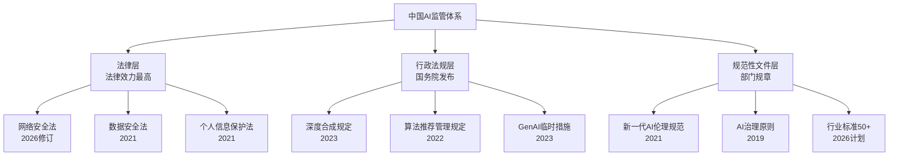
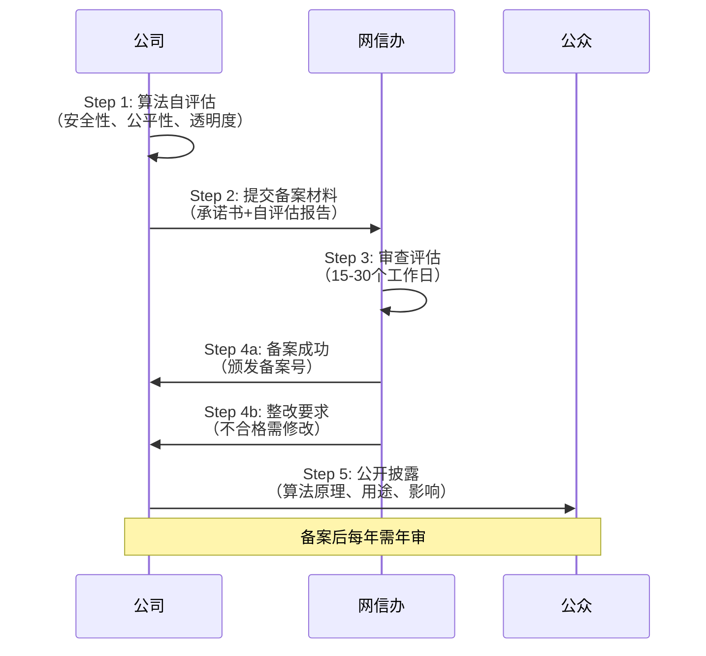

# Note 85: AI伦理与合规 | AI Ethics & Compliance

> **本节目标**: 理解中国AI监管框架，掌握算法备案、深度合成标识等合规要求，设计负责任AI产品

---

## 核心概念速览

| 法规/规范 | 生效日期 | 核心要求 | 罚款上限 |
|----------|---------|---------|---------|
| **网络安全法修订** | 2026年1月1日 | AI首次入法，强化伦理审查 | 5000万或5%营收 |
| **算法推荐管理规定** | 2022年3月 | 算法备案、透明度、公平性 | 10万-100万 |
| **深度合成规定** | 2023年1月 | 标识AI生成内容 | 1万-10万 |
| **GenAI临时措施** | 2023年8月 | 训练数据合法性、安全评估 | 5万-50万 |
| **个人信息保护法** | 2021年11月 | 用户同意、数据最小化 | 5000万或5%营收 |

**2026年关键数据**（[据IAPP分析](https://iapp.org/news/a/notes-from-the-asia-pacific-region-strong-start-to-2026-for-china-s-data-ai-governance-landscape)）:
- **网络安全法修订**: 2026年1月1日生效，**AI首次提升至国家法律层级**
- **罚款加码**: 企业最高**¥5000万** or **5%营收**，个人最高**¥100万**（[据A&O Shearman](https://www.aoshearman.com/en/insights/ao-shearman-on-data/key-amendments-to-chinas-cybersecurity-law)）
- **算法备案**: 截至2025年10月，**数千个算法**已完成备案（[据Lexology](https://www.lexology.com/library/detail.aspx?g=3c7273cf-8f85-4702-af70-6edf394ff1c3)）
- **2026年标准计划**: 制定**50+国家/行业标准**，覆盖公平性、可解释性评估（[据China Law Vision](https://www.chinalawvision.com/2025/01/digital-economy-ai/ai-ethics-overview-china/)）

---

## 1. 中国AI监管框架（2026）

### 1.1 三层监管体系



### 1.2 核心监管机构

| 机构 | 职责 | 管辖范围 |
|------|------|---------|
| **网信办（CAC）** | AI内容安全、算法备案 | 所有互联网信息服务 |
| **工信部（MIIT）** | AI技术标准、行业监管 | 电信、制造业AI应用 |
| **公安部** | 数据安全、网络犯罪 | 跨境数据、违法AI应用 |
| **市场监管总局** | 反垄断、算法公平性 | 电商、平台算法推荐 |
| **国家标准委** | AI伦理标准制定 | 技术规范、测评方法 |

---

## 2. 算法备案（Algorithm Filing）

### 2.1 备案要求

**适用范围**（[据Lexology](https://www.lexology.com/library/detail.aspx?g=3c7273cf-8f85-4702-af70-6edf394ff1c3)）:
- 具有舆论属性或社会动员能力的算法推荐服务
- GenAI服务（向公众提供前需完成备案）
- 重点领域：新闻、短视频、电商、社交、搜索

**必需材料**:
1. **算法备案承诺书**（Algorithm Filing Commitment Letter）
2. **算法安全主体责任落实情况报告**
3. **算法安全自评估报告**（Algorithm Safety Self-Assessment Report）
4. **拟公开内容**（Proposed Public Disclosure Content）

**备案流程**:



### 2.2 备案示例

**通义千问备案信息**（假设案例）:

```yaml
备案信息:
  算法名称: "通义千问-Qwen3大语言模型"
  备案主体: "阿里云计算有限公司"
  备案编号: "网信算备330108000XXXXX号"
  算法类型: "生成式人工智能"
  应用场景: "智能问答、文本生成、代码辅助"

公开披露内容:
  算法原理: "基于Transformer架构的大语言模型，参数规模万亿级"
  训练数据来源: "公开互联网数据、图书、论文（符合著作权法）"
  数据标注: "人工标注+RLHF强化学习"
  敏感词过滤: "政治、色情、暴力、违法内容过滤"
  用户画像: "不收集用户生物特征、宗教信仰、性取向等敏感信息"
  算法公平性: "多样性训练数据，避免对特定群体偏见"
  用户权益保护: "提供关闭个性化推荐选项、删除历史数据"

安全措施:
  - 每日安全巡检（色情、暴力、违法内容）
  - 人工审核（高风险领域：政治、医疗、金融）
  - 用户投诉渠道（24小时响应）
  - 定期安全评估（每年1次第三方审计）
```

### 2.3 不合规案例与罚款

**教学案例**（假设场景）:
- 某短视频平台：算法推荐未备案，罚款**¥50万**
- 某电商平台：算法价格歧视（大数据杀熟），罚款**¥100万**
- 某新闻聚合App：算法推送违法内容，**关停30天**+罚款¥200万

---

## 3. 深度合成标识（Deep Synthesis Labeling）

### 3.1 法规要求

**《深度合成信息服务管理规定》**（2023年1月生效）([据ICLG](https://iclg.com/practice-areas/cybersecurity-laws-and-regulations/01-generative-ai-and-cyber-risk-in-china)):
- AI生成内容**必须标注**显著标识
- 适用技术：文本、图像、音频、视频生成/编辑
- 重点监管：新闻、金融、医疗、教育、未成年人内容

**标识示例**:

| 场景 | 标识要求 | 示例 |
|------|---------|------|
| **AI生成文本** | 文首/文末标注 | "本内容由AI生成，仅供参考" |
| **AI生成图像** | 图片角落水印 | "AI生成" or "AIGC" |
| **数字人视频** | 视频左上角标识 | "数字人形象，非真人" |
| **语音合成** | 播放前语音提示 | "以下语音由AI合成" |
| **换脸/美颜** | 明显标识 | "画面已编辑" |

**实际应用截图**（假设）:

```
┌──────────────────────────────────┐
│  🤖 AI生成                        │ ← 左上角标识
│                                  │
│  [数字人视频画面]                 │
│                                  │
│  "大家好，我是小助手..."          │
└──────────────────────────────────┘

┌──────────────────────────────────┐
│  通义千问回答:                    │
│  "根据您的描述，建议..."          │
│                                  │
│  💡 本内容由AI生成，仅供参考      │ ← 文末标识
│  如有疑问请咨询专业人士            │
└──────────────────────────────────┘
```

### 3.2 技术实现

**前端标识代码**（React示例）:

```typescript
// AI生成内容标识组件
import React from 'react';

interface AIContentLabelProps {
  type: 'text' | 'image' | 'video' | 'audio';
  position?: 'top-left' | 'top-right' | 'bottom';
}

const AIContentLabel: React.FC<AIContentLabelProps> = ({
  type,
  position = 'bottom'
}) => {
  const labels = {
    text: '🤖 本内容由AI生成，仅供参考',
    image: 'AI生成',
    video: '数字人形象，非真人',
    audio: '语音由AI合成'
  };

  const positionStyle = {
    'top-left': 'absolute top-2 left-2 bg-black/70 text-white px-2 py-1 rounded text-xs',
    'top-right': 'absolute top-2 right-2 bg-black/70 text-white px-2 py-1 rounded text-xs',
    'bottom': 'mt-2 text-gray-600 text-sm'
  };

  return (
    <div className={positionStyle[position]}>
      {labels[type]}
    </div>
  );
};

// 使用示例
function AIGeneratedContent() {
  return (
    <div className="relative">
      {/* AI生成视频 */}
      <video src="/ai-human-video.mp4" />
      <AIContentLabel type="video" position="top-left" />

      {/* AI生成文本 */}
      <div className="ai-text">
        <p>这是AI生成的产品介绍...</p>
        <AIContentLabel type="text" position="bottom" />
      </div>
    </div>
  );
}
```

---

## 4. 数据合规（Data Compliance）

### 4.1 三法合规框架

**数据安全法 + 个人信息保护法 + 网络安全法**（[据IAPP](https://iapp.org/resources/article/global-ai-governance-china/)）:

| 法律 | 核心要求 | AI产品应对 |
|------|---------|-----------|
| **数据安全法** | 数据分类分级、风险评估 | 训练数据分级（公开/内部/敏感） |
| **个人信息保护法** | 用户同意、最小必要、删除权 | 用户画像需明示同意、支持数据导出 |
| **网络安全法** | 关键基础设施保护、跨境审查 | 大规模AI平台需网络安全等保 |

### 4.2 训练数据合规

**合法数据来源**:
- ✅ 公开数据集（Common Crawl、Wikipedia）
- ✅ 已获授权商业数据（付费购买）
- ✅ 用户生成内容（UGC，已签署用户协议）
- ❌ 未授权爬取（微信公众号、知乎付费内容）
- ❌ 侵犯著作权（盗版书籍、未授权论文）
- ❌ 敏感个人信息（未脱敏的身份证、病历）

**数据处理流程**:

```python
# AI训练数据合规处理流程

class DataComplianceProcessor:
    """
    训练数据合规处理器
    """
    def __init__(self):
        self.pii_detector = PIIDetector()  # 个人信息检测
        self.copyright_checker = CopyrightChecker()  # 著作权检查
        self.sensitive_filter = SensitiveFilter()  # 敏感内容过滤

    def process_training_data(self, raw_data):
        """
        处理训练数据（合规pipeline）

        Args:
            raw_data: 原始数据集

        Returns:
            compliant_data: 合规处理后的数据
        """
        compliant_data = []

        for doc in raw_data:
            # Step 1: PII检测与脱敏
            if self.pii_detector.contains_pii(doc):
                doc = self.pii_detector.anonymize(doc)  # 身份证号→***、手机号→***

            # Step 2: 著作权检查
            if self.copyright_checker.is_copyrighted(doc):
                if not self.copyright_checker.has_license(doc):
                    continue  # 跳过无授权内容

            # Step 3: 敏感内容过滤
            if self.sensitive_filter.is_sensitive(doc):
                doc = self.sensitive_filter.replace(doc)  # 替换敏感词

            # Step 4: 数据分级标记
            doc['data_level'] = self.classify_data_level(doc)  # 公开/内部/敏感

            compliant_data.append(doc)

        return compliant_data

    def classify_data_level(self, doc):
        """数据分级（根据数据安全法）"""
        if '核心机密' in doc or '国家秘密' in doc:
            return 'Level-4-核心'  # 最高级
        elif '个人敏感信息' in doc:
            return 'Level-3-重要'
        elif '商业秘密' in doc:
            return 'Level-2-一般'
        else:
            return 'Level-1-公开'
```

---

## 5. 负责任AI设计原则

### 5.1 中国AI伦理八项原则（2019）

**新一代人工智能治理原则**（[据China Law Vision](https://www.chinalawvision.com/2025/01/digital-economy-ai/ai-ethics-overview-china/)）:

1. **和谐友好**: AI应增进人类福祉，不应损害人类尊严
2. **公平正义**: 避免偏见歧视，保障算法公平性
3. **包容共享**: AI技术应惠及所有人，缩小数字鸿沟
4. **尊重隐私**: 保护个人隐私，数据收集最小必要
5. **安全可控**: 确保AI系统稳定可靠，防止失控
6. **共担责任**: 明确AI开发者、使用者责任边界
7. **开放协作**: 促进国际交流，反对技术封锁
8. **敏捷治理**: 法规随技术发展动态调整

### 5.2 公平性与偏见检测

**常见AI偏见类型**（[据ICLG](https://iclg.com/practice-areas/data-protection-laws-and-regulations/02-ai-regulatory-landscape-and-development-trends-in-china)）:

| 偏见类型 | 案例 | 检测方法 |
|---------|------|---------|
| **性别偏见** | 招聘AI偏好男性候选人 | 统计性别录用率差异 |
| **年龄偏见** | 信贷模型拒绝老年人 | 年龄分层违约率分析 |
| **地域偏见** | 推荐算法偏向一线城市 | 地域流量分布监控 |
| **价格歧视** | 大数据杀熟（老用户高价） | 用户画像与定价关联分析 |

**公平性评估代码**:

```python
# AI公平性评估工具

from sklearn.metrics import confusion_matrix
import numpy as np

class FairnessEvaluator:
    """
    AI公平性评估器（符合中国监管要求）
    """
    def evaluate_fairness(self, y_true, y_pred, sensitive_attr):
        """
        评估模型公平性

        Args:
            y_true: 真实标签
            y_pred: 模型预测
            sensitive_attr: 敏感属性（如性别、年龄、地域）

        Returns:
            fairness_metrics: 公平性指标
        """
        groups = np.unique(sensitive_attr)
        metrics = {}

        for group in groups:
            # 计算每组的准确率、召回率
            group_mask = (sensitive_attr == group)
            tn, fp, fn, tp = confusion_matrix(
                y_true[group_mask],
                y_pred[group_mask]
            ).ravel()

            metrics[group] = {
                'accuracy': (tp + tn) / (tp + tn + fp + fn),
                'precision': tp / (tp + fp),
                'recall': tp / (tp + fn),  # 又称True Positive Rate
                'false_positive_rate': fp / (fp + tn)
            }

        # 计算公平性指标
        fairness_metrics = self.calculate_fairness_metrics(metrics)

        return fairness_metrics

    def calculate_fairness_metrics(self, group_metrics):
        """
        计算公平性指标（根据80%规则）

        80% Rule: 受保护群体的选择率 >= 非受保护群体的80%
        """
        groups = list(group_metrics.keys())
        baseline_group = groups[0]  # 基准组（如男性）
        protected_group = groups[1]  # 受保护组（如女性）

        baseline_rate = group_metrics[baseline_group]['recall']
        protected_rate = group_metrics[protected_group]['recall']

        # 差异性影响（Disparate Impact）
        disparate_impact = protected_rate / baseline_rate

        # 公平性判定
        is_fair = disparate_impact >= 0.8  # 80%规则

        return {
            'disparate_impact': disparate_impact,
            'is_fair': is_fair,
            'baseline_group': baseline_group,
            'protected_group': protected_group,
            'baseline_rate': baseline_rate,
            'protected_rate': protected_rate,
            'gap': baseline_rate - protected_rate
        }

# 案例: 招聘AI公平性评估
y_true = np.array([1, 0, 1, 1, 0, 1, 0, 1])  # 1=合格，0=不合格
y_pred = np.array([1, 0, 0, 1, 0, 1, 0, 0])  # AI预测
gender = np.array(['男', '男', '女', '男', '女', '女', '男', '女'])  # 敏感属性

evaluator = FairnessEvaluator()
result = evaluator.evaluate_fairness(y_true, y_pred, gender)

print(f"差异性影响: {result['disparate_impact']:.2f}")
print(f"公平性: {'✅ 通过' if result['is_fair'] else '❌ 不通过（存在偏见）'}")
print(f"男性录用率: {result['baseline_rate']:.2%}")
print(f"女性录用率: {result['protected_rate']:.2%}")

# 输出示例:
# 差异性影响: 0.67
# 公平性: ❌ 不通过（存在偏见）
# 男性录用率: 75.00%
# 女性录用率: 50.00%（低于男性80%阈值）
```

---

## 6. 合规实施路径

### 6.1 合规清单（AI PM必备）

**上线前必检项**:

```markdown
## AI产品上线合规清单

### 算法备案（如适用）
- [ ] 完成算法安全自评估
- [ ] 提交网信办备案材料
- [ ] 获得备案号

### 深度合成标识
- [ ] AI生成内容添加显著标识
- [ ] 前端代码实现自动标识
- [ ] 用户协议中说明AI使用

### 数据合规
- [ ] 训练数据来源合法（无侵权）
- [ ] 个人信息已脱敏处理
- [ ] 用户同意收集使用数据
- [ ] 提供数据删除/导出功能

### 公平性审查
- [ ] 偏见检测测试通过（80%规则）
- [ ] 无价格歧视（大数据杀熟）
- [ ] 提供关闭个性化推荐选项

### 安全评估
- [ ] 敏感词过滤（政治、色情、暴力）
- [ ] 人工审核机制（高风险领域）
- [ ] 应急响应预案（舆情处理）

### 透明度要求
- [ ] 公开算法原理（简明易懂）
- [ ] 说明数据使用目的
- [ ] 建立用户投诉渠道
```

### 6.2 合规成本估算

| 合规项目 | 一次性成本 | 年度成本 | 说明 |
|---------|----------|---------|------|
| **算法备案** | ¥5-10万 | ¥2-5万 | 法务咨询+材料准备+年审 |
| **深度合成标识** | ¥1-3万 | ¥0 | 前端开发一次性 |
| **数据合规审计** | ¥10-30万 | ¥5-10万 | 第三方审计+整改 |
| **公平性测试** | ¥5-15万 | ¥3-5万 | 算法调优+持续监控 |
| **人工审核团队** | ¥0 | ¥50-200万 | 10-50人审核团队 |
| **安全评估** | ¥10-20万 | ¥5-10万 | 渗透测试+等保认证 |
| **总计** | ¥30-80万 | ¥65-230万 | 中小型AI产品 |

---

## 7. 本章小结

### 核心要点

1. **网络安全法2026修订**: AI首次入法，罚款最高¥5000万或5%营收
2. **算法备案**: GenAI服务必须完成备案，需提交自评估报告
3. **深度合成标识**: AI生成内容必须标注，违规罚款¥1-10万
4. **数据合规**: 三法合规（数据安全法+个保法+网络安全法），训练数据需合法授权
5. **负责任AI**: 八项原则（和谐、公平、隐私、安全等），公平性评估80%规则

---

### 面试高频考点

**法规题**: "2026年网络安全法修订对AI产品的影响？"
- 答案: AI首次入法，强化伦理审查，罚款加码至¥5000万或5%营收

**实践题**: "如何检测AI模型的性别偏见？"
- 答案: 统计男女录用率，计算差异性影响（Disparate Impact），需≥80%

**合规题**: "哪些AI产品需要算法备案？"
- 答案: 具有舆论属性或社会动员能力的算法推荐、GenAI公开服务

---

> **金句**: "合规不是成本，是AI产品的生命线。" —— 中国网信办2026年指导意见
