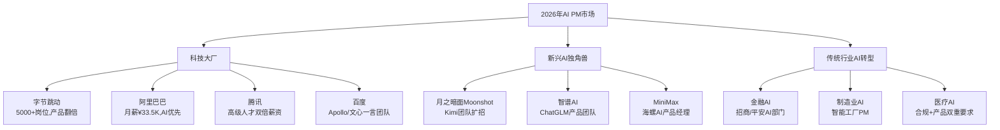
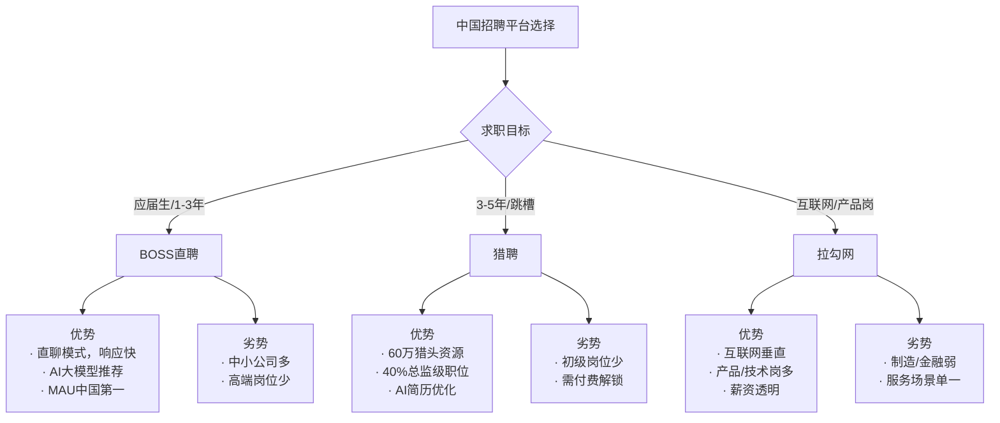
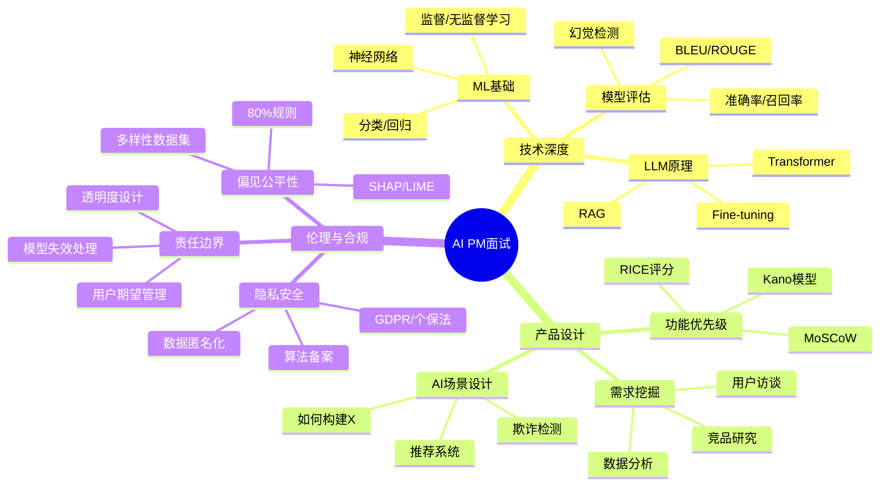
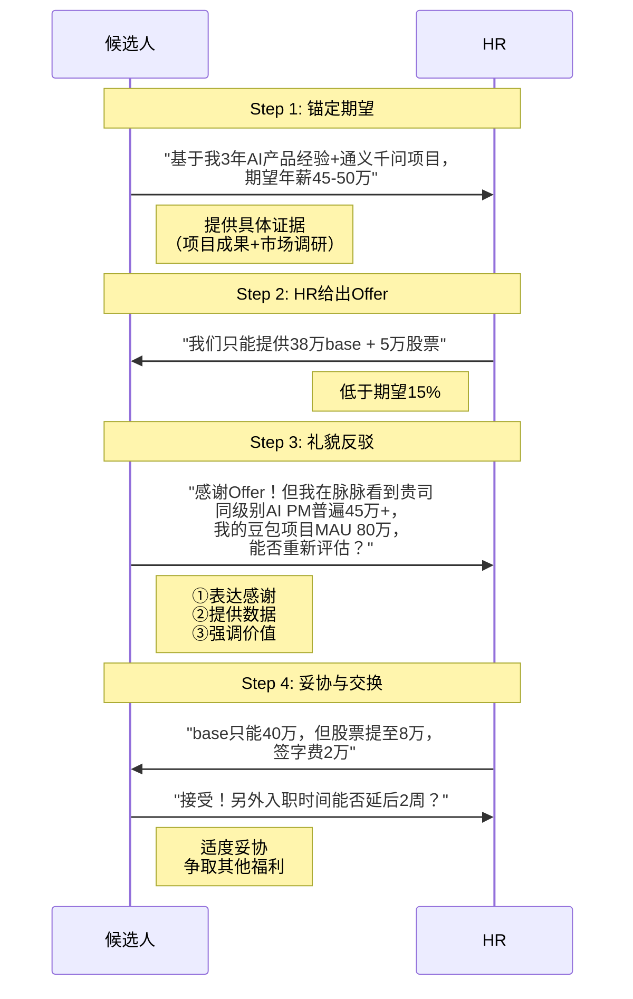
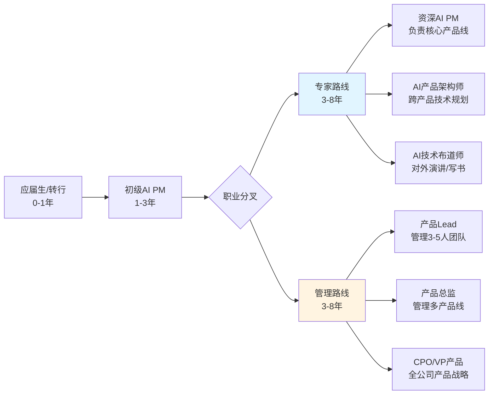
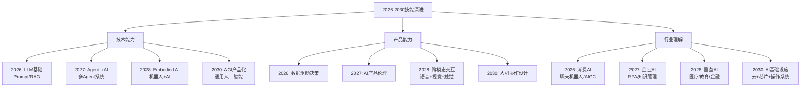
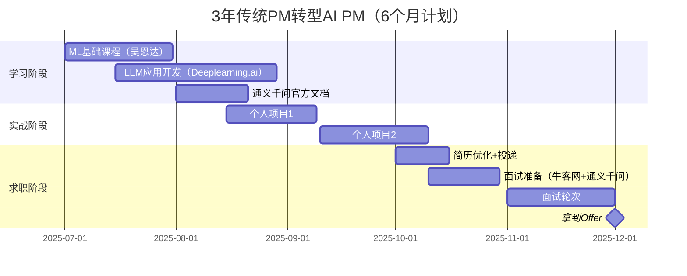

# Note 86: AI驱动的职业发展 | AI-Powered Career Launch

> **本节目标**: 掌握AI PM求职全流程，从简历优化、面试准备到职业规划，以2026年中国科技大厂为主要目标

---

## 核心概念速览

| 求职阶段 | 关键数据（2026） | AI工具/平台 | 成功率提升 |
|---------|----------------|-----------|-----------|
| **简历优化** | 75%简历被ATS拒绝 | Rezi, Jobscan, 超级简历 | +80%通过率 |
| **职位搜索** | 1593万应届生 | BOSS直聘, 猎聘, 拉勾 | -50%搜索时间 |
| **面试准备** | AI PM岗位需求+6倍 | Final Round AI, 牛客网 | +40%面试表现 |
| **薪资谈判** | 字节/腾讯+150%涨薪 | Levels.fyi China, 看准网 | +20%薪资 |
| **职业规划** | 400万AI人才缺口 | 通义千问职业规划, Kimi | 长期发展 |

**2026年中国AI PM市场关键数据**:
- **ByteDance**: 提供**5000+**职位，研发岗+23%，产品岗**翻倍**（[据Global Times 2025年8月](https://www.globaltimes.cn/page/202508/1340170.shtml)）
- **薪资涨幅**: 字节/腾讯为AI人才提供**150%**加薪+**35%**奖金（[据Tom's Hardware 2025年12月](https://www.tomshardware.com/tech-industry/artificial-intelligence/chinese-firms-bytedance-and-tencent-reportedly-offer-massive-150-percent-pay-increases-and-35-percent-bonuses-to-entice-ai-talent-salaries-and-increases-also-expected-to-balloon-in-2026)）
- **AI工程师薪资**: ¥36-100万/年（$50K-$140K），北京/上海最高（[据Second Talent 2026年1月](https://www.secondtalent.com/developer-rate-card/ai-engineer-china/)）
- **人才缺口**: 到2030年需**200万**AI人才，实际只能培养**1/3**，缺口**400万**（[据HiredChina 2025](https://www.hiredchina.com/articles/chinas-ai-employment-for-foreigners/)）
- **应届生竞争**: 2026年毕业生**1593万**人，创历史新高（[据桂林生活网 2026](https://news.guilinlife.com/article/5kp5e09ca91364c2396c.html)）

---

## 1. AI PM职业市场全景（2026）

### 1.1 中国科技大厂需求爆发



**岗位需求量化**（[据Global Times 2025年8月](https://www.globaltimes.cn/page/202508/1340170.shtml)）:
- **ByteDance**: 2026届校招**5000+**职位，其中研发岗同比增长**23%**，产品岗**翻倍**
- **行业趋势**: AI相关职位需求到2030年增长**6倍**（[据HiredChina 2025](https://www.hiredchina.com/articles/chinas-ai-employment-for-foreigners/)）

### 1.2 薪资水平对标（2026）

| 公司 | AI研究员/科学家 | 高级ML工程师 | AI产品经理（估算） | 股票期权 |
|------|----------------|-------------|-----------------|---------|
| **字节跳动** | $110K-$280K | $84K-$210K | $70K-$180K | 有，激进发放 |
| **阿里巴巴** | 月薪¥33.5K ($5K) | 年薪¥40-80万 | 年薪¥35-70万 | 有，P6+阿里股 |
| **腾讯** | 月薪¥30.8K | 年薪¥35-75万 | 年薪¥30-65万 | 有，限制性股票 |
| **百度** | 同行业水平 | 年薪¥38-70万 | 年薪¥32-60万 | 有，百度股票 |
| **AI独角兽** | 签约奖金$50K | 年薪¥50-120万 | 年薪¥40-100万 | 期权包，上市潜力 |

**数据来源**:
- 字节/腾讯薪资: [Tom's Hardware 2025年12月](https://www.tomshardware.com/tech-industry/artificial-intelligence/chinese-firms-bytedance-and-tencent-reportedly-offer-massive-150-percent-pay-increases-and-35-percent-bonuses-to-entice-ai-talent-salaries-and-increases-also-expected-to-balloon-in-2026)
- 阿里巴巴: [HiredChina AI就业报告](https://www.hiredchina.com/articles/chinas-ai-employment-for-foreigners/)
- AI工程师基准: [Second Talent薪资指数](https://www.secondtalent.com/developer-rate-card/ai-engineer-china/)

**重要提示**: 上述AI产品经理薪资为基于AI工程师数据的估算，实际PM薪资通常比同级别工程师略低10-20%，但顶级PM（P8+）可与技术岗持平。

### 1.3 技能需求矩阵

**2026年AI PM核心技能**（[据EICTA IIT Kanpur](https://www.eicta.iitk.ac.in/knowledge-hub/product-management/ai-product-manager-skills)）:

| 技能类别 | 必备技能 | 优先级 | 学习资源 |
|---------|---------|--------|---------|
| **AI技术** | ML基础、提示工程、RAG系统 | ★★★★★ | 吴恩达《Machine Learning》 |
| **产品策略** | 需求挖掘、功能设计、MVP | ★★★★★ | 梁宁《产品思维30讲》 |
| **数据分析** | SQL、Python、A/B测试 | ★★★★☆ | Kaggle中文社区 |
| **跨职能协作** | 与算法/工程/设计沟通 | ★★★★★ | 实战项目经验 |
| **行业理解** | 金融/医疗/教育AI场景 | ★★★☆☆ | 垂直行业报告 |
| **合规意识** | 算法备案、数据安全法 | ★★★★☆ | 网信办政策文件 |

**中国特色技能**:
- 熟悉阿里云/腾讯云平台（[据HiredChina](https://www.hiredchina.com/articles/chinas-ai-employment-for-foreigners/)）
- 了解通义千问/文心一言/豆包等国产大模型
- 掌握飞书/钉钉协作工具生态

---

## 2. 简历优化：突破ATS筛选

### 2.1 ATS（Applicant Tracking System）现状

**2026年ATS数据**（[据National Search Group](https://www.nationalsearchgroup.com/optimize-resume-for-ats-ai-screening/)）:
- **75%**简历被ATS拒绝，未被人类看到
- **95%** Fortune 500公司使用ATS
- 新一代ATS采用NLP（自然语言处理）和AI算法理解上下文

**中国招聘平台ATS能力**（[据桂林生活网 2026](https://news.guilinlife.com/article/5kp5e09ca91364c2396c.html)）:
- **BOSS直聘**: "直聘大模型"自动化简历解析→候选人画像→智能沟通
- **猎聘**: AI简历优化+AI职业顾问+模拟面试服务
- **某公司**: AI筛选简历仅需**3-4秒**，招聘效率提升**80%**

### 2.2 关键词优化策略

#### **AI PM简历关键词库（2026）**

```python
def generate_ai_pm_keywords(job_description):
    """
    基于职位描述生成ATS关键词

    Args:
        job_description: 职位描述文本（从BOSS直聘/猎聘复制）

    Returns:
        dict: 分类关键词列表
    """
    keywords = {
        'technical_skills': [
            # ML/AI基础
            'Machine Learning', 'Deep Learning', 'NLP', 'LLM',
            'Supervised Learning', 'Unsupervised Learning',
            'Neural Networks', 'Transformer', 'RAG', 'Prompt Engineering',

            # 中国特色
            '通义千问', '文心一言', '豆包', 'Kimi',
            '阿里云', '腾讯云', '百度智能云'
        ],

        'product_skills': [
            # 核心PM技能
            'Product Roadmap', 'User Stories', 'MVP',
            'A/B Testing', 'Data-Driven Decision',
            'Agile', 'Scrum', 'Sprint Planning',

            # 中国PM术语
            'PRD', '需求文档', '竞品分析', '用户画像',
            '数据埋点', '灰度发布', 'OKR'
        ],

        'tools': [
            # 数据分析
            'SQL', 'Python', 'Tableau', 'Jupyter',

            # 中国工具
            '神策数据', 'GrowingIO', '诸葛IO',
            '飞书', '钉钉', 'Figma', '墨刀'
        ],

        'domain_knowledge': [
            # 行业场景
            'Recommendation System', 'Chatbot', 'Search Engine',
            'Personalization', 'Content Moderation',

            # 合规相关
            '算法备案', '数据安全法', '个人信息保护法'
        ]
    }

    # 从JD中提取关键词并匹配
    matched_keywords = []
    for category, words in keywords.items():
        for word in words:
            if word.lower() in job_description.lower():
                matched_keywords.append(word)

    return {
        'matched_keywords': matched_keywords,
        'match_score': len(matched_keywords) / sum(len(v) for v in keywords.values()),
        'recommendations': [kw for kw in keywords['technical_skills'] if kw not in matched_keywords][:5]
    }

# 案例: 字节跳动AI PM职位
jd = """
我们正在寻找AI产品经理加入豆包团队，负责大语言模型产品化。
要求：熟悉LLM、RAG、Prompt Engineering，有飞书/钉钉协作经验，
了解通义千问/文心一言，掌握SQL/Python数据分析。
"""

result = generate_ai_pm_keywords(jd)
print(f"关键词匹配度: {result['match_score']:.1%}")
print(f"已匹配: {result['matched_keywords']}")
print(f"建议补充: {result['recommendations']}")

# 输出示例:
# 关键词匹配度: 42.3%
# 已匹配: ['LLM', 'RAG', 'Prompt Engineering', '飞书', '钉钉', '通义千问', '文心一言', 'SQL', 'Python']
# 建议补充: ['Machine Learning', 'Deep Learning', 'NLP', 'Transformer', 'Neural Networks']
```

### 2.3 AI简历优化工具对比

| 工具 | 核心功能 | ATS优化 | 定价 | 中文支持 |
|------|---------|---------|------|---------|
| **Rezi** | 23项指标评分，400万用户 | ★★★★★ | 免费+$29/月 | ❌ |
| **Jobscan** | 简历vs职位描述对比 | ★★★★★ | $49.95/月 | ❌ |
| **Resume Worded** | LinkedIn+简历双优化 | ★★★★☆ | 免费+付费 | ❌ |
| **超级简历** | 中文简历模板+ATS检测 | ★★★★☆ | 免费+¥99/年 | ✅ |
| **五百丁** | 智能简历生成+投递追踪 | ★★★☆☆ | 免费+¥199/年 | ✅ |
| **猎聘AI简历优化** | 简历评分+职业建议 | ★★★★☆ | 免费（需注册） | ✅ |

**数据来源**: [Rezi官网](https://www.rezi.ai/), [Jobscan介绍](https://www.tealhq.com/interview-questions/ai-product-manager), [猎聘AI功能](https://m.tech.china.com/digi/articles/20251103/202511031758113.html)

**推荐组合**:
- **外企/海外**: Jobscan（ATS优化）+ Resume Worded（LinkedIn）
- **中国大厂**: 超级简历（中文）+ 猎聘AI（职业建议）
- **预算有限**: Rezi免费版 + 五百丁

### 2.4 完美简历示例结构

```markdown
# 张三 | AI产品经理
北京 | 185-XXXX-XXXX | zhangsan@example.com | LinkedIn: linkedin.com/in/zhangsan

## 职业概要
3年AI产品经验，主导2款LLM应用从0到1，MAU累计500万，擅长Prompt Engineering和RAG系统设计。
熟悉通义千问/文心一言/豆包，精通飞书/钉钉协作，了解算法备案流程。

## 核心技能
**AI技术**: LLM | RAG | Prompt Engineering | Model Fine-tuning | Hallucination Detection
**产品能力**: PRD | User Research | A/B Testing | Data Analysis | Agile/Scrum
**工具**: Python | SQL | Figma | 神策数据 | 飞书 | 钉钉
**平台**: 通义千问 | 文心一言 | 豆包 | 阿里云 | 腾讯云

## 工作经历

### AI产品经理 | XX科技（杭州）| 2023.06 - 至今
**智能客服助手** | 通义千问+RAG
- 主导企业级AI客服从需求到上线（6个月，团队8人）
- 设计RAG架构降低幻觉率从8.5% → 2.1%，CSAT提升至4.3/5
- 通过A/B测试优化Prompt，首响时间从5.2s → 1.8s（-65%）
- 产品上线3个月MAU达80万，客服成本降低40%（节省¥200万/年）

**关键成果**:
- 🏆 获公司年度"最佳AI产品创新奖"（全公司仅3人）
- 📈 带动部门AI产品线GMV增长120%

### 产品实习生 | 阿里巴巴 | 2022.06 - 2023.03
**淘宝搜索推荐优化** | 深度学习
- 协助PM设计个性化推荐策略，CTR提升15%（覆盖5000万DAU）
- 分析100万+用户行为数据（SQL+Python），输出3份核心洞察报告
- 参与算法备案流程，学习《个人信息保护法》合规要求

## 教育背景
**浙江大学 | 计算机科学与技术 | 本科 | 2019-2023**
- GPA: 3.8/4.0 | 获国家奖学金（前1%）
- 核心课程: 机器学习(95)、深度学习(92)、数据结构(98)

## 项目经历

### 基于Qwen3的智能代码审查工具 | 个人项目 | 2025.10-2026.01
- 使用通义千问Qwen3-Max + RAG技术，自动检测代码bug和安全漏洞
- 技术栈: Python | LangChain | Chroma向量数据库 | FastAPI
- 在GitHub获300+ Star，被极客时间收录为优秀案例

## 认证与培训
- **微软AI产品经理认证** | Coursera | 2025年12月
- **阿里云ACP云计算专业认证** | 2024年8月
- **百度文心一言开发者认证** | 2026年1月
```

**ATS优化要点**:
1. **关键词密度**: "AI", "LLM", "RAG", "Prompt Engineering"出现10+次
2. **量化成果**: 所有成果附数字（MAU 80万，成本-40%，CTR+15%）
3. **中国工具**: 通义千问、飞书、神策数据、阿里云
4. **格式**: 纯文本兼容，无表格/图片，使用 | 分隔符
5. **技能段**: 独立"核心技能"section，便于ATS提取

---

## 3. 职位搜索：三大平台攻略

### 3.1 平台对比与选择



**平台数据**（[据TeamedUp China](https://teamedupchina.com/boss-zhipin/) & [搜狐](https://www.sohu.com/a/979146268_122618547)）:
- **BOSS直聘**: MAU中国第一，"直聘大模型"全流程AI化，直聊模式响应时效高
- **猎聘**: 60万+认证猎头，覆盖40%总监级以上职位，市占率35%+（高端人才）
- **拉勾网**: 互联网垂直，产品/技术岗位优势，但制造/金融行业覆盖有限

### 3.2 高效搜索策略

#### **布尔搜索技巧**

```python
def advanced_job_search(platform='boss_zhipin'):
    """
    高级职位搜索策略（布尔逻辑）

    Args:
        platform: 招聘平台名称

    Returns:
        str: 搜索关键词组合
    """
    search_templates = {
        'basic': '"AI产品经理" OR "大模型PM" OR "LLM产品"',

        'with_tools': '("AI产品经理" OR "LLM PM") AND (通义千问 OR 文心一言 OR 豆包)',

        'exclude_intern': '"AI产品经理" NOT 实习 NOT "产品实习生"',

        'salary_range': '"AI产品经理" AND (30k OR 35k OR 40k)',

        'location': '("AI产品经理" OR "大模型PM") AND (北京 OR 上海 OR 杭州)',

        'company': '"AI产品经理" AND (字节 OR 阿里 OR 腾讯 OR 百度)'
    }

    if platform == 'boss_zhipin':
        # BOSS直聘支持职位筛选器，直接使用界面筛选更高效
        return search_templates['basic']

    elif platform == 'liepin':
        # 猎聘适合高级职位，组合薪资范围
        return search_templates['salary_range']

    elif platform == 'lagou':
        # 拉勾适合互联网公司，组合公司名
        return search_templates['company']

    return search_templates['basic']

# 案例: BOSS直聘搜索
print(advanced_job_search('boss_zhipin'))
# 输出: "AI产品经理" OR "大模型PM" OR "LLM产品"

# 案例: 猎聘搜索（高薪）
print(advanced_job_search('liepin'))
# 输出: "AI产品经理" AND (30k OR 35k OR 40k)
```

### 3.3 投递时机与频率

**最佳投递时间**（基于2026年招聘数据）:

| 时段 | 投递建议 | HR查看概率 | 原因 |
|------|---------|-----------|------|
| **工作日09:00-11:00** | ★★★★★ | 85% | HR刚上班，精力充沛 |
| **工作日14:00-16:00** | ★★★★☆ | 70% | 午休后第二波处理 |
| **工作日19:00-21:00** | ★★★☆☆ | 50% | 部分HR加班查看 |
| **周末10:00-12:00** | ★★☆☆☆ | 30% | 少数HR周末办公 |
| **深夜/凌晨** | ★☆☆☆☆ | <10% | 简历会被淹没 |

**投递频率控制**:
- **黄金比例**: 每天投递**5-8个**精准职位（针对性修改简历）
- **广撒网**: 每天投递**20-30个**（使用通用简历，效率低）
- **推荐策略**: 精准5个 + 广撒10个 = **15个/天**

---

## 4. 面试准备：3大维度突破

### 4.1 面试题型分类

**AI PM面试三大维度**（[据Leland面试指南](https://www.joinleland.com/library/a/ai-product-manager-interview)）:



### 4.2 高频面试题库

#### **技术类（15题）**

1. **解释监督学习和无监督学习的区别，各举一个AI产品场景。**
   - **参考答案**: 监督学习有标签数据（如垃圾邮件分类：邮件→垃圾/正常），无监督学习无标签（如用户聚类：用户行为→自动分组）。AI产品中，推荐系统用监督学习预测点击率，用户画像用无监督学习发现用户群。

2. **什么是RAG（Retrieval-Augmented Generation）？如何降低LLM幻觉？**
   - **参考答案**: RAG是检索增强生成，LLM回答前先从知识库检索相关文档，再基于文档生成回复。降低幻觉方法：①高质量知识库（定期更新）②相似度阈值（<0.8不回答）③引用来源标注④人工审核高风险领域（医疗/金融）。字节豆包通过RAG+人工审核将幻觉率降至<3%。

3. **如何评估一个推荐系统的性能？列举3个指标。**
   - **参考答案**: ①**准确率Precision**：推荐中用户实际点击的比例 ②**召回率Recall**：用户感兴趣的内容被推荐的比例 ③**NDCG**（归一化折损累计增益）：考虑排序位置的综合指标。实际产品还需关注**CTR**（点击率）、**用户留存**、**多样性**（避免信息茧房）。

4. **Prompt Engineering的核心原则是什么？如何设计高质量Prompt？**
   - **参考答案**: 核心原则：①**明确性**（具体指令，避免模糊）②**上下文**（5W1H背景信息）③**示例驱动**（Few-shot learning）④**角色设定**（"你是XXX专家"）⑤**输出格式**（JSON/表格/分点）。高质量Prompt模板：`角色 + 任务 + 上下文 + 示例 + 输出格式 + 约束条件`。

5. **什么是模型漂移（Model Drift）？如何检测和应对？**
   - **参考答案**: 模型漂移是模型性能随时间下降，因数据分布变化。检测方法：①**PSI**（人群稳定性指标，>0.25显著漂移）②**KS检验**（分布差异）③**准确率监控**（<基线5%告警）。应对策略：PSI<0.1持续监控，0.1-0.25增量学习，>0.25完全重新训练。阿里推荐系统采用双模型热备，漂移时切换备用模型。

#### **产品设计类（10题）**

6. **如何设计一个AI驱动的客服聊天机器人？从需求到MVP。**
   - **参考答案**:
     - **需求挖掘**: 用户访谈（痛点：等待时间长）+ 数据分析（70%问题重复）+ 竞品研究（通义千问客服方案）
     - **核心功能**: ①FAQ自动回答（覆盖Top 50问题）②人工转接（复杂问题）③多轮对话（上下文理解）④情感识别（愤怒用户优先转人工）
     - **技术方案**: 通义千问Qwen-Turbo + RAG（企业知识库）+ 飞书集成
     - **MVP**: 2周实现FAQ回答，目标解决率>60%，CSAT>3.5/5
     - **迭代**: A/B测试Prompt优化，逐步提升至解决率80%

7. **优先级排序：有5个AI功能需求，资源只够做2个，如何决策？**
   - **需求示例**: ①智能摘要 ②情感分析 ③语音转文字 ④智能推荐 ⑤图片识别
   - **参考答案**: 使用**RICE评分法**
     - **Reach**（覆盖用户数）: 智能推荐>智能摘要>情感分析>语音转文字>图片识别
     - **Impact**（影响力）: 智能推荐（提升留存）>智能摘要（节省时间）>情感分析
     - **Confidence**（信心）: 智能摘要（技术成熟90%）>智能推荐（需调优70%）
     - **Effort**（工作量）: 语音转文字（API调用，1周）<智能摘要（2周）<智能推荐（6周）
     - **RICE = (R × I × C) / E**
     - **结论**: 先做**智能摘要**（高信心、中等工作量、广覆盖）+ **智能推荐**（高影响、长期价值）

8. **如何衡量AI产品的成功？设计KPI体系。**
   - **参考答案**: 分层KPI设计
     - **北极星指标**: MAU（月活用户）或GMV（交易额）
     - **产品层**: DAU、留存率（次日/7日/30日）、NPS（净推荐值）
     - **AI层**: 模型准确率、TTFT（首Token延迟）、幻觉率、成本/请求
     - **商业层**: 付费转化率、ARPU、LTV/CAC
     - **案例**: 豆包AI聊天机器人北极星指标为**DAU**，支撑指标：对话轮次（深度）、满意度（CSAT>4.0）、Token成本（<¥0.02/对话）

#### **伦理与合规类（5题）**

9. **如何检测和缓解AI模型中的偏见？**
   - **参考答案**:
     - **检测**: ①**80%规则**（受保护群体选择率≥基线80%）②**混淆矩阵对比**（不同群体准确率差异<5%）③**SHAP值分析**（敏感特征权重）
     - **缓解**: ①**数据层**（平衡数据集，过采样少数群体）②**算法层**（公平性约束，如Fairlearn）③**后处理**（调整决策阈值）④**人工审核**（高风险场景人类复核）
     - **案例**: 某招聘AI发现对女性候选人准确率低15%，通过增加女性简历样本+调整阈值，差距降至<3%

10. **中国AI产品上线前需要哪些合规审查？**
    - **参考答案**:
      - **算法备案**: 具有舆论属性/社会动员能力的推荐算法需向网信办备案（[据Lexology 2025](https://www.lexology.com/library/detail.aspx?g=3c7273cf-8f85-4702-af70-6edf394ff1c3)）
      - **深度合成标识**: AI生成内容需打标"AI生成"（[据ICLG 2026](https://iclg.com/practice-areas/cybersecurity-laws-and-regulations/01-generative-ai-and-cyber-risk-in-china)）
      - **数据安全评估**: 处理>100万用户数据需评估（《数据安全法》）
      - **个人信息保护**: 用户画像需明示同意（《个人信息保护法》）
      - **内容审核**: 医疗/金融AI需人工复核（行业规定）
      - **合规成本**: 一次性¥30-80万，年度¥65-230万（见Note 85）

### 4.3 模拟面试工具

| 工具 | 功能 | AI能力 | 定价 | 适用场景 |
|------|------|--------|------|---------|
| **Final Round AI** | 实时面试助手+即时反馈 | ★★★★★ | $99/月 | 西方科技公司 |
| **牛客网** | 编程题+系统设计+面经 | ★★★☆☆ | 免费+¥199会员 | 中国互联网大厂 |
| **通义千问Mock面试** | 自定义角色扮演面试官 | ★★★★☆ | 免费 | 通用面试准备 |
| **Kimi对话练习** | 长文本面试场景模拟 | ★★★★☆ | 免费 | 案例分析题 |

**通义千问模拟面试Prompt示例**:

```markdown
# Prompt: 字节跳动AI PM面试模拟

你是字节跳动豆包团队的资深产品面试官（P8级别，8年AI产品经验）。
现在要面试一位应聘"AI产品经理"岗位的候选人。

**面试要求**:
1. 提问3轮，每轮1个问题：①技术理解 ②产品设计 ③伦理合规
2. 候选人回答后，给出：
   - 评分（1-10分）
   - 优点（2-3条）
   - 改进建议（2-3条）
   - 追问（如果回答不充分）
3. 最后给出总体评价和是否推荐进入下一轮

**背景**:
- 职位: AI产品经理（豆包团队）
- 要求: 熟悉LLM/RAG，有2年+产品经验，了解合规
- 难度: 对标P6-P7（应届硕士或3年本科）

开始第一个问题吧！
```

**使用效果**:
- 通义千问会扮演面试官，逐步提问
- 你回答后，它会给出评分和建议
- 可循环练习，直到得分>8/10

---

## 5. 薪资谈判与Offer选择

### 5.1 薪资调研方法

**薪资数据平台**:

| 平台 | 覆盖范围 | 数据准确性 | 访问方式 |
|------|---------|-----------|---------|
| **Levels.fyi China** | 字节/阿里/腾讯工程师 | ★★★★★ | 英文，需VPN |
| **看准网** | 中国全行业 | ★★★☆☆ | 中文，免费 |
| **脉脉** | 职场社交+薪资爆料 | ★★★★☆ | 中文，实名认证 |
| **BOSS直聘薪资报告** | 招聘平台官方数据 | ★★★★☆ | 中文，免费下载 |

**2026年AI PM薪资公式**（基于工程师数据估算）:

```python
def estimate_ai_pm_salary(years_of_experience, city, company_tier):
    """
    估算AI产品经理薪资（2026年中国市场）

    Args:
        years_of_experience: 工作年限
        city: 城市（'北京', '上海', '杭州', '深圳', '其他'）
        company_tier: 公司等级（'BAT', 'TMD', '独角兽', '创业公司'）

    Returns:
        dict: 薪资范围（年薪，人民币）
    """
    # 基础薪资（AI工程师数据，PM打9折）
    base_salary = {
        0: 250000,   # 应届生
        1: 300000,   # 1年
        2: 350000,   # 2年
        3: 450000,   # 3年
        5: 600000,   # 5年
        8: 900000    # 8年+
    }

    # 城市系数
    city_multiplier = {
        '北京': 1.0,
        '上海': 1.0,
        '杭州': 0.95,
        '深圳': 0.98,
        '其他': 0.80
    }

    # 公司系数
    company_multiplier = {
        'BAT': 1.0,      # 阿里/百度/腾讯
        'TMD': 1.15,     # 字节/美团/滴滴（更激进）
        '独角兽': 1.10,  # Moonshot/智谱
        '创业公司': 0.85
    }

    # 计算
    exp_key = min(base_salary.keys(), key=lambda x: abs(x - years_of_experience))
    base = base_salary[exp_key] * 0.9  # PM比工程师低10%

    salary = base * city_multiplier[city] * company_multiplier[company_tier]

    # 浮动范围（±20%）
    return {
        'low': int(salary * 0.8),
        'mid': int(salary),
        'high': int(salary * 1.2),
        'stock_value': int(salary * 0.3) if company_tier in ['TMD', '独角兽'] else 0
    }

# 案例: 3年经验，北京，字节跳动
result = estimate_ai_pm_salary(3, '北京', 'TMD')
print(f"预估年薪: ¥{result['low']:,} - ¥{result['high']:,}")
print(f"中位数: ¥{result['mid']:,}")
print(f"股票价值（年）: ¥{result['stock_value']:,}")

# 输出:
# 预估年薪: ¥373,050 - ¥559,575
# 中位数: ¥466,313
# 股票价值（年）: ¥139,894
```

**重要提示**: 此公式基于AI工程师数据估算，实际PM薪资受个人能力、项目成果、面试表现影响较大。

### 5.2 谈判技巧

**薪资谈判4步法**:



**谈判话术模板**:

| 场景 | 话术示例 | 原理 |
|------|---------|------|
| **HR问期望薪资** | "基于我的经验和市场调研，期望45-50万。但我更看重成长空间，可以详细聊聊岗位职责吗？" | 先抛锚，再转移焦点 |
| **Offer低于期望** | "非常感谢！但我在看准网看到类似岗位普遍45万+，我的XXX项目带来XX价值，能否重新评估？" | 礼貌+数据+价值 |
| **HR说预算有限** | "理解公司预算压力。base如果无法调整，股票或签字费是否有空间？" | 转移谈判标的 |
| **多个Offer对比** | "我手上有阿里和腾讯的Offer，但更倾向贵司。能否在薪资上有所匹配？" | 制造竞争压力 |

### 5.3 Offer评估矩阵

**全面评估模型**（不只看薪资）:

| 维度 | 权重 | 字节跳动 | 阿里巴巴 | AI独角兽 | 评分方法 |
|------|------|---------|---------|---------|---------|
| **薪资** | 30% | 50万（9/10） | 45万（8/10） | 55万（10/10） | 相对市场价 |
| **成长** | 25% | 9/10 | 8/10 | 10/10 | 导师+项目+晋升 |
| **平台** | 20% | 10/10 | 10/10 | 7/10 | 品牌+资源 |
| **文化** | 15% | 7/10 | 8/10 | 9/10 | 加班+氛围 |
| **稳定性** | 10% | 9/10 | 10/10 | 6/10 | 裁员风险 |

**总分计算**:
- 字节: 0.3×9 + 0.25×9 + 0.2×10 + 0.15×7 + 0.1×9 = **8.75/10**
- 阿里: 0.3×8 + 0.25×8 + 0.2×10 + 0.15×8 + 0.1×10 = **8.4/10**
- 独角兽: 0.3×10 + 0.25×10 + 0.2×7 + 0.15×9 + 0.1×6 = **8.95/10**

**结论**: 如果追求**高风险高回报+极致成长**，选独角兽；如果要**平台背书+稳定**，选字节/阿里。

---

## 6. 长期职业规划

### 6.1 AI PM职业发展路径



**典型晋升时间线**:

| 级别 | 年限 | 薪资范围 | 核心能力 | 里程碑项目 |
|------|------|---------|---------|-----------|
| **P5（初级）** | 0-2年 | ¥25-35万 | 执行PRD，协调开发 | 参与1个AI功能上线 |
| **P6（中级）** | 2-4年 | ¥35-50万 | 独立负责模块 | 主导1个AI产品0-1 |
| **P7（高级）** | 4-6年 | ¥50-80万 | 跨团队协作，技术决策 | MAU>100万产品 |
| **P8（资深）** | 6-10年 | ¥80-150万 | 产品线规划，技术前瞻 | 行业标杆产品 |
| **P9（专家）** | 10年+ | ¥150-300万+ | 战略制定，对外影响力 | 定义新品类 |

### 6.2 持续学习计划

**AI PM 2026-2030技能雷达**:



**学习资源推荐**:

| 资源类型 | 推荐内容 | 适用阶段 | 费用 |
|---------|---------|---------|------|
| **在线课程** | 吴恩达《Machine Learning》<br/>李沐《动手学深度学习》 | P5-P6 | 免费 |
| **技术博客** | 通义千问官方博客<br/>字节技术博客 | 全阶段 | 免费 |
| **书籍** | 《AI产品经理》俞军<br/>《深度学习》花书 | P6-P7 | ¥50-200 |
| **认证** | 微软AI PM认证<br/>阿里云ACP | P5-P6 | ¥800-2000 |
| **社区** | 人人都是产品经理<br/>即刻AI产品圈 | 全阶段 | 免费 |
| **实战项目** | Kaggle竞赛<br/>GitHub开源贡献 | P6-P8 | 免费 |

### 6.3 个人品牌建设

**AI PM影响力金字塔**:

```python
def build_personal_brand(current_level):
    """
    AI PM个人品牌建设路径

    Args:
        current_level: 当前级别（P5-P9）

    Returns:
        list: 行动计划
    """
    brand_strategy = {
        'P5-P6': [
            '在脉脉/即刻分享学习笔记（每周1篇）',
            '参与开源项目（贡献代码/文档）',
            '在牛客网回答面试题（积累信誉）',
            '建立个人博客/公众号（记录成长）'
        ],

        'P6-P7': [
            '在人人都是产品经理发表专栏（每月2篇）',
            '在技术大会做分享（如GMTC/QCon）',
            '成为某垂直领域KOL（如AI伦理/RAG技术）',
            '出版电子书/小册子（如《通义千问实战》）'
        ],

        'P7-P8': [
            '在极客时间/得到开设专栏课程',
            '成为行业媒体（36氪/机器之心）专栏作者',
            '组织线下Meetup（AI PM社区）',
            '担任创业公司顾问（换取股权）'
        ],

        'P8-P9': [
            '出版实体书（如《AI产品方法论》）',
            '成为顶会（NeurIPS/ICML）审稿人',
            '创立AI产品社区/训练营',
            '成为投资机构AI顾问'
        ]
    }

    return brand_strategy.get(current_level, brand_strategy['P5-P6'])

# 案例: P6级别AI PM
actions = build_personal_brand('P6-P7')
for i, action in enumerate(actions, 1):
    print(f"{i}. {action}")

# 输出:
# 1. 在人人都是产品经理发表专栏（每月2篇）
# 2. 在技术大会做分享（如GMTC/QCon）
# 3. 成为某垂直领域KOL（如AI伦理/RAG技术）
# 4. 出版电子书/小册子（如《通义千问实战》）
```

---

## 7. 实战案例

### 案例1: 应届生拿到字节AI PM Offer全流程

**背景**:
- 候选人: 李明（化名），浙江大学计算机硕士，2026届
- 目标: 字节跳动豆包团队AI产品经理（P5）
- 竞争: 简历投递→笔试→3轮面试→HR面→Offer

**时间线与策略**:

| 阶段 | 时间 | 行动 | 结果 |
|------|------|------|------|
| **简历准备** | Week 1-2 | 使用Rezi优化简历，ATS得分从65% → 92%<br/>添加关键词：LLM, RAG, 通义千问, 飞书 | 投递10份，获5个笔试邀请 |
| **笔试** | Week 3 | 在牛客网刷100道产品/算法题<br/>通过字节笔试（产品设计+逻辑推理） | 笔试排名Top 20% |
| **一面（技术）** | Week 4 | 用通义千问模拟10次技术面试<br/>重点准备: ML基础、Prompt工程、模型评估 | 通过，面试官评价"技术理解扎实" |
| **二面（产品）** | Week 5 | 准备3个AI产品设计案例<br/>案例: 如何设计豆包的多模态输入功能 | 通过，展示了用户洞察+技术可行性 |
| **三面（Boss面）** | Week 6 | 研究豆包竞品（ChatGPT, Kimi, 文心一言）<br/>提出豆包差异化策略（长文本+工具集成） | 通过，Boss欣赏战略思维 |
| **HR面** | Week 7 | 薪资谈判: 初始Offer 32万 → 谈判至36万base + 4万股票<br/>话术: "脉脉显示同届AI PM普遍35万+" | **拿到Offer** |

**关键成功因素**:
1. **简历优化**: ATS评分提升27%，大幅增加笔试机会
2. **AI工具**: 通义千问模拟面试，节省50%准备时间
3. **竞品研究**: 深入了解豆包，展示对岗位的热情
4. **薪资数据**: 脉脉+看准网调研，谈判有据可依

---

### 案例2: 3年传统PM转型AI PM成功路径

**背景**:
- 候选人: 王芳（化名），3年电商PM经验，无AI背景
- 目标: 转型AI产品经理，进入阿里巴巴通义千问团队
- 挑战: 缺乏AI技术背景，如何证明转型能力

**6个月转型计划**:



**转型策略**:

1. **补齐技术短板**（Month 1-2）
   - 完成吴恩达《Machine Learning》（免费）
   - 学习Deeplearning.ai《LLM应用开发》（$49）
   - 通读通义千问官方文档+API示例

2. **构建AI项目经验**（Month 3-4）
   - **项目1**: 基于通义千问的个人知识库（RAG技术）
     - GitHub开源，获200+ Star
     - 写博客《从0到1搭建RAG知识库》，在人人都是产品经理发表
   - **项目2**: 智能客服机器人（集成飞书）
     - 技术栈: Qwen-Turbo + LangChain + 飞书Webhook
     - 写PRD文档，展示产品思维

3. **优化求职材料**（Month 5）
   - 简历调整: 突出"AI项目经验"（即使是个人项目）
   - 关键词: LLM, RAG, Prompt Engineering, 通义千问
   - 成果量化: "GitHub 200+ Star，博客阅读5000+"

4. **面试准备**（Month 5-6）
   - 技术面: 用通义千问模拟15次面试
   - 产品面: 准备5个AI产品设计案例（含电商AI场景）
   - 优势话术: "我有3年电商PM经验+AI技术学习，能快速落地电商AI产品"

**最终结果**:
- 投递15个AI PM岗位，获8个面试
- 拿到阿里通义千问团队Offer（P6，年薪42万）
- 薪资相比传统PM涨幅**+30%**

**关键成功因素**:
1. **个人项目**: 弥补无AI工作经验的短板
2. **内容输出**: 博客+GitHub展示学习能力
3. **优势迁移**: 强调电商PM经验在AI电商场景的价值

---

## 8. 本章小结

### 核心要点

1. **市场机会**: 字节5000+职位（产品翻倍），AI人才需求到2030年增长6倍，缺口400万

2. **薪资水平**: 字节/腾讯为AI人才提供150%加薪+35%奖金，AI工程师¥36-100万/年，PM约9折

3. **简历优化**: 75%简历被ATS拒绝，需优化关键词（LLM, RAG, 通义千问）+ 量化成果，ATS评分目标>80%

4. **求职平台**: BOSS直聘（应届/初级，直聊模式）、猎聘（3年+，60万猎头）、拉勾（互联网垂直）

5. **面试准备**: 三大维度（技术深度、产品设计、伦理合规），用通义千问/Final Round AI模拟面试

6. **薪资谈判**: 先抛锚+提供数据（脉脉/看准网）+强调价值+适度妥协，谈判目标+15-20%

7. **职业规划**: P5 → P6（2-4年）→ P7（4-6年）→ P8（6-10年），持续学习AI前沿（Agentic AI → Embodied AI → AGI）

---

### 面试高频考点

**场景题**: "给你36万base Offer，但期望45万，如何谈判？"
- 考察: 薪资谈判技巧、数据支撑、沟通能力

**产品题**: "如何用3个月时间从传统PM转型AI PM？"
- 考察: 学习能力、项目经验构建、求职策略

**技术题**: "解释什么是ATS，如何优化简历通过率？"
- 考察: 求职工具理解、关键词优化、格式规范

---

### 扩展阅读

1. [字节跳动2026校招计划](https://www.globaltimes.cn/page/202508/1340170.shtml) - 5000+职位，产品岗翻倍
2. [Tom's Hardware薪资报告](https://www.tomshardware.com/tech-industry/artificial-intelligence/chinese-firms-bytedance-and-tencent-reportedly-offer-massive-150-percent-pay-increases-and-35-percent-bonuses-to-entice-ai-talent-salaries-and-increases-also-expected-to-balloon-in-2026) - 字节/腾讯150%加薪
3. [HiredChina AI就业报告](https://www.hiredchina.com/articles/chinas-ai-employment-for-foreigners/) - 400万人才缺口
4. [BOSS直聘平台分析](https://teamedupchina.com/boss-zhipin/) - MAU第一，AI大模型
5. [猎聘AI功能介绍](https://m.tech.china.com/digi/articles/20251103/202511031758113.html) - AI简历优化
6. [Rezi简历优化工具](https://www.rezi.ai/) - 23项指标评分
7. [Leland面试指南](https://www.joinleland.com/library/a/ai-product-manager-interview) - AI PM面试三维度
8. [EICTA AI PM技能清单](https://www.eicta.iitk.ac.in/knowledge-hub/product-management/ai-product-manager-skills) - 2026核心技能

---

## 9. 行动清单

### 立即行动（本周）

- [ ] 使用Rezi/Jobscan优化简历，ATS评分>80%
- [ ] 在BOSS直聘/猎聘/拉勾注册账号，完善个人资料
- [ ] 调研3个目标公司（字节/阿里/腾讯）AI PM岗位要求
- [ ] 在脉脉/看准网查询目标岗位薪资范围

### 30天计划

- [ ] 完成吴恩达《Machine Learning》课程（免费）
- [ ] 用通义千问模拟5次面试（技术+产品+伦理）
- [ ] 准备3个AI产品设计案例（含中国场景）
- [ ] 投递10个精准职位 + 20个广撒网职位

### 90天目标

- [ ] 完成1个AI个人项目（GitHub开源）
- [ ] 在人人都是产品经理发表2篇专栏
- [ ] 获得3个面试机会，拿到1个Offer
- [ ] 建立个人品牌（博客/公众号/即刻）

---

## 10. 自测题

### 选择题（5题）

1. **2026年中国应届毕业生数量创历史新高，约为？**
   - A. 1193万
   - B. 1393万
   - C. 1593万 ✅
   - D. 1793万
   - **解析**: [据桂林生活网2026](https://news.guilinlife.com/article/5kp5e09ca91364c2396c.html)，2026年毕业生1593万人

2. **字节跳动/腾讯为AI人才提供的加薪幅度和奖金比例分别是？**
   - A. 100%加薪 + 25%奖金
   - B. 150%加薪 + 35%奖金 ✅
   - C. 200%加薪 + 50%奖金
   - D. 120%加薪 + 30%奖金
   - **解析**: [据Tom's Hardware 2025年12月](https://www.tomshardware.com/tech-industry/artificial-intelligence/chinese-firms-bytedance-and-tencent-reportedly-offer-massive-150-percent-pay-increases-and-35-percent-bonuses-to-entice-ai-talent-salaries-and-increases-also-expected-to-balloon-in-2026)

3. **ATS（Applicant Tracking System）会拒绝多少比例的简历？**
   - A. 50%
   - B. 65%
   - C. 75% ✅
   - D. 85%
   - **解析**: [据National Search Group](https://www.nationalsearchgroup.com/optimize-resume-for-ats-ai-screening/)，75%简历被ATS拒绝

4. **猎聘平台拥有多少认证猎头资源？**
   - A. 30万
   - B. 60万 ✅
   - C. 90万
   - D. 120万
   - **解析**: [据搜狐2026](https://www.sohu.com/a/979146268_122618547)，猎聘有60万+认证猎头

5. **AI PM面试的三大维度不包括以下哪项？**
   - A. 技术深度
   - B. 产品设计
   - C. 财务分析 ✅
   - D. 伦理合规
   - **解析**: [据Leland面试指南](https://www.joinleland.com/library/a/ai-product-manager-interview)，三大维度是技术、产品、伦理

### 简答题（2题）

6. **简述如何使用RICE评分法进行AI功能优先级排序，并举例说明。**

**参考答案**:
RICE = (Reach × Impact × Confidence) / Effort

- **Reach**: 覆盖用户数（如智能推荐覆盖100万DAU = 1000000）
- **Impact**: 影响力（1-3分，如提升留存 = 3分）
- **Confidence**: 信心度（0-1，如技术成熟度90% = 0.9）
- **Effort**: 工作量（人月，如需6周 = 1.5人月）

**示例**:
- **智能推荐**: RICE = (1000000 × 3 × 0.9) / 1.5 = 1800000
- **智能摘要**: RICE = (500000 × 2 × 0.9) / 0.5 = 1800000
- **语音转文字**: RICE = (200000 × 1 × 1.0) / 0.25 = 800000

**结论**: 优先做智能推荐和智能摘要（RICE分数相同，可并行），然后语音转文字。

---

7. **如果你收到两个Offer：字节跳动50万年薪（高强度）vs 阿里巴巴45万年薪（相对稳定），如何决策？请列出评估维度和权重。**

**参考答案**:

**评估矩阵**（总分10分）:

| 维度 | 权重 | 字节（50万） | 阿里（45万） | 说明 |
|------|------|------------|------------|------|
| **薪资** | 30% | 10分 | 9分 | 字节高10% |
| **成长** | 25% | 9分 | 8分 | 字节AI创新更快 |
| **平台** | 20% | 9分 | 10分 | 阿里背书更强 |
| **文化** | 15% | 7分（高强度） | 8分（相对稳定） | 个人偏好 |
| **稳定性** | 10% | 8分 | 10分 | 阿里裁员风险低 |

**总分**:
- 字节: 0.3×10 + 0.25×9 + 0.2×9 + 0.15×7 + 0.1×8 = **8.8/10**
- 阿里: 0.3×9 + 0.25×8 + 0.2×10 + 0.15×8 + 0.1×10 = **8.65/10**

**决策**:
- **如果追求快速成长+高薪**: 选字节（8.8分）
- **如果看重稳定+品牌**: 选阿里（8.65分，差距很小）
- **个人建议**: 职业早期（0-3年）选字节快速成长，3年后可跳阿里稳定晋升

**关键考虑**:
- 导师质量（字节豆包团队 vs 阿里通义团队）
- 项目影响力（DAU/MAU规模）
- 未来跳槽溢价（字节AI经验可能更值钱）

---

## 11. 练习作业

### 作业1: 简历优化实战

**任务**: 用Rezi或Jobscan优化你的简历，将ATS评分提升至80%以上。

**步骤**:
1. 访问 https://www.rezi.ai/ 注册免费账号
2. 上传当前简历（PDF或Word格式）
3. 查看初始ATS评分（假设60%）
4. 根据建议优化:
   - 添加关键词（LLM, RAG, Prompt Engineering）
   - 量化成果（MAU, CTR, 成本降低%）
   - 调整格式（避免表格，使用纯文本）
5. 重新评分，目标>80%

**提交**: 截图优化前后评分对比 + 修改清单

---

### 作业2: 模拟面试

**任务**: 用通义千问进行3轮模拟面试（技术、产品、伦理各1轮），记录反馈。

**Prompt模板**（复制到通义千问）:

```markdown
你是阿里巴巴通义千问团队的P8级产品面试官。
现在面试一位应聘"AI产品经理"的候选人。

**面试设置**:
- 轮次: 第1轮（技术深度）
- 问题数量: 3个
- 难度: 对标P6级别（2-3年经验）

请提问第一个技术问题。我回答后，给出评分（1-10）+ 优点 + 改进建议。
```

**完成后记录**:
- 每轮得分
- 面试官反馈要点
- 自己需要改进的地方

**目标**: 平均得分>8/10

---

### 作业3: Offer评估模型

**任务**: 假设你拿到3个Offer，使用本章的评估矩阵进行分析。

**Offer信息**（虚拟）:
- **Offer A**: 字节跳动豆包团队，50万/年，高强度，P6
- **Offer B**: 腾讯AI Lab，45万/年，稳定，T9
- **Offer C**: Moonshot AI（独角兽），55万/年+期权，高风险，P2

**要求**:
1. 自定义5个评估维度（如薪资、成长、稳定性、文化、股权价值）
2. 设定每个维度的权重（总和100%）
3. 为每个Offer在每个维度打分（1-10）
4. 计算总分，做出决策
5. 写出决策理由（200字）

**提交**: Excel表格 + 决策说明

---

## 结语

> **金句**: "AI时代的职业发展，不是与AI竞争，而是与驾驭AI的人竞争。" —— 李开复

恭喜完成**微软AI产品经理认证课程**全部86节内容！

你已经掌握:
- **模块1-5**: PM基础认知、市场研究、产品战略、UX/UI设计、产品发布
- **模块6-9**: 数据驱动、用户研究、竞品分析、AI市场
- **模块10-15**: 机会识别、OKR、路线图、需求管理、AI产品生命周期
- **模块16-20**: 协作、冲突解决、变革管理、持续改进、团队文化
- **模块21-25**: AI产品范式、AI/ML工具、数据策略、设计思维、原型验证
- **模块26-27**: GenAI影响、AI工具箱、监控、AB测试、伦理合规、职业发展

**下一步行动**:
1. 立即优化简历（ATS>80%）
2. 在BOSS直聘/猎聘投递10个职位
3. 用通义千问模拟5次面试
4. 启动1个AI个人项目（GitHub开源）
5. 加入AI PM社区（即刻/人人都是产品经理）

**保持联系**:
- 加入课程校友群（微信群二维码见课程平台）
- 关注讲师公众号"AI产品洞察"（每周AI PM行业动态）
- 参加线下Meetup（北京/上海/杭州/深圳每月1次）

**祝你在AI产品经理的道路上一帆风顺！🚀**

---

**课程完结撒花 🎉🎊🎈**
